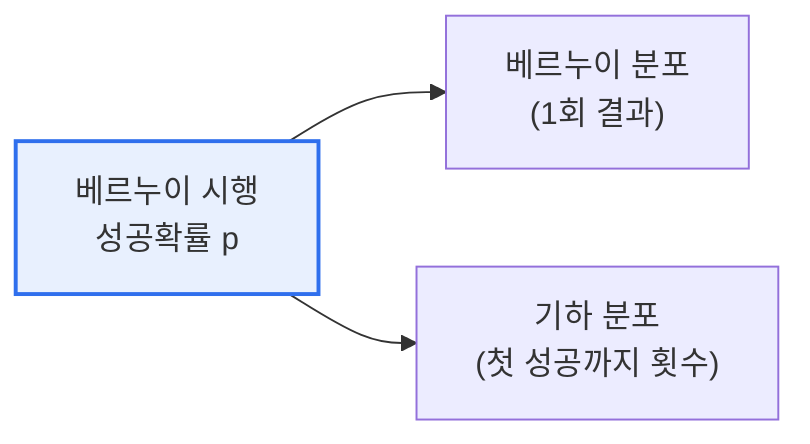

# 베르누이 분포와 기하 분포

## 1. 개요

### 가. 정의
> **베르누이 분포**는 성공/실패 두 결과만 갖는 **단 한 번의 시행**에 대한 확률분포이고, **기하 분포**는 성공 확률 p의 시행을 반복할 때 **첫 성공까지 걸린 시행 횟수**에 대한 분포다.

두 분포는 모두 '**베르누이 시행(성공확률 p인 이항 실험)**'에서 출발하지만 보는 관점이 다르다. 베르누이 분포가 "한 번 던졌을 때"를 다룬다면, 기하 분포는 "처음 성공할 때까지 몇 번 던졌나"를 다룬다. 즉 기하 분포는 베르누이 시행을 반복하며 첫 성공을 기다리는 대기 시간의 개념이다.

## 2. 분포 비교

| 구분 | 베르누이 분포 | 기하 분포 |
|---|---|---|
| **대상** | 1회 시행의 성공/실패 | 첫 성공까지의 시행 횟수 |
| **확률질량** | P(X=1)=p, P(X=0)=1−p | P(X=k)=(1−p)^(k−1)·p |
| **기댓값** | E(X)=p | E(X)=1/p |
| **분산** | p(1−p) | (1−p)/p² |
| **예시** | 동전 1회 앞면 여부 | 첫 앞면이 나올 때까지 던진 횟수 |

## 3. 관련 분포와의 관계

| 분포 | 관계 |
|---|---|
| **이항 분포** | 베르누이 시행 n회 중 성공 횟수 |
| **음이항 분포** | r번째 성공까지의 시행 횟수(기하 분포 일반화) |
| **포아송 분포** | 단위 시간·공간당 발생 횟수 |

## 4. 시사점
- 기하 분포는 **무기억성(Memoryless)** — 과거 실패가 미래에 영향 없음
- 신뢰성·대기행렬·A/B 테스트(첫 전환까지) 등에 활용
- 베르누이→이항→기하→음이항의 관계 이해가 확률 모델링 기초

---

> **한 줄 요약**: 베르누이 분포는 *1회 시행의 성공/실패(기댓값 p)*, 기하 분포는 *첫 성공까지의 시행 횟수(기댓값 1/p)* 를 나타내며, 둘 다 베르누이 시행에서 출발하나 관점(1회 vs 첫 성공 대기)이 다르다.
