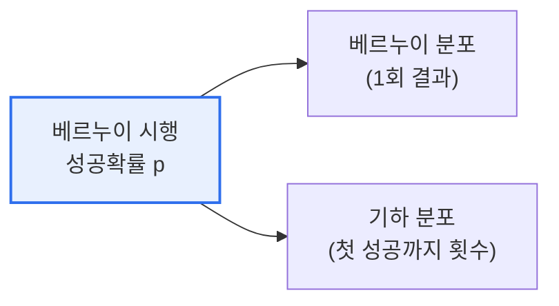

# 베르누이 분포와 기하 분포

## 1. 개요

### 가. 정의
> **베르누이 분포**는 성공/실패 두 결과만 갖는 **단 한 번의 시행**에 대한 확률분포이고, **기하 분포**는 성공 확률 p의 시행을 반복할 때 **첫 성공이 나올 때까지 걸린 시행 횟수**에 대한 분포다.

두 분포는 모두 '**베르누이 시행**'(성공 확률이 p로 일정한 독립 시행)에서 출발하지만, 무엇을 확률변수로 보느냐가 다르다. 베르누이 분포는 "동전을 한 번 던졌을 때 앞면인가"처럼 **1회 시행의 결과**에 주목한다. 기하 분포는 "앞면이 처음 나올 때까지 몇 번 던져야 하는가"처럼 **첫 성공까지의 대기 시간(횟수)** 에 주목한다. 즉 기하 분포는 베르누이 시행을 성공할 때까지 반복하며 기다리는 상황을 모델링한다. 이 관점 차이를 이해하면, 두 분포가 어떻게 이항 분포·음이항 분포로 확장되는지도 자연스럽게 연결된다.

### 나. 필요성
성공/실패로 나뉘는 이항적 현상(합격 여부, 불량 여부, 전환 여부)은 현실에 매우 흔하다. 베르누이·기하 분포는 이런 현상을 확률적으로 다루는 가장 기본적인 도구로, 신뢰성 분석·품질관리·A/B 테스트 등의 기초가 된다.

## 2. 분포 비교

두 분포의 확률·기댓값·분산을 비교하면 관점 차이가 수식으로 드러난다. 베르누이 분포는 성공 확률 p 그 자체가 기댓값이 되고, 기하 분포는 성공 확률이 p일 때 평균적으로 1/p번 시행해야 첫 성공이 나온다(p가 작을수록 오래 기다림). 예를 들어 앞면 확률이 1/2인 동전은 평균 2번, 주사위에서 6이 나올 확률(1/6)은 평균 6번 던져야 한다.

| 구분 | 베르누이 분포 | 기하 분포 |
|---|---|---|
| **대상** | 1회 시행의 성공/실패 | 첫 성공까지의 시행 횟수 |
| **확률질량** | P(X=1)=p, P(X=0)=1−p | P(X=k)=(1−p)^(k−1)·p |
| **기댓값** | E(X)=p | E(X)=1/p |
| **분산** | p(1−p) | (1−p)/p² |
| **예시** | 동전 1회 앞면 여부 | 첫 앞면까지 던진 횟수 |

## 3. 관련 분포와의 관계

베르누이 시행은 여러 분포의 출발점이다. 이 계보를 이해하면 상황에 맞는 분포를 고를 수 있다.

| 분포 | 관계 |
|---|---|
| **이항 분포** | 베르누이 시행 n회 중 성공 횟수 |
| **음이항 분포** | r번째 성공까지의 시행 횟수(기하 분포의 일반화) |
| **포아송 분포** | 단위 시간·공간당 사건 발생 횟수(이항의 극한) |

## 4. 고려사항 및 시사점

1. **기하 분포의 무기억성(Memoryless)** 이 중요한 특성이다. 이미 여러 번 실패했더라도 다음 시행의 성공 확률은 여전히 p로 동일하다. 과거가 미래에 영향을 주지 않는다는 이 성질은 지수 분포(연속판)와 함께 대기·신뢰성 모델의 핵심이다.
2. **실무 활용이 넓다**. 제품의 첫 고장까지 시간(신뢰성), 고객이 첫 구매(전환)에 이르기까지의 시도, 대기행렬 분석 등에 쓰인다.
3. **베르누이→이항→기하→음이항의 계보 이해**가 확률 모델링의 기초다. 현상이 '1회인가, n회 중 성공 수인가, 첫 성공까지인가, r번째 성공까지인가'를 구분해 적절한 분포를 선택해야 한다.

---

> **한 줄 요약**: 베르누이 분포는 *1회 시행의 성공/실패(기댓값 p)*, 기하 분포는 *첫 성공까지의 시행 횟수(기댓값 1/p, 무기억성)* 를 나타내며, 둘 다 베르누이 시행에서 출발하나 관점(1회 vs 첫 성공 대기)이 다르고 이항·음이항 분포로 확장된다.
