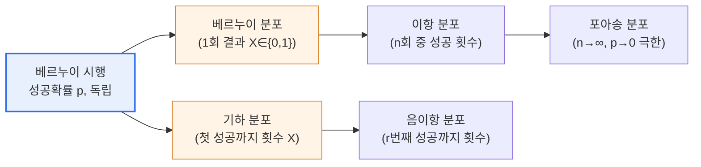
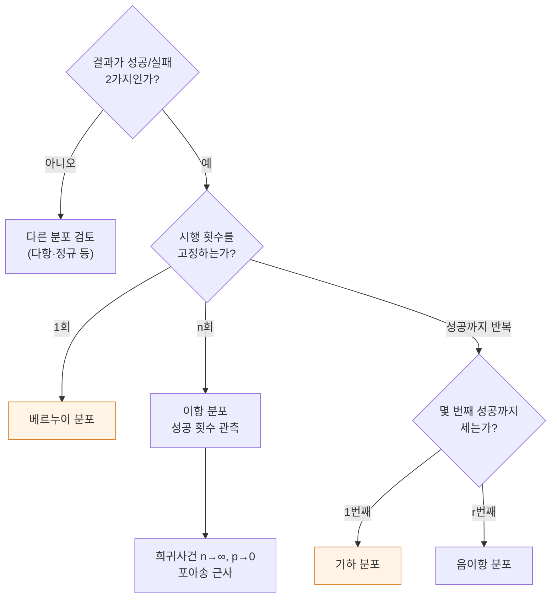

# 베르누이 분포와 기하 분포

## 1. 개요

### 가. 정의
> **베르누이 분포(Bernoulli distribution)** 는 성공/실패 두 결과만 갖는 **단 한 번의 시행**에 대한 이산확률분포이고, **기하 분포(Geometric distribution)** 는 성공 확률 p인 베르누이 시행을 반복할 때 **첫 성공이 나올 때까지 걸린 시행 횟수**에 대한 이산확률분포다.

두 분포는 모두 '**베르누이 시행(Bernoulli trial)**'에서 출발한다. 베르누이 시행이란 ① 결과가 성공·실패 두 가지뿐이고, ② 각 시행의 성공 확률 p가 일정하며, ③ 시행들이 서로 독립인 확률 실험을 말한다. 동전 던지기, 제품의 양·불량 판정, 광고 클릭 여부처럼 "예/아니오"로 답할 수 있는 현상은 모두 베르누이 시행으로 볼 수 있다. 이 공통의 토대 위에서 **"무엇을 확률변수로 관측하느냐"** 가 두 분포를 가른다.

베르누이 분포는 "동전을 한 번 던졌을 때 앞면인가"처럼 **1회 시행의 결과 그 자체**에 주목한다. 확률변수 X는 성공이면 1, 실패면 0을 갖는 지시변수(indicator variable)이며, 관측 대상은 결과의 값이다. 반면 기하 분포는 "앞면이 처음 나올 때까지 몇 번을 던져야 하는가"처럼 **첫 성공까지의 대기 시간(시행 횟수)** 에 주목한다. 즉 기하 분포는 동일한 베르누이 시행을 성공할 때까지 반복하며 기다리는 상황을 모델링한다. 하나는 '결과'를, 다른 하나는 '기다림의 길이'를 재는 것이다.

이 관점 차이를 명확히 하면, 두 분포가 어떻게 이항 분포·음이항 분포로 확장되는지도 자연스럽게 연결된다. 베르누이 분포에서 시행 횟수 n을 늘려 '성공 횟수'를 세면 이항 분포가 되고, 기하 분포에서 '첫 성공'을 'r번째 성공'으로 일반화하면 음이항 분포가 된다. 다시 말해 네 분포는 모두 하나의 베르누이 시행이라는 뿌리에서 뻗어 나온 한 계보이며, 현상을 '1회인가·성공 수인가·첫 성공까지인가·r번째 성공까지인가'로 분류하면 어느 분포를 써야 할지 결정할 수 있다.

### 나. 등장 배경과 필요성
성공/실패로 나뉘는 이항적(binary) 현상은 현실에 지극히 흔하다. 합격 여부, 부품의 불량 여부, 웹사이트 방문자의 구매 전환 여부, 임상시험에서 약효 반응 여부가 모두 여기에 속한다. 이런 현상을 눈대중이 아니라 확률적으로 다루려면, 결과를 수(0/1)로 표현하고 그 분포의 기댓값·분산을 계산할 수 있는 수학적 모델이 필요하다. 베르누이·기하 분포는 그 가장 기본적인 도구다.

특히 기하 분포는 **"처음 성공하기까지 얼마나 걸리는가"** 라는 대기(waiting) 문제를 다룬다. 제품이 처음 고장 날 때까지의 사이클 수(신뢰성), 신규 고객이 처음 결제에 이르기까지의 방문 횟수(마케팅 퍼널), 콜센터에서 상담원이 연결될 때까지의 재시도 횟수(대기행렬) 등이 모두 첫 성공까지의 대기 문제다. 베르누이 분포가 '한 번의 판정'을 다룬다면, 기하 분포는 '반복 속에서의 첫 성공'을 다루므로, 두 분포는 품질관리·신뢰성 분석·A/B 테스트·대기행렬 이론의 확률적 기초가 된다.

## 2. 두 분포의 계보와 관측 관점

먼저 베르누이 시행이라는 하나의 뿌리에서 두 분포가 어떻게 갈라지는지를 구조로 정리한다. 아래 그림은 관측 대상(1회 결과 vs 첫 성공까지의 횟수)에 따라 분포가 나뉘고, 다시 이항·음이항으로 확장되는 전체 계보를 보여준다.

```mermaid
flowchart LR
  B["베르누이 시행<br/>성공확률 p, 독립"] --> BE["베르누이 분포<br/>(1회 결과 X∈{0,1})"]
  B --> GE["기하 분포<br/>(첫 성공까지 횟수 X)"]
  BE --> BN["이항 분포<br/>(n회 중 성공 횟수)"]
  GE --> NB["음이항 분포<br/>(r번째 성공까지 횟수)"]
  BN --> PO["포아송 분포<br/>(n→∞, p→0 극한)"]
  style B fill:#e8f0fe,stroke:#2f6fed,stroke-width:2px
  style BE fill:#fff4e5,stroke:#d9822b
  style GE fill:#fff4e5,stroke:#d9822b
```

이 계보의 핵심은 **관측의 방향**이다. 베르누이·이항 분포는 "시행 횟수를 고정하고 성공 횟수를 센다"는 방향(횟수 고정 → 성공 관측)인 반면, 기하·음이항 분포는 "성공 횟수를 고정하고 그때까지의 시행 횟수를 센다"는 반대 방향(성공 고정 → 횟수 관측)이다. 예컨대 "10문항 중 몇 개를 맞히나"는 이항, "처음 맞힐 때까지 몇 문항을 푸나"는 기하다. 같은 시험을 두고도 무엇을 미지수로 두느냐에 따라 모델이 달라진다는 점이 실무에서 분포를 잘못 고르는 흔한 원인이므로, 이 방향성을 먼저 확정하는 습관이 중요하다.

### 가. 베르누이 분포 — 1회 시행의 지시변수
베르누이 분포는 가장 단순한 이산분포다. 확률변수 X는 성공(1)과 실패(0) 두 값만 가지며, 확률질량함수는 P(X=1)=p, P(X=0)=1−p, 이를 한 식으로 쓰면 P(X=x)=pˣ(1−p)¹⁻ˣ (x=0,1)이다. 기댓값은 E(X)=0·(1−p)+1·p=p로, 성공 확률 그 자체가 평균이 된다. 분산은 Var(X)=p(1−p)이며, p=0.5일 때 0.25로 최대가 되고 p가 0이나 1에 가까울수록 0에 수렴한다. 이는 성공 확률이 극단적일수록 결과의 불확실성(변동)이 작아진다는 직관과 일치한다.

베르누이 분포의 진정한 위력은 **더 복잡한 분포의 building block**이라는 데 있다. 독립인 베르누이 확률변수 n개를 더하면 이항 분포가 되고, 이 사실은 통계학의 여러 정리를 유도하는 출발점이 된다. 예를 들어 불량률 p=0.02인 생산 라인에서 한 개를 뽑아 불량 여부를 보는 것은 베르누이 시행이며, 100개를 뽑아 불량 개수를 세면 이항 분포 B(100, 0.02)가 된다.

실무 예로 A/B 테스트를 보자. 특정 사용자가 버튼을 클릭할 확률이 p=0.12라면, 개별 사용자의 클릭 여부는 베르누이(0.12)를 따른다. 전환율(conversion rate)이라는 지표는 결국 다수의 베르누이 시행 평균이며, 표본 클릭률의 표준오차가 √(p(1−p)/n)로 계산되는 근거가 바로 베르누이 분산 p(1−p)이다. 즉 베르누이 분포를 이해해야 "표본을 얼마나 모아야 통계적으로 유의한 차이를 잡아낼 수 있는가"라는 검정력·표본크기 계산으로 나아갈 수 있다.

### 나. 기하 분포 — 첫 성공까지의 대기
기하 분포의 확률변수 X는 "첫 성공이 나온 시행의 순번"이며, 확률질량함수는 P(X=k)=(1−p)ᵏ⁻¹·p (k=1,2,3,…)이다. 이 식은 "앞의 (k−1)번은 모두 실패((1−p)ᵏ⁻¹)하고 k번째에 성공(p)한다"는 사건을 그대로 옮긴 것이라 해석이 명료하다. 기댓값은 E(X)=1/p로, 성공 확률이 p일 때 평균적으로 1/p번 시행해야 첫 성공에 이른다. 분산은 Var(X)=(1−p)/p²이다.

이 기댓값 1/p는 매우 직관적이다. 앞면 확률 1/2인 동전은 평균 2번, 주사위에서 6이 나올 확률(1/6)은 평균 6번을 던져야 처음 성공한다. p가 작을수록 1/p가 커지므로 "드문 사건일수록 오래 기다려야 한다"는 상식과 정확히 맞는다. 다만 기하 분포는 **오른쪽으로 길게 꼬리를 끄는 비대칭 분포**라는 점에 주의해야 한다. 평균이 6이라 해서 6번 근처에서 대부분 성공하는 것이 아니라, 소수의 경우 훨씬 더 오래 기다릴 수 있어 분산이 (1−p)/p²=(5/6)/(1/36)=30으로 매우 크다. 평균만 보고 계획을 세우면 꼬리 위험(long tail)을 놓치므로, 실무에서는 "95% 확률로 몇 번 안에 성공하는가" 같은 분위수(quantile)를 함께 봐야 한다.

정의에 두 가지 관례가 있다는 점도 유의할 필요가 있다. 여기서처럼 **첫 성공까지의 총 시행 횟수 X(=1,2,3,…)** 로 정의하면 E(X)=1/p이지만, **첫 성공 이전의 실패 횟수 Y(=0,1,2,…)** 로 정의하는 관례도 널리 쓰이며 이때는 E(Y)=(1−p)/p가 된다(Y=X−1). 두 정의는 관측 시작점이 1이냐 0이냐의 차이일 뿐 본질은 같지만, 시험 답안이나 소프트웨어(예: NumPy·R의 함수)에서 어느 관례인지 반드시 확인해야 값이 어긋나지 않는다.

### 다. 확률·기댓값·분산 비교
두 분포의 확률·기댓값·분산을 나란히 비교하면 관점 차이가 수식으로 드러난다. 아래 표는 그 요약이며, 표 뒤에 각 값의 의미를 다시 문장으로 짚는다.

| 구분 | 베르누이 분포 | 기하 분포 |
|---|---|---|
| **관측 대상** | 1회 시행의 성공/실패 | 첫 성공까지의 시행 횟수 |
| **확률질량함수** | P(X=1)=p, P(X=0)=1−p | P(X=k)=(1−p)^(k−1)·p |
| **표본공간** | X ∈ {0, 1} | X ∈ {1, 2, 3, …} |
| **기댓값** | E(X)=p | E(X)=1/p |
| **분산** | p(1−p) | (1−p)/p² |
| **대표 특성** | 지시변수·이항의 기본단위 | 무기억성(memoryless) |
| **예시** | 동전 1회 앞면 여부 | 첫 앞면까지 던진 횟수 |

표에서 눈여겨볼 대비는 기댓값이 **p ↔ 1/p** 로 역수 관계를 이룬다는 점이다. 성공 확률이 높으면(베르누이 평균이 크면) 첫 성공을 빨리 만나므로(기하 평균이 작으므로) 둘은 반대로 움직인다. 또 베르누이의 분산은 p=0.5에서 최대인 유한한 값(0.25)이지만, 기하의 분산은 p가 0에 가까워질수록 무한대로 발산한다. 이는 "드문 성공을 기다리는 상황"의 불확실성이 본질적으로 크다는 것을 뜻하며, 신뢰성·대기행렬 설계에서 여유(buffer)를 넉넉히 잡아야 하는 통계적 이유가 된다.

## 3. 관련 분포와의 확장 관계

베르누이 시행은 여러 분포의 출발점이다. 이 계보를 처리 흐름으로 보면 상황에 맞는 분포를 고르는 판단 기준이 분명해진다. 아래 다이어그램은 "무엇을 고정하고 무엇을 관측하는가"라는 질문에 따라 분포가 선택되는 절차를 나타낸다.

```mermaid
flowchart TB
  Q0{"결과가 성공/실패<br/>2가지인가?"} -->|아니오| ETC["다른 분포 검토<br/>(다항·정규 등)"]
  Q0 -->|예| Q1{"시행 횟수를<br/>고정하는가?"}
  Q1 -->|"1회"| BER["베르누이 분포"]
  Q1 -->|"n회"| BIN["이항 분포<br/>성공 횟수 관측"]
  Q1 -->|"성공까지 반복"| Q2{"몇 번째 성공까지<br/>세는가?"}
  Q2 -->|"1번째"| GEO["기하 분포"]
  Q2 -->|"r번째"| NEG["음이항 분포"]
  BIN --> POI["희귀사건 n→∞, p→0<br/>포아송 근사"]
  style BER fill:#fff4e5,stroke:#d9822b
  style GEO fill:#fff4e5,stroke:#d9822b
```

이 계보를 표로 정리하면 다음과 같으며, 각 관계의 '왜'를 이어서 설명한다.

| 분포 | 관계 | 대표 파라미터 |
|---|---|---|
| **이항 분포** | 베르누이 시행 n회 중 성공 횟수 | n, p |
| **음이항 분포** | r번째 성공까지의 시행 횟수(기하의 일반화, r=1이면 기하) | r, p |
| **포아송 분포** | 단위 시간·공간당 사건 발생 횟수(이항의 극한) | λ=np |
| **지수 분포** | 기하 분포의 연속판(첫 사건까지의 대기 시간) | λ |

**이항 분포**는 베르누이의 자연스러운 합이다. 동일한 베르누이(p) 시행을 n번 하고 성공 횟수 S=X₁+…+Xₙ을 세면 S~B(n,p)이고, 기댓값 np·분산 np(1−p)는 각 베르누이의 기댓값·분산을 n배 한 것이다. **음이항 분포**는 기하 분포를 "r번째 성공까지"로 일반화한 것으로, r=1이면 정확히 기하 분포가 된다. **포아송 분포**는 n이 매우 크고 p가 매우 작아 np=λ가 일정할 때 이항의 극한으로 얻어지며, 콜 도착·결함 발생처럼 '드문 사건의 개수'를 셀 때 쓴다. 마지막으로 **지수 분포**는 기하 분포의 연속 시간판으로, 둘 다 무기억성을 공유한다는 점에서 짝을 이룬다. 이처럼 하나의 베르누이 시행에서 이산·연속을 아우르는 분포 가족이 파생된다는 사실이 확률 모델링의 골격이다.

## 4. 무기억성과 실무 적용 사례

기하 분포의 가장 특징적인 성질은 **무기억성(Memoryless property)** 이다. 수식으로는 P(X>m+n | X>m)=P(X>n)으로 표현되는데, "이미 m번 실패한 상태에서 앞으로 n번을 더 기다려야 할 확률"이 "처음부터 n번을 기다릴 확률"과 같다는 뜻이다. 즉 과거의 실패 이력은 미래의 성공 확률에 아무 영향을 주지 않는다. 이산분포 중 무기억성을 갖는 것은 기하 분포가 유일하고, 연속분포 중에서는 지수 분포가 유일하다.

이 성질은 직관과 어긋나 보이기 때문에 실무에서 오해를 부른다. 예컨대 공정한 동전을 여섯 번 던져 모두 뒷면이 나왔다고 해서 "이제 앞면이 나올 때가 됐다"고 믿는 것은 **도박사의 오류(Gambler's fallacy)** 다. 각 시행이 독립이므로 다음 던지기의 앞면 확률은 여전히 1/2일 뿐이다. 무기억성은 바로 이 독립성의 다른 표현이며, 이를 이해해야 신뢰성·대기행렬 모델을 올바르게 세울 수 있다. 다만 현실의 많은 시스템(마모되는 부품, 학습으로 개선되는 전환율)은 시행이 독립이 아니어서 무기억성이 성립하지 않으므로, 모델을 적용하기 전에 "성공 확률 p가 정말 일정한가"를 먼저 점검해야 한다.

실무 적용 사례는 넓다. **첫째, 소프트웨어 품질에서의 결함 검출**이다. 한 번의 테스트 케이스가 특정 결함을 잡아낼 확률이 p=0.3이라면, 그 결함을 처음 재현하기까지 필요한 테스트 횟수는 기하 분포를 따르고 평균 1/0.3≈3.3회다. **둘째, 네트워크 재전송**이다. 패킷 전송 성공 확률이 p=0.9인 링크에서 첫 성공 전송까지의 시도 횟수는 기하 분포로, 평균 1/0.9≈1.11회지만 손실률이 높아져 p=0.5가 되면 평균 2회로 급증한다. **셋째, 마케팅 전환**이다. 방문당 구매 전환율 p=0.05이면 한 명이 처음 결제하기까지 평균 20회 방문이 필요하다는 계산이 나오며, 이는 리타게팅 광고의 노출 예산을 설계하는 근거가 된다. 세 사례 모두 '1/p'라는 간단한 식이 자원 계획으로 직결됨을 보여준다.

## 5. 심화 — 예상 출제 방향과 답안 구성 전략

정보관리기술사 시험에서 확률분포는 단독 계산 문제보다는 **"두 분포의 차이를 설명하고 실무 적용을 논하라"** 는 서술형으로 자주 출제된다(예: 130회 등 통계 관련 회차). 따라서 답안은 ① 두 분포의 정의와 확률질량함수를 정확히 제시하고, ② 기댓값·분산을 유도 또는 비교하며, ③ 베르누이→이항→기하→음이항의 계보로 확장 관계를 그림과 함께 설명한 뒤, ④ 무기억성 같은 핵심 특성과 도박사의 오류 같은 함정을 구체 사례로 마무리하는 4단 구성이 효과적이다.

특히 채점자가 변별력을 두는 지점은 **"관점의 차이(1회 결과 vs 첫 성공까지의 대기)"를 명확히 언어화했는가**와 **기댓값 p↔1/p의 대비를 수치 예시로 설명했는가**이다. 단순히 공식을 나열하면 감점 요인이 되므로, 동전(p=1/2, 평균 2회)·주사위(p=1/6, 평균 6회)처럼 즉시 검증 가능한 예를 넣어 논지의 신뢰도를 높이는 것이 좋다. 또한 A/B 테스트의 표본크기 계산, 네트워크 재전송, 신뢰성 분석 등 IT 실무와 연결하면 '기술사 관점'이 드러나 고득점에 유리하다.

최근에는 데이터 분석·머신러닝 맥락에서 이 분포들이 다시 조명된다. 로지스틱 회귀는 각 관측치를 베르누이 확률변수로 보고 그 로그가능도(log-likelihood)를 최대화하는 모델이며, 강화학습의 탐색(exploration)에서 첫 보상까지의 시도 횟수를 기하 분포로 모형화하기도 한다. 이런 최신 응용을 한두 문장 덧붙이면 개념이 이론에 머물지 않고 현행 기술과 연결됨을 보일 수 있다.

## 6. 고려사항 및 시사점

1. **분포 선택은 '관측 방향'에서 시작한다.** 현상이 '1회 결과인가·n회 중 성공 수인가·첫 성공까지인가·r번째 성공까지인가'를 먼저 확정해야 베르누이·이항·기하·음이항 중 옳은 모델을 고를 수 있다. 방향을 혼동하면 기댓값·분산 계산 전체가 어긋나므로, 모델링의 첫 단추로 다뤄야 한다.

2. **가정(독립·일정한 p)의 검증이 적용의 전제다.** 두 분포 모두 각 시행이 독립이고 성공 확률 p가 일정해야 성립한다. 마모되는 부품이나 학습으로 개선되는 전환율처럼 p가 변하거나 시행이 종속인 상황에서는 무기억성이 깨지므로, 비동차 모델(시간 의존 p)이나 생존분석 기법으로 대체해야 한다.

3. **평균만 보지 말고 분산·꼬리를 함께 본다.** 기하 분포는 오른쪽으로 긴 꼬리를 갖는 비대칭 분포여서 평균(1/p) 근처에 값이 몰리지 않는다. 신뢰성·대기행렬·SLA 설계에서는 평균 대기 대신 95·99 분위수를 기준으로 여유 용량을 산정해야 꼬리 위험을 통제할 수 있다.

4. **계보(가족) 관점이 응용을 넓힌다.** 베르누이는 이항·로지스틱 회귀로, 기하는 음이항·지수 분포로, 이항은 포아송으로 이어진다. 개별 분포를 낱개로 외우기보다 하나의 베르누이 시행에서 파생되는 가족으로 이해하면, A/B 테스트·품질관리·신뢰성·강화학습 등 서로 다른 도메인의 문제를 일관된 틀로 풀 수 있다.

5. **도박사의 오류를 경계한다.** 무기억성은 곧 독립성이므로, 연속된 실패가 다음 성공 확률을 높인다는 통념은 잘못이다. 이 오해는 품질·리스크 의사결정을 왜곡하므로, 데이터에 기반한 확률 해석을 조직 문화로 정착시키는 것이 중요하다.

## 참고자료
- NIST/SEMATECH e-Handbook of Statistical Methods — https://www.itl.nist.gov/div898/handbook/eda/section3/eda366.htm
- Wikipedia, "Geometric distribution" — https://en.wikipedia.org/wiki/Geometric_distribution
- Wikipedia, "Bernoulli distribution" — https://en.wikipedia.org/wiki/Bernoulli_distribution

---

> **한 줄 요약**: 베르누이 분포는 *1회 시행의 성공/실패(기댓값 p, 분산 p(1−p))*, 기하 분포는 *첫 성공까지의 시행 횟수(기댓값 1/p, 무기억성)* 를 나타내며, 둘 다 베르누이 시행에서 출발하나 '결과 관측'과 '대기 관측'이라는 관점이 다르고 이항·음이항·포아송·지수 분포로 확장되는 하나의 분포 가족을 이룬다.
