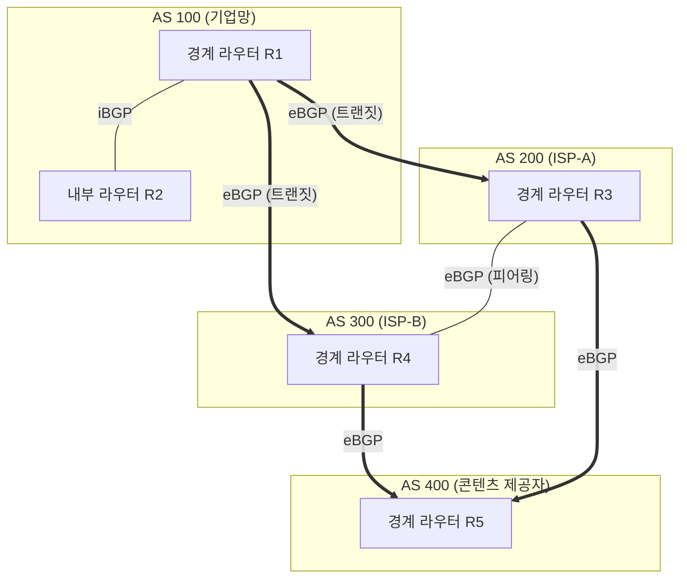
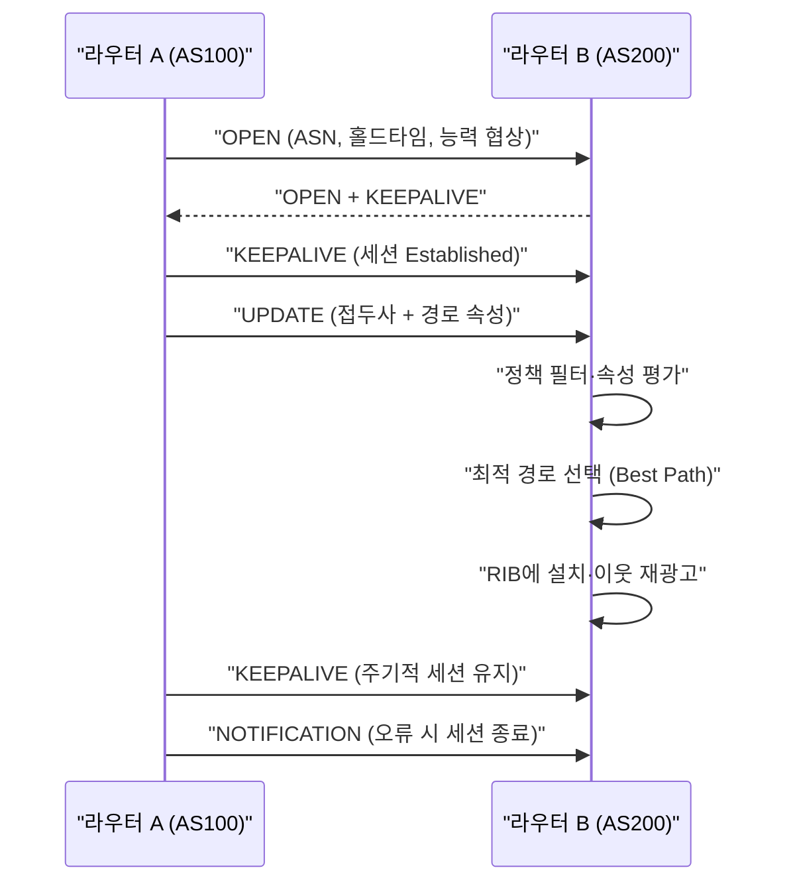

# BGP(Border Gateway Protocol, 경계 경로 프로토콜)

## 1. 개요

> **BGP(Border Gateway Protocol)** 는 서로 다른 관리 주체(자율 시스템, AS)들이 인터넷 상에서 도달 가능한 네트워크 접두사(Prefix)와 그 경로 정보를 교환하기 위해 사용하는 **경로 벡터(Path Vector) 기반의 표준 외부 라우팅 프로토콜(EGP)** 로, 현재 인터넷의 골격을 이루는 사실상 유일한 도메인 간 라우팅 프로토콜이다(현행 표준 BGP-4는 RFC 4271).

BGP가 등장한 근본 배경은 **인터넷의 규모와 자율성(Autonomy)** 이다. 인터넷은 하나의 조직이 통제하는 단일 네트워크가 아니라, 통신사·기업·클라우드·연구망 등 수만 개의 독립된 운영 주체가 각자의 정책에 따라 운영하는 네트워크의 집합이다. 이러한 각 운영 단위를 **자율 시스템(AS, Autonomous System)** 이라 부르며, 하나의 관리 정책과 라우팅 전략을 공유하는 라우터 집합이 하나의 AS 번호(ASN)로 식별된다. OSPF·RIP 같은 내부 라우팅 프로토콜(IGP)은 하나의 AS 내부에서 최단 경로를 계산하는 데 최적화되어 있어, 수십만 개의 접두사와 정책적 이해관계가 얽힌 AS 간 라우팅에는 근본적으로 부적합하다. BGP는 바로 이 **AS와 AS 사이의 경로 결정**을 담당하기 위해 고안되었다.

두 번째 배경은 **라우팅이 단순한 최단 경로 문제가 아니라 정책(Policy)의 문제**라는 인식이다. AS 간 관계는 비용·계약·신뢰 수준에 따라 고객(Customer)·공급자(Provider)·피어(Peer)로 나뉘며, "물리적으로 더 짧은 경로"보다 "정산 비용이 낮고 계약상 허용된 경로"가 우선될 때가 많다. 예컨대 국내 A통신사가 해외 목적지로 트래픽을 보낼 때, 홉 수가 더 적더라도 정산료가 비싼 트랜짓(Transit) 경로 대신, 무정산으로 연결된 피어링(Peering) 경로를 선호하는 것이 전형적이다. IGP의 메트릭(홉 수·대역폭·지연)만으로는 이런 상업적·정책적 선호를 표현할 수 없기 때문에, BGP는 다양한 경로 속성(Attribute)을 통해 정책을 세밀하게 반영하도록 설계되었다. 정보관리기술사 관점에서 BGP는 "경로를 계산하는 알고리즘"이라기보다 **"정책을 경로에 투영하는 프레임워크"** 로 이해해야 한다.

세 번째 배경은 **확장성과 안정성**이다. 전 세계 라우팅 테이블(Global Routing Table)의 IPv4 경로 수는 이미 약 95만 개(2024년 기준, 시점별 증가) 규모로 커졌고 계속 증가하고 있다. BGP는 거리 벡터의 무한 루프 문제를 AS 경로(AS_PATH)라는 전체 경로 기록으로 원천 차단하고, 변경분만 증분 전달(Incremental Update)하며, 신뢰성 있는 TCP(179번 포트) 위에서 동작해 대규모 경로 정보를 안정적으로 주고받는다. 다만 이 방대한 규모는 곧 라우팅 테이블 비대화·수렴 지연·경로 하이재킹 같은 운영 과제로 이어진다.

BGP의 핵심 특징을 먼저 정리하면 다음과 같다.

| 구분 | 내용 |
|------|------|
| 프로토콜 유형 | 경로 벡터(Path Vector), EGP(외부 게이트웨이 프로토콜) |
| 전송 계층 | TCP 179번 포트(신뢰성·순서 보장) |
| 라우팅 단위 | AS(자율 시스템), ASN(16비트→32비트 확장, RFC 6793) |
| 경로 선택 | 정책 기반(Attribute) 최적 경로 결정, 최단 경로 아님 |
| 루프 방지 | AS_PATH에 자신의 AS 존재 시 경로 폐기 |
| 갱신 방식 | 초기 전체 교환 후 변경분만 증분 갱신(Keepalive로 세션 유지) |

## 2. BGP 전체 구조와 동작 개념

아래는 여러 AS가 BGP로 연결된 인터넷의 전체 구조를 나타낸 개념도이다. AS 경계 라우터는 eBGP로 다른 AS와, iBGP로 자기 AS 내부 라우터와 경로를 교환하며, 정책에 따라 경로를 선별해 전파한다.

**가. AS(자율 시스템)와 ASN의 의미.** AS는 단일 기술·관리 정책 아래 운영되는 라우터·네트워크의 집합으로, 인터넷에서 라우팅 정책을 표현하는 최소 단위다. 각 AS는 지역 인터넷 레지스트리(RIR)로부터 고유한 **AS 번호(ASN)** 를 할당받는데, 초기 16비트(약 6.5만 개) 체계가 고갈되면서 현재는 **32비트 ASN(RFC 6793, 약 42억 개)** 로 확장되었다. ASN은 크게 인터넷 전역에서 유일해야 하는 공인 ASN과, 사설 용도로 쓰이는 사설 ASN(64512~65534 등)으로 나뉜다. 예컨대 국내 KT는 AS4766, 구글은 AS15169처럼 잘 알려진 ASN을 보유하며, 라우팅 문제를 진단할 때 AS_PATH에 나타나는 이 번호들을 추적해 트래픽이 어느 사업자를 경유하는지 파악한다. 이처럼 ASN은 단순한 식별자가 아니라 인터넷의 상업적·정책적 지형을 읽는 좌표 역할을 한다.

**나. eBGP와 iBGP의 구분.** BGP는 세션이 맺어지는 상대가 다른 AS인지 같은 AS인지에 따라 **eBGP(external BGP)** 와 **iBGP(internal BGP)** 로 구분된다. eBGP는 서로 다른 AS의 경계 라우터 간에 형성되며, 통상 물리적으로 직접 연결된 이웃과 맺어지고 광고 시 AS_PATH에 자신의 ASN을 추가한다. 반면 iBGP는 동일 AS 내부 라우터 간에 외부에서 학습한 경로를 공유하기 위한 세션으로, AS_PATH를 변경하지 않는다. 여기서 중요한 원리는 **iBGP 스플릿 호라이즌(Split Horizon)** 규칙이다 — iBGP로 배운 경로는 다른 iBGP 이웃에게 재광고하지 않아 루프를 막는데, 그 결과 AS 내부의 모든 BGP 라우터가 서로 경로를 공유하려면 원칙적으로 **완전 연결(Full Mesh)** 이 필요해진다. n대의 라우터는 n(n-1)/2개의 세션이 필요하므로, 규모가 커지면 이 요구가 폭증한다. 이 확장성 문제를 풀기 위해 뒤에서 설명할 **경로 반사기(Route Reflector)** 와 **연합(Confederation)** 이 도입되었다.

**다. 경로 벡터(Path Vector) 방식의 원리.** BGP는 거리 벡터(Distance Vector)의 변형인 경로 벡터 방식을 쓴다. 거리 벡터가 "목적지까지의 거리(홉 수)"만 전달해 카운트-투-인피니티(Count-to-Infinity) 루프에 취약했던 반면, BGP는 경로가 거쳐 온 **AS의 전체 목록(AS_PATH)** 을 함께 전달한다. 라우터는 수신한 경로의 AS_PATH에 자신의 ASN이 이미 들어 있으면 그 경로가 자신을 한 번 거쳐 되돌아온 것으로 판단해 즉시 폐기한다. 이 단순하면서 강력한 규칙이 도메인 간 라우팅의 루프를 근본적으로 차단한다. 예컨대 AS100이 광고한 접두사가 AS200→AS300을 거쳐 다시 AS100으로 돌아오면, AS100은 AS_PATH에서 자신을 발견하고 그 경로를 버려 루프를 방지한다.

BGP 세션은 다음과 같은 유한 상태 기계(FSM)를 거쳐 수립·유지된다.

| 상태 | 의미 |
|------|------|
| Idle | 세션 시작 전 대기, BGP 프로세스 초기화 |
| Connect / Active | TCP 179 연결 시도(Connect 실패 시 Active로 재시도) |
| OpenSent / OpenConfirm | Open 메시지 교환·파라미터(ASN·홀드타임) 협상 |
| Established | 세션 확립, Update로 경로 교환 시작 |

## 3. BGP 메시지·경로 속성과 최적 경로 선택 프로세스

BGP의 정책 표현력은 **경로 속성(Path Attribute)** 에서 나온다. 아래는 BGP 이웃이 세션을 맺고 경로를 광고한 뒤, 수신 라우터가 여러 후보 경로 중 하나를 최적 경로로 선택하기까지의 절차를 나타낸 세부 흐름도이다.

**가. 4종 메시지의 역할.** BGP는 네 가지 메시지로 동작한다. **OPEN** 은 세션 수립 시 ASN·홀드타임·지원 능력(Capability)을 협상하고, **UPDATE** 는 도달 가능한 경로(접두사+속성)의 광고와 철회(Withdrawn)를 전달하는 핵심 메시지다. **KEEPALIVE** 는 홀드타임 만료를 막기 위해 주기적으로(기본 홀드 90초, 킵얼라이브 30초) 교환되어 세션 생존을 확인하고, **NOTIFICATION** 은 오류 발생 시 세션을 종료하며 원인 코드를 전달한다. 이처럼 BGP는 TCP의 신뢰성 위에서 최소한의 메시지로 방대한 경로를 증분 관리하도록 설계되어, 초기 한 번만 전체 테이블을 교환하고 이후에는 변경분만 주고받아 대역폭을 절약한다.

**나. 핵심 경로 속성(Attribute).** 경로 속성은 BGP 정책의 언어다. 대표적으로 다음이 있다. **AS_PATH** 는 경로가 거쳐 온 AS 목록으로, 루프 방지와 동시에 경로 길이 비교(짧을수록 선호)에 쓰인다. **NEXT_HOP** 은 해당 접두사에 도달하기 위한 다음 홉 주소다. **LOCAL_PREF(로컬 선호도)** 는 AS 내부에서 특정 외부 경로를 얼마나 선호할지를 나타내는 값으로 클수록 우선되며, 주로 아웃바운드(나가는) 트래픽 경로를 통제한다. **MED(Multi-Exit Discriminator)** 는 이웃 AS에게 "우리 AS로 들어올 때 이 입구를 선호하라"고 힌트를 주는 값으로 작을수록 선호되어 인바운드 트래픽에 영향을 준다. **COMMUNITY** 는 경로에 태그를 붙여 그룹 단위 정책을 적용하게 하는 강력한 도구다. 예컨대 어떤 ISP는 "고객이 특정 커뮤니티 값을 붙이면 그 경로를 특정 지역에만 광고한다"는 식의 자동화된 정책을 운영해, 고객이 스스로 트래픽 엔지니어링을 할 수 있게 한다.

**다. 최적 경로 선택 순서(Best Path Selection).** 동일 접두사에 대해 여러 경로가 학습되면 BGP는 정해진 우선순위에 따라 단 하나의 최적 경로를 고른다. 벤더별로 세부 차이는 있으나 일반적 순서는 다음과 같다.

| 순위 | 기준 | 선호 방향 |
|------|------|-----------|
| 1 | Weight(시스코 로컬 값) | 큰 값 |
| 2 | LOCAL_PREF | 큰 값 |
| 3 | 로컬 생성 경로(자기 AS 발신) | 우선 |
| 4 | AS_PATH 길이 | 짧을수록 |
| 5 | Origin 유형(IGP < EGP < Incomplete) | 낮을수록 |
| 6 | MED | 작을수록 |
| 7 | eBGP > iBGP 경로 | eBGP 우선 |
| 8 | IGP 메트릭(NEXT_HOP까지) | 작을수록 |
| 9 | 더 낮은 Router-ID / 이웃 주소 | 작을수록 |

이 순서가 중요한 이유는, 운영자가 어느 단계의 속성을 조정하느냐에 따라 트래픽 흐름을 정밀하게 설계할 수 있기 때문이다. 예컨대 이중 회선을 가진 기업이 주 회선을 우선 사용하려면, 주 회선으로 들어온 경로의 LOCAL_PREF를 높여 아웃바운드를 통제하고, 인바운드는 백업 회선 광고 시 AS_PATH를 인위적으로 늘리는 **AS_PATH Prepending** 기법으로 덜 선호되게 만든다. 실제 국내 대기업의 멀티홈(Multi-homing) 구성에서 흔히 쓰이는 이 조합은, BGP 최적 경로 선택 순서를 이해하지 못하면 설계할 수 없는 대표적 실무 사례다.

**라. iBGP 확장성 해법.** 앞서 언급한 iBGP Full Mesh 문제는 대규모 AS에서 현실적으로 감당하기 어렵다. **경로 반사기(Route Reflector, RFC 4456)** 는 특정 라우터를 반사기로 지정해, 반사기가 클라이언트에게서 배운 iBGP 경로를 다른 클라이언트에게 대신 전파하도록 함으로써 Full Mesh 요구를 제거한다. **연합(Confederation, RFC 5065)** 은 하나의 큰 AS를 여러 개의 하위 AS로 나눠 내부적으로 eBGP처럼 다루되 외부에는 단일 ASN으로 보이게 하는 방식이다. 두 기법 모두 세션 수를 극적으로 줄여 대규모 사업자망의 iBGP 설계를 가능하게 한다.

## 4. IGP(OSPF/RIP)와의 비교 및 적용 맥락

BGP와 IGP는 경쟁 관계가 아니라 **역할이 다른 상호 보완 프로토콜**이다. IGP는 하나의 AS 내부에서 빠른 수렴과 최단 경로를, BGP는 AS 간에서 정책과 확장성을 담당한다. 실제 네트워크에서는 BGP가 "어느 AS를 통해 나갈지"를 정하고, IGP가 "그 출구까지 내부에서 어떻게 갈지"를 정하는 계층적 협업이 이루어진다.

| 구분 | IGP(OSPF/RIP) | BGP |
|------|---------------|-----|
| 적용 범위 | AS 내부(도메인 내) | AS 간(도메인 간) |
| 알고리즘 | 링크상태(OSPF)·거리벡터(RIP) | 경로 벡터 |
| 경로 기준 | 최단 경로(비용·홉) | 정책 기반 속성 |
| 수렴 속도 | 빠름(초 단위) | 느림(정책 평가·전파 지연) |
| 확장 규모 | 수백~수천 라우터 | 수십만 접두사·수만 AS |
| 전송 | OSPF: IP 프로토콜 89 등 | TCP 179 |

**가. 왜 IGP로 인터넷 전체를 못 다루는가.** OSPF는 링크 상태 데이터베이스를 AS 내 모든 라우터가 공유하고 SPF(다익스트라) 계산을 수행하는데, 전 세계 95만 개 경로를 이 방식으로 처리하려면 메모리·CPU가 감당할 수 없고, 무엇보다 서로 신뢰하지 않는 운영 주체 간에 링크 상태를 통째로 공유한다는 것 자체가 정책·보안상 불가능하다. BGP는 상세한 내부 토폴로지를 감추고 "도달 가능한 접두사와 AS 경로"라는 요약 정보만 교환하므로, 자율성을 지키면서도 인터넷 규모를 감당한다. 이 차이가 곧 "최단 경로 vs 정책 경로"라는 근본적 설계 철학의 분기점이다.

**나. 수렴 속도의 트레이드오프.** BGP는 정책 평가와 단계적 전파, 그리고 라우팅 진동을 억제하는 **경로 감쇠(Route Flap Damping)**, **MRAI(Minimum Route Advertisement Interval)** 타이머 때문에 IGP보다 수렴이 느리다. 이는 안정성을 위해 의도적으로 감수한 트레이드오프다. 인터넷 코어에서 수십만 경로가 초 단위로 요동치면 전 세계가 불안정해지므로, BGP는 "빠른 반응"보다 "안정적 억제"를 택했다. 다만 이 지연은 장애 시 서비스 단절 시간을 늘리므로, **BFD(Bidirectional Forwarding Detection)** 로 링크 장애를 밀리초 단위로 감지해 BGP 세션을 신속히 내리는 보완 기법이 함께 쓰인다.

**다. 실무 통합 구성 사례.** 국내 한 금융회사가 두 곳의 ISP와 멀티홈으로 연결된 데이터센터를 운영한다고 하자. 내부는 OSPF로 서버·라우터 간 최단 경로를 유지하고, 외부 두 ISP와는 각각 eBGP 세션을 맺는다. 평상시에는 LOCAL_PREF로 주 ISP를 통해 나가고, 주 ISP 장애 시 BGP가 경로를 철회(Withdraw)하면 자동으로 백업 ISP 경로로 전환된다. 이때 내부 라우터들은 iBGP로 외부 경로를 공유하되 NEXT_HOP 도달성은 OSPF가 보장한다. 이 구조는 BGP(정책·이중화)와 OSPF(내부 최단경로)의 역할 분담을 보여주는 전형적 산업 사례로, 재해복구(DR)·가용성 설계의 핵심 요소가 된다.

## 5. 심화: BGP 보안 위협과 RPKI 기반 대응

BGP는 인터넷의 근간이지만 **설계 당시 신뢰 기반(Trust-based)** 으로 만들어져 "광고된 경로가 진짜인지"를 검증하지 않는다는 구조적 취약점을 안고 있다. 이 때문에 BGP 보안은 오늘날 인터넷 인프라 보안의 최대 현안 중 하나이며, 기술사 시험에서도 최신 출제 포인트로 부상하고 있다.

**가. 경로 하이재킹(Prefix Hijacking)의 위험.** 어떤 AS가 자신이 보유하지 않은 접두사를, 혹은 더 구체적인(Longer Prefix) 접두사를 광고하면, 최장 접두사 일치 규칙에 따라 전 세계 트래픽이 그 AS로 잘못 흘러갈 수 있다. 2008년 파키스탄 통신사가 유튜브 접두사를 잘못 광고해 전 세계에서 유튜브가 수 시간 마비된 사건, 2018년 아마존 Route53 DNS 트래픽이 하이재킹되어 암호화폐 지갑이 탈취된 사건은 대표적 실제 사례다. 이런 사고는 단순 설정 실수(Route Leak)일 수도, 고의적 공격일 수도 있으며, 신뢰 기반 BGP의 근본 한계를 드러낸다.

**나. RPKI와 ROA를 통한 출처 검증.** 이에 대한 표준 대응이 **RPKI(Resource Public Key Infrastructure, RFC 6480)** 다. RPKI는 IP 접두사와 이를 광고할 권한이 있는 ASN을 암호학적으로 서명한 **ROA(Route Origin Authorization)** 로 연결하고, 라우터는 **ROV(Route Origin Validation)** 로 수신 경로의 출처 AS가 정당한지 검증해 유효하지 않은(Invalid) 경로를 폐기한다. 이로써 "누가 이 접두사를 광고할 수 있는가"를 검증할 수 있어 출처 하이재킹을 상당 부분 차단한다. 다만 RPKI는 출처(Origin)만 검증할 뿐 AS_PATH 전체의 정당성은 보증하지 못하는 한계가 있어, **ASPA(AS Provider Authorization)**, **BGPsec(RFC 8205, 경로 전체 서명)** 같은 후속 기술이 논의·부분 도입되고 있다. 또한 비영리 협의체 **MANRS(Mutually Agreed Norms for Routing Security)** 는 필터링·안티스푸핑·조정·검증의 4대 실천 규범을 통해 운영 관행 차원의 개선을 유도한다.

주요 BGP 위협과 대응책을 정리하면 다음과 같다.

| 위협 | 원리 | 대응 |
|------|------|------|
| 경로 하이재킹 | 미보유 접두사·Longer Prefix 광고 | RPKI/ROA·ROV, 접두사 필터 |
| 경로 유출(Route Leak) | 트랜짓 경로를 잘못 재광고 | ASPA, 피어 역할 기반 필터 |
| AS_PATH 위조 | 경로 속성 조작으로 우회 | BGPsec(경로 서명) |
| 세션 하이재킹·DoS | TCP 세션 공격·플랩 유발 | TTL Security(GTSM), MD5/TCP-AO, Flap Damping |

**다. 최신 동향과 표준 변화.** 최근 글로벌 대형 사업자·클라우드(구글·클라우드플레어·AWS 등)를 중심으로 ROV 적용이 빠르게 확산되어, RPKI로 커버되는 IPv4 접두사 비중이 유의미하게 상승하는 추세다(정확한 수치는 NIST RPKI Monitor·RIPE 통계 등 최신 자료 확인 권장). 국내에서도 KISA·통신사를 중심으로 RPKI 도입이 진행되고 있다. 다만 전면적 ROV 적용은 정당한 경로가 서명 누락으로 폐기되는 오탐 리스크가 있어 단계적 접근이 필요하며, 이는 "보안 강화"와 "가용성 유지" 사이의 전형적 트레이드오프를 보여준다.

## 6. 고려사항 및 시사점

- **정책 설계의 명확성(트레이드오프):** BGP의 강점인 정책 유연성은 곧 복잡성이다. LOCAL_PREF·MED·AS_PATH Prepending·Community를 조합할 때 의도치 않은 트래픽 쏠림이나 비대칭 경로가 생기기 쉬우므로, 정책은 문서화된 표준과 검증 절차(테스트·시뮬레이션)를 거쳐 적용해야 한다. 특히 인바운드 트래픽 통제(MED·Prepending)는 이웃 AS의 정책에 의존해 효과가 제한적임을 인지해야 한다.
- **확장성 설계:** 대규모 AS는 iBGP Full Mesh 대신 경로 반사기·연합을 도입해 세션 수를 통제하고, 라우팅 테이블 비대화에 대비해 접두사 집약(Aggregation)·필터링·메모리 용량 산정을 병행해야 한다. 32비트 ASN 환경으로의 전환도 로드맵에 반영해야 한다.
- **보안 내재화:** RPKI/ROA 등록과 ROV 적용을 인프라 표준으로 채택하되, 오탐에 따른 가용성 저하를 막기 위해 모니터링·단계적 적용·롤백 절차를 함께 설계해야 한다. 접두사 필터·최대 접두사 수 제한(Maximum-Prefix)·GTSM·TCP-AO 같은 기본 방어를 병행하고, MANRS 규범을 운영 관행으로 정착시키는 것이 바람직하다.
- **가용성·수렴 최적화:** 멀티홈·이중화 설계로 단일 사업자 장애에 대비하고, BFD로 장애 감지를 앞당기며, Flap Damping·MRAI 타이머를 트래픽 특성에 맞게 조정해 안정성과 반응성의 균형을 잡아야 한다. DR·BCP 설계 시 BGP 경로 전환 시간을 RTO 산정에 반영해야 한다.
- **전망과 연계 기술:** BGP는 SDN(중앙 컨트롤러 기반 경로 제어), SD-WAN(정책 기반 오버레이), 세그먼트 라우팅(SR), 데이터센터 내 BGP(EVPN-VXLAN, RFC 7938) 등으로 적용 범위를 넓히고 있다. 클라우드·멀티클라우드 연결과 인터넷 익스체인지(IX) 피어링 전략에서도 BGP 이해가 필수이므로, 조직은 BGP를 통신망 전유물이 아닌 인프라 아키텍처의 상수로 다루어야 한다.

## 참고자료

- RFC 4271, "A Border Gateway Protocol 4 (BGP-4)" — https://www.rfc-editor.org/rfc/rfc4271
- RFC 6793, "BGP Support for Four-Octet Autonomous System (AS) Number Space" — https://www.rfc-editor.org/rfc/rfc6793
- RFC 4456(Route Reflection) / RFC 5065(Confederations)
- RFC 6480(RPKI) / RFC 8205(BGPsec) / RFC 7938(BGP in the Data Center)
- MANRS(Mutually Agreed Norms for Routing Security) — https://www.manrs.org
- NIST RPKI Monitor / RIPE NCC Routing Statistics — https://www.ripe.net

---

> **한 줄 요약**: BGP는 AS 간에 경로 벡터(AS_PATH)와 다양한 속성으로 정책 기반 도달성을 교환하는 인터넷의 근간 프로토콜로, IGP와 역할을 분담하며 확장성(경로 반사기·연합)·가용성(멀티홈·BFD)·보안(RPKI/ROA·ROV) 설계를 함께 갖춰야 안정적으로 운영할 수 있다.
