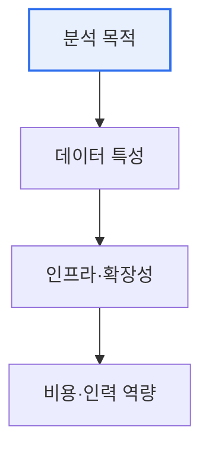

# 빅데이터 분석도구 선택 원칙

## 1. 개요

### 가. 개념
> 빅데이터 분석도구 선택은 조직의 **데이터 특성·분석 목적·인프라·인력 역량**을 고려해, 수집부터 분석·시각화까지 목적에 맞는 도구를 합리적으로 선정하는 활동이다.

도구 선택이 중요한 이유는 '**도구가 분석의 성패와 총소유비용(TCO)을 좌우한다**'는 데 있다. 빅데이터 생태계에는 수집(Kafka·Flume), 저장(HDFS·NoSQL), 처리(Hadoop·Spark), 분석(R·Python), 시각화(Tableau) 등 수많은 도구가 있다. 성능만 보고 최신·고성능 도구를 고르면, 정작 다룰 인력이 없거나 기존 인프라와 안 맞아 실패한다. 반대로 익숙한 도구만 고집하면 데이터 규모·처리 요구를 못 따라간다. 따라서 '무엇을 분석하려는가(목적)', '데이터가 어떤가(정형/비정형·실시간/배치)', '우리가 다룰 수 있는가(역량)', '얼마나 확장해야 하는가'를 종합해 균형 있게 선택해야 한다. 즉 '최고의 도구'가 아니라 '우리 상황에 맞는 도구'를 고르는 것이 원칙이다.

### 나. 필요성
도구가 난립하는 빅데이터 환경에서 잘못된 선택은 비용 낭비·프로젝트 실패로 이어지므로, 객관적 선택 기준이 요구된다.

## 2. 선택 원칙

| 원칙 | 내용 |
|---|---|
| **목적 적합성** | 분석 목적(기술/예측/처방)에 부합 |
| **데이터 특성** | 정형/비정형, 배치/실시간, 규모 |
| **확장성** | 데이터 증가 대응(스케일아웃) |
| **성능** | 처리 속도·응답 시간 요구 충족 |
| **사용성·역량** | 조직 인력의 숙련도·학습 곡선 |
| **호환성·연계** | 기존 시스템·생태계 통합 |
| **비용(TCO)** | 라이선스·운영·인프라 총비용 |
| **커뮤니티·지원** | 오픈소스 생태계·기술 지원 |

## 3. 처리 유형별 도구 예시

분석 요구에 따라 도구 계열이 갈린다. 대용량 배치 처리는 Hadoop/MapReduce, 인메모리 고속·실시간 처리는 Spark, 스트리밍은 Kafka/Flink가 적합하다. 통계·머신러닝은 R·Python(scikit-learn), 시각화는 Tableau·Power BI가 널리 쓰인다.

| 구분 | 도구 |
|---|---|
| **배치 처리** | Hadoop, Hive |
| **실시간·인메모리** | Spark, Flink |
| **스트리밍 수집** | Kafka, Flume |
| **분석·ML** | R, Python |
| **시각화** | Tableau, Power BI |

## 4. 고려사항 및 시사점

1. **목적이 도구를 결정**해야 한다. 유행이나 성능이 아니라 '무엇을 왜 분석하는가'에서 출발해, 목적→데이터→도구 순으로 선택해야 프로젝트가 성공한다.
2. **총소유비용과 인력 역량**을 함께 본다. 도입 비용뿐 아니라 운영·교육 비용, 조직이 실제 다룰 수 있는 역량까지 고려해야 지속 가능하다.
3. **클라우드·관리형 서비스로 전환**되고 있다. 직접 구축·운영 부담을 줄이려 AWS EMR·Databricks 등 관리형 빅데이터 서비스를 채택하는 추세이며, 도구 선택 시 클라우드 연계성도 중요해졌다.

---

> **한 줄 요약**: 빅데이터 분석도구 선택은 *분석 목적·데이터 특성·확장성·인력 역량·비용을 종합* 해 '우리 상황에 맞는' 도구를 고르는 것으로, 최고 성능이 아니라 목적 적합성과 TCO·역량의 균형이 원칙이다.
