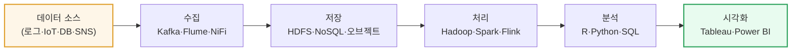
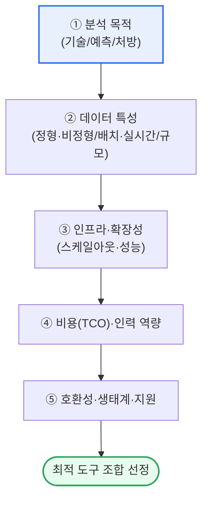

# 빅데이터 분석도구 선택 원칙

## 1. 개요

### 가. 정의
> **빅데이터 분석도구 선택**은 조직의 **데이터 특성(정형/비정형·규모·속도)·분석 목적(기술/예측/처방)·인프라·인력 역량·총소유비용(TCO)**을 종합적으로 고려하여, 수집→저장→처리→분석→시각화에 이르는 데이터 파이프라인 각 단계에 목적 적합한 도구를 합리적·객관적 기준으로 선정하는 의사결정 활동이다.

도구 선택이 프로젝트의 성패를 좌우하는 근본 이유는 '**도구가 분석의 결과 품질과 총소유비용(TCO)을 동시에 결정한다**'는 데 있다. 빅데이터 생태계에는 수집(Kafka·Flume·NiFi), 저장(HDFS·NoSQL·오브젝트 스토리지), 처리(Hadoop·Spark·Flink), 분석(R·Python·SQL 엔진), 시각화(Tableau·Power BI·Superset)에 이르기까지 수백 종의 도구가 겹겹이 존재한다. 각 도구는 특정 워크로드에 최적화되어 있어, 어떤 도구도 모든 상황에서 최고가 될 수 없다. 이 점이 '선택'을 단순한 성능 비교가 아니라 조직 상황에 대한 종합 판단으로 만든다.

성능만 보고 최신·고성능 도구를 고르면 정작 그것을 다룰 인력이 없거나 기존 인프라·데이터 소스와 통합되지 않아 실패한다. 반대로 익숙한 도구만 고집하면 데이터 규모·실시간 처리 요구를 감당하지 못해 병목이 생긴다. 따라서 '무엇을 왜 분석하려는가(목적)', '데이터가 어떤 성질인가(정형/비정형·실시간/배치·규모)', '우리가 실제로 다룰 수 있는가(역량·학습곡선)', '앞으로 얼마나 확장해야 하는가(성장성)', '총비용은 감당 가능한가(TCO)'를 균형 있게 저울질해야 한다. 요컨대 원칙의 핵심은 '**최고의 도구가 아니라 우리 상황에 가장 잘 맞는 도구를 고르는 것**'이다.

### 나. 등장 배경과 필요성
과거에는 정형 데이터를 관계형 DBMS 한 종류로 처리하면 충분했다. 그러나 3V(Volume·Velocity·Variety)로 대표되는 빅데이터 시대가 열리면서, 단일 도구로는 대응할 수 없는 다양한 워크로드가 등장했고 이를 나눠 맡는 전문 도구가 폭증했다. 도구가 난립하는 환경에서 잘못된 선택은 수억 원대의 라이선스·인프라 비용 낭비, 인력 재교육 부담, 프로젝트 지연·실패로 직결된다. 여기에 오픈소스와 상용, 온프레미스와 클라우드, 배치와 스트리밍이라는 선택축이 교차하면서 의사결정의 복잡도는 더 커졌다. 이 때문에 감(感)이나 유행이 아니라 **객관적이고 반복 가능한 선택 기준(원칙)**이 요구된다.

## 2. 데이터 파이프라인과 선택 기준의 구조

도구 선택은 개별 도구를 하나씩 고르는 문제가 아니라, 데이터가 흐르는 파이프라인 전체를 놓고 각 단계에 맞는 도구를 조합하는 문제다. 아래 그림은 데이터가 수집에서 시각화까지 흐르는 파이프라인과, 그 각 단계에 공통으로 적용되는 선택 기준의 관계를 보여준다.

```mermaid
flowchart LR
  SRC["데이터 소스<br/>(로그·IoT·DB·SNS)"] --> COL["수집<br/>Kafka·Flume·NiFi"]
  COL --> STO["저장<br/>HDFS·NoSQL·오브젝트"]
  STO --> PRO["처리<br/>Hadoop·Spark·Flink"]
  PRO --> ANA["분석<br/>R·Python·SQL"]
  ANA --> VIS["시각화<br/>Tableau·Power BI"]
  style SRC fill:#fef6e8,stroke:#e0a02f,stroke-width:2px
  style VIS fill:#e8fbef,stroke:#2fa35e,stroke-width:2px
```

파이프라인의 각 단계는 서로 다른 워크로드를 갖지만, 그 위에서 도구를 고르는 판단 기준은 공통된 축으로 정리된다. 아래 그림은 그 기준들이 어떤 우선순위와 의존관계로 작동하는지를 나타낸다. 목적이 최상단에서 데이터 특성을 규정하고, 데이터 특성이 인프라·확장성 요구를 낳으며, 그 위에서 비용·인력 역량·생태계가 최종 선택을 조율한다.

```mermaid
flowchart TB
  G["① 분석 목적<br/>(기술/예측/처방)"] --> D["② 데이터 특성<br/>(정형·비정형/배치·실시간/규모)"]
  D --> I["③ 인프라·확장성<br/>(스케일아웃·성능)"]
  I --> C["④ 비용(TCO)·인력 역량"]
  C --> E["⑤ 호환성·생태계·지원"]
  E --> R(["최적 도구 조합 선정"])
  style G fill:#e8f0fe,stroke:#2f6fed,stroke-width:2px
  style R fill:#e8fbef,stroke:#2fa35e,stroke-width:2px
```

### 가. 목적 적합성 — 무엇을 왜 분석하는가
모든 선택은 분석 목적에서 출발해야 한다. 같은 데이터라도 과거를 요약하는 **기술적 분석(descriptive)**, 미래를 예측하는 **예측 분석(predictive)**, 최적 행동을 제안하는 **처방 분석(prescriptive)** 중 무엇을 하려는가에 따라 필요한 도구 계열이 달라진다. 단순 집계·대시보드가 목적이라면 SQL 엔진과 BI 도구로 충분하지만, 예측 모델을 만들려면 Python의 머신러닝 생태계가 필요하고, 실시간 추천·이상탐지 같은 처방형이라면 스트리밍 처리와 모델 서빙 인프라까지 요구된다. 목적을 명확히 하지 않은 채 도구부터 고르면, 화려하지만 쓰이지 않는 시스템이 된다. 실제로 많은 빅데이터 사업이 '일단 하둡부터 깔고 보자'는 접근으로 시작했다가 활용 시나리오 부재로 방치된 사례가 반복되었다.

### 나. 데이터 특성 — 정형/비정형, 배치/실시간, 규모
목적이 정해지면 다루는 데이터의 성질이 도구를 좁힌다. 정형 데이터가 중심이면 SQL 기반 도구와 컬럼형 저장이 유리하고, 로그·이미지·텍스트 같은 비정형이 많으면 스키마 유연성을 갖춘 NoSQL·오브젝트 스토리지와 분산처리가 필요하다. 처리 시점도 결정적이다. 하루 단위로 대량을 모아 처리하는 **배치**라면 Hadoop/Hive 계열이, 초 단위 지연이 중요한 **실시간·스트리밍**이라면 Spark Streaming·Flink·Kafka가 적합하다. 데이터 규모 또한 임계점을 만든다. 수 GB~수십 GB는 단일 노드의 R·Python으로 충분하지만, TB~PB급으로 커지면 분산처리가 필수가 된다. 예컨대 하루 수억 건의 결제 로그를 실시간 부정탐지에 쓰려면 배치용 도구로는 지연을 감당할 수 없어 스트리밍 스택이 강제된다.

### 다. 확장성·성능 — 얼마나, 얼마나 빨리 커지는가
빅데이터는 시간이 지날수록 커진다는 전제 위에서 도구를 골라야 한다. 서버를 늘려 처리량을 키우는 **스케일아웃(scale-out)**이 가능한지, 데이터가 10배 늘어도 선형에 가깝게 확장되는지를 봐야 한다. 또한 요구되는 응답 시간(SLA)을 충족하는 처리 성능이 있는지가 관건이다. Spark가 Hadoop MapReduce를 널리 대체한 핵심 이유가 바로 여기에 있다. MapReduce는 각 단계 결과를 디스크에 쓰지만, Spark는 중간 결과를 메모리에 유지(in-memory)해 반복 연산(머신러닝·대화형 질의)에서 수 배~수십 배 빠르다. 반면 메모리를 많이 쓰므로 인프라 비용과 트레이드오프가 생긴다. 즉 성능은 항상 비용·자원과 함께 판단해야 한다.

### 라. 비용(TCO)·인력 역량·생태계 — 지속 가능한가
마지막으로 선택을 조율하는 것은 총소유비용과 사람이다. 도입 비용(라이선스·구축)뿐 아니라 운영·유지보수·교육·재해복구까지 포함한 **TCO**를 봐야 한다. 오픈소스는 라이선스 비용이 없어 보이지만, 운영·튜닝을 감당할 전문 인력이 없으면 오히려 총비용이 더 커진다. 조직 인력이 이미 Python·SQL에 익숙한데 생소한 도구를 도입하면 학습곡선 때문에 생산성이 급락한다. 기존 시스템·데이터 소스와의 **호환성·연계성**, 문제 발생 시 도움을 받을 수 있는 **커뮤니티·기술지원의 두께**도 지속 가능성을 좌우한다. 활발한 커뮤니티를 가진 도구는 문서·해결사례·인력 시장이 풍부해 장기 운영 리스크가 낮다.

| 원칙 | 핵심 질문 | 판단 포인트 |
|---|---|---|
| **목적 적합성** | 무엇을 왜 분석하는가 | 기술/예측/처방에 맞는 도구 계열 |
| **데이터 특성** | 정형/비정형·배치/실시간·규모 | 스키마 유연성·처리 시점·분산 필요성 |
| **확장성** | 데이터 증가에 대응하는가 | 스케일아웃·선형 확장 |
| **성능** | 응답시간·처리량 요구 충족 | 인메모리·병렬성, 자원과 트레이드오프 |
| **사용성·역량** | 조직이 다룰 수 있는가 | 학습곡선·기존 숙련도 |
| **호환성·연계** | 기존 생태계와 통합되는가 | 커넥터·표준 인터페이스 |
| **비용(TCO)** | 총비용을 감당 가능한가 | 라이선스+운영+교육+인프라 |
| **커뮤니티·지원** | 도움을 받을 수 있는가 | 오픈소스 생태계·상용 지원 |

## 3. 처리 유형별 도구와 선택 사례

선택 원칙이 실제로 어떻게 도구를 가르는지는 처리 유형별로 보면 분명해진다. 대용량을 모아 처리하는 배치는 Hadoop/MapReduce·Hive가 안정적이고 저렴하지만 지연이 크다. 반복 연산과 대화형 분석, 준실시간 처리는 인메모리 엔진인 Spark가 강하다. 이벤트를 즉시 흘려보내는 스트리밍은 Kafka(메시징)와 Flink(상태 기반 스트림 처리)가 표준이다. 통계·머신러닝은 R(통계 특화)과 Python(범용·풍부한 ML 라이브러리)이 양대 축이며, 결과 전달은 Tableau·Power BI 같은 상용 BI나 오픈소스 Superset이 담당한다.

구체 사례로 세 가지 상황을 비교해 보자. 첫째, 일 배치로 매출 리포트를 만드는 소매기업은 Hive+Tableau 조합으로 낮은 비용에 목적을 달성한다. 둘째, 하루 수억 건 로그로 실시간 이상거래를 잡아야 하는 카드사는 Kafka+Flink+모델 서빙 스택이 필요하다. 셋째, 데이터 과학팀이 예측 모델을 반복 실험하는 조직은 Spark+Python(MLlib/scikit-learn)+노트북 환경이 생산성을 높인다. 같은 '빅데이터 분석'이라도 목적과 데이터 특성이 다르면 최적 조합이 이렇게 갈린다.

여기서 반드시 짚어야 할 것은, 도구는 '경쟁 관계'보다 '보완 관계'로 조합되는 경우가 많다는 점이다. Kafka로 수집한 스트림을 Spark로 처리하고 결과를 NoSQL에 적재한 뒤 Tableau로 시각화하는 식으로, 서로 다른 계층의 도구가 하나의 파이프라인을 이룬다. 따라서 개별 도구의 우열보다 '도구 간 연계가 매끄러운가'가 더 중요한 판단 기준이 되며, 이는 앞서 본 호환성·생태계 원칙과 직결된다. 커넥터가 풍부하고 표준 포맷(Parquet·Avro 등)을 공유하는 도구들로 스택을 짜면 통합 비용과 운영 리스크가 크게 줄어든다.

또한 배치와 스트리밍의 경계가 흐려지고 있다는 점도 선택에 영향을 준다. 과거에는 배치와 실시간을 별도 시스템(람다 아키텍처)으로 이중 운영했지만, Spark Structured Streaming·Flink처럼 하나의 엔진으로 배치와 스트림을 함께 처리하는 통합(카파 아키텍처) 접근이 확산되면서, 두 요구를 모두 감당하는 단일 엔진을 고르면 운영 복잡도와 코드 중복을 줄일 수 있다. 이는 '지금의 요구'만이 아니라 '가까운 미래의 요구'까지 내다보고 도구를 고르는 것이 왜 중요한지를 보여준다.

| 구분 | 대표 도구 | 적합 상황 |
|---|---|---|
| **배치 처리** | Hadoop, Hive | 대용량·비실시간·비용 민감 |
| **실시간·인메모리** | Spark, Flink | 반복 연산·준실시간·대화형 |
| **스트리밍 수집** | Kafka, Flume, NiFi | 이벤트 수집·낮은 지연 |
| **분석·ML** | R, Python | 통계·예측 모델링 |
| **시각화·BI** | Tableau, Power BI, Superset | 리포트·대시보드 |

대표적 선택 갈림길인 **Hadoop MapReduce vs Spark**를 비교하면 '차이가 생기는 이유'가 분명해진다. 둘 다 분산 대용량 처리라는 목적은 같지만, 처리 방식이 근본적으로 달라 적합 상황이 갈린다. MapReduce는 각 단계 결과를 디스크에 기록해 안정적이고 초대용량 배치에 견고하지만 반복·대화형 작업에는 느리다. Spark는 중간 결과를 메모리에 두어 반복 연산에서 훨씬 빠르지만 메모리 자원 요구가 크다. 즉 '느리지만 저렴·안정' 대 '빠르지만 자원 집약'이라는 트레이드오프가 선택을 좌우한다.

| 비교축 | Hadoop MapReduce | Spark | 차이가 생기는 이유 |
|---|---|---|---|
| **처리 위치** | 디스크 기반 | 인메모리 기반 | 중간 결과 저장 매체가 다름 |
| **속도** | 상대적으로 느림 | 반복 연산에서 수 배~수십 배 빠름 | 디스크 I/O 유무 |
| **자원** | 메모리 부담 낮음 | 메모리 요구 높음 | 데이터를 메모리에 유지 |
| **적합** | 초대용량 배치·비용 민감 | 반복 ML·준실시간·대화형 | 워크로드 성격 차이 |

## 4. 심화 — 클라우드·관리형 서비스와 레이크하우스로의 전환

최근 도구 선택의 지형은 '직접 구축·운영'에서 **클라우드 기반 관리형 서비스(Managed Service)**로 빠르게 이동하고 있다. 온프레미스 하둡 클러스터를 직접 설치·튜닝·운영하는 부담이 크기 때문에, 많은 조직이 AWS EMR, Google Dataproc/BigQuery, Azure Synapse, Databricks 같은 관리형 서비스로 전환하고 있다. 이들은 인프라 운영을 서비스 제공자가 맡아주므로 조직은 분석 자체에 집중할 수 있고, 필요할 때만 자원을 쓰는 종량제로 초기 투자와 유휴 비용을 줄인다. 다만 데이터 이동량이 많거나 상시 부하가 높으면 종량제 비용이 예측을 넘어설 수 있고, 특정 벤더에 종속(lock-in)될 위험이 있어 이 역시 TCO·이식성 관점에서 신중히 저울질해야 한다.

아키텍처 측면에서는 **데이터 레이크와 데이터 웨어하우스를 결합한 레이크하우스(Lakehouse)**가 부상하고 있다. 과거에는 원천 데이터를 값싸게 쌓는 데이터 레이크와 정제된 데이터를 빠르게 질의하는 웨어하우스를 따로 운영했지만, Delta Lake·Apache Iceberg·Apache Hudi 같은 개방형 테이블 포맷이 레이크 위에서 트랜잭션·스키마 관리·고성능 질의를 지원하면서 둘을 하나로 합치는 흐름이 강해졌다. 이는 도구 선택 시 '개방형 포맷 지원 여부'와 '레이크하우스 생태계와의 연계'가 새로운 판단 기준으로 떠올랐음을 뜻한다. 여기에 셀프서비스 분석·자연어 질의(생성형 AI 연계)가 확산되면서, 비전문가도 다룰 수 있는 사용성이 선택에서 차지하는 비중이 더 커지고 있다.

## 5. 고려사항 및 시사점 (기술사 관점)

1. **목적→데이터→도구의 순서를 지켜라.** 유행이나 성능 지표가 아니라 '무엇을 왜 분석하는가'에서 출발해, 데이터 특성으로 후보를 좁히고 마지막에 도구를 확정하는 하향식 절차를 원칙으로 삼아야 한다. 이 순서를 뒤집으면 값비싼 시스템이 활용 시나리오 없이 방치되는 전형적 실패로 이어진다.

2. **TCO와 인력 역량을 함께 저울질하라.** 도입 비용만이 아니라 운영·튜닝·교육·재해복구까지 포함한 총소유비용을 평가하고, 조직이 실제로 운영할 수 있는 역량 범위 안에서 선택해야 지속 가능하다. '무료' 오픈소스가 전문 인력 부재로 가장 비싼 선택이 되는 역설을 경계해야 한다.

3. **확장성과 이식성을 선제적으로 설계하라.** 데이터는 반드시 커진다는 전제로 스케일아웃 가능성을 확보하고, 개방형 포맷·표준 인터페이스를 선호해 특정 벤더·도구 종속을 최소화해야 한다. 이는 미래의 마이그레이션 비용을 낮추는 전략적 선택이다.

4. **PoC(개념검증)로 검증한 뒤 도입하라.** 후보 도구를 실제 데이터·실제 워크로드로 시험하는 소규모 PoC를 거쳐 성능·호환성·운영성을 객관적으로 확인하고, 정량 평가표(가중치 기반 점수)로 의사결정을 문서화해야 한다. 감이 아닌 근거로 선택해야 이해관계자 합의와 사후 책임 추적이 가능하다.

5. **거버넌스·보안·규제 준수를 선택 기준에 포함하라.** 빅데이터에는 개인정보·민감정보가 섞이기 쉬우므로, 접근통제·감사·데이터 계보(lineage)·비식별 처리를 지원하는지, 개인정보보호법 등 규제 요건을 충족하는지를 도구 평가에 반드시 반영해야 한다. 성능만 앞선 도구가 컴플라이언스 공백으로 더 큰 위험을 부를 수 있다.

## 참고자료
- Apache Spark 공식 문서: https://spark.apache.org/docs/latest/
- Apache Kafka 공식 문서: https://kafka.apache.org/documentation/
- AWS, "Big Data Analytics Options on AWS": https://docs.aws.amazon.com/whitepapers/latest/big-data-analytics-options/welcome.html
- Databricks, "What is a Data Lakehouse?": https://www.databricks.com/glossary/data-lakehouse
- Apache Flink 공식 문서: https://nightlies.apache.org/flink/flink-docs-stable/

---

> **한 줄 요약**: 빅데이터 분석도구 선택은 *분석 목적→데이터 특성→확장성·성능→비용(TCO)·인력 역량·생태계* 를 하향식으로 종합해 '우리 상황에 맞는' 도구 조합을 고르는 것으로, 최고 성능이 아니라 목적 적합성과 TCO·역량·거버넌스의 균형이 원칙이며, 최근에는 클라우드 관리형 서비스와 레이크하우스로 무게중심이 이동하고 있다.
