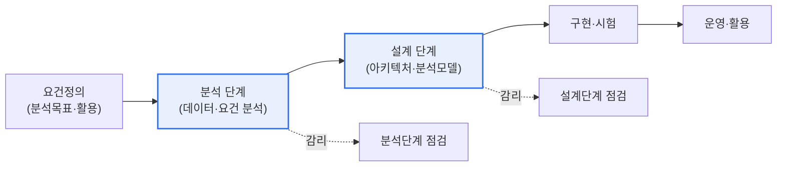
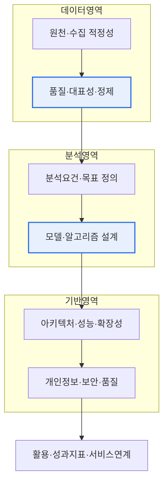

# 빅데이터 정보화 사업의 감리 점검항목

## 1. 개요

### 가. 등장 배경과 정의

> **빅데이터 정보화 사업의 감리** 는 인공지능·빅데이터 등 지능정보 기술의 특성을 반영하지 못하는 기존 감리 기준의 한계를 보완하기 위한 것으로, 데이터의 품질·대표성과 분석 모델의 타당성을 중점 점검한다. 특히 **분석·설계 단계** 의 영역별 점검 항목이 사업 성패를 좌우한다.

빅데이터 사업의 감리가 일반 소프트웨어 감리와 갈라지는 근본 지점은 '**데이터와 분석 모델이 곧 산출물의 핵심**'이라는 데 있다. 전통적 정보화 사업의 감리는 '요구된 기능이 명세대로 구현되었는가'가 초점이다. 화면·기능·인터페이스가 요구사항을 충족하면 대체로 품질이 확보된다. 그러나 빅데이터 사업은 다르다. 어떤 데이터를 어떤 경로로 확보·정제했고, 그 위에 어떤 가정과 알고리즘으로 분석 모델을 세웠는지가 결과의 신뢰성을 결정한다. 시스템이 아무리 견고해도 입력 데이터가 대표성이 없거나 편향돼 있고 분석 모델의 가정이 타당하지 않으면, 산출된 예측·통찰은 '그럴듯하지만 틀린' 결과가 된다("garbage in, garbage out"). 이 때문에 기능 중심 점검만으로는 빅데이터 사업의 진짜 위험을 잡아내지 못한다.

이런 문제의식에서, 지능정보기술의 특성을 반영한 **지능정보기술 감리 실무 가이드** 류의 기준이 마련되었고, 그 안에서 빅데이터 사업은 데이터·분석 모델·아키텍처·보안·활용을 아우르는 별도의 점검 관점을 갖게 되었다. 즉 감리의 무게중심이 '**기능의 구현 여부**'에서 '**데이터와 분석의 타당성·신뢰성**'으로 이동한 것이 핵심이다.

### 나. 필요성

빅데이터·AI 사업이 공공 전반(교통·복지·재난·조세 등)으로 빠르게 확산되고, 그 결과가 정책 의사결정과 대국민 서비스에 직접 반영되면서 검증의 무게가 커졌다. 만약 이를 검증할 감리 기준이 여전히 기능 중심에 머문다면, 데이터 편향·모델 과적합·개인정보 침해 같은 빅데이터 고유의 결함을 놓치고, 사업 종료 후에야 '결과를 믿을 수 없다'는 사실이 드러난다. 감리는 사업 초기·중간 단계에서 결함을 조기에 발견해 되돌릴 여지가 있을 때 개입하는 장치이므로, 신기술 특성을 반영한 점검 항목이야말로 사업의 실질적 품질과 사후 리스크를 함께 담보한다. 특히 분석·설계 단계는 이후 구현·시험 단계에서 바로잡기 어려운 '근본 설계'가 확정되는 시점이라 감리의 실효성이 가장 크다.

## 2. 감리와 사업 단계 — 전체 구조

감리는 사업의 진행 단계에 맞춰 초점을 옮겨가며 결함을 조기에 잡는다. 아래 구조도는 빅데이터 사업의 생애주기와 감리 개입 지점을 보여준다. 요건정의·분석 단계에서는 '무엇을, 어떤 데이터로'가 타당한지를, 설계 단계에서는 '어떻게 구현할지'가 적정한지를 본다. 뒤 단계로 갈수록 되돌리기 비용이 커지므로, 분석·설계 단계 점검의 밀도가 사업 품질을 좌우한다.

**분석 단계** 에서는 '무엇을, 어떤 데이터로 분석할 것인가'가 타당한지를 본다. 분석 요건·목표가 사업 목적과 정렬돼 있는지, 활용할 데이터의 원천과 수집 대상이 적절하며 모집단을 대표하는 품질을 갖췄는지를 점검한다. 여기서 대표성·편향 문제를 놓치면 이후 모든 분석이 오염된다. **설계 단계** 에서는 '그것을 어떻게 구현할 것인가'가 적정한지를 본다. 대용량 데이터를 저장·처리할 아키텍처, 분석 알고리즘·모델의 설계, 성능·확장성, 개인정보 보호·보안·품질 관리 방안이 요건을 충족하도록 설계됐는지를 확인한다.

## 3. 영역별 점검 항목

빅데이터 감리는 데이터·분석(모델)·아키텍처·보안·활용의 **다섯 영역** 을 분석·설계 두 단계에 걸쳐 교차 점검한다. 아래 프로세스 상세도는 점검이 데이터에서 시작해 분석 모델을 거쳐 활용으로 이어지는 흐름을 나타낸다. 각 영역은 표로 정리하기 전에 '왜 점검하는가'를 먼저 이해해야 한다. 실제 감리에서 자주 발견되는 결함 유형은 다음과 같다.

- **데이터 편향·대표성 미확보**: 특정 채널·집단에 치우친 원천 데이터.
- **품질 관리 절차 부재**: 결측·이상치·중복 처리 기준이 설계에 없음.
- **검증 설계 미흡**: 학습·검증·시험 데이터 분리 없이 과적합된 모델.
- **개인정보 비식별 누락**: 민감정보 처리 근거·비식별 방안 결여.
- **활용 설계 부재**: 분석 결과가 서비스·의사결정으로 연결되지 않음.

### 가. 데이터 영역

데이터 영역이 첫 관문인 이유는, 빅데이터 사업에서 데이터가 곧 '원재료'이자 결과 신뢰성의 상한선이기 때문이다. 분석 단계에서는 **데이터 원천과 수집 대상의 적정성** 을 본다. 분석 목적에 부합하는 원천을 골랐는지, 특정 집단·기간·채널에 치우쳐 모집단을 왜곡하지는 않는지(**표본 편향**), 필요한 데이터를 적법하게 확보할 수 있는지를 점검한다. 예컨대 전 국민 대상 복지 수요 예측을 하면서 특정 연령대만 과다 표집된 데이터를 쓰면, 모델이 아무리 정교해도 결과가 편향된다. 설계 단계에서는 **데이터 모델·저장 설계와 표준·품질 기준** 을 본다. 데이터 표준(용어·코드·포맷)이 정의됐는지, 결측·이상치·중복을 다루는 정제·검증 절차가 설계됐는지, 대용량 저장 구조가 분석 접근 패턴에 맞는지를 확인한다. 데이터 품질 관리가 설계에 녹아 있지 않으면 운영 단계에서 품질 저하가 누적된다.

### 나. 분석(모델) 영역

분석 영역은 빅데이터 사업을 일반 SI와 구분 짓는 핵심으로, 감리가 가장 신중해야 하는 부분이다. 분석 단계에서는 **분석 요건·목표 정의의 타당성** 을 본다. 풀려는 문제가 명확히 정의됐는지, 성공을 판단할 지표(정확도·재현율·업무 KPI 등)가 사전에 합의됐는지, 그 목표가 데이터로 실제 달성 가능한지를 점검한다. 목표가 모호하면 '분석을 위한 분석'에 그치기 쉽다. 설계 단계에서는 **분석 알고리즘·모델 설계의 적정성** 을 본다. 문제 유형(분류·예측·군집·추천 등)에 맞는 기법을 선택했는지, 과적합(overfitting)을 막는 검증 설계(학습·검증·시험 데이터 분리, 교차검증)가 있는지, 모델의 가정과 한계를 문서화했는지, 결과를 이해관계자가 해석·설명할 수 있는지(설명가능성)를 확인한다. 감리인이 데이터 과학 결과의 '정답'을 판정하기는 어렵지만, **검증 절차와 가정이 방법론적으로 타당한지** 는 반드시 점검할 수 있고 또 해야 한다.

### 다. 아키텍처·보안·활용 영역

나머지 세 영역은 분석을 실제로 뒷받침하고 결과를 안전하게 서비스로 잇는 기반이다. **아키텍처·인프라** 는 분석 단계에서 처리 규모·성능 요건이 현실적으로 산정됐는지, 설계 단계에서 빅데이터 플랫폼(분산 저장·처리)·확장성·성능 설계가 요건을 충족하는지를 본다. 데이터가 커질수록 배치·실시간 처리 방식과 자원 확장 전략이 결과 산출 속도와 비용을 좌우한다. **보안·품질** 은 특히 중요하다. 빅데이터는 개인정보를 대량으로 다루는 경우가 많아, 분석 단계에서 개인정보·비식별 처리 요건이 정의됐는지, 설계 단계에서 접근통제·암호화·비식별화(가명·익명처리)·품질관리 방안이 관계 법령(개인정보 보호법 등)에 부합하게 설계됐는지를 확인한다. **활용** 영역은 분석 결과가 실제 의사결정·서비스로 연결되도록, 활용 목적·성과지표가 명확한지와 시각화·서비스 연계 설계가 사용자 관점에서 타당한지를 본다. 아무리 좋은 분석도 활용 설계가 없으면 '보고서로 끝나는 사업'이 된다.

| 영역 | 분석 단계 점검 | 설계 단계 점검 |
|---|---|---|
| **데이터** | 원천·수집 대상 적정성, 품질·대표성, 편향 여부 | 데이터 모델·저장 설계, 표준·정제·품질 기준 |
| **분석(모델)** | 분석 요건·목표·성공지표 정의 타당성 | 알고리즘·모델 설계, 검증(과적합 방지)·설명가능성 |
| **아키텍처·인프라** | 처리 규모·성능 요건 산정 | 빅데이터 플랫폼·확장성·성능 설계 |
| **보안·품질** | 개인정보·비식별 요건 정의 | 접근통제·암호화·비식별·품질관리 방안 |
| **활용** | 활용 목적·성과지표 정의 | 시각화·서비스 연계·의사결정 반영 설계 |

## 4. 사례와 실무적 함의

점검 항목이 실제로 어떤 결함을 잡아내는지는 사례로 보면 분명하다. 첫째, **표본 편향 사례** — 한 지자체가 온라인 민원 데이터만으로 시민 만족도 분석 모델을 설계했다면, 디지털 취약계층이 구조적으로 누락돼 결과가 왜곡된다. 데이터 영역 점검에서 '원천의 대표성'을 짚으면 설계 단계에서 오프라인 채널을 보완하도록 되돌릴 수 있다. 둘째, **과적합·검증 부재 사례** — 재난 예측 모델을 학습 데이터에만 맞춰 정확도 99%로 보고했지만 검증·시험 데이터 분리 설계가 없으면, 실제 운영에서 성능이 급락한다. 분석 영역의 '검증 설계' 점검이 이를 사전에 걸러낸다. 셋째, **개인정보 미비식별 사례** — 보건·의료 데이터를 분석하며 비식별 처리 설계가 누락되면 법 위반과 재식별 위험이 생긴다. 보안 영역 점검이 설계 단계에서 비식별·접근통제를 강제한다. 이처럼 각 영역 점검은 추상적 체크리스트가 아니라, **되돌리기 어려운 근본 결함을 되돌릴 수 있는 시점에 잡아내는 장치** 다.

일반 감리와의 차이도 실무적 함의로 정리된다. 일반 SI 감리가 '기능 명세 대비 구현 일치'를 보는 정적 검증이라면, 빅데이터 감리는 데이터의 대표성과 모델의 타당성이라는 **확률적·통계적 품질** 을 검증한다. 두 감리의 차이를 축별로 대비하면 다음과 같다.

- **점검 대상**: (일반) 기능·화면·인터페이스 ↔ (빅데이터) 데이터 원천·품질·분석 모델.
- **품질의 성격**: (일반) 명세 충족의 정오(正誤) ↔ (빅데이터) 대표성·타당성의 확률적 신뢰도.
- **핵심 위험**: (일반) 요구사항 누락·결함 ↔ (빅데이터) 데이터 편향·과적합·개인정보 침해.
- **감리인 역량**: (일반) SW 공학 ↔ (빅데이터) SW 공학 + 데이터·통계·개인정보 규제.
- **산출물**: (일반) 결함 목록·시정 요구 ↔ (빅데이터) 데이터·모델 위험 요인과 개선 권고 포함.

그래서 감리인에게는 전통적 SW 공학 지식에 더해 데이터 품질·통계·개인정보 규제에 대한 이해가 요구되며, 감리 산출물도 단순 결함 목록을 넘어 데이터·모델의 근본 위험을 짚어야 실효성이 있다.

## 5. 심화 — 최신 동향과 AI 감리로의 확장

빅데이터 감리는 최근 **AI(인공지능) 사업 감리** 로 확장·심화되는 흐름에 있다. 생성형 AI·머신러닝이 공공 사업에 본격 도입되면서, 기존 데이터 품질 중심 점검에 더해 다음이 새 점검 축으로 떠오르고 있다.

- **공정성·편향(fairness)**: 특정 집단에 불리한 차별적 결과를 내지 않는지.
- **설명가능성(XAI)**: 모델의 판단 근거를 이해관계자가 해석할 수 있는지.
- **재현성(reproducibility)**: 같은 데이터·조건에서 동일 결과가 재현되는지.
- **지속적 성능 모니터링(model drift)**: 운영 중 데이터 분포 변화로 성능이 열화되지 않는지.
- **책임성·거버넌스**: 모델 변경·의사결정에 대한 관리·추적 체계가 있는지.

이러한 축은 '설계 시점의 정합성'만이 아니라 '운영 중 지속 품질'까지 감리 대상으로 끌어들인다. 국제적으로는 AI 경영시스템 표준인 ISO/IEC 42001, 위험관리 관점의 NIST AI RMF 등이 등장해, 데이터·모델의 생애주기 전반을 관리·검증하는 프레임워크가 마련되는 추세다. 국내에서도 지능정보기술 감리 가이드가 이런 관점을 반영해 개정·보완되고 있다. 이는 감리의 시야가 '분석·설계 시점의 정합성'에서 '운영 중 모델이 시간이 지나며 열화·편향되지 않는지'라는 **지속 검증** 으로 넓어지고 있음을 뜻한다. 따라서 기술사 관점에서는 빅데이터 감리를 독립된 절차가 아니라, 데이터 거버넌스·AI 거버넌스와 연계된 지속적 품질 보증 체계의 일부로 보는 시각이 필요하다. (구체 표준의 최신 버전·개정 사항은 사업 시점에 원문으로 확인하는 것이 바람직하다.)

## 6. 고려사항 및 시사점

1. **기능이 아닌 데이터·분석 모델의 타당성 중심 점검** 이 핵심이다. 데이터의 대표성·품질과 분석 모델의 방법론적 적정성이 곧 결과의 신뢰성을 결정하므로, 감리의 무게중심을 여기에 두고 감리인의 역량(데이터·통계·규제 이해)도 그에 맞춰 확보해야 한다.

2. **개인정보 보호·데이터 윤리 점검을 강화** 해야 한다. 빅데이터는 개인정보를 대량으로 다루므로, 비식별화·접근통제·적법 처리 근거가 설계에 반영됐는지를 관계 법령 기준으로 확인하고, 재식별 위험과 편향에 따른 차별 가능성까지 살펴야 한다.

3. **분석 결과의 신뢰성·재현성·설명가능성** 을 설계 단계에서 미리 검증한다. 검증 데이터 분리·교차검증 등 과적합 방지 설계와, 이해관계자가 결과를 해석할 수 있는 설명가능성을 사전에 점검해 사업 종료 후의 실패를 예방한다.

4. **분석·설계 단계 조기 개입의 실효성** 을 살린다. 근본 설계가 확정되는 초기 단계에서 결함을 잡아야 되돌리기 비용이 작다. 감리를 형식적 통과의례가 아니라, 위험을 조기에 식별·시정하는 리스크 관리 수단으로 운영해야 한다.

5. **데이터·AI 거버넌스와의 연계** 를 지향한다. 일회성 감리를 넘어, 데이터 표준·품질·모델 성능을 지속적으로 관리·모니터링하는 거버넌스 체계와 연결할 때 빅데이터 사업의 품질이 운영 단계까지 유지된다.

---

> **한 줄 요약**: 빅데이터 정보화 사업 감리는 분석·설계 단계에서 *데이터(원천·품질·대표성)·분석모델(요건·검증·설명가능성)·아키텍처·보안·활용* 다섯 영역을 교차 점검하며, 기능 구현 여부가 아니라 데이터와 분석 모델의 타당성·신뢰성 확인이 핵심이고, 최근 AI 감리·데이터 거버넌스로 확장되고 있다.
