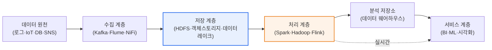
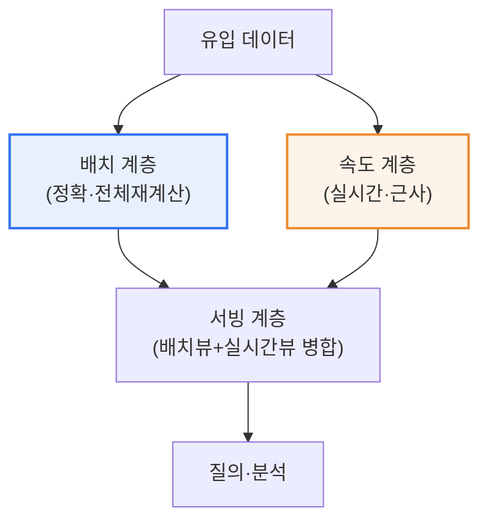

# 빅데이터 플랫폼 아키텍처 설계

## 1. 개요

### 가. 정의
> **빅데이터 플랫폼 아키텍처**는 대용량·다양·고속의 데이터를 **수집(Ingest)→저장(Store)→처리(Process)→분석(Analyze)→시각화·서비스(Serve)** 하는 전 과정을 안정적으로 지원하도록, 인프라·데이터 구조·입출력 흐름을 계층적으로 설계한 기술 구조를 말한다.

빅데이터 플랫폼 설계가 본질적으로 어려운 이유는 이른바 **3V(Volume·Variety·Velocity)** 를 하나의 시스템이 동시에 감당해야 한다는 데 있다. 데이터의 **양(Volume)** 은 테라바이트를 넘어 페타바이트로 커지고, **다양성(Variety)** 측면에서 관계형 DB의 정형 데이터, 웹 로그·JSON 같은 반정형 데이터, 영상·음성·텍스트 같은 비정형 데이터가 뒤섞이며, **속도(Velocity)** 측면에서 초당 수만 건이 흘러드는 실시간 스트림과 하루 한 번 도는 대량 배치가 공존한다. 여기에 진실성(Veracity)과 가치(Value)를 더한 5V로 확장해 논하기도 한다. 이 모든 특성을 단일 전통 RDBMS의 수직 확장(scale-up)만으로 감당하려 하면 성능·비용·가용성이 동시에 무너진다.

그래서 빅데이터 플랫폼은 **관심사 분리(separation of concerns)** 원칙에 따라 계층적으로 설계된다. 무한히 늘어나는 데이터를 담기 위해 여러 서버를 묶는 **분산 인프라 계층**을 맨 아래에 두고, 그 위에 데이터의 형태와 목적에 맞춘 **데이터 저장 구조 계층**(데이터 레이크·웨어하우스·레이크하우스)을 올리며, 다시 그 위에 배치와 실시간을 아우르는 **처리·입출력 계층**을 얹는다. 마지막으로 분석·머신러닝·BI가 소비하는 **서비스 계층**이 위치한다. 이렇게 계층을 나누면 각 계층을 독립적으로 확장·교체할 수 있어, 폭증하는 데이터에도 시스템 전체를 다시 설계하지 않고 대응할 수 있다.

### 나. 등장 배경과 설계 원칙
빅데이터 플랫폼이 등장한 배경에는 두 가지 흐름이 맞물려 있다. 하나는 모바일·IoT·소셜미디어의 확산으로 **데이터 생성량 자체가 지수적으로 폭증**한 것이고, 다른 하나는 x86 상용 서버(commodity hardware)를 수백~수천 대 묶어 분산 처리하는 **스케일아웃 컴퓨팅 기술(Google의 GFS·MapReduce 논문, 이를 오픈소스화한 Hadoop)** 이 성숙한 것이다. 값비싼 고성능 단일 장비 대신 저렴한 서버 여러 대로 같은 성능을 내는 경제성이 확보되면서, 이전에는 버려지던 로그·센서 데이터까지 모아 분석하는 것이 가능해졌다.

이러한 배경에서 빅데이터 플랫폼 설계는 다음 원칙을 따른다. 첫째, 서버를 더해 용량·성능을 늘리는 **수평 확장성(scale-out)** 을 기본으로 한다. 둘째, 데이터 특성별로 **저장과 처리를 분리**해 정형·비정형을 각각 최적의 방식으로 다룬다. 셋째, **배치와 실시간을 함께** 지원하는 처리 구조(람다·카파)를 채택한다. 넷째, 일부 노드가 죽어도 전체가 멈추지 않는 **고가용성·내결함성(replication·fault tolerance)** 을 확보한다. 다섯째, 데이터 품질·보안·계보를 관리하는 **데이터 거버넌스**를 설계 초기부터 내재화한다.

## 2. 전체 아키텍처 구조 (계층별 구성요소)

빅데이터 플랫폼은 데이터가 흐르는 파이프라인을 계층으로 나눠 이해하는 것이 핵심이다. 아래 개념도는 수집부터 서비스까지 데이터가 지나는 전체 골격을 보여준다.

**수집 계층**은 흩어진 원천에서 데이터를 안정적으로 끌어오는 관문이다. 원천은 애플리케이션 로그, IoT 센서, 운영 DB(CDC), 외부 API·SNS 등 매우 다양하다. 이때 순간적으로 몰리는 트래픽을 완충하고 생산자·소비자를 분리하기 위해 **메시지 큐/스트림 버퍼**를 둔다. 대표 기술인 Apache Kafka는 데이터를 토픽 단위로 받아 디스크에 순차 기록하고 여러 소비자가 각자의 속도로 읽게 해, 수집 폭주가 곧바로 저장·처리 장애로 전이되는 것을 막는다. 로그 수집에는 Flume, 흐름 기반 통합에는 NiFi가 흔히 쓰인다.

**저장 계층**은 원천 데이터를 원형 그대로, 그리고 대량으로 보관하는 토대다. Hadoop의 **HDFS**는 큰 파일을 블록으로 쪼개 여러 노드에 분산·복제(기본 3벌) 저장해, 값싼 서버로 페타바이트급 용량과 내결함성을 동시에 확보한다. 클라우드에서는 이 역할을 Amazon S3·GCS 같은 **객체 스토리지**가 대신하는데, 저장과 컴퓨팅을 분리(decoupling)할 수 있어 필요할 때만 처리 자원을 붙였다 떼는 탄력 운영에 유리하다.

**처리 계층**은 저장된 데이터를 병렬로 계산해 의미 있는 결과로 바꾼다. 초창기 Hadoop MapReduce는 디스크 기반이라 반복 연산에 느렸으나, **Apache Spark**가 데이터를 메모리에 올려 처리하면서 반복적 머신러닝·대화형 분석에서 수 배~수십 배 빨라졌다. 밀리초 단위 지연이 필요한 순수 스트리밍에는 Apache Flink가 강점을 보인다. 처리 계층은 배치와 실시간이라는 두 경로를 모두 감당해야 하므로 아키텍처 설계의 무게중심이 된다.

**서비스 계층**은 처리 결과를 사람과 애플리케이션이 소비하는 지점이다. 정제된 데이터를 **데이터 웨어하우스**(예: 컬럼형 분석 DB)에 적재해 BI 도구로 대시보드를 그리거나, ML 파이프라인에 넣어 예측 모델을 학습·서빙한다.

| 계층 | 역할 | 대표 기술 |
|---|---|---|
| **수집** | 원천 데이터 유입·버퍼링 | Kafka, Flume, NiFi, Logstash |
| **저장** | 대량 원형 데이터 분산 저장 | HDFS, S3·객체스토리지, 데이터 레이크 |
| **처리** | 병렬 배치·스트림 연산 | Hadoop, Spark(인메모리), Flink |
| **분석·서비스** | BI·ML·시각화 소비 | 데이터 웨어하우스, ML, BI 툴 |

이렇게 계층을 나누는 근본 이유는 **각 계층의 변화 속도와 확장 요구가 서로 다르기** 때문이다. 수집 계층은 새로운 원천이 붙을 때마다 커넥터가 늘고, 저장 계층은 데이터 누적에 따라 용량이 선형적으로 증가하며, 처리 계층은 분석 워크로드의 성격(배치·실시간·ML)에 따라 자원 요구가 출렁인다. 계층을 결합해 설계하면 한 부분의 변화가 전체 재설계로 번지지만, 분리해 두면 저장은 그대로 두고 처리 엔진만 Hadoop에서 Spark로 교체하는 식의 **점진적 진화**가 가능하다. 이 유연성이 폭증하는 데이터와 빠르게 바뀌는 분석 요구를 동시에 감당하는 실무적 핵심이다.

## 3. 데이터 구조 설계와 입출력(처리) 구조 설계

### 가. 데이터 구조 분석과 저장소 선택
데이터 구조 설계는 "무엇을 다루는가"를 분류하는 데서 출발한다. 데이터를 **정형(관계형 테이블), 반정형(JSON·XML·로그), 비정형(영상·음성·문서)** 으로 나누고, 각 데이터의 원천·수집 주기·품질·활용 목적을 파악해야 저장소 전략이 선다. 스키마가 고정된 정형 데이터는 웨어하우스에, 형태가 유동적인 반정형·비정형은 레이크에 두는 식으로 특성에 맞게 배치한다.

**데이터 레이크(Data Lake)** 는 원천 데이터를 가공하지 않고 원형(raw) 그대로 저장한다. 저장 시점에 스키마를 강제하지 않는 **읽을 때 스키마(schema-on-read)** 방식이라, 미래에 어떤 분석을 할지 정하지 않은 데이터도 일단 값싸게 모아둘 수 있다는 유연성이 최대 장점이다. 반면 관리 규율이 없으면 아무도 못 쓰는 **데이터 늪(data swamp)** 으로 전락하는 위험이 있다.

**데이터 웨어하우스(Data Warehouse)** 는 정제·구조화된 데이터를 **저장 시점에 스키마를 정해(schema-on-write)** 적재하는 분석 전용 저장소다. 품질과 일관성이 보장돼 정형 리포팅·BI에 강하지만, 비정형 수용이 어렵고 사전 모델링 비용이 든다. 실무에서는 원천을 레이크에 모으고, 정제본을 웨어하우스로 승격시키는 **2단 구조**를 흔히 쓴다. 최근에는 두 장점을 합친 **레이크하우스(Lakehouse)** 가 부상하는데, 레이크의 값싼 객체 스토리지 위에 트랜잭션·스키마 관리 계층(예: Delta Lake, Apache Iceberg, Hudi 같은 오픈 테이블 포맷)을 얹어 레이크에서 직접 웨어하우스급 신뢰성을 확보한다.

| 저장소 | 스키마 방식 | 데이터 | 강점 / 한계 |
|---|---|---|---|
| **데이터 레이크** | schema-on-read | 정형+반정형+비정형(원형) | 유연·저비용 / 늪 위험 |
| **데이터 웨어하우스** | schema-on-write | 정제된 정형 | 품질·성능 / 비정형 약함 |
| **레이크하우스** | 테이블 포맷 기반 | 레이크+트랜잭션 | 통합·신뢰성 / 성숙도 |

### 나. 입출력(처리) 구조 — 람다와 카파
입출력 구조 설계는 데이터가 "언제, 어떤 지연으로" 처리되는지를 정한다. 대량을 몰아 정확히 계산하는 **배치**와, 흘러드는 즉시 처리해 낮은 지연을 얻는 **스트리밍**은 요구가 상충하기 때문에, 이를 통합하는 아키텍처 패턴이 필요하다. 아래 개념도는 두 경로를 병행하는 람다 아키텍처의 세부 흐름이다.

**람다 아키텍처(Lambda Architecture)** 는 같은 데이터를 두 경로로 흘린다. **배치 계층**은 전체 데이터를 주기적으로 재계산해 정확하지만 지연이 크고, **속도 계층**은 최근 데이터만 실시간 근사 처리해 지연이 작다. **서빙 계층**이 둘의 결과를 병합해, "정확성"과 "실시간성"을 함께 제공한다. 단점은 배치와 스트림 두 벌의 로직을 각각 만들고 유지해야 해 **코드 이중화·운영 복잡성**이 크다는 점이다.

**카파 아키텍처(Kappa Architecture)** 는 이 이중화를 없애기 위해 배치를 걷어내고 **모든 처리를 스트림 하나로 통일**한다. 과거 데이터를 다시 처리해야 하면 스트림 로그(Kafka)를 처음부터 재생(replay)한다. 로직이 한 벌이라 단순하지만, 대규모 재처리 성능과 상태 관리가 관건이다. **어느 쪽을 택할지는 정확성 요구와 운영 복잡성의 트레이드오프**로 결정한다. 실시간성이 덜 중요하고 정합성이 최우선이면 람다(혹은 배치 중심)를, 스트림 중심 서비스로 로직 단순화가 중요하면 카파를 택한다.

## 4. 비교와 실제 적용 사례

배치와 스트리밍의 선택은 단순한 기술 취향이 아니라 **비즈니스 요구가 허용하는 지연(latency)** 이 결정한다. 예컨대 매일 아침 전일 매출을 집계하는 리포트는 수 시간 지연이 문제되지 않으므로 배치가 경제적이지만, 카드 결제 이상거래 탐지(FDS)는 수백 밀리초 안에 판정해야 하므로 스트리밍이 필수다. 지연 요구가 곧 아키텍처를 가른다.

실제 산업 사례를 보면 설계 철학의 차이가 드러난다. **넷플릭스(Netflix)** 는 시청 로그를 Kafka로 대량 수집해 추천·인코딩 최적화에 활용하는 스트리밍 중심 파이프라인으로 유명하고, **우버(Uber)** 는 실시간 수요·요금(surge pricing) 계산을 위해 스트림 처리를 핵심에 두면서 대규모 데이터 레이크(Hudi를 자체 개발)로 배치 분석을 병행한다. 국내에서도 대형 커머스·통신사가 로그·주문 데이터를 Kafka→Spark→웨어하우스로 흘리는 구조를 광범위하게 운용한다. 이들의 공통점은 **하나의 정답 아키텍처를 쓰는 것이 아니라, 서비스별 지연·정확성 요구에 맞춰 배치와 스트림을 조합**한다는 점이다.

| 요구 | 적합 처리 | 사례 |
|---|---|---|
| 지연 허용 큼·정합성 최우선 | 배치 | 일/월 정산, 규제 리포트 |
| 초저지연·즉시 판정 | 스트리밍 | 이상거래 탐지, 실시간 추천 |
| 둘 다 필요 | 람다/카파 | 대시보드+정산 병행 |

또 하나 실무에서 자주 부딪히는 트레이드오프는 **데이터 레이크의 유연성과 거버넌스의 긴장**이다. 초기에는 "일단 다 모아두자"는 판단으로 원천을 레이크에 무제한 적재하지만, 메타데이터·품질 규율 없이 몇 년이 지나면 어떤 데이터가 어디에 있고 신뢰할 만한지 아무도 모르는 상태가 된다. 앞서 언급한 우버가 자체 테이블 포맷(Hudi)을 개발한 것도, 페타바이트급 레이크에 증분 갱신·트랜잭션·데이터 계보를 부여해 이 늪 문제를 정면으로 풀려 한 결과다. 즉 대규모 사례들이 레이크하우스로 수렴하는 흐름은 유행이 아니라, 유연성과 신뢰성을 동시에 확보하려는 필연적 진화로 읽어야 한다.

## 5. 심화 — 클라우드·레이크하우스·MLOps로의 진화

빅데이터 플랫폼은 최근 세 방향으로 빠르게 진화하고 있으며, 기술사 관점에서 이 흐름을 읽는 것이 중요하다.

첫째, **온프레미스 Hadoop에서 클라우드 관리형 서비스로의 이동**이다. 직접 수백 대 클러스터를 구축·운영하는 부담 대신, 저장(S3 등 객체 스토리지)과 컴퓨팅을 분리해 필요할 때만 처리 자원을 탄력적으로 붙이는 방식이 표준이 되고 있다. 이로써 자원 효율과 운영 편의가 크게 올라간다.

둘째, **레이크와 웨어하우스의 수렴, 즉 레이크하우스의 부상**이다. Delta Lake·Apache Iceberg·Apache Hudi 같은 오픈 테이블 포맷이 값싼 객체 스토리지 위에서 ACID 트랜잭션·스키마 진화·시점 조회(time travel)를 제공하면서, "레이크에 원형을 두고 웨어하우스에 정제본을 또 두는" 이중 구조를 단일 계층으로 통합하려는 흐름이 뚜렷하다.

셋째, **분석에서 AI/ML 파이프라인으로의 확장**이다. 저장된 데이터가 리포팅을 넘어 모델 학습·서빙의 원료가 되면서, 데이터 파이프라인과 모델 수명주기를 함께 자동화·운영하는 **MLOps**, 그리고 조직 전반이 재사용할 특징(feature)을 관리하는 **피처 스토어(feature store)** 가 플랫폼의 필수 구성요소로 편입되고 있다. 이 흐름 속에서 빅데이터 플랫폼은 단순 저장·분석 기반을 넘어 **AI 서비스의 데이터 백본**으로 역할이 확대되고 있다.

## 6. 고려사항 및 시사점

1. **확장성과 비용의 균형**이 설계의 첫 관건이다. 데이터 증가에 대비한 스케일아웃 여지는 필수지만 과도한 선투자는 낭비이므로, 저장·컴퓨팅 분리와 클라우드 오토스케일링으로 실제 수요에 맞춰 자원을 탄력 조절하는 것이 트레이드오프의 해법이다.
2. **데이터 거버넌스·품질을 초기부터 내재화**해야 한다. 아무리 좋은 인프라라도 메타데이터·품질·보안 관리가 없으면 레이크가 '데이터 늪'이 된다. 데이터 카탈로그·계보(lineage) 추적을 설계 단계에서 반영해야 한다. [[data-governance]]
3. **배치·실시간 처리 전략을 서비스 요구로 판단**한다. 모든 것을 실시간으로 만들려는 과설계는 복잡성과 비용만 키운다. 지연 허용치를 기준으로 배치·람다·카파를 선택하고, 이중 로직의 운영 부담을 함께 평가해야 한다.
4. **보안·프라이버시 규제 준수**가 필수다. 대량 개인정보를 다루는 만큼 접근통제·암호화·비식별화와 개인정보보호법·GDPR 등 규제를 아키텍처에 반영해야 한다.
5. **레이크하우스·MLOps로의 진화**를 전제로 개방형 표준(오픈 테이블 포맷, 표준 커넥터)을 택해 특정 벤더 종속(lock-in)을 줄이고, AI 서비스 연계를 위한 확장 여지를 확보하는 것이 장기 전략상 유리하다.

## 참고자료
- Apache Hadoop 공식 문서: https://hadoop.apache.org/docs/stable/
- Apache Spark 공식 문서: https://spark.apache.org/documentation.html
- Apache Kafka 공식 문서: https://kafka.apache.org/documentation/
- Lambda Architecture 소개: http://lambda-architecture.net/
- Delta Lake(레이크하우스) 공식: https://delta.io/

---

> **한 줄 요약**: 빅데이터 플랫폼 아키텍처는 *수집→저장→처리→분석·서비스를 지원하는 확장적 계층 구조* 로, 분산 인프라 위에 데이터 레이크/웨어하우스/레이크하우스를 두고 배치와 실시간(람다/카파)을 조합하며, 확장성과 비용, 거버넌스, 그리고 클라우드·MLOps로의 진화 대응이 설계의 핵심이다.
