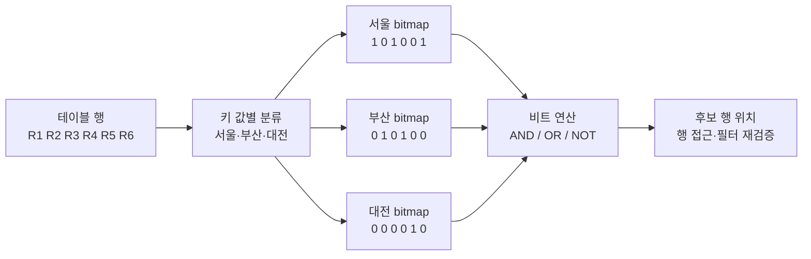
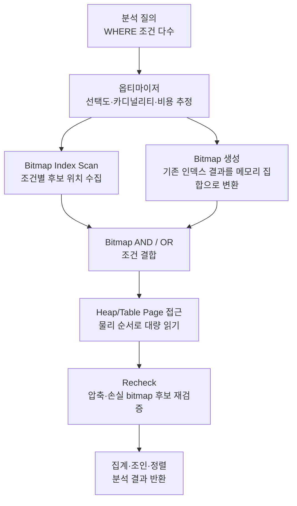

# 비트맵 인덱스(Bitmap Index)와 분석 데이터베이스 최적화

## 1. 개요

> **비트맵 인덱스(Bitmap Index)**란 인덱스 키의 각 값에 대해 행의 존재 여부를 비트열로 표현하고, 비트 단위 연산으로 여러 조건의 교집합·합집합을 빠르게 계산하는 데이터베이스 인덱스 구조이다.

일반적인 B-Tree 인덱스는 특정 키와 해당 행의 위치를 연결한다. 반면 비트맵 인덱스는 하나의 값이 어떤 행들에 나타나는지를 0과 1의 배열로 표현한다. 예를 들어 `성별=여`인 행의 비트만 1로 표시한 비트맵과 `지역=서울`인 행의 비트맵을 AND하면 두 조건을 동시에 만족하는 행의 위치를 한 번에 얻을 수 있다.

이 방식은 값의 종류가 적은 저카디널리티 컬럼과 대량의 행을 대상으로 하는 분석형 질의에서 특히 효과적이다. 성별, 지역 코드, 가입 채널, 상품 등급, 주문 상태처럼 반복 값이 많은 컬럼은 비트맵으로 압축하기 쉽고, 분석가는 여러 차원의 조건을 조합하는 질의를 자주 수행하기 때문이다.

반대로 주문이 계속 삽입·수정·삭제되는 온라인 트랜잭션 테이블에서는 비트맵 갱신과 동시성 제어 비용이 커질 수 있다. 그러므로 비트맵 인덱스는 “B-Tree보다 항상 빠른 인덱스”가 아니라, 데이터의 카디널리티·변경 빈도·질의 형태·저장 엔진의 구현을 함께 고려하여 선택하는 분석 최적화 수단으로 이해해야 한다.

정보관리기술사 답안에서는 비트맵의 구조만 설명하는 데 그치지 않고, 왜 저카디널리티·읽기 중심 환경에 적합한지, B-Tree와 어떤 트레이드오프가 있는지, 데이터웨어하우스와 스타 스키마에서 어떻게 적용하는지까지 연결해야 한다. 특히 데이터베이스 제품에 따라 “영구적으로 저장되는 Bitmap Index”와 “실행계획에서 임시로 생성되는 Bitmap Scan”이 다를 수 있으므로 이 둘을 구분하는 것이 중요하다.

## 2. 구조와 동작 원리

비트맵 인덱스는 인덱스 대상 컬럼의 값 집합과 행 위치의 대응 관계를 비트로 저장한다. 아래 그림에서 각 값은 하나의 비트맵을 갖고, 비트 위치는 테이블의 논리적 또는 물리적 행 위치를 가리킨다.

### 2.1 키 값과 비트 위치의 대응

어떤 테이블에 6개 행이 있고 지역 컬럼이 서울, 부산, 서울, 부산, 대전, 서울 순서로 저장되어 있다고 가정하자. 서울 bitmap은 `[1, 0, 1, 0, 0, 1]`이 된다. 첫 번째 비트와 세 번째·여섯 번째 비트가 1이므로 해당 행들이 서울이라는 뜻이다.

비트 하나만으로 모든 정보를 표현하는 것은 아니다. 데이터베이스는 비트맵과 함께 키 값의 사전, 비트맵의 저장 위치, 압축 블록, 행 위치를 실제 페이지 주소로 변환하는 매핑 정보를 관리한다. 따라서 비트맵 인덱스도 결국 테이블 행을 찾아가는 인덱스이며, 비트 연산 결과를 실제 데이터 페이지 접근으로 연결하는 단계가 필요하다.

NULL을 별도의 상태로 표현하는지, 행의 삽입·삭제로 인한 빈 위치를 어떻게 관리하는지는 제품과 구현에 따라 달라진다. 시험 답안에서는 “각 비트가 행의 존재를 나타낸다”는 핵심 원리를 설명하되, 물리적 rowid와 NULL 처리 방식은 DBMS별 차이가 있음을 명시하는 편이 안전하다.

### 2.2 비트 단위 질의 처리

`지역=서울 AND 채널=모바일` 질의가 들어오면 데이터베이스는 서울 bitmap과 모바일 bitmap을 AND한다. 두 비트가 모두 1인 위치만 1로 남기 때문에, 두 조건을 만족할 가능성이 있는 행 집합을 빠르게 만들 수 있다.

`지역=서울 OR 지역=부산`은 두 비트맵을 OR한다. 어느 한쪽이라도 1인 위치가 결과에 남는다. `NOT 지역=서울`은 서울 bitmap의 0인 위치를 취하는 방식으로 생각할 수 있지만, NULL과 삭제 행을 포함한 보정 규칙이 있으므로 실제 실행에서는 단순한 비트 반전으로 끝나지 않는다.

여러 조건이 결합되면 비트맵 연산은 CPU 레지스터와 메모리 대역폭을 효율적으로 사용할 수 있다. 인덱스 엔트리를 행 단위로 따라가는 대신 압축된 비트 블록을 순차적으로 처리하므로, 수천만 건 이상의 사실 테이블에서 다차원 필터를 수행할 때 유리하다.

### 2.3 압축과 저장 효율

값이 반복되는 컬럼에서는 연속된 0 또는 1이 많이 나타난다. 이때 모든 비트를 원형 그대로 저장하지 않고, 반복 길이 또는 구간을 저장하는 압축을 적용할 수 있다. 예를 들어 긴 0 구간을 “0이 10,000개”라는 식으로 표현하면 저장 공간과 디스크 읽기량을 줄일 수 있다.

압축 효율은 데이터 분포와 행 배치에 좌우된다. 같은 값이 물리적으로 가까이 모여 있으면 긴 반복 구간이 생겨 압축이 잘 되지만, 값이 무작위로 섞이면 비트가 자주 바뀌어 압축 효과가 줄어든다. 따라서 ETL 과정의 정렬, 파티션 구성, 클러스터링은 단순한 저장 관리가 아니라 비트맵 성능에도 영향을 준다.

압축은 저장 공간을 줄이는 대신 압축 해제나 구간 변환 비용을 유발할 수 있다. 하지만 분석 질의에서는 디스크 I/O를 줄이는 효과가 CPU 비용보다 큰 경우가 많다. 성능 평가는 인덱스 크기만 보지 말고, 캐시 적중률·논리 읽기·물리 읽기·비트 연산 시간·최종 테이블 접근 시간을 함께 측정해야 한다.

## 3. 핵심 구성요소와 실행 흐름

비트맵 인덱스 기반 질의는 일반적으로 “조건 분석 → 비트맵 생성 또는 조회 → 비트맵 결합 → 데이터 페이지 접근 → 잔여 조건 검증”의 흐름을 거친다. 영구 비트맵 인덱스를 제공하는 DBMS에서는 인덱스가 미리 저장되어 있고, 그렇지 않은 엔진에서는 B-Tree 등의 결과로 실행 중 bitmap을 만들 수도 있다.

### 3.1 옵티마이저의 선택

옵티마이저는 예상 반환 행 수, 컬럼의 선택도, 인덱스와 테이블의 통계, 메모리와 I/O 비용을 사용하여 비트맵 경로를 평가한다. 조건을 만족하는 행이 아주 적으면 B-Tree 인덱스에서 소수의 행을 직접 찾아가는 편이 낫다. 반대로 많은 행이 흩어진 페이지에 존재하면 각각의 행을 랜덤하게 방문하는 비용이 커지므로 비트맵 방식이 유리해질 수 있다.

통계가 오래되면 옵티마이저가 선택도를 잘못 예측한다. 실제로는 조건 결과가 1%인데 40%로 추정하거나, 반대로 많은 행이 나오는데 적은 행으로 예상하면 비트맵과 순차 스캔 중 잘못된 계획을 선택할 수 있다. 그러므로 통계 수집 주기와 데이터 분포 변화 감지는 인덱스 설계와 함께 관리해야 한다.

### 3.2 Bitmap AND·OR와 집합 처리

다차원 검색에서는 조건마다 후보 비트맵을 만든 뒤 AND·OR로 결합한다. AND는 조건을 추가할수록 후보를 줄이는 방향이고, OR는 여러 범주를 합쳐 후보를 늘리는 방향이다. 이 연산은 행을 하나씩 비교하는 대신 비트 블록 단위로 수행되므로 대량 데이터에서 연산량을 줄인다.

그러나 조건을 많이 붙인다고 항상 빨라지는 것은 아니다. 각 비트맵을 읽고 결합하는 비용과 최종 테이블 접근 비용이 있기 때문이다. 특정 조건이 거의 모든 행을 통과시키면 그 비트맵은 선택도가 낮아 도움이 적고, 압축이 잘 되지 않으면 오히려 중간 결과를 키울 수 있다.

### 3.3 테이블 페이지 접근과 재검증

결합된 비트맵은 실제 행 그 자체가 아니라 행 위치의 후보 집합이다. 엔진은 후보 위치를 바탕으로 테이블 페이지를 읽고 필요한 컬럼을 가져온다. 행을 물리적 페이지 순서로 묶어 읽으면 동일 페이지에 있는 여러 행을 한 번에 처리하여 랜덤 I/O를 줄일 수 있다.

압축된 또는 손실형 비트맵은 메모리 사용량을 줄이기 위해 페이지 단위로 “이 페이지에 후보가 있다” 정도만 표현할 수 있다. 이 경우 후보 페이지의 모든 행을 읽은 뒤 원래 조건을 다시 확인한다. 따라서 실행계획에 Recheck가 나타난다고 해서 인덱스가 틀린 것이 아니라, 공간·메모리 절약을 위한 정상적인 후보 재검증 과정일 수 있다.

## 4. 유형과 관련 구조

### 4.1 단일 컬럼 비트맵 인덱스

단일 컬럼 비트맵 인덱스는 하나의 차원에 대해 값별 비트맵을 갖는다. 성별처럼 값의 종류가 두 개뿐인 컬럼이나, 지역 코드·상태 코드처럼 정해진 코드 집합이 작은 컬럼에 적용하기 쉽다.

이 구조의 장점은 여러 단일 컬럼 인덱스를 조합할 수 있다는 점이다. 지역, 채널, 회원등급을 각각 인덱싱하면 분석가가 어떤 조합의 조건을 입력하더라도 각 비트맵을 AND하여 후보 행을 만들 수 있다. 다만 모든 컬럼에 무차별적으로 추가하면 인덱스 유지비와 저장 공간이 증가한다.

### 4.2 다중 컬럼 비트맵과 함수 기반 인덱스

DBMS에 따라 여러 컬럼의 조합을 하나의 인덱스 키로 구성하거나, 날짜에서 연도·월을 추출하는 표현식에 인덱스를 만들 수 있다. 이런 설계는 자주 반복되는 분석 조건을 줄여 주지만, 질의 표현이 인덱스 정의와 달라지면 옵티마이저가 활용하지 못할 수 있다.

다중 컬럼 인덱스는 조합의 수가 급증하는 문제를 가진다. 컬럼 A·B·C의 모든 값 조합을 미리 만들면 인덱스가 커지고 값 분포 변화에 민감해진다. 따라서 범용적인 ad hoc 분석에는 단일 차원 비트맵의 조합이 유연하고, 반복되는 핵심 보고서에는 다중 컬럼 또는 사전 집계 구조가 유리할 수 있다.

### 4.3 비트맵 조인 인덱스

스타 스키마에서는 사실 테이블의 외래키와 차원 테이블의 속성을 조인하여 필터링하는 질의가 많다. 비트맵 조인 인덱스는 차원 속성의 값을 사실 테이블 행의 위치와 연결하여, 차원 테이블을 매번 조인하지 않고도 사실 행 후보를 빠르게 만들도록 설계한다.

예를 들어 판매 사실 테이블에 고객의 지역 코드가 직접 저장되지 않고 고객 차원 테이블에만 있다면, “서울 고객의 판매액” 질의는 고객 차원과 판매 사실의 조인을 필요로 한다. 비트맵 조인 인덱스는 이 관계를 인덱스 수준에서 표현하여 반복적인 차원 필터의 비용을 줄일 수 있다.

대신 차원 값이 바뀌거나 사실 테이블과 차원 테이블의 관계가 변경될 때 인덱스 유지 비용이 발생한다. 분석용으로 거의 변경되지 않는 차원과 대량 조회가 반복되는 사실 테이블에 적합하며, 변경이 빈번한 운영 테이블에 무리하게 적용하면 갱신 지연이 커진다.

## 5. B-Tree·해시 인덱스와 비교

B-Tree는 정렬된 키 공간을 탐색하므로 범위 검색, 정렬 결과 제공, 높은 카디널리티의 점 조회에 강하다. 반면 비트맵 인덱스는 값별 행 집합을 비트로 묶기 때문에 저카디널리티 조건을 여러 개 조합하는 분석 질의에서 강점을 보인다.

해시 인덱스는 해시 값을 이용해 동등 비교를 빠르게 찾는 구조다. 범위 조건이나 정렬에는 약하며, 엔진별 제약도 있다. 비트맵은 동등 조건을 조합하는 분석에 유리하지만, 값의 종류가 매우 많거나 갱신이 잦을 때는 비트맵이 항상 적합하지 않다.

| 구분 | 비트맵 인덱스 | B-Tree 인덱스 | 해시 인덱스 |
|---|---|---|---|
| 기본 표현 | 값별 비트열과 행 위치 | 정렬된 키와 행 위치 | 해시 버킷과 키 위치 |
| 적합한 카디널리티 | 낮음~중간 | 낮음~높음, 범용 | 동등 조건 중심 |
| 강점 | 다중 조건 AND·OR, 대량 분석 | 범위·정렬·점 조회 | 정확한 동등 조회 |
| 데이터 변경 | 읽기 중심에 유리, 갱신 부담 가능 | 일반 OLTP에 범용적 | 엔진별 제약과 충돌 고려 |
| 결과 접근 | 후보 비트맵 후 페이지 접근 | 키 순서로 행 직접 접근 | 버킷에서 후보 접근 |
| 대표 적용 | 데이터웨어하우스·스타 스키마 | 거래 테이블·혼합 업무 | 특정 키 조회 |

이 비교에서 중요한 것은 인덱스 이름보다 접근 패턴이다. 고객번호처럼 거의 모든 값이 서로 다른 컬럼을 비트맵으로 만들면 값별 비트맵이 지나치게 많아지고 압축 이점이 약해진다. 반대로 성별처럼 값 종류가 적은 컬럼이라도 단일 행만 찾는 OLTP 질의에서는 B-Tree의 직접 탐색이 더 단순할 수 있다.

또한 B-Tree와 비트맵은 서로 배타적인 선택이 아니다. 분석 시스템에서 날짜·고유 식별자에는 B-Tree를, 상태·지역·채널에는 비트맵을 함께 두고 옵티마이저가 질의별로 선택하도록 할 수 있다. 다만 중복 인덱스가 늘면 로드 시간과 저장 공간이 증가하므로 사용률을 모니터링해야 한다.

## 6. 적용 절차와 운영 전략

첫째, 업무 질의를 수집한다. 어떤 컬럼이 WHERE·JOIN·GROUP BY에 반복되는지, 결과 행 비율이 어느 정도인지, 날짜 범위가 어떻게 사용되는지 파악한다. 인덱스는 테이블 정의에서 출발하는 것이 아니라 실제 접근 패턴에서 출발해야 한다.

둘째, 컬럼별 카디널리티와 변경 빈도를 측정한다. `distinct 값 수 / 전체 행 수`가 낮다고 해서 자동으로 적합한 것은 아니다. 하루 수백만 건의 DML이 발생하는 컬럼이면 비트맵 유지 비용과 잠금 경합이 더 큰 문제가 될 수 있다.

셋째, 대표 질의를 기준으로 실행계획을 비교한다. 비트맵 인덱스 추가 전·후에 총 비용, 실제 실행 시간, 논리·물리 I/O, CPU, 메모리 사용량, 반환 행 수를 기록한다. 평균값만 보면 피크 시간의 병목을 놓칠 수 있으므로 업무 시간대와 배치 시간대를 나누어 측정한다.

넷째, 데이터 적재와 인덱스 유지 전략을 결정한다. 대량 적재 전에 인덱스를 비활성화하고 적재 후 재생성할지, 파티션 단위로 교체할지, 증분 ETL마다 유지할지 선택한다. 이 결정은 데이터 신선도와 배치 윈도우 사이의 트레이드오프를 만든다.

다섯째, 사용되지 않는 인덱스를 정리한다. 인덱스가 존재한다는 사실만으로 품질을 보장할 수 없다. 옵티마이저가 반복적으로 순차 스캔을 선택한다면 통계·분포·질의 형태·인덱스 설계를 재검토하고, 효과가 없는 인덱스는 운영 복잡성을 줄이기 위해 제거를 검토한다.

## 7. 사례와 성능 해석

### 사례 1: 유통 데이터웨어하우스

유통 기업의 판매 사실 테이블이 수억 건이고, 일별 판매 배치로 적재된다고 가정하자. 분석가는 “2026년 2분기, 서울 지역, 모바일 채널, 특정 상품군”과 같이 여러 조건을 조합해 매출을 집계한다. 지역·채널·상품군은 반복 값이 많고, 질의는 많은 행을 읽은 뒤 집계하는 형태이므로 비트맵 조합이 적합할 가능성이 높다.

이때 날짜 컬럼은 파티션 키로 사용하여 먼저 기간을 줄이고, 파티션 내부에서 지역·채널·상품군 비트맵을 AND하는 전략을 세울 수 있다. 파티션 프루닝과 비트맵 필터링이 함께 작동하면 불필요한 파티션과 행 페이지를 줄일 수 있다. 그러나 실제 효과는 데이터의 물리적 정렬, 파티션 크기, 압축 방식, 집계 연산의 병렬성에 따라 달라진다.

### 사례 2: 주문 처리 OLTP 시스템

온라인 주문 테이블에서 주문 상태가 결제대기·결제완료·배송중·취소로 바뀌고, 초당 많은 갱신이 발생한다고 하자. 상태 컬럼은 저카디널리티라서 비트맵 후보처럼 보이지만, 상태 변경마다 인덱스 유지와 동시성 제어가 필요하다.

운영 화면이 특정 상태의 최근 주문 몇 건만 조회한다면 날짜와 주문번호 중심의 B-Tree가 더 예측 가능한 응답을 제공할 수 있다. 비트맵을 추가하더라도 분석용 읽기 복제본이나 별도 집계 테이블에 제한하는 것이 안전하다. 이 사례는 컬럼의 카디널리티만으로 인덱스를 결정하면 안 된다는 점을 보여 준다.

### 사례 3: PostgreSQL의 Bitmap Scan 해석

PostgreSQL과 같이 실행계획에서 여러 인덱스 결과를 bitmap으로 결합할 수 있는 시스템에서는 “Bitmap Index Scan”이 곧 영구 비트맵 인덱스가 있다는 뜻은 아니다. B-Tree 인덱스를 각각 스캔한 결과를 메모리 bitmap으로 만든 뒤 BitmapAnd·BitmapOr를 수행하고, Bitmap Heap Scan으로 테이블 페이지를 읽는 실행 전략일 수 있다.

따라서 기술사는 제품 문서와 실행계획을 함께 확인해야 한다. 영구 Bitmap Index의 저장·갱신 특성과, 실행 중 생성되는 bitmap scan의 메모리·페이지 접근 특성은 성능과 장애 원인이 다르다. 이 구분을 답안에 포함하면 구조 설명과 운영 진단을 연결할 수 있다.

## 8. 심화: 데이터웨어하우스 최적화와 현대적 저장 엔진

비트맵 인덱스는 컬럼 지향 저장, 압축, 벡터화 실행과 상호보완적인 관계를 가진다. 컬럼 지향 저장은 필요한 컬럼만 읽고 같은 컬럼의 값들을 연속 처리하게 하며, 비트맵은 행 후보를 빠르게 줄인다. 두 기법을 함께 적용하면 필터 단계에서는 비트 연산을, 집계 단계에서는 컬럼 단위 SIMD 처리를 활용할 수 있다.

다만 모든 컬럼형 분석 엔진이 전통적 비트맵 인덱스를 사용자에게 노출하는 것은 아니다. 일부 엔진은 사전 인코딩, 존 맵, 삭제 벡터, 런 길이 압축, 벡터화 필터 등 다른 구조로 비슷한 효과를 제공한다. 따라서 “비트맵 인덱스를 설치한다”는 제품 중심 표현보다 “저카디널리티 조건의 집합 필터를 압축·벡터화하여 처리한다”는 논리적 목표를 먼저 정의해야 한다.

데이터가 증가하면 인덱스 재생성보다 파티션 단위 관리가 중요해진다. 오래된 파티션은 읽기 전용으로 고정하고 강하게 압축하며, 최신 파티션은 적재·갱신 요구에 맞춰 다른 인덱스 전략을 적용할 수 있다. 이처럼 시간축에 따른 데이터 생애주기 관리와 인덱스 정책을 결합하면 저장 비용과 질의 성능을 동시에 통제할 수 있다.

품질 측면에서는 인덱스가 빠른 결과를 내더라도 최신성과 정합성이 보장되어야 한다. ETL 실패로 비트맵과 사실 데이터의 시점이 어긋나면 잘못된 집계가 반환될 수 있으므로, 적재 완료 후 건수·체크섬·파티션별 통계·대표 질의 결과를 검증하는 데이터 품질 게이트가 필요하다.

## 9. 고려사항 및 시사점

### 9.1 카디널리티와 선택도

저카디널리티는 유리한 출발점이지 충분조건이 아니다. 컬럼 값 종류가 적어도 특정 질의가 대부분의 행을 반환하면 필터 효과가 약하다. 전체 행 수 대비 반환 행 수, 값 분포의 편중, 조건 결합 후 후보 감소율을 함께 평가해야 한다.

### 9.2 DML과 동시성

비트맵 인덱스는 읽기 중심·배치 적재 환경과 잘 맞지만, 빈번한 행 변경이 있는 OLTP에서는 갱신 비용과 경합이 문제 될 수 있다. 운영 테이블과 분석 테이블을 분리하거나, 읽기 복제본·파티션 교체·마이크로 배치로 변경 범위를 제한하는 설계가 필요하다.

### 9.3 통계와 실행계획

인덱스를 만들고 끝내지 말고 통계 갱신과 실행계획 회귀 테스트를 운영해야 한다. 데이터 분포가 바뀌거나 새 조건이 추가되면 옵티마이저가 순차 스캔·B-Tree·비트맵 경로 중 다른 선택을 할 수 있다. 계획 변경을 배포 파이프라인에서 감지하면 성능 저하를 조기에 발견할 수 있다.

### 9.4 파티션·압축·저장 레이아웃

비트맵 성능은 인덱스 자체뿐 아니라 행 배치와 파티션 설계에 영향을 받는다. 날짜 파티션, 클러스터링, 압축 단위, 캐시 용량을 함께 설계해야 한다. 특히 최신 파티션의 높은 변경 빈도와 과거 파티션의 읽기 중심 특성을 같은 정책으로 다루지 않는 것이 중요하다.

### 9.5 제품별 의미 차이

Oracle과 같은 제품의 영구 Bitmap Index, PostgreSQL의 Bitmap Index Scan, 컬럼형 엔진의 bitmap filter는 이름은 비슷하지만 저장·생성·갱신 방식이 다를 수 있다. 시험 답안과 현장 진단에서는 기능명을 그대로 일반화하지 말고, “지속 인덱스인가, 실행 중 임시 집합인가”를 먼저 확인해야 한다.

### 9.6 성능과 비용의 균형

성능 향상을 위해 모든 차원에 인덱스를 추가하면 저장 공간, 적재 시간, 운영 복잡도가 증가한다. 핵심 질의의 업무 가치와 SLA를 기준으로 투자 우선순위를 정하고, 인덱스별 사용률·절감 I/O·추가 유지 비용을 지표화해야 한다. 기술사 관점에서는 단일 쿼리의 최고 성능보다 전체 데이터 플랫폼의 총소유비용과 예측 가능성을 중시해야 한다.

## 참고자료

- [Oracle Database Concepts — Indexes and Index-Organized Tables](https://docs.oracle.com/en/database/oracle/oracle-database/21/cncpt/indexes-and-index-organized-tables.html)
- [PostgreSQL Documentation — Combining Multiple Indexes](https://www.postgresql.org/docs/current/indexes-bitmap-scans.html)
- [PostgreSQL Documentation — Index Scanning](https://www.postgresql.org/docs/current/index-scanning.html)

---

> **한 줄 요약**: 비트맵 인덱스는 저카디널리티·읽기 중심 분석 환경에서 값별 행 집합을 압축된 비트로 결합해 다중 조건 필터를 가속하지만, DML·동시성·제품별 실행 의미까지 함께 평가해야 하는 선택적 최적화 기법이다.
