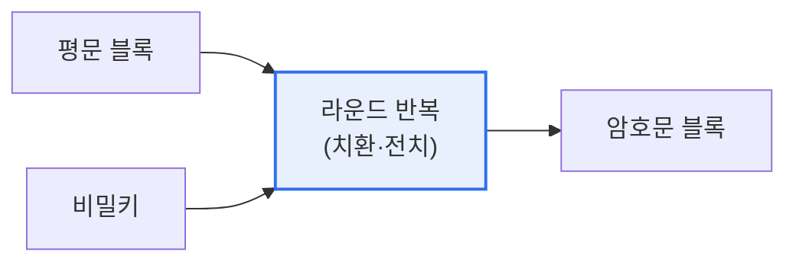

# 블록 암호화 알고리즘(Block Cipher)

## 1. 개요

### 가. 정의
> 평문을 **고정된 크기의 블록(예: 64비트·128비트) 단위로 나누어 암호화**하는 대칭키 암호 방식. 비트·바이트 단위로 처리하는 스트림 암호와 대비된다.

블록 암호를 이해하는 핵심 원리는 **혼돈(Confusion)과 확산(Diffusion)** 이라는 두 개념이다(섀넌이 제시). **혼돈** 은 암호키와 암호문 사이의 관계를 최대한 복잡하게 만들어 키를 추측하기 어렵게 하는 것이고, **확산** 은 평문 한 비트의 변화가 암호문 전체에 널리 퍼지게 하여 통계적 분석을 무력화하는 것이다. 이 두 성질을 얻기 위해 블록 암호는 치환(Substitution)과 전치(Permutation)를 여러 라운드에 걸쳐 반복한다. 한 번의 변환으로는 부족하지만, 이를 여러 번 반복하면 평문과 암호문의 관계가 충분히 뒤섞여 해독이 사실상 불가능해진다.

### 나. 구조: Feistel과 SPN
블록 암호의 대표 구조는 두 가지다. **Feistel 구조**(DES)는 블록을 좌우로 나눠 한쪽에 함수를 적용하고 교환하는 방식을 반복해, 암·복호화 구조가 같아 구현이 간단하다. **SPN 구조**(AES)는 전체 블록에 치환·전치를 병렬 적용해 확산이 빠르다.

## 2. 동작 개념도

## 3. 주요 알고리즘

블록 암호는 시대에 따라 발전해왔다. 초기 표준인 **DES** 는 키가 56비트로 짧아 현대 컴퓨팅으로 쉽게 뚫려 사실상 폐기되었고, 이를 세 번 적용한 **3DES** 는 안전성은 높였으나 느리다. 현재 표준인 **AES** 는 128비트 블록에 128·192·256비트 키를 쓰며, SPN 구조로 안전하고 빠르며 하드웨어 가속(AES-NI)까지 지원해 사실상 전 세계 표준이 되었다. 국내에서는 **SEED·ARIA** 가 표준으로 쓰인다.

| 알고리즘 | 블록/키 크기 | 구조 | 특징 |
|---|---|---|---|
| **DES** | 64 / 56비트 | Feistel | 키 짧음, 사실상 폐기 |
| **3DES** | 64 / 112·168 | Feistel | DES 3회, 느림 |
| **AES** | 128 / 128·192·256 | SPN | **현 표준**, 안전·고속 |
| **SEED / ARIA** | 128 | Feistel / SPN | 국산 표준 |

## 4. 운영 모드(Block Cipher Mode)

블록 암호는 고정 크기 블록만 처리하므로, 그보다 긴 데이터를 암호화하려면 블록들을 어떻게 연결할지 정하는 **운영 모드** 가 필요하다. 이 선택이 안전성을 크게 좌우한다. **ECB** 는 각 블록을 독립적으로 암호화해 간단하지만, 같은 평문 블록이 같은 암호문이 되어 패턴이 노출되므로 사용을 피해야 한다. **CBC** 는 이전 암호문과 XOR한 뒤 암호화해 패턴을 없애며 초기화벡터(IV)를 쓴다. **CTR** 은 카운터를 암호화해 스트림처럼 쓰며 병렬 처리가 가능하고, **GCM** 은 CTR에 인증(무결성 검증)을 결합한 최신 표준이다.

| 모드 | 특징 |
|---|---|
| **ECB** | 블록 독립 암호화, 패턴 노출(취약) |
| **CBC** | 이전 암호문과 XOR(연쇄), IV 사용 |
| **CTR** | 카운터 암호화, 병렬·스트림처럼 |
| **GCM** | CTR + 인증(무결성), 최신 표준 |

## 5. 고려사항 및 시사점

1. **AES가 사실상 표준**이며, 하드웨어 가속(AES-NI)으로 성능 부담 없이 강력한 보안을 제공한다. 신규 시스템은 AES-256/GCM을 기본으로 고려한다.
2. **운영 모드 선택이 안전성을 좌우**한다. ECB는 절대 피하고, 기밀성만 필요하면 CBC·CTR, 무결성까지 필요하면 GCM을 선택한다.
3. **양자내성암호(PQC) 전환에 대비**한다. 양자컴퓨터가 대칭키를 위협하는 정도는 제한적이라(그로버 알고리즘) 키 길이를 늘리면 대응 가능하지만, 함께 쓰이는 공개키 암호는 PQC로의 전환이 필요하다.

---

> **한 줄 요약**: 블록 암호는 평문을 고정 블록 단위로 *혼돈·확산* 을 반복 적용해 암호화하며, SPN 구조의 AES가 표준이고 ECB(취약)·CBC·CTR·GCM 등 운영 모드 선택이 안전성을 좌우하므로 GCM 등 무결성 결합 모드가 권장된다.
