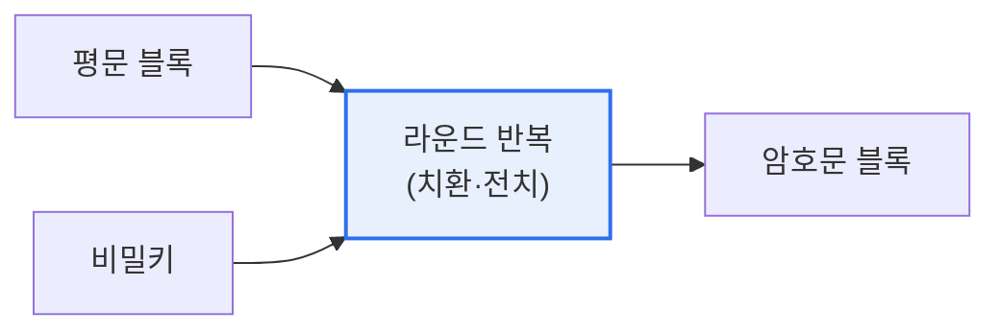

# 블록 암호화 알고리즘(Block Cipher)

## 1. 개요

### 가. 정의
> 평문을 **고정 크기 블록(예: 64·128비트) 단위로 나누어 암호화**하는 대칭키 암호 방식. 스트림 암호가 비트·바이트 단위인 것과 대비된다.

블록 암호의 핵심은 '**혼돈(Confusion)과 확산(Diffusion)**'이다. 혼돈은 키와 암호문의 관계를 복잡하게, 확산은 평문 한 비트 변화가 암호문 전체에 퍼지게 하여 통계적 분석을 어렵게 만든다. 이를 위해 치환·전치를 여러 라운드 반복하는 구조(Feistel·SPN)를 사용한다.

## 2. 구조 및 주요 알고리즘

| 알고리즘 | 블록/키 | 구조 | 특징 |
|---|---|---|---|
| **DES** | 64 / 56비트 | Feistel | 취약(키 짧음), 사실상 폐기 |
| **3DES** | 64 / 112·168 | Feistel | DES 3회, 느림 |
| **AES** | 128 / 128·192·256 | SPN | **현 표준**, 안전·고속 |
| **SEED / ARIA** | 128 | Feistel / SPN | 국산 표준 |

## 3. 운영 모드(Block Cipher Mode)

| 모드 | 특징 |
|---|---|
| **ECB** | 블록 독립 암호화, 패턴 노출(취약) |
| **CBC** | 이전 암호문과 XOR(연쇄), IV 사용 |
| **CTR** | 카운터 암호화, 병렬·스트림처럼 |
| **GCM** | CTR + 인증(무결성), 최신 표준 |

## 4. 시사점
- **AES가 사실상 표준** — 하드웨어 가속(AES-NI)으로 고속
- 운영 모드 선택 중요(ECB 금지, 무결성 필요 시 GCM)
- 양자내성암호(PQC) 전환 대비(대칭키는 키 길이 증대로 대응)

---

> **한 줄 요약**: 블록 암호는 평문을 고정 블록 단위로 *혼돈·확산* 을 반복 적용해 암호화하며, AES(SPN)가 표준이고 ECB·CBC·CTR·GCM 등 운영 모드 선택이 안전성을 좌우한다.
