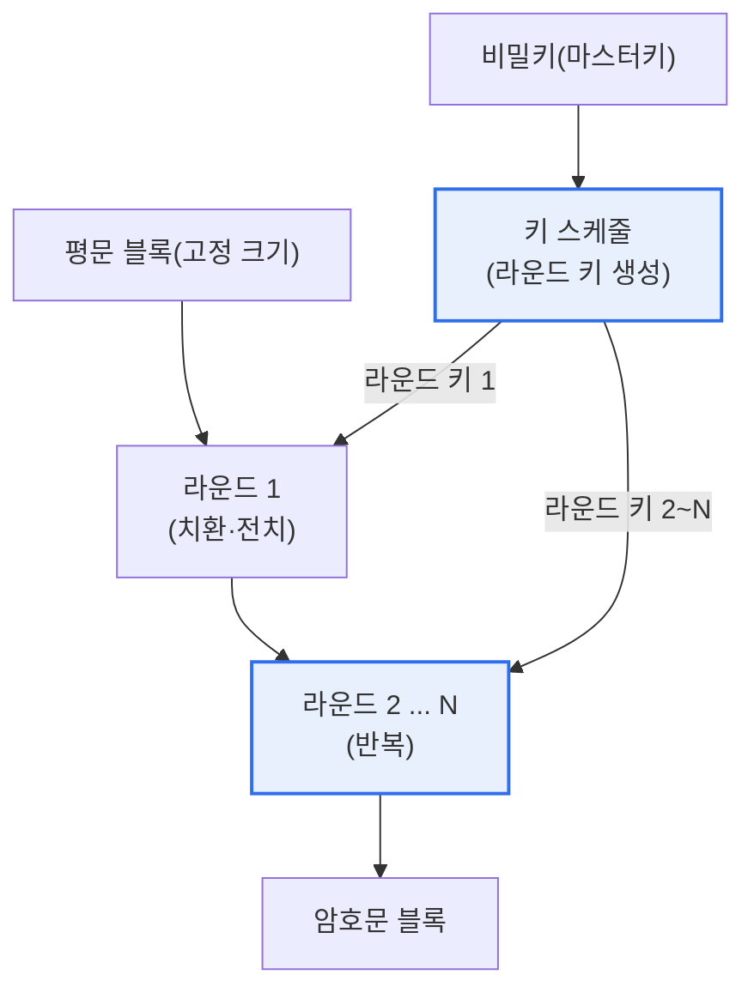
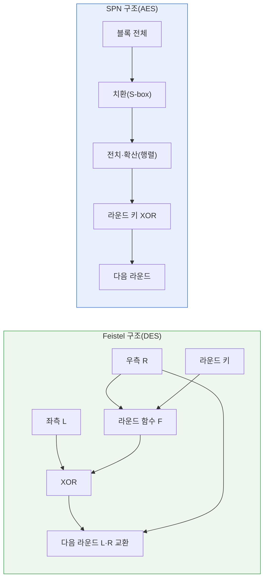
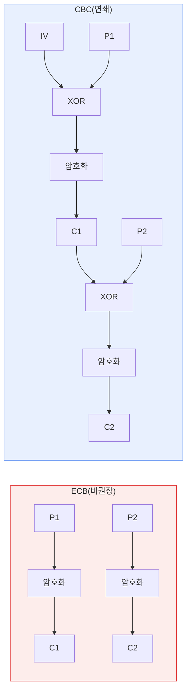

# 블록 암호화 알고리즘(Block Cipher)

## 1. 개요

### 가. 정의
> 블록 암호는 **평문을 고정된 크기의 블록(예: 64비트·128비트) 단위로 나누어, 하나의 비밀키로 각 블록을 암호화·복호화하는 대칭키 암호 방식**이다. 비트·바이트 단위로 키스트림을 생성해 순차적으로 처리하는 스트림 암호와 대비된다.

블록 암호가 등장하고 오늘날 암호 시스템의 근간이 된 배경에는, "**대량의 데이터를 빠르고 안전하게, 그리고 표준화된 방식으로 암호화한다**"는 현실적 요구가 있다. 1970년대 이전까지 암호는 군사·외교 영역의 비공개 기술이었으나, 금융 전산화와 상용 통신이 확산되면서 누구나 검증할 수 있는 공개 표준 암호가 필요해졌다. 미국 NBS(현 NIST)가 1977년 DES를 표준으로 채택한 것이 그 출발점이며, 이후 AES 공모(1997~2001)를 거치며 블록 암호는 "공개된 알고리즘, 비밀은 오직 키뿐"이라는 케르크호프스 원칙 위에서 발전해 왔다. 오늘날 TLS로 보호되는 웹 트래픽, 디스크 전체 암호화(BitLocker·FileVault), 무선랜(WPA2/3), 금융 IC카드의 데이터 보호가 사실상 모두 블록 암호에 의존한다.

### 나. 설계 원리 — 혼돈(Confusion)과 확산(Diffusion)
블록 암호의 안전성을 이해하는 가장 근본적인 개념은 클로드 섀넌이 1949년에 제시한 **혼돈(Confusion)과 확산(Diffusion)** 이다. 혼돈은 암호키와 암호문 사이의 통계적 관계를 최대한 복잡하게 만들어, 암호문을 아무리 분석해도 키의 어느 비트가 어떻게 작용했는지 추측하기 어렵게 만드는 성질이다. 이는 주로 비선형 치환 함수인 **S-box(Substitution box)** 를 통해 구현된다. S-box는 입력 비트 패턴을 예측 불가능한 출력 패턴으로 바꾸는 조회표로, 여기에 선형성이 조금이라도 남으면 선형 공격의 실마리가 되므로 설계 시 가장 공을 들이는 부분이다.

확산은 평문 한 비트(또는 키 한 비트)의 변화가 암호문의 여러 비트에 널리 퍼지게 하는 성질이다. 이상적으로는 평문 1비트를 뒤집으면 암호문 비트의 절반가량이 무작위로 바뀌어야 하며, 이를 **눈사태 효과(Avalanche Effect)** 라 부른다. 확산이 충분하면 공격자가 평문·암호문 쌍을 다량 확보해 통계 분석을 시도해도 규칙성을 찾지 못한다. 확산은 주로 비트 위치를 뒤섞는 전치(Permutation)와 행렬 곱 형태의 확산 계층으로 구현된다.

핵심은 치환과 전치를 **여러 라운드(round)에 걸쳐 반복**한다는 점이다. 한 번의 치환·전치만으로는 혼돈·확산이 부족해 분석에 노출되지만, 이를 10회 이상 반복하면 평문과 암호문의 관계가 충분히 뒤섞여 현실적 시간 안에 해독이 불가능해진다. 예컨대 AES-128은 10라운드, AES-256은 14라운드를 수행하는데, 라운드 수는 알려진 최선의 공격에 대해 충분한 안전 여유(security margin)를 두도록 결정된다.

## 2. 전체 구조 개념도

블록 암호는 원본 키로부터 각 라운드에서 쓸 **라운드 키**를 파생하는 키 스케줄과, 그 라운드 키를 이용해 블록을 반복 변환하는 라운드 함수로 구성된다. 아래 개념도는 평문 블록이 라운드를 거쳐 암호문이 되는 전체 흐름을 보여준다.

```mermaid
flowchart TB
  K["비밀키(마스터키)"] --> KS["키 스케줄<br/>(라운드 키 생성)"]
  P["평문 블록(고정 크기)"] --> R1["라운드 1<br/>(치환·전치)"]
  KS -->|"라운드 키 1"| R1
  R1 --> R2["라운드 2 ... N<br/>(반복)"]
  KS -->|"라운드 키 2~N"| R2
  R2 --> C["암호문 블록"]
  style KS fill:#e8f0fe,stroke:#2f6fed,stroke-width:2px
  style R2 fill:#e8f0fe,stroke:#2f6fed,stroke-width:2px
```

여기서 반드시 짚어야 할 점은 **키 스케줄의 품질도 안전성의 일부**라는 것이다. 라운드 키들이 서로 약한 상관관계를 가지면 관련키 공격(related-key attack)의 표적이 되므로, 마스터키에서 라운드 키를 파생하는 과정 자체가 비선형이고 예측 불가능해야 한다. 실제로 DES는 소수의 "약한 키(weak key)"가 존재해 암호화와 복호화가 동일해지는 문제가 알려져 있으며, 좋은 블록 암호는 이런 예외 키가 없도록 설계된다.

## 3. 내부 구조 — Feistel과 SPN

블록 암호의 라운드 함수를 조직하는 대표 방식은 **Feistel 구조**와 **SPN(Substitution-Permutation Network) 구조** 두 가지다. 두 구조는 "치환·전치를 반복한다"는 목표는 같지만, 그것을 배치하는 방법이 달라 구현 편의성과 성능에서 서로 다른 특성을 낳는다.

```mermaid
flowchart LR
  subgraph FE["Feistel 구조(DES)"]
    L0["좌측 L"] --> X1["XOR"]
    R0["우측 R"] --> F["라운드 함수 F"]
    KF["라운드 키"] --> F
    F --> X1
    X1 --> Rn["다음 라운드 L·R 교환"]
    R0 --> Rn
  end
  subgraph SP["SPN 구조(AES)"]
    IN["블록 전체"] --> SB["치환(S-box)"]
    SB --> PM["전치·확산(행렬)"]
    PM --> AK["라운드 키 XOR"]
    AK --> OUT["다음 라운드"]
  end
  style FE fill:#eef7ee,stroke:#2f9e44
  style SP fill:#e8f0fe,stroke:#2f6fed
```

**Feistel 구조**는 블록을 좌·우 절반(L, R)으로 나눈 뒤 한쪽에만 라운드 함수 F를 적용하고 그 결과를 반대쪽과 XOR한 다음 좌우를 교환하는 과정을 반복한다. 이 구조의 가장 큰 실무적 장점은 **암호화와 복호화의 회로 구조가 동일**하다는 것이다. 라운드 키를 역순으로 넣기만 하면 같은 하드웨어·소프트웨어로 복호화가 되므로 구현 비용이 절반으로 줄어든다. 또한 라운드 함수 F 자체가 역함수를 가질 필요가 없어(XOR로 되돌리므로) S-box 설계 자유도가 높다. DES, 3DES, SEED, Blowfish가 이 계열이다. 단점은 한 라운드에 블록의 절반만 변환되므로 충분한 확산을 얻으려면 상대적으로 많은 라운드가 필요하다는 점이다.

**SPN 구조**는 블록 전체에 대해 치환(S-box) 계층과 전치·확산 계층, 라운드 키 XOR를 순서대로 적용한다. 블록 전체가 매 라운드 변환되므로 **확산이 빠르고 병렬화에 유리**하며, 현대 CPU의 SIMD 명령이나 전용 하드웨어와 궁합이 좋다. AES, ARIA가 대표적이다. 대신 복호화 시에는 S-box와 확산 행렬의 역변환이 필요해 암·복호화 회로가 서로 다르다. AES가 소프트웨어와 하드웨어 양쪽에서 매우 빠른 이유가 바로 이 SPN 구조의 병렬성과, 뒤에서 설명할 AES-NI 명령어 지원에 있다.

두 구조의 차이가 실무에 주는 함의는 분명하다. 극도로 제약된 임베디드 환경이나 암·복호화 로직을 하나로 유지해야 하는 경우 Feistel의 대칭성이 유리하고, 서버·모바일처럼 처리량이 중요한 환경에서는 SPN의 병렬성이 유리하다.

이 밖에도 덧셈·회전·XOR만으로 라운드 함수를 구성하는 **ARX(Add-Rotate-XOR)** 구조가 최근 각광받는다. S-box 조회표를 쓰지 않아 캐시 타이밍 사이드채널에 강하고 소프트웨어 구현이 가벼워, 국산 경량 암호 LEA나 스트림 암호 ChaCha20이 이 방식을 채택했다. 구조 선택은 결국 "안전성 여유, 구현 대상 플랫폼, 사이드채널 위협"이라는 세 축의 절충이며, 정답이 하나로 정해져 있지 않다.

## 4. 주요 알고리즘의 변천

블록 암호는 컴퓨팅 성능의 발전과 공격 기법의 진화에 맞춰 세대교체를 거듭해 왔다. 초기 표준인 **DES**는 64비트 블록에 실질 56비트 키를 사용했는데, 발표 당시부터 짧은 키 길이가 우려되었다. 실제로 1998년 EFF가 약 25만 달러로 제작한 전용 장비 "Deep Crack"이 56비트 키를 56시간 만에 전수조사(brute-force)로 뚫으면서 DES의 수명은 사실상 끝났다. 이는 "키 공간 2⁵⁶은 더 이상 안전하지 않다"는 것을 실증한 상징적 사건이었다.

과도기적 대안으로 등장한 **3DES(Triple DES)** 는 DES를 세 개의 키로 세 번(암호화-복호화-암호화) 적용해 유효 키 길이를 112비트로 끌어올렸다. 안전성은 확보했으나 DES를 3회 수행하므로 속도가 1/3로 느리고, 여전히 64비트 블록이라는 근본적 한계(뒤에서 설명하는 Sweet32 공격에 노출)를 안고 있었다. NIST는 이런 이유로 3DES를 2023년 말 이후 신규 사용 금지 대상으로 규정했다.

블록 암호의 안전성은 단순히 키가 길다고 보장되지 않으며, 알려진 분석 기법을 얼마나 견디는지로 평가된다. 대표적 공격 기법으로 **차분 공격(differential cryptanalysis)** 은 입력 차이가 출력 차이로 전파되는 확률적 편향을 이용하고, **선형 공격(linear cryptanalysis)** 은 입력·출력·키 비트 사이의 근사적 선형 관계를 통계적으로 누적해 키를 복원한다. 좋은 블록 암호는 S-box와 확산 계층을 이 두 공격의 성공 확률이 무시할 만큼 작아지도록 설계하며, 여기에 충분한 라운드 수로 안전 여유를 더한다. AES가 오랜 검증을 견딘 것도 이런 분석에 대한 저항성이 수학적으로 뒷받침되었기 때문이다.

현재의 사실상 전 세계 표준은 **AES(Advanced Encryption Standard)** 다. 벨기에 연구자들이 설계한 Rijndael 알고리즘이 5년간의 공개 공모·검증을 거쳐 2001년 표준으로 확정되었다. AES는 128비트 블록에 128·192·256비트 키를 지원하며, SPN 구조로 안전하고 빠르다. 20년 넘게 전 세계의 집중 분석을 받았지만 전체 라운드에 대한 실용적 공격은 아직 발견되지 않았다. 국내에서는 한국형 표준인 **SEED**(1999, KISA 개발, Feistel 계열, 128비트)와 **ARIA**(2004, 국가 표준, SPN 계열, 128비트)가 공공·금융 분야에서 널리 사용된다. 경량 IoT 환경을 위한 국산 경량 블록 암호 **LEA**(2013)도 표준화되어 있다.

| 알고리즘 | 블록/키 크기(비트) | 구조 | 특징 및 현황 |
|---|---|---|---|
| **DES** | 64 / 56 | Feistel | 키 짧음, 1998년 전수조사로 파훼, 폐기 |
| **3DES** | 64 / 112·168 | Feistel | DES 3회, 느림·64비트 한계, 2023년 이후 금지 |
| **AES** | 128 / 128·192·256 | SPN | **현 국제표준**, 안전·고속, HW 가속 |
| **SEED / ARIA** | 128 / 128 | Feistel / SPN | 국산 표준(공공·금융) |
| **LEA** | 128 / 128·192·256 | ARX | 국산 경량, IoT·저전력 환경 |

## 5. 운영 모드(Block Cipher Mode of Operation)

블록 암호 자체는 고정된 크기의 블록 하나만 변환하는 함수다. 그러나 현실의 데이터(파일, 통신 패킷, 데이터베이스 레코드)는 블록 크기보다 훨씬 길기 때문에, 여러 블록을 **어떻게 연결해 암호화할지 규정하는 운영 모드**가 반드시 필요하다. 같은 AES를 쓰더라도 운영 모드를 잘못 선택하면 안전성이 무너지므로, 실무에서 알고리즘 선택 못지않게 중요한 결정이다.

```mermaid
flowchart LR
  subgraph ECB["ECB(비권장)"]
    P1["P1"] --> E1["암호화"] --> C1["C1"]
    P2["P2"] --> E2["암호화"] --> C2["C2"]
  end
  subgraph CBC["CBC(연쇄)"]
    IV["IV"] --> XX1["XOR"]
    PP1["P1"] --> XX1 --> EE1["암호화"] --> CC1["C1"]
    CC1 --> XX2["XOR"]
    PP2["P2"] --> XX2 --> EE2["암호화"] --> CC2["C2"]
  end
  style ECB fill:#fdedeb,stroke:#e03131
  style CBC fill:#e8f0fe,stroke:#2f6fed
```

**ECB(Electronic Codebook)** 는 각 블록을 독립적으로 암호화하는 가장 단순한 모드다. 병렬 처리가 가능하다는 장점이 있으나, **같은 평문 블록은 항상 같은 암호문 블록이 된다**는 치명적 약점을 가진다. 이 때문에 암호화된 데이터에도 원본의 패턴이 그대로 드러난다. 유명한 "ECB 펭귄" 예시처럼, 비트맵 이미지를 ECB로 암호화하면 색이 바뀔 뿐 형체가 그대로 보인다. 따라서 ECB는 실무에서 사실상 사용 금지다.

**CBC(Cipher Block Chaining)** 는 각 평문 블록을 암호화하기 전에 **직전 암호문 블록과 XOR**하여 블록 간에 연쇄를 만든다. 첫 블록에는 무작위 **초기화벡터(IV)** 를 사용하므로, 같은 평문이라도 IV가 다르면 완전히 다른 암호문이 나와 패턴이 사라진다. 단, IV는 예측 불가능해야 하고(과거 TLS의 BEAST 공격은 예측 가능한 IV를 악용했다), 암호화가 순차적이어서 병렬화가 어렵다는 한계가 있다.

**CTR(Counter)** 모드는 증가하는 카운터 값을 암호화해 키스트림을 만든 뒤 평문과 XOR하는 방식으로, 블록 암호를 스트림 암호처럼 사용한다. 각 블록의 카운터가 독립적이므로 **암·복호화 모두 완전 병렬 처리**가 가능해 대용량·고속 환경에 적합하다. 다만 같은 (키, 카운터) 조합을 두 번 쓰면 키스트림이 재사용되어 치명적이므로 nonce 관리가 핵심이다.

**GCM(Galois/Counter Mode)** 은 CTR 모드의 기밀성에 **인증 태그를 통한 무결성·인증(AEAD)** 을 결합한 최신 표준이다. 암호화와 동시에 데이터가 변조되지 않았음을 검증하는 인증 태그를 생성하므로, 기밀성과 무결성을 한 번에 제공한다. TLS 1.3의 필수 암호 스위트가 AES-GCM(과 ChaCha20-Poly1305)인 이유가 여기에 있다.

| 모드 | 병렬성 | 제공 속성 | 특징 및 권고 |
|---|---|---|---|
| **ECB** | 가능 | 기밀성(불완전) | 패턴 노출, **사용 금지** |
| **CBC** | 복호화만 | 기밀성 | IV 필수, 패딩 오라클 주의 |
| **CTR** | 완전 | 기밀성 | nonce 재사용 금지, 고속 |
| **GCM** | 완전 | 기밀성+무결성(AEAD) | **현대 권장**, TLS 1.3 필수 |

운영 모드가 안전성을 좌우한다는 점은 실제 공격 사례로 뒷받침된다. 2016년 발표된 **Sweet32** 공격은 3DES·Blowfish의 64비트 블록 크기 자체를 노렸는데, 같은 키로 약 2³² 블록(약 32GB)을 암호화하면 생일 역설에 의해 암호문 블록 충돌이 발생해 평문 일부가 복원된다는 것을 실증했다. 이는 알고리즘 자체가 아니라 "짧은 블록 + 장시간 세션"이라는 조합이 취약점을 만든 사례로, 128비트 블록의 AES로 전환해야 하는 강력한 근거가 되었다. 또한 CBC 모드의 패딩 처리 오류를 악용한 **패딩 오라클 공격**(POODLE 등)은 잘못된 구현이 어떻게 안전한 알고리즘을 무력화하는지를 보여주며, 이것이 업계가 AEAD 모드(GCM)로 이동한 배경이다.

## 6. 심화 — 표준 동향과 양자내성 대비

블록 암호를 둘러싼 최신 동향의 첫째 축은 **경량 암호(Lightweight Cryptography)** 다. IoT·센서·RFID처럼 전력·게이트 수·메모리가 극도로 제한된 장치에서는 AES조차 무거울 수 있어, NIST는 2023년 경량 암호 공모의 최종 표준으로 **ASCON**을 선정했다. ASCON은 소형 하드웨어에서 효율적으로 동작하는 AEAD를 제공하며, 향후 산업용 IoT 보안의 기본 구성요소가 될 전망이다. 국산 LEA 역시 같은 문제의식에서 설계되었다.

둘째 축은 **양자컴퓨팅 대비**다. 흔한 오해와 달리, 양자컴퓨터가 대칭키 암호를 완전히 무력화하지는 못한다. 공개키 암호(RSA·ECC)를 사실상 붕괴시키는 쇼어(Shor) 알고리즘과 달리, 대칭키에 적용되는 **그로버(Grover) 알고리즘**은 키 전수조사 시간을 제곱근으로 줄이는 데 그친다. 즉 AES-128은 양자 환경에서 실질 안전성이 약 64비트 수준으로 낮아지지만, **AES-256은 약 128비트의 안전성**을 유지하므로 여전히 안전하다고 평가된다. 따라서 실무적 대응은 명확하다 — 대칭키는 AES-256으로 키 길이를 늘려 대비하고, 함께 쓰이는 키 교환·서명용 공개키 암호는 NIST가 2024년 표준화한 PQC(ML-KEM, ML-DSA 등)로 전환하는 하이브리드 접근이 권장된다.

셋째 축은 **하드웨어 가속과 사이드채널 방어**다. Intel·ARM 등 현대 CPU는 AES 라운드를 단일 명령으로 처리하는 **AES-NI**(및 ARMv8 Crypto Extension)를 내장해, 소프트웨어 구현 대비 수 배~수십 배 빠른 성능과 함께, 조회표 접근 시간 차이를 노리는 캐시 타이밍 공격까지 방어한다. 이는 "AES는 느리다"는 과거의 통념을 무너뜨리고 전면 암호화(encryption everywhere)를 현실화한 핵심 기반이다.

## 7. 고려사항 및 시사점

1. **알고리즘은 AES를 기본으로 삼되, 운영 모드까지 함께 설계해야 한다.** 신규 시스템은 AES-256/GCM(또는 ChaCha20-Poly1305)을 기본으로 하고, 레거시의 DES·3DES·RC4·ECB는 전환 대상으로 관리한다. "AES를 쓴다"는 말만으로는 안전을 보장할 수 없으며, ECB 사용이나 nonce 재사용 같은 모드 오용이 실제 사고의 주된 원인임을 인지해야 한다.

2. **키 관리(Key Management)가 알고리즘 선택보다 중요할 수 있다.** 아무리 강한 AES도 키가 소스코드에 하드코딩되거나 안전하지 않게 저장되면 무의미하다. HSM(하드웨어 보안 모듈)·KMS를 통한 키 생성·보관·주기적 교체(rotation)·폐기의 전 수명주기 관리와, 데이터 암호화 키(DEK)를 키 암호화 키(KEK)로 감싸는 봉투 암호화(envelope encryption) 설계가 실무의 핵심이다.

3. **성능과 보안의 트레이드오프는 하드웨어 가속으로 상당 부분 해소되었다.** AES-NI가 보편화된 서버·모바일에서는 전면 암호화의 성능 부담이 미미하므로, "성능 때문에 암호화를 생략한다"는 논리는 더 이상 유효하지 않다. 다만 극저전력 IoT에서는 ASCON·LEA 같은 경량 암호를 별도로 고려하는 위험 기반 접근이 필요하다.

4. **양자내성으로의 전환은 대칭·공개키를 분리해 단계적으로 접근한다.** 대칭키는 AES-256으로 키 길이를 상향해 대비하고, 취약한 공개키 영역은 PQC로 우선 전환하는 하이브리드 전략을 수립한다. "지금 수집해 나중에 복호화(harvest now, decrypt later)"하는 위협을 고려하면, 장기 기밀성이 필요한 데이터일수록 전환 우선순위를 높여야 한다.

5. **표준 준수와 검증을 제도화한다.** 국내 공공·금융은 SEED·ARIA·AES 등 검증필 암호모듈(KCMVP) 사용이 요구되므로, 자체 구현보다 검증된 라이브러리·모듈을 채택하고, 암호 알고리즘 노후화에 대비해 알고리즘을 쉽게 교체할 수 있는 암호 민첩성(crypto-agility) 아키텍처를 설계에 반영한다.

## 참고자료
- NIST FIPS 197, Advanced Encryption Standard (AES): https://csrc.nist.gov/pubs/fips/197/final
- NIST SP 800-38A, Block Cipher Modes of Operation: https://csrc.nist.gov/pubs/sp/800/38/a/final
- NIST Lightweight Cryptography (ASCON): https://csrc.nist.gov/projects/lightweight-cryptography
- KISA 암호이용 안내(SEED·ARIA·LEA): https://seed.kisa.or.kr/

---

> **한 줄 요약**: 블록 암호는 평문을 고정 블록 단위로 *혼돈·확산* 을 여러 라운드 반복 적용하는 대칭키 암호로, Feistel·SPN 구조 위에서 AES가 사실상 표준이 되었으며, ECB(취약)·CBC·CTR·GCM 등 운영 모드 선택과 키 관리가 안전성을 좌우하므로 신규 시스템은 AES-256/GCM과 무결성 결합(AEAD)·양자내성 대비를 기본 전략으로 삼아야 한다.
