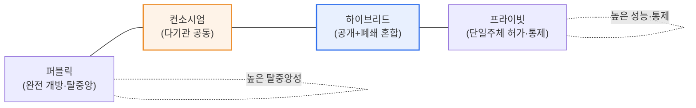
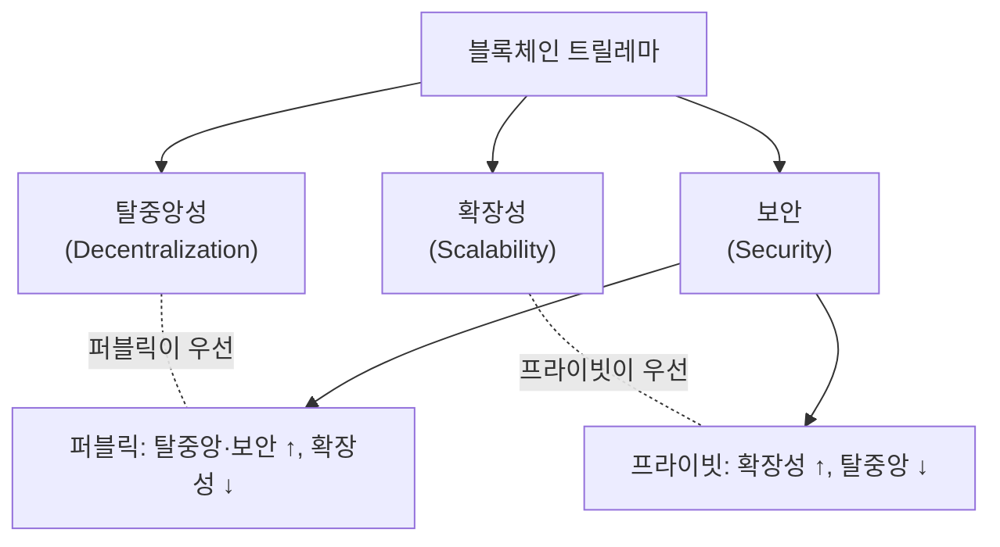

# 블록체인 유형 — 퍼블릭·프라이빗·하이브리드

## 1. 개요

### 가. 개념
> 블록체인은 **네트워크 참여·검증(합의) 권한을 누구에게, 얼마나 개방하느냐**에 따라 **퍼블릭(공개)·프라이빗(폐쇄)·하이브리드(혼합)** 로 나뉜다. 개방성(탈중앙성)과 통제·성능·프라이버시 사이의 트레이드오프가 유형을 가른다.

블록체인 유형이 갈리는 근본 이유는 '**완전한 탈중앙화와 실용적 성능·통제는 동시에 극대화하기 어렵다**'는 구조적 상충에 있다. 블록체인의 이상적 원형은 누구나 노드로 참여해 거래를 검증하는 완전 개방·탈중앙 네트워크, 곧 **퍼블릭** 블록체인이다. 비트코인·이더리움이 대표 예로, 특정 주체의 허가 없이도 참여할 수 있어 검열 저항성과 투명성이 뛰어나다. 그러나 익명의 다수가 합의에 참여하는 대가로 처리 속도가 느리고, 모든 거래가 공개되며, 기업이 요구하는 접근 통제·데이터 프라이버시를 확보하기 어렵다.

기업·금융이 실제로 필요로 하는 것은 정반대에 가깝다. 빠른 처리, 허가된 참여자만의 폐쇄 운영, 규제 준수를 위한 데이터 통제가 그것이다. 이 요구에서 참여를 제한한 **프라이빗** 블록체인이 나왔다. 성능·통제·프라이버시는 좋아졌지만, 소수 노드가 좌우하므로 탈중앙성과 검열 저항성은 약해진다. 결국 양극단은 각기 다른 가치를 최적화한 것이지 어느 하나가 우월한 것이 아니다. 이 양쪽의 장점을 상황에 따라 취사선택하려는 절충이 **하이브리드**(일부는 공개, 일부는 폐쇄)다. 즉 유형 선택은 '기술의 우열'이 아니라 '**공개 신뢰 대 기업 효율**'이라는 목적의 문제이며, 개방성과 통제의 균형점을 어디에 두느냐의 문제로 귀결된다.

### 나. 구분 기준
유형을 가르는 축은 몇 가지로 정리된다. **참여 개방성**(누구나 vs 허가된 자만), **검증·합의 권한**(불특정 다수 vs 지정 노드), **합의 알고리즘**(PoW/PoS 등 확률적 합의 vs BFT 계열 결정적 합의), **처리 성능(TPS)**, 그리고 **익명성·투명성**(전면 공개 vs 선택적 공개)이다. 이 축들은 서로 연동된다. 예컨대 참여를 개방할수록 합의 참여자가 많아져 탈중앙성은 오르지만 성능은 내려간다. 유형별 특성은 이 축들의 조합으로 설명된다.

## 2. 유형 구조와 비교

세 유형은 '개방↔통제'라는 하나의 스펙트럼 위에 놓인다. 퍼블릭이 한쪽 끝(완전 개방)이라면 프라이빗이 반대쪽 끝(완전 통제)이고, 하이브리드·컨소시엄은 그 사이에 분포한다.

### 가. 퍼블릭 블록체인 — 개방과 신뢰의 극단
퍼블릭 블록체인은 인터넷에 연결된 누구나 노드로 참여해 원장을 내려받고 거래를 검증할 수 있는 완전 개방형이다. 신뢰의 원천이 특정 기관이 아니라 '다수의 상호 검증과 경제적 인센티브'에 있다는 점이 본질이다. 작업증명(PoW)이나 지분증명(PoS) 같은 합의 메커니즘이 익명의 참여자들이 정직하게 행동하도록 유도하고, 그 결과 중앙 관리자 없이도 위·변조가 사실상 불가능한 원장이 유지된다.

이 구조의 강점은 **검열 저항성과 투명성**이다. 누구도 특정 거래를 임의로 막거나 되돌릴 수 없고, 모든 거래가 공개되어 감사·검증이 자유롭다. 그러나 같은 구조가 약점의 원인이기도 하다. 모든 노드가 동일한 검증을 반복하므로 초당 처리량(TPS)이 낮고 확정에 시간이 걸리며, PoW의 경우 막대한 전력을 소모한다. 또 모든 데이터가 공개되므로 영업비밀·개인정보를 다루는 기업 업무에는 그대로 쓰기 어렵다. 즉 퍼블릭은 '공개된 신뢰가 가치의 핵심'인 영역에 최적화되어 있다.

### 나. 프라이빗 블록체인 — 통제와 효율의 극단
프라이빗 블록체인은 단일 조직이 참여·검증 권한을 통제하는 폐쇄형이다. 허가된 노드만 원장을 보유·검증하므로, 신뢰의 원천이 '불특정 다수'가 아니라 '이미 신뢰 관계가 있는 지정 참여자'로 바뀐다. 이 덕분에 합의에 소수 노드만 참여하면 되어 처리 속도가 빠르고, 데이터 접근을 세밀하게 통제할 수 있으며, 규제가 요구하는 감사·권한 관리가 용이하다.

대표 기술로 하이퍼레저 패브릭(Hyperledger Fabric)처럼 권한형(permissioned) 원장을 지향하는 플랫폼들이 있다. 프라이빗의 강점은 명확히 '**성능·프라이버시·규제 준수**'다. 반면 소수가 원장을 좌우하므로 탈중앙성과 검열 저항성은 약하고, 극단적으로는 관리 주체가 기록을 조작할 여지가 있어 '왜 굳이 블록체인이냐, 분산 DB와 무엇이 다르냐'는 근본 질문이 늘 따라붙는다. 그럼에도 여러 참여자가 공동으로 위·변조 불가능한 원장을 공유한다는 점에서, 단일 DB보다 상호 신뢰·감사 가능성이 높다는 실무적 가치가 인정된다.

### 다. 하이브리드·컨소시엄 — 절충의 스펙트럼
하이브리드 블록체인은 하나의 시스템 안에서 일부 데이터·기능은 공개(퍼블릭)로, 일부는 폐쇄(프라이빗)로 운영해 양쪽 장점을 결합하려는 형태다. 예컨대 민감한 원본 데이터는 폐쇄 원장에 두되, 그 데이터의 무결성 증명(해시)만 공개 체인에 앵커링해 '외부 검증 가능성'과 '내부 프라이버시'를 동시에 얻는 식이다.

한편 여러 기관이 공동으로 검증 노드를 나눠 운영하는 **컨소시엄(consortium) 블록체인**은 흔히 프라이빗의 한 형태(부분 탈중앙)로 분류되며, 하이브리드와 함께 스펙트럼의 중간을 채운다. 단일 기업이 아니라 은행·물류사·병원 등 복수 주체가 대등하게 원장을 운영하므로, 순수 프라이빗보다 탈중앙성이 높고 특정 주체의 조작 위험이 낮다. 즉 개방성의 정도를 '완전 개방'과 '단일 통제' 사이에서 세밀하게 조정한 것이 하이브리드·컨소시엄이며, 실제 기업 도입의 상당수가 이 중간 지대에서 이뤄진다.

세 유형(및 컨소시엄)의 특성을 축별로 비교하면 다음과 같다. 이 표는 앞서 설명한 '개방성↔통제·성능'의 상충이 각 축에서 어떻게 나타나는지를 정리한 것이다.

| 구분 | 퍼블릭 | 프라이빗 | 컨소시엄 | 하이브리드 |
|---|---|---|---|---|
| **참여** | 누구나 | 단일주체 허가 | 지정 기관들 | 혼합(부분 개방) |
| **탈중앙성** | 높음 | 낮음 | 중간 | 중간 |
| **성능(TPS)** | 낮음 | 높음 | 높음 | 중간~높음 |
| **투명성** | 완전 공개 | 제한 | 참여기관 공유 | 선택적 공개 |
| **합의** | PoW·PoS 등 확률적 | 소수 노드(BFT 등) | BFT 계열 | 혼합 |
| **예시** | 비트코인·이더리움 | 하이퍼레저 패브릭 | 금융·물류 컨소시엄 | 공개+폐쇄 혼합 응용 |

## 3. 합의·트릴레마 관점의 이해

유형 선택의 이면에는 합의 알고리즘과 확장성 문제가 있다. 퍼블릭이 쓰는 PoW·PoS는 익명의 다수 사이에서도 합의가 가능하도록 설계되어 검열 저항성이 높지만, 확정성이 확률적이고 느리다. 반면 프라이빗·컨소시엄이 흔히 쓰는 BFT(비잔틴 장애 허용) 계열 합의는 참여 노드가 알려져 있고 수가 적을 때 빠르고 즉각적인 확정을 제공한다. 즉 '참여자가 누구인지 아느냐'가 합의 방식과 성능을 결정하고, 그것이 다시 유형을 규정한다.

이른바 **블록체인 트릴레마**는 탈중앙성·확장성·보안 셋을 동시에 최대화하기 어렵다는 명제다. 퍼블릭은 탈중앙성과 보안을 택하는 대신 확장성을 희생하고, 프라이빗은 확장성을 택하는 대신 탈중앙성을 희생한다. 이 상충을 완화하려는 시도가 계층2(Layer 2)·샤딩 같은 확장 기술과, 공개·폐쇄를 결합하는 하이브리드 설계다. 따라서 유형 선택은 트릴레마 위에서 '무엇을 포기할 수 있는가'를 정하는 의사결정으로 볼 수 있다.

이 관점에서 자주 제기되는 실무적 질문이 '프라이빗 블록체인은 결국 분산 데이터베이스와 무엇이 다른가'이다. 답은 '신뢰의 분산 정도'에 있다. 분산 DB는 단일 관리 주체가 일관성을 책임지는 반면, 컨소시엄·프라이빗 블록체인은 서로 완전히 신뢰하지 않는 복수 주체가 합의로 원장을 공동 확정한다. 따라서 참여자가 모두 한 조직이라면 블록체인보다 분산 DB가 단순·효율적이고, 참여자 사이에 이해가 상충하거나 상호 감사가 필요하다면 블록체인의 공동 검증·위·변조 방지가 정당화된다. 즉 유형 선택에 앞서 '애초에 블록체인이 필요한가'라는 선결 판단이 있어야 한다.

또한 유형은 고정불변이 아니라 진화한다. 초기에는 통제·성능을 위해 프라이빗으로 출발했다가, 참여 기관이 늘며 컨소시엄으로 개방 폭을 넓히고, 외부 검증 수요가 생기면 무결성 증명을 공개 체인에 앵커링하는 하이브리드로 이행하는 경로가 흔하다. 이처럼 개방성은 서비스의 성장 단계와 이해관계자 구성에 따라 조정되는 설계 변수이지, 처음에 한 번 정하고 끝나는 상수가 아니다.

## 4. 활용 분야와 사례

각 유형은 요구되는 신뢰 모델에 따라 적합한 도메인이 뚜렷이 갈린다. 아래 표와 설명은 '왜 그 분야에 그 유형이 맞는가'를 함께 짚는다.

| 유형 | 적합 분야 | 선택 이유 |
|---|---|---|
| **퍼블릭** | 암호화폐·NFT·공개 검증 서비스 | 검열 저항·공개 신뢰가 가치의 핵심 |
| **프라이빗** | 기업 내부·금융 결제·공급망 | 성능·프라이버시·규제 준수 우선 |
| **컨소시엄** | 은행 간 결제·무역 금융·물류 | 다기관 공동 신뢰, 단일주체 조작 방지 |
| **하이브리드** | 의료·행정 등 공개·비공개 혼재 | 무결성 증명은 공개, 원본은 폐쇄 |

첫째, **금융·무역 분야**는 컨소시엄·프라이빗의 대표 무대다. 여러 은행·기업이 공동으로 원장을 운영하면 대사(reconciliation) 비용과 시간이 크게 줄어, 전통적으로 며칠 걸리던 무역 금융·국경 간 결제를 크게 단축할 수 있다는 실증들이 보고되어 왔다. 참여 기관이 대등하게 검증하므로 단일 기관의 조작 위험도 낮다.

둘째, **공급망 관리**에서는 원산지·유통 이력을 위·변조 불가능하게 기록해 추적성을 확보하는 데 프라이빗·컨소시엄 블록체인이 활용된다. 식품·의약품처럼 이력 신뢰가 중요한 산업에서 리콜 대상 추적 시간을 획기적으로 줄인 사례들이 알려져 있다.

셋째, **공공·의료 행정**은 하이브리드가 유효한 영역이다. 개인정보·진료기록 같은 민감 데이터는 폐쇄 원장에 보관하되, 그 데이터가 변조되지 않았다는 증명은 공개 체인에 남겨 시민·감독기관이 검증하게 하면, 프라이버시와 투명성을 동시에 만족시킬 수 있다.

넷째, **자산 토큰화·NFT** 같은 공개 검증이 본질인 서비스는 퍼블릭이 사실상 유일한 선택지다. 소유권 이전이 특정 기관의 허가 없이도 성립하고 누구나 그 이력을 검증할 수 있어야 가치가 생기기 때문이다. 반대로 같은 자산이라도 기관 내부의 청산·정산 기록처럼 대외 공개가 부적절한 부분은 프라이빗으로 처리하는 혼합 설계가 흔하다. 이처럼 하나의 서비스 안에서도 '공개가 가치인 부분'과 '통제가 가치인 부분'을 나눠 유형을 조합하는 것이 실무의 핵심 감각이다.

## 5. 심화 — 상호운용성·규제 동향 및 예상 출제 방향

블록체인 유형 논의는 단일 체인 선택을 넘어 '**서로 다른 체인을 어떻게 연결하느냐**'로 확장되고 있다. 기업들이 저마다 프라이빗·컨소시엄 체인을 구축하면서, 이들 간의 자산·데이터 이동을 위한 **인터체인(크로스체인) 상호운용성**이 실무 확산의 관건으로 떠올랐다. 서로 다른 원장 사이를 잇는 브리지·릴레이 기술이 연구되지만, 이 연결부는 보안 사고가 빈번한 지점이기도 해 신중한 설계가 요구된다.

이와 함께 '어느 정도의 탈중앙성이 진짜 필요한가'에 대한 재평가도 진행 중이다. 초기에는 완전 탈중앙(퍼블릭)이 이상으로 여겨졌으나, 실제 기업 서비스에서는 규제 준수·성능·운영 책임 소재 때문에 통제 가능한 중간 지대(컨소시엄·하이브리드)가 오히려 지배적으로 채택되는 경향이 뚜렷하다. 즉 시장은 '최대 탈중앙'이 아니라 '목적에 필요한 만큼의 탈중앙'으로 수렴하고 있으며, 이는 유형 논의가 이념 논쟁에서 실용 설계로 옮겨가고 있음을 보여준다.

규제 측면에서는 개인정보 보호가 핵심 쟁점이다. '한번 기록되면 지울 수 없다'는 블록체인의 불변성은, '삭제권(잊힐 권리)'을 보장하는 개인정보 규제와 정면으로 충돌한다. 이 때문에 개인정보 원본은 체인 밖(off-chain)에 두고 참조·해시만 온체인에 남기는 설계, 또는 애초에 통제 가능한 프라이빗·하이브리드를 택하는 흐름이 강해지고 있다. 최근에는 자기주권신원(SSI)·영지식증명(ZKP)처럼 '공개하지 않고도 증명'하는 기술이 프라이버시와 검증 가능성의 절충안으로 주목받는다.

기술사 관점의 예상 출제 방향은 대체로 세 갈래다. ① 세 유형의 특성·합의·트릴레마를 비교하고 적용 분야를 논하라는 유형, ② 특정 산업(금융·공급망·의료 등)에 어떤 유형이 적합한지 근거와 함께 설계하라는 유형, ③ 개인정보 규제·상호운용성 같은 도입 장애 요인과 해소 방안을 묻는 유형이다. 답안은 '유형 나열'에 그치지 말고 '개방성↔통제의 트레이드오프'라는 하나의 축으로 관통해 서술하는 것이 고득점 전략이다.

## 6. 고려사항 및 시사점 (기술사 관점)

1. **목적 기반 유형 선택이 최우선이다.** 공개 신뢰·검열 저항이 가치의 핵심이면 퍼블릭, 성능·프라이버시·규제 준수가 중요하면 프라이빗, 복수 기관의 공동 신뢰가 필요하면 컨소시엄, 공개·비공개가 혼재하면 하이브리드를 택한다. '블록체인이니 무조건 퍼블릭'이라는 접근은 실패하기 쉽다.

2. **트릴레마 속에서 우선순위를 명시해야 한다.** 탈중앙성·확장성·보안을 동시에 최대화할 수 없으므로, 어떤 가치를 지키고 무엇을 계층2·오프체인 등으로 보완할지를 설계 단계에서 분명히 정해야 한다.

3. **개인정보·규제 정합성이 도입의 실질 관문이다.** 불변성과 삭제권의 충돌, 데이터 국외 이전, 감사 요건을 고려해 온·오프체인 분리 설계, 통제형 유형 선택, ZKP·SSI 같은 프라이버시 보호 기술의 병용을 검토해야 한다.

4. **상호운용성과 거버넌스가 확산을 좌우한다.** 체인 간 연동(인터체인)의 보안, 컨소시엄 참여 기관 간 권한·분쟁 처리 규칙(거버넌스), 표준화 수준이 실제 서비스의 지속가능성을 결정한다. 기술 선택만큼이나 참여자 간 합의·운영 체계 설계가 중요하다는 점을 강조할 필요가 있다.

## 참고자료
- Hyperledger Foundation — https://www.hyperledger.org/
- Ethereum, "Blockchain layers & scalability" — https://ethereum.org/en/developers/docs/scaling/

---

> **한 줄 요약**: 블록체인은 개방성에 따라 *퍼블릭(개방·탈중앙)·프라이빗(허가·통제)·컨소시엄·하이브리드(혼합)* 로 나뉘며, 탈중앙성과 성능·통제·프라이버시의 트레이드오프(트릴레마) 위에서 목적에 맞는 유형을 선택하고 규제·상호운용성을 함께 설계하는 것이 핵심이다.
