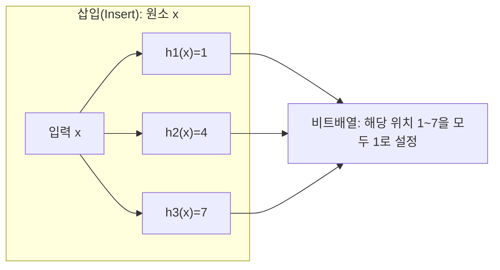
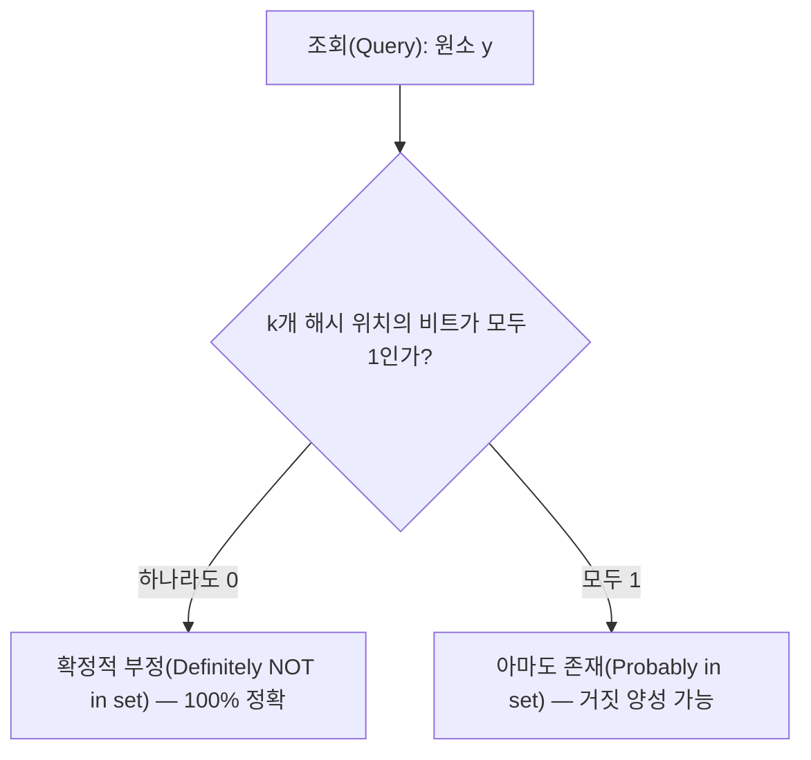

# 블룸 필터(Bloom Filter)

## 1. 개요

### 가. 정의

> **블룸 필터(Bloom Filter)**란 원소가 특정 집합에 속하는지를 판정하기 위해, m비트의 비트 배열과 k개의 독립적인 해시 함수만으로 구성되는 **확률적(probabilistic) 자료구조**로서, "없다(negative)"는 항상 정확하지만 "있다(positive)"는 일정 확률의 **거짓 양성(False Positive)**을 허용하는 대신 극도로 적은 메모리로 집합 소속 여부를 검사하는 기법이다.

블룸 필터는 1970년 Burton H. Bloom이 제안한 자료구조로, "이 원소가 집합에 있는가?"라는 **멤버십 질의(membership query)**를 원소 자체를 저장하지 않고 해결한다. 해시셋(HashSet)이 원소 전체를 보관해 정확한 답을 주는 대신 O(n)의 메모리를 소비하는 것과 달리, 블룸 필터는 원소를 저장하지 않고 **비트 몇 개만 켜서** 소속 흔적을 남기므로, 수백만~수억 개의 원소를 다룰 때 메모리를 수십 배 이상 절약한다. 이 때문에 "거짓 양성은 감내할 수 있으나 메모리·속도는 양보할 수 없는" 대규모 시스템의 전처리 필터로 널리 쓰인다.

### 나. 등장 배경과 필요성

대규모 데이터 시스템에서 가장 값비싼 연산은 **디스크·네트워크 접근**이다. 예컨대 LSM 트리 기반 데이터베이스(Cassandra·HBase·RocksDB)는 하나의 키를 읽기 위해 수십 개의 디스크 상 SSTable을 뒤져야 할 수 있는데, 대부분의 SSTable에는 그 키가 **존재하지 않는다.** 존재하지 않는 키를 확인하려고 매번 디스크를 읽는 것은 막대한 낭비다. 웹 크롤러가 "이미 방문한 URL인가"를 판별하거나, CDN이 "캐시에 있는 콘텐츠인가"를 확인하거나, 비밀번호 시스템이 "유출된 비밀번호 목록에 포함되는가"를 검사하는 상황도 본질이 같다 — **대부분의 답이 '없음'인 대량 질의**를, 원본을 뒤지기 전에 값싸게 걸러내야 한다.

이때 정확한 집합(해시셋·B-트리)을 메모리에 통째로 올리는 방식은 데이터가 커지면 메모리 한계에 부딪힌다. 블룸 필터는 **"없다"는 판정에 대해서는 100% 정확**하다는 성질을 이용해, 원본 접근이 필요 없는 대다수의 부정(negative) 질의를 메모리 안에서 즉시 차단한다. "있다"고 나온 소수의 경우에만 실제 원본을 확인하면 되므로, 값비싼 접근 횟수를 획기적으로 줄인다. 거짓 양성이 발생해도 원본을 한 번 더 확인해 오답을 걸러내므로 **최종 정확성은 유지**되고, 다만 그만큼의 헛수고만 추가될 뿐이라는 점이 실무 채택의 근거다.

## 2. 구조와 동작 원리

블룸 필터는 ① 모두 0으로 초기화된 **m비트의 비트 배열**과 ② 입력을 [0, m-1] 범위의 정수로 매핑하는 **k개의 서로 다른 해시 함수** h₁, h₂, …, h_k로 구성된다. 삽입과 조회는 동일한 k개 해시 위치를 사용한다.

**삽입 연산**은 원소 x에 대해 k개 해시 함수를 모두 계산하고, 그 결과가 가리키는 k개의 비트 위치를 **1로 설정(set)**한다. 이미 1이면 그대로 둔다. 원소 자체는 어디에도 저장하지 않으며, 오직 "켜진 비트들의 흔적"만 남는다. 여러 원소가 같은 비트를 공유(중첩)할 수 있다는 점이 메모리 절약의 원천이자 거짓 양성의 원인이다.

**조회 연산**은 질의 원소 y에 대해 동일한 k개 해시 위치를 계산한 뒤, 그 위치의 비트를 검사한다. 판정 규칙은 다음과 같다.

k개 위치 중 **단 하나라도 0이면**, 그 원소는 삽입된 적이 없음이 **확정**된다(삽입되었다면 모두 1이어야 하므로). 이것이 블룸 필터가 **거짓 부정(False Negative)을 절대 내지 않는** 이유다. 반대로 k개가 **모두 1이면** "아마도 존재"로 판정하는데, 이 비트들이 실제 y 때문이 아니라 **다른 원소들이 우연히 같은 위치를 켜 놓아** 모두 1이 되었을 수 있다. 이 경우가 바로 거짓 양성이다.

한 가지 구조적 한계는 **표준 블룸 필터에서 삭제가 불가능**하다는 점이다. 특정 비트를 0으로 되돌리면 그 비트를 공유하던 다른 원소까지 "없음"으로 오판(거짓 부정)될 수 있기 때문이다. 삭제가 필요하면 각 위치를 1비트가 아닌 작은 카운터로 두는 **카운팅 블룸 필터(Counting Bloom Filter)**를 사용한다.

## 3. 거짓 양성 확률과 파라미터 설계

블룸 필터 설계의 핵심은 비트 배열 크기 m, 해시 개수 k, 원소 수 n 사이의 관계로 결정되는 **거짓 양성 확률 p**를 목표치 이하로 맞추는 것이다. n개 원소를 삽입한 뒤 임의의 비트가 여전히 0일 확률은 약 (1 − 1/m)^(kn) ≈ e^(−kn/m)이며, 이로부터 거짓 양성 확률은 다음 근사식으로 주어진다.

> **p ≈ (1 − e^(−kn/m))^k**

이 식은 몇 가지 직관을 준다. 첫째, 비트 배열이 클수록(m↑) 비트 충돌이 줄어 p가 낮아진다. 둘째, 해시 개수 k는 **너무 적으면** 구분력이 약하고 **너무 많으면** 비트를 과도하게 채워 오히려 충돌이 늘어나므로, m/n이 주어졌을 때 p를 최소화하는 최적값이 존재한다. 최적 해시 개수는 **k = (m/n)·ln2 ≈ 0.693·(m/n)**이고, 이때 원소 하나당 필요한 비트 수는 **m/n ≈ −1.44·log₂(p)**로 정리된다.

구체적인 수치로 감을 잡으면 설계 감각이 분명해진다. 목표 거짓 양성률 p=1%(0.01)를 원하면 원소당 약 **9.6비트**(≈1.2바이트), 해시 함수는 약 7개가 필요하다. 즉 **1,000만 개**의 URL을 1% 오탐으로 관리하려면 약 9.6×10⁷비트 ≈ **약 12MB**면 충분하다. 같은 1,000만 개 URL을 각 평균 50바이트 문자열로 해시셋에 저장하면 최소 수백 MB가 드는 것과 비교하면, **수십 배의 메모리 절감**이 확인된다. 목표를 p=0.1%로 낮추면 원소당 약 14.4비트로 늘어나므로, 정확도와 메모리는 **로그 스케일의 트레이드오프** 관계임을 알 수 있다.

## 4. 활용 사례와 유사 기법 비교

블룸 필터는 "부정 질의를 값싸게 거르는" 성격 덕분에 여러 산업 시스템의 핵심 경로에 들어가 있다. 대표적으로 **Google Bigtable·Apache Cassandra·HBase·RocksDB**는 각 SSTable마다 블룸 필터를 두어, 존재하지 않는 키에 대한 디스크 읽기를 대부분 생략함으로써 읽기 지연을 크게 낮춘다. **웹 브라우저의 안전 브라우징(Google Safe Browsing)**은 수백만 개의 악성 URL 목록을 클라이언트에 블룸 필터로 배포해 로컬에서 1차 판별하고, "위험 가능성 있음"으로 나온 소수만 서버에 재확인한다. 또한 **비밀번호 유출 검사·스팸 필터·네트워크 라우터의 중복 패킷 탐지·분산 캐시의 존재 여부 사전 검사**에도 널리 쓰인다.

유사 목적의 자료구조와 비교하면 선택 기준이 분명해진다. 핵심은 **정확성·메모리·기능(삭제·개수)**의 트레이드오프이며, "무엇을 양보할 수 있는가"에 따라 답이 달라진다.

| 구분 | 블룸 필터 | 해시셋(HashSet) | 카운팅 블룸 필터 | 쿠쿠 필터(Cuckoo Filter) |
|------|-----------|-----------------|------------------|--------------------------|
| 원소 저장 | 안 함(비트만) | 원소 전체 저장 | 안 함(카운터) | 지문(fingerprint)만 저장 |
| 메모리 | 매우 작음 | 큼 | 블룸의 3~4배 | 작음(블룸과 유사) |
| 거짓 양성 | 있음 | 없음 | 있음 | 있음 |
| 거짓 부정 | 없음 | 없음 | 없음 | 없음 |
| 삭제 | 불가 | 가능 | 가능 | 가능 |

해시셋은 정확하지만 메모리 비용이 커 대규모에는 부적합하고, 삭제가 필요하면 카운팅 블룸 필터가, 삭제와 낮은 오탐을 동시에 원하면서 메모리도 아끼려면 쿠쿠 필터가 대안이 된다. 반대로 **삽입만 있고 메모리를 극한으로 아끼려는** 정적·추가전용(append-only) 시나리오에서는 여전히 표준 블룸 필터가 가장 단순하고 효율적이다.

## 5. 고려사항 및 시사점

블룸 필터를 실무에 적용할 때는 다음을 기술사 관점에서 종합적으로 고려해야 한다.

- **오탐 허용성 판단이 선행되어야 한다.** 블룸 필터는 거짓 양성 시 원본을 한 번 더 확인하는 **2단계 검증**을 전제로 한다. 오탐이 곧바로 잘못된 결과로 이어지는(재확인 경로가 없는) 도메인에는 부적합하며, 반드시 "긍정 판정 → 원본 확인" 폴백 경로를 함께 설계해야 한다.

- **파라미터를 예상 원소 수 n에 맞춰 사전 산정해야 한다.** 표준 블룸 필터는 크기가 고정되므로, 실제 n이 설계 가정을 초과하면 비트가 포화되어 거짓 양성률이 급격히 상승한다. 원소 수가 불확실하거나 지속 증가하면 용량이 차면 새 필터로 확장되는 **확장형(Scalable Bloom Filter)**을 검토한다.

- **삭제·갱신 요구를 초기에 확정해야 한다.** 표준형은 삭제가 불가하므로, 원소가 시간에 따라 제거되는 워크로드(예: TTL 캐시)에는 카운팅 블룸 필터나 쿠쿠 필터가 적합하다. 잘못 선택하면 뒤늦게 자료구조 전체를 교체해야 한다.

- **해시 함수의 품질·독립성이 성능을 좌우한다.** k개 해시가 서로 상관되면 비트가 편중되어 이론적 거짓 양성률보다 나빠진다. 실무에서는 MurmurHash·xxHash 같은 고속 비암호학 해시 하나로 두 값을 뽑아 **이중 해싱(double hashing)**으로 k개를 생성하는 기법을 널리 쓴다. 다만 악의적 입력이 해시 충돌을 유도할 수 있는 보안 민감 환경에서는 키를 갖는 해시를 고려한다.

- **분산 환경에서의 동기화·직렬화 비용을 고려한다.** 노드 간에 필터를 공유·병합할 때 비트 OR 연산으로 손쉽게 합쳐지는 장점이 있으나, 대용량 필터의 네트워크 전송·버전 관리 비용이 발생하므로 갱신 주기와 전파 방식을 함께 설계해야 한다.

종합하면 블룸 필터는 "정확성의 일부(거짓 양성)를 내주고 메모리·속도라는 실질 이득을 얻는" **공학적 근사(approximation)의 전형**이다. 데이터 규모가 폭증하는 AI·빅데이터 환경에서 원본 접근을 줄이는 사전 필터로서 그 가치는 오히려 커지고 있으며, 요구되는 오탐 허용성·삭제 여부·원소 수 변동성을 기준으로 표준형·카운팅형·쿠쿠 필터·확장형 중 적합한 변형을 선택하는 것이 설계의 핵심이다.

---

> **한 줄 요약**: 블룸 필터는 m비트 배열과 k개 해시로 집합 소속을 판정하는 확률적 자료구조로, "없음"은 100% 정확하고 "있음"만 거짓 양성을 허용하는 대가로 극소량의 메모리로 대규모 멤버십 질의를 값싸게 걸러내는 기법이다.
