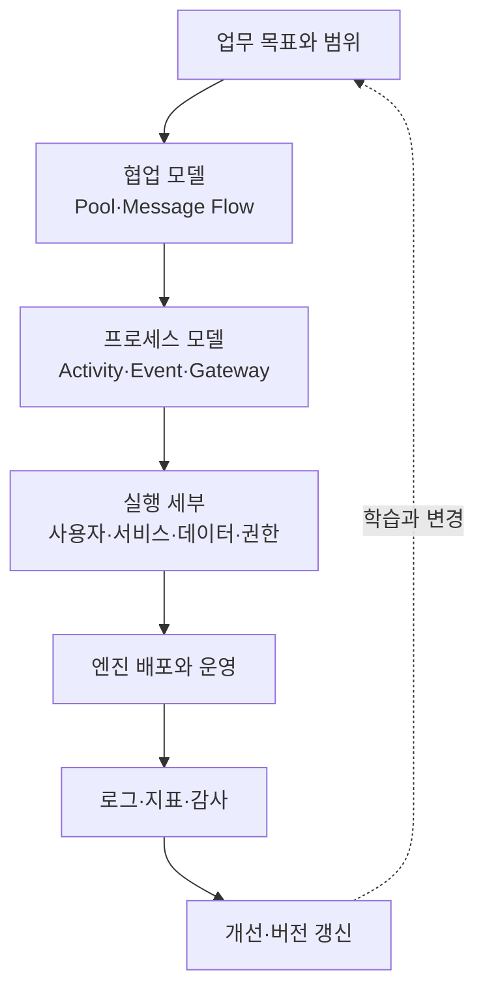
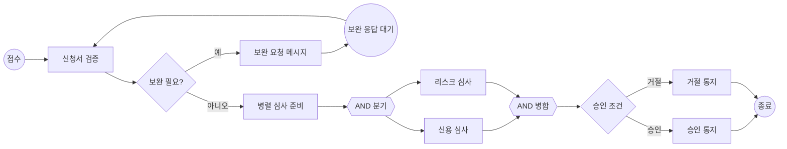

# BPMN 2.0 기반 업무 프로세스 모델링과 실행

## 1. 개요

> **정의**: BPMN(Business Process Model and Notation)은 업무 프로세스의 흐름·참여자·메시지·예외·데이터를 공통 그래픽 표기와 실행 의미로 표현하여, 현업의 이해와 프로세스 자동화를 연결하는 OMG 표준이다.

조직의 업무는 사람의 의사결정, 시스템 호출, 외부 기관과의 메시지 교환, 시간 경과, 예외 처리가 결합된 흐름으로 움직인다.
업무를 자연어 회의록이나 단순 순서도로만 남기면 담당자마다 해석이 달라지고, 자동화 단계에서는 “누가 무엇을 언제 완료한 것으로 보는가”를 다시 정의해야 한다.
BPMN은 이런 단절을 줄이기 위해 업무 사용자가 읽을 수 있는 표기와 프로세스 엔진이 해석할 수 있는 구조를 한 모델 안에 담는다.

BPMN은 특정 솔루션이나 워크플로 제품의 화면 설계가 아니다.
표준 모델은 프로세스의 의미를 표현하지만, 실제 실행을 위해서는 조직의 업무 규칙, 데이터 스키마, 사용자 권한, 엔진의 지원 범위, 모니터링 체계를 별도로 결정해야 한다.
따라서 기술사 답안에서는 기호를 나열하는 데서 끝내지 않고, **업무 목표와 이해관계자 모델을 실행 가능한 통제 흐름으로 변환하는 방법**으로 설명해야 한다.

OMG의 정식 BPMN 2.0.2 문서는 업무 사용자가 이해할 수 있는 표기와 프로세스 정의의 실행 의미·교환 형식을 함께 다루는 것을 목표로 한다.
BPMN의 장점은 사업 부서가 프로세스의 책임과 분기를 검토할 수 있고, 개발·운영 부서가 메시지·타이머·예외를 설계 근거로 활용할 수 있다는 데 있다.
반대로 표준의 모든 기호를 한 도면에 사용하면 가독성이 급격히 낮아지므로, 이해관계자 수준에 맞춰 모델을 계층화해야 한다.

### 1.1 등장 배경과 필요성

전통적인 업무 분석은 인터뷰, 문서화, 시스템 개발이 순차적으로 진행되는 경우가 많았다.
이 방식은 정상 흐름은 남기기 쉽지만 담당자 승인 지연, 외부 응답 타임아웃, 재심사, 취소와 보상 같은 현실의 변형을 놓치기 쉽다.
특히 금융 심사, 조달, 민원, 의료 예약처럼 여러 조직과 시스템을 거치는 업무는 한 부서의 순서도만으로 전체 책임을 설명할 수 없다.

BPMN은 활동을 수행하는 주체와 프로세스 흐름을 분리하고, 풀(pool)·레인(lane)으로 조직의 책임을 드러내며, 메시지 흐름으로 참여자 사이의 비동기 상호작용을 표시한다.
조건 분기에는 데이터 기반 게이트웨이를, 외부 응답을 기다리는 지점에는 메시지 이벤트를, 마감기한에는 타이머 이벤트를 사용한다.
이렇게 하면 “업무가 순서대로 진행된다”는 추상 설명이 “어떤 신호가 들어오면 어떤 책임자가 어떤 조건으로 다음 상태를 만든다”는 운영 설계로 구체화된다.

### 1.2 목표와 비목표

BPMN 모델의 목표는 프로세스의 시작·종료, 활동, 책임, 분기·병합, 외부 상호작용, 예외와 성과 측정 지점을 일관된 언어로 합의하는 것이다.
실행 모델이라면 각 활동의 입력·출력 데이터, 사용자 할당 또는 서비스 호출, 재시도·보상 정책, 권한과 감사 추적까지 연결되어야 한다.
분석 모델이라면 모든 기술 세부를 넣기보다 병목과 책임 경계를 드러내는 데 집중한다.

BPMN은 조직도, 데이터베이스 ERD, API 명세, 프로젝트 일정표를 대체하지 않는다.
또한 BPMN 다이어그램 하나가 조직의 모든 예외를 영원히 설명한다는 뜻도 아니다.
프로세스는 정책·법령·상품·시스템 변화에 따라 버전이 바뀌므로, 모델의 소유자와 변경 승인 절차를 정해 지속적으로 관리해야 한다.

## 2. 전체 구조와 핵심 원리

### 2.1 모델 계층

BPMN은 하나의 다이어그램에 모든 정보를 우겨 넣기보다, 이해관계자와 목적에 따라 추상화 수준을 나눈다.
상위 수준에서는 고객 요청부터 결과까지의 협업과 주요 마일스톤을 보여 주고, 하위 수준에서는 한 활동의 세부 규칙과 시스템 호출을 표현한다.
이 계층화는 현업 검토의 문턱을 낮추는 동시에 실행 설계에 필요한 정밀도를 확보하는 방법이다.

상위 협업 모델은 조직 간 계약과 메시지 경계를 검토하는 데 적합하다.
예를 들어 고객, 판매자, 결제기관을 각각 풀로 놓으면 어느 통신이 메시지 흐름인지, 어느 활동이 내부 구현인지 구분할 수 있다.
하위 프로세스 모델에서는 한 참여자의 내부 활동과 분기, 이벤트, 데이터 객체를 자세히 풀어낸다.

실행 세부는 BPMN 기호만으로 충분하지 않다.
사용자 태스크는 역할·그룹·위임·마감 알림과 연결하고, 서비스 태스크는 API 계약·타임아웃·재시도·멱등성을 정의한다.
데이터 입력은 개인정보·민감정보 분류와 보존기간을 함께 기록해야 하며, 운영 단계에서는 인스턴스 상태와 업무 SLA를 측정할 수 있어야 한다.

### 2.2 흐름과 토큰의 관점

BPMN 프로세스는 플로 요소와 이를 연결하는 흐름으로 구성된다.
활동은 수행할 일을, 이벤트는 프로세스 안에서 발생하거나 기다리는 일을, 게이트웨이는 경로의 분기·병합을 표현한다.
시퀀스 흐름은 같은 프로세스 안의 진행 순서를 나타내며, 메시지 흐름은 서로 다른 참여자 사이의 통신을 나타낸다.

실행 의미를 이해할 때는 프로세스 안에서 이동하는 토큰을 생각하면 유용하다.
시작 이벤트가 토큰을 만들고 활동이 토큰을 소비·생성하며, 병렬 게이트웨이는 여러 경로로 토큰을 나누거나 필요한 토큰을 모두 모은다.
다만 토큰 비유는 이해를 돕는 설명이고, 실제 엔진의 트랜잭션·동시성·영속화 방식이 모두 동일하다는 뜻은 아니다.

위 예시에서 “보완 필요?”는 업무 데이터에 근거한 XOR 분기다.
보완 요청은 단순한 다음 활동이 아니라 고객의 응답이라는 외부 메시지를 기다리는 상태이므로, 메시지 대기와 만료·취소 예외를 별도로 설계해야 한다.
신용 심사와 리스크 심사는 서로 독립적으로 진행할 수 있을 때만 병렬 분기를 사용하며, 병합 게이트웨이는 두 결과가 모두 도착해야 다음 판정을 시작하도록 한다.

토큰 관점은 병렬 처리의 함정을 찾는 데도 도움이 된다.
병렬 분기 뒤에 한 경로가 실패하면 다른 경로를 취소할지, 부분 결과를 보존할지, 재시도할지 결정해야 한다.
표기상 화살표만 연결해 두고 이러한 정책을 생략하면 모델은 예쁘지만 실행 시 중복 승인이나 영원한 대기 상태를 만들 수 있다.

## 3. 주요 구성요소와 의미

### 3.1 이벤트(Event)

이벤트는 프로세스의 흐름에 영향을 주는 발생 사실 또는 대기 신호다.
시작 이벤트는 프로세스 인스턴스를 시작하고, 종료 이벤트는 특정 경로의 완료를 표현하며, 중간 이벤트는 진행 중 메시지·타이머·오류·보상 등을 기다리거나 던진다.
이벤트는 “누군가가 해야 할 일”인 태스크와 다르므로, 고객 응답을 받는 일을 사람이 처리하는 활동으로 표현할지 메시지 도착 이벤트로 표현할지 구분해야 한다.

메시지 이벤트는 특정 참여자 또는 시스템 간 통신을 표현한다.
예를 들어 결제기관의 승인 응답을 기다리는 중간 캐치 메시지 이벤트에는 correlation key를 두어 어느 주문 인스턴스와 매칭할지 정의해야 한다.
상관관계가 없으면 동일 고객의 여러 주문 응답이 서로 다른 인스턴스에 잘못 들어갈 수 있다.

타이머 이벤트는 일정 시각, 기간 경과, 반복 주기 등을 나타낸다.
“48시간 내 서류 미보완 시 자동 취소”는 타이머 경계 이벤트로 모델링할 수 있지만, 영업일 계산, 휴일 달력, 시간대, 일시정지 상태를 엔진 설정과 업무 규칙으로 명확히 해야 한다.

### 3.2 활동(Activity)

활동은 프로세스에서 실제로 수행할 작업이며 태스크와 서브프로세스로 나눈다.
사용자 태스크는 사람이 화면이나 작업함을 통해 수행하고, 서비스 태스크는 자동화된 애플리케이션이나 외부 서비스가 수행한다.
수동 태스크는 시스템이 직접 통제하지 않는 작업을 표현할 때 사용하며, 이런 작업은 SLA와 증적을 별도로 확보해야 한다.

태스크 유형은 구현을 장식하는 이름이 아니라 책임과 실패 처리의 계약이다.
서비스 태스크라면 호출 대상, 요청·응답 스키마, 타임아웃, 재시도, 서킷 브레이커, 보상 또는 수동 전환을 설계한다.
사용자 태스크라면 후보자 규칙, 업무 큐, 대리 처리, 이중 승인, 화면 입력 검증, 감사 로그를 설계한다.

서브프로세스는 복잡한 흐름을 하나의 활동처럼 캡슐화한다.
재사용이 필요한 공통 절차는 호출 활동(call activity)으로 분리할 수 있고, 현재 프로세스의 맥락에 종속된 세부 흐름은 임베디드 서브프로세스로 묶는다.
서브프로세스를 과도하게 중첩하면 모델 간 이동이 어려워지므로, 업무상 의미 있는 경계와 변경 주기를 기준으로 나누는 것이 바람직하다.

### 3.3 게이트웨이(Gateway)

게이트웨이는 경로를 분기하거나 합치는 제어 지점이다.
XOR 게이트웨이는 조건 중 하나만 선택하는 상호 배타 분기에 사용하고, AND 게이트웨이는 모든 경로를 병렬 실행하거나 모두 모으는 데 사용한다.
OR 게이트웨이는 조건을 만족하는 하나 이상의 경로를 선택하며, 선택된 경로 수와 병합 조건을 명시해야 한다.

이벤트 기반 게이트웨이는 데이터값이 아니라 먼저 도착한 이벤트에 따라 경로를 선택한다.
“승인 응답이 오거나 10분 타임아웃이 나면 다음 단계로 이동” 같은 흐름에 적합하지만, 두 이벤트가 거의 동시에 도착할 때 중복 처리와 상관관계를 정의해야 한다.
게이트웨이의 이름만 보고 의미를 판단하지 말고, 분기 조건의 완전성·상호 배타성·기본 경로를 검토해야 한다.

|게이트웨이|분기 기준|대표 용도|설계 질문|
|---|---|---|---|
|XOR|데이터 조건 중 하나|승인/거절|조건이 겹치거나 빠지지 않는가?|
|AND|모든 경로|병렬 심사·동기화|실패한 경로와 대기 시간을 어떻게 처리하는가?|
|OR|하나 이상 조건|복수의 선택적 검사|몇 개의 결과를 기다려야 하는가?|
|Event-based|먼저 발생한 이벤트|응답/타임아웃 경쟁|동시 도착과 재전송을 어떻게 막는가?|

게이트웨이는 업무 의사결정과 기술 제어를 혼동하지 않아야 한다.
예를 들어 “금액이 1천만 원 초과인가?”는 업무 규칙이므로 DMN 결정표나 규칙 서비스로 분리할 수 있고, “두 비동기 결과가 모두 왔는가?”는 흐름 동기화 제어에 가깝다.
두 가지를 한 분기에 뒤섞으면 정책 변경 때 프로세스 도면과 코드가 함께 깨질 가능성이 커진다.

### 3.4 풀·레인·메시지 흐름

풀은 프로세스 참여자 또는 독립적인 조직·시스템을 나타내며, 레인은 한 풀 내부의 역할·부서·책임 단위를 나눈다.
고객과 은행을 서로 다른 풀로 두면 둘 사이의 상호작용은 메시지 흐름으로 표현한다.
한 풀 내부의 팀 이동은 레인과 시퀀스 흐름으로 표현하여 내부 책임과 외부 계약을 구분한다.

레인은 조직도를 그대로 복사하는 도구가 아니다.
레인을 지나치게 많이 만들면 책임이 선명해지는 것이 아니라 도면이 복잡해지고, 반대로 레인을 하나로 합치면 승인·분리 의무가 사라진다.
업무 인계, 권한, SLA, 감사 책임이 실제로 달라지는 지점을 중심으로 레인을 결정한다.

메시지 흐름은 데이터가 어디에 저장되는지가 아니라 참여자 사이에 어떤 통신이 일어나는지를 보여 준다.
외부 메시지는 전달 실패, 중복, 지연, 순서 뒤바뀜을 전제로 해야 하므로 메시지 ID, correlation ID, 재처리 정책을 설계한다.
이 원칙은 BPMN 모델을 이벤트 기반 아키텍처나 API 설계와 연결할 때 특히 중요하다.

## 4. 모델링 절차와 실행 설계

### 4.1 범위·목표·성과 정의

첫 단계에서 “프로세스 전체”처럼 넓은 표현을 버리고 시작·종료 조건과 관리 목적을 명확히 한다.
예를 들어 대출 프로세스라면 상담부터 사후관리까지 모두 그리지 말고, “온라인 신청 접수부터 승인 통지까지의 평균 처리시간을 줄인다”처럼 경계를 정한다.
프로세스 오너, 현업 대표, 감사·보안 담당자, 시스템 담당자를 참여시켜 모델의 사용 목적을 합의한다.

성과 지표는 모델을 운영 개선으로 연결한다.
처리시간, 대기시간, 첫 회 처리 성공률, 재작업률, 자동화율, 예외율, SLA 위반 건수처럼 흐름에서 관찰할 지표를 정하고 이벤트 로그의 필드를 설계한다.
지표를 뒤늦게 붙이면 모델은 실행되더라도 병목의 원인을 설명하지 못한다.

### 4.2 현행(As-Is) 발견

현행 모델은 이상적인 규정이 아니라 실제 업무를 반영해야 한다.
인터뷰만으로는 우회 엑셀, 개인 메신저, 수동 재입력, 시스템 간 중복 검증을 놓칠 수 있으므로 로그, 티켓, 양식, 민원, 장애 기록을 함께 확인한다.
정상·예외·긴급·취소 경로를 서로 다른 색상이나 주석으로 표시하면 문서와 현실의 차이가 드러난다.

현행 모델에서 발견된 수기 작업을 곧바로 자동화 대상으로 결정해서는 안 된다.
수기 단계가 규제상 이중 확인이거나 책임 있는 판단일 수 있고, 반대로 불필요한 재입력일 수도 있다.
각 활동의 목적, 입력, 산출, 담당, 시스템, 위험, 빈도를 기록한 뒤 개선 우선순위를 정한다.

### 4.3 목표(To-Be)와 실행 가능성 검토

목표 모델은 업무 목표와 통제 요구사항을 만족하면서 불필요한 대기와 재입력을 줄이는 방향으로 설계한다.
자동화 후보에는 규칙이 명확하고 반복 빈도가 높으며 오류 비용이 큰 활동을 우선 배치한다.
사람의 판단이 필요한 단계는 자동화하지 않고도 업무 큐, 근거 데이터, 추천 결과, 승인 한도를 제공해 처리 품질을 높일 수 있다.

실행 가능성 검토에서는 모델의 각 활동을 구현 단위에 매핑한다.
사용자 태스크인지, API 호출인지, 메시지 소비인지, 배치인지, 수동 작업인지 분류하고 필요한 입력·출력과 오류 경로를 채운다.
BPMN 모델과 실제 엔진이 지원하는 요소 사이에 차이가 있으면 표준 기호를 억지로 실행시키지 말고 모델링 수준을 조정하거나 별도 설계 문서로 보완한다.

### 4.4 배포·운영·개선

배포 전에는 정상 완료만이 아니라 타임아웃, 중복 메시지, 엔진 재시작, 사용자 부재, 외부 시스템 장애를 시험한다.
프로세스 인스턴스가 중단될 때 어느 지점에서 재개할지, 이미 외부 효과가 발생한 활동을 재실행해도 되는지, 보상 거래가 필요한지 확인한다.
프로세스 버전이 바뀌는 동안 진행 중인 인스턴스를 구버전으로 끝낼지 신버전으로 마이그레이션할지도 정책으로 정한다.

운영에서는 프로세스 모델과 같은 상관 키로 활동 시작·완료·실패·재시도·대기 이벤트를 기록한다.
대시보드는 평균만 보여 주지 말고 백분위 지연시간, 장기 대기 인스턴스, 반복 실패 태스크, 수동 개입 비율을 보여 줘야 한다.
로그에는 개인정보를 무분별하게 복제하지 않고, 검색·감사에 필요한 최소 필드와 보존기간을 정한다.

## 5. 비교와 적용 사례

### 5.1 표기·분석 기법 비교

BPMN은 UML 활동 다이어그램과 모두 흐름을 표현하지만 출발점과 강조점이 다르다.
UML 활동 다이어그램은 소프트웨어 행위와 객체·상태 모델과 연결하기 좋고, BPMN은 조직 간 협업·메시지·업무 이벤트·실행 의미를 더 직접적으로 표현한다.
단순 플로차트는 빠른 설명에 유리하지만 참여자·메시지·예외의 의미가 표준화되어 있지 않다.
EventStorming은 도메인 지식을 빠르게 발견하는 워크숍이고, BPMN은 발견된 업무 흐름을 합의·분석·실행 모델로 정제하는 표기라고 볼 수 있다.

|구분|BPMN|UML 활동 다이어그램|플로차트|EventStorming|
|---|---|---|---|---|
|주요 목적|업무 프로세스 협업·실행|소프트웨어 행위 설계|간단한 절차 설명|도메인 지식 발견|
|핵심 관점|참여자·이벤트·메시지|활동·객체·제어|순서와 조건|도메인 이벤트·대화|
|예외 표현|이벤트·경계 이벤트·보상|예외·활동 흐름|도형·주석에 의존|핫스팟과 대화|
|자동화 연결|실행 의미·XML 교환|개발 모델과 연계|도구별 상이|직접 실행하지 않음|
|적합한 산출물|As-Is/To-Be·워크플로|설계·행위 명세|교육용 절차|바운디드 컨텍스트 후보|

차이는 우열이 아니라 사용 시점의 차이다.
초기 워크숍에서는 EventStorming으로 사건과 충돌을 찾고, 정책과 책임을 정제한 뒤 BPMN으로 부서 간 흐름과 예외를 합의할 수 있다.
구현 상세가 필요하면 BPMN의 서비스 태스크를 API 계약, UML 시퀀스, 데이터 모델, 테스트 케이스로 연결한다.
한 도구로 모든 관점을 표현하려는 시도보다 모델 간 추적성을 유지하는 편이 비용이 낮다.

### 5.2 가상 사례: 보험금 청구 자동화

보험금 청구 프로세스를 가정해 보자.
고객이 모바일로 서류를 제출하면 접수 서비스가 파일을 저장하고, 자동 분류가 누락 여부를 판정하며, 금액과 위험도에 따라 자동 심사 또는 전문 심사 레인으로 보낸다.
외부 의료기관 조회가 필요한 경우 메시지 이벤트로 응답을 기다리고, 3일 내 응답이 없으면 고객에게 보완 요청을 보낸다.

BPMN 모델은 고객·보험사·외부 의료기관을 풀로 나누고, 보험사 풀 안에 접수·자동심사·전문심사·지급 레인을 둘 수 있다.
누락 여부는 XOR, 독립적인 사기 탐지와 보장 범위 검증은 AND, 외부 조회 응답과 타임아웃 경쟁은 이벤트 기반 게이트웨이로 표현한다.
이때 “자동 승인”은 서비스 태스크로 표현할 수 있지만, 모델이 AI 판정의 정확성을 보장하는 것은 아니므로 인간 검토 임계값과 이의제기 경로를 함께 둔다.

가상의 개선 목표를 처리시간 중앙값 48시간에서 24시간으로 줄이고 보완 재작업률을 20%에서 10%로 낮추는 것으로 설정할 수 있다.
이를 위해 문서 누락을 접수 후반이 아니라 최초 업로드 단계에서 검증하고, 외부 조회 대기에는 타이머와 알림을 붙인다.
개선 효과는 모델의 화살표 수가 아니라 인스턴스 로그로 검증하며, 자동화율이 올라도 부당 거절이나 개인정보 노출이 늘지 않았는지 함께 평가한다.

### 5.3 가상 사례: 공공 민원 처리

공공 민원은 접수, 분류, 담당 부서 배정, 사실 확인, 답변, 이의 또는 재처리로 이어질 수 있다.
부서 간 배정은 레인으로 책임을 드러내고, 법정 처리기한은 타이머 경계 이벤트로 표현한다.
민원인이 추가 자료를 제출하면 메시지 이벤트가 원래 인스턴스와 상관되어야 하며, 담당자 변경 때도 감사 이력이 보존되어야 한다.

이 사례에서는 “자동 분류가 100% 맞는다”는 가정 대신, 신뢰도가 낮은 분류는 수동 검토 큐로 보내는 조건을 둔다.
처리기한 임박 알림과 기한 초과 에스컬레이션은 별도 이벤트 서브프로세스로 두면 정상 업무 흐름을 과도하게 복잡하게 만들지 않는다.
모델은 민원인의 개인정보를 도면에 직접 적지 않고 식별자·등급·보존정책을 참조하는 방식으로 표현하는 것이 안전하다.

## 6. 심화: 표준·실행·프로세스 마이닝의 연결

OMG BPMN 2.0.2는 표기뿐 아니라 프로세스 요소의 실행 의미, 확장 메커니즘, 이벤트 조합과 상관, 사람의 상호작용, choreography 모델, 프로세스 정의 교환을 다룬다.
그러나 표준 적합성은 특정 엔진에서 모든 모델이 동일하게 실행된다는 뜻이 아니다.
엔진별 지원 범위, 표현식 언어, 작업자 할당, 트랜잭션 경계, 메시지 상관, 마이그레이션 기능을 사전에 확인해야 한다.

BPMN을 프로세스 마이닝과 결합하면 모델 중심 개선이 실제 로그와 맞는지 검증할 수 있다.
모델의 활동명과 로그의 이벤트명이 다르면 적합성 분석이 왜곡되므로, 프로세스 인스턴스 ID, 활동명, 타임스탬프, 자원, 결과, 보정 이벤트를 공통 스키마로 설계한다.
발견 알고리즘이 만든 모델을 그대로 목표 프로세스로 채택하지 말고, 빈도 낮은 예외가 법적·재무적으로 중요한지 현업 검토를 거쳐야 한다.

최근에는 규칙 엔진·DMN, API·이벤트 기반 통합, RPA, AI 보조 판단과 BPMN을 조합하는 경향이 강해지고 있다.
AI가 다음 활동이나 담당자를 추천하더라도 최종 책임·설명·승인·편향 점검을 프로세스에 명시해야 한다.
BPMN은 AI의 판단 근거를 대신하는 모델이 아니라, AI 호출과 인간 통제의 위치를 투명하게 만드는 운영 골격으로 활용해야 한다.

기술사 답안에서는 “표준 도입”을 결론으로 쓰기보다 표준 모델 → 실행 매핑 → 운영 로그 → 성과 측정 → 거버넌스 개선의 순환을 제시하면 좋다.
즉 표기법을 도입하는 것보다 모델의 소유권, 변경관리, 데이터·권한·감사, 장애 대응, 성과지표를 함께 설계하는 것이 성공 조건이다.

## 7. 고려사항 및 시사점

### 7.1 가독성과 실행 정밀도의 균형

현업용 모델은 한 화면에서 핵심 책임과 흐름을 읽을 수 있어야 한다.
실행용 모델은 재시도·상관·데이터·권한까지 필요하지만 이를 모두 한 장에 넣으면 검토자가 핵심을 놓친다.
개요·협업·상세·실행 설정의 계층을 분리하고 링크와 ID로 추적성을 유지한다.

### 7.2 예외 우선 설계

정상 경로만 그린 BPMN은 실제 운영의 위험을 반영하지 못한다.
타임아웃, 취소, 보상, 중복 메시지, 사용 불가, 수동 전환, 재처리의 조건과 책임을 함께 정의해야 한다.
특히 금전·재고·권한을 변경하는 서비스 태스크는 멱등 키와 감사 이벤트 없이는 자동 재시도하지 않는다.

### 7.3 데이터·개인정보 보호

프로세스 모델과 실행 로그에는 고객 식별자, 심사 근거, 의료·금융 정보가 섞일 수 있다.
모델에는 최소한의 데이터 분류와 보존 정책만 참조하고, 로그에는 마스킹·접근통제·열람감사를 적용한다.
데이터가 다른 풀과 메시지로 이동할 때 처리 목적과 수신자, 국외 이전·위탁 여부를 점검한다.

### 7.4 책임·권한·감사성

레인은 책임 주체를 드러내지만, 레인 이름만으로 승인 권한이 자동 생성되지는 않는다.
직무분리, 이중 승인, 대리 처리, 권한 회수, 운영자 비상 접근을 IAM과 업무 규칙에 연결한다.
프로세스 버전·규칙 버전·입력 데이터·판정 결과·사용자 개입을 함께 보존해야 사후 감사와 분쟁 대응이 가능하다.

### 7.5 변경·버전·상호운용성

법령과 상품이 바뀌면 프로세스 모델도 바뀌며, 이미 실행 중인 인스턴스의 처리 기준이 달라질 수 있다.
변경 영향 분석, 신규 버전 테스트, 롤백, 진행 중 인스턴스 정책, 모델 저장소의 승인 절차를 마련한다.
BPMN XML 교환이 가능하더라도 표현식·확장 속성·사용자 할당은 엔진 간 이식이 제한될 수 있으므로 벤더 종속성을 문서화한다.

### 7.6 성과지표와 개선의 부작용

평균 처리시간만 줄이면 수동 검토를 생략하거나 고객에게 책임을 전가하는 방식의 최적화가 발생할 수 있다.
처리시간과 함께 품질, 재작업, 민원, 보안사고, 예외율, 직원 부담, 공정성 지표를 묶어 평가한다.
지표는 프로세스 단계와 인스턴스 키에 연결되어야 하며, 자동화율 자체가 목적이 되지 않도록 업무 결과와 함께 해석한다.

### 7.7 기술사 답안 구성 전략

답안은 정의와 필요성으로 시작한 뒤, 풀·레인·이벤트·활동·게이트웨이·흐름을 개념도로 설명하고 As-Is/To-Be 절차를 제시한다.
이후 UML·플로차트·EventStorming과의 차이를 이유와 적용 맥락으로 비교하고, 가상 사례에서 정상·예외·운영지표를 연결한다.
마지막에는 실행 매핑, 보안·개인정보, 버전·거버넌스, 상호운용성과 성과관리의 트레이드오프를 기술사 관점의 시사점으로 정리한다.

## 참고자료

- Object Management Group, “BPMN 2.0.2 About-BPMN”: https://www.omg.org/spec/BPMN/2.0.2/About-BPMN
- Object Management Group, “Business Process Model and Notation (BPMN), Version 2.0.2”: https://www.omg.org/spec/BPMN/2.0.2/PDF
- Object Management Group, “BPMN 2.0 normative documents and machine-consumable files”: https://www.omg.org/spec/BPMN/2.0/
- Red Hat, “BPMN2 gateways reference”: https://docs.redhat.com/en/documentation/red_hat_process_automation_manager/7.4/html/process_designer_business_process_model_and_notation_bpmn2_reference_guide/bpmn-gateways_bpmn-reference
- Camunda, “BPMN 2.0 Symbols — a complete guide with examples”: https://camunda.com/en/bpmn/reference/

---

> **한 줄 요약**: BPMN은 업무 참여자·이벤트·활동·게이트웨이·메시지·예외를 표준 의미로 연결해 현업 합의와 프로세스 실행을 잇는 모델링 언어이며, 성공적인 적용은 기호보다 실행 매핑·운영 로그·보안·거버넌스·지속 개선을 함께 설계하는 데 달려 있다.
