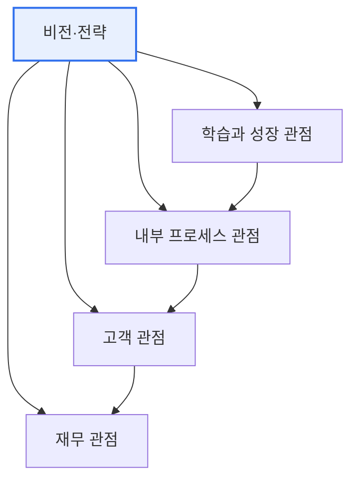

# 균형성과표(BSC, Balanced Score Card)

## 1. 개요

### 가. 정의
> **BSC(Balanced Score Card)** 는 재무 성과에만 치우치던 기존 성과 측정을 넘어, **재무·고객·내부 프로세스·학습과 성장의 4가지 관점에서 균형 있게 성과를 측정·관리**하는 전략 경영 도구다. Kaplan과 Norton이 제안했다.

BSC의 핵심 통찰은 '**재무 지표만으로는 미래를 관리할 수 없다**'는 데 있다. 매출·이익 같은 재무 지표는 과거 활동의 결과일 뿐(후행 지표), 그것을 만들어낸 원인(고객 만족·프로세스 효율·직원 역량)을 알려주지 않는다. 재무 성과만 보고 경영하면, 정작 미래 성과를 좌우하는 무형 자산과 선행 요인을 놓친다. BSC는 이 문제를 네 관점의 균형으로 푼다. 학습과 성장(직원·시스템 역량)이 좋아지면 내부 프로세스가 개선되고, 그 결과 고객 만족이 오르며, 궁극적으로 재무 성과로 이어진다는 **인과 사슬**로 성과를 바라본다. 이렇게 하면 재무라는 결과뿐 아니라 그것을 만드는 과정과 원동력까지 관리할 수 있고, 무엇보다 추상적 전략을 각 관점의 구체적 지표로 번역해 실행 가능하게 만든다.

### 나. 필요성
무형 자산의 비중이 커지고 전략 실행이 중요해지면서, 재무 지표만으로는 조직의 진짜 건강 상태와 전략 진척을 측정할 수 없어 균형 잡힌 성과 관리가 요구되었다.

## 2. 4가지 관점(구성요소)

네 관점은 인과적으로 연결된다. 아래 관점(학습·성장)이 위 관점(재무)의 원동력이 된다.

| 관점 | 핵심 질문 | 지표 예 |
|---|---|---|
| **재무** | 주주에게 어떻게 보이나? | 매출·이익·ROI |
| **고객** | 고객에게 어떻게 보이나? | 만족도·점유율·유지율 |
| **내부 프로세스** | 무엇을 잘해야 하나? | 품질·납기·효율 |
| **학습과 성장** | 어떻게 개선·성장하나? | 직원 역량·시스템·혁신 |

## 3. 구성 요소와 연계

BSC는 각 관점마다 **목표(Objective)–지표(KPI)–목표값(Target)–실행과제(Initiative)** 를 정의하고, 이들을 인과관계로 연결한 **전략 지도(Strategy Map)** 로 시각화한다. 전략 지도는 "직원 교육 → 프로세스 개선 → 고객 만족 → 매출 증대"처럼 전략의 논리를 한눈에 보여준다.

## 4. 고려사항 및 시사점

1. **전략과 지표의 인과 연계가 핵심**이다. 단순히 4관점 지표를 나열하는 것이 아니라, 관점 간 인과 사슬(전략 지도)로 연결해야 성과의 원인과 결과를 관리할 수 있다.
2. **전략 실행 도구로 활용**한다. BSC는 추상적 전략을 측정 가능한 지표로 번역하고 조직 하위까지 전개(Cascading)해, 전략과 실행을 정렬하는 SEM의 핵심 구성요소가 된다.
3. **지표 과잉·형식화를 경계**한다. 지표가 너무 많거나 측정이 목적이 되면 오히려 부담이 되므로, 핵심 소수 지표에 집중하고 전략과의 연계를 유지해야 한다.

---

> **한 줄 요약**: BSC는 *재무·고객·내부프로세스·학습과 성장의 4관점에서 균형 있게 성과를 측정* 하는 도구로, 관점 간 인과 사슬(전략 지도)로 전략을 지표화해 재무 결과뿐 아니라 그 원동력까지 관리하며 전략 실행을 정렬한다.
