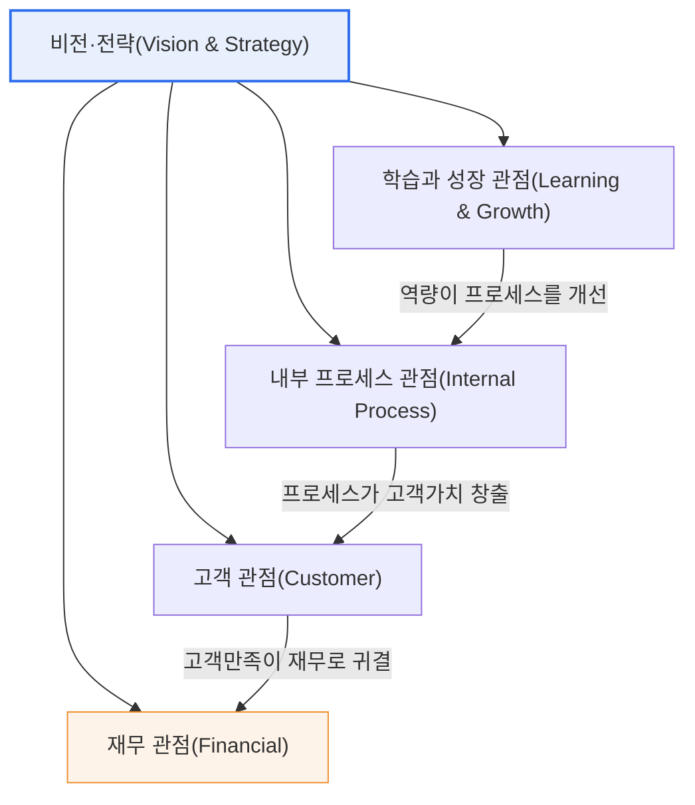

# 균형성과표(BSC, Balanced Score Card)

## 1. 개요

### 가. 정의
> **BSC(Balanced Score Card)** 는 재무 성과 중심의 전통적 성과 측정을 넘어 **재무·고객·내부 프로세스·학습과 성장의 4가지 관점에서 균형 있게 성과를 측정·관리**하고, 조직의 비전·전략을 측정 가능한 지표로 번역하는 전략 경영·성과 관리 도구다. 1992년 Robert Kaplan과 David Norton이 Harvard Business Review에 발표하며 등장했다.

BSC의 근본 통찰은 '**재무 지표만으로는 미래를 관리할 수 없다**'는 데 있다. 매출·이익·ROI 같은 재무 지표는 이미 벌어진 활동의 결과, 즉 **후행 지표(Lagging Indicator)** 일 뿐이며, 그 성과를 만들어낸 원인 — 고객 만족, 프로세스 효율, 직원 역량과 같은 **선행 지표(Leading Indicator)** — 를 알려주지 않는다. 재무 성과만 보고 경영하면 자동차의 백미러만 보며 운전하는 것과 같아서, 정작 미래 성과를 좌우하는 무형 자산(브랜드·지식·관계·시스템)과 선행 요인을 놓치게 된다.

BSC는 이 문제를 네 관점의 균형과 **인과 사슬(Cause-and-Effect Chain)** 로 해결한다. 학습과 성장(직원 교육·정보시스템·조직 역량)이 좋아지면 내부 프로세스가 개선되고, 개선된 프로세스가 고객 가치를 높여 고객 만족·충성도가 오르며, 그 결과가 궁극적으로 재무 성과로 이어진다는 논리다. 즉 BSC는 재무라는 '결과'뿐 아니라 그 결과를 만들어내는 '과정'과 '원동력'까지 통합적으로 관리하게 한다. 무엇보다 BSC의 가장 큰 기여는 추상적인 전략을 각 관점의 구체적 지표(KPI)와 목표값으로 번역해 조직 전체가 **실행 가능한 언어**로 공유하도록 만든 데 있다.

### 나. 등장 배경과 필요성
20세기 후반 지식 기반 경제로 전환되면서 기업 가치에서 유형 자산(공장·설비)보다 무형 자산(브랜드·특허·인적 역량·고객 관계)이 차지하는 비중이 급격히 커졌다. 그러나 전통적 회계·재무 성과 관리 체계는 무형 자산을 재무제표에 제대로 반영하지 못했고, 그 결과 '측정되지 않는 것은 관리되지 않는다'는 격언대로 미래 가치의 원천이 경영 관리의 사각지대에 놓였다.

또한 많은 기업이 훌륭한 전략을 수립하고도 실행 단계에서 실패했다. 전략은 경영진의 문서 속에만 존재하고, 현업 직원은 매일의 업무가 전략과 어떻게 연결되는지 알지 못했다. Kaplan과 Norton은 "측정할 수 없으면 관리할 수 없고, 관리할 수 없으면 실행할 수 없다"는 문제의식에서, 전략을 4관점의 균형 잡힌 지표로 번역해 조직 최하위까지 전개(Cascading)하는 도구로 BSC를 제안했다. 즉 BSC는 **성과 측정 도구에서 출발했지만 본질적으로는 전략 실행(Strategy Execution) 도구**다.

## 2. 4가지 관점(구성 요소)과 인과 구조

BSC의 전체 구조는 비전·전략을 중심에 두고 네 관점이 위계적·인과적으로 연결된 형태다. 아래 전체 구조도는 비전·전략에서 네 관점이 도출되고, 동시에 네 관점이 아래(학습·성장)에서 위(재무)로 인과적으로 쌓아 올라가는 이중 구조를 보여준다.

```mermaid
flowchart TB
  V["비전·전략(Vision & Strategy)"] --> F["재무 관점(Financial)"]
  V --> C["고객 관점(Customer)"]
  V --> P["내부 프로세스 관점(Internal Process)"]
  V --> L["학습과 성장 관점(Learning & Growth)"]
  L -->|"역량이 프로세스를 개선"| P
  P -->|"프로세스가 고객가치 창출"| C
  C -->|"고객만족이 재무로 귀결"| F
  style V fill:#e8f0fe,stroke:#2f6fed,stroke-width:2px
  style F fill:#fef3e8,stroke:#ed8f2f,stroke-width:1px
```

네 관점은 단순 병렬이 아니라 아래 관점이 위 관점의 **원동력(Driver)** 이 되는 인과 위계로 배치된다. 각 관점을 원리와 함께 살펴본다.

### 가. 재무 관점(Financial) — 결과의 관점
재무 관점은 "주주와 이해관계자에게 재무적으로 어떻게 보이는가"를 묻는다. 전통적으로 유일한 성과 척도였던 이 관점은 BSC에서 **최종 결과이자 후행 지표**로 자리한다. 매출 성장률, 영업이익, ROI(투자수익률), EVA(경제적 부가가치), 원가 절감액 등이 대표 지표다. 재무 관점은 나머지 세 관점의 노력이 궁극적으로 수익성으로 귀결되는지를 검증하는 '정산소' 역할을 한다.

중요한 점은 재무 목표가 기업의 **전략적 성숙 단계(성장기·유지기·수확기)** 에 따라 달라진다는 것이다. 신사업 성장기에는 매출 성장률·시장 확대가 핵심 지표가 되고, 성숙한 수확기에는 현금흐름·투자 대비 회수가 중심이 된다. 따라서 재무 지표를 획일적으로 적용하면 성장기 사업을 단기 수익 잣대로 잘못 평가하는 오류가 생긴다. 예컨대 초기 SaaS 사업을 당장의 영업이익률로만 평가하면 고객 확보 투자(마케팅·무료 체험)를 삭감하게 되어 오히려 장기 성장을 훼손한다.

### 나. 고객 관점(Customer) — 가치 제안의 관점
고객 관점은 "전략을 달성하려면 고객에게 어떻게 보여야 하는가"를 묻는다. 재무 성과의 직접적 원천이 고객이므로, 목표 시장·고객 세그먼트를 정의하고 그들에게 제공할 **가치 제안(Value Proposition)** — 품질·가격·시간·서비스·브랜드 — 을 명확히 한다. 대표 지표로는 고객 만족도(CSAT), 순추천지수(NPS), 시장 점유율, 신규 고객 획득률, 고객 유지율(Retention), 고객 이탈률(Churn)이 있다.

고객 지표는 재무에 대해 선행하지만 프로세스·역량에 대해서는 후행한다는 이중성을 갖는다. 예를 들어 고객 이탈률이 월 5%에서 3%로 낮아졌다면, 이는 곧 다가올 매출 안정(재무)을 예고하는 선행 신호인 동시에, 그 원인인 상담 응대 프로세스 개선(내부 프로세스)의 결과다. 실무에서는 고객 유지율 1%p 개선이 반복 구매·교차 판매를 통해 재무에 수 배로 증폭되어 나타나는 경우가 많아, 고객 관점 지표가 재무 관점의 조기 경보 역할을 한다.

### 다. 내부 프로세스 관점(Internal Process) — 실행의 관점
내부 프로세스 관점은 "고객과 주주를 만족시키려면 어떤 프로세스에서 탁월해야 하는가"를 묻는다. 여기서 핵심은 기존 프로세스의 부분 개선이 아니라 **가치 제안을 실현하는 전략적 프로세스**를 식별하는 것이다. Kaplan-Norton은 이를 운영 관리(생산·물류), 고객 관리(관계·서비스), 혁신(신제품 개발), 규제·사회 프로세스의 네 묶음으로 분류한다. 대표 지표는 불량률·수율, 납기 준수율, 사이클 타임, 신제품 출시 리드타임 등이다.

내부 프로세스 관점의 실무적 함의는 '무엇을 측정하느냐가 무엇을 개선하느냐를 결정한다'는 데 있다. 만약 고객 가치 제안이 '빠른 배송'이라면 주문-배송 사이클 타임을 핵심 지표로 삼아야지, 단순히 생산 원가만 낮추려 하면 배송 속도라는 전략적 차별화 요소가 방치된다. 예컨대 물류 기업이 당일 배송을 가치 제안으로 내세운다면, 창고 피킹 시간(예: 평균 12분→7분 단축)과 오배송률을 프로세스 지표로 관리해야 고객 만족과 재무로 연결된다.

### 라. 학습과 성장 관점(Learning & Growth) — 토대의 관점
학습과 성장 관점은 "비전을 달성하기 위해 어떻게 변화·개선 능력을 키울 것인가"를 묻는다. 이는 인적 자본(직원 역량·교육), 정보 자본(시스템·데이터·인프라), 조직 자본(문화·리더십·팀워크·정렬)의 세 무형 자산으로 구성되며, **나머지 세 관점을 떠받치는 토대이자 가장 강력한 선행 지표**다. 대표 지표는 직원 만족도, 핵심 역량 보유율, 교육 이수 시간, 정보시스템 커버리지, 이직률 등이다.

이 관점이 흔히 소홀히 다뤄지는 이유는 투자 효과가 가장 나중에, 가장 간접적으로 나타나기 때문이다. 직원 교육이나 시스템 도입의 성과는 몇 분기 뒤에야 프로세스·고객·재무로 파급되므로, 단기 재무 압박이 크면 가장 먼저 삭감되는 항목이 된다. 그러나 인과 사슬의 논리상 토대가 무너지면 상위 관점이 지속될 수 없으므로, BSC는 이 관점을 명시적 지표로 관리해 '보이지 않는 미래 투자'를 지켜내는 장치 역할을 한다.

아래 표는 네 관점의 핵심 질문과 대표 지표를 비교·정리한 것이다(산문 설명의 보조 수단).

| 관점 | 핵심 질문 | 성격 | 대표 지표(KPI) |
|---|---|---|---|
| **재무(Financial)** | 주주에게 어떻게 보이나? | 결과·후행 | 매출성장률·영업이익·ROI·EVA |
| **고객(Customer)** | 고객에게 어떻게 보이나? | 선행/후행 | 만족도·NPS·점유율·유지율 |
| **내부 프로세스(Internal)** | 무엇을 탁월히 해야 하나? | 선행 | 불량률·납기준수율·사이클타임 |
| **학습과 성장(Learning)** | 어떻게 개선·성장하나? | 최선행·토대 | 역량보유율·교육시간·시스템·이직률 |

## 3. 구성 요소와 전략 지도(Strategy Map)를 통한 전개

BSC는 각 관점마다 **목표(Objective) – 지표(Measure/KPI) – 목표값(Target) – 실행과제(Initiative)** 의 네 요소를 정의하고, 이를 인과관계로 엮어 **전략 지도(Strategy Map)** 로 시각화한다. 전략 지도는 2000년대 초 Kaplan-Norton이 BSC를 발전시키며 정립한 개념으로, 조직의 전략을 "직원 교육 → 프로세스 개선 → 고객 만족 → 매출 증대"와 같은 인과 논리의 흐름으로 한 장에 표현한다. 아래는 BSC의 수립·운영 프로세스 세부도로, 전략 지도 작성과 지표 전개(Cascading), 성과 리뷰의 순환을 보여준다.

```mermaid
flowchart LR
  A["비전·전략 정의"] --> B["4관점별 전략목표(Objective) 도출"]
  B --> C["전략지도(Strategy Map) 작성<br/>인과관계 연결"]
  C --> D["관점별 KPI·목표값(Target) 설정"]
  D --> E["실행과제(Initiative) 정의·예산 배분"]
  E --> F["조직 하위 전개(Cascading)"]
  F --> G["성과 측정·리뷰"]
  G -->|"피드백·전략 조정"| A
  style A fill:#e8f0fe,stroke:#2f6fed,stroke-width:2px
  style C fill:#e9f7ef,stroke:#27ae60,stroke-width:1px
```

구성 요소를 산문으로 풀면 다음과 같다. **목표(Objective)** 는 각 관점에서 달성하려는 전략적 지향("고객 대응 시간을 단축한다")이고, **지표(KPI)** 는 그 달성을 계량하는 척도("평균 응답 시간"), **목표값(Target)** 은 도달할 구체적 수준("24시간 → 4시간"), **실행과제(Initiative)** 는 목표값을 달성하기 위한 구체적 프로젝트("챗봇·CRM 도입")다. 이 네 요소가 갖춰져야 비로소 전략이 "무엇을, 얼마나, 어떻게" 수준까지 실행 가능해진다.

전략 지도의 진정한 힘은 **관점 간 화살표(인과 가설)** 에 있다. 단순히 지표를 나열하는 것이 아니라 "직원 CRM 역량 향상(학습) → 상담 처리 시간 단축(프로세스) → 고객 만족 상승(고객) → 재구매·매출 증가(재무)"처럼 논리를 명시함으로써, 조직은 각 활동이 최종 성과에 어떻게 기여하는지 검증하고 자원을 우선순위대로 배분할 수 있다. 이렇게 상위 전략 지도를 사업부·팀 단위로 잘게 나누어 내려보내는 것을 **캐스케이딩(Cascading)** 이라 하며, 이를 통해 전사 전략과 개인 목표가 정렬(Alignment)된다.

## 4. 비교와 적용 사례

### 가. 전통적 성과 관리(MBO/재무 중심)와의 비교
BSC를 목표관리(MBO)나 재무 중심 KPI 관리와 대비하면 차이의 본질이 드러난다. 전통적 방식은 대개 재무·단기·결과 중심이며 지표 간 인과관계가 없다. 반면 BSC는 재무·비재무를 균형 있게 담고, 후행과 선행 지표를 함께 보며, 지표들을 전략 지도의 인과 사슬로 연결한다는 점이 결정적으로 다르다.

| 구분 | 전통적 재무 성과 관리 | BSC |
|---|---|---|
| 측정 대상 | 재무 결과 중심 | 재무+고객+프로세스+학습 균형 |
| 시간 지향 | 과거(후행) | 과거+미래(선행) 병행 |
| 지표 관계 | 개별·독립 | 전략 지도로 인과 연결 |
| 목적 | 실적 통제 | 전략 실행·정렬 |

이 차이가 실무에서 중요한 이유는, 재무 지표만으로 평가하면 관리자가 미래 투자(R&D·교육)를 줄여 단기 실적을 부풀리는 **근시안적 행동**을 유발하기 때문이다. BSC는 학습·성장과 프로세스 지표를 함께 평가에 반영해 이런 왜곡을 억제한다.

### 나. 공공부문·정보화 사업 적용 사례
BSC는 민간뿐 아니라 공공기관·정보화 사업 성과 관리에도 널리 응용된다. 공공부문에서는 최상위 관점을 '재무'가 아니라 '사명·국민 가치(Mission)'로 바꾸어 재구성하는 것이 일반적이다. 예컨대 전자정부 서비스 성과 관리에서는 ① 국민 편익(고객), ② 서비스 처리 프로세스(내부), ③ 공무원 역량·정보시스템(학습·성장), ④ 예산 효율(재무)의 네 관점으로 지표를 설계한다. 실제로 어느 공공 정보화 사업에서 민원 처리 시간을 지표로 삼아 평균 처리 기간을 며칠 단위에서 시간 단위로 단축한 사례처럼, 프로세스 지표 개선이 국민 만족(고객)으로 연결되는 구조를 관리한다.

### 다. IT 거버넌스·전략적 기업경영(SEM)과의 연계
정보관리기술사 관점에서 BSC는 독립 도구가 아니라 상위 경영·IT 관리 체계의 구성요소로 이해해야 한다. BSC는 **SEM(Strategic Enterprise Management)** 의 핵심 실행 엔진이며, IT 성과 관리 프레임워크인 **IT-BSC**(IT의 4관점: 기업 기여·사용자 지향·운영 우수성·미래 지향)로 변형되어 IT 거버넌스(COBIT)와 결합된다. 즉 조직 BSC → IT-BSC → 개별 시스템 성과지표로 이어지는 계층적 정렬을 통해 IT 투자와 사업 전략을 일치시킨다.

## 5. 심화 — 예상 출제 방향과 답안 구성 전략

정보관리기술사 시험에서 BSC는 경영·사업전략 영역의 단골 주제로, 단독 출제뿐 아니라 SEM, IT 거버넌스, IT-ROI, 정보화 성과 관리 등과 엮여 출제되는 경향이 강하다. 출제 관점을 예상하면 다음과 같다.

첫째, **4관점의 인과관계와 전략 지도**를 설명하라는 유형이다. 이때 관점을 단순 나열하지 말고 "학습·성장이 최선행 토대이며 재무가 최종 결과"라는 인과 방향을 반드시 명시하고, 전략 지도 다이어그램으로 시각화하는 것이 고득점 포인트다.

둘째, **선행/후행 지표의 균형**을 묻는 유형이다. 재무=후행, 학습·성장=최선행이라는 구조와, 재무 지표만 관리할 때의 근시안적 왜곡을 사례로 설명하면 깊이가 드러난다.

셋째, **공공/IT 분야 적용**을 묻는 유형이다. 공공 BSC는 최상위를 국민 가치로 재배치한다는 점, IT-BSC의 4관점 변형, COBIT·SEM과의 연계를 답안에 포함하면 기술사 수준의 통합적 이해를 보여줄 수 있다.

답안 구성 시에는 개요(정의·배경) → 4관점 개념도 → 전략 지도·구성요소 → 전통 방식과의 비교 → 적용 사례 → 고려사항 순으로 전개하고, 표와 다이어그램을 산문 설명과 병행하는 것이 효과적이다.

## 6. 고려사항 및 시사점 (기술사 관점)

1. **전략과 지표의 인과 연계가 성패를 가른다.** BSC의 본질은 4관점 지표의 나열이 아니라 전략 지도로 표현되는 인과 가설의 검증이다. 인과 연결 없이 지표만 나열하면 '균형 잡힌 대시보드'는 될지언정 '전략 실행 도구'는 되지 못한다. 도입 시 반드시 전략 지도부터 그려 인과 논리를 합의해야 한다.

2. **전략 실행·정렬 도구로 활용해야 한다.** BSC의 가치는 추상적 전략을 측정 가능한 지표로 번역하고 조직 하위까지 캐스케이딩해 전사·팀·개인 목표를 정렬하는 데 있다. 성과급 산정용 KPI 관리로 축소하면 BSC의 전략적 가치를 잃는다. SEM·IT 거버넌스의 실행 엔진으로 위치시키는 관점이 필요하다.

3. **지표 과잉·측정 형식화를 경계해야 한다.** 지표가 너무 많으면(관점당 20개 넘게) 관리 부담이 커지고 초점이 흐려진다. 일반적으로 관점별 핵심 소수 지표(4~7개 내외)에 집중하는 것이 권장된다. 또한 측정 자체가 목적이 되어 지표를 채우기 위한 형식적 활동이 벌어지지 않도록, 전략과의 연계성을 주기적으로 점검해야 한다.

4. **데이터·시스템 인프라와 변화 관리가 전제 조건이다.** 비재무 지표(고객·프로세스·역량)를 실시간에 가깝게 수집·관리하려면 CRM·ERP·BI 등 정보시스템 기반이 필요하며, 지표가 곧 평가·보상과 연결되므로 조직의 저항·게이밍(지표 조작)에 대한 변화 관리가 필수다. 최근에는 데이터 거버넌스·BI 대시보드와 결합해 BSC를 실시간 성과 모니터링 체계로 고도화하는 흐름이 뚜렷하다.

5. **동태적 관리와 전략 조정이 필요하다.** BSC는 한 번 만들고 끝나는 정적 문서가 아니라, 주기적 성과 리뷰를 통해 인과 가설을 검증하고 전략을 조정하는 **더블 루프 학습(Double-loop Learning)** 의 순환 체계여야 한다. 목표값 미달 시 지표만 손보는 것이 아니라 전략 가설 자체가 틀렸는지 되묻는 피드백이 중요하다.

## 참고자료
- Kaplan & Norton, "The Balanced Scorecard—Measures That Drive Performance," Harvard Business Review, 1992: https://hbr.org/1992/01/the-balanced-scorecard-measures-that-drive-performance
- Balanced Scorecard Institute, "Balanced Scorecard Basics": https://balancedscorecard.org/bsc-basics-overview/
- Wikipedia, "Balanced scorecard": https://en.wikipedia.org/wiki/Balanced_scorecard

---

> **한 줄 요약**: BSC는 *재무·고객·내부프로세스·학습과 성장의 4관점에서 균형 있게 성과를 측정* 하는 전략 경영 도구로, 아래 관점(학습·성장)이 위 관점(재무)의 원동력이 되는 인과 사슬(전략 지도)로 추상적 전략을 측정 가능한 지표로 번역하고 조직 하위까지 정렬해, 재무 결과뿐 아니라 그 원동력까지 관리함으로써 전략 실행을 견인한다.
