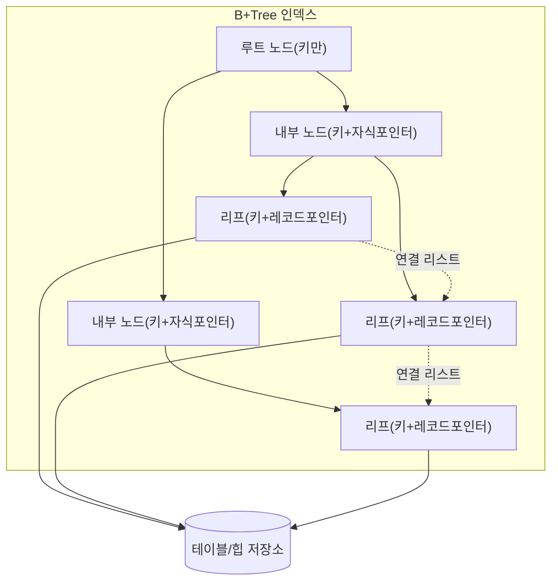
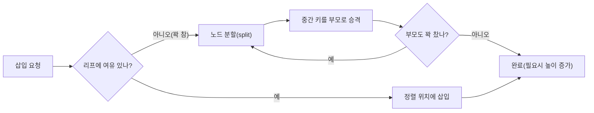
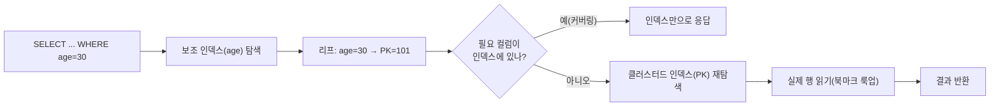

# 데이터베이스 인덱스 구조(B-Tree · B+Tree)

## 1. 개요

### 가. 정의
> **B-Tree**는 하나의 노드가 여러 개의 키와 자식 포인터를 갖는 **균형 다진(多分) 탐색 트리**로, 모든 리프가 같은 깊이에 놓이도록 유지되어 어떤 키를 찾든 **O(log N)** 의 디스크 접근을 보장하는 색인 구조다. **B+Tree**는 여기서 한 걸음 나아가 **실제 데이터(또는 데이터 포인터)를 리프 노드에만 저장**하고, 내부 노드는 탐색을 위한 키만 두며, **리프 노드들을 연결 리스트로 이어** 범위 검색을 강화한 변형이다.

### 나. 등장 배경 및 필요성
관계형 DBMS가 다루는 테이블은 수백만~수십억 건에 이르며, 이 데이터는 메모리가 아니라 **디스크(블록/페이지 단위)** 에 저장된다. 디스크 접근은 메모리 접근보다 수만 배 느리므로, 색인의 성능은 "연산을 얼마나 적게 하느냐"가 아니라 **"디스크 페이지를 몇 번 읽느냐(I/O 횟수)"** 로 결정된다. 정렬 배열은 이진 탐색으로 O(log N) 비교가 가능하지만 삽입·삭제 시 대량 이동이 필요하고, 이진 탐색 트리(BST)는 삽입 순서에 따라 한쪽으로 치우쳐 최악 O(N)까지 퇴화한다. 해시 인덱스는 등호(=) 검색은 빠르지만 범위·정렬 질의를 지원하지 못한다.

B-Tree 계열은 이 세 가지 한계를 동시에 푼다. **노드 하나를 디스크 페이지 하나(보통 4KB~16KB)에 대응**시켜 한 번의 I/O로 수백 개의 키를 읽어들이므로 트리의 **차수(fan-out)가 매우 커지고, 그 결과 트리 높이가 3~4단계로 낮게 유지**된다. 동시에 삽입·삭제 시에도 **분할(split)·병합(merge)** 로 균형을 자동 유지해 최악의 경우에도 성능이 보장된다. 특히 B+Tree는 리프를 연결 리스트로 이어 "BETWEEN", "ORDER BY", "범위 스캔"을 순차 읽기로 처리할 수 있어, 오늘날 거의 모든 상용 RDBMS(Oracle·MySQL InnoDB·PostgreSQL·SQL Server)가 기본 인덱스로 채택하고 있다.

### 다. 특징
- **균형 트리(Balanced)**: 모든 리프가 동일 깊이 → 어떤 키든 탐색 비용이 일정하다.
- **높은 차수·낮은 높이**: 노드 = 페이지 → fan-out이 수백 → 대용량에서도 높이 3~4.
- **정렬성 유지**: 키가 정렬 상태로 유지되어 등호·범위·정렬 질의를 모두 지원한다.
- **자기 균형(Self-balancing)**: 삽입·삭제가 국소적 분할·병합으로 처리되어 재구축이 불필요하다.

### 라. 다른 자료구조와의 비교(왜 B+Tree인가)
B+Tree의 강점은 대안들과 나란히 놓아야 분명해진다. **이진 탐색 트리(BST)** 는 노드마다 키 하나·자식 둘만 갖는 구조여서, 100만 건을 담으면 높이가 20단계에 이르고 그만큼 디스크 I/O가 필요하다. 게다가 정렬된 순서로 삽입하면 한쪽으로 늘어져 사실상 연결 리스트(O(N))로 퇴화한다. **AVL·레드블랙 트리** 는 균형을 강제해 최악을 막지만, 여전히 이진(fan-out=2)이라 높이가 높고 노드가 잘게 쪼개져 **디스크 페이지 단위 I/O에 부적합**하다. 이들은 모두 메모리 내부 자료구조에 적합할 뿐, 페이지 기반 디스크 저장소에는 맞지 않는다.

**해시 인덱스** 는 등호(=) 검색을 평균 O(1)로 처리하는 강력한 대안이지만, 값을 해시로 흩뜨려 저장하므로 **정렬·범위(>, BETWEEN, ORDER BY)·전방일치(LIKE 'abc%') 질의를 전혀 지원하지 못한다**. 또 해시 충돌·재해싱 비용, 데이터 편중 시 성능 저하 문제가 있다. 반면 B+Tree는 등호 검색이 해시보다 약간 느린 대신(O(log N)) **모든 질의 형태를 하나의 구조로 지원**하는 범용성을 갖는다. 실무 질의의 상당수가 범위·정렬을 포함하므로, 특정 등호 조회만 극단적으로 빈번한 예외가 아니라면 B+Tree가 기본 선택이 되는 이유가 여기에 있다.

| 구조 | 검색 복잡도 | 범위·정렬 | 디스크 적합성 |
|---|---|---|---|
| **BST(비균형)** | 최악 O(N) | 가능(비효율) | 낮음 |
| **AVL/RB 트리** | O(log N) | 가능 | 낮음(이진·잘은 노드) |
| **해시 인덱스** | 평균 O(1) | **불가** | 중간 |
| **B+Tree** | O(log N) | **우수(리프 링크)** | **높음(노드=페이지)** |

## 2. 전체 구조

B+Tree는 역할이 다른 세 종류의 노드로 구성된다. **루트·내부 노드**는 오직 "어느 자식으로 내려갈지"를 결정하기 위한 **분기 키(separator key)와 자식 포인터**만 담는다. 여기에는 실제 데이터가 없으므로 한 페이지에 더 많은 키를 채울 수 있고, 이것이 fan-out을 극대화해 높이를 낮춘다. **리프 노드**는 정렬된 모든 키와 함께 **실제 레코드(클러스터드 인덱스) 또는 레코드 위치 포인터(논클러스터드 인덱스)** 를 보관한다. 마지막으로 **리프들은 좌→우로 이어진 이중/단일 연결 리스트**를 형성하는데, 이 링크 덕분에 "특정 값 이상을 순서대로 훑기"가 트리를 다시 타지 않고 리프만 따라가는 순차 I/O로 끝난다.

각 노드는 **최소·최대 키 개수 규약**을 지킨다. 차수(order) m인 B-Tree에서 루트를 제외한 모든 노드는 최소 ⌈m/2⌉−1개, 최대 m−1개의 키를 가져야 하며, 이 하한이 깨지면 병합·재분배로, 상한을 넘으면 분할로 규약을 회복한다. 이 규약이 곧 **트리의 균형과 페이지 활용률(대개 50% 이상)** 을 보장하는 핵심 불변식(invariant)이다.

## 3. 핵심 동작(탐색·삽입·삭제)

**탐색(Search)** 은 루트에서 시작해 각 노드의 분기 키와 찾는 값을 비교하며 알맞은 자식으로 내려가고, 리프에 도달해 키를 확인한다. 방문하는 노드 수가 곧 트리 높이이므로 I/O 횟수는 높이에 비례한다. 예컨대 fan-out이 200이면 3단계로 200³ = 800만 건, 4단계로 16억 건을 인덱싱할 수 있어, 수억 건 테이블도 **단 3~4회 페이지 읽기로 원하는 행을 찾는다**. 이것이 인덱스 없이 전체를 훑는 풀 스캔(O(N))과 결정적으로 갈리는 지점이다.

**삽입(Insert)** 은 먼저 탐색으로 들어갈 리프를 찾은 뒤 정렬 위치에 키를 넣는다. 리프에 여유가 있으면 그대로 끝나지만, 노드가 가득 차면 **분할**이 일어난다. 노드를 반으로 나누고 가운데 키를 부모로 올려(승격) 보내는데, 부모도 가득 차 있으면 이 분할이 위로 전파(propagation)되고, 루트까지 분할되면 새 루트가 생기며 **트리 높이가 1 증가**한다. 높이 증가는 오직 루트 분할로만 일어나기 때문에 모든 리프가 항상 같은 깊이에 유지되는 것이다. 순차 증가하는 키(예: `AUTO_INCREMENT` PK)를 넣으면 항상 오른쪽 끝에서 분할이 반복되어 페이지가 대체로 우측에 몰려 채워진다.

**높이 계산(수치 예시)**: fan-out과 높이의 관계를 구체 수치로 보면 인덱스의 위력이 분명해진다. 페이지 크기 16KB, 인덱스 키 + 자식 포인터가 대략 16바이트라 가정하면 내부 노드 하나에 약 1,000개의 분기가 들어가 fan-out ≈ 1,000이 된다. 이때 높이 2면 1,000² = 100만 건, 높이 3이면 10억 건을 담을 수 있다. 즉 **10억 건 테이블에서도 루트→내부→리프의 3~4회 페이지 읽기만으로 원하는 행에 도달**한다. 반면 같은 10억 건을 이진 트리로 담으면 log₂(10⁹) ≈ 30단계가 필요해 I/O가 약 열 배 늘어난다. 이 차이가 대용량 OLTP에서 B+Tree가 사실상 유일한 선택지가 되는 정량적 근거다.

**삭제(Delete)** 는 리프에서 키를 제거한 뒤, 그 노드의 키 수가 최소 하한(⌈m/2⌉−1) 밑으로 떨어지면 규약을 회복해야 한다. 회복 방법은 두 가지로, 형제 노드에 여유가 있으면 키를 빌려오는 **재분배(redistribution)**, 형제도 빠듯하면 두 노드를 합치는 **병합(merge)** 이다. 병합은 부모의 분기 키 하나를 끌어내리므로 부모의 키 수도 줄고, 이 과정이 위로 전파되어 루트의 자식이 하나만 남으면 **높이가 1 감소**한다. 실무 DBMS는 삭제 시 즉시 병합하지 않고 공간을 잠시 비워두었다가 재사용하는 지연 전략을 쓰기도 하는데, 이 때문에 대량 삭제 후 인덱스가 부풀어(bloat) 재구성(REBUILD/REINDEX)이 필요해질 수 있다.

## 4. B-Tree와 B+Tree 비교

두 구조의 차이는 "데이터를 어디에 두느냐"라는 한 가지 결정에서 파생되며, 그 결정이 범위 질의 성능과 fan-out을 좌우한다. **B-Tree**는 내부 노드에도 데이터(또는 데이터 포인터)를 함께 저장하므로, 운 좋게 상위 노드에서 키를 만나면 리프까지 가지 않고 조기에 끝날 수 있다는 장점이 있다. 그러나 내부 노드가 데이터까지 안고 있어 한 페이지에 담기는 분기 키 수가 줄고, 그만큼 **fan-out이 낮아져 같은 데이터라도 트리가 더 높아진다**. 또한 데이터가 여러 레벨에 흩어져 있어 범위 검색 시 트리를 오르내리는 중위 순회(in-order traversal)가 필요해 비효율적이다.

**B+Tree**는 내부 노드를 순수 이정표로 비워 fan-out을 키우고 높이를 낮춘다. 모든 데이터가 리프에 정렬·연결되어 있으므로 **범위 질의는 시작점만 트리로 찾은 뒤 리프 링크만 따라가면** 되어 순차 I/O로 처리된다. 대신 어떤 키든 반드시 리프까지 내려가야 하므로 개별 등호 검색에서 B-Tree 대비 극적인 이득은 없다. 대부분의 실무 질의가 범위·정렬·스캔을 포함하고 안정적인 높이가 중요하기 때문에, **상용 RDBMS는 거의 예외 없이 B+Tree를 채택**한다.

| 구분 | B-Tree | B+Tree |
|---|---|---|
| **데이터 위치** | 내부·리프 노드 모두 | **리프 노드에만** |
| **내부 노드 역할** | 키 + 데이터 | 키(이정표)만 |
| **fan-out / 높이** | 상대적으로 낮음 / 높음 | **높음 / 낮음** |
| **범위·정렬 질의** | 중위 순회 필요(비효율) | **리프 연결 리스트로 순차 처리** |
| **단일 등호 검색** | 상위서 조기 종료 가능 | 항상 리프까지 하강 |
| **채택** | 개념·일부 파일시스템 | **대다수 RDBMS 인덱스** |

## 5. 인덱스 응용: 클러스터드·복합·커버링

인덱스의 실제 성능은 B+Tree라는 자료구조 위에 **"리프에 무엇을 담느냐"** 를 어떻게 설계하느냐로 갈린다. 위 그림은 보조 인덱스 조회가 커버링일 때는 인덱스만으로 끝나지만, 그렇지 않으면 **PK(클러스터드 인덱스)를 한 번 더 타고 내려가 실제 행을 읽는 북마크 룩업**이 추가됨을 보여준다. 이 추가 I/O가 대량 조회에서 성능을 좌우하므로 커버링 설계가 강력한 최적화가 된다. **클러스터드 인덱스(Clustered)** 는 리프에 행 전체를 정렬 저장하는 방식으로, 테이블 자체가 인덱스 순서로 물리 정렬된다. MySQL InnoDB는 PK를 클러스터드 인덱스로 삼기 때문에 PK 범위 조회가 매우 빠른 반면, PK가 랜덤(UUID 등)이면 삽입마다 중간 페이지 분할이 발생해 성능이 급락한다 — 이 때문에 InnoDB에서는 순차 증가 PK가 권장된다. **논클러스터드 인덱스(Secondary)** 는 리프에 키와 "행을 찾아가는 포인터(InnoDB는 PK 값)"만 두므로, 인덱스에 없는 컬럼을 요구하면 실제 행을 다시 읽는 **북마크 룩업(bookmark lookup)** 이 추가로 발생한다.

**복합 인덱스(Composite)** 는 여러 컬럼을 이어 하나의 키로 만든 것으로, 정렬은 **맨 앞 컬럼부터 사전식**으로 이뤄진다. 따라서 `(A, B)` 인덱스는 `A=? AND B=?` 나 `A=?` 질의를 가속하지만 `B=?` 단독 질의에는 쓸 수 없는데(이를 **선두 컬럼 규칙, leftmost prefix rule** 이라 한다), 이 원리를 모르면 인덱스를 만들어도 타지 못하는 흔한 튜닝 실패로 이어진다. **커버링 인덱스(Covering)** 는 질의가 요구하는 모든 컬럼을 인덱스가 포함해, 리프만 읽고 테이블 접근(룩업)을 완전히 생략하는 최적화다. 예를 들어 `SELECT name FROM member WHERE age=30` 에 대해 `(age, name)` 인덱스를 두면 테이블을 전혀 읽지 않고 인덱스만으로 결과를 낼 수 있어, 대량 조회에서 I/O를 수 배 줄인다.

| 유형 | 리프 저장 내용 | 특징·주의 |
|---|---|---|
| **클러스터드** | 행 전체(정렬 저장) | 범위 조회 빠름, 랜덤 PK 시 분할 폭증 |
| **논클러스터드** | 키 + 행 포인터 | 룩업 추가 발생 가능 |
| **복합 인덱스** | 다중 컬럼 결합 키 | 선두 컬럼 규칙 준수 필요 |
| **커버링 인덱스** | 질의 컬럼 전부 포함 | 테이블 접근 생략, I/O 절감 |

인덱스를 만들어 두고도 실제로 타지 못하는 **안티패턴**은 실무 성능 장애의 단골 원인이다. 실제 사례로, 한 전자상거래 서비스에서 `WHERE DATE(created_at) = '2024-01-01'` 형태의 주문 조회가 수초씩 걸리던 문제가 있었는데, 원인은 인덱스 컬럼 `created_at`에 `DATE()` 함수를 씌워 **인덱스가 무력화(index suppression)** 된 것이었다. 이를 `created_at >= '2024-01-01' AND created_at < '2024-01-02'` 범위 조건으로 바꾸자 인덱스 범위 스캔이 살아나 응답이 수 밀리초로 단축됐다. 대표적인 안티패턴은 다음과 같다.

- **인덱스 컬럼 가공**: `WHERE SUBSTR(col,1,3)='ABC'`, `WHERE col+0=100` 처럼 컬럼에 함수·연산을 적용하면 인덱스를 타지 못한다 → 상수 쪽을 가공한다.
- **선두 컬럼 누락**: `(A,B,C)` 인덱스에서 `A`를 조건에 넣지 않으면 인덱스 사용이 제한된다(leftmost prefix 위반).
- **낮은 선택도 컬럼 단독 인덱스**: 성별·상태값처럼 값이 몇 종류뿐이면 옵티마이저가 풀 스캔을 택해 인덱스가 무의미해진다.
- **암묵적 형변환**: 문자열 컬럼에 숫자로 비교(`WHERE varchar_col = 100`)하면 형변환이 개입해 인덱스가 깨진다.
- **부정·전방 와일드카드**: `!=`, `NOT IN`, `LIKE '%abc'` 는 정렬 순서를 활용할 수 없어 인덱스 효과가 떨어진다.

## 6. 심화: 쓰기 부하와 LSM-Tree, SSD 시대의 변화

전통 B+Tree는 **읽기 지향적 균형**을 취한 구조여서, 랜덤 쓰기가 폭주하는 현대 워크로드(로그·시계열·메시지 스트림)에서는 약점을 드러낸다. 키를 정렬 위치에 바로 꽂아 넣기 때문에 매 삽입이 **디스크의 랜덤 위치를 갱신**하고, 페이지 분할로 인한 **쓰기 증폭(write amplification)** 과 단편화가 누적된다. 이를 해결하기 위해 등장한 것이 **LSM-Tree(Log-Structured Merge-Tree)** 로, 쓰기를 일단 메모리(MemTable)에 순차 누적했다가 정렬된 불변 파일(SSTable)로 디스크에 순차 기록(flush)하고, 백그라운드에서 여러 SSTable을 합치는 **컴팩션(compaction)** 으로 정리한다. 그 결과 **쓰기는 순차화되어 매우 빠르지만, 읽기 시 여러 계층을 뒤져야 해 읽기 증폭이 생기는** 정반대의 트레이드오프를 갖는다. 이 때문에 쓰기가 압도적인 시스템(Cassandra·RocksDB·HBase, LevelDB)은 LSM-Tree를, 균형 잡힌 OLTP(MySQL·PostgreSQL)는 B+Tree를 택하는 식으로 워크로드에 따라 갈린다.

저장매체의 변화도 설계를 흔든다. HDD 시대에는 탐색 시간(seek)을 줄이는 것이 절대 명제여서 "높이를 최소화하는 B+Tree"가 최적이었지만, **SSD/NVMe**는 랜덤 접근이 빨라 높이 자체의 부담은 줄었다. 다만 SSD는 **블록 단위로만 지우고 다시 쓰는(erase-before-write)** 특성과 셀 수명 한계가 있어, 쓰기 증폭을 줄이는 LSM-Tree나 **Fractal Tree/Bε-tree**(삽입을 버퍼링해 순차화하는 변형)가 주목받았다. 또한 인메모리 DB에서는 캐시 라인 친화적인 **B+Tree 변형(예: 캐시 인식 CSB+-Tree)** 이나 다른 구조가 쓰이는 등, "B+Tree 하나로 끝"이 아니라 **매체·워크로드별 최적 색인**으로 분화하는 것이 최신 흐름이다. 실제로 PostgreSQL은 B-Tree 외에 GIN·GiST·BRIN·Hash 등 다중 인덱스 타입을 제공하며, 시계열·전문검색·공간 데이터에 각기 다른 색인을 권장한다.

한편 동시성 관점에서도 B+Tree는 정교한 제어가 필요하다. 여러 트랜잭션이 같은 인덱스를 동시에 갱신하면 분할·병합이 상위 노드로 전파되는 동안 넓은 범위에 잠금이 걸릴 수 있어, 상용 DBMS는 **래치 커플링(latch coupling/crabbing)** 이나 **Blink-Tree**(오른쪽 링크로 분할 중에도 무잠금 탐색을 허용) 같은 기법으로 동시성을 끌어올린다. 또 범위 질의의 팬텀(phantom) 문제를 막기 위해 **넥스트 키 락(next-key lock)** 처럼 인덱스 구조에 밀착한 잠금 전략을 쓴다. 이처럼 B+Tree는 단순한 자료구조가 아니라, 트랜잭션 격리·동시성 제어·회복(로그)과 맞물려 동작하는 DBMS 엔진의 핵심 부품이다.

## 7. 고려사항 및 시사점(기술사 관점)
- **인덱스 개수의 트레이드오프**: 인덱스는 읽기를 가속하는 대신 **모든 쓰기(INSERT·UPDATE·DELETE)마다 함께 갱신**되어야 하므로, 무분별한 인덱스 남발은 쓰기 성능 저하와 저장공간 증가를 부른다. 조회 패턴을 분석해 **선택도(selectivity)가 높은 컬럼과 자주 쓰는 질의 위주로 최소한** 설계하고, 사용되지 않는 인덱스는 주기적으로 제거하는 것이 원칙이다.
- **선택도와 옵티마이저 판단**: 성별처럼 값 종류가 적어 선택도가 낮은 컬럼은 인덱스를 만들어도 옵티마이저가 풀 스캔을 택할 수 있다. 통계정보(카디널리티·히스토그램)를 최신으로 유지(ANALYZE)해야 옵티마이저가 인덱스를 올바르게 활용하며, 함수·형변환이 개입되면 인덱스가 무력화되므로 **인덱스 컬럼을 가공하지 않는 SQL 작성**이 중요하다.
- **단편화와 재구성 전략**: 대량 삽입·삭제가 반복되면 페이지 활용률이 떨어지고 인덱스가 부풀어(bloat) 성능이 저하된다. 채움 비율(FILLFACTOR) 조정, 온라인 재구성(REINDEX/REBUILD), 파티셔닝을 병행해 **운영 중 성능을 유지**하는 계획이 필요하다.
- **워크로드·매체 정합 설계**: OLTP·범위조회 중심이면 B+Tree, 쓰기 폭주·로그성이면 LSM-Tree, 시계열이면 BRIN, 전문검색이면 역색인(GIN) 등 **질의 성격과 저장매체(HDD/SSD/메모리)에 맞춰 색인을 선택**해야 하며, 이는 곧 데이터 아키텍처 설계 역량과 직결된다.
- **분산 환경으로의 확장**: 샤딩·분산 DB에서는 로컬 B+Tree 위에 글로벌 인덱스·해시 파티셔닝을 결합해야 하며, 분산 트랜잭션·재분배 비용까지 고려한 **색인 전략의 확장 설계**가 요구된다.

## 참고자료
- PostgreSQL Documentation, "Index Types" — https://www.postgresql.org/docs/current/indexes-types.html
- MySQL Reference Manual, "How MySQL Uses Indexes" — https://dev.mysql.com/doc/refman/8.0/en/mysql-indexes.html
- MySQL Reference Manual, "InnoDB Index Types (Clustered/Secondary)" — https://dev.mysql.com/doc/refman/8.0/en/innodb-index-types.html
- Google Research, "The Log-Structured Merge-Tree (LSM-Tree)" (O'Neil et al.) — https://www.cs.umb.edu/~poneil/lsmtree.pdf

---
> **한 줄 요약**: B-Tree는 노드=디스크 페이지로 fan-out을 키운 균형 다진 탐색 트리이고, B+Tree는 데이터를 리프에만 두고 리프를 연결 리스트로 이어 범위·정렬 질의를 강화한 변형으로, 낮은 높이(3~4)와 O(log N) I/O 덕분에 오늘날 대다수 RDBMS의 기본 인덱스로 쓰인다.
