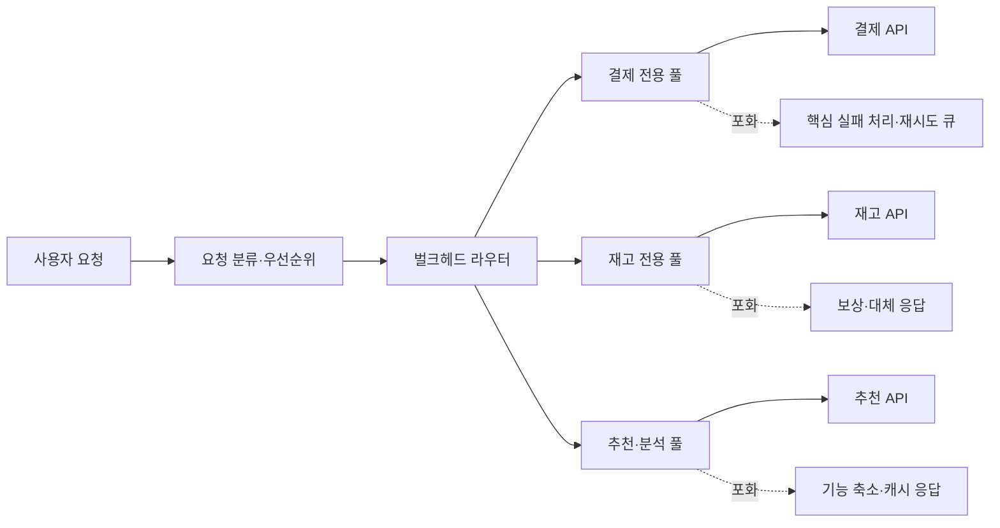
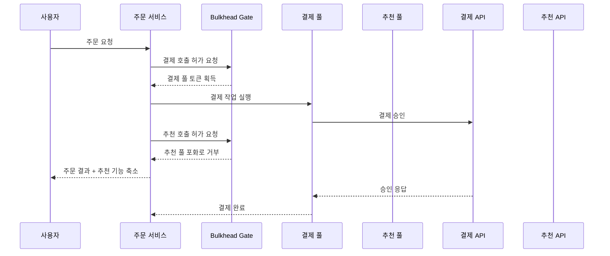

# 벌크헤드(Bulkhead) 패턴과 장애 격리

## 1. 개요

> **정의**: 벌크헤드(Bulkhead) 패턴은 애플리케이션의 자원과 처리 경로를 여러 격리된 풀로 나누어, 한 구성요소의 고장이나 포화가 다른 구성요소의 자원을 고갈시키지 않도록 하는 장애 격리 패턴이다.

벌크헤드라는 이름은 선박의 선체를 여러 수밀 격벽으로 나누는 구조에서 유래한다.
선체 한 구획에 누수가 발생해도 물이 모든 구획으로 번지지 않으면 배 전체의 침몰을 늦추거나 막을 수 있다.
소프트웨어에서도 하나의 외부 API가 느려지거나 특정 고객의 요청이 폭증할 때, 전체 스레드·연결·메모리·큐가 함께 잠기지 않도록 자원을 구획화한다.

분산 시스템의 장애는 단순한 성공 또는 실패가 아니라 지연, 재시도, 연결 대기, 큐 적체, 부분 응답의 형태로 나타난다.
공유 자원 구조에서는 느린 의존성의 요청이 작업 스레드를 오래 점유하고, 연결 풀과 대기열을 차례로 소진시킨다.
그 결과 원래 장애가 없었던 건강한 의존성에 대한 요청까지 처리하지 못하는 연쇄 장애가 발생한다.
벌크헤드는 고장난 의존성을 고치는 기법이 아니라, 고장의 영향 범위인 블라스트 레디우스(blast radius)를 제한하는 기법이다.

예를 들어 주문 서비스가 결제, 재고, 추천 세 외부 시스템을 호출한다고 하자.
세 호출이 하나의 스레드 풀과 하나의 연결 풀을 공유하면 추천 서비스의 지연이 결제 승인 요청의 실행 기회를 빼앗을 수 있다.
결제·재고·추천별로 동시 호출 수와 연결을 분리하면 추천 풀이 가득 차더라도 결제 풀은 남아 핵심 주문 기능을 계속 수행할 수 있다.
다만 격리된 자원은 공짜가 아니므로, 전체 처리량·메모리·운영 복잡성·공정성의 균형을 함께 검토해야 한다.

벌크헤드는 서킷 브레이커, 타임아웃, 재시도, 레이트 리미터와 목적이 다르지만 함께 사용된다.
타임아웃은 한 호출이 붙잡고 있는 시간을 제한하고, 서킷 브레이커는 지속적인 장애가 감지되면 호출을 빠르게 차단한다.
재시도는 일시 오류의 회복을 돕지만 부하를 늘릴 수 있으며, 레이트 리미터는 유입량을 제한한다.
벌크헤드는 공유 자원 안에서 특정 경로가 차지할 수 있는 몫을 제한하여 다른 경로의 생존 공간을 남긴다.

## 2. 문제 배경과 설계 목표

### 2.1 공유 자원과 연쇄 장애

동기식 원격 호출은 호출자의 실행 자원을 점유한다.
호출 대상이 정상일 때는 평균 지연시간이 짧아 보여도, 대상의 장애나 네트워크 분할이 발생하면 응답을 기다리는 요청이 누적된다.
대기 요청이 실행 스레드와 연결을 계속 차지하면 새로운 요청을 처리할 자원이 사라지고, 호출자 자신의 헬스 체크나 관리 API도 실패할 수 있다.

이 현상은 큐잉 관점에서 볼 수 있다.
도착률이 처리율보다 커지는 순간 대기열은 증가하고, 각 요청의 서비스 시간이 길어지면 같은 트래픽에서도 필요한 동시성이 커진다.
한 의존성의 서비스 시간이 길어졌는데 모든 의존성이 하나의 풀을 공유하면, 그 의존성이 풀의 점유율을 비정상적으로 높인다.
벌크헤드는 의존성별 최대 동시성을 정하여 한 경로가 전체 시스템의 처리율을 독점하지 못하게 한다.

비동기 구조에서도 같은 문제가 발생한다.
여러 업무가 하나의 메시지 큐와 동일한 소비자 그룹을 사용하면, 처리 시간이 긴 메시지가 뒤의 정상 메시지를 지연시킨다.
업무 중요도별 큐, 소비자 그룹, 워커 수를 분리하면 특정 업무의 적체가 다른 업무의 처리 기회를 빼앗는 것을 줄일 수 있다.
따라서 벌크헤드는 스레드 격리에만 한정되지 않고 큐·프로세스·노드·테넌트의 경계에도 적용된다.

### 2.2 목표와 비목표

벌크헤드의 첫 번째 목표는 장애의 범위를 제한하는 것이다.
전체 서비스를 항상 성공시키는 것이 아니라, 일부 기능이 제한되어도 핵심 기능이 계속 응답하도록 만드는 것이 목표다.
두 번째 목표는 자원 사용의 예측 가능성을 높이는 것이다.
의존성별 상한을 두면 최악의 상황에서 어떤 경로가 얼마만큼의 자원을 소비할지 추정할 수 있다.

세 번째 목표는 중요도에 따른 품질 차등을 가능하게 하는 것이다.
결제와 로그인은 추천·분석보다 높은 우선순위를 가질 수 있으며, 그에 맞춰 더 큰 풀이나 별도 인스턴스를 배정할 수 있다.
네 번째 목표는 복구 후의 폭주를 완화하는 것이다.
장애가 풀린 순간 누적 요청이 한꺼번에 재개되더라도 격리된 유입량과 큐가 회복 속도를 넘지 않게 해야 한다.

반대로 벌크헤드는 데이터 정합성을 자동으로 보장하지 않는다.
호출을 제한하면 일부 요청이 거부되거나 지연되므로, 재처리·보상·사용자 안내 정책이 별도로 필요하다.
또한 용량 계획을 대신하지도 않는다.
풀을 잘 나누어도 모든 풀의 한도가 실제 수요보다 작으면 정상적인 트래픽에서도 실패가 발생한다.

## 3. 전체 개념도와 격리 수준

위 개념도에서 라우터는 단순히 URL을 나누는 컴포넌트가 아니다.
요청의 업무 중요도, 테넌트, 의존성, 예상 처리시간을 기준으로 어느 풀에 들어갈지 결정하는 정책 지점이다.
각 풀은 최대 동시 호출 수, 대기시간, 큐 길이, 실행 스레드, 연결 수를 별도로 가질 수 있다.
풀 포화 시에는 무한 대기를 하지 않고 빠른 실패, 캐시, 비동기 전환, 기능 축소 중 적합한 결과를 선택한다.

벌크헤드의 격리 수준은 세밀한 수준에서 거친 수준으로 확장된다.
세마포어는 한 프로세스 안에서 동시 실행 수만 제한하므로 오버헤드가 작고 적용이 쉽다.
전용 스레드 풀은 느린 호출의 실행 흐름을 다른 풀과 분리하지만 스레드와 큐 메모리를 추가로 사용한다.
프로세스·컨테이너·노드 분리는 더 강한 장애 경계를 제공하지만 배포·관측·비용의 부담이 커진다.

| 격리 수준 | 분리 대상 | 장점 | 한계와 비용 |
|---|---|---|---|
| 세마포어 | 동시 실행 허가 수 | 가볍고 낮은 지연 | 호출 코드가 같은 프로세스 자원을 공유 |
| 스레드 풀 | 실행 스레드와 대기 큐 | 느린 호출의 스레드 점유 차단 | 스레드·컨텍스트 전환·큐 메모리 비용 |
| 연결 풀 | DB·HTTP 연결 | 연결 고갈의 전파 방지 | 풀별 유휴 연결과 설정 관리 필요 |
| 메시지 큐·소비자 그룹 | 비동기 처리 흐름 | 적체와 재처리 경계 분리 | 순서·중복·운영 관측 복잡성 |
| 프로세스·컨테이너 | 런타임 인스턴스 | 메모리·CPU 장애의 강한 격리 | 배포·스케줄링·네트워크 비용 증가 |
| 노드·셀 | 인프라 실패 도메인 | 장애 도메인과 테넌트 분리 | 자원 활용률과 운영 비용의 희생 |

격리 수준을 무조건 높이는 것이 정답은 아니다.
단일 프로세스 내 추천 호출을 세마포어로 제한하는 것과 결제 시스템을 별도 셀로 분리하는 것은 장애 영향과 비용의 크기가 다르다.
기술사는 실패 비용, 자원 공유 정도, 복구 목표, 테넌트 격리 요구, 운영 성숙도를 기준으로 필요한 수준을 선택해야 한다.

## 4. 동작 원리와 구현 방식

### 4.1 동시성 제한형 벌크헤드

동시성 제한형 벌크헤드는 허가 토큰 수를 정하고 호출이 시작될 때 토큰을 획득하게 한다.
허가를 얻지 못한 요청은 즉시 거부하거나 매우 짧은 시간만 기다린다.
호출이 성공하든 실패하든 `finally`와 같은 종료 경로에서 토큰을 반환해야 하며, 반환 누락은 정상 장애보다 더 위험한 자원 누수로 이어진다.

세마포어 방식은 CPU를 많이 쓰지 않으면서 외부 호출의 동시 실행 수를 제한할 수 있다.
그러나 세마포어가 제한하는 것은 허가 수이지 실행 스레드 자체가 아니다.
호출이 같은 이벤트 루프나 공유 스레드에서 블로킹되면, 세마포어만으로 전체 런타임의 블로킹을 막을 수 없다.
따라서 비동기 I/O인지, 블로킹 호출인지, 호출 라이브러리가 어떤 실행 모델을 사용하는지 확인해야 한다.

`maxConcurrentCalls`를 20으로 설정했다는 것은 동시에 20개까지 들어간다는 뜻이지 초당 20건을 보장한다는 뜻은 아니다.
처리시간이 1초인 경우와 10초인 경우의 처리량은 크게 다르므로, 동시성 한도와 지연시간·처리율을 함께 측정해야 한다.
대기시간을 0으로 두면 포화 시 바로 실패하여 자원 보호가 명확해지고, 짧은 대기시간을 두면 순간적인 경합을 흡수할 수 있다.
긴 대기시간은 사용자 타임아웃과 겹쳐 요청을 쌓으므로 신중하게 사용한다.

### 4.2 스레드 풀과 큐 격리

전용 스레드 풀 방식은 특정 의존성의 호출을 별도 실행자와 큐로 보낸다.
예를 들어 결제 풀은 16개 스레드와 짧은 큐, 추천 풀은 4개 스레드와 제한된 큐를 가질 수 있다.
추천 API가 느려져도 추천 풀의 큐만 가득 차며, 결제 풀의 실행자는 영향을 받지 않는다.

큐를 무제한으로 두면 격리의 효과가 약해진다.
요청을 큐에 쌓아 두는 동안 메모리와 사용자 타임아웃이 소진되면, 실패가 늦게 나타날 뿐 해결되지 않는다.
따라서 큐 길이, 대기시간, 거부 정책, 취소 전파를 함께 설정해야 한다.
큐가 가득 찼을 때 호출자에게 429나 명시적 업무 오류를 반환할지, 메시지 브로커로 넘길지, 캐시로 대체할지 업무별로 결정한다.

스레드 풀의 크기는 CPU 코어 수만으로 정할 수 없다.
외부 I/O 대기 비율, 평균·백분위 지연, 호출당 메모리, downstream의 허용 동시성, 사용자 타임아웃이 함께 고려되어야 한다.
스레드가 너무 적으면 정상 부하에서도 처리율이 낮아지고, 너무 많으면 컨텍스트 전환과 메모리 압박이 커진다.
실제 트래픽과 장애 주입을 이용해 풀 크기를 검증하고, 설정값에는 근거와 변경 이력을 남긴다.

### 4.3 연결 풀과 저장소 격리

HTTP 클라이언트와 데이터베이스의 연결 풀도 중요한 벌크헤드 대상이다.
서비스 A의 느린 쿼리가 공용 DB 연결을 모두 점유하면 서비스 B의 단순 조회도 연결을 얻지 못할 수 있다.
업무 중요도별로 연결 풀 또는 데이터베이스 프록시의 한도를 분리하고, 쿼리 타임아웃과 최대 수명을 설정하면 이 영향을 줄일 수 있다.

연결 풀을 나누었다고 해서 데이터베이스 자체가 격리되는 것은 아니다.
모든 연결이 같은 DB 인스턴스와 디스크를 사용하면 CPU·IOPS·락 경합은 여전히 공유된다.
강한 격리가 필요하면 읽기 전용 복제본, 워크로드별 스키마·인스턴스, 자원 그룹, 별도 데이터 저장소를 검토해야 한다.
그 대신 복제 지연, 비용, 데이터 이동, 운영 자동화의 복잡성이 증가한다.

### 4.4 프로세스·컨테이너·셀 격리

프로세스와 컨테이너 격리는 애플리케이션 런타임의 메모리·CPU·재시작 경계를 나눈다.
한 프로세스의 메모리 누수나 스레드 고갈이 다른 프로세스의 주소 공간을 직접 훼손하지 않으므로 세마포어보다 강한 장애 경계를 제공한다.
Kubernetes 환경에서는 별도 디플로이먼트, 리소스 요청·제한, 노드 풀, 테인트·톨러레이션, PodDisruptionBudget 같은 정책을 조합할 수 있다.

셀 기반 아키텍처는 여러 고객이나 업무를 작은 독립 단위에 배치하는 방식이다.
한 셀의 데이터·컴퓨트·큐를 다른 셀과 분리하면 장애의 영향과 배포의 위험을 제한할 수 있다.
하지만 셀 수가 증가하면 라우팅, 데이터 마이그레이션, 버전 관리, 용량 재분배의 문제가 생긴다.
따라서 모든 테넌트를 하나의 셀로 만들기보다 중요도와 격리 요구에 따른 혼합 전략이 현실적이다.

위 흐름은 선택적 기능의 실패를 핵심 거래의 실패로 확대하지 않는 예다.
추천 풀의 포화는 추천 결과를 생략하거나 나중에 보강하는 결과로 처리할 수 있지만, 결제 승인과 같은 부작용 작업은 무작정 재시도해서는 안 된다.
각 호출에는 독립된 타임아웃과 오류 분류가 필요하며, 토큰 반환 전에 업무 상태가 어느 단계까지 저장되었는지도 확인해야 한다.

## 5. 다른 회복탄력성 패턴과 비교

벌크헤드는 다른 패턴을 대체하지 않는다.
장애 유형을 먼저 분류하면 어떤 패턴이 필요한지와 적용 순서를 설명할 수 있다.
예를 들어 짧은 네트워크 손실은 제한된 재시도로 회복될 수 있지만, 대상 서비스가 지속적으로 다운된 상황에서 재시도를 반복하면 벌크헤드의 풀까지 빠르게 채워질 수 있다.

| 패턴 | 주로 통제하는 문제 | 핵심 설정 | 벌크헤드와의 관계 |
|---|---|---|---|
| 타임아웃 | 한 요청의 무한 대기 | 연결·읽기·전체 시간 | 풀 점유 시간을 제한하여 함께 사용 |
| 재시도 | 일시적 오류 | 횟수·백오프·지터 | 재시도 폭증이 풀을 잠식하지 않도록 제한 |
| 서킷 브레이커 | 지속 장애로 인한 반복 호출 | 실패율·대기시간·반개방 | 장애 대상 호출을 줄이고 풀 회복을 도움 |
| 레이트 리미터 | 유입 요청 폭주 | 시간당·초당 허용량 | 풀에 들어오는 양을 사전 통제 |
| 큐·백프레셔 | 생산자와 소비자 속도 차이 | 큐 길이·거부·드롭 | 비동기 처리의 포화 경계를 만듦 |
| 폴백 | 기능 축소와 사용자 응답 | 캐시·기본값·대체 흐름 | 풀 포화 시 의미 있는 결과 제공 |

타임아웃 없이 벌크헤드만 두면 제한된 수의 요청이 장시간 토큰을 붙잡을 수 있다.
서킷 브레이커 없이 재시도만 두면 실패한 대상에 요청을 계속 보내 풀을 소진할 수 있다.
반대로 모든 호출에 큰 전용 풀을 만들면 장애 격리는 얻지만 메모리와 연결 비용이 커지고 전체 자원 활용률이 떨어진다.
실무에서는 타임아웃으로 단일 호출 시간을 묶고, 재시도에는 지터와 예산을 두며, 서킷 브레이커와 벌크헤드로 지속 장애의 영향 범위를 제한한다.

## 6. 설계 절차와 용량 산정

첫 단계는 실패 도메인을 식별하는 것이다.
호출 대상, 기능 중요도, 고객·테넌트, 저장소, 메시지 큐, 배포 단위를 목록화하고 어떤 자원을 공유하는지 그린다.
단순히 서비스 이름을 기준으로 나누지 말고, 같은 자원과 같은 장애 원인을 공유하는 경로를 찾아야 한다.

둘째 단계는 업무 우선순위와 허용 가능한 저하를 정의하는 것이다.
결제가 실패하면 주문을 중단해야 하는지, 추천이 실패해도 주문을 완료할 수 있는지, 분석을 지연 처리할 수 있는지를 제품 오너와 합의한다.
핵심·중요·선택 기능별로 최대 지연, 최대 실패율, 폴백 결과, 재처리 가능 여부를 기록한다.

셋째 단계는 자원 예산을 분배하는 것이다.
전체 동시성 한도가 100인데 결제 50, 재고 30, 추천 20을 할당했다면, 각 한도의 근거와 남는 공용 자원 정책을 명시한다.
한도를 더하면 정상 처리량은 늘 수 있지만 장애 시 손실 범위도 늘어날 수 있으므로, 용량과 격리 강도의 트레이드오프를 수치로 비교한다.

간단한 용량 추정에는 리틀의 법칙 \(L = \lambda W\)를 참고할 수 있다.
평균 동시 요청 수 \(L\)은 도착률 \(\lambda\)와 평균 체류시간 \(W\)의 곱으로 볼 수 있다.
예를 들어 특정 외부 호출의 목표 처리율이 초당 8건이고 평균 왕복시간이 0.5초라면 평균 동시성은 약 4개다.
피크와 p95·p99 지연, 재시도, 여유율을 반영해 실제 한도를 정해야 하며 평균값만으로 한도를 고정해서는 안 된다.

넷째 단계는 포화 시 행동을 정하는 것이다.
저우선순위 조회는 캐시나 기본값으로 대체할 수 있지만, 돈의 이동이나 권한 변경은 명시적 실패와 재처리 상태가 더 안전하다.
거부된 동기 요청을 무조건 내부 큐에 넣으면 사용자에게는 성공처럼 보이면서 실제 처리 상태가 늦어질 수 있다.
업무 상태와 멱등성 키를 함께 저장하여 재시도와 중복 처리를 구분한다.

다섯째 단계는 관측과 실험으로 검증하는 것이다.
정상 부하에서 풀별 처리량을 측정하고, 하나의 의존성을 지연·오류·연결 거부 상태로 만들어 건강한 경로가 유지되는지 확인한다.
설정값은 코드나 구성 관리에서 버전화하고, 임계값 변경은 부하·장애 테스트 결과와 함께 검토한다.

## 7. 사례: 멀티테넌트 주문 플랫폼

여러 판매자가 사용하는 주문 플랫폼에서 대형 판매자의 상품 조회가 전체 트래픽의 대부분을 차지한다고 가정한다.
공용 캐시와 공용 DB 연결을 사용하면 한 판매자의 대량 조회가 소규모 판매자의 주문 생성과 관리자 화면을 지연시킬 수 있다.
이 문제는 단순히 서버를 늘리는 것으로 해결되지 않는다.
트래픽을 늘린 고객이 다시 자원을 독점하면 같은 경쟁이 더 큰 규모로 반복되기 때문이다.

플랫폼은 테넌트 등급과 업무 종류를 기준으로 네 가지 경계를 둔다.
주문 생성과 결제는 핵심 풀, 재고 조회는 중요 풀, 상품 검색은 일반 풀, 추천·리포트는 비동기 풀로 배치한다.
상위 트래픽 테넌트는 별도 큐와 가중치가 있는 풀을 사용하되, 전체 플랫폼의 최대 점유율을 넘지 못하게 한다.
리포트는 요청 즉시 실행하지 않고 작업을 등록한 뒤 완료 알림을 제공하여 동기 요청의 자원 경쟁을 줄인다.

운영 중 추천 API의 p99 지연이 200ms에서 3초로 증가하면 추천 풀은 빠르게 포화될 수 있다.
이때 추천 호출을 짧은 대기 후 거부하고 최근 추천 캐시를 반환하면 주문 생성 경로의 스레드와 연결은 보호된다.
결제 API가 같은 시기에 느려지면 결제 풀은 별도의 타임아웃과 재시도 예산을 사용하며, 승인 요청에는 멱등성 키를 유지한다.
이렇게 하면 “모든 기능이 정상”은 아니어도 핵심 주문의 완료율과 고객별 공정성을 지킬 수 있다.

사례의 성과는 전체 평균 지연만으로 판단하지 않는다.
테넌트별 주문 성공률, 핵심 풀의 포화율, 선택 기능 거부율, 큐 대기시간, 재시도 횟수, 데이터베이스 연결 사용률을 함께 본다.
평균 지연이 좋아졌지만 소규모 고객의 오류율이 증가했다면 격리 정책이 공정성 목표를 달성하지 못한 것이다.
반대로 추천 생략률이 늘더라도 주문 성공률과 결제 안정성이 유지된다면 합의한 품질 저하 범위 안에서 성공한 것으로 볼 수 있다.

## 8. 심화: 클라우드·컨테이너·관측성 연계

클라우드 네이티브 환경에서는 벌크헤드를 애플리케이션, 서비스 메시, 오케스트레이터, 인프라의 여러 층에 배치할 수 있다.
애플리케이션의 세마포어는 의존성별 세밀한 정책을 제공하고, 서비스 메시는 연결·동시 요청·아웃바운드 풀의 공통 제어를 제공한다.
Kubernetes의 리소스 제한과 별도 노드 풀은 CPU·메모리 경합을 줄이지만, 애플리케이션 큐의 의미와 폴백까지 대신해 주지는 않는다.
여러 층에서 같은 한도를 중복으로 걸면 실제 허용량이 예상보다 작아지거나 원인 파악이 어려워질 수 있다.

관측성은 풀을 나누는 것만큼 중요하다.
메트릭에는 풀별 허가 획득 성공·거부 수, 현재 사용 중인 슬롯, 대기시간, 큐 길이, 실행시간, 타임아웃, 폴백 비율을 포함한다.
트레이스에는 요청이 어느 벌크헤드에 들어갔고 얼마나 대기했는지 나타내야 하며, 로그에는 테넌트·업무·의존성·멱등성 키를 안전하게 연결한다.
공용 합계만 보면 추천 풀의 포화가 결제 풀에 영향을 주지 않았다는 격리 효과를 확인할 수 없다.

OpenTelemetry와 같은 표준 계측을 적용할 때는 풀 이름과 의존성 이름을 저카디널리티 속성으로 관리한다.
요청 ID나 고객 ID를 무제한 태그로 넣으면 모니터링 비용과 저장량이 커질 수 있다.
민감한 결제 정보와 개인정보가 트레이스에 들어가지 않도록 마스킹·샘플링 정책을 함께 적용한다.
포화 이벤트는 단순 오류가 아니라 용량 정책이 작동했다는 신호이므로, 알람 기준과 대응 플레이북을 사전에 만든다.

셀 기반 배포에서는 배포 단위 자체가 벌크헤드가 된다.
한 셀에 새 버전을 점진 배포하고 오류율과 풀 포화율을 확인한 뒤 다음 셀로 확대하면, 잘못된 배포가 전체 고객으로 퍼지는 것을 줄일 수 있다.
그러나 셀 간 데이터와 구성의 차이가 누적되면 운영자가 장애 원인을 비교하기 어려워진다.
셀 템플릿, 구성 검증, 공통 대시보드, 표준 복구 절차로 운영 편차를 통제해야 한다.

## 9. 고려사항 및 시사점

### 9.1 격리와 자원 활용률의 균형

풀을 너무 작게 나누면 유휴 자원이 많아지고, 한 풀의 순간 수요를 다른 풀이 흡수하지 못한다.
풀을 너무 크게 공유하면 자원 활용률은 좋아지지만 연쇄 장애의 반경이 커진다.
핵심 경로에는 보장된 최소 용량을 두고, 비핵심 경로에는 제한된 공유 여유분을 허용하는 혼합 구조가 현실적이다.

### 9.2 우선순위와 공정성

핵심 기능에 큰 풀을 배정하면 서비스 수준은 높아지지만, 특정 대형 고객이 그 풀을 독점할 수 있다.
테넌트별 최대량, 가중치, 토큰 버킷, 공정 큐를 조합하여 고객 간 격리를 설계해야 한다.
우선순위 규칙은 기술팀이 임의로 정하지 않고 계약된 SLA·업무 중요도·규제 요건에 근거해야 한다.

### 9.3 실패 응답과 데이터 정합성

풀 포화로 요청을 거부할 때 사용자가 다시 제출하면 중복 주문이 발생할 수 있다.
쓰기 작업에는 멱등성 키, 상태 조회, 중복 방지 저장소, 보상 절차를 마련하고, 사용자에게 접수·처리 중·실패를 구분해 보여준다.
캐시나 기본값을 반환하는 폴백은 최신성·정확성·보안 영향을 기록하고, 언제든 폴백을 사용해도 되는 업무인지 검토한다.

### 9.4 장애 테스트와 변경 관리

정상 부하 테스트만으로는 장애 격리를 증명할 수 없다.
지연 주입, 오류율 증가, 연결 누수, 큐 포화, 노드 장애, 재시도 폭증을 조합해 건강한 기능의 성공률이 유지되는지 확인해야 한다.
한도와 폴백 정책은 운영 중 트래픽과 의존성 특성이 바뀌면 다시 산정하며, 설정 변경을 배포 변경과 동일하게 관리한다.

### 9.5 보안과 개인정보

테넌트별 풀과 로그를 분리할 때도 접근권한과 데이터 격리를 함께 점검해야 한다.
자원 격리가 곧 데이터 격리를 의미하지 않으므로, 저장소 권한·네트워크 정책·암호화·감사 로그를 별도로 확인한다.
포화 원인을 분석하는 과정에서 고객 식별자와 요청 내용이 과도하게 노출되지 않도록 최소 수집과 마스킹을 적용한다.

### 9.6 기술사 관점의 적용 전략

기술사는 “벌크헤드를 도입한다”는 선언보다 실패 도메인, 격리 단위, 한도 산정 근거, 포화 시 업무 결과를 설계 산출물로 제시해야 한다.
아키텍처 결정 기록에는 공유 자원을 왜 나누었는지, 분리하지 않았을 때의 최악 영향과 비용, 재검토 조건을 남긴다.
구축 이후에는 풀별 SLO와 오류 예산을 연계하여, 기능 축소가 허용되는 범위와 투자 우선순위를 지속적으로 조정한다.
결국 벌크헤드는 장애를 없애는 기술이 아니라 장애가 발생해도 핵심 가치가 계속 전달되도록 시스템의 실패 방식을 설계하는 방법이다.

## 참고자료

- Microsoft Learn, “Bulkhead Pattern - Azure Architecture Center”: https://learn.microsoft.com/en-us/azure/architecture/patterns/bulkhead
- Microsoft Learn, “Architecture design patterns that support reliability”: https://learn.microsoft.com/en-us/azure/well-architected/reliability/design-patterns
- resilience4j, “Bulkhead”: https://resilience4j.readme.io/docs/bulkhead

---

> **한 줄 요약**: 벌크헤드는 자원과 처리 경로를 격리된 풀로 나누어 한 구성요소의 고장·포화가 전체 서비스로 번지는 것을 막고, 핵심 기능의 생존과 예측 가능한 저하를 확보하는 회복탄력성 패턴이다.
