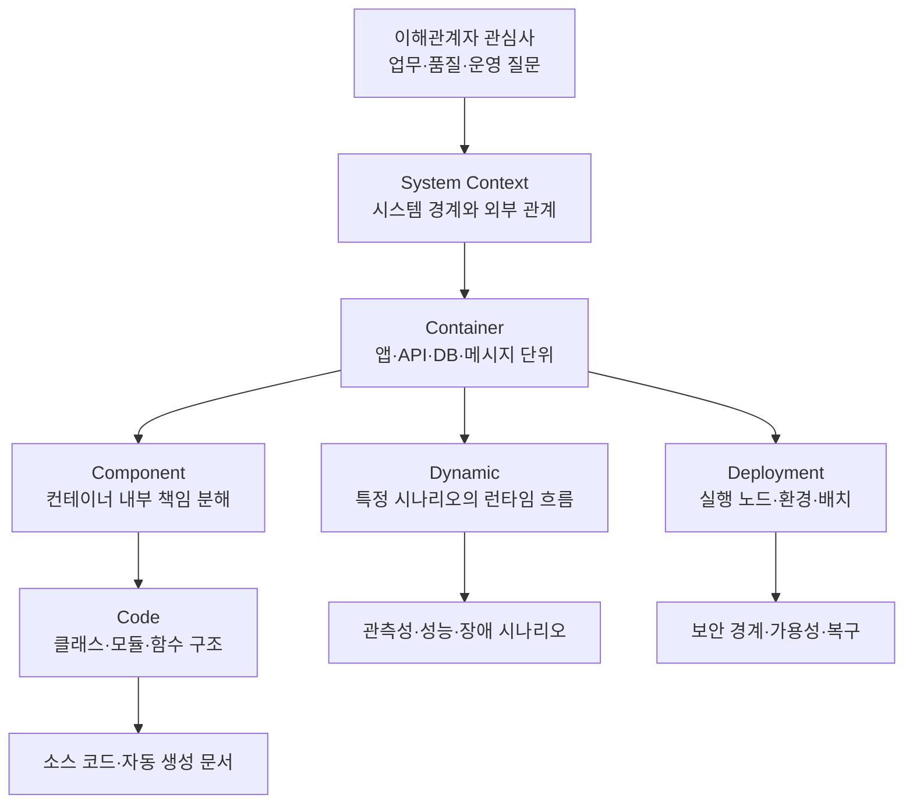
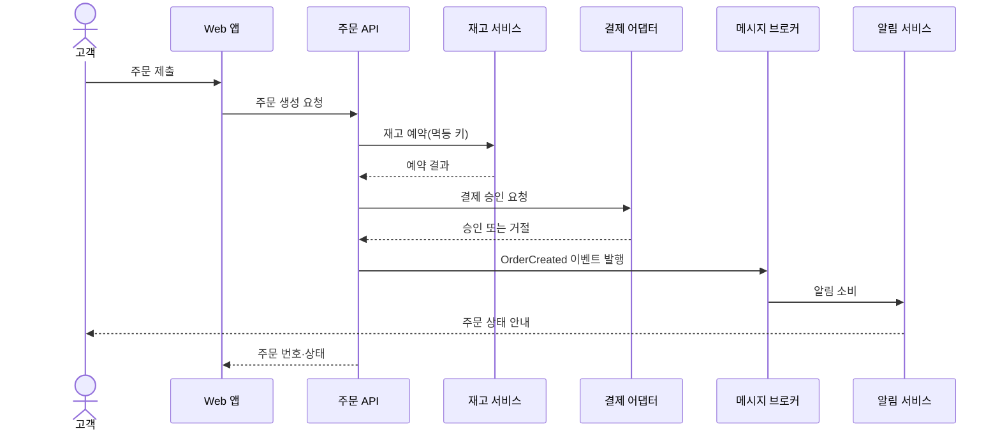
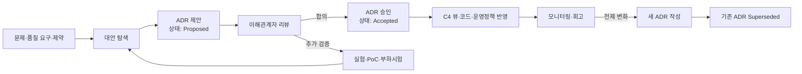
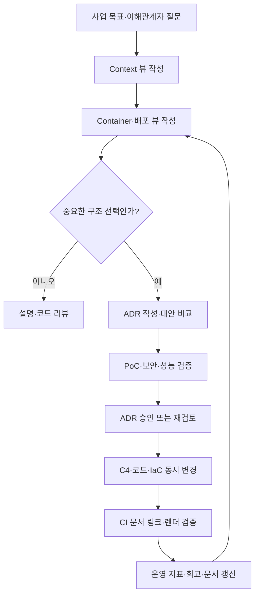

# C4 모델과 ADR 기반 소프트웨어 아키텍처 문서화

## 1. 개요

> **C4 모델과 ADR 기반 아키텍처 문서화**는 소프트웨어 구조를 이해관계자별 추상화 수준으로 시각화하고(C4), 중요한 설계 선택과 그 근거·트레이드오프를 의사결정 기록(ADR)으로 남겨 아키텍처 지식의 지속성을 확보하는 방법이다.

소프트웨어 아키텍처는 시스템의 기능 목록만으로 전달되지 않는다.
사용자와 외부 시스템의 경계, 배포 단위, 데이터 저장소, 런타임 호출 흐름, 보안 경계가 함께 설명되어야 개발·운영·보안·사업 담당자가 같은 시스템을 바라볼 수 있다.
그러나 모든 내용을 하나의 거대한 구조도에 넣으면 선과 상자가 지나치게 많아져, 정작 중요한 경계와 의존성이 보이지 않게 된다.

C4 모델은 지도를 확대하듯 시스템을 Context, Container, Component, Code의 계층으로 나누어 필요한 수준에서 구조를 표현한다.
상위 수준에서는 비기술 이해관계자도 시스템의 책임과 외부 의존성을 이해할 수 있고, 하위 수준에서는 개발자가 특정 컨테이너의 내부 분해를 추적할 수 있다.
모든 수준의 그림을 무조건 작성하는 것이 목적이 아니라, 질문과 독자에 맞는 뷰를 선택하는 것이 목적이다.

그림만으로는 “왜 이 데이터베이스를 선택했는가”, “왜 동기 호출 대신 이벤트를 사용했는가”를 설명하기 어렵다.
시간이 지나 담당자가 바뀌면 현재 구조는 남아도 당시의 규제·성능·비용·조직 제약은 사라진다.
ADR은 하나의 아키텍처적으로 중요한 결정을 당시의 맥락, 선택, 대안, 결과와 함께 짧게 기록하여 이러한 기억의 손실을 줄인다.

C4와 ADR은 서로 대체 관계가 아니다.
C4가 시스템의 현재 모습을 “무엇이 어디에 있고 어떻게 연결되는가”로 보여 준다면, ADR은 “왜 그 구조를 선택했으며 어떤 대가를 수용했는가”를 보완한다.
두 산출물을 코드 저장소와 함께 버전 관리하고 상호 연결하면 설계 변경 시 구조와 의사결정의 불일치를 발견하기 쉬워진다.

기술사 답안에서는 C4를 단순한 다이어그램 표기법으로, ADR을 회의록으로 축소하지 않아야 한다.
첫째, 이해관계자의 관심사와 품질속성에서 필요한 뷰를 도출해야 한다.
둘째, C4 요소의 경계와 책임을 문장으로 설명하고 관계의 방향·프로토콜·데이터 의미를 명시해야 한다.
셋째, ADR에는 긍정적 효과뿐 아니라 성능·보안·운영·이관 비용과 같은 부정적 결과도 기록해야 한다.

### 가. 등장 배경과 필요성

첫 번째 배경은 분산 시스템의 복잡성 증가다.
단일 애플리케이션 시대에는 소스 코드와 실행 파일만 읽어도 대략적인 구조를 알 수 있었지만, 현재 서비스는 웹·모바일 클라이언트, API, 메시지 브로커, 캐시, 여러 데이터 저장소와 외부 SaaS로 구성된다.
한 화면의 호출이 여러 서비스와 비동기 이벤트를 거치면 새로운 구성원이 실행 환경만 보아서는 전체 책임 경계를 파악하기 어렵다.

두 번째 배경은 문서의 독자와 목적이 서로 다르다는 사실이다.
경영진은 시스템이 어떤 업무를 지원하고 어떤 외부 파트너와 연결되는지를 알고 싶어 한다.
운영자는 장애 도메인, 배포 노드, 모니터링 위치와 복구 경로를 필요로 한다.
개발자는 모듈 책임, 인터페이스, 데이터 흐름과 변경 영향 범위를 확인해야 한다.
하나의 상세 설계도를 모두에게 강요하면 독자별 핵심 정보가 묻힌다.

세 번째 배경은 설계 근거의 망각이다.
프로젝트 초기에는 여러 대안을 검토했지만 최종 코드에는 선택된 결과만 남는다.
몇 년 뒤 새로운 담당자는 현재의 제약을 모른 채 같은 논의를 반복하거나, 성능·규제·운영 사유가 있는 결정을 단순히 낡은 코드로 오해할 수 있다.
ADR은 선택의 결과가 아니라 선택이 만들어진 과정과 당시의 판단 기준을 보존한다.

### 나. 목표와 적용 범위

문서화의 목표는 모든 코드를 그림으로 복제하는 것이 아니다.
첫 번째 목표는 시스템의 경계와 책임을 빠르게 공유하는 것이다.
두 번째 목표는 중요한 품질속성 요구와 구조적 선택의 관계를 설명하는 것이다.
세 번째 목표는 변경 시 영향 분석과 온보딩 시간을 줄이는 것이다.
네 번째 목표는 설계 부채와 문서 부채를 함께 관리하는 것이다.

적용 범위는 신규 시스템의 설계 단계뿐 아니라 기존 시스템의 역공학에도 해당한다.
신규 프로젝트는 업무 목표와 품질 시나리오에서 출발하여 C4 뷰와 ADR을 함께 만든다.
레거시 시스템은 먼저 현재 동작을 관찰해 Context·Container 뷰를 작성하고, 불확실한 부분은 “확인 필요”로 표시한 후 변경 작업과 함께 점진적으로 보완한다.

문서가 실제 운영에 사용되려면 코드와 같은 저장소에서 리뷰되어야 한다.
예를 들어 `docs/architecture/c4/`에는 다이어그램 소스와 설명을 두고, `docs/architecture/adr/`에는 번호가 증가하는 ADR을 저장할 수 있다.
대규모 조직에서는 공통 원칙을 중앙 카탈로그로 두되, 서비스별 구조와 결정은 해당 서비스 저장소에 남기는 방식이 추적성과 소유권의 균형을 이룬다.

## 2. C4 모델의 계층과 표현 원칙

C4 모델은 소프트웨어 아키텍처를 네 가지 핵심 추상화 수준으로 나눈다.
System Context는 시스템과 사람·외부 시스템의 관계를, Container는 시스템 내부의 실행·배포 단위를, Component는 한 컨테이너 내부의 논리적 책임을, Code는 컴포넌트의 구현 구조를 나타낸다.
여기에 특정 시나리오의 순서를 설명하는 Dynamic diagram과 컨테이너의 인프라 배치를 보여 주는 Deployment diagram을 보조적으로 사용할 수 있다.



이 계층은 조직의 공식 조직도나 마이크로서비스 개수와 동일한 개념이 아니다.
Container는 반드시 컨테이너 기술로 실행되는 프로세스만을 뜻하지 않으며, 하나의 애플리케이션·서비스·데이터 저장소처럼 독립적으로 실행되거나 배포되는 단위를 의미한다.
따라서 모놀리식 시스템도 하나의 Container로 표현할 수 있고, 그 내부의 모듈을 Component로 설명할 수 있다.

### 가. System Context 다이어그램

System Context 다이어그램은 문서의 출발점이다.
관심 시스템을 하나의 중심 상자로 두고, 시스템과 상호작용하는 사용자 역할과 외부 시스템을 주변에 배치한다.
이 수준에서는 내부 클래스나 프레임워크를 넣지 않고 시스템의 책임, 외부 관계, 주요 데이터·업무 흐름을 평이한 문장으로 설명한다.

좋은 Context 뷰는 “이 시스템이 무엇을 하는가”와 “무엇을 하지 않는가”를 함께 보여 준다.
예를 들어 쇼핑 주문 시스템은 고객·상담원·결제 게이트웨이·배송 파트너와 연결될 수 있지만, 결제 승인 자체는 외부 결제 시스템의 책임이라고 표시해야 한다.
경계를 명확히 하지 않으면 장애 책임, 개인정보 처리 책임, 인터페이스 변경 책임을 잘못 배분하게 된다.

실무에서는 먼저 사용자 여정과 외부 연계 목록을 인터뷰하고, 각 관계에 목적·방향·주요 정보·신뢰 경계를 기록한다.
“호출한다”라는 선만 그리는 대신 “주문 시스템이 결제 승인 요청을 보내고 승인 결과를 받는다”처럼 관계의 의미를 쓴다.
이렇게 하면 비기술 담당자도 업무 범위를 검토할 수 있고, 보안 담당자는 외부 경계에 대한 인증·암호화 요구를 질문할 수 있다.

### 나. Container 다이어그램

Container 다이어그램은 시스템 내부의 주요 실행 단위를 보여 주며 대부분의 팀에서 가장 높은 투자 대비 효과를 준다.
웹 애플리케이션, 모바일 앱, API 서비스, 배치 작업, 메시지 브로커, 관계형 데이터베이스, 객체 저장소처럼 독립적으로 실행·배포·확장되는 요소를 표시한다.
각 요소에는 책임, 기술 선택, 통신 방식, 저장 데이터의 성격을 함께 적어야 한다.

Container를 나누는 이유는 단순히 서비스 수를 늘리기 위해서가 아니다.
변경 주기, 장애 격리, 확장 요구, 보안·데이터 소유권, 팀의 책임 범위가 달라질 때 별도 단위가 의미를 갖는다.
반대로 네트워크 호출만 늘고 데이터와 배포가 함께 묶여 있다면 형식상 여러 서비스로 나눈 것이 오히려 운영 복잡성을 키울 수 있다.

다음과 같은 질문으로 Container 경계를 검토한다.
첫째, 이 요소는 독립적으로 배포하거나 롤백할 수 있는가.
둘째, 데이터와 불변식의 소유자가 명확한가.
셋째, 호출 지연과 장애 전파를 감당할 이유가 있는가.
넷째, 팀의 업무 경계와 변경 승인 흐름이 구조와 일치하는가.
질문에 답하지 못한 분리는 “분산을 위한 분산”일 가능성이 높다.

### 다. Component와 Code 다이어그램

Component 다이어그램은 특정 Container 내부의 주요 논리 컴포넌트와 책임을 보여 준다.
예를 들어 주문 API 안에 주문 검증기, 가격 정책 서비스, 재고 예약 어댑터, 결제 오케스트레이터, 이벤트 발행기가 있을 수 있다.
각 컴포넌트는 한 가지 책임과 명확한 의존 방향을 가져야 하며, 외부 인터페이스와 데이터 변환 지점을 구분해야 한다.

Component 수준은 모든 컨테이너에 기계적으로 적용하지 않는다.
내부 구조가 단순하거나 코드 자체가 충분히 설명한다면 문서를 만들지 않는 편이 낫다.
반대로 규칙이 복잡한 결제·권한·정산 모듈처럼 변경 영향이 크고 신규 인력이 자주 접근하는 영역은 Component 뷰의 가치가 높다.

Code 수준은 클래스·인터페이스·패키지·함수와 같은 구현 상세를 표현한다.
수작업으로 모든 코드를 그리면 빠르게 낡으므로 IDE나 정적 분석 도구로 자동 생성하거나, 알고리즘·핵심 도메인 모델처럼 정말 필요한 부분만 제한적으로 기록한다.
문서에 표시된 클래스가 실제 코드와 다르면 독자는 모든 문서를 불신하게 되므로 자동화 가능성이 낮은 Code 뷰는 과감히 생략할 수 있다.

### 라. Dynamic·Deployment 다이어그램

Dynamic 다이어그램은 정적인 연결 관계만으로 이해하기 어려운 하나의 시나리오를 번호가 있는 순서로 설명한다.
“주문 생성”에서 API가 재고를 예약하고 결제를 요청한 뒤 이벤트를 발행하는 흐름, 또는 장애 시 재시도·보상 처리를 보여 줄 수 있다.
시나리오별로 정상 흐름과 실패 흐름을 분리하면 타임아웃, 중복 메시지, 멱등성, 트랜잭션 경계를 논의하기 쉬워진다.

Deployment 다이어그램은 Container가 어떤 실행 노드·클라우드 리소스·가용 영역에 배치되는지를 표현한다.
개발·스테이징·운영 환경의 차이, 퍼블릭·프라이빗 네트워크 경계, 비밀 관리 위치, 복제와 장애 조치 노드를 표시한다.
애플리케이션 구조와 인프라 구조를 연결하면 “동일한 코드인데 운영에서만 실패하는 이유”와 “한 노드 장애가 어느 서비스에 영향을 주는가”를 추적할 수 있다.



동적 흐름에서 화살표의 방향은 호출 방향을, 점선이나 별도 표기는 비동기 전달을 나타내도록 팀 규칙을 정한다.
단순히 선의 모양에 의존하지 말고 각 관계에 동기·비동기, 재시도, 타임아웃, 데이터 계약을 문장으로 병기한다.
그림은 빠른 이해를 위한 지도이고, 운영 규칙은 설명문과 테스트·설정으로 검증되어야 한다.

## 3. ADR의 구조와 의사결정 관리

ADR은 아키텍처에 지속적인 영향을 주는 하나의 결정을 기록하는 짧은 문서다.
기능 구현 티켓이나 모든 코드 리뷰를 ADR로 만들면 중요한 결정의 신호가 묻힌다.
반대로 데이터 저장소, 인증 방식, 통신 패턴, 배포 전략, 개인정보 보관 위치처럼 되돌리기 어렵고 여러 품질속성에 영향을 주는 선택은 ADR 후보로 삼는다.



### 가. Context와 문제 정의

Context에는 결론을 미리 정당화하는 표현보다 의사결정 당시의 사실과 힘을 중립적으로 적는다.
사업 목표, 예상 부하, 규제 요구, 팀 역량, 일정, 기존 시스템 제약, 데이터 특성을 포함해야 한다.
“최신 기술이라서”와 같은 문구는 검증 기준이 되지 않으므로, 어떤 품질속성과 어떤 운영 조건을 개선하려는지 구체화한다.

예를 들어 “주문 이벤트를 메시지 브로커로 전달한다”는 결정의 Context에는 결제 승인과 알림의 처리 시간이 다르고, 알림 제공자 장애가 주문 생성에 전파되면 안 되며, 이벤트 중복을 감당할 소비자 설계가 필요하다는 사실을 적는다.
이렇게 쓰면 나중에 트래픽 규모나 알림 요구가 바뀌었을 때 기존 결정의 전제가 여전히 유효한지 판단할 수 있다.

### 나. Decision과 대안 비교

Decision은 “우리는 무엇을 선택한다”는 능동형 문장으로 작성한다.
선택한 기술 이름만 쓰지 말고 적용 범위, 인터페이스 원칙, 예외 조건, 전환 계획을 포함한다.
예를 들어 “주문 생성과 결제 승인 사이에는 동기 호출을 유지하되, 알림·검색 색인 갱신은 `OrderCreated` 이벤트로 분리하고 이벤트 소비자는 주문 ID에 대해 멱등성을 보장한다”처럼 경계를 명시한다.

대안은 최소 두 개 이상을 검토하고 선택하지 않은 이유를 남긴다.
대안 비교는 기능 목록을 나열하는 것이 아니라 현재 Context에서 품질속성에 미치는 영향과 조직이 부담할 비용을 설명해야 한다.
다음 표는 메시지 전달 방식 선택의 예다.

| 대안 | 장점 | 부담·위험 | 적용 판단 |
|---|---|---|---|
| 모두 동기 REST 호출 | 흐름이 직관적이고 즉시 결과 확인 | 장애 전파와 결합도 증가, 피크 확장 한계 | 강한 즉시 일관성이 필요한 핵심 단계 |
| 모두 비동기 이벤트 | 결합도와 독립 확장성 개선 | 지연·중복·순서·추적성 관리 필요 | 후속 처리와 대규모 이벤트 흐름 |
| 핵심 동기·부가 비동기 혼합 | 사용자 응답과 장애 격리의 균형 | 두 모델의 운영·관측성 규칙 필요 | 주문·결제와 알림을 분리하는 일반적 전략 |

표의 “혼합”을 선택했다고 해서 항상 최선인 것은 아니다.
결제 승인처럼 사용자가 즉시 성공 여부를 알아야 하는 단계는 동기 경로로 두는 편이 오류 처리가 명확할 수 있다.
반면 이메일 발송처럼 몇 초의 지연을 허용할 수 있는 작업은 비동기화하여 외부 제공자의 지연이 주문 API의 응답을 막지 않게 할 수 있다.
따라서 선택 결과는 업무의 허용 지연과 실패 보상 방식에 근거해야 한다.

### 다. Consequences와 상태 관리

Consequences에는 긍정·부정·중립 결과를 모두 적는다.
메시지 기반 구조는 서비스 결합도를 낮추고 독립 확장을 돕지만, 최종 일관성·중복 소비·순서 뒤바뀜·추적 ID 전파를 새롭게 관리해야 한다.
부정적 결과를 감추면 ADR이 홍보 문서가 되어 미래의 운영자가 실제 비용을 예상하지 못한다.

ADR 상태는 최소한 Proposed, Accepted, Deprecated, Superseded와 같이 명확한 생명주기를 갖는다.
Accepted 문서를 나중에 조용히 고치면 당시의 판단 기록과 현재의 지식이 섞인다.
결정을 뒤집을 때는 새 ADR을 작성하고 기존 문서에 대체 문서 번호와 전환 이유를 남긴다.

변경된 C4 구조는 관련 ADR과 같은 변경 묶음에서 리뷰한다.
예를 들어 데이터베이스를 교체하는 풀 리퀘스트에는 Container 뷰의 기술명, Deployment 뷰의 배치, 데이터 이전 전략, 해당 ADR의 상태 변경이 함께 포함되어야 한다.
문서와 코드가 분리된 릴리스로 움직이면 그림에는 존재하지만 실제로는 호출되지 않는 서비스 같은 유령 구조가 생긴다.

### 라. ADR 템플릿 예시

실무에서 사용할 수 있는 최소 템플릿은 다음과 같다.

```markdown
# ADR-0012: 주문 후속 처리를 이벤트 기반으로 분리

- 상태: Accepted
- 일자: 2026-09-18
- 관련 C4: Container - Order API, Notification Service

## Context
주문 생성의 응답시간과 알림 제공자의 외부 지연을 분리해야 한다.

## Decision
주문 API는 주문 생성 완료 후 OrderCreated 이벤트를 발행한다.
알림 소비자는 주문 ID를 멱등 키로 사용한다.

## Alternatives
모든 후속 처리를 동기 호출하는 방식과 배치 폴링 방식을 검토했다.

## Consequences
주문 응답은 안정화되지만 최종 일관성, 재처리, 이벤트 추적을 운영해야 한다.

## Follow-up
중복 소비율과 알림 지연을 모니터링하고 분기별로 재처리 훈련을 수행한다.
```

템플릿의 목적은 형식을 엄격히 강제하는 것이 아니라, 결정의 맥락과 결과를 빠뜨리지 않게 하는 것이다.
팀 규모가 작다면 Status·Context·Decision·Consequences만으로 시작할 수 있다.
규제 산업이나 여러 팀이 공동으로 운영하는 플랫폼이라면 의사결정자, 협의자, 영향받는 서비스, 검증 지표와 만료·재검토 조건을 추가한다.

## 4. C4와 ADR 통합 운영 프로세스

통합 운영은 “그림을 그린 뒤 문서를 따로 쓰는” 순서가 아니라 질문·결정·검증을 연결하는 순환 과정이다.
먼저 Context 뷰로 시스템 경계와 외부 관계를 합의하고, Container 뷰로 책임·배포·데이터 소유권을 검토한다.
품질속성 충돌이나 되돌리기 어려운 선택이 발견되면 ADR을 제안하고, 승인 후 관련 C4 요소와 구현에 반영한다.



### 가. 문서 작성과 리뷰

설계 워크숍에서는 처음부터 상세한 Component 뷰를 그리지 않는다.
사용자와 외부 연계가 있는 Context를 먼저 확인하고, 업무 책임과 품질 시나리오를 Container 경계에 매핑한다.
그 다음 장애 격리·확장·데이터 일관성 같은 논점이 생긴 요소만 Component와 Dynamic 뷰로 확장한다.
이 순서는 불필요한 상세화와 회의 시간을 줄인다.

리뷰어는 표기법보다 의미를 먼저 검토해야 한다.
시스템의 주체·대상이 맞는지, 데이터 소유자가 표현되었는지, 신뢰 경계와 장애 경로가 빠지지 않았는지, 각 ADR의 결정이 현재 코드·배포 설정과 일치하는지를 확인한다.
도형 위치나 색상에만 시간을 쓰면 문서가 예뻐져도 설계 위험은 줄지 않는다.

### 나. Docs-as-Code와 자동화

다이어그램 소스와 ADR을 Git에 저장하면 코드와 같은 브랜치·풀 리퀘스트·리뷰·변경 이력을 사용할 수 있다.
Mermaid, PlantUML, Structurizr DSL과 같은 텍스트 기반 표현은 렌더링 자동화와 검색에 유리하지만, 팀이 채택한 도구의 문법과 출력 안정성을 고려해야 한다.
도구보다 중요한 것은 실제 변경자가 문서를 함께 수정할 수 있는 낮은 비용이다.

CI에서는 Mermaid 문법, 링크의 유효성, ADR 번호 중복, Superseded 링크, C4 요소의 필수 설명을 검사할 수 있다.
배포 파이프라인에서 생성된 HTML·PNG를 아티팩트로 보관하고, 운영 변경 승인 화면에서 관련 ADR 링크를 표시하면 문서가 일회성 산출물로 끝나는 것을 막을 수 있다.
다만 자동 생성된 Code 뷰가 최신이라는 이유로 아키텍처 의도까지 설명해 주지는 않으므로, 구조적 해석은 사람이 유지해야 한다.

### 다. 문서 품질 지표

문서화의 효과는 문서 파일 수가 아니라 질문에 답하는 속도와 변경의 안전성으로 측정한다.
예를 들어 신규 개발자가 핵심 시스템의 경계와 배포 흐름을 파악하는 데 걸리는 시간, 장애 대응 시 관련 의존성과 담당 팀을 찾는 시간, 중요한 결정 중 ADR 링크가 있는 비율을 추적할 수 있다.
문서가 많아졌는데 온보딩 시간이 줄지 않는다면 독자에게 불필요한 상세 정보가 과잉 공급되었거나 내용의 신뢰성이 낮다는 뜻이다.

구체적인 운영 기준은 시스템별로 정한다.
핵심 서비스의 Container 뷰는 주요 배포 변경 전에 검토하고, ADR은 데이터 저장소·인증·통신 프로토콜 같은 구조 결정마다 작성한다.
다이어그램과 코드의 불일치 결함, 오래된 ADR 비율, 링크 오류, 운영 사고에서 누락된 의존성도 문서 부채 지표로 관리할 수 있다.

## 5. 비교와 사례

### 가. C4와 UML·단일 거대 구조도의 비교

UML은 다양한 모델과 정교한 표기법을 제공하고, 특정 설계·행동을 엄밀히 표현하는 데 강점이 있다.
C4는 제한된 핵심 개념과 계층을 사용하여 팀과 비기술 이해관계자 사이의 의사소통을 빠르게 하는 데 초점을 둔다.
따라서 둘 중 하나만 옳다고 하기보다, C4로 전체 지도를 만들고 UML이나 코드 모델로 복잡한 내부 알고리즘을 보완하는 조합이 현실적이다.

단일 거대 구조도는 한 장에 많은 정보를 담을 수 있지만, 독자별 관심사와 변경 주기가 섞인다.
C4의 여러 뷰는 같은 모델을 서로 다른 확대 수준으로 제공하여 정보량을 통제한다.
그 대신 각 뷰 사이의 요소명·관계·책임을 일관되게 유지해야 하므로 문서 거버넌스가 필요하다.

| 구분 | C4 모델 | UML 중심 문서 | 단일 거대 구조도 |
|---|---|---|---|
| 핵심 목적 | 독자별 아키텍처 이해 | 설계 구조·행동의 정밀 표현 | 전체 관계를 한 번에 표시 |
| 추상화 | Context→Container→Component→Code | 다이어그램 종류별 다양 | 한 장에 혼합되기 쉬움 |
| 장점 | 설명·확대·온보딩에 유리 | 형식적 모델링과 상세 설계 | 작성 초기에는 빠른 개요 |
| 주요 위험 | 관계 규칙이 없으면 모호함 | 과도한 형식과 작성 비용 | 복잡도·가독성 저하 |
| 보완책 | 설명문·ADR·자동검증 | 독자별 뷰와 핵심만 선별 | 계층화와 분할·링크 |

### 나. 전자상거래 주문 플랫폼 사례

전자상거래 플랫폼에서 Context 뷰는 고객·운영자·주문 시스템·결제 게이트웨이·배송 파트너·고객 알림 제공자를 구분한다.
Container 뷰는 고객 웹 앱, 주문 API, 재고 서비스, 결제 어댑터, 주문 DB, 이벤트 브로커, 알림 서비스로 확장한다.
이 구조만으로도 결제 제공자 장애가 주문 조회와 동일한 장애인지, 알림 제공자가 주문 핵심 경로에 있는지를 논의할 수 있다.

“알림을 이벤트로 분리한다”는 선택은 ADR로 남긴다.
Context에는 주문 성공 응답의 목표 지연시간, 알림의 허용 지연, 외부 제공자 오류율과 재시도 제한을 기록한다.
Decision에는 이벤트 스키마 버전, 중복 처리 키, 실패 큐와 재처리 책임을 명시한다.
Consequences에는 사용자에게 주문은 성공했지만 알림이 늦게 도착할 수 있다는 점과, 운영자가 재처리 큐를 감시해야 한다는 점을 포함한다.

예를 들어 피크 시간에 주문 API가 초당 2,000건을 처리해야 하고 알림 API가 평균 1초, 장애 시 최대 30초 지연될 수 있다고 가정하자.
알림을 동기 호출로 두면 주문 응답의 꼬리 지연이 외부 API에 의해 커지고, 재시도까지 포함할 때 스레드·연결 풀이 고갈될 수 있다.
이벤트로 분리하면 주문 경로의 지연을 제한할 수 있지만, 이벤트 발행 성공과 DB 트랜잭션의 원자성을 보장하기 위해 Transactional Outbox 같은 추가 설계를 검토해야 한다.

### 다. 금융·공공 시스템에서의 문서화

금융·공공 시스템은 개인정보, 감사 추적, 장애 복구, 공급업체 의존성을 함께 설명해야 한다.
Context 뷰에는 시민·직원·기관·외부 인증기관과 같은 주체를, Deployment 뷰에는 망 분리·암호화 구간·백업 사이트를 표시한다.
ADR에는 인증수단과 키 관리 방식, 데이터 보존 기간, 외부 클라우드 사용 범위와 감사 증적의 책임을 남긴다.

이 환경에서는 “나중에 문서를 보강한다”는 접근이 위험할 수 있다.
인증·개인정보 저장·국외 이전과 관련된 결정은 구현 전에 보안·법무·감사 담당자와 검토하고, 결정 근거와 예외 승인 만료일을 기록해야 한다.
다만 ADR 자체가 규정 준수를 자동 보증하지는 않으므로 정책, 테스트 증적, 접근 로그와 연결하여 사용해야 한다.

## 6. 심화: 아키텍처 지식의 지속성과 변화 관리

C4와 ADR의 결합은 현재 구조를 설명하는 문서에서 아키텍처 지식 그래프로 발전할 수 있다.
C4 요소에는 소유 팀, 품질속성, 운영 대시보드, API 계약, 관련 ADR을 연결하고, ADR에는 영향을 받는 요소와 검증 지표를 역링크한다.
그러면 특정 데이터 저장소를 교체할 때 관련 서비스·배포 노드·보안 통제·결정의 전제까지 영향 범위를 검색할 수 있다.

아키텍처는 시간이 지나며 침식된다.
팀이 임시 연계를 추가하고 문서를 갱신하지 않으면 실제 구조와 의도한 구조 사이에 차이가 생긴다.
이를 방지하려면 중요한 C4 관계에 대한 아키텍처 적합성 검사를 CI에 넣고, ADR의 전제와 SLO·비용·보안 지표를 정기적으로 재검토해야 한다.
검사는 “문서가 코드와 똑같은가”만이 아니라 “현재 선택이 여전히 사업 목표에 맞는가”도 질문해야 한다.

예를 들어 데이터 규모가 초기 예상보다 커져 단일 DB의 확장이 한계에 도달하면, 기존 ADR의 Context 수치가 더 이상 맞지 않을 수 있다.
이때 기존 ADR을 수정하여 과거 기록을 지우기보다, 샤딩·읽기 복제·분석 저장소 분리 같은 대안을 조사한 새 ADR을 작성한다.
새로운 Container·Deployment 뷰와 데이터 이전 검증 결과를 함께 리뷰하고, 이전 ADR을 Superseded로 표시하면 판단의 연속성과 변화의 이유를 모두 보존할 수 있다.

AI 코딩 도구와 자동 문서 생성이 확산되어도 의사결정의 책임은 자동화되지 않는다.
코드에서 호출 그래프를 추출해 Component 초안을 만들 수 있지만, 특정 경계를 팀 소유권으로 둘지, 개인정보를 어느 시스템이 보관할지, 성능과 비용의 어느 지점을 허용할지는 조직의 판단이다.
자동 생성 결과에는 생성 시점과 분석 범위를 표시하고, 사람의 리뷰와 ADR 승인을 거친 결과만 공식 아키텍처로 취급해야 한다.

## 7. 고려사항 및 시사점

### 가. 목적 기반 최소 문서화

모든 시스템에 동일한 수의 다이어그램과 ADR을 강제하면 문서가 형식 업무로 변한다.
핵심 이해관계자 질문, 변경 위험, 장애 영향, 규제 의무를 기준으로 필요한 뷰를 선택해야 한다.
최소한의 Context와 Container에서 시작하고, 복잡한 영역에만 Component·Dynamic·Deployment를 추가하는 점진적 접근이 지속성을 높인다.

### 나. 현재 상태와 목표 상태의 구분

설계 문서에는 현재(As-Is), 승인된 목표(To-Be), 실험 중인 대안을 섞지 않아야 한다.
각 C4 뷰에 상태와 기준 커밋·환경을 표시하고, ADR의 상태와 적용 범위를 명확히 한다.
특히 마이그레이션 중에는 구·신 시스템과 데이터 동기화 관계를 Deployment·Dynamic 뷰로 표현하여 운영자가 어느 경로를 신뢰해야 하는지 알게 해야 한다.

### 다. 품질속성과 검증의 연결

아키텍처 선택은 “확장 가능하다”처럼 추상적으로 끝내지 말고 측정 가능한 시나리오와 연결한다.
응답시간, 처리량, 복구시간, 데이터 신선도, 감사 로그 보존, 취약점 대응시간 등 검증 지표를 ADR에 적고 PoC·부하시험·보안시험 결과를 링크한다.
검증되지 않은 품질 주장은 설계 의도가 아니라 가설로 취급해야 한다.

### 라. 보안·개인정보와 변경 책임

C4 Context와 Deployment 뷰에는 신뢰 경계, 인증·인가 지점, 암호화 구간, 개인정보 흐름을 표시한다.
ADR에는 데이터 최소화, 접근 주체, 보존·삭제, 키 회전, 사고 시 대응 책임을 구조 결정과 함께 기록한다.
보안 검토가 끝난 뒤 구조가 바뀌면 관련 ADR과 위협 모델도 다시 검토해야 하며, 문서만 갱신하고 통제를 적용하지 않는 형식적 준수는 피해야 한다.

### 마. 문서의 소유권과 갱신 트리거

문서에는 담당 팀과 마지막 검토일을 표시하고, 배포 단위·인터페이스·데이터 저장소·인증 경계가 바뀔 때 갱신을 요구한다.
“분기마다 모두 다시 그린다”는 규칙만으로는 변경 직후의 불일치를 막지 못하므로 코드 리뷰와 릴리스 체크리스트에 문서 갱신을 포함하는 편이 효과적이다.
소유자가 없는 중앙 위키보다 서비스를 운영하는 팀의 저장소에 문서를 두고, 조직 공통 표준은 재사용 가능한 템플릿으로 제공하는 것이 바람직하다.

### 바. 기술사 관점의 전망

앞으로 아키텍처 문서는 정적 이미지보다 코드·IaC·관측성·정책과 연결된 검증 가능한 지식 자산이 되어야 한다.
그러나 자동화 수준이 높아질수록 “그림이 생성되었다”와 “의도와 트레이드오프가 합의되었다”를 구분해야 한다.
기술사는 표기법 선택보다 사업 목표, 품질속성, 조직 운영, 규제와 변화관리 사이의 연결을 설계하고 문서화하는 역할을 수행해야 한다.

## 참고자료

- C4 Model 공식 사이트: https://c4model.com/
- C4 Model 다이어그램 안내: https://c4model.com/diagrams
- C4 Model 소개: https://c4model.com/introduction
- Architectural Decision Records 공동체: https://adr.github.io/
- Michael Nygard, Documenting Architecture Decisions: https://www.cognitect.com/blog/2011/11/15/documenting-architecture-decisions

---

> **한 줄 요약**: C4로 아키텍처의 “무엇”을 독자별 수준으로 보여 주고 ADR로 “왜”와 트레이드오프를 기록하여, 구조·코드·운영이 함께 진화하는 살아 있는 설계 문서를 만든다.
