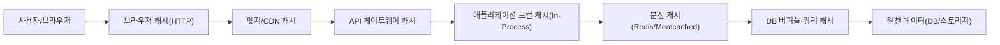
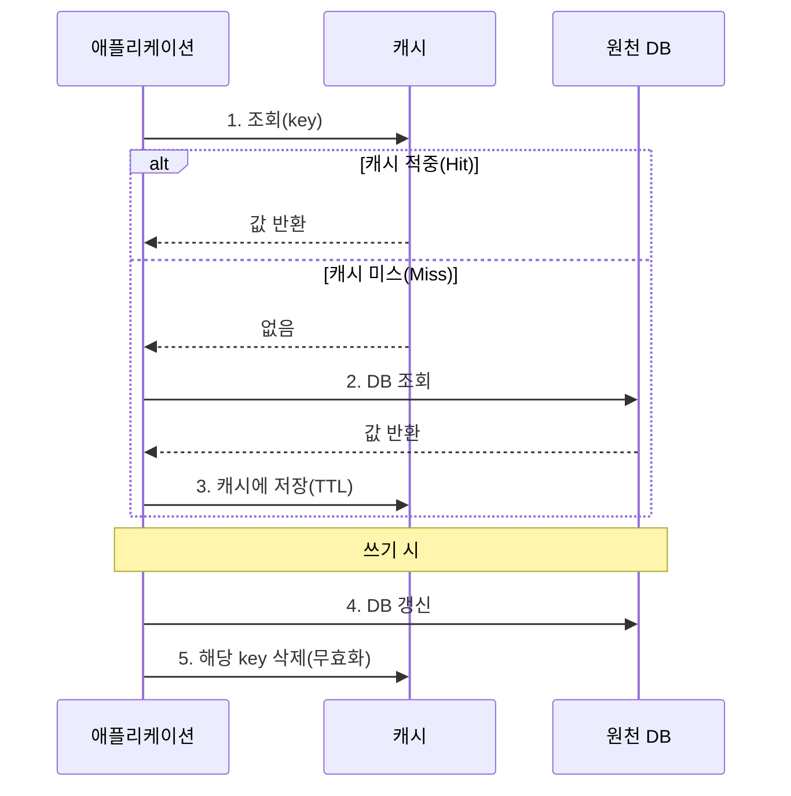
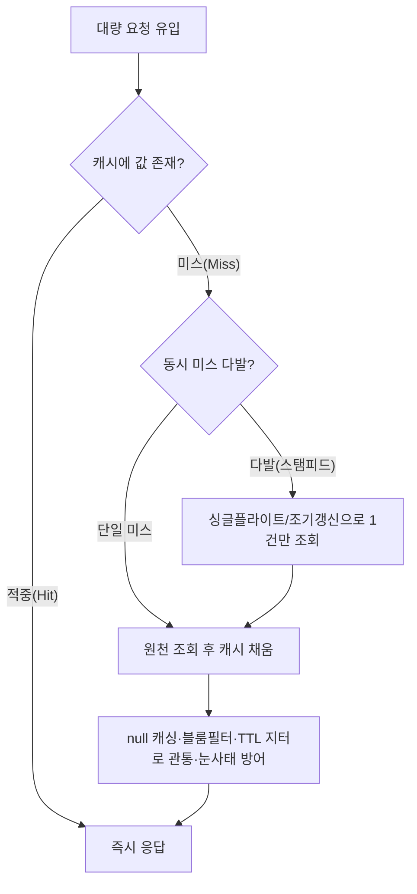

# 캐시 전략(Caching Strategy)과 분산 캐시 설계

## 1. 개요

> **정의:** 캐시(Cache)는 상대적으로 느리고 비용이 큰 저장소(디스크·원격 DB·외부 API)의 데이터를 접근 속도가 빠른 계층(메모리·SSD·엣지 노드)에 사본으로 보관하여, 동일하거나 유사한 요청에 대해 원천 접근을 회피함으로써 지연시간과 부하를 줄이는 성능·확장성 기법이다. 캐시 전략(Caching Strategy)은 이 사본을 언제·어떻게 채우고(read/write path), 얼마나 오래 유지하며(TTL·eviction), 원천과 어떻게 일관성을 맞출지(invalidation)를 결정하는 설계 원칙의 집합이다.

캐시가 정보시스템의 핵심 설계 요소로 부상한 배경에는 세 가지 구조적 압력이 있다. 첫째, 저장 계층 간 성능 격차의 심화다. CPU 캐시 접근이 나노초 단위인 반면 DRAM은 수십 나노초, SSD는 수십 마이크로초, 네트워크를 건넌 원격 DB 조회는 수 밀리초에 이른다. 계층 간 수천 배의 격차는 "자주 쓰는 데이터를 가까이 둔다"는 지역성(Locality) 원리를 시스템 전반으로 확장하게 만들었다. 둘째, 읽기 편중(read-heavy) 워크로드의 보편화다. 대부분의 웹·모바일 서비스는 쓰기 대비 읽기 비율이 수십 배 이상이며, 소수의 인기 항목이 트래픽의 대부분을 차지하는 멱법칙(power-law) 분포를 보인다. 이때 상위 소수 항목만 캐싱해도 원천 부하의 대부분을 흡수할 수 있다. 셋째, 클라우드 과금 구조다. DB 조회·함수 호출·외부 API가 모두 종량제로 과금되는 환경에서 캐시 적중(cache hit) 한 건은 곧 비용 절감이며, FinOps 관점에서 캐시는 성능 도구인 동시에 원가 절감 수단이다.

그러나 캐시는 본질적으로 "원천 데이터의 오래된 사본"을 허용하는 대가로 성능을 얻는 기법이다. 따라서 캐시 설계의 어려움은 속도를 높이는 데 있지 않고, **일관성·정합성을 어디까지 희생할 것인가**를 결정하는 데 있다. Phil Karlton의 유명한 경구처럼 "컴퓨터 과학에서 어려운 두 가지는 캐시 무효화와 이름 짓기"이며, 이는 캐시가 데이터 신선도(freshness), 정합성(consistency), 가용성(availability) 사이의 트레이드오프를 강제하기 때문이다. 기술사 관점에서 캐시 전략은 단순한 성능 튜닝이 아니라, 서비스의 정합성 요구수준·장애 허용도·비용 목표를 정량적으로 반영하는 아키텍처 의사결정으로 다뤄야 한다.

이 글에서는 캐시의 계층 구조와 데이터 접근 패턴(읽기/쓰기 경로), 축출(eviction)과 무효화(invalidation) 전략, 분산 캐시 설계와 대표적 장애 시나리오(스탬피드·관통·눈사태), 그리고 최신 동향과 기술사 관점의 고려사항을 순서대로 다룬다.

## 2. 캐시 계층 구조와 구성

캐시는 특정 제품이 아니라 시스템 전 계층에 걸쳐 존재하는 "패턴"이다. 클라이언트에서 원천 저장소에 이르는 경로 위 여러 지점에 사본이 놓이며, 각 계층은 지연시간·용량·공유범위·무효화 난이도가 다르다. 아래 구조도는 요청이 원천에 도달하기까지 통과하는 대표적 캐시 계층을 보여준다.

계층을 원천에서 사용자 쪽으로 훑어보면 다음과 같다. **DB 내부 캐시**(버퍼 풀·플랜 캐시)는 DBMS가 자동 관리하는 가장 안쪽 캐시로, 개발자가 직접 제어하기 어렵지만 인덱스·쿼리 튜닝을 통해 적중률을 높일 수 있다. **분산 캐시**는 여러 애플리케이션 인스턴스가 공유하는 별도 캐시 서버(Redis·Memcached)로, 상태를 외부화하여 애플리케이션을 무상태(stateless)로 유지하고 수평 확장을 가능케 하는 핵심 계층이다. **애플리케이션 로컬 캐시**(in-process, 예: Caffeine·Guava)는 프로세스 힙 내부에 두어 네트워크 왕복조차 제거하지만, 인스턴스마다 사본이 달라 정합성 관리가 까다롭다. **API 게이트웨이·CDN·브라우저 캐시**는 원천에서 멀어질수록 응답을 사용자 가까이에 두어 지연을 극적으로 줄이지만, 그만큼 무효화 도달 범위가 넓고 제어가 어려워진다.

여기서 핵심 통찰은 **원천에서 멀어질수록(사용자에 가까울수록) 성능 이득은 커지지만 무효화가 어려워진다**는 상충 관계다. 브라우저에 캐시된 데이터는 서버가 강제로 지울 수 없어 TTL 만료나 버전 URL(cache busting)에 의존해야 하는 반면, 분산 캐시 항목은 서버가 즉시 삭제할 수 있다. 따라서 자주 바뀌고 정합성이 중요한 데이터는 안쪽 계층에, 거의 불변인 정적 자산은 바깥 계층에 두는 것이 원칙이다. 예를 들어 이미지·CSS·JS 같은 정적 자산은 파일명에 해시를 넣어 CDN에 1년 TTL로 두되(내용이 바뀌면 파일명이 바뀌므로 안전), 사용자 계정 잔액처럼 정합성이 중요한 데이터는 짧은 TTL의 분산 캐시나 캐시 우회로 처리한다.

계층별 특성을 정리하면 다음과 같다. 다만 이 표는 선택의 보조 자료일 뿐이며, 실제 설계는 데이터의 변경 빈도·정합성 요구·공유 범위를 함께 따져 계층을 조합해야 한다.

| 계층 | 대표 기술 | 지연시간(상대) | 공유 범위 | 무효화 난이도 |
|---|---|---|---|---|
| 브라우저 | HTTP Cache-Control/ETag | 0(왕복 없음) | 개별 사용자 | 매우 높음(TTL 의존) |
| CDN/엣지 | CloudFront·Cloudflare | 수 ms | 전역 사용자 | 높음(purge API) |
| 분산 캐시 | Redis·Memcached | 서브 ms~수 ms | 전 인스턴스 | 낮음(즉시 삭제) |
| 로컬(In-Process) | Caffeine·Ehcache | 수십 ns | 단일 인스턴스 | 중간(전파 필요) |
| DB 내부 | 버퍼 풀·플랜 캐시 | 자동 | DB 노드 | 자동 관리 |

## 3. 데이터 접근 패턴 — 읽기·쓰기 경로 전략

캐시 전략의 실질은 "읽을 때 어떻게 채우고, 쓸 때 원천과 어떻게 동기화하는가"에 있다. 이를 읽기 경로와 쓰기 경로로 나누어 살펴본다. 아래 시퀀스는 가장 널리 쓰이는 Cache-Aside(Lazy Loading) 패턴의 읽기·쓰기 흐름을 표현한 것이다.

### 3.1 읽기 경로: Cache-Aside vs Read-Through

**Cache-Aside(Lazy Loading)**는 애플리케이션이 캐시를 직접 제어하는 방식이다. 조회 시 먼저 캐시를 보고, 미스이면 DB에서 읽어 캐시에 채운 뒤 반환한다. 실제로 요청된 데이터만 캐시에 적재되므로 메모리 효율이 좋고, 캐시 장애 시에도 DB로 우회하여 서비스가 지속된다는 장점이 있다. 반면 각 데이터의 최초 접근은 반드시 미스가 되어 지연이 발생하고(cold start), 캐시 채움 로직이 애플리케이션 코드 곳곳에 흩어지기 쉽다. 대부분의 웹 서비스가 이 방식을 기본으로 채택하며, 실무에서 "캐싱한다"고 하면 통상 이 패턴을 의미한다.

**Read-Through**는 캐시 계층이 미스를 감지하면 스스로 원천에서 데이터를 읽어 채우는 방식이다. 애플리케이션은 항상 캐시에만 요청하므로 데이터 접근 로직이 캐시 라이브러리에 캡슐화되어 코드가 단순해진다. 다만 캐시 제품이 원천 접근 방법을 알아야 하므로 결합도가 높아지고, 커스텀 로더 구현이 필요하다. 개념적으로 Cache-Aside와 유사하나 채움의 책임 주체가 애플리케이션이 아니라 캐시라는 점이 다르다.

두 방식의 근본 차이는 **채움 책임의 위치**이며, 이는 곧 장애 시 거동을 결정한다. Cache-Aside는 캐시가 죽어도 애플리케이션이 DB를 직접 호출해 살아남지만, Read-Through는 캐시 계층 자체가 데이터 경로에 놓여 캐시 장애가 곧 서비스 장애로 이어질 수 있다. 따라서 가용성이 최우선인 시스템은 Cache-Aside에 서킷 브레이커를 결합하는 경우가 많다.

읽기 경로 설계에서 함께 고려할 요소가 **역직렬화(serialization) 비용과 캐시 키 설계**다. 분산 캐시는 값을 바이트열로 저장하므로 객체를 JSON·Protobuf 등으로 직렬화·역직렬화하는 비용이 발생하며, 값이 매우 크면 이 비용이 DB 조회 절감분을 상쇄할 수 있다. 또한 캐시 키는 조회 조건을 유일하게 식별해야 하므로, `product:{id}:v3`처럼 도메인·식별자·스키마 버전을 조합하는 네임스페이스 규칙을 정해야 스키마 변경 시 옛 캐시를 통째로 무력화(버전 증가)하기 쉽다. 키 설계를 소홀히 하면 서로 다른 조건의 결과가 같은 키에 덮이는 캐시 충돌이 발생한다.

### 3.2 쓰기 경로: Write-Through·Write-Back·Write-Around

쓰기 전략은 원천과 캐시를 갱신하는 시점과 순서에 따라 나뉜다. **Write-Through**는 쓰기 시 캐시와 DB를 동시에(동기적으로) 갱신한다. 캐시가 항상 최신이라 정합성이 높지만, 모든 쓰기가 두 저장소를 거쳐 쓰기 지연이 커지고, 한 번도 읽히지 않을 데이터까지 캐시를 채워 메모리를 낭비할 수 있다. **Write-Back(Write-Behind)**은 캐시에만 먼저 쓰고 DB 반영을 비동기로 지연·일괄 처리한다. 쓰기 성능과 처리량이 극대화되지만, DB 반영 전 캐시가 유실되면 데이터가 손실되어 정합성·내구성 위험이 크다. 금융 원장처럼 손실을 용납할 수 없는 데이터에는 부적합하고, 조회수·좋아요 카운터처럼 약간의 손실이 허용되는 데이터에 적합하다. **Write-Around**는 쓰기를 DB에만 하고 캐시는 건드리지 않아, 다음 읽기 때 미스로 자연스럽게 채워지게 한다. 한 번 쓰고 잘 읽지 않는 데이터에 캐시 오염을 막는 데 유리하다.

실무에서 가장 흔한 조합은 **Cache-Aside 읽기 + 쓰기 시 캐시 삭제(무효화)**다. 이 방식은 "갱신 시 캐시를 새 값으로 덮어쓰지 않고 지운다"는 점이 중요한데, 갱신과 재조회 사이의 경합에서 오래된 값을 다시 심는 오류를 줄이기 위함이다. 다만 이 조합도 "DB 갱신 → 캐시 삭제" 사이에 다른 요청이 옛 값을 읽어 캐시에 다시 채우면 부정합이 생길 수 있어, 삭제 순서(먼저 삭제 후 DB 갱신, 혹은 지연 이중 삭제)나 TTL 백스톱을 함께 설계한다. 실측 예로, 조회 API에 60초 TTL의 Cache-Aside를 적용해 초당 1만 건의 상품 조회 중 상위 5% 인기 상품이 트래픽의 80%를 차지하는 경우, 캐시 적중률 90% 이상을 달성하며 DB 부하를 1/10로 낮춘 사례가 흔하다.

## 4. 축출(Eviction)과 무효화(Invalidation)

캐시 용량은 유한하므로 가득 차면 일부 항목을 골라 내보내야(축출) 하며, 원천이 바뀌면 오래된 사본을 제거해야(무효화) 한다. 이 둘은 자주 혼동되지만 목적이 다르다. **축출은 공간 부족을 해결하기 위한 용량 관리**이고, **무효화는 정합성을 지키기 위한 신선도 관리**다.

축출 정책의 대표는 **LRU(Least Recently Used)**로, 가장 오래 참조되지 않은 항목을 내보낸다. 최근 쓴 데이터가 곧 다시 쓰인다는 시간적 지역성 가정에 부합해 가장 널리 쓰인다. **LFU(Least Frequently Used)**는 참조 빈도가 낮은 항목을 축출해 꾸준히 인기 있는 항목을 보호하지만, 과거 한때 인기였다가 식은 항목이 오래 남는 문제가 있어 시간 감쇠(aging)를 함께 적용한다. **FIFO**는 구현이 단순하나 지역성을 반영하지 못해 적중률이 낮다. 최신 캐시(예: Caffeine의 W-TinyLFU)는 LRU의 최신성과 LFU의 빈도를 결합하고 확률적 카운터(Count-Min Sketch)로 빈도를 근사하여, 적은 메모리로 높은 적중률을 낸다.

무효화는 세 가지 접근이 있다. 첫째, **TTL 만료**는 항목마다 유효기간을 두어 자동 소멸시키는 가장 단순·견고한 방식으로, 최악의 경우에도 TTL만큼만 오래된 데이터가 노출됨을 보장한다. 둘째, **명시적 무효화**는 원천 갱신 시 관련 키를 즉시 삭제·갱신하는 방식으로 신선도는 높지만, 무엇을 지울지(키 의존성)를 정확히 추적해야 하며 연쇄 무효화가 복잡해진다. 셋째, **이벤트 기반 무효화**는 DB 변경을 CDC(Change Data Capture)로 포착해 캐시 무효화 메시지를 발행하는 방식으로, 애플리케이션이 모든 쓰기 경로를 알지 못해도 정합성을 유지할 수 있어 마이크로서비스 환경에서 각광받는다. 예컨대 상품 가격이 관리자 콘솔·배치·외부 연동 등 여러 경로로 바뀌는 경우, 각 경로마다 캐시 삭제 코드를 넣는 대신 DB 변경 로그를 구독해 일괄 무효화하면 누락을 막을 수 있다.

무효화의 난도는 데이터 간 의존관계가 깊을수록 급격히 커진다. 단일 키만 지우면 되는 경우는 단순하지만, 하나의 원천 변경이 여러 파생 캐시(집계·목록·검색 결과)에 영향을 미치면 어떤 키까지 지울지를 결정하는 것 자체가 복잡한 문제가 된다. 예를 들어 상품 하나의 재고가 바뀌면 그 상품 상세뿐 아니라 "재고 있는 상품 목록", 카테고리별 집계, 추천 결과까지 옛 값이 남을 수 있다. 이런 파생 캐시는 명시적 삭제로 모두 추적하기 어려우므로, 짧은 TTL을 백스톱으로 두거나 태그 기반 무효화(연관 키에 공통 태그를 부여해 태그 단위로 일괄 삭제)를 활용한다. 결국 무효화 전략은 "완벽한 즉시 정합성"과 "관리 가능한 복잡도" 사이에서 데이터 중요도에 따라 타협점을 찾는 작업이다.

축출과 무효화를 대비하면 다음과 같다. 이 구분을 명확히 해야 "메모리가 부족한 문제"와 "옛 데이터가 보이는 문제"를 혼동하지 않고 각각에 맞는 대책(용량 증설·정책 변경 vs TTL 단축·무효화 강화)을 세울 수 있다.

| 구분 | 축출(Eviction) | 무효화(Invalidation) |
|---|---|---|
| 목적 | 용량 관리(공간 확보) | 신선도 관리(정합성) |
| 발동 조건 | 캐시가 가득 참 | 원천 데이터 변경 |
| 대표 기법 | LRU·LFU·FIFO·W-TinyLFU | TTL·명시적 삭제·CDC 이벤트 |
| 미흡 시 결과 | 적중률 저하·성능 하락 | 오래된 데이터 노출·정합성 사고 |

## 5. 분산 캐시 설계와 대표 장애 시나리오

분산 캐시는 단일 노드 용량을 넘어서기 위해 데이터를 여러 노드에 분산한다. 이때 **일관된 해싱(Consistent Hashing)**을 사용하면 노드 추가·제거 시 재배치되는 키를 최소화할 수 있고, 가상 노드(virtual node)로 부하를 고르게 분산한다. 그러나 분산 캐시는 규모가 커질수록 특유의 장애 패턴에 노출된다.

**캐시 스탬피드(Cache Stampede / Thundering Herd)**는 인기 키의 캐시가 만료되는 순간, 수많은 요청이 동시에 미스를 겪고 일제히 DB로 몰려 원천을 마비시키는 현상이다. 대응책으로는 미스 시 하나의 요청만 원천을 조회하도록 잠금을 거는 **뮤텍스/싱글플라이트(single-flight)**, 만료 전에 백그라운드에서 미리 갱신하는 **확률적 조기 만료(probabilistic early expiration)**, 만료된 값을 잠시 제공하며 뒤에서 갱신하는 **stale-while-revalidate**가 있다.

**캐시 관통(Cache Penetration)**은 존재하지 않는 키를 반복 조회하여(캐시에도 DB에도 없으므로 항상 미스) DB를 계속 때리는 공격·오류 패턴이다. "없음(null)"도 짧은 TTL로 캐싱하거나, **블룸 필터(Bloom Filter)**로 존재하지 않는 키를 사전에 걸러 대응한다. **캐시 눈사태(Cache Avalanche)**는 다수 키가 동시에 만료되거나 캐시 노드가 통째로 다운되어 순간적으로 부하가 원천에 쏠리는 현상으로, TTL에 무작위 지터(jitter)를 더해 만료를 분산하고, 캐시 다중화·서킷 브레이커·요청 스로틀링으로 완충한다.

이러한 장애 대응의 공통 원리는 **원천을 캐시 뒤에 두고 요청 폭주로부터 격리(bulkhead)한다**는 것이다. 즉 캐시는 성능 도구일 뿐 아니라 원천을 보호하는 방파제(shock absorber)이며, 캐시가 없거나 뚫렸을 때 원천이 견딜 수 있는지를 함께 설계해야 진정한 회복탄력성을 갖는다. 캐시를 붙였다는 이유로 DB를 과소 프로비저닝하면, 캐시 장애 시 원천이 곧바로 무너지는 이중 위험에 빠진다.

분산 캐시의 정합성 자체도 설계 대상이다. 캐시 노드를 복제(replication)하면 가용성은 높아지지만 복제 지연 동안 노드 간 값이 달라질 수 있고, 로컬 캐시를 각 애플리케이션 인스턴스에 두면 같은 키가 인스턴스마다 다른 값을 가질 수 있다. 이를 완화하기 위해 로컬 캐시에는 매우 짧은 TTL을 부여하고, 변경 시 Pub/Sub 채널로 모든 인스턴스에 무효화 이벤트를 브로드캐스트하는 다계층 캐시(near-cache) 패턴을 쓴다. 결국 분산 캐시는 CAP·PACELC 이론이 말하는 일관성-가용성-지연의 균형 문제를 그대로 안고 있으며, 어느 축을 우선할지는 데이터 성격에 따라 달라진다.

## 6. 심화 — 최신 동향과 실무 적용

최근 캐시 기술은 몇 가지 방향으로 진화하고 있다. 첫째, **캐시의 상태 저장소화**다. Redis는 단순 키-값 캐시를 넘어 자료구조 서버·스트림·Pub/Sub·벡터 검색으로 확장되었고, 세션·리더보드·속도 제한(rate limiting) 등 준영속 상태를 담당하며 캐시와 데이터스토어의 경계가 흐려지고 있다. 둘째, **엣지 캐싱과 서버리스의 결합**이다. CDN 엣지에서 실행되는 Edge Function이 개인화 응답까지 캐싱하면서, 정적/동적 콘텐츠의 이분법이 무너지고 있다. HTTP 표준 측면에서도 `stale-while-revalidate`, `stale-if-error` 지시자가 널리 지원되어, 만료된 캐시로 즉시 응답하고 백그라운드에서 갱신하거나 원천 장애 시 오래된 값으로 버티는 회복 패턴이 표준화되었다. 셋째, **시맨틱 캐싱(Semantic Caching)**의 부상이다. 생성형 AI·RAG 시스템에서 비용이 큰 LLM 호출을 줄이기 위해, 질의를 임베딩하여 의미적으로 유사한 과거 질의의 응답을 캐시에서 반환하는 기법이 확산되고 있다. 문자열이 정확히 일치하지 않아도 유사도 임계값 내이면 적중으로 간주하는 이 방식은, 캐시 키가 "정확한 일치"에서 "의미적 근접"으로 확장되는 패러다임 변화를 보여준다.

넷째, **캐시 계층의 자동화·지능화**다. 접근 패턴을 학습해 TTL을 동적으로 조정하거나, 곧 요청될 데이터를 예측해 미리 채우는(prefetch) 기법이 실험되고 있으며, 이는 정적 규칙 기반 캐싱의 한계를 넘어 워크로드 변화에 적응하는 방향을 보여준다.

실무 사례로, 대규모 커머스 플랫폼은 상품 상세를 다계층으로 캐싱한다. 정적 이미지·설명은 CDN에 장기 캐싱하고, 가격·재고는 짧은 TTL의 Redis에 두되 재고 변경은 CDC로 즉시 무효화하며, 개인화 추천은 사용자별 로컬 캐시로 처리한다. 이 구조로 대형 세일(트래픽 급증) 시에도 원천 DB 조회를 평상시 수준으로 억제한 사례가 보고된다. 반면, 무효화 설계를 소홀히 하여 가격 변경이 캐시에 수 분간 반영되지 않아 고객에게 잘못된 가격이 노출되는 사고도 흔한데, 이는 캐시 도입의 이득만큼 정합성 리스크 관리가 병행되어야 함을 보여준다.

## 7. 고려사항 및 시사점

- **정합성 요구수준의 정량화와 계층 배치:** "얼마나 오래된 데이터까지 허용되는가"를 데이터별로 정의(예: 재고 5초, 상품설명 1시간, 약관 1일)하고, 강한 정합성이 필요한 데이터는 캐시 우회 또는 짧은 TTL로, 약한 정합성이 허용되는 데이터는 바깥 계층에 장기 캐싱하는 식으로 계층을 차등 설계해야 한다. 모든 데이터를 동일 정책으로 캐싱하는 것은 성능·정합성 양쪽에서 최적이 아니다.

- **성능과 정합성의 트레이드오프, 그리고 관측:** 캐시 적중률·미스율·축출률·평균 지연을 상시 모니터링(옵저버빌리티)하여 TTL과 용량을 데이터 기반으로 조정해야 한다. 적중률이 낮으면 캐시가 메모리만 축내는 역효과를 내며, 지나치게 긴 TTL은 정합성 사고로 이어진다. A/B로 TTL을 실험하고 적중률-신선도 곡선을 근거로 결정하는 것이 바람직하다.

- **회복탄력성 관점의 원천 보호:** 캐시는 원천을 폭주로부터 보호하는 방파제이므로, 스탬피드·관통·눈사태 대응(싱글플라이트·블룸필터·TTL 지터)과 캐시 장애 시 원천 생존 가능성(용량 여유·서킷 브레이커·부하 제한)을 함께 설계해야 한다. 캐시 존재를 전제로 원천을 과소 설계하면 캐시 장애가 전면 장애로 확대된다.

- **연계 기술과 아키텍처 진화:** 캐시 전략은 CDN·일관된 해싱·CDC·서킷 브레이커·API 게이트웨이·벡터 DB와 긴밀히 연결된다. 특히 마이크로서비스에서는 서비스별 로컬 캐시의 정합성 전파, 생성형 AI에서는 시맨틱 캐싱을 통한 비용·지연 절감이 새로운 설계 과제로 부상하고 있어, 캐시를 개별 최적화가 아닌 전사 아키텍처·FinOps·데이터 거버넌스 차원에서 통합 관리하는 관점이 요구된다.

## 참고자료

- AWS Well-Architected / Caching Best Practices — https://aws.amazon.com/caching/best-practices/
- MDN Web Docs, HTTP Caching (Cache-Control, stale-while-revalidate) — https://developer.mozilla.org/en-US/docs/Web/HTTP/Caching
- Redis Documentation, Caching patterns — https://redis.io/docs/latest/develop/use/patterns/
- RFC 5861, HTTP Cache-Control Extensions for Stale Content — https://www.rfc-editor.org/rfc/rfc5861

---

> **한 줄 요약**: 캐시 전략은 원천의 느린 데이터를 빠른 계층에 사본으로 두어 성능·비용을 개선하는 기법으로, Cache-Aside·Write-Through/Back 등 읽기·쓰기 경로와 LRU 축출·TTL/이벤트 무효화를 데이터별 정합성 요구에 맞춰 설계하고, 스탬피드·관통·눈사태 같은 분산 장애까지 대비해야 원천을 보호하는 회복탄력적 아키텍처가 완성된다.
