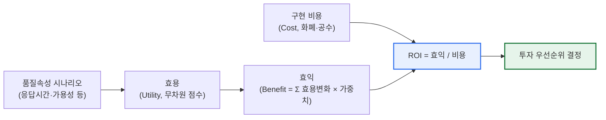
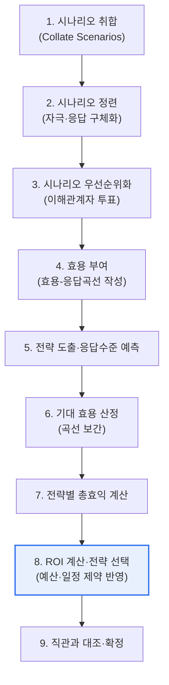

# CBAM(Cost Benefit Analysis Method)

## 1. 개요

### 가. 정의
> **CBAM(Cost Benefit Analysis Method)** 은 소프트웨어 아키텍처의 **품질 개선 전략(아키텍처 결정)이 만들어내는 효익(Benefit)과 그에 드는 비용(Cost)을 함께 정량화**하여, 투자 대비 효과(ROI)가 큰 아키텍처 결정을 우선적으로 채택하도록 돕는 **경제성 기반 아키텍처 평가 방법**이다. 미국 카네기멜론대학 SEI(Software Engineering Institute)가 ATAM을 경제적 관점으로 확장하여 정립하였다.

CBAM이 등장한 근본 배경은 '**아키텍처 결정은 곧 투자 결정**'이라는 인식의 전환이다. 성능을 높이기 위한 캐싱·인덱싱, 가용성을 높이기 위한 이중화·클러스터링, 보안을 높이기 위한 다중 방어 계층 같은 아키텍처 전략은 하나같이 구현 비용을 수반하며, 그 대가로 얻는 품질 향상의 폭도 서로 다르다. 문제는 예산과 일정이 언제나 유한하다는 점이다. 모든 품질 요구를 최고 수준으로 만족시킬 수는 없으므로, 아키텍트는 '**어느 전략에 먼저, 얼마를 투자할 것인가**'를 반드시 선택해야 한다. 그런데 기존의 대표적 아키텍처 평가 기법인 ATAM은 품질속성 사이의 트레이드오프(예: 가용성을 높이면 성능이 떨어진다)와 위험·민감점을 식별하는 데는 강점이 있지만, '얼마를 써서 얼마의 가치를 얻는가'라는 **경제적 정당화**는 다루지 못했다.

CBAM은 바로 이 공백을 메우기 위해 고안되었다. 각 아키텍처 전략이 이해관계자에게 주는 효용(Utility)을 정량화하고, 이해관계자별 중요도(가중치)를 반영해 전략의 총효익을 계산한 뒤, 이를 구현 비용과 대비하여 **ROI(효익÷비용)가 높은 전략부터 우선순위를 매긴다.** 즉 CBAM의 지향점은 "기술적으로 우아한" 아키텍처가 아니라 "경제적으로 현명한" 아키텍처 결정이며, 감(感)에 의존하던 아키텍처 투자 판단을 이해관계자가 합의할 수 있는 수치 기반 근거로 전환하는 데 그 본질적 가치가 있다.

### 나. 등장 배경과 필요성
소프트웨어 규모가 커지고 품질 요구(성능·가용성·보안·확장성·수정용이성 등)가 상충하는 상황이 일상화되면서, 한정된 개발 예산을 '어디에 먼저 쓸 것인가'라는 자원 배분 문제가 아키텍처 설계의 핵심 의사결정으로 부상했다. 이때 아키텍트가 부딪히는 어려움은 세 가지다. 첫째, 품질 향상의 '가치'가 눈에 보이지 않아 정당화하기 어렵다. 캐시를 도입해 응답시간이 2초에서 0.5초로 줄었을 때 그 가치가 얼마인지 명시적으로 답하기 힘들다. 둘째, 서로 다른 품질(성능 vs 보안)을 같은 잣대로 비교할 공통 단위가 없다. 셋째, 이해관계자마다 중시하는 품질이 달라(운영팀은 가용성, 마케팅은 응답속도) 합의가 어렵다.

CBAM은 '**효용(Utility)**'이라는 무차원 척도(예: 0~100점)를 도입해 이질적 품질을 하나의 기준으로 환산하고, 이해관계자 투표·가중치로 관점 차이를 명시적으로 통합하며, 최종적으로 화폐 단위의 비용과 대비해 ROI라는 단일 순위 기준을 산출함으로써 위 세 가지 어려움을 동시에 완화한다. 결국 CBAM이 필요한 이유는 '제한된 예산에서 가장 큰 가치를 만드는 품질 투자 순서를 이해관계자가 납득할 수 있는 방식으로 정하기 위함'으로 요약된다.

## 2. 핵심 개념 — 효용·효익·비용·ROI

CBAM을 제대로 이해하려면 네 가지 핵심 개념의 관계를 먼저 잡아야 한다. 이들은 CBAM의 계산 전체를 관통하는 뼈대다.

**첫째, 효용(Utility)** 은 어떤 품질속성의 특정 응답 수준(예: 응답시간 0.5초)이 이해관계자에게 주는 가치를 0~100 같은 무차원 점수로 나타낸 것이다. 효용이라는 무차원 척도를 도입하는 이유는, 초 단위의 응답시간과 퍼센트 단위의 가용성처럼 서로 다른 물리 단위를 가진 품질속성을 같은 잣대 위에 올려 비교하기 위해서다.

CBAM의 독창성은 이 효용을 **효용-응답곡선(Utility-Response Curve)** 으로 표현한다는 데 있다. 예를 들어 응답시간이 매우 빠른 구간(0.1초)에서는 효용이 거의 100에 수렴하고, 어느 지점을 넘어 느려지면(3초 이상) 효용이 급격히 0으로 떨어진다. 중요한 것은 이 곡선이 대개 직선이 아니라 S자 형태의 비선형이라는 점이다. 즉 이미 충분히 빠른 구간에서 더 빠르게 만드는 것은 체감 가치가 거의 없고(곡선이 평평), 사용자가 못 참는 임계 구간 근처에서의 개선이 체감 가치를 가장 크게 올린다(곡선이 가파름). 이 곡선의 기울기가 곧 '그 구간에서 품질을 조금 개선했을 때 체감 가치가 얼마나 커지는가'를 나타내므로, 곡선이 가파른 구간에 투자하는 것이 곡선이 평평한 구간에 투자하는 것보다 훨씬 이득이라는 통찰을 준다. 이는 CBAM이 '무조건 최고 성능'이 아니라 '가치가 급증하는 지점까지의 개선'을 지향하게 만드는 근거다.

**둘째, 효익(Benefit)** 은 어떤 아키텍처 전략을 적용했을 때 관련된 모든 시나리오에서 발생하는 효용 변화량(개선 후 효용 − 현재 효용)에 각 시나리오의 이해관계자 가중치를 곱해 합산한 값이다. 즉 하나의 전략이 여러 품질 시나리오에 동시에 영향을 줄 수 있으며(예: 로드밸런서 도입은 가용성과 성능에 모두 기여), 효익은 그 파급효과를 모두 더해 종합한다. 이때 어떤 전략이 다른 품질을 악화시키는 **부작용(Side Effect)** 도 음(−)의 효용 변화로 반영하여, 순(net) 효익을 계산하는 것이 원칙이다.

**셋째, 비용(Cost)** 은 그 전략을 구현·운영하는 데 드는 개발 공수·라이선스·인프라 비용의 추정치다. 여기에는 초기 구축비뿐 아니라 유지보수·운영비, 그리고 그 전략을 도입함으로써 추가로 발생하는 복잡도 관리 비용까지 포함하는 것이 원칙이다. 비용을 초기 구축비만으로 좁게 잡으면 이중화·마이크로서비스처럼 운영 부담이 큰 전략의 진짜 비용이 과소평가된다.

**넷째, ROI(Return on Investment)** 는 효익을 비용으로 나눈 값으로, '단위 비용당 만들어지는 가치'를 의미한다. CBAM은 이 ROI가 높은 전략부터 예산·일정 제약이 허용하는 한도까지 순서대로 채택할 것을 권고한다. 이렇게 함으로써 '적은 돈으로 큰 가치를 만드는' 전략이 자연스럽게 우선순위 상단에 오르게 된다. 다만 ROI 순위는 절대 규칙이 아니라 의사결정의 출발점이며, 전략 간 의존성(A를 해야 B가 가능)이나 위험 회피 같은 정성적 요인을 함께 고려해 최종 조정한다는 점을 유의해야 한다.

## 3. 평가 절차 (9단계)

CBAM은 SEI가 정의한 표준 절차를 따르며, 크게 '시나리오·효용 준비 → 전략별 효익·비용 산정 → ROI 기반 선택'의 흐름으로 진행된다. 실제로는 아래 9단계로 세분되며, 워크숍 형태로 이해관계자가 함께 참여해 수행한다.

**1~3단계(시나리오 준비)** 에서는 성능·가용성·보안 등 품질 요구를 '자극(Stimulus)–환경–응답(Response)' 형식의 구체적 시나리오로 표현하고 정련한 뒤, 이해관계자 투표를 통해 상위 시나리오(보통 전체의 3분의 1 정도)로 좁힌다. 이 우선순위화는 이후 모든 계산의 초점을 결정하므로, 조직의 비즈니스 목표와 직결된 시나리오가 상위에 오도록 하는 것이 중요하다. 이 단계는 ATAM의 시나리오 도출과 사실상 동일하여, 두 기법을 연계할 때 재사용된다.

**4단계(효용 부여)** 는 CBAM의 심장부다. 각 상위 시나리오에 대해 '최악–현재–바람직–최고'의 네 응답 수준을 정하고 각각에 효용 점수를 매겨 효용-응답곡선을 그린다. 예컨대 응답시간 시나리오라면 최악(4초)=0점, 현재(2초)=50점, 바람직(1초)=80점, 최고(0.3초)=100점 식으로 정한다. 이 곡선은 이해관계자의 체감 가치를 반영하므로 주관이 개입되지만, 여러 이해관계자의 값을 평균·조정해 합의를 만든다.

**5~7단계(효익 산정)** 에서는 각 시나리오를 개선할 후보 아키텍처 전략을 도출하고, 그 전략을 적용하면 응답이 어느 수준(예: 2초→1초)까지 좋아질지 예측한 뒤, 효용-응답곡선에서 보간(interpolation)하여 예상 효용을 읽는다. 개선 후 효용에서 현재 효용을 뺀 차이가 그 전략의 효용 이득이며, 여기에 시나리오 가중치를 곱하고, 하나의 전략이 영향을 주는 모든 시나리오에 대해 합산하면 전략의 총효익이 나온다.

**8~9단계(선택·검증)** 에서는 각 전략의 총효익을 구현 비용으로 나눠 ROI를 계산하고, 내림차순으로 정렬한 뒤 예산·일정 제약 내에서 상위 전략부터 선택한다. 마지막으로 도출된 우선순위가 전문가의 직관과 크게 어긋나지 않는지 대조하여, 곡선·비용 추정의 오류를 보정하고 결과를 확정한다.

### 계산 예시
구체적 수치로 보면 이해가 쉽다. 가령 '캐시 도입' 전략이 응답시간 시나리오(가중치 0.4)의 효용을 50→80(+30)으로 올리고 부작용으로 일관성 시나리오(가중치 0.2)의 효용을 70→60(−10)으로 낮춘다면, 순효익은 (30×0.4)+(−10×0.2)=12−2=10이다. 이 전략의 구현 비용이 2(단위)라면 ROI=10÷2=5.0이다. 한편 '서버 이중화' 전략이 총효익 12를 만들되 비용이 6이라면 ROI=2.0이다. 두 전략 중 효익의 절댓값은 이중화가 더 크지만, 단위 비용당 가치는 캐시가 우월하므로 CBAM은 예산이 빠듯할 때 캐시를 먼저 채택하도록 안내한다. 이처럼 '큰 효과'가 아니라 '비용 대비 효과'로 판단하게 만드는 것이 CBAM의 핵심 기여다.

참고로 5단계에서 후보로 흔히 거론되는 대표적 아키텍처 전략과 그것이 주로 겨냥하는 품질속성을 정리하면 다음과 같다. 실제 프로젝트에서는 이런 전략 카탈로그를 놓고 각각의 효익·비용을 산정해 ROI를 비교한다.

- **캐싱·인덱싱**: 성능(응답시간) 향상, 부작용으로 일관성·메모리 비용
- **로드밸런싱·클러스터링**: 가용성·성능 동시 향상, 부작용으로 운영 복잡도
- **이중화·재해복구(DR)**: 가용성·신뢰성 향상, 높은 인프라 비용
- **계층 분리·모듈화**: 수정용이성·시험용이성 향상, 초기 설계 공수 증가
- **다중 방어계층·암호화**: 보안 향상, 성능 저하 부작용

## 4. ATAM과의 관계 및 비교

CBAM은 독립적으로 쓰이기보다 ATAM과 짝을 이룰 때 가장 큰 위력을 발휘한다. ATAM이 '이 아키텍처가 품질 요구를 만족하는가, 어디에 위험·트레이드오프가 있는가'라는 **기술적 타당성**을 진단한다면, CBAM은 그 위에서 '식별된 개선 전략 중 무엇에 먼저 투자해야 가장 이득인가'라는 **경제적 타당성**을 판정한다. 실무에서는 ATAM으로 위험·민감점·트레이드오프를 먼저 도출하고, 거기서 나온 개선 후보들을 CBAM의 아키텍처 전략 입력으로 삼는 순차 연계가 표준적이다. 두 기법이 동일한 시나리오·품질속성 어휘를 공유하기 때문에 이 연계는 자연스럽다.

| 구분 | ATAM | CBAM |
|---|---|---|
| **핵심 질문** | 아키텍처가 품질 요구를 만족하는가 | 어떤 개선에 투자해야 이득인가 |
| **초점** | 품질속성 트레이드오프·위험 식별 | 비용 대비 효익(경제성) |
| **산출물** | 위험(Risk)·민감점·트레이드오프점·비위험 | 전략별 ROI·투자 우선순위 |
| **핵심 도구** | 품질속성 유틸리티 트리, 시나리오 | 효용-응답곡선, ROI |
| **관점** | 기술적 품질 평가 | 경제적 의사결정 |
| **관계** | 평가의 출발점 | ATAM의 경제적 확장·후속 단계 |

이 표에서 주목할 점은 두 기법이 경쟁 관계가 아니라 보완 관계라는 것이다. ATAM만 수행하면 '무엇이 문제인지'는 알아도 '한정된 예산에서 무엇부터 고쳐야 하는지'에 대한 답이 없어 개선이 표류할 수 있다. 반대로 CBAM만 수행하면 애초에 어떤 전략이 어떤 품질 위험에 대응하는지에 대한 기술적 근거가 빈약해진다. 따라서 기술사 관점에서는 두 기법을 '진단(ATAM)–처방 우선순위(CBAM)'의 연속된 과정으로 설계하는 것이 바람직하다.

## 5. 심화 — 실무 적용 사례와 예상 출제 방향

**실무 적용의 현실**을 보면, CBAM은 대규모 미션 크리티컬 시스템(금융 코어뱅킹, 통신 과금, 항공·국방 시스템)의 아키텍처 개선 투자 심의에서 개념적 틀로 활용된다. 예컨대 어느 금융기관이 노후 코어시스템 현대화 예산을 배분할 때, 응답시간 개선(캐시·읽기 전용 복제본), 가용성 향상(재해복구 이중화), 확장성 확보(마이크로서비스 전환)라는 세 갈래 투자안이 경쟁한다고 하자. 이때 각 투자안의 효익을 고객 이탈률·거래 처리량·장애 손실 비용 같은 비즈니스 지표로 환산하면, '가용성 이중화는 비용이 크지만 연간 예상 장애 손실을 크게 줄여 ROI가 높다'는 식의 근거 있는 순위가 나온다. 다만 실무에서는 효용-응답곡선을 정밀하게 작성하기보다, CBAM의 사고틀(효용·효익·비용·ROI로 분해해 비교)을 경량화해 적용하는 경우가 많다는 점도 함께 이해할 필요가 있다.

**최신 흐름**과 관련해서는, 클라우드 전환이 보편화되면서 아키텍처 전략의 비용이 CapEx(고정 투자)에서 OpEx(사용량 기반 운영비)로 이동하고, 오토스케일링·서버리스처럼 '쓴 만큼 내는' 구조가 늘어난 점이 CBAM의 비용 모델링에 영향을 준다. 또한 FinOps(클라우드 비용·가치 최적화)나 SLO·오류 예산(Error Budget) 기반 신뢰성 관리 같은 최신 운영 방법론은 '가용성·성능이라는 품질을 정량적 목표와 비용으로 다룬다'는 점에서 CBAM의 문제의식과 맞닿아 있어, 현대적 재해석·연계 대상으로 볼 수 있다.

**예상 출제 방향**으로는 ① CBAM의 절차와 핵심 개념(효용-응답곡선, ROI)을 설명하라, ② ATAM과 CBAM을 비교하고 연계 활용 방안을 논하라, ③ 특정 시나리오(비용·효익 수치 제시)에서 ROI를 계산해 투자 우선순위를 정하라 등이 대표적이다. 답안 작성 시에는 개념 나열에 그치지 말고 '왜 효익의 절댓값이 아니라 ROI로 판단하는가', '효용 정량화의 주관성을 어떻게 완화하는가' 같은 트레이드오프까지 서술하면 심화 점수를 얻기 유리하다.

## 6. 고려사항 및 시사점 (기술사 관점)

1. **효익 정량화의 주관성이 최대 난제다.** 가용성·성능 향상의 가치를 효용 점수·화폐로 환산하는 과정은 본질적으로 주관적이며, 누가 곡선을 그리느냐에 따라 결과가 달라진다. 따라서 이해관계자를 폭넓게 참여시켜 곡선과 가중치를 합의로 도출하고, 극단값에 결과가 민감하지 않은지 민감도 분석(sensitivity analysis)으로 검증하는 절차를 병행해야 신뢰성이 확보된다.

2. **ATAM과의 연계로 균형을 잡아야 한다.** CBAM을 단독으로 쓰면 경제성만 앞세워 기술적 위험을 놓칠 수 있다. ATAM으로 위험·트레이드오프를 먼저 식별한 뒤 CBAM으로 개선 전략의 경제성을 평가하는 순차 프로세스를 채택해, 기술적·경제적으로 모두 정당한 아키텍처 결정을 내리는 것이 바람직하다.

3. **부작용(음의 효익)을 반드시 반영해야 한다.** 하나의 전략은 한 품질을 높이면서 다른 품질을 떨어뜨리는 경우가 많다(캐시↔일관성, 이중화↔복잡도·비용). 부작용을 순효익 계산에 포함하지 않으면 특정 전략의 매력이 과대평가된다. 트레이드오프를 명시적으로 수치화하는 것이 CBAM을 형식적 계산이 아닌 실질적 의사결정 도구로 만든다.

4. **경량화·반복 적용을 지향해야 한다.** 완전한 9단계 CBAM은 워크숍·전문가 참여 비용이 커서 모든 프로젝트에 그대로 적용하기 어렵다. 초기에는 핵심 시나리오 소수에 대해 사고틀만 적용하는 경량 CBAM으로 시작하고, 아키텍처가 진화할 때마다 반복 수행해 우선순위를 갱신하는 애자일·점진적 적용이 현실적이다.

5. **비용 추정의 불확실성을 관리해야 한다.** ROI의 분모인 비용 추정이 부정확하면 순위 전체가 흔들린다. 특히 신기술 도입 전략은 비용 추정 오차가 크므로, 단일 추정치 대신 낙관·비관 범위를 두고 시나리오별 ROI를 비교하는 것이 안전하다.

6. **정량화가 어려운 전략을 배제하지 말아야 한다.** CBAM은 효익을 수치로 환산할 수 있는 전략에 유리하게 작동하므로, 보안 강화나 규제 준수처럼 가치를 숫자로 표현하기 어렵지만 반드시 필요한 전략이 우선순위에서 밀릴 위험이 있다. 이런 전략은 '필수 제약(must-have)'으로 별도 분류해 ROI 경쟁에서 제외하고 먼저 확보한 뒤, 나머지 선택적 전략에 대해 CBAM을 적용하는 방식으로 보완하는 것이 바람직하다. 즉 CBAM은 모든 결정을 대체하는 도구가 아니라, 선택 가능한 대안들 사이의 우선순위를 합리화하는 도구로 위치시켜야 한다.

## 참고자료
- SEI, "Making Architecture Design Decisions: An Economic Approach"(CMU/SEI Technical Report) — https://resources.sei.cmu.edu/
- L. Bass, P. Clements, R. Kazman, "Software Architecture in Practice"(CBAM/ATAM 장)

---

> **한 줄 요약**: CBAM은 *아키텍처 개선 전략의 효익(효용-응답곡선×가중치)과 비용을 정량화해 ROI 기반으로 투자 우선순위를 정하는* 경제성 평가 방법으로, ATAM의 경제적 확장으로서 부작용까지 반영한 순효익으로 한정된 예산의 합리적 배분을 지원하되 효익 정량화의 주관성 관리가 관건이다.
