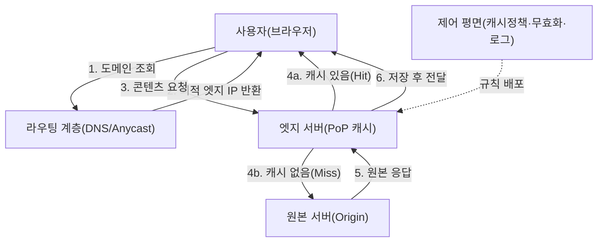
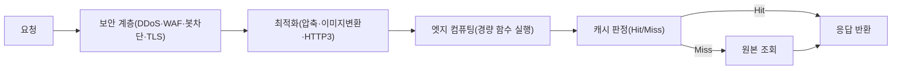

# 콘텐츠 전송 네트워크(CDN, Content Delivery Network)

## 1. 개요

### 가. 정의

> **CDN(Content Delivery Network)**이란 웹 콘텐츠(정적 파일·스트리밍·동적 응답)를 지리적으로 분산된 **엣지 서버(Edge/PoP)** 캐시에 미리 복제해 두고, 사용자를 네트워크적으로 가장 가까운 엣지로 유도함으로써 **지연시간(Latency)을 낮추고 원본 서버(Origin)의 부하를 분산**하는 분산 캐싱·전송 인프라이다.

CDN은 1998년 Akamai가 상용화한 이래 오늘날 웹 트래픽의 절대다수를 매개하는 기반 인프라가 되었다. 전 세계에 흩어진 수백~수천 개의 **PoP(Point of Presence)**에 콘텐츠 사본을 두고, 사용자의 요청을 최적 엣지로 라우팅한다. "콘텐츠를 사용자에게 가깝게 가져다 둔다(bring content closer to users)"는 단순한 원리로 응답 속도·가용성·확장성을 동시에 끌어올린다는 점이 핵심 가치다.

### 나. 등장 배경과 필요성

CDN이 필요한 근본 이유는 **물리 법칙과 원본 집중의 한계**에 있다. 서울 사용자가 미국 버지니아의 단일 서버에 접속하면 왕복 지연(RTT)만으로도 200ms 이상이 소요되며, 여기에 TCP 3-way handshake·TLS 협상까지 더해지면 첫 바이트 도착(TTFB)이 사용자 체감을 크게 해친다. 빛의 속도라는 물리적 한계상 거리 자체가 지연의 하한선을 만들기 때문에, **서버를 사용자 가까이로 분산 배치**하는 것 외에는 근본 해법이 없다.

또한 대규모 이벤트(온라인 티켓팅, 라이브 커머스, 소프트웨어 배포)에서 트래픽이 순간적으로 폭증하면 단일 원본 서버는 대역폭·커넥션 한계로 붕괴한다. 예컨대 수백 GB의 게임 업데이트를 수백만 명이 동시에 내려받으면 원본은 병목이 되지만, CDN은 이를 **수많은 엣지가 분담**해 처리한다. 실제로 넷플릭스는 자체 CDN(Open Connect)으로 저녁 피크 시간대 전 세계 인터넷 트래픽의 상당 부분을 소화하며, 이 규모를 단일 데이터센터로는 결코 감당할 수 없다. 이처럼 **지연 최소화·부하 분산·가용성 확보·비용 절감**이라는 네 가지 요구가 CDN의 필요성을 규정한다.

## 2. 전체 구조와 요청 처리 흐름

CDN은 크게 **원본 서버(Origin)**, 지역별 관문인 **엣지 서버(Edge/PoP)**, 요청을 최적 엣지로 보내는 **라우팅 계층(DNS/Anycast)**, 그리고 캐시 규칙·무효화를 관장하는 **제어 평면(Control Plane)**으로 구성된다. 사용자가 콘텐츠를 요청하면 먼저 라우팅 계층이 사용자 위치·엣지 부하·네트워크 상태를 종합해 담당 엣지를 결정하고, 해당 엣지는 캐시 보유 여부에 따라 즉시 응답(Hit)하거나 원본에서 받아와(Miss) 응답하면서 사본을 저장한다.

위 흐름에서 성능을 좌우하는 지표가 **캐시 적중률(Cache Hit Ratio)**이다. 적중률이 높을수록 원본까지 가는 왕복이 줄어 지연과 원본 부하가 함께 감소한다. 정적 리소스(이미지·CSS·JS·동영상 세그먼트)는 변하지 않아 적중률을 90% 이상으로 끌어올리기 쉽지만, 개인화된 동적 응답은 캐시가 어려워 별도 전략이 필요하다.

라우팅 방식은 크게 두 가지다. **DNS 기반 라우팅**은 CDN의 DNS가 사용자 리졸버 위치를 보고 가까운 엣지 IP를 응답하는 방식으로 유연하지만 DNS TTL·리졸버 위치 오차의 영향을 받는다. **Anycast 라우팅**은 여러 엣지가 동일 IP를 광고하고 BGP 라우팅이 가장 가까운 엣지로 패킷을 흘려보내는 방식으로, 장애 시 경로가 자동 재수렴해 DDoS 흡수에도 유리하다. 실무에서는 두 방식을 조합해 정확도와 회복력을 함께 확보한다.

## 3. 캐싱 전략과 콘텐츠 유형별 처리

캐싱의 핵심은 **무엇을, 얼마나 오래, 어떻게 갱신할 것인가**이다. 캐시 대상과 수명은 HTTP 헤더로 제어한다. `Cache-Control: max-age`로 신선도 기간을 정하고, `ETag`·`Last-Modified`로 조건부 요청(304 Not Modified)을 통해 변경 여부만 가볍게 확인한다. 콘텐츠 특성에 따라 캐시 난이도가 크게 달라지므로 유형별로 다른 전략을 적용해야 한다.

| 콘텐츠 유형 | 캐시 난이도 | 대표 전략 |
|---|---|---|
| 정적 자산(이미지·JS·CSS) | 낮음 | 긴 max-age + 파일명 해시(cache busting) |
| 대용량 미디어(VOD·다운로드) | 낮음 | 세그먼트 분할·부분 요청(Range) 캐싱 |
| 라이브 스트리밍 | 중간 | 짧은 TTL·HLS/DASH 세그먼트 캐싱 |
| 동적/개인화 응답 | 높음 | ESI·마이크로캐싱·엣지 컴퓨팅 |

정적 자산은 **파일명에 콘텐츠 해시를 넣는 캐시 버스팅**으로 사실상 영구 캐시(예: `max-age=31536000`)를 두되, 내용이 바뀌면 파일명이 달라져 자연히 새 파일을 받게 한다. 반면 동적 응답은 원본 로직을 거쳐야 해 캐시가 어렵지만, 초 단위 짧은 TTL을 두는 **마이크로캐싱(microcaching)**으로 순간 폭주하는 동일 요청을 흡수하거나, 페이지 조각만 캐시하는 **ESI(Edge Side Includes)**로 정적 부분과 동적 부분을 분리한다.

콘텐츠 갱신 시에는 캐시 **무효화(Invalidation)**가 중요하다. 즉시 반영이 필요하면 특정 URL·태그를 무효화하는 **Purge**를, 사용자에게 노출되기 전 미리 채워 첫 사용자의 Miss를 방지하려면 **Cache Warming(Prefetch)**을 사용한다. 무효화가 늦거나 누락되면 사용자가 낡은 콘텐츠를 보게 되므로, 배포 파이프라인(CI/CD)에 퍼지·워밍을 통합하는 것이 실무의 정석이다.

## 4. 부가 기능 — 보안·최적화·엣지 컴퓨팅

현대 CDN은 단순 캐시를 넘어 **통합 전송 플랫폼**으로 진화했다. 첫째, **보안 계층**으로서 엣지가 사용자와 원본 사이에 위치하는 구조를 활용해 **DDoS 방어**(대량 트래픽을 다수 엣지가 분산 흡수), **WAF**(SQL 인젝션·XSS 등 L7 공격 차단), **봇 관리**, **TLS 종단**을 수행한다. 원본 IP를 감추어 직접 공격 표면을 줄이는 효과도 크다. 둘째, **전송 최적화**로 이미지 포맷 변환(WebP/AVIF)·압축(Brotli/Gzip)·HTTP/2·HTTP/3(QUIC) 지원·커넥션 재사용을 통해 실제 전송량과 왕복 수를 줄인다.

셋째, 가장 주목할 진화는 **엣지 컴퓨팅(Edge Computing)**이다. 엣지에서 경량 함수(예: Cloudflare Workers, AWS Lambda@Edge)를 실행해 A/B 테스트 분기, 인증 토큰 검증, 개인화 헤더 삽입, API 응답 조립 같은 로직을 **원본까지 가지 않고 사용자 근처에서 처리**한다. 이로써 동적 콘텐츠조차 낮은 지연으로 제공할 수 있어, CDN은 정적 캐시 인프라에서 **분산 애플리케이션 실행 플랫폼**으로 확장되고 있다.

## 5. 유형 비교 — Pull vs Push, 상용 vs 자체 구축

CDN에 콘텐츠를 채우는 방식은 **Pull과 Push**로 나뉜다. Pull CDN은 첫 요청 시 원본에서 끌어와 캐시하는 **지연 로딩(lazy)** 방식으로, 운영이 단순하고 사용되지 않는 콘텐츠는 캐시하지 않아 효율적이지만 첫 사용자는 Miss 지연을 겪는다. Push CDN은 콘텐츠를 미리 엣지로 업로드해 두는 방식으로, 대용량·예측 가능한 배포(소프트웨어 릴리스, 이벤트 자산)에 적합하나 스토리지·동기화 관리 부담이 있다. 대부분 서비스는 **Pull을 기본으로 하고 중요한 자산만 사전 워밍**하는 혼합 전략을 쓴다.

| 구분 | Pull CDN | Push CDN |
|---|---|---|
| 캐시 시점 | 최초 요청 시(Miss 후) | 사전 업로드 |
| 운영 부담 | 낮음 | 높음(동기화 관리) |
| 첫 요청 지연 | 있음 | 없음 |
| 적합 사례 | 일반 웹·트래픽 예측 곤란 | 대용량 배포·이벤트 |

또한 **상용 CDN 이용과 자체 구축(사설 CDN)** 사이의 선택도 있다. 대부분 기업은 Akamai·Cloudflare·AWS CloudFront 등 상용 서비스를 이용해 글로벌 커버리지와 보안 기능을 즉시 확보한다. 반면 넷플릭스처럼 트래픽이 극단적으로 크고 특성이 명확한 사업자는 ISP 내부에 자체 캐시 서버(Open Connect Appliance)를 배치해 **비용과 품질을 직접 통제**한다. 트래픽 규모·글로벌 요구·보안 요건·비용 구조가 이 선택의 판단 기준이 된다.

## 6. 고려사항 및 시사점

CDN 도입은 성능·비용·보안·운영이 얽힌 **아키텍처 의사결정**이므로 기술사 관점에서 다음을 종합적으로 고려해야 한다.

- **적용 전략 — 콘텐츠 특성 기반 캐시 정책 설계**: 정적·동적·개인화 콘텐츠를 구분해 TTL·무효화 정책을 차등 설계하고, 캐시 적중률을 핵심 KPI로 상시 모니터링해야 한다. 무분별한 전체 캐시는 낡은 데이터 노출을, 과도한 no-cache는 CDN 효과 상실을 낳는다.
- **트레이드오프 — 신선도 vs 성능, 비용 vs 커버리지**: TTL을 늘리면 성능·비용은 좋아지지만 콘텐츠 신선도가 떨어지고, 반대는 그 역이다. 상용 CDN은 트래픽량(egress) 과금이므로 캐시 적중률이 곧 비용이며, 멀티 CDN은 회복력을 높이나 관리 복잡도와 비용을 키운다.
- **보안 — 원본 보호와 신뢰 경계**: 원본 IP 은닉, 원본-엣지 간 상호 TLS·화이트리스트로 엣지 우회 직접 공격을 차단하고, WAF·봇 관리·DDoS 방어를 계층적으로 구성해야 한다. 엣지 컴퓨팅 도입 시 엣지에서 실행되는 코드의 공급망·권한 관리도 함께 검토한다.
- **가용성 — 멀티 CDN과 장애 격리**: 단일 CDN 사업자 장애가 서비스 전면 중단으로 이어진 사례가 반복되므로, 다중 CDN 구성과 실시간 성능 기반 트래픽 스티어링, 원본 직결 폴백(failover) 경로를 마련해야 한다.
- **전망 — 엣지 네이티브와 지능형 전송**: CDN은 5G·IoT와 결합한 초저지연 엣지 컴퓨팅, AI 기반 예측 캐싱·트래픽 최적화, 서버리스 엣지 실행으로 진화하고 있다. 향후 애플리케이션 아키텍처는 원본 중심에서 **엣지-원본 분산 실행**으로 재편될 전망이며, CDN은 그 실행 기반이 된다.

---

> **한 줄 요약**: CDN은 지리적으로 분산된 엣지 캐시에 콘텐츠를 복제하고 사용자를 최적 엣지로 유도해 지연을 낮추고 원본 부하를 분산하는 인프라로, 오늘날 보안·최적화·엣지 컴퓨팅을 아우르는 분산 전송 플랫폼으로 진화하고 있다.
