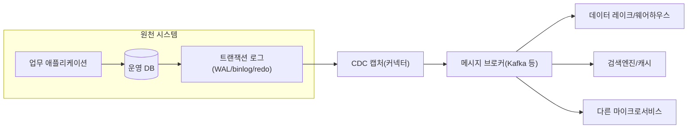
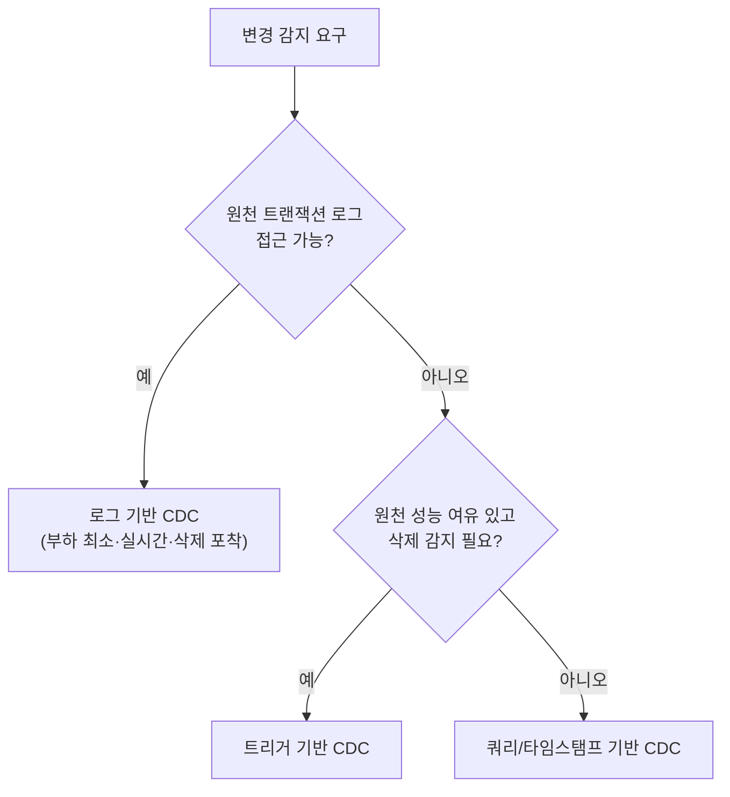

# 변경 데이터 캡처(CDC, Change Data Capture)

## 1. 개요

### 가. 정의

> **변경 데이터 캡처(CDC, Change Data Capture)**는 원천 데이터베이스에서 발생한 삽입·수정·삭제(INSERT/UPDATE/DELETE) 변경 사건을 **거의 실시간(near real-time)**으로 감지·추출하여, 하류 시스템(데이터 웨어하우스·레이크·검색엔진·캐시·마이크로서비스)으로 전파하는 데이터 통합 기법이다.

CDC의 핵심 발상은 "데이터 전체를 주기적으로 다시 읽는(full reload) 대신, **바뀐 것만(delta)** 흘려보낸다"는 것이다. 원천이 이미 남기고 있는 변경의 흔적 — 대표적으로 트랜잭션 로그(WAL, redo log, binlog) — 를 재활용하면, 원천 애플리케이션 코드를 수정하지 않고도 변경 사실을 순서대로 정확하게 포착할 수 있다. 이 때문에 CDC는 오늘날 실시간 분석, 마이크로서비스 간 데이터 동기화, 데이터 레이크하우스 적재(ingestion)의 사실상 표준 수단으로 자리 잡았다.

### 나. 등장 배경과 필요성

전통적인 데이터 연계는 야간 배치(nightly batch)로 이루어졌다. 매일 새벽 원천 테이블 전체를 추출하여 DW에 다시 적재하는 방식은 구현이 단순하지만 세 가지 근본 한계를 갖는다. 첫째, 데이터가 최대 하루까지 오래되어(staleness) 실시간 의사결정을 지원하지 못한다. 둘째, 수억 건 테이블을 매번 통째로 읽으면 원천 DB에 큰 부하를 주고 배치 시간이 폭증한다. 셋째, 전체 재적재 방식은 그 시점의 스냅샷만 남기므로 "언제 무엇이 어떻게 바뀌었는지"라는 **변경 이력**을 잃어버린다.

디지털 전환과 함께 사용자·규제·비즈니스는 점점 더 낮은 지연(latency)을 요구하게 되었다. 이상거래 탐지(FDS)는 초 단위로 최신 거래를 반영해야 하고, 추천·검색 엔진은 상품 정보 변경을 즉시 색인해야 하며, 마이크로서비스는 다른 서비스가 소유한 데이터의 변화를 알아야 한다. 이때 원천을 반복적으로 폴링(polling)하면 부하와 지연이 함께 커진다. CDC는 "변경이 발생한 순간, 변경분만" 밀어냄으로써 **지연·부하·이력 손실**이라는 세 문제를 동시에 완화한다.

또한 마이크로서비스 아키텍처(MSA)의 확산은 CDC의 필요성을 한층 키웠다. 서비스마다 DB를 독립적으로 소유하는 구조에서는 하나의 원천 변경을 여러 서비스가 알아야 하는 상황이 잦은데, 애플리케이션이 DB 쓰기와 메시지 발행을 각각 수행하면 **이중 쓰기(dual write)** 문제(하나만 성공하는 부분 실패)가 생긴다. CDC는 DB 커밋이라는 단일 사실을 원천으로 삼아 변경을 발행하므로, 이 정합성 문제를 구조적으로 해결하는 기반(트랜잭셔널 아웃박스 패턴)이 된다.

## 2. CDC 전체 구조와 데이터 흐름

CDC 파이프라인은 크게 **원천(Source) → 캡처(Capture) → 전송(Transport) → 적용(Sink)**의 네 단계로 이루어진다. 캡처 단계가 트랜잭션 로그나 트리거를 통해 변경 이벤트를 뽑아내면, 이를 메시지 브로커(예: Kafka)로 안정적으로 전달하고, 하류 커넥터가 목적지에 반영한다. 각 변경 이벤트는 보통 변경 전(before)·변경 후(after) 이미지, 연산 종류, 타임스탬프, 로그 위치(offset)를 포함한다.

위 구조에서 가장 중요한 설계 지점은 **캡처 단계가 원천에 얼마나 개입하는가**이다. 로그를 읽는 방식은 원천 DB에 거의 부하를 주지 않고 애플리케이션과 완전히 분리되지만, DB별 로그 포맷·권한·설정에 종속된다. 반면 트리거나 타임스탬프 컬럼 방식은 DB 종류에 덜 민감하지만 원천 스키마와 쓰기 경로에 개입하여 부하와 결합도를 높인다. 이 트레이드오프가 CDC 방식 선택의 핵심 기준이 된다.

또 하나의 필수 개념은 **초기 스냅샷(initial snapshot)**이다. CDC는 "지금부터의 변경"만 잡기 때문에, 하류에 과거 데이터가 없다면 먼저 원천 전체를 한 번 읽어 기준 상태를 만든 뒤, 그 시점 이후의 로그 변경을 이어붙여야 한다. 스냅샷 도중에도 원천은 계속 변경되므로, 스냅샷 지점의 로그 위치를 정확히 기록하고 그 이후 변경만 재생(replay)하는 일관성 처리가 중요하다.

## 3. CDC 구현 방식의 유형

CDC를 구현하는 방법은 변경을 어디서 어떻게 감지하느냐에 따라 크게 세 가지로 나뉜다. 각 방식은 원천 부하, 실시간성, 삭제 감지 능력, 원천 개입 정도에서 뚜렷한 차이를 보이며, 이 차이는 곧 적용 적합성을 결정한다.

**첫째, 로그 기반(Log-based) CDC**는 DB가 복구·복제를 위해 이미 기록하는 트랜잭션 로그를 파싱한다. PostgreSQL의 WAL(논리적 복제 슬롯), MySQL의 binlog(row 포맷), Oracle의 redo log가 그 대상이다. 원천 테이블을 직접 조회하지 않으므로 부하가 가장 낮고, 커밋 순서를 그대로 보존하며, 삭제·중간 변경까지 빠짐없이 포착한다. 다만 로그 포맷과 권한 설정에 의존하고 구현 난도가 높아, Debezium 같은 전용 프레임워크로 구현하는 것이 일반적이다. 실무 CDC의 사실상 표준 방식이다.

**둘째, 트리거 기반(Trigger-based) CDC**는 원천 테이블에 AFTER INSERT/UPDATE/DELETE 트리거를 걸어 변경 내역을 별도 이력 테이블(shadow table)에 기록한다. DB 종류에 관계없이 동작하고 변경 전후 값을 정밀하게 남길 수 있으나, 모든 쓰기 트랜잭션에 트리거 실행이 얹혀 원천 성능이 저하되고 스키마 관리 부담이 커진다.

**셋째, 쿼리/타임스탬프 기반(Query-based) CDC**는 `last_modified` 같은 컬럼을 두고 주기적으로 "직전 조회 이후 변경된 행"을 SELECT로 폴링한다. 구현이 가장 단순하지만 폴링 주기만큼 지연이 발생하고, 물리적으로 삭제된 행은 조회되지 않아 **삭제 감지가 불가능**하며(소프트 삭제 컬럼 필요), 폴링 자체가 원천 부하를 유발한다.

세 방식의 차이를 정리하면 다음과 같다. 표는 비교의 보조 수단이며, 실제 선택은 위에서 설명한 원천 개입 정도와 운영 제약을 함께 고려해야 한다.

| 구분 | 로그 기반 | 트리거 기반 | 쿼리/타임스탬프 기반 |
|------|-----------|-------------|----------------------|
| 원천 부하 | 매우 낮음 | 높음(쓰기마다 실행) | 중간(주기 폴링) |
| 실시간성 | 높음(초 이내) | 높음 | 낮음(폴링 주기 의존) |
| 삭제 감지 | 가능 | 가능 | 불가(소프트삭제 필요) |
| 원천 개입 | 없음(무침투) | 큼(스키마·트리거) | 중간(컬럼 추가) |
| 구현 난도 | 높음 | 중간 | 낮음 |

## 4. 핵심 기술 요소와 정합성 보장

CDC를 신뢰할 수 있는 파이프라인으로 만들려면 단순히 변경을 잡는 것을 넘어 **정확성(exactly-once에 준하는 처리)**을 설계해야 한다. 가장 중요한 요소는 **오프셋(offset) 관리**다. 캡처 커넥터는 어디까지 로그를 읽었는지를 지속적으로 저장하여, 장애 후 재기동 시 그 지점부터 이어 읽어 유실을 막는다. 반대로 재처리 시 같은 이벤트가 다시 발행될 수 있으므로, 하류는 기본 키 기반 **멱등(idempotent) upsert**로 중복을 흡수해야 한다. 즉 CDC는 통상 "at-least-once 전송 + 멱등 적용"의 조합으로 사실상 exactly-once 효과를 얻는다.

**순서 보장(ordering)**도 핵심이다. 같은 키(row)에 대한 변경은 반드시 발생 순서대로 적용되어야 하며, 그렇지 않으면 오래된 값이 새 값을 덮어쓰는 오류가 생긴다. Kafka를 쓸 경우 기본 키를 파티션 키로 지정하여 동일 키의 이벤트가 같은 파티션에서 순서를 유지하도록 한다.

**스키마 변경(schema evolution)** 대응 역시 실무의 난제다. 원천에 컬럼이 추가·삭제되면 이벤트 구조가 바뀌므로, 스키마 레지스트리로 버전을 관리하고 하위 호환 규칙(호환 가능한 진화)을 적용해 하류가 깨지지 않게 한다.

특히 MSA에서 CDC는 **트랜잭셔널 아웃박스(Transactional Outbox)** 패턴과 결합해 이중 쓰기 문제를 해결한다. 애플리케이션이 업무 데이터와 발행할 이벤트를 **하나의 로컬 트랜잭션**으로 같은 DB의 outbox 테이블에 함께 쓰면, CDC가 그 outbox 테이블의 로그 변경을 잡아 메시지로 발행한다. DB 커밋이 곧 이벤트 발행 근거이므로, "DB는 저장됐는데 메시지는 유실"되는 부분 실패가 원천적으로 사라진다.

## 5. 활용 사례와 유사 기법 비교

**활용 사례.** 실무에서 CDC는 첫째, 운영 DB의 변경을 데이터 레이크하우스로 흘려보내 실시간 대시보드·분석을 지원한다(예: 전자상거래에서 주문·재고 변경을 수 초 내 분석계에 반영). 둘째, 검색엔진·캐시 동기화 — 상품 정보 변경 시 Elasticsearch 색인과 Redis 캐시를 즉시 갱신한다. 셋째, 무중단 데이터 마이그레이션 — 신규 시스템으로 초기 스냅샷을 옮긴 뒤 CDC로 변경분을 계속 따라붙여 두 시스템을 동기 상태로 유지하다 전환 시점에 스위치오버한다. 한 글로벌 기술기업 사례에서는 야간 배치를 로그 기반 CDC로 대체하여 데이터 지연을 수 시간에서 수 초로 줄이고 원천 DB 부하를 크게 낮췄다고 보고된다(수치는 환경에 따라 달라질 수 있음).

**유사·연관 기법과의 비교.** CDC를 ETL 전체와 혼동하기 쉬우나, CDC는 ETL/ELT의 **추출(Extract) 단계를 실시간화**하는 기술로 보는 것이 정확하다. 배치 ETL이 "주기적·전체·고지연"이라면 CDC 기반 파이프라인은 "연속적·증분·저지연"이다. 또한 CDC는 **이벤트 소싱(Event Sourcing)**과 구분해야 한다. 이벤트 소싱은 애플리케이션이 처음부터 상태 변화를 이벤트로 설계·저장하는 아키텍처인 반면, CDC는 기존 상태 기반 DB에서 변경을 사후에 추출한다. 목적지가 상태(state)라는 점도 다르다.

| 관점 | 배치 ETL | 쿼리 폴링 | 로그 기반 CDC |
|------|----------|-----------|----------------|
| 지연 | 시간~일 | 분 | 초 |
| 원천 부하 | 높음(전체 스캔) | 중간 | 매우 낮음 |
| 이력 보존 | 스냅샷만 | 제한적 | 모든 변경 |
| 실시간 연계 | 부적합 | 부분 | 적합 |

## 6. 고려사항 및 시사점

CDC는 실시간 데이터 아키텍처의 핵심 요소이지만, 도입에는 기술사 관점의 전략적 판단이 필요하다.

- **정합성 vs 지연의 트레이드오프**: CDC는 대개 결과적 일관성을 전제한다. 하류가 원천을 따라잡기까지 미세한 지연(replication lag)이 존재하므로, 강한 일관성이 필요한 업무(예: 잔액 이중 검증)에는 부적합하다. 업무의 일관성 요구 수준을 먼저 정의하고 CDC 적용 범위를 정해야 한다.
- **원천 보호와 무침투 원칙**: 운영 DB는 최우선 보호 대상이다. 로그 기반 무침투(non-intrusive) 방식을 우선 검토하되, 로그 슬롯 미소비로 인한 디스크 증가·복제 슬롯 관리 등 원천 측 운영 리스크를 사전에 모니터링·경보 체계로 관리해야 한다.
- **운영 복잡도와 조직 역량**: CDC는 브로커·커넥터·스키마 레지스트리·오프셋 저장소 등 구성 요소가 많아 자체 구축 시 운영 부담이 크다. 관리형 서비스(클라우드 CDC/스트리밍)와 오픈소스 자체 구축 간 TCO와 종속성(lock-in)을 함께 저울질해야 하며, 장애 재처리·백필(backfill) 절차를 표준화해 두어야 한다.
- **거버넌스·보안·규제 대응**: 변경 이벤트에는 개인정보가 포함될 수 있으므로, 파이프라인 전 구간의 암호화·마스킹·접근통제와 함께 삭제 이벤트가 하류(레이크·캐시)까지 확실히 전파되도록 설계해 개인정보 파기 의무(잊힐 권리)를 충족해야 한다.
- **전망**: CDC는 데이터 메시·레이크하우스·실시간 피처 스토어의 표준 유입 경로로 확대되고 있으며, 스트리밍 처리와 결합해 "배치 없는(batch-less) 실시간 데이터 플랫폼"으로 진화 중이다. 향후에는 CDC를 통한 변경 스트림 자체를 데이터 제품(data product)으로 계약화·공유하는 방향이 강화될 것으로 전망된다.

---

> **한 줄 요약**: CDC는 원천 DB의 트랜잭션 로그 등에서 변경분만 실시간 추출해 하류로 전파하는 기법으로, 지연·부하·이력 손실을 줄이며 로그 기반(무침투) 방식과 멱등 upsert·순서 보장·아웃박스 패턴이 신뢰성의 핵심이다.
