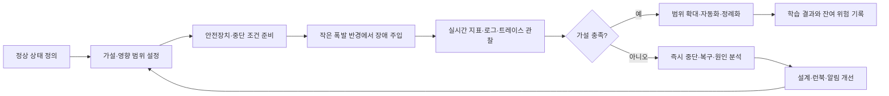
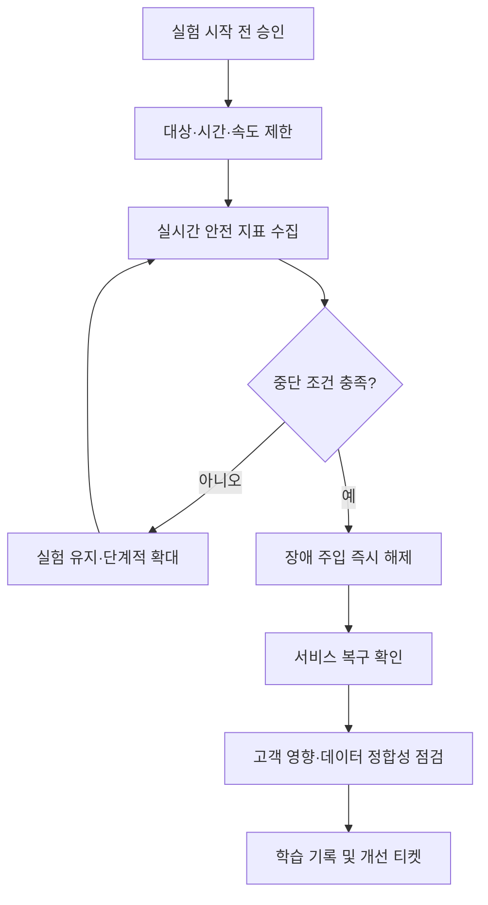

# 카오스 엔지니어링(Chaos Engineering) 기반 내결함성 검증

## 1. 개요

### 가. 정의

> **카오스 엔지니어링(Chaos Engineering)**은 정상 상태를 가설로 정의한 뒤, 통제된 실험으로 장애·지연·자원 고갈·의존성 단절을 주입하여 분산시스템의 내결함성과 복구 능력을 검증하고 개선하는 실험 기반 운영 기법이다.

카오스 엔지니어링은 장애를 일으키는 행위 자체가 목적이 아니다.
운영 환경에서 발생할 수 있는 불확실한 고장을 작은 범위와 제한된 위험 안에서 재현하여, 시스템이 어떤 조건에서 어떻게 무너지고 복구되는지 학습하는 것이 본질이다.
따라서 “무작위로 서버를 끈다”는 설명만으로는 충분하지 않다.
실험 전에는 정상 상태와 고객 영향의 기준을 정하고, 실험 중에는 중단 조건을 감시하며, 실험 후에는 관찰 결과를 설계 개선과 자동화된 회귀 검증으로 연결해야 한다.

현대의 서비스는 하나의 서버가 아니라 컨테이너, 오케스트레이터, 데이터베이스, 메시지 브로커, 외부 API, CDN, DNS, 인증 시스템이 연결된 분산 구조로 구성된다.
각 구성요소가 개별적으로 정상이어도 네트워크 지연, 재시도 폭증, 리더 선출 지연, 인증서 만료와 같은 상호작용 때문에 전체 사용자 여정이 실패할 수 있다.
문서 검토나 단위 테스트만으로는 이런 시간적·분산적 현상을 충분히 확인하기 어렵다.
카오스 실험은 “구성요소가 고장 나면 전체 서비스가 어떤 관측 신호를 보이며 어떤 안전장치가 작동하는가”를 실제 실행 경로에서 확인한다.

### 나. 등장 배경과 필요성

첫째, 가용성 목표와 실제 복구 능력 사이에는 차이가 있다.
설계서에 이중화가 있다고 적혀 있어도 장애 조치가 수동이거나, 보조 리전의 데이터가 오래되었거나, 운영자가 런북을 찾지 못하면 목표 복구시간을 달성할 수 없다.
카오스 실험은 설계 가정이 실행 가능한 통제와 절차로 구현되었는지를 검증한다.

둘째, 장애는 단일 원인보다 연쇄 반응으로 확대된다.
한 노드의 응답 지연이 타임아웃과 재시도를 유발하고, 재시도가 연결 풀과 스레드 풀을 소진시키며, 결국 정상 요청까지 실패시키는 식이다.
개별 컴포넌트의 성공 테스트만으로는 이 증폭 경로를 발견하기 어렵기 때문에 서비스 수준의 실험이 필요하다.

셋째, 클라우드와 자동화 환경은 자원을 빠르게 바꾸므로 과거의 수동 점검만으로 현재의 운영 상태를 보장하기 어렵다.
배포 파이프라인, 오토 스케일러, 서비스 메시, 정책 엔진이 변경될 때마다 장애 대응 경로도 달라질 수 있다.
작은 실험을 지속적으로 실행하면 설계의 회귀를 조기에 찾고, 복구 자동화가 실제로 작동하는지 확인할 수 있다.

넷째, 카오스 엔지니어링은 비난보다 학습을 우선하는 운영 문화를 요구한다.
실험 결과를 담당자의 실수로만 해석하면 장애를 숨기게 되고, 같은 구조적 결함이 반복된다.
관찰된 취약점을 시스템·프로세스·권한·문서·훈련의 개선 과제로 분해해야 실험이 신뢰성 향상으로 이어진다.

### 다. 기대 효과와 적용 범위

카오스 실험의 직접적인 효과는 장애 시나리오와 복구 절차의 검증이다.
간접적으로는 관측성 품질, 서비스 간 의존성 이해, 자동화된 완화책의 신뢰도, 팀 간 공통 언어를 개선한다.
예를 들어 데이터베이스 주 장애를 가정했을 때 애플리케이션의 연결 재시도, 읽기 전환, 알림, 운영자 승인, 데이터 정합성 검사가 순서대로 작동하는지를 한 번에 확인할 수 있다.

적용 범위는 인프라 장애에 한정되지 않는다.
네트워크 패킷 손실, 디스크 사용량 증가, CPU·메모리 압박, 인증 실패, 외부 결제 API 지연, 메시지 중복, 잘못된 구성 배포, 리전 단절, 개인정보 마스킹 오류까지 포함할 수 있다.
다만 실험의 위험이 실제 학습 가치보다 크거나, 영향 범위를 되돌릴 방법이 없는 영역은 사전 검증과 더 작은 격리 환경부터 시작해야 한다.

## 2. 핵심 개념과 실험 원리

### 가. 정상 상태와 가설

정상 상태(steady state)는 단순한 서버의 생존 여부가 아니라 사용자가 기대하는 서비스의 관찰 가능한 행동이다.
결제 API라면 성공 응답률, 승인 지연시간, 중복 승인 건수, 미처리 주문 수가 함께 정상 상태를 구성할 수 있다.
검색 서비스라면 결과 반환률과 p95 지연시간뿐 아니라 결과 품질 저하나 색인 지연도 중요한 신호가 된다.

가설은 “구성요소 X를 교란해도 사용자 여정 Y의 지표 Z가 허용 범위 안에 머물고, 자동 완화책 A가 T분 안에 작동한다”처럼 검증 가능하게 작성한다.
“시스템이 안정적일 것이다”는 측정 방법과 판정 기준이 없어 실험 가설이 아니다.
가설에는 대상 범위, 예상 영향, 관찰 지표, 시간 제한, 중단 조건, 성공·실패 판정, 사후 조치를 포함해야 한다.

예를 들어 “결제 워커 한 대를 중지해도 5분 동안 결제 성공률 99.5% 이상을 유지하고, 대기열 적체가 10분 내 기준선으로 돌아온다”라고 쓸 수 있다.
이렇게 작성하면 실험이 실패하더라도 무엇이 깨졌는지 구분할 수 있다.
또한 비즈니스 지표를 포함하므로 기술적 오류율이 낮아 보여도 실제 주문 손실이 발생한 상황을 놓치지 않는다.

### 나. 작은 폭발 반경과 점진적 확대

폭발 반경(blast radius)은 실험으로 영향을 받을 수 있는 사용자·리소스·트랜잭션의 범위다.
초기 실험은 개발·스테이징 환경, 테스트 테넌트, 한 개의 가용영역, 소수의 파드처럼 범위를 제한해야 한다.
실험 도구가 제공하는 필터가 정확하지 않거나 롤백이 느리면 대상을 더 작게 잡고 수동 승인 단계를 둔다.

작은 폭발 반경은 실험을 안전하게 만드는 충분조건이 아니다.
영향은 장애 주입 대상보다 상위 계층으로 전파될 수 있으므로, 의존성 그래프와 사용자 영향도를 함께 검토해야 한다.
예를 들어 내부 테스트 계정 하나에만 지연을 주입해도 공유된 연결 풀이나 공용 캐시를 고갈시키면 다른 고객이 영향을 받을 수 있다.
따라서 테넌트 격리, 속도 제한, 자원 예산, 관찰 전용 모드가 필요하다.

점진적 확대는 실험의 신뢰도를 높인다.
첫 단계에서 복구 자동화와 대시보드가 작동하면 대상 노드 수나 지연 크기를 조금씩 늘린다.
각 단계 사이에는 안정화 시간을 두고, 오류 예산 소진 속도와 사용자 신고를 확인한다.
실험이 성공했다고 바로 최대 규모로 확대하지 않고, 운영 변화가 누적된 뒤 동일 실험을 다시 수행해야 한다.

### 다. 실험 수명주기

첫 단계는 기준선 수집이다.
실험 직전의 트래픽, 오류율, 지연시간, 큐 길이, 자원 사용률, 주요 업무 KPI를 확보해야 장애 주입 전후를 비교할 수 있다.
기준선이 없으면 실험 중 변화가 자연 변동인지 장애 영향인지 판별하기 어렵다.

둘째 단계는 권한과 통제의 준비다.
실험 실행자, 승인자, 온콜 담당자, 비상 연락망, 중단 명령, 복구 절차를 사전에 정한다.
실험 도구에는 대상 선택 조건과 만료 시간을 설정하고, 자동으로 원상 복구되는지 확인한다.
운영 중인 시스템에 영구적인 설정 변경을 남기는 방식은 카오스 실험보다 위험한 수동 장애에 가깝다.

셋째 단계는 관찰과 판정이다.
메트릭만 보지 말고 로그의 오류 유형, 분산 추적의 병목 구간, 고객지원 문의, 업무 데이터의 정합성을 함께 확인한다.
특히 평균값은 꼬리 지연과 일부 고객의 실패를 숨길 수 있으므로 p95·p99, 실패한 사용자 비율, 핵심 트랜잭션 성공률을 병행한다.

넷째 단계는 학습의 제도화다.
실험 결과를 보고서로 남기는 것만으로 끝내지 않고, 결함 티켓·런북 수정·알림 조정·복구 자동화·아키텍처 개선으로 연결한다.
결함이 해결되었는지를 확인하는 재실험을 예약하고, 배포나 구성 변경 시 회귀 실험을 수행한다.

### 라. 장애 주입 유형

장애 주입은 대상 계층과 failure mode를 기준으로 분류한다.
컴퓨팅 자원 고갈은 CPU·메모리·디스크·파일 디스크립터 부족을 재현하고, 네트워크 장애는 지연·손실·중복·단절·대역폭 제한을 재현한다.
애플리케이션 계층에서는 오류 응답, 예외, 스레드 고갈, 잘못된 구성, 외부 API의 느린 응답을 실험할 수 있다.

데이터 계층의 실험은 특히 신중해야 한다.
읽기 전용 복제본 지연이나 커넥션 실패는 비교적 통제하기 쉽지만, 데이터 삭제·무작위 변경·트랜잭션 손상은 복구 가능성과 규제 영향을 먼저 입증해야 한다.
백업과 복원 검증이 끝나지 않은 상태에서 파괴적 실험을 운영 데이터에 적용하는 것은 학습보다 위험이 크다.

사람과 프로세스도 failure mode가 될 수 있다.
온콜 담당자의 부재, 잘못된 권한, 런북의 오래된 명령, 알림 폭주, 승인 지연을 모의하면 기술적 복구 능력과 조직적 대응 능력의 차이를 찾을 수 있다.
이런 게임데이(GameDay)는 실제 장애와 유사한 의사소통 흐름을 검증하지만, 참여자의 심리적 안전과 사후 비난 금지 원칙을 분명히 해야 한다.

| 유형 | 주입 예시 | 확인할 핵심 신호 | 대표 완화책 |
|---|---|---|---|
| 프로세스·노드 | 파드 종료, 인스턴스 중지 | 재배치 시간, 오류율, 용량 여유 | 다중화, 자동 복구, 용량 버퍼 |
| 네트워크 | 지연, 패킷 손실, DNS 실패 | p99 지연, 재시도율, 타임아웃 | 타임아웃, 백오프, 서킷 브레이커 |
| 자원 | CPU·메모리·디스크 압박 | 포화도, OOM, 큐 적체 | 제한·격리, 오토 스케일링, 백프레셔 |
| 의존성 | 외부 API 오류·지연 | 폴백률, 사용자 여정 성공률 | 폴백, 캐시, 격리, 공급자 다변화 |
| 데이터 | 복제 지연, 저장소 읽기 실패 | 정합성, 손실·중복, 복구시간 | 백업, 체크포인트, 재처리 |
| 조직·절차 | 온콜 부재, 런북 오류 | 탐지·승인·복구 리드타임 | 훈련, 권한 분리, 런북 자동화 |

표의 항목은 서로 독립된 목록이 아니라 연쇄 경로로 해석해야 한다.
네트워크 지연 하나가 타임아웃, 재시도, 연결 풀 고갈, 큐 적체를 차례로 만들 수 있다.
따라서 실험 설계자는 한 가지 장애를 주입하되, 어떤 2차 신호와 3차 신호가 나타날지를 가설에 포함해야 한다.

## 3. 아키텍처·운영 설계

### 가. 안전장치와 중단 조건

카오스 실험의 안전장치는 “실험을 시작할 수 있게 하는 장치”와 “실험을 멈추게 하는 장치”로 나뉜다.
전자는 승인된 대상만 선택하고 실행자의 권한을 제한하며, 후자는 고객 영향이 임계치를 넘을 때 자동으로 장애 주입을 해제한다.
두 종류가 모두 있어야 실험자가 상황을 낙관적으로 해석해 중단을 늦추는 위험을 줄일 수 있다.

중단 조건은 기술지표와 비즈니스지표를 함께 사용한다.
예를 들어 5분 연속 핵심 API 오류율 1% 초과, 결제 실패 금액 증가, 데이터 정합성 검증 실패, 오류 예산 소진 속도 급증, 고객 영향 테넌트 수 증가를 중단 조건으로 삼을 수 있다.
임계값은 정상 변동과 경보 피로를 고려하여 정하고, 실험 전에 자동화된 알림으로 검증한다.

권한 설계도 중요하다.
실험자가 프로덕션 전체를 중지할 수 있는 권한을 갖지 않도록 대상 라벨, 계정, 리전, 시간 범위를 제한한다.
중요 서비스에는 이중 승인을 두되, 자동 중단은 승인 없이도 작동하도록 한다.
권한과 로그는 감사 가능하게 보존하여 누가 언제 어떤 범위에 어떤 주입을 실행했는지 재구성할 수 있어야 한다.

### 나. 관측성과 판정 모델

관측성은 카오스 엔지니어링의 부속 기능이 아니라 실험의 측정 장치다.
메트릭은 서비스 수준의 결과와 자원 수준의 원인을 연결하고, 로그는 오류의 의미와 처리 경로를 제공하며, 트레이스는 분산 호출에서 지연이 전파되는 경로를 보여준다.
세 신호가 서로 다른 시간 기준을 사용하면 원인 분석이 어려우므로 공통 상관관계 ID와 시각 동기화가 필요하다.

관측 지표는 최소 네 계층으로 구성할 수 있다.
첫째는 고객 지표인 성공률·지연시간·이탈률·주문 완료율이다.
둘째는 서비스 지표인 요청률·오류율·포화도·큐 길이이며, 셋째는 자원 지표인 CPU·메모리·네트워크·스토리지다.
넷째는 복구 지표인 탐지시간(MTTD), 완화시간, 복구시간(MTTR), 재발률이다.
고객 지표만 보면 원인을 찾기 어렵고 자원 지표만 보면 실제 영향이 없는 소음을 장애로 판단할 수 있다.

판정은 실험 전 기준선과 비교해 정량화한다.
예를 들어 실험 전 30분의 p95 지연시간 중앙값을 기준으로 하고, 실험 중 2배 초과가 3분 지속되면 실패로 판정할 수 있다.
단일 임계값만 쓰면 순간적인 스파이크에 과민하거나 점진적 악화를 놓치므로 지속시간, 변화율, 영향 사용자 수를 함께 고려한다.

### 다. 분산시스템의 복구 패턴

타임아웃은 장애 전파를 막는 기본 장치지만, 너무 길면 사용자와 스레드를 오래 붙잡고 너무 짧으면 정상적인 일시 지연을 실패로 처리한다.
호출 체인의 전체 예산을 하위 호출에 배분하고, 재시도 횟수와 총 시간을 제한해야 한다.
재시도는 지수 백오프와 지터를 사용해 동시 재요청을 분산하며, 모든 오류에 재시도하지 않고 일시적 오류와 영구적 오류를 구별한다.

서킷 브레이커는 실패가 누적된 의존성으로의 호출을 잠시 차단해 호출자를 보호한다.
열림 상태에서 폴백이나 캐시를 사용하고, 반열림 상태에서 제한된 시험 호출로 회복 여부를 확인한다.
그러나 폴백 데이터가 오래되거나 업무적으로 부정확하면 시스템은 살아 있어도 잘못된 결과를 제공할 수 있으므로 신선도와 정확성도 지표로 포함해야 한다.

벌크헤드(bulkhead)는 자원 풀을 격리하여 한 의존성의 장애가 전체 서비스의 스레드·커넥션·큐를 소진시키지 않게 한다.
백프레셔는 처리 능력보다 빠른 입력을 제한하고, 우선순위 큐는 핵심 거래가 비핵심 작업에 밀리지 않게 한다.
이 패턴들은 개별적으로 도입하기보다 장애 전파 경로에 맞춰 조합해야 한다.

| 복구 패턴 | 해결하려는 문제 | 부작용 및 주의점 |
|---|---|---|
| 타임아웃 | 무한 대기와 자원 점유 | 너무 짧으면 정상 지연도 실패 처리 |
| 재시도·백오프 | 일시적 오류 회복 | 중복 요청·트래픽 폭증 가능 |
| 서킷 브레이커 | 장애 의존성으로의 연쇄 호출 | 폴백 품질·상태 전환 검증 필요 |
| 벌크헤드 | 공용 자원 고갈 | 풀 크기 산정과 우선순위 정책 필요 |
| 백프레셔 | 처리율 초과 입력 | 지연·거부 정책을 사용자에게 설명 필요 |
| 격리·폴백 | 부분 장애에서도 핵심 기능 유지 | 오래된 데이터와 기능 불일치 가능 |

### 라. 실험 자동화와 배포 연계

실험을 일회성 수동 작업으로 남기면 담당자의 기억과 환경에 의존하게 된다.
실험 정의를 코드나 선언형 파일로 관리하고, 대상·주입·시간·중단 조건·롤백을 버전 관리하면 코드 리뷰와 변경 이력 검토가 가능하다.
다만 자동화된 실험이 곧 무인 실행을 의미하지는 않으며, 위험 등급에 따라 승인과 실행 시간을 분리해야 한다.

배포 파이프라인에는 낮은 위험의 검증을 단계적으로 넣을 수 있다.
스테이징에서 네트워크 지연과 파드 종료를 반복하고, 카나리 배포에서 제한된 실험을 수행한 뒤, 운영 전체로 확대한다.
새로운 실험은 먼저 관찰 전용 모드로 실행하여 탐지와 중단 신호가 정상인지 확인한다.

실험 결과는 오류 예산과 연결할 수 있다.
실험이 고객 영향 임계치를 넘으면 변경 작업을 중단하고 안정화에 우선순위를 둔다.
반대로 위험이 통제되고 복구 능력이 입증되면 더 큰 변경을 허용할 수 있다.
오류 예산을 실험의 면죄부로 사용하지 않고, 학습을 위한 위험 한도와 의사결정 근거로 사용해야 한다.

## 4. 비교 및 사례

### 가. 전통적 장애 훈련과 카오스 엔지니어링 비교

전통적인 DR 모의훈련은 큰 장애 시나리오에 대한 조직의 전환·복구 절차를 확인하는 데 강하다.
반면 카오스 엔지니어링은 일상적인 작은 고장과 시스템의 자동 완화 능력을 반복적으로 검증하는 데 적합하다.
전자는 리전 전환과 비상 연락 체계처럼 큰 범위의 준비도를 확인하고, 후자는 개별 서비스의 타임아웃·재시도·격리와 같은 설계 품질을 확인한다.

두 접근은 대체 관계가 아니다.
DR 훈련만 하면 평상시의 부분 장애가 누적되는 경로를 놓칠 수 있고, 작은 카오스 실험만 하면 전사적 지휘체계와 장기 복구 역량을 검증하지 못한다.
따라서 평상시에는 자동화된 저위험 실험을 수행하고, 일정 주기에는 게임데이와 DR 전환 훈련을 결합하는 것이 바람직하다.

| 구분 | 전통적 장애 훈련 | 카오스 엔지니어링 |
|---|---|---|
| 주된 목적 | 비상 절차·전환·복구 준비도 확인 | 설계 가설·내결함성·자동 완화 검증 |
| 실행 주기 | 계획된 대규모 훈련 중심 | 작고 반복적인 실험 중심 |
| 대상 범위 | 조직·리전·핵심 시스템 | 서비스·의존성·자원·프로세스 |
| 핵심 산출물 | 복구 결과와 역할별 훈련 기록 | 가설 판정, 결함, 재실험 과제 |
| 성공 조건 | 목표 RTO·RPO 및 연락체계 달성 | 고객 영향 한도 내에서 관찰·복구 |

### 나. 사례 1: 메시지 소비자 장애

주문 이벤트를 처리하는 소비자 그룹 중 일부 인스턴스에 CPU 압박과 네트워크 지연을 주입한다고 가정한다.
가설은 “소비자 일부가 처리 불능이어도 파티션 재할당과 오토 스케일링이 작동하고, 주문 대기열이 15분 내 기준선으로 돌아오며, 중복 결제가 발생하지 않는다”로 정의한다.

실험자는 한 개의 테스트 파티션과 비핵심 테넌트부터 시작한다.
관찰 대상은 소비자 처리율, lag, 재처리 횟수, DLQ 유입량, 주문 완료율, 결제 중복 키다.
단순히 소비자 프로세스가 다시 살아났는지만 보면 메시지가 유실되었거나 중복 처리된 문제를 놓칠 수 있다.

실험 결과 lag는 증가했지만 재할당이 늦고, 재처리 과정에서 멱등 키가 누락된 것이 발견될 수 있다.
이 경우 결함은 “소비자 수를 늘리자”로 끝나지 않는다.
파티션 배치와 처리 타임아웃을 조정하고, 업무 이벤트에 멱등 키를 포함하며, 재처리와 DLQ 복구 런북을 자동화해야 한다.

### 다. 사례 2: 외부 결제 API 지연

외부 결제 승인 API가 10초 이상 응답하지 않는 상황을 제한된 테스트 거래에 주입한다.
결제 서비스의 타임아웃이 3초라면 사용자에게 실패를 반환할 수 있지만, 백그라운드 재조정이 늦게 승인된 거래를 중복 결제하지 않도록 상태 모델이 설계되어 있어야 한다.

실험에서는 API 게이트웨이, 결제 서비스, 주문 서비스, 알림 서비스의 타임아웃 예산과 상태 전이가 함께 관찰되어야 한다.
“승인 실패”와 “승인 결과 미확정”을 같은 상태로 처리하면 고객은 실패로 보았는데 실제로 돈이 빠져나가는 분쟁이 생길 수 있다.
따라서 미확정 상태를 별도로 두고 조회·취소·대사 절차를 제공하는 것이 중요하다.

이 사례의 성공은 단순히 결제 API가 복구된 뒤 정상 응답을 받는 데 있지 않다.
중복 요청 방지, 사용자 안내, 재대사, 감사 로그, 고객지원 조회까지 일관되게 작동해야 한다.
카오스 실험은 기술 장애를 업무 프로세스와 연결해 검증한다는 점에서 단순 부하 테스트와 다르다.

### 라. 사례 3: 리전 단절과 읽기 전환

다중 리전 서비스에서 주 리전의 네트워크 경로를 제한하고 보조 리전으로 읽기 트래픽을 전환하는 실험을 수행할 수 있다.
이때 DNS 전파시간, 세션 상태, 데이터 복제 지연, 쓰기 수용 정책, 보조 리전의 용량이 서로 영향을 준다.
단순한 DNS 변경 성공만으로는 사용자 요청이 올바른 데이터와 권한으로 처리되는지 확인할 수 없다.

실험 전에는 RPO와 RTO의 목표, 읽기 전용 전환 여부, 미복제 데이터 처리, 복구 후 재동기화 절차를 합의한다.
실험 중에는 신규 로그인, 장바구니, 결제, 관리자 기능처럼 상태 변경이 있는 여정을 따로 추적한다.
복구 후에는 양쪽 리전의 데이터 건수와 해시, 이벤트 순서, 미처리 작업을 검증한다.

이 실험은 인프라 이중화가 비즈니스 연속성을 자동으로 보장하지 않는다는 사실을 보여준다.
애플리케이션이 리전 장애를 인식하고 안전한 쓰기 정책을 적용해야 하며, 고객에게 기능 제한을 투명하게 안내해야 한다.
결과는 DR 설계, 데이터 복제 전략, 트래픽 정책, 업무 우선순위에 반영한다.

## 5. 심화: 카오스 엔지니어링과 SRE·MLOps의 연계

카오스 엔지니어링은 SRE의 가용성 목표와 오류 예산을 실행으로 검증하는 수단이 된다.
SLO가 “핵심 API의 99.9% 요청이 500ms 안에 성공”이라고 정의되어 있다면, 실험은 그 목표가 지연·노드 손실·의존성 오류에서도 유지되는지 확인해야 한다.
실험으로 오류 예산을 일부 사용했다면 배포 속도와 실험 범위를 조정하고, 예산이 부족할 때는 안정화 작업을 우선한다.

관측성 성숙도가 낮은 조직은 먼저 실험보다 측정 체계를 개선해야 한다.
핵심 사용자 여정, 서비스 의존성, 오류 분류, 지연시간 분위수, 데이터 정합성 지표가 정의되지 않았으면 실험 결과를 판정할 수 없다.
따라서 관측성 기준선과 런북을 마련한 뒤 저위험 실험으로 탐지·중단·복구 경로를 확인하는 순서가 안전하다.

MLOps에서도 모델과 데이터 파이프라인의 장애를 실험할 수 있다.
특징량 지연, 데이터 분포 변화, 추론 API 지연, 모델 저장소 단절, 잘못된 버전 승격을 제한된 트래픽에 주입하고, 품질 저하 감지와 자동 롤백을 확인한다.
모델의 정확도는 즉시 알 수 없으므로 지연시간·결측률·분포 변화·안전 필터 통과율을 조기 지표로 관리한다.

서비스 메시나 클라우드 네이티브 환경에서는 네트워크 정책과 트래픽 분할을 이용해 실험 대상을 세밀하게 격리할 수 있다.
그러나 도구가 제공하는 추상화가 실제 장애의 모든 면을 재현하지는 않는다.
실험 도구의 주입 지점, 커널·네트워크 계층, 복구 방식의 차이를 이해하고, 필요하면 애플리케이션 수준의 오류와 업무 데이터 검증을 별도로 설계해야 한다.

출제 답안에서는 정의만 쓰기보다 정상 상태, 가설, 폭발 반경, 안전장치, 장애 주입, 관찰 지표, 판정, 개선의 순서로 설명하면 논리적이다.
마지막에는 “장애를 일으키는 기술”이라는 오해를 피하고, 고객 영향 한도 안에서 복구 가능성을 검증하는 지속적 학습 체계라는 점을 강조한다.

## 6. 고려사항 및 시사점

### 가. 비즈니스 영향과 안전성 우선

카오스 실험의 범위는 기술적 중요도뿐 아니라 고객·재무·규제 영향으로 결정해야 한다.
결제·의료·안전 관련 기능은 동일한 장애라도 허용 가능한 영향이 작으므로 테스트 데이터와 격리된 경로에서 시작한다.
개인정보와 금융 거래를 포함하는 시스템에서는 장애 주입 로그와 결과에도 민감정보가 남지 않도록 마스킹과 접근 통제를 적용한다.

### 나. 실험 설계의 재현성과 가역성

실험은 언제든 중단하고 원상 복구할 수 있어야 한다.
대상 식별자, 시작·종료 시각, 주입 강도, 복구 명령, 버전, 관측 대시보드를 기록하여 다른 팀도 같은 조건에서 재현할 수 있게 한다.
수동 명령에만 의존하면 오타와 환경 차이로 결과가 달라지므로 선언형 설정과 자동 만료를 활용한다.

### 다. 관측성·데이터 정합성의 동시 검증

서비스가 200 응답을 반환했다고 해서 업무가 성공한 것은 아니다.
주문·결제·재고·권한과 같은 상태 변경 시스템에서는 중복·유실·순서 뒤바뀜·대사 불일치를 별도 검증해야 한다.
메트릭·로그·트레이스와 업무 데이터 검증을 결합하여 기술적 복구와 비즈니스 복구를 구분한다.

### 라. 조직문화와 책임 있는 학습

실험 결과가 담당자 평가나 처벌에 바로 연결되면 취약점이 보고되지 않는다.
실험 전 비난 없는 사후 검토 원칙을 합의하고, 개인의 실수보다 구조적 통제·권한·문서·자동화의 개선을 우선한다.
다만 고의적인 규정 위반과 승인 없는 실험은 학습 문화와 별개로 통제해야 한다.

### 마. 자동화 수준과 비용의 균형

모든 failure mode를 상시 운영에서 실험할 필요는 없다.
고객 영향, 발생 가능성, 탐지 난이도, 복구 비용을 기준으로 실험 우선순위를 정하고, 저위험 시나리오는 자동화하며 고위험 시나리오는 정기 게임데이로 운영한다.
실험 인프라와 모니터링 비용도 신뢰성 투자로 평가하되, 결과가 개선 티켓과 재실험으로 연결되는지 확인한다.

### 바. 아키텍처와 공급망 변화에 대한 회귀 검증

클라우드 리전, 라이브러리, 서비스 메시 정책, 외부 API, 모델 버전이 바뀌면 기존 실험의 가정이 달라진다.
배포 파이프라인에 핵심 실험을 회귀 검증으로 연결하고, 의존성 목록과 소유자를 최신 상태로 유지한다.
새로운 시스템을 도입할 때는 장애 주입 가능성, 관측성, 복구 자동화, 데이터 대사 방법을 비기능 요구사항으로 평가해야 한다.

## 참고자료

- Principles of Chaos Engineering: https://principlesofchaos.org/
- Google SRE Workbook, Embracing Risk: https://sre.google/workbook/embracing-risk/
- CNCF Chaos Engineering Landscape: https://landscape.cncf.io/guide#observability-and-analysis--chaos-engineering

---

> **한 줄 요약**: 카오스 엔지니어링은 통제된 장애 실험으로 분산시스템의 복구 가설을 검증하고, 관측·자동화·조직 학습을 통해 실제 내결함성을 지속적으로 높이는 방법이다.
