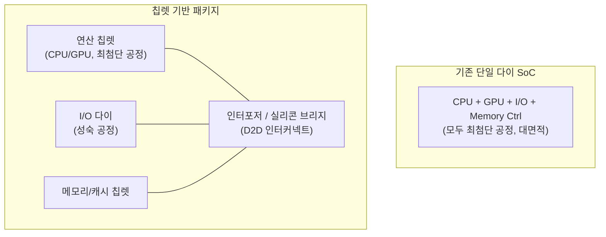
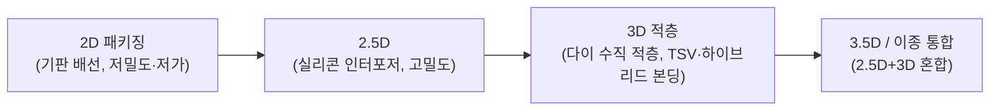

# 칩렛(Chiplet) 아키텍처와 이종집적

## 1. 개요

### 가. 정의
> **칩렛(Chiplet)** 은 하나의 거대한 단일 다이(Monolithic Die)로 칩을 만드는 대신, 기능·공정별로 잘게 나눈 여러 개의 작은 다이(Die)를 **하나의 패키지 안에서 고속 인터커넥트로 연결(이종집적, Heterogeneous Integration)** 하여 하나의 칩처럼 동작하게 만드는 반도체 설계·패키징 방식이다.

전통적인 SoC(System on Chip)는 CPU·GPU·메모리 컨트롤러·I/O 등 모든 블록을 **하나의 실리콘 다이에 최첨단 공정으로 통합**해 왔다. 그러나 미세공정이 3nm·2nm에 이르면서 이 방식은 물리적·경제적 한계에 부딪혔다. 칩렛은 "큰 칩 하나를 잘 만드는" 문제를 "작은 칩 여럿을 잘 이어붙이는" 문제로 바꾼다. 즉 연산 코어는 최첨단 공정으로, I/O나 아날로그처럼 미세화 이득이 적은 블록은 성숙(저렴)한 공정으로 각각 따로 만든 뒤 패키지에서 결합함으로써, **성능·수율·비용·설계 유연성**을 동시에 잡으려는 접근이다. AMD의 EPYC/Ryzen, 인텔의 Meteor Lake, 애플의 M1 Ultra, 엔비디아의 데이터센터 GPU가 대표적 상용 사례다.

### 나. 등장 배경 및 필요성
칩렛이 부상한 배경에는 세 가지 압력이 겹쳐 있다. 첫째는 **무어의 법칙 둔화와 미세공정 비용 급등**이다. 최신 노드일수록 팹 투자와 마스크 비용이 기하급수적으로 늘어, 모든 블록을 최첨단 공정에 담는 것은 경제적으로 비합리적이 되었다. 둘째는 **수율(Yield) 문제**다. 다이 면적이 커질수록 웨이퍼 위 결함 하나에 통째로 버려질 확률이 커져 수율이 급락한다. 큰 다이 하나를 여러 작은 다이로 쪼개면, 결함이 있는 다이만 버리고 정상 다이만 골라 쓸 수 있어 **실효 수율이 크게 오른다**. 예컨대 동일 결함밀도에서 800㎟ 단일 다이의 수율이 수십 %대라면, 이를 4개의 200㎟ 칩렛으로 나누면 개별 수율이 훨씬 높아지고 양품 조합 확률도 개선된다. 셋째는 **레티클 한계(Reticle Limit)** 로, 노광 장비가 한 번에 찍을 수 있는 면적(약 858㎟)을 넘는 초대형 칩은 애초에 단일 다이로 만들 수 없어 여러 다이의 결합이 불가피하다. 이러한 압력이 맞물리며 칩렛은 선택이 아니라 대세가 되었다.

## 2. 아키텍처 구조와 구성 요소

칩렛 기반 시스템은 서로 다른 공정·기능의 다이들을 **패키지 내부의 고속 배선(인터포저·브리지)** 으로 잇고, 이를 **표준 다이-투-다이(D2D) 인터페이스**로 통신시킨다. 아래 구조도는 단일 다이 SoC와 칩렛 기반 구조의 차이를 보여준다.

각 요소를 원리 중심으로 살펴본다. **연산 칩렛(Compute Die/CCD)** 은 성능이 곧 미세화 이득으로 직결되는 부분으로, 가장 앞선 공정(예: 5nm·3nm)으로 제작해 트랜지스터 밀도와 전력효율을 극대화한다. **I/O 다이(IOD)** 는 PCIe·메모리 컨트롤러·USB 등 아날로그·인터페이스 블록으로, 미세화해도 성능 이득이 작고 오히려 설계 난도만 커지므로 **성숙한 저가 공정(예: 6nm·12nm)** 에 남겨 비용을 낮춘다. 이 "공정 분리(Process Split)"가 칩렛 경제성의 핵심이다. **인터포저(Interposer)** 는 칩렛들을 얹고 그 아래에서 미세 배선으로 상호 연결하는 기판으로, 실리콘 인터포저(2.5D)는 수천~수만 개의 마이크로 범프로 초고밀도 배선을 제공한다.

### 가. 상호연결 인터페이스 — UCIe 표준
칩렛이 진정한 생태계가 되려면 **서로 다른 회사의 칩렛을 한 패키지에 섞어 쓸 수 있어야** 하며, 이를 위한 표준 인터페이스가 필수다. 과거에는 AMD의 Infinity Fabric처럼 벤더별 독자 인터커넥트가 각자 존재해 상호운용이 불가능했다. 이를 표준화한 것이 **UCIe(Universal Chiplet Interconnect Express)** 로, 인텔·AMD·ARM·TSMC·삼성 등이 참여한 개방형 D2D 표준이다. UCIe는 물리계층(범프 피치·전기 규격), 프로토콜 계층(PCIe·CXL 매핑), 소프트웨어 스택을 규정해 **이종 벤더 칩렛의 플러그앤플레이**를 지향한다. 이는 마치 보드 위에서 PCIe로 장치를 꽂듯, 패키지 안에서 칩렛을 표준 규격으로 조합하려는 시도다.

## 3. 집적(패키징) 방식과 유형

칩렛을 물리적으로 잇는 방식은 배선 밀도와 비용에 따라 여러 층위로 나뉜다. 아래는 대표적 집적 방식의 진화를 나타낸 것이다.

**2D 방식**은 기판(Substrate) 위에 칩렛을 나란히 놓고 기판 배선으로 잇는 가장 단순·저렴한 방식이지만 배선 밀도가 낮아 대역폭이 제한된다. **2.5D 방식**은 칩렛들 아래에 **실리콘 인터포저**를 깔아 초미세 배선으로 잇는 방식으로, TSMC의 **CoWoS(Chip on Wafer on Substrate)** 가 대표적이며 HBM과 GPU를 한 패키지에 통합하는 AI 가속기(엔비디아 H100/H200 등)에 널리 쓰인다. **3D 적층**은 다이를 **수직으로 쌓고 TSV(Through-Silicon Via, 실리콘 관통전극)** 또는 **하이브리드 본딩(Hybrid Bonding)** 으로 직결하는 방식으로, 배선 길이를 극단적으로 줄여 대역폭·전력효율을 높인다. AMD의 3D V-Cache(연산 다이 위에 캐시 다이 적층)가 상용 사례다. 하이브리드 본딩은 범프 없이 구리-구리를 직접 접합해 마이크로미터 이하 피치를 구현, 차세대 3D 집적의 핵심 기술로 부상하고 있다.

| 방식 | 배선 밀도 | 대역폭 | 비용 | 대표 기술·사례 |
|---|---|---|---|---|
| 2D | 낮음 | 낮음 | 저가 | 유기 기판 MCM |
| 2.5D | 높음 | 높음 | 중~고 | CoWoS, EMIB, HBM 통합 |
| 3D 적층 | 매우 높음 | 매우 높음 | 고가 | 3D V-Cache, TSV·하이브리드 본딩 |

인텔의 **EMIB(Embedded Multi-die Interconnect Bridge)** 는 대형 인터포저 전체를 까는 대신, 다이가 맞닿는 부분에만 작은 실리콘 브리지를 심어 2.5D급 고밀도 연결을 더 낮은 비용으로 구현한 절충안으로, 인터포저 방식의 비용 부담을 줄이려는 대표적 접근이다.

## 4. 비교 및 트레이드오프

칩렛은 만능이 아니며, 단일 다이 대비 명확한 득실이 있다. 단일 다이 SoC는 모든 블록이 한 실리콘에 있어 **블록 간 통신 지연이 극히 짧고 전력 오버헤드가 없다**는 강점이 있다. 반면 칩렛은 다이 경계를 넘는 D2D 통신에서 **추가 지연과 전력(범프·배선 구동 비용)** 이 발생한다. 즉 칩렛의 경제성·수율 이득은 **인터커넥트 오버헤드라는 대가**와 맞바꾼 것이다. 이 때문에 지연에 극도로 민감한 소형 모바일 칩은 여전히 단일 다이가 유리한 반면, 대면적·고성능 서버/AI 칩에서는 수율·비용 이득이 오버헤드를 압도해 칩렛이 사실상 표준이 되었다.

또한 칩렛은 **설계·검증 복잡도**를 높인다. 여러 다이의 전력·열·신호 무결성을 패키지 수준에서 함께 검증해야 하고, **알려진 양품 다이(KGD, Known Good Die)** 를 사전 선별하지 못하면 조립 후 불량으로 값비싼 패키지 전체를 버리게 된다. 열 관리도 과제인데, 3D 적층 시 위·아래 다이의 발열이 겹쳐 국부 과열이 발생하기 쉬워 방열 설계가 까다롭다. 이처럼 칩렛은 "블록을 나눠 얻는 이득"과 "다시 이어붙이며 치르는 비용"의 균형점을 찾는 설계라 할 수 있다.

## 5. 심화 — 산업 동향과 AI 반도체 연계

칩렛은 특히 **AI 반도체와 HBM 통합**에서 핵심 인프라가 되었다. 엔비디아·AMD의 데이터센터 GPU는 연산 다이 주변에 여러 개의 HBM 스택을 2.5D(CoWoS)로 통합해 초고대역폭을 확보하는데, 이는 칩렛·이종집적 없이는 불가능한 구조다. TSMC의 CoWoS 생산능력이 AI 가속기 공급의 병목으로 지목될 만큼, 칩렛 패키징은 AI 시대 반도체 공급망의 전략 자산이 되었다. 표준 측면에서는 UCIe가 1.0(2022) 이후 지속 개정되며 대역폭·범프 밀도를 높이고 있어, 향후 **멀티벤더 칩렛 마켓플레이스**(서로 다른 회사의 연산·메모리·I/O 칩렛을 조합해 맞춤형 칩을 구성)의 토대가 될 전망이다. 국내에서도 삼성전자·SK하이닉스가 HBM과 첨단 패키징(I-Cube·X-Cube 등)에 대규모 투자를 진행 중이며, 이는 메모리-로직 이종집적 경쟁의 핵심 축으로 부상하고 있다. (구체적 로드맵·용량 수치는 각 사 발표에 따라 변동될 수 있으므로 최신 공시를 확인할 필요가 있다.)

## 6. 고려사항 및 시사점

기술사 관점에서 칩렛 도입·평가는 다음을 종합적으로 판단해야 한다.

- **적용 전략(공정 분리 최적화)**: 미세화 이득이 큰 연산 블록은 최첨단 공정, 이득이 작은 I/O·아날로그는 성숙 공정으로 분리 배치하는 것이 원칙이다. 전면 칩렛화가 아니라 블록별 비용-성능 민감도에 따라 분할 경계를 설계하는 것이 핵심 역량이다.
- **표준·생태계 종속성**: 독자 인터커넥트는 성능 최적화에 유리하나 벤더 종속을 낳는다. 장기적으로는 **UCIe 등 개방형 표준** 채택이 공급망 유연성·멀티소싱에 유리하므로, 표준 성숙도와 자사 요구 성능 간 트레이드오프를 저울질해야 한다.
- **수율-오버헤드 손익분기**: 다이 분할이 수율·비용을 개선하지만 D2D 지연·전력과 패키징 비용을 수반하므로, **다이 면적·목표 성능·생산 규모**에 따른 손익분기 분석이 선행되어야 한다. 대면적·대량 생산일수록 칩렛이 유리하다.
- **KGD·열·검증 관리**: 조립 후 불량으로 인한 손실을 막기 위해 KGD 선별 테스트 체계를 갖추고, 3D 적층 시 열·전력·신호 무결성을 패키지 수준에서 통합 검증하는 설계·테스트 프로세스를 확보해야 한다.
- **전망(컴포저블 하드웨어)**: 칩렛은 CXL 기반 메모리 분리, 이종 가속기 통합과 결합되며 **모듈을 조합해 시스템을 구성하는 컴포저블 인프라**의 하드웨어적 토대로 확장될 전망이다. 반도체 설계 역량이 "큰 칩 설계"에서 "이종 칩렛 통합·패키징 설계"로 이동하고 있음을 전략적으로 인식할 필요가 있다.

## 참고자료
- UCIe Consortium, "Universal Chiplet Interconnect Express (UCIe) Specification", https://www.uciexpress.org/
- TSMC, "3DFabric: Advanced Packaging Technology (CoWoS, SoIC)", https://3dfabric.tsmc.com/

---
> **한 줄 요약**: 칩렛은 거대한 단일 다이 대신 기능·공정별로 나눈 작은 다이들을 UCIe 등 표준 D2D 인터커넥트와 2.5D/3D 패키징으로 한 패키지에 이종집적하여, 미세공정 비용·수율·레티클 한계를 극복하고 AI 반도체·HBM 통합의 토대를 이루는 설계 방식이다.
