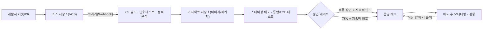
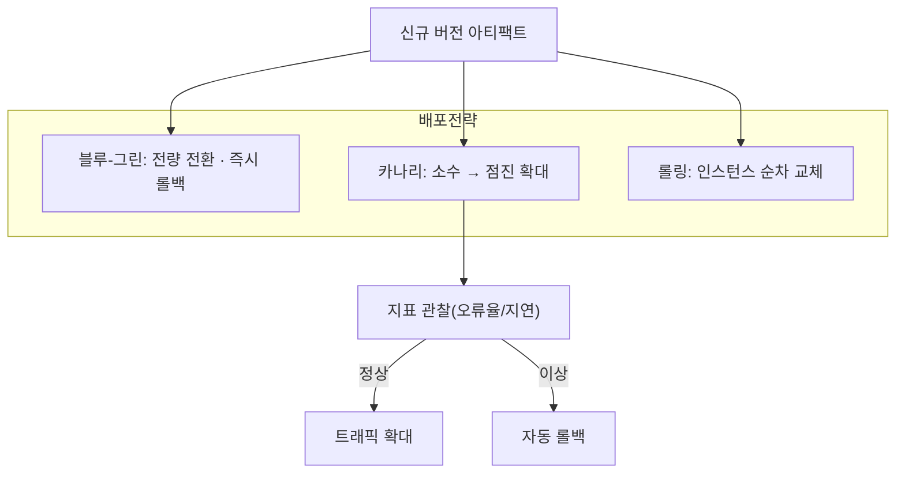

# CI/CD 파이프라인(지속적 통합·지속적 배포)

## 1. 개요

> **CI/CD 파이프라인**이란 소스코드의 변경이 저장소에 반영되는 순간부터 빌드·테스트·통합·릴리스·배포에 이르는 일련의 소프트웨어 인도(delivery) 과정을 자동화된 단계(stage)의 연쇄로 정의하고, 이를 반복 가능하고 관측 가능하게 실행하는 공학적 체계이다. CI(Continuous Integration, 지속적 통합)는 "코드를 자주, 작게 통합하고 즉시 검증"하는 활동을, CD(Continuous Delivery/Deployment, 지속적 인도/배포)는 "검증된 산출물을 언제든, 혹은 자동으로 운영에 반영"하는 활동을 가리킨다.

CI/CD가 등장한 배경은 전통적 통합 방식의 실패에서 찾을 수 있다. 과거에는 개발자들이 각자 몇 주에서 몇 달간 독립적으로 작업한 뒤 릴리스 직전에 한꺼번에 코드를 합쳤다. 이 방식은 이른바 **통합 지옥(Integration Hell)**을 낳았다. 오랫동안 분기된 코드가 서로 충돌하고, 숨어 있던 결함이 릴리스 막바지에 폭증하며, 누구의 변경이 문제를 일으켰는지 특정하기 어려워 릴리스 일정이 통째로 무너지는 일이 반복되었다. 결함은 유입 시점에서 멀어질수록 수정 비용이 기하급수적으로 커진다는 것은 소프트웨어 공학의 오래된 경험칙인데, 늦은 통합은 바로 이 비용 곡선의 가장 나쁜 지점에서 결함을 드러냈다.

또 하나의 배경은 릴리스 주기 단축 압력이다. 클라우드·SaaS·모바일 환경에서 경쟁 우위는 "얼마나 빨리, 얼마나 자주, 얼마나 안전하게" 변경을 사용자에게 전달하는가에 좌우된다. DORA(DevOps Research and Assessment)의 연구는 배포 빈도, 변경 리드타임, 변경 실패율, 서비스 복원 시간(MTTR)의 네 지표로 조직의 인도 성능을 측정하는데, 상위 성과 조직은 하루에도 여러 번 배포하면서 동시에 실패율은 더 낮다. 이 "속도와 안정성의 동시 달성"을 가능케 하는 핵심 엔진이 바로 자동화된 CI/CD 파이프라인이다.

### 가. CI/CD가 해결하는 핵심 문제와 가치

CI/CD의 가치는 세 축으로 정리된다. 첫째는 **결함의 조기 발견(Fast Feedback)**이다. 커밋마다 빌드와 테스트를 자동 실행하므로, 결함이 유입된 직후 수 분 내에 저자에게 피드백이 돌아간다. 문맥이 아직 개발자의 머릿속에 남아 있을 때 고치므로 수정 비용이 최소화된다. 실제로 어떤 조직은 CI 도입 후 통합 단계에서 발견되던 결함의 상당수를 커밋 시점으로 앞당겨, 릴리스 직전 결함 급증 현상을 크게 완화했다.

둘째는 **반복 가능성과 재현성(Repeatability)**이다. 배포가 사람의 수작업 체크리스트에 의존하면 절차 누락·환경 편차로 인한 "내 PC에선 되는데" 문제가 상존한다. 파이프라인은 동일한 스크립트와 동일한 환경 정의(IaC, 컨테이너 이미지)로 매번 같은 방식으로 산출물을 만들고 배포하므로, 인적 오류를 제거하고 감사 추적성을 제공한다.

셋째는 **릴리스 위험의 분산(Small Batch)**이다. 큰 변경을 가끔 배포하면 실패 시 영향 범위가 크고 원인 격리가 어렵다. 작은 변경을 자주 배포하면 각 배포의 위험이 작고, 문제 발생 시 직전 변경으로 원인을 좁히기 쉬우며 롤백도 간단하다. 이는 "작은 배치가 곧 낮은 위험"이라는 린(Lean) 원리의 소프트웨어적 구현이다.

이 세 가치를 관통하는 공통 특징은 **자동화·표준화·되먹임**이다. 사람이 반복하던 절차를 스크립트로 자동화하고, 환경과 산출물을 표준화해 편차를 없애며, 각 단계의 결과를 즉시 상류로 되먹여 다음 행동을 유도한다. 이 세 특징이 결합될 때 파이프라인은 단순한 배포 자동화 도구를 넘어, 조직의 소프트웨어 인도 능력을 지속적으로 개선하는 학습 시스템으로 기능한다.

## 2. CI/CD 파이프라인의 전체 구조

파이프라인은 소스 저장소(VCS)를 시작점으로 하여, 트리거·빌드·테스트·아티팩트 저장·배포·검증의 단계가 방향성 있게 연결된 구조다. 각 단계는 앞 단계의 산출물을 입력으로 받아 통과(pass)·실패(fail)를 판정하고, 실패 시 파이프라인을 중단(fail-fast)시켜 결함이 하류로 전파되는 것을 막는다.

위 구조에서 주목할 점은 **단계별 게이트(Quality Gate)**의 존재다. 각 단계는 통과 기준(테스트 성공률, 커버리지 임계치, 보안 스캔 무결점 등)을 만족해야 다음 단계로 진행하며, 이 기준이 곧 품질의 최소 보증선 역할을 한다. 또한 마지막의 모니터링 단계는 배포로 끝나는 것이 아니라, 운영 지표(오류율·지연·자원)를 관찰해 이상 시 자동 롤백으로 되먹임하는 폐루프(closed loop)를 형성한다. 이 되먹임이 없으면 자동 배포는 오히려 장애를 빠르게 전파하는 위험 요소가 된다.

### 가. CI(지속적 통합) 단계의 원리

CI의 본질은 "통합을 미루지 않는다"는 규율이다. 개발자는 최소한 하루 한 번 이상 자신의 변경을 주 브랜치(main/trunk)에 병합하고, 그때마다 자동화된 빌드와 테스트가 실행된다. 이때 핵심은 **주 브랜치를 항상 배포 가능한 상태로 유지(Keeping the build green)**하는 것이다. 빌드가 깨지면 그것을 고치는 일이 팀의 최우선 과제가 되며, 깨진 상태 위에 새 변경을 쌓지 않는다.

CI가 효과를 내려면 세 가지 실천이 뒷받침되어야 한다. 첫째, 변경 단위를 작게 유지해 통합 충돌을 줄인다. 둘째, 신뢰할 수 있는 자동 테스트 스위트를 갖춰 "초록불(green)"이 실제 정상을 의미하도록 한다. 셋째, 피드백을 빠르게 만들기 위해 테스트를 계층화한다 — 빠른 단위 테스트를 먼저 돌려 몇 분 내 피드백을 주고, 느린 통합·E2E 테스트는 뒤로 배치한다. 예컨대 단위 테스트가 3분, 전체 스위트가 30분이라면, 개발자는 3분 안에 1차 판정을 받아 흐름이 끊기지 않는다.

테스트 계층화의 이론적 지침이 **테스트 피라미드(Test Pyramid)**다. 하단에 빠르고 값싼 단위 테스트를 다수 두고, 중간에 통합 테스트, 상단에 느리고 비싼 E2E 테스트를 소수만 배치한다. 이를 뒤집어 UI/E2E 테스트에 과도하게 의존하면(이른바 아이스크림 콘 안티패턴) 파이프라인이 느려지고 불안정한 플래키 테스트가 늘어 초록불의 신뢰가 무너진다. 따라서 파이프라인 설계는 "무엇을 어느 계층에서 검증할 것인가"라는 테스트 전략과 분리될 수 없다.

### 나. CD의 두 얼굴 — 지속적 인도와 지속적 배포

CD는 흔히 하나로 묶여 불리지만, 운영 반영의 자동화 정도에 따라 두 가지로 구분해야 한다. **지속적 인도(Continuous Delivery)**는 파이프라인이 언제든 운영에 배포할 수 있는 "릴리스 후보"를 항상 준비해 두되, 최종 운영 반영에는 사람의 승인(버튼 클릭)을 요구한다. 규제 산업이나 대규모 영향 서비스처럼 릴리스 타이밍을 사업적으로 통제해야 하는 경우에 적합하다. **지속적 배포(Continuous Deployment)**는 이 마지막 승인마저 자동화하여, 모든 게이트를 통과한 변경이 사람 개입 없이 운영에 반영된다. 배포 빈도가 극대화되지만, 그만큼 자동화된 테스트·모니터링·롤백에 대한 신뢰가 전제되어야 한다.

두 방식의 차이는 단순한 자동화 수준을 넘어 조직의 위험 수용 성향과 서비스 특성을 반영한다. 소비자 웹 서비스는 지속적 배포로 하루 수십 회 배포하며 빠른 실험을 추구할 수 있지만, 금융 코어뱅킹이나 의료 시스템은 변경관리·감사 요건 때문에 지속적 인도의 승인 게이트를 유지하는 편이 현실적이다.

### 다. 무중단 배포 전략과의 결합

파이프라인의 최종 단계인 배포는 사용자 영향을 최소화하는 전략과 결합될 때 완성된다. 대표적으로 **블루-그린(Blue-Green)**은 동일한 두 환경을 두고 트래픽을 한 번에 전환해 즉시 롤백이 가능하게 하고, **카나리(Canary)**는 신규 버전을 소수 사용자에게 먼저 노출해 지표를 관찰한 뒤 점진 확대하며, **롤링(Rolling)**은 인스턴스를 순차 교체해 자원 효율을 높인다. 이들 전략은 파이프라인의 자동 검증·자동 롤백과 맞물려야 실질적 안전망이 된다.

| 구분 | CI(지속적 통합) | 지속적 인도(Delivery) | 지속적 배포(Deployment) |
|------|----------------|----------------------|------------------------|
| 자동화 범위 | 빌드·테스트·통합 | 운영 배포 직전까지 | 운영 배포까지 전부 |
| 최종 운영 반영 | 해당 없음 | 사람 승인 필요 | 완전 자동 |
| 전제 조건 | 자동 테스트 | + 배포 자동화 | + 신뢰 가능한 모니터링·롤백 |
| 적합 상황 | 모든 팀의 기본 | 규제·대규모 영향 서비스 | 빠른 실험이 필요한 서비스 |

## 3. 파이프라인의 구성요소와 품질 게이트

성숙한 파이프라인은 여러 검증 도구를 게이트로 촘촘히 배치한다. 정적 분석과 린트(lint)로 코딩 규약과 잠재 결함을 잡고, 단위·통합·E2E 테스트로 기능을 검증하며, 테스트 커버리지 임계치로 검증 부족을 차단한다. 나아가 보안을 앞단으로 당기는 **시프트 레프트(Shift-Left)** 관점에서 SAST(정적 보안 분석), SCA(오픈소스 구성요소·라이선스 분석), 컨테이너 이미지 취약점 스캔, IaC 보안 검사, 비밀정보(secret) 노출 탐지를 파이프라인에 내장한다. 이렇게 보안을 파이프라인에 통합하는 접근이 DevSecOps의 실천적 골격이다.

아티팩트 관리도 핵심 구성요소다. 빌드 산출물(컨테이너 이미지, 패키지)은 불변(immutable) 형태로 아티팩트 저장소에 저장하고, 고유한 버전·해시로 식별하여 "어떤 커밋이 어떤 산출물이 되어 어디에 배포되었는가"의 추적성을 확보한다. 최근에는 공급망 보안을 위해 SBOM(소프트웨어 자재 명세서) 생성과 아티팩트 서명(예: Sigstore/cosign), 출처 증명(SLSA provenance)까지 파이프라인 단계로 포함하는 추세다.

실무 예로, 국내 대형 커머스나 포털 서비스의 백엔드 팀은 커밋 → 컨테이너 이미지 빌드 → 이미지 취약점 스캔 → 스테이징 자동 배포 → 자동 E2E → 카나리 배포의 파이프라인을 구성해, 하루 수십 회의 배포를 수 명의 플랫폼 엔지니어가 감당한다. 파이프라인이 없었다면 동일한 빈도의 배포는 인력상 불가능하다.

### 가. 파이프라인의 코드화(Pipeline as Code)와 트리거 전략

성숙한 파이프라인은 GUI 클릭이 아니라 코드로 정의된다. `Jenkinsfile`, GitHub Actions의 워크플로 YAML, GitLab CI의 `.gitlab-ci.yml`처럼 파이프라인 정의를 소스와 함께 버전관리(Pipeline as Code)하면, 파이프라인 변경도 코드 리뷰·이력 추적의 대상이 되어 재현성과 감사성이 확보된다. 파이프라인이 특정 담당자의 콘솔 설정에만 존재하면, 그 사람이 떠났을 때 아무도 배포 절차를 재현하지 못하는 지식 소실(bus factor) 위험이 생긴다.

트리거 전략도 설계 요소다. 커밋 push는 CI를, PR(Pull Request) 생성은 검증 파이프라인을, main 브랜치 병합은 배포 파이프라인을, 태그(tag) 생성은 정식 릴리스를 각각 유발하도록 이벤트별로 파이프라인을 분기한다. 여기에 **트렁크 기반 개발(Trunk-Based Development)**을 결합하면 장수 브랜치를 줄여 통합 충돌을 억제할 수 있는데, 이때 미완성 기능을 숨기기 위해 기능 플래그(Feature Flag)를 함께 사용해 "배포와 릴리스를 분리"하는 것이 정석이다. 즉 코드는 자주 배포하되, 사용자에게 노출하는 시점은 플래그로 별도 제어한다.

### 나. 환경 승격(Promotion)과 아티팩트 불변성

파이프라인은 개발(dev)·스테이징(staging)·운영(prod)으로 이어지는 환경들을 순차 통과시키며 신뢰를 축적한다. 이때 지켜야 할 원칙이 **동일 아티팩트 승격(Build once, deploy many)**이다. 각 환경마다 다시 빌드하면 환경별로 서로 다른 산출물이 만들어져 "스테이징에선 통과했는데 운영에서 실패"하는 편차가 생긴다. 따라서 한 번 빌드한 불변 아티팩트를 그대로 다음 환경으로 승격시키고, 환경 차이는 코드가 아니라 외부 구성(설정·시크릿)으로만 주입한다. 이는 열두 가지 요소 앱(12-Factor App)이 강조하는 "설정과 코드의 분리" 원칙과 정확히 맞닿는다.

환경 간 승격은 곧 게이트의 강도 차등화이기도 하다. 스테이징은 운영과 최대한 유사한 형상을 갖춰 통합·성능·보안 검증을 수행하고, 운영 승격 단계에서는 변경관리 승인·배포 창(window)·점진 노출 정책이 추가로 적용된다. 환경이 운영에 가까워질수록 게이트는 엄격해지고, 통과한 아티팩트에 대한 신뢰는 높아진다.

## 4. 유사 개념과의 비교 — 왜 구분이 필요한가

CI/CD는 인접 개념들과 자주 혼동되지만, 각각이 다루는 문제 영역이 다르다. **DevOps**는 개발과 운영의 문화·조직·프로세스를 아우르는 상위 개념이고, CI/CD는 그 DevOps를 기술적으로 구현하는 자동화 파이프라인이다. 즉 CI/CD는 DevOps의 필요조건이지 충분조건이 아니다. **GitOps**는 배포의 "선언적 원하는 상태(desired state)"를 Git에 두고 운영자(operator)가 이를 지속 동기화하는 운영 모델로, CD의 한 구현 방식으로 볼 수 있다. **IaC(코드형 인프라)**는 파이프라인이 배포할 대상 환경 자체를 코드로 정의하는 기법으로, CI/CD가 재현성을 확보하는 토대가 된다.

이 구분이 실무에서 중요한 이유는, "CI 도구를 도입했다"는 사실만으로 인도 성능이 개선되지 않기 때문이다. 자동 테스트가 부실하면 초록불이 품질을 보증하지 못하고, 배포 자동화가 있어도 모니터링·롤백이 없으면 지속적 배포는 오히려 위험하다. 따라서 각 개념이 채우는 빈틈을 이해하고 함께 갖춰야 실제 효과가 난다.

한편 CI/CD를 도입해도 성과가 나지 않는 흔한 실패 유형이 있다. 파이프라인은 갖췄으나 개발자가 여전히 장수 브랜치에서 오래 작업해 통합 빈도가 낮은 경우(이름만 CI), 게이트를 형식적으로 두고 실패 시 무시·강제 통과(override)하는 경우, 스테이징과 운영 환경 형상이 크게 달라 스테이징 검증이 무의미한 경우가 대표적이다. 이런 실패는 도구가 아니라 규율과 설계의 문제이며, 앞서 본 인접 개념들(트렁크 기반 개발, IaC, 환경 승격 원칙)을 함께 지켜야 비로소 해소된다.

| 개념 | 초점 | CI/CD와의 관계 |
|------|------|----------------|
| DevOps | 문화·조직·협업 | CI/CD는 이를 구현하는 기술 축 |
| CI/CD | 빌드·테스트·배포 자동화 파이프라인 | 본 주제 |
| GitOps | 선언적 상태의 Git 기반 동기화 | CD의 한 구현 방식 |
| IaC | 인프라를 코드로 정의 | 파이프라인 배포의 재현성 토대 |
| DevSecOps | 보안의 파이프라인 내재화 | CI/CD에 보안 게이트 통합 |

## 5. 심화 — 발전 동향과 실무 적용 전략

CI/CD는 몇 가지 방향으로 진화하고 있다. 첫째, **플랫폼 엔지니어링(Platform Engineering)**과의 결합이다. 팀마다 파이프라인을 중복 구축하던 관행에서 벗어나, 내부 개발자 플랫폼(IDP)이 표준화된 "골든 패스(golden path)" 파이프라인 템플릿을 셀프서비스로 제공하는 방식이 확산되고 있다. 이는 인지 부하를 낮추고 조직 전반의 표준·보안 준수를 강제하는 효과가 있다.

둘째, **공급망 보안(Supply Chain Security)**의 강화다. SolarWinds 사건 이후 빌드 파이프라인 자체가 공격 표면이라는 인식이 확산되면서, SLSA 프레임워크에 따른 빌드 무결성 보장, 아티팩트 서명·검증, SBOM 의무화가 표준으로 자리잡고 있다. 파이프라인은 이제 "빠른 배포"뿐 아니라 "무엇을 배포했는지 증명"하는 책임까지 진다.

셋째, **관측성(Observability)과 지표 기반 관리**다. DORA 4대 지표(배포 빈도·리드타임·변경 실패율·MTTR)를 파이프라인에서 자동 수집·시각화하여 인도 성능을 정량 관리하고, 배포와 운영 지표를 연계해 자동 롤백·자동 승격을 판단하는 방향으로 고도화되고 있다. 최근에는 AI를 활용해 실패 원인 분석, 플래키(flaky) 테스트 탐지, 배포 위험 예측을 보조하려는 시도도 나타난다. 이러한 지표 기반 관리는 배포를 "이벤트"가 아니라 "데이터"로 다루게 하여, 특정 배포와 장애의 상관을 추적하고 위험한 변경 패턴을 사전에 식별하는 근거가 된다.

넷째, **파이프라인 실행 인프라의 효율화**다. 컨테이너 기반 일회성 러너(ephemeral runner)로 빌드 환경을 매번 깨끗하게 재생성해 "환경 오염"을 없애고, 의존성·빌드 캐시와 원격 빌드 캐시로 반복 빌드 시간을 단축한다. 대규모 모노레포에서는 변경 영향 그래프를 분석해 영향받는 모듈만 빌드·테스트하는 선택적 실행(affected-only)으로 파이프라인 시간을 수십 분에서 수 분으로 줄이기도 한다. 파이프라인 자체의 성능이 개발자 생산성과 클라우드 비용에 직결되므로, 이는 무시할 수 없는 최적화 영역이다.

실무 적용 전략으로는, 처음부터 완전 자동화를 목표하기보다 **CI → 지속적 인도 → 지속적 배포**로 성숙도를 단계적으로 높이는 접근이 현실적이다. 테스트 자동화 기반이 약한 조직이 곧바로 지속적 배포를 도입하면 장애를 자동으로 전파하는 결과를 낳기 때문이다. 또한 데이터베이스 스키마 변경처럼 되돌리기 어려운 작업은 확장-수축(expand-contract) 패턴으로 하위 호환을 유지하며 단계적으로 반영해, 자동 배포와 무중단을 양립시킨다.

## 6. 고려사항 및 시사점

기술사 관점에서 CI/CD 도입은 도구 선택의 문제가 아니라 **엔지니어링 규율과 조직 역량의 문제**로 접근해야 한다. 다음 사항을 종합적으로 고려한다.

- **테스트 신뢰성이 자동화의 전제**: 파이프라인의 가치는 자동 테스트의 신뢰도에 비례한다. 커버리지 수치만 높이기보다 의미 있는 경계·이상 케이스를 검증하고, 결과가 불안정한 플래키 테스트를 적극 제거해야 "초록불"이 배포 승인의 근거가 될 수 있다. 검증이 부실하면 자동화는 결함을 더 빠르게 배포할 뿐이다.
- **속도-안정성의 트레이드오프 관리**: 파이프라인이 길어지면 안전하지만 피드백이 느려지고, 짧으면 빠르지만 놓치는 결함이 생긴다. 테스트 계층화(빠른 것 먼저), 병렬 실행, 변경 영향 범위 기반 선택적 테스트로 이 상충을 완화하고, 서비스 위험도에 맞춰 게이트 강도를 차등 설계한다.
- **보안·공급망 무결성의 내재화**: 보안을 릴리스 후단의 별도 절차로 두면 속도를 저해하고 우회 유인이 생긴다. SAST·SCA·이미지 스캔·비밀정보 탐지를 파이프라인 게이트로 내재화(Shift-Left)하고, SBOM·아티팩트 서명으로 배포물의 출처와 구성을 증명해 공급망 공격에 대비한다.
- **롤백·복원 가능성 확보**: 배포 자동화보다 중요한 것이 실패 시 신속한 복원이다. 불변 아티팩트, 배포 전략(블루-그린·카나리), 데이터베이스 마이그레이션의 하위 호환 설계, 자동 롤백 트리거를 함께 갖춰 MTTR을 최소화해야 한다. 되돌릴 수 없는 배포는 자동화하지 않는다.
- **조직·문화적 전환**: CI/CD는 "빌드를 깨뜨리지 않는다", "작게 자주 통합한다"는 팀 규율과, 실패를 비난이 아닌 학습으로 다루는 문화가 없으면 정착하지 못한다. 지표(DORA)로 개선을 가시화하되, 지표 자체가 목적이 되어 편법을 낳지 않도록 균형 있게 운용한다.
- **연계 기술과의 통합 관점**: CI/CD는 컨테이너·쿠버네티스, IaC, GitOps, 옵저버빌리티, 플랫폼 엔지니어링과 결합될 때 완성된다. 개별 도구 도입이 아니라 인도 가치사슬 전체를 설계하는 관점에서 접근해야 지속 가능한 성과를 얻는다.

종합하면 CI/CD 파이프라인은 소프트웨어를 "만드는 능력"과 "전달하는 능력"을 분리 불가능하게 결합한 현대 소프트웨어 공학의 핵심 인프라다. 기술사는 특정 도구의 우열을 논하기보다, 조직의 서비스 특성·규제 요건·성숙도에 맞춰 게이트의 강도와 자동화 수준을 설계하고, 속도·안정성·보안·비용의 균형을 최적화하는 아키텍트로서의 관점을 견지해야 한다.

## 참고자료

- Continuous Delivery (Jez Humble, David Farley), https://continuousdelivery.com/
- DORA(DevOps Research and Assessment) State of DevOps, https://dora.dev/
- SLSA(Supply-chain Levels for Software Artifacts), https://slsa.dev/
- Martin Fowler, "Continuous Integration", https://martinfowler.com/articles/continuousIntegration.html

---

> **한 줄 요약**: CI/CD 파이프라인은 커밋에서 배포까지의 소프트웨어 인도 과정을 자동화된 품질 게이트의 연쇄로 구현하여, CI(작고 잦은 통합·즉시 검증)와 CD(항상 배포 가능한 릴리스 후보의 인도/자동 배포)로 속도와 안정성을 동시에 달성하는 DevOps의 기술적 엔진이다.
