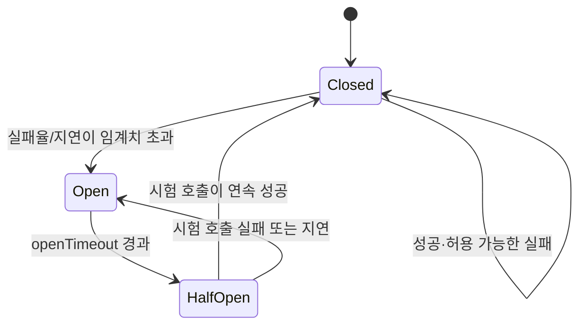
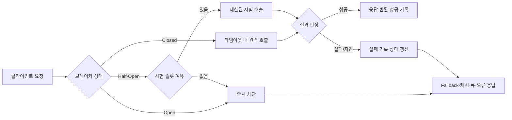

# 서킷 브레이커(Circuit Breaker) 패턴과 장애 격리

## 1. 개요

### 가. 정의

> **서킷 브레이커(Circuit Breaker)**는 원격 호출의 실패·지연을 관찰하여 호출 경로를 폐쇄하고, 장애가 회복되었는지 제한적으로 확인한 뒤 다시 개방하는 소프트웨어 설계 패턴이다.

서킷 브레이커는 전기 회로의 차단기에서 이름을 빌렸다.
전기 회로에 과전류가 흐르면 차단기가 회로를 끊어 화재와 설비 손상을 막고, 점검 후 다시 연결한다.
분산 소프트웨어에서도 하나의 서비스 장애가 호출자 전체로 전파되지 않도록 실패한 의존성으로 향하는 경로를 잠시 끊는다.
핵심은 원격 시스템의 상태를 완벽하게 진단하는 것이 아니라, 호출자가 감당할 수 있는 실패의 범위와 시간을 통제하는 데 있다.

서킷 브레이커는 단순한 재시도 로직과 다르다.
재시도는 일시적인 실패를 극복하기 위해 같은 요청을 다시 보내는 기법이지만, 장애가 지속되는 동안 재시도가 누적되면 대상 시스템의 부하와 호출자 대기열을 키울 수 있다.
반면 서킷 브레이커는 일정한 실패 신호가 관찰되면 빠르게 실패하거나 대체 경로를 사용하여 추가 호출 자체를 줄인다.
따라서 두 기법은 경쟁 관계가 아니라, 재시도 횟수·백오프·차단 조건을 함께 설계해야 하는 보완 관계다.

### 나. 등장 배경과 필요성

분산 시스템에서는 서비스가 정상인지 여부가 이진 값으로 결정되지 않는다.
네트워크 패킷 손실, DNS 지연, 연결 풀 고갈, 스레드 고갈, 데이터베이스의 부분적 과부하처럼 호출은 성공·실패·지연의 다양한 상태를 보인다.
호출자는 이 차이를 감지하지 못한 채 타임아웃까지 기다리거나 무제한으로 재시도할 수 있다.
그 결과 원래 장애가 발생한 서비스보다 호출자와 상위 서비스가 먼저 포화되는 장애 전파가 나타난다.

예를 들어 주문 서비스가 결제 서비스에 동기식으로 의존한다고 가정한다.
결제 서비스의 평균 응답시간이 평소 200ms에서 5초로 증가하면 주문 서비스의 작업 스레드가 결제 응답을 기다리며 점유된다.
트래픽이 같은 수준으로 들어오면 대기 요청이 쌓이고, 주문 서비스의 연결 풀과 메모리가 고갈되며, 결제와 무관한 주문 조회까지 실패할 수 있다.
서킷 브레이커는 이 상황에서 실패율과 지연을 기준으로 호출을 제한하고, 주문 서비스가 제공할 수 있는 축소 기능을 선택하게 한다.

서킷 브레이커가 필요한 또 다른 이유는 복구 시점의 폭주를 막기 위해서다.
장애가 해소된 직후 모든 호출자가 동시에 요청을 재개하면 대상 서비스가 다시 과부하에 빠지는 이른바 복구 폭풍이 발생할 수 있다.
반개방 상태에서 소수의 시험 요청만 허용하면 복구 여부를 확인하면서 부하를 점진적으로 늘릴 수 있다.
이는 장애 발생 시 차단뿐 아니라 회복 과정의 안정화까지 포함하는 제어 문제다.

### 다. 적용 목표와 범위

적용 목표는 첫째 의존성 장애의 격리, 둘째 호출자의 자원 보호, 셋째 사용자에게 빠르고 예측 가능한 대체 응답 제공, 넷째 복구 검증의 자동화다.
이 네 목표를 모두 달성하지 못하고 단순히 예외를 세는 컴포넌트만 추가하면 운영 복잡성만 높아질 수 있다.
실험과 관측을 통해 “어떤 실패를 차단할 것인가”와 “차단했을 때 무엇을 제공할 것인가”를 명확히 해야 한다.

주 적용 대상은 HTTP·gRPC 기반의 동기 호출, 외부 결제·인증 API, 메시지 브로커의 동기 관리 API, 데이터베이스 프록시, 서비스 메시의 라우팅 경로다.
반대로 비동기 메시지 소비자는 이미 버퍼와 재처리 모델을 갖고 있으므로 서킷 브레이커만으로 문제를 해결하기 어렵다.
이 경우에는 소비자 격리, 백프레셔, 재처리 횟수, 독성 메시지 큐와 함께 설계해야 한다.

## 2. 작동 원리와 상태 모델

### 가. 기본 상태 전이

서킷 브레이커의 대표적인 상태는 폐쇄(Closed), 개방(Open), 반개방(Half-Open) 세 가지다.
폐쇄 상태에서는 호출을 정상적으로 통과시키면서 성공과 실패, 그리고 지연을 측정한다.
개방 상태에서는 실제 의존성 호출을 수행하지 않고 즉시 실패하거나 사전에 정한 대체 응답을 반환한다.
반개방 상태에서는 일정한 대기시간 이후 제한된 수의 시험 호출만 허용하여 의존성의 회복을 확인한다.

폐쇄에서 개방으로 전이하는 조건은 실패 횟수 하나만으로 정하지 않는 것이 바람직하다.
짧은 시간의 일시적 오류는 네트워크 순간 손실일 수 있고, 긴 시간의 높은 지연은 대상 서비스의 포화일 수 있으므로 관찰 창과 최소 호출 수를 함께 둔다.
예를 들어 최근 20초 동안 최소 50회 호출이 발생했고 실패율이 50%를 넘으면 개방하는 방식은 호출량이 적은 구간에서 오판하는 위험을 줄인다.
다만 임계치는 서비스의 중요도와 허용 가능한 오류 예산에 맞게 부여해야 하며 모든 API에 동일하게 적용하면 안 된다.

개방 상태의 대기시간은 고정값으로 시작할 수 있지만, 반복적인 장애와 회복이 나타나는 환경에서는 지수 백오프나 상한이 있는 증가 방식을 고려한다.
대기시간이 너무 짧으면 회복되지 않은 대상에 시험 요청을 반복하고, 너무 길면 회복된 서비스가 있어도 정상 기능을 불필요하게 오래 제한한다.
특히 결제·인증처럼 비즈니스 손실이 큰 의존성은 빠른 복구 확인보다 중복 거래와 보안 오류를 막는 쪽에 더 큰 가중치를 둘 수 있다.

### 나. 호출 처리 흐름

호출자는 브레이커를 통과하기 전에 현재 상태를 확인한다.
폐쇄 상태이면 요청을 실행하고 결과를 기록한다.
개방 상태이면 호출을 차단하고 fallback, 캐시, 큐잉, 사용자 안내 중 하나를 선택한다.
반개방 상태이면 동시 시험 호출 수를 제한하여 소수의 요청만 대상 서비스에 전달한다.

호출 결과의 판정은 HTTP 상태 코드나 gRPC 상태 코드의 의미를 반영해야 한다.
인증 실패처럼 요청 자체가 잘못된 4xx 응답을 일률적으로 의존성 장애로 세면 브레이커가 정상 서비스를 차단할 수 있다.
반면 429, 502, 503, 504 또는 연결 거부·읽기 타임아웃은 대상 시스템이나 경로의 용량 문제일 가능성이 높으므로 실패 신호로 분류할 수 있다.
업무별로 재시도 가능한 오류와 재시도하면 안 되는 오류를 구분하는 오류 분류표가 필요하다.

### 다. 창 유형과 판정 지표

실패를 집계하는 방법에는 연속 실패, 시간 기반 슬라이딩 윈도, 호출 수 기반 링 버퍼, 비율 기반 판정이 있다.
연속 실패 방식은 구현이 단순하고 초기 장애를 빨리 차단하지만, 성공과 실패가 번갈아 나타나는 부분 장애를 놓칠 수 있다.
시간 기반 창은 일정 시간 동안의 추세를 볼 수 있지만 트래픽 변화가 큰 서비스에서는 저트래픽 오판이 생기기 쉽다.
호출 수 기반 창은 통계적 비교가 쉽지만 호출량이 적은 구간에서는 판정까지 오래 걸릴 수 있다.

| 판정 방식 | 장점 | 위험 | 적용 예 |
|---|---|---|---|
| 연속 실패 수 | 빠른 차단, 단순한 구현 | 간헐적 장애와 저트래픽에 민감 | 연결 거부, DNS 실패 |
| 시간 기반 비율 | 최근 추세를 반영 | 트래픽 급변에 따른 편향 | 대규모 API |
| 호출 수 기반 창 | 표본 수를 보장 | 저호출 API의 반응 지연 | 결제·관리 API |
| 성공률+지연 혼합 | 사용자 체감 장애 반영 | 계측과 튜닝이 복잡 | 핵심 사용자 여정 |

실패율만 보면 빠르게 성공하지만 매우 느린 응답을 놓칠 수 있다.
예를 들어 타임아웃이 3초인데 대상 서비스가 2.9초마다 성공 응답을 반환하면 성공률은 높아도 호출자의 스레드가 오래 점유된다.
따라서 오류율, 타임아웃률, p95·p99 지연, 동시 실행 수, 차단률을 함께 관찰해야 한다.
지연을 실패로 계산하는 기준은 사용자 요청의 타임아웃과 일치시키고, 내부 재시도 횟수까지 포함한 최종 체감시간으로 검토한다.

## 3. 구성요소와 설계 방법

### 가. 실패·성공 판정기

판정기는 원격 호출의 결과를 의미 있는 분류로 바꾸는 계층이다.
네트워크 예외, 연결 거부, TLS 협상 실패, 읽기 타임아웃, 서버 오류를 기술 실패로 분류할 수 있다.
반대로 잘못된 입력, 권한 부족, 존재하지 않는 자원처럼 의존성이 정상적으로 반환한 업무 오류는 기본적으로 브레이커 실패에 포함하지 않는다.
이 구분을 하지 않으면 소비자 오류가 누적될 때 제공자 전체가 차단되는 부작용이 생긴다.

성공 판정도 HTTP 2xx라는 기계적 조건만으로는 충분하지 않다.
응답 본문에 업무 실패 코드가 포함되는 API, 부분 성공을 반환하는 배치 API, 비동기 접수만 성공으로 보는 API는 별도의 판정 규칙이 필요하다.
판정기는 도메인별 어댑터를 두어 호출 의미를 보존하고, 규칙 변경이 상태 머신 구현에 직접 섞이지 않게 해야 한다.
계약 테스트로 제공자와 소비자가 같은 오류 분류를 이해하는지 확인하는 것도 중요하다.

### 나. 상태 저장과 동시성 제어

브레이커는 최근 호출 결과와 상태 전이 시각을 저장해야 한다.
단일 프로세스 라이브러리라면 메모리 상태로 충분할 수 있지만, 여러 인스턴스가 동일한 제공자를 호출하면 각 인스턴스의 상태가 달라질 수 있다.
이 차이는 장점과 단점을 동시에 가진다.
인스턴스별 브레이커는 중앙 저장소 장애의 영향을 피하고 빠르게 동작하지만, 전체 호출량 기준의 차단을 정밀하게 제어하기 어렵다.

분산 상태를 사용하면 Redis 등 외부 저장소로 상태를 공유할 수 있으나, 브레이커가 다시 그 저장소에 의존하게 된다.
상태 저장소가 느려졌을 때 원격 호출을 막는 판단이 오히려 사용자 경로를 지연시키지 않도록 로컬 캐시, 짧은 TTL, 장애 시 보수적 기본값을 둔다.
시험 호출 슬롯을 여러 인스턴스가 동시에 획득하지 않도록 분산 락이나 토큰 버킷을 사용할 수 있지만, 락 자체의 만료와 네트워크 분할을 고려해야 한다.
대부분의 경우 전역 정밀도보다 로컬 격리와 빠른 판단을 우선하고, 전체 트래픽 제어는 별도 rate limiter로 분리하는 편이 단순하다.

### 다. 타임아웃과 재시도 예산

서킷 브레이커는 타임아웃을 대신하지 않는다.
타임아웃이 없으면 폐쇄 상태에서 호출이 무한히 대기하므로 브레이커가 실패를 집계할 기회조차 얻지 못한다.
각 호출에는 연결 타임아웃, 읽기 타임아웃, 전체 요청 타임아웃을 두고 상위 요청의 남은 예산 안에서 하위 호출을 수행해야 한다.
예를 들어 상위 요청의 목표시간이 1초라면 세 번의 하위 재시도를 각각 1초로 설정하는 구성은 논리적으로 불가능하다.

재시도와 브레이커를 함께 적용할 때는 곱셈적 증폭을 피해야 한다.
호출자 한 단계가 3회 재시도하고, 중간 서비스와 제공자 SDK도 각각 3회 재시도하면 한 사용자 요청이 최대 27회 호출로 확대될 수 있다.
전체 경로에서 재시도 주체를 한 곳으로 정하고, 시도 횟수와 남은 시간(deadline)을 하위 호출에 전달하는 방식이 안전하다.
멱등성이 보장되지 않는 결제·주문 요청은 자동 재시도보다 요청 키, 중복 제거, 비동기 보상 흐름을 우선한다.

### 라. Fallback과 격리 전략

Fallback은 “아무 응답이나 반환”하는 기능이 아니라, 장애 시에도 데이터의 의미와 사용자 기대를 보존하는 축소 서비스다.
상품 추천이 실패하면 추천 영역을 숨기고 기본 인기 목록을 보여줄 수 있지만, 잔액 조회가 실패했는데 마지막 캐시 값을 현재 잔액처럼 보여주는 것은 위험하다.
따라서 응답에 stale 여부를 표시하거나, 금융·안전 도메인에서는 보수적인 오류 안내를 선택해야 한다.
Fallback 설계에는 정확성, 신선도, 보안, 법적 책임, 재처리 가능성을 함께 평가한다.

격리는 스레드 풀, 연결 풀, 큐, 프로세스, 노드, 리전 수준에서 구성할 수 있다.
벌크헤드(bulkhead)는 특정 의존성의 대기 요청이 전체 작업자 자원을 점유하지 않도록 풀을 분리한다.
브레이커가 호출을 차단하더라도 이미 실행 중인 요청이 자원을 계속 점유하면 장애 전파가 멈추지 않으므로, 브레이커와 벌크헤드를 같이 사용해야 한다.
핵심 기능과 부가 기능에 서로 다른 자원·타임아웃·차단 정책을 부여하면 부분 기능으로 서비스 전체의 생존성을 높일 수 있다.

## 4. 유사 패턴 비교와 운영 시나리오

### 가. 재시도·타임아웃·레이트 리미터와의 비교

타임아웃은 한 요청이 기다릴 수 있는 상한을 정하고, 재시도는 회복 가능성이 있는 오류를 다시 시도하며, 레이트 리미터는 일정 시간에 허용하는 요청량을 제한한다.
서킷 브레이커는 실패가 누적되는 의존성으로 향하는 경로를 상태에 따라 선택적으로 차단한다.
모두 부하를 제어하지만, 관찰하는 신호와 보호하는 대상이 서로 다르다.
실무에서는 타임아웃을 가장 안쪽의 안전망으로 두고, 제한된 재시도와 백오프 뒤에 브레이커를 배치하며, 전체 진입량은 레이트 리미터로 제어한다.

| 패턴 | 주된 질문 | 보호 대상 | 잘못 쓰면 생기는 문제 |
|---|---|---|---|
| 타임아웃 | 얼마나 기다릴 것인가? | 요청 스레드·연결 | 너무 짧으면 정상 지연을 실패 처리 |
| 재시도 | 다시 시도할 가치가 있는가? | 일시 오류의 성공률 | 재시도 폭풍·중복 처리 |
| 서킷 브레이커 | 언제 의존성 호출을 멈출 것인가? | 호출자와 의존성 | 오판에 따른 기능 차단 |
| 레이트 리미터 | 얼마나 많이 허용할 것인가? | 서비스 용량 | 정상 트래픽의 불필요한 거부 |
| 벌크헤드 | 어떤 자원을 분리할 것인가? | 기능별 자원 풀 | 유휴 자원의 비효율 |

차이가 생기는 이유는 장애의 시간축과 공간축이 다르기 때문이다.
타임아웃은 한 요청의 시간축을 통제하지만, 브레이커는 여러 요청에서 관찰된 경향을 이용해 의존성 경로의 공간적 격리를 수행한다.
레이트 리미터는 장애 여부를 판단하지 않고 용량 정책을 적용하므로, 정상 상태의 폭주에도 유효하다.
이 구분을 답안에 명시하면 각각의 패턴을 단순 암기한 것이 아니라 운영 제어면으로 이해하고 있음을 보여줄 수 있다.

### 나. 사례 1: 외부 결제 API 지연

온라인 상점의 결제 API가 평소 300ms에서 8초로 지연되었다고 가정한다.
주문 API의 전체 타임아웃은 2초이고, 결제 호출에 1.2초를 할당한다.
첫 요청이 타임아웃되면 무조건 재시도하지 않고 결제 제공자의 멱등키를 사용한 상태 조회나 비동기 접수로 전환한다.
브레이커가 개방되면 신규 결제 요청은 “결제 처리 중” 상태로 안전하게 큐에 넣거나 사용자에게 재시도 안내를 하며, 이미 승인된 결제가 중복 실행되지 않게 한다.

이 사례의 핵심은 fallback의 내용이 결제 도메인의 원자성과 일치해야 한다는 점이다.
단순한 실패 응답만 반환하면 사용자가 다시 결제하여 이중 승인 위험이 생길 수 있다.
반대로 접수 상태를 명확히 저장하고 멱등키·상태 조회·보상 처리를 결합하면 제공자의 일시 장애에도 주문 상태를 추적할 수 있다.
시험 호출은 조회나 헬스 확인을 우선하고, 실제 금액 승인과 같은 부작용 있는 요청은 반개방 검증에 직접 사용하지 않는 것이 안전하다.

### 다. 사례 2: 추천·검색 부가 기능 장애

콘텐츠 서비스에서 개인화 추천은 부가 기능이고 본문 조회는 핵심 기능이라고 가정한다.
추천 서비스가 오류를 반환하면 추천 브레이커만 개방하고, 본문 조회 경로와 자원을 공유하지 않도록 벌크헤드를 구성한다.
fallback으로 최근 인기 콘텐츠 캐시를 제공하되 캐시 생성 시각을 관리하여 오래된 추천을 현재 개인화 결과로 오인하지 않게 한다.
이렇게 하면 추천 품질은 일시적으로 하락하지만 사용자의 핵심 읽기 흐름은 유지된다.

부가 기능을 항상 성공시키려는 설계는 핵심 기능의 가용성을 훼손할 수 있다.
서비스 중요도에 따라 의존성의 실패를 허용하는 정도를 정의하고, 핵심 여정의 오류 예산을 부가 기능보다 우선 배분해야 한다.
또한 브레이커 개방률, fallback 비율, 캐시 적중률을 함께 대시보드에 표시하여 “장애가 숨겨진 것”과 “기능이 안전하게 축소된 것”을 구분한다.

## 5. 구현·배포·검증 절차

### 가. 설계 단계

첫 단계는 사용자 여정과 원격 의존성 목록을 그리는 것이다.
호출 그래프에는 동기·비동기 여부, 중요도, 타임아웃, 멱등성, 데이터 신선도, 대체 가능성을 기록한다.
그 다음 각 의존성에 대해 실패 유형을 기술 오류·업무 오류·보안 오류로 분류하고, 차단 여부와 fallback 정책을 결정한다.
이 과정을 생략하고 공통 라이브러리를 전사에 일괄 적용하면 도메인별 위험 차이를 반영하지 못한다.

두 번째 단계는 기준선과 목표를 정하는 것이다.
평상시 성공률, p95·p99 지연, 동시 요청 수, 오류 예산 소비율을 측정하고, 실험 시 허용할 사용자 영향과 자동 중단 조건을 정한다.
예를 들어 핵심 API의 5분 오류율이 1%p 상승하거나 주문 접수 실패가 특정 수치를 넘으면 즉시 실험과 트래픽 변경을 중지하는 식이다.
기준선이 없으면 브레이커가 문제를 줄였는지 오히려 만들었는지 판별하기 어렵다.

### 나. 점진적 배포와 검증

처음에는 단일 인스턴스와 낮은 트래픽의 비핵심 API에 적용한다.
정상 호출, 일시 오류, 지속 오류, 느린 응답, 재시작, 네트워크 단절을 각각 주입하여 상태 전이와 fallback을 확인한다.
이후 카나리 인스턴스의 비율을 높이고, 리전·테넌트·기능별로 영향 범위를 확장한다.
모든 단계에서 브레이커 자체의 오류가 사용자에게 더 큰 장애를 만들지 않는지 확인해야 한다.

검증 항목에는 상태 전이 지연, 개방 후 실제 호출량 감소, 반개방 시험 호출 수, 성공 복귀 조건, fallback의 정확성, 지표·로그·트레이스의 상관관계가 포함된다.
장애가 해소된 뒤에도 정상 복귀가 자동으로 이루어지는지, 복귀 직후 트래픽이 급증하지 않는지 확인한다.
부하 테스트에서는 단일 노드뿐 아니라 여러 인스턴스가 서로 다른 상태를 가질 때의 결과도 측정한다.
운영자는 차단된 요청과 실제 실패한 요청을 구분할 수 있어야 하므로 로그 필드와 대시보드의 의미를 사전에 합의한다.

### 다. 관측성과 운영

최소 지표는 브레이커 상태별 요청 수, 허용·차단·시험 호출 수, 성공·실패·타임아웃 수, 실패율, 지연 분포, fallback 비율, 상태 전이 횟수다.
차원은 브레이커 이름, 의존성, API, 리전, 인스턴스, 오류 유형 정도로 제한하여 고카디널리티 문제를 피한다.
트레이스에는 차단 여부와 원인, 재시도 횟수, 남은 deadline을 태그로 기록하면 한 요청의 지연 증폭 경로를 추적할 수 있다.
민감한 요청 본문이나 결제 정보를 로그에 남기지 않는 개인정보 보호 원칙도 같이 지킨다.

운영 알림은 개방 자체보다 고객 영향과 회복 실패를 중심으로 설계한다.
일시적인 짧은 개방을 모두 긴급 알림으로 보내면 경보 피로가 생기므로, 차단률·지속시간·핵심 여정 실패를 조합한 심각도 정책이 필요하다.
개방 상태가 오래 지속되면 제공자 장애뿐 아니라 잘못된 임계치, 인증서 만료, 네트워크 정책 변경, 배포 회귀를 함께 점검한다.
런북에는 상태 확인 명령, 트래픽 축소 절차, fallback 점검, 수동 복구 조건, 사후 분석 항목을 포함한다.

## 6. 심화: 서비스 메시와 SRE 운영으로의 확장

서비스 메시에서 브레이커는 애플리케이션 코드가 아니라 프록시 계층에 구현될 수 있다.
이 방식은 여러 언어의 서비스에 일관된 정책을 적용하고 배포 없이 설정을 변경할 수 있다는 장점이 있다.
그러나 프록시는 도메인 오류의 의미와 안전한 fallback을 알기 어렵기 때문에, 전송 수준의 차단과 업무 수준의 대체 응답을 분리해야 한다.
프록시가 5xx를 감지해 호출을 줄이는 동안 애플리케이션은 결제 중복이나 데이터 신선도와 같은 업무 규칙을 책임져야 한다.

SRE 관점에서 브레이커는 가용성을 높이는 장치이지만 차단된 요청을 성공으로 숨기는 장치는 아니다.
차단과 fallback을 별도의 오류 예산 소비 항목으로 기록하고, 기능 축소가 지속되면 고객 영향으로 환산해야 한다.
서비스 수준 목표가 “본문 조회 성공”인지 “개인화 추천 포함 성공”인지에 따라 같은 fallback의 평가가 달라진다.
따라서 SLI를 기술 지표뿐 아니라 사용자 여정 지표로 정의하고, 브레이커 정책이 목표를 개선하는지 검증해야 한다.

최근의 운영 설계에서는 고정 임계치만 사용하기보다 트래픽 패턴과 지연 분포를 고려한 적응형 기준을 검토한다.
다만 자동 학습된 임계치가 이상 트래픽을 정상으로 오인할 수 있으므로, 최소·최대 경계와 사람이 검토하는 변경 승인 절차를 둔다.
AI 기반 이상탐지 결과를 브레이커의 직접 차단 신호로 사용하기보다 보조 신호와 조사 우선순위로 사용하는 것이 안전하다.
자동화의 복잡성이 늘어날수록 결정 이유와 중단 방법을 운영자가 이해할 수 있어야 한다.

기술사 답안에서는 브레이커를 단일 디자인 패턴으로만 설명하지 말고, 장애 전파 방지라는 품질속성 목표에서 출발해야 한다.
가용성·성능·일관성·보안·운영성의 트레이드오프를 제시하고, 타임아웃·재시도·벌크헤드·레이트 리미터·관측성의 조합을 아키텍처 수준에서 연결한다.
또한 정량 기준, 단계적 적용, 자동 중단, 사후 학습까지 포함하면 구현 설명을 운영 거버넌스로 확장할 수 있다.

## 7. 고려사항 및 시사점

### 가. 임계치와 오탐·미탐의 균형

임계치가 낮으면 정상적인 일시 오류에도 회로가 열려 기능이 불필요하게 제한된다.
임계치가 높으면 장애가 충분히 전파된 뒤에야 차단하여 보호 효과가 약해진다.
최소 호출 수, 시간 창, 오류 유형별 가중치, 지연 백분위수를 함께 사용하고 트래픽 계절성을 반영해 주기적으로 조정해야 한다.
변경 전후의 차단률과 고객 지표를 비교하여 설정 변경도 운영 변화로 관리한다.

### 나. 데이터 일관성과 업무 안전성

fallback 캐시는 데이터가 오래되었을 수 있고, 큐에 넣은 명령은 나중에 처리될 수 있다.
잔액·재고·권한·결제처럼 정확성이 우선인 데이터는 stale 응답을 무조건 허용해서는 안 된다.
멱등키, 버전 검증, 보상 트랜잭션, 수동 확인 상태를 설계하여 차단으로 인해 중복·유실·순서 역전이 발생하지 않게 한다.
장애 격리는 기술적 성공이 아니라 업무 결과의 안전성을 기준으로 평가해야 한다.

### 다. 상태 공유와 운영 복잡성

인스턴스별 상태는 단순하고 빠르지만 전역 정책과 다를 수 있다.
중앙 상태는 일관성을 줄 수 있으나 상태 저장소 장애와 네트워크 분할이라는 새 의존성을 만든다.
정밀한 전역 차단이 정말 필요한지 먼저 판단하고, 필요하지 않다면 로컬 브레이커와 전역 rate limit을 조합하는 등 복잡성을 분리한다.
브레이커 설정은 코드·구성관리로 버전 관리하며, 변경 주체와 롤백 방법을 명확히 한다.

### 라. 보안과 개인정보

브레이커 로그와 트레이스에 오류 원인을 남길 때 토큰·주문번호·개인정보가 노출되지 않도록 마스킹한다.
fallback이 제공하는 캐시가 테넌트 간에 섞이지 않도록 키와 접근제어를 검증해야 한다.
외부 인증 서비스 장애를 우회한다는 이유로 인증을 생략하면 가용성보다 보안 위험이 커질 수 있다.
차단·우회 정책도 위협 모델과 감사 추적의 대상이며, 비상 설정 변경은 승인과 사후 검토를 남긴다.

### 마. 테스트와 조직 학습

단위 테스트만으로는 시간 창, 동시성, 복구 폭풍을 충분히 검증할 수 없다.
통합 테스트, 장애 주입, 부하 테스트, 카나리 운영, 정기적인 복구 훈련을 조합해야 한다.
실험 결과는 특정 담당자의 책임 추궁보다 설계 가정과 런북의 개선으로 연결하고, 발견된 문제의 재발 방지 테스트를 저장소에 남긴다.
개발·운영·보안·업무 담당자가 공통으로 차단 조건과 fallback의 의미를 이해할 때 패턴의 효과가 지속된다.

## 참고자료

- Martin Fowler, CircuitBreaker: https://martinfowler.com/bliki/CircuitBreaker.html
- Microsoft Azure Architecture Center, Circuit Breaker pattern: https://learn.microsoft.com/en-us/azure/architecture/patterns/circuit-breaker
- Microsoft Polly documentation, resilience strategies: https://www.pollydocs.org/strategies/

---

> **한 줄 요약**: 서킷 브레이커는 실패한 의존성을 무조건 재호출하지 않고 상태 기반으로 차단·시험·복귀하여 장애 전파와 복구 폭풍을 함께 제어하는 분산 시스템의 핵심 회복탄력성 패턴이다.
