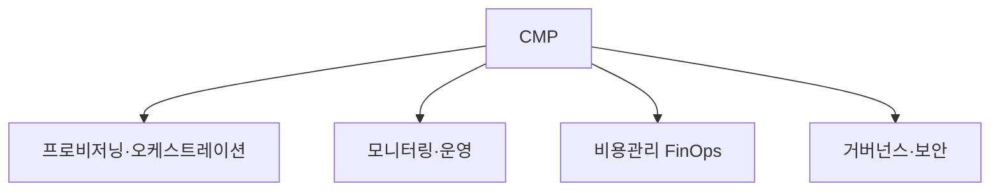

# 클라우드 관리 플랫폼(CMP, Cloud Management Platform)

## 1. 개요

### 가. 정의
> 여러 클라우드(멀티·하이브리드)와 온프레미스 자원을 **단일 콘솔에서 통합 관리·자동화·최적화**하는 플랫폼.

### 나. 필요성
- 멀티클라우드 확산에 따른 **관리 복잡성·비용·거버넌스** 문제
- 자원 가시성·자동화·비용 최적화(FinOps) 요구

## 2. 필수 기능

| 기능 | 내용 |
|---|---|
| **프로비저닝/오케스트레이션** | 자원 배포·구성 자동화(IaC) |
| **모니터링·운영** | 성능·가용성 통합 모니터링, 자동화 |
| **비용 관리(FinOps)** | 사용량·비용 분석·최적화, 예산 통제 |
| **거버넌스·보안** | 정책·규정 준수, 접근통제·태깅 |
| **셀프서비스** | 카탈로그·포털 |

## 3. 플랫폼 선정 기준

| 기준 | 내용 |
|---|---|
| **멀티클라우드 지원** | 주요 CSP·온프레 지원 범위 |
| **자동화·통합** | IaC·API·기존 도구 연동 |
| **비용·거버넌스** | FinOps·정책 관리 성숙도 |
| **보안·규정** | 접근통제·컴플라이언스(CSAP 등) |
| **확장성·운영성** | 규모 대응·사용 편의 |

## 4. 기대 효과

| 효과 | 내용 |
|---|---|
| **가시성·통제** | 통합 관리로 자원·비용 가시화 |
| **비용 절감** | 유휴자원 제거·최적화(FinOps) |
| **민첩성** | 셀프서비스·자동화로 신속 배포 |
| **거버넌스** | 정책·보안 일관 적용 |

## 5. 고려사항 및 시사점
- **벤더 종속성** 회피, 표준·개방성 고려
- CSPM(보안)·FinOps·IaC와 연계한 운영 체계
- 멀티클라우드 전략의 핵심 관리 수단

---

> **한 줄 요약**: CMP는 *멀티·하이브리드 클라우드를 단일 콘솔에서 통합 관리* 하는 플랫폼으로, 프로비저닝·모니터링·비용관리(FinOps)·거버넌스를 필수 기능으로 제공해 가시성·비용절감·민첩성을 실현한다.
