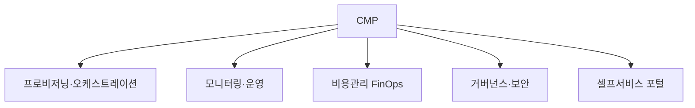

# 클라우드 관리 플랫폼(CMP, Cloud Management Platform)

## 1. 개요

### 가. 정의
> 여러 퍼블릭 클라우드(멀티·하이브리드)와 온프레미스 자원을 **단일 콘솔에서 통합적으로 프로비저닝·모니터링·최적화·거버넌스**하는 관리 플랫폼.

CMP는 특정 CSP(AWS·Azure·GCP)의 관리 콘솔을 대체하는 것이 아니라, 서로 다른 클라우드들을 그 **위에서 추상화(abstraction)** 해 하나의 운영 체계로 묶는 계층이다. 각 CSP가 저마다 다른 API·용어·과금 체계·보안 모델을 가지므로, 이를 개별적으로 다루면 관리 인력과 실수가 기하급수로 늘어난다. CMP는 이 이질성을 흡수해 "어느 클라우드에 있든 동일한 방식으로 배포·감시·통제"하도록 만든다.

### 나. 등장 배경 및 필요성
기업들은 벤더 종속(Lock-in) 회피, 가용성 확보, 서비스별 강점 활용을 위해 **멀티클라우드**를 채택했지만, 그 결과 관리 대상이 폭증했다. 클라우드마다 콘솔을 오가야 하고, 비용은 여러 청구서로 흩어져 어디서 낭비가 나는지 보이지 않으며, 보안 정책도 제각각이라 규정 준수를 일관되게 강제하기 어렵다. 특히 클릭 몇 번으로 자원이 생성되는 클라우드의 민첩성은 곧 **관리되지 않는 유령 자원(Shadow IT)과 비용 폭탄**의 원인이 된다. CMP는 이 흩어진 자원에 대한 **가시성·자동화·비용 최적화(FinOps)·거버넌스**를 한곳으로 모아 멀티클라우드의 복잡성을 다스리기 위해 등장했다.

## 2. 필수 기능

**가. 프로비저닝·오케스트레이션** 은 자원의 배포·구성·변경을 코드(IaC)와 템플릿으로 자동화하는 기능이다. 사람이 콘솔에서 수작업으로 서버를 만들면 환경마다 구성이 달라지는 **구성 편차(Configuration Drift)** 가 생기는데, IaC 기반 자동화는 동일한 정의로 반복 배포해 이를 없앤다.

**나. 모니터링·운영** 은 여러 클라우드에 흩어진 자원의 성능·가용성·로그를 **단일 대시보드로 통합**해 감시하고, 임계치 초과 시 자동 대응까지 연결하는 기능이다. 장애의 근본 원인이 여러 클라우드에 걸쳐 있을 때 통합 관측(Observability)이 없으면 원인 추적 자체가 불가능하다.

**다. 비용 관리(FinOps)** 는 사용량과 비용을 실시간으로 분석해 유휴·과대 프로비저닝 자원을 찾아내고 예산을 통제하는 기능이다. 예를 들어 개발팀이 테스트용으로 띄운 GPU 인스턴스를 밤새 끄지 않아 월 수백만 원이 새는 경우를, CMP는 태그별 비용 리포트와 자동 스케줄링으로 잡아낸다.

**라. 거버넌스·보안** 은 접근통제·태깅 정책·규정 준수(컴플라이언스)를 여러 클라우드에 **일관되게 강제**하는 기능이다. 여기에 **셀프서비스 포털**(승인된 카탈로그에서 사용자가 직접 자원을 신청)까지 더해져, 통제와 민첩성을 동시에 달성한다.

| 기능 | 내용 | 없을 때의 문제 |
|---|---|---|
| 프로비저닝/오케스트레이션 | IaC 기반 배포·구성 자동화 | 구성 편차·수작업 실수 |
| 모니터링·운영 | 통합 성능·가용성·로그 감시 | 장애 원인 추적 불가 |
| 비용 관리(FinOps) | 사용량·비용 분석·예산 통제 | 유휴자원·비용 폭탄 |
| 거버넌스·보안 | 정책·규정·접근통제 일관 적용 | 규정 위반·Shadow IT |
| 셀프서비스 | 카탈로그·포털 신청 | IT 병목·통제 상실 |

## 3. 플랫폼 선정 기준

CMP 도입은 곧 운영 체계 전체를 그 위에 얹는 결정이므로, 선정 기준은 단순 기능 목록이 아니라 **자사 클라우드 전략과의 정합성**으로 판단해야 한다. 우리가 실제로 쓰는 CSP·온프레를 모두 지원하는지(지원 범위가 좁으면 결국 다시 개별 관리로 회귀), 기존 CI/CD·모니터링 도구와 API로 연동되는지, FinOps·정책 관리가 리포트 수준인지 실제 제어 수준까지 가는지, 국내 공공이라면 CSAP 같은 규정을 충족하는지를 함께 본다.

| 기준 | 확인 사항 |
|---|---|
| 멀티클라우드 지원 | 실제 사용 CSP·온프레 지원 범위 |
| 자동화·통합 | IaC·API·기존 도구 연동성 |
| 비용·거버넌스 | FinOps·정책 관리 성숙도(제어까지 가능한가) |
| 보안·규정 | 접근통제·컴플라이언스(CSAP 등) |
| 확장성·운영성 | 규모 대응·사용 편의·학습 곡선 |

## 4. 기대 효과

기대 효과는 앞의 필수 기능이 제대로 작동할 때 나타나는 결과다. 흩어진 자원이 한눈에 보이면서 **가시성·통제**가 생기고, 유휴자원 제거와 최적 인스턴스 선택으로 **비용이 절감**되며, 셀프서비스와 자동화로 배포 리드타임이 짧아져 **민첩성**이 오르고, 정책이 일관 적용되어 **거버넌스**가 강화된다. 이 효과들은 서로 맞물려 있어서, 예컨대 가시성이 확보돼야 비로소 비용 절감의 대상이 보인다.

## 5. 고려사항 및 시사점
기술사 관점에서 CMP 도입 시 가장 경계할 점은 **CMP 자체가 새로운 종속(Lock-in)** 이 될 수 있다는 것이다. 특정 CMP에 운영을 깊이 결합하면 나중에 그 CMP를 벗어나기 어려워지므로, 표준(Terraform·OpenAPI 등)과 개방성을 우선 고려해야 한다. 또한 CMP는 만능이 아니라 **CSPM(보안 형상 관리)·FinOps·IaC**와 유기적으로 연계되는 운영 체계의 일부로 설계해야 실효를 낸다. 결론적으로 CMP는 멀티클라우드 전략을 지속 가능하게 만드는 핵심 관리 수단이며, 최근에는 AIOps·정책 자동화와 결합해 자율운영(self-driving) 방향으로 진화하고 있다.

---

> **한 줄 요약**: CMP는 *멀티·하이브리드 클라우드를 단일 콘솔로 추상화해 통합 관리* 하는 플랫폼으로, 프로비저닝·모니터링·FinOps·거버넌스를 일관 제공해 가시성·비용절감·민첩성을 실현하되, 표준·개방성으로 CMP 자체의 종속을 경계해야 한다.
