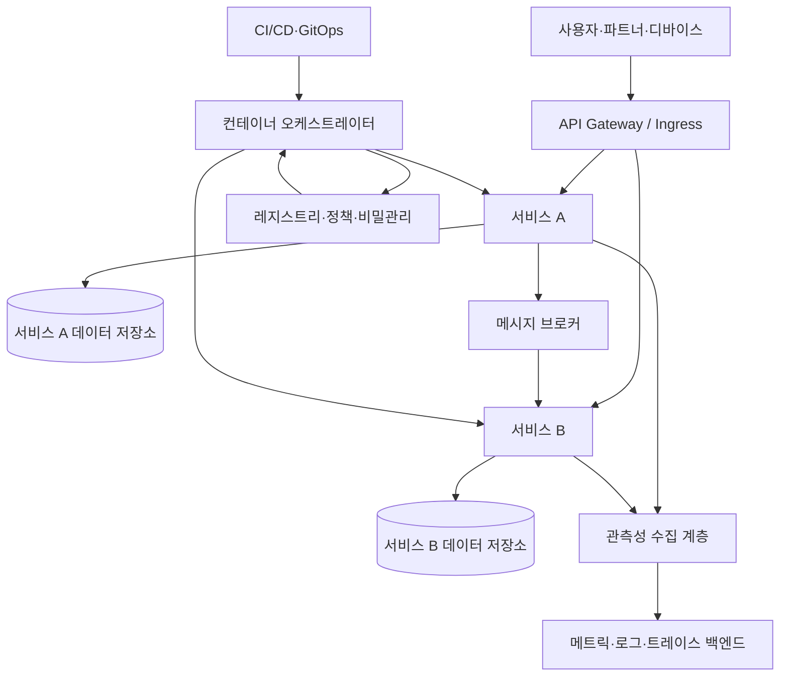
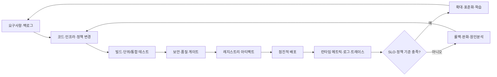

# 클라우드 네이티브(Cloud Native) 아키텍처

## 1. 개요

> **정의**: 클라우드 네이티브는 특정 클라우드 상품을 사용하는 것이 아니라, 컨테이너·마이크로서비스·선언적 API·자동화·관측성·탄력성을 결합하여 변화에 빠르고 반복 가능하게 대응하도록 애플리케이션과 운영 방식을 설계하는 접근이다.

클라우드 네이티브의 핵심은 애플리케이션을 클라우드에 올리는 것과 애플리케이션을 클라우드 네이티브 방식으로 설계하는 것을 구분하는 데 있다.
기존 시스템을 가상머신 이미지로 포장해 퍼블릭 클라우드에 옮기는 리프트 앤 시프트는 클라우드 이용이지만, 그것만으로 클라우드 네이티브가 되지는 않는다.
클라우드 네이티브는 장애가 발생하고 수요가 변하며 코드가 자주 바뀌는 상황을 정상적인 운영 조건으로 보고, 시스템이 그 조건에서 스스로 회복하고 확장하도록 구조와 프로세스를 바꾼다.

전통적인 애플리케이션은 한 서버와 한 배포 단위를 중심으로 설계되는 경우가 많았다.
이 구조에서는 배포 전 회귀 테스트 범위가 커지고, 일부 기능의 변경에도 전체 시스템을 중지하거나 큰 릴리스 창을 확보해야 했다.
또한 서버 상태가 로컬 디스크와 메모리에 남아 있으면 장애 복구나 수평 확장이 어렵고, 운영자는 서버 한 대의 상태를 직접 관리해야 한다.

클라우드 네이티브는 이러한 결합을 줄이기 위해 애플리케이션을 작은 변경 단위로 나누고, 상태와 실행 환경을 가능한 한 외부화한다.
컨테이너 이미지는 동일한 실행 단위를 개발·테스트·운영으로 이동시키고, 오케스트레이터는 원하는 상태와 실제 상태의 차이를 계속 조정한다.
파이프라인은 코드를 빌드하고 검증하는 절차를 자동화하며, 관측성은 서비스가 정상인지와 어디에서 문제가 시작되었는지를 운영자가 판단할 신호를 제공한다.

그러나 마이크로서비스를 많이 만들거나 Kubernetes를 설치하는 것만으로는 목표를 달성할 수 없다.
서비스 경계가 잘못되면 네트워크 호출과 분산 트랜잭션이 늘고, 팀 간 조정 비용과 디버깅 난도가 상승한다.
자동화가 부정확하면 빠른 배포가 빠른 장애 전파로 변할 수 있으며, 클라우드 자원의 탄력성은 비용 폭증으로 이어질 수 있다.
따라서 기술사 답안에서는 기술 요소를 나열하는 대신, 변화 대응성·복원력·운영 자동화·보안·비용이라는 목표와 설계 선택의 인과관계를 설명해야 한다.

### 1.1 등장 배경과 필요성

첫째, 디지털 서비스의 변경 속도가 빨라졌기 때문이다.
모바일·온라인 서비스는 기능 개선과 정책 변경을 짧은 주기로 제공해야 하며, 대규모 일괄 배포만으로는 경쟁 속도와 사용자 피드백을 따라가기 어렵다.
작은 변경을 자주 배포하려면 코드 저장소, 빌드, 테스트, 배포, 롤백이 연결된 자동화된 인도 흐름이 필요하다.

둘째, 수요와 장애의 변동성이 커졌기 때문이다.
쇼핑 행사나 공공 신청 접수처럼 특정 시간대에 요청이 급증하는 서비스는 평균 부하를 기준으로 서버를 고정하면 유휴 비용이 커지고, 피크를 기준으로 하면 평상시 비용이 커진다.
무상태 컴포넌트의 수평 확장, 큐 기반 완충, 오토 스케일링, 캐시와 같은 조합은 변동을 흡수하지만, 데이터베이스와 외부 연계의 병목까지 자동으로 해결하지는 않는다.

셋째, 조직이 분산되고 플랫폼이 복잡해졌기 때문이다.
개발·운영·보안·데이터 팀이 별도로 움직이면 인수인계와 승인 대기가 병목이 된다.
제품 팀이 공통 플랫폼을 셀프서비스로 이용하고 정책을 코드로 적용하면 팀의 자율성을 높이면서도 조직의 기본 통제를 유지할 수 있다.

### 1.2 목표와 적용 범위

클라우드 네이티브 설계의 첫 목표는 **변경 가능성(changeability)**이다.
기능을 작은 단위로 수정하고 독립적으로 배포할 수 있어야 하며, 변경 실패가 전체 서비스 중단으로 확대되지 않아야 한다.
이를 위해 배포 단위, 데이터 소유권, API 계약, 버전 호환성, 롤백 경계를 함께 정한다.

두 번째 목표는 **탄력성(elasticity)**이다.
탄력성은 단순히 서버 대수를 늘리는 기능이 아니라, 부하에 맞추어 자원을 조정하고 부하가 사라지면 회수하는 능력이다.
수평 확장을 적용하려면 인스턴스가 로컬 상태에 의존하지 않아야 하고, 세션·파일·작업 큐를 외부 저장소나 전용 서비스로 분리해야 한다.

세 번째 목표는 **복원력(resilience)**이다.
복원력은 장애가 전혀 발생하지 않는다는 뜻이 아니라, 부분 장애를 격리하고 제한된 기능으로 서비스를 유지하며 정해진 시간 안에 복구하는 능력이다.
타임아웃·재시도·서킷 브레이커·벌크헤드·다중 가용영역은 서로 다른 실패 모드를 다루므로 목적을 구분해 적용한다.

네 번째 목표는 **운영의 관측 가능성과 자동화**이다.
메트릭·로그·트레이스가 서비스와 인프라의 상태를 설명해야 하고, 배포와 정책 변경이 재현 가능한 코드로 남아야 한다.
관측 데이터가 없으면 자동화의 결과를 검증하기 어렵고, 자동화가 없으면 관측 신호를 사람이 일일이 처리해야 하므로 두 요소는 함께 설계한다.

## 2. 클라우드 네이티브 전체 구조와 핵심 원리

클라우드 네이티브는 애플리케이션·플랫폼·인프라·조직 프로세스가 결합된 운영 모델이다.
애플리케이션 계층은 도메인 기능과 API를 제공하고, 플랫폼 계층은 배포·서비스 발견·비밀관리·관측·정책을 공통 기능으로 제공한다.
인프라 계층은 컴퓨팅·네트워크·스토리지의 자원을 추상화하고, 거버넌스 계층은 보안·비용·규정 준수의 경계를 정한다.

이 구조에서 API Gateway는 외부 경계를 정리하지만 모든 비즈니스 규칙을 한곳에 모으는 중앙 병목이 되어서는 안 된다.
서비스는 자신의 책임과 데이터 소유권을 갖고, 다른 서비스와는 계약된 인터페이스로 통신한다.
오케스트레이터는 컨테이너를 실행하는 도구이면서, 선언된 복제 수·네트워크 정책·배포 버전을 실제 환경에 반영하는 제어 루프다.

### 2.1 불변 인프라와 선언적 관리

불변 인프라는 운영 중인 서버를 관리자 명령으로 조금씩 수정하는 대신, 원하는 설정을 코드와 이미지로 정의하고 변경 시 새 실행 단위를 만들어 교체하는 원리다.
이 방식은 “현재 서버가 어떤 수동 변경을 거쳤는가”라는 숨은 상태를 줄여 환경 간 차이를 낮춘다.
특히 장애가 발생했을 때 현재 서버를 고치는 것보다 동일한 이미지와 설정으로 새 인스턴스를 재생성하면 복구 절차를 자동화하기 쉽다.

선언적 관리는 원하는 상태를 기술하고 시스템이 그 상태에 도달하도록 맡기는 방식이다.
절차적 스크립트가 “먼저 이 명령, 다음에 저 명령”을 지정한다면, 선언적 정의는 “파드 10개와 이 정책이 존재해야 한다”고 표현한다.
컨트롤러는 실제 상태를 관찰해 부족한 자원을 만들고, 불필요한 자원을 줄이며, 변경된 정의를 다시 반영한다.

선언적 정의도 무조건 안전한 것은 아니다.
잘못된 이미지 태그나 과도한 복제 수를 선언하면 자동 조정기가 오류를 빠르게 확대할 수 있다.
따라서 변경 승인, 정책 검증, 정적 분석, 점진적 배포, 자동 롤백을 파이프라인에 넣어 “자동”과 “무통제”를 구분해야 한다.

### 2.2 컨테이너와 이미지

컨테이너는 애플리케이션과 의존성을 이미지로 묶고, 호스트 운영체제 커널을 공유하면서 격리된 프로세스로 실행하는 기술이다.
가상머신보다 일반적으로 가벼운 실행 단위를 제공하지만, 커널 공유가 곧 완전한 보안을 의미하지는 않는다.
이미지 내 취약 라이브러리, 과도한 권한, 호스트 경로 마운트, 비밀정보 포함 여부를 별도로 통제해야 한다.

이미지는 불변 아티팩트로 다루고, 소스 커밋·빌드 도구·의존성·서명·취약점 검사 결과를 연결한다.
운영 환경에서 떠 있는 컨테이너에 패키지를 수동 설치하면 재현성이 깨지고 다음 배포에서 변경이 사라질 수 있다.
수정은 Dockerfile·빌드 설정·구성 저장소에서 수행하고, 검증된 이미지의 다이제스트를 승격하는 방식이 바람직하다.

이미지 최적화는 단순히 크기를 줄이는 문제가 아니다.
작은 이미지에는 공격 표면과 전송 시간이 줄어드는 장점이 있지만, 디버깅 도구를 모두 제거하면 장애 분석성이 떨어질 수 있다.
운영 이미지와 진단용 임시 도구의 사용 권한을 분리하고, 최소 실행 사용자·읽기 전용 파일시스템·시스템 호출 제한을 조합한다.

### 2.3 오케스트레이션과 플랫폼

오케스트레이터는 컨테이너를 노드에 배치하고, 서비스 디스커버리·헬스체크·롤링 업데이트·시크릿 주입·리소스 제한을 공통 방식으로 처리한다.
운영자는 애플리케이션마다 서버 접속 절차를 만들지 않고, 플랫폼의 API와 선언 파일을 통해 배포와 상태를 관리한다.
이 추상화는 생산성을 높이지만, 네트워크·스토리지·스케줄링의 실제 동작을 이해하지 않으면 장애 원인을 놓칠 수 있다.

리소스 요청(request)과 제한(limit)은 스케줄링과 안정성의 기준이 된다.
요청을 너무 낮게 잡으면 노드에 과도하게 배치되고, 제한을 너무 낮게 잡으면 정상적인 피크에서 프로세스가 종료될 수 있다.
반대로 제한을 과도하게 높이면 실제 사용량과 관계없이 자원 예약이 커져 다른 서비스의 배치와 비용에 영향을 준다.
서비스별 기준 부하와 p95·p99 사용량을 측정하여 수치를 주기적으로 조정한다.

헬스체크에는 프로세스가 살아 있는지 확인하는 liveness와 요청을 받을 준비가 되었는지 확인하는 readiness를 구분한다.
readiness 실패는 트래픽을 일시적으로 제외하는 의미이고, liveness 실패는 재시작을 유발할 수 있으므로 두 검사를 같은 조건으로 만들면 안 된다.
초기화가 오래 걸리는 서비스에는 startup 검사를 두어 기동 중인 프로세스가 조기에 재시작되지 않도록 한다.

### 2.4 클라우드 네이티브 인도 루프

클라우드 네이티브의 운영 가치는 개발 단계에서 운영 단계까지 하나의 피드백 루프를 만드는 데서 나온다.
변경은 Git에 기록되고, 파이프라인은 테스트·보안·정책 검사를 수행한 뒤 아티팩트를 만든다.
배포 후 관측성 신호는 서비스 수준 목표와 비교되고, 이상이 발견되면 롤백·완화·개선 작업으로 되돌아간다.

이 루프에서 배포 성공과 서비스 성공은 다를 수 있다.
이미지가 정상적으로 실행되었어도 사용자 지연, 비즈니스 오류율, 비용, 보안 이벤트가 악화될 수 있으므로 런타임 결과를 배포 판단에 포함한다.
또한 자동 롤백의 기준은 단일 CPU 사용률보다 오류 예산 소진, 핵심 사용자 여정의 성공률, 데이터 무결성처럼 업무 영향과 가까운 신호가 되어야 한다.

## 3. 애플리케이션·데이터·플랫폼 설계

### 3.1 마이크로서비스와 서비스 경계

마이크로서비스는 작은 프로세스의 개수보다 변경·배포·장애·데이터 소유의 경계를 독립적으로 운영할 수 있는가가 핵심이다.
하나의 서비스는 하나의 기술 기능이 아니라 응집된 업무 능력을 책임져야 하며, 외부에서는 명시된 API와 이벤트로 기능을 사용한다.
경계를 잘 잡으면 팀이 독립적으로 출시할 수 있지만, 경계를 잘못 잡으면 분산 모놀리스가 된다.

서비스를 나눌 때는 도메인 용어, 변경 빈도, 트랜잭션 경계, 팀 책임, 보안 경계, 성능 특성을 함께 분석한다.
항상 같은 시점에 변경되는 두 모듈을 분리하면 네트워크 호출만 늘어날 수 있고, 서로 다른 업무 규칙을 한 서비스에 넣으면 배포 충돌이 계속된다.
초기에는 모듈형 모놀리스를 활용하여 도메인 경계를 검증한 후, 실제 병목과 팀 구조가 확인될 때 점진적으로 분리하는 전략도 유효하다.

### 3.2 API와 이벤트 기반 통신

동기 API 호출은 즉시 응답이 필요한 조회나 명령에 적합하지만, 호출 대상이 지연되거나 장애가 나면 호출자까지 대기할 수 있다.
타임아웃은 무한 대기를 막지만, 타임아웃 자체가 작업의 취소를 보장하는 것은 아니므로 서버 측 중복 실행과 보상 처리를 고려해야 한다.
재시도는 일시적 오류를 흡수할 수 있으나, 모든 오류를 재시도하면 장애 중인 대상에 부하를 더하는 재시도 폭풍이 발생한다.

이벤트 기반 통신은 생산자가 사실을 발행하고 소비자가 비동기 처리하도록 하여 시간적 결합을 줄인다.
그러나 메시지 중복, 순서 변경, 지연, 소비자 재처리, 스키마 호환성 문제가 생기므로 멱등성 키와 재처리 정책을 설계해야 한다.
이벤트를 발행했다고 해서 데이터베이스 트랜잭션과 메시지 발행이 항상 동시에 커밋되는 것도 아니므로, 아웃박스 패턴이나 변경 데이터 캡처를 활용할 수 있다.

### 3.3 상태·데이터 관리

클라우드 네이티브에서 “무상태”는 데이터가 없다는 뜻이 아니라, 개별 인스턴스의 수명과 업무 데이터의 수명을 분리한다는 뜻이다.
인증 세션은 외부 세션 저장소나 토큰으로, 파일은 객체 스토리지로, 작업은 내구성 있는 큐로 옮기면 인스턴스를 자유롭게 교체할 수 있다.
다만 외부 저장소가 늘어날수록 네트워크 지연·일관성·비용·장애 도메인도 늘어나므로 데이터 접근 패턴을 측정해야 한다.

서비스별 데이터베이스 소유는 독립성을 높이지만, 전사 리포트에서 여러 데이터베이스를 조인하는 요구와 충돌할 수 있다.
운영 데이터베이스의 직접 조인을 허용하면 서비스 경계가 무너지고, 스키마 변경이 다른 팀의 배포를 막는다.
대신 이벤트·CDC·데이터 웨어하우스·데이터 제품을 통해 분석용 모델을 별도로 만들고, 실시간 업무 트랜잭션과 분석 일관성의 차이를 명시한다.

### 3.4 플랫폼 엔지니어링과 개발자 경험

플랫폼 팀은 개발자를 대신해 모든 업무를 수행하는 중앙 운영팀이 아니라, 제품 팀이 안전한 기본값으로 서비스를 만들 수 있게 하는 내부 플랫폼을 제공한다.
서비스 템플릿, 표준 파이프라인, 로그·트레이스 연결, 권한·비밀관리, 비용 대시보드가 셀프서비스로 제공되면 팀마다 같은 기초 작업을 반복하는 낭비가 줄어든다.

내부 플랫폼의 성공은 기능 수가 아니라 개발자 경험과 운영 성과로 측정한다.
새 서비스가 첫 배포까지 걸리는 시간, 표준 템플릿 사용률, 변경 실패율, 복구 시간, 정책 예외 건수를 함께 본다.
플랫폼이 모든 선택을 강제하면 팀의 혁신을 막을 수 있으므로, 안전한 골든 패스와 예외 승인 경로를 함께 제공한다.

## 4. 보안·관측성·운영 자동화

### 4.1 DevSecOps와 공급망 보안

클라우드 네이티브 환경에서는 코드가 이미지와 배포 설정으로 빠르게 변환되므로, 보안 검사를 운영 직전의 마지막 승인 단계에만 둘 수 없다.
소스 저장소의 비밀 탐지, 의존성 취약점 점검, 이미지 스캔, 서명 검증, 배포 권한 통제를 개발·빌드·배포 흐름에 연결한다.
빌드 시스템과 레지스트리의 권한을 분리하고, 운영 클러스터가 신뢰하는 서명자와 허용된 레지스트리를 정책으로 제한한다.

보안은 플랫폼 팀만의 책임이 아니라 서비스 코드·이미지·인프라 코드·정책 코드의 각 소유자가 나누어 갖는다.
다만 책임을 분산한다고 통제 기준까지 분산하면 팀별 수준 차이가 커지므로, 조직 공통 기준과 자동화된 정책 게이트를 정한다.
비밀정보는 환경변수에 평문으로 저장하지 않고 전용 비밀관리 시스템과 짧은 수명·회전 정책을 사용한다.

### 4.2 관측성의 세 신호

관측성은 내부 상태를 직접 볼 수 없을 때 외부 출력으로 상태를 추론할 수 있는 정도를 말한다.
메트릭은 시간에 따른 수치와 추세를 보여 주고, 로그는 특정 사건의 맥락을 제공하며, 트레이스는 하나의 요청이 여러 서비스를 통과한 경로와 지연을 보여 준다.
세 신호를 무조건 많이 수집하는 것이 목적이 아니라, 사용자 영향과 원인 분석 질문에 답할 수 있도록 상관관계를 설계하는 것이 목적이다.

서비스 이름·환경·버전·인스턴스·요청 ID와 같은 공통 속성을 표준화하면 신호를 서로 연결하기 쉽다.
그러나 사용자 ID나 원문 요청처럼 개인정보나 고카디널리티를 가진 값을 그대로 태그로 넣으면 저장비용과 정보 노출 위험이 커진다.
필드 분류, 마스킹, 샘플링, 보존기간, 접근권한을 관측성 설계에 포함한다.

### 4.3 신뢰성 패턴과 장애 격리

타임아웃은 호출의 최대 대기 시간을 정하여 리소스가 묶이는 것을 방지한다.
재시도는 지수 백오프와 지터를 사용해 동시 재호출을 분산하고, 재시도 가능한 오류와 불가능한 오류를 구분한다.
서킷 브레이커는 실패율이나 지연이 임계치를 넘으면 호출을 빠르게 거절해 장애 전파를 막지만, 열린 회로 동안의 대체 응답과 복구 탐색을 정의해야 한다.

벌크헤드는 자원 풀·스레드·동시성·큐를 분리하여 한 기능의 폭주가 다른 기능을 고갈시키지 않게 한다.
격리 경계가 너무 작으면 자원 활용도가 낮아지고, 너무 크면 장애 전파를 막지 못한다.
재해복구를 위해서는 단일 노드 장애뿐 아니라 리전·데이터 저장소·외부 결제 연계·인증 시스템의 장애를 가정하고 서비스별 우선순위와 복구 목표를 정한다.

### 4.4 GitOps와 지속적 운영

GitOps는 애플리케이션과 인프라의 원하는 상태를 Git에 선언하고, 자동화된 에이전트가 클러스터의 실제 상태를 원하는 상태로 수렴시키는 운영 방식이다.
변경 이력이 코드 리뷰와 커밋으로 남으므로 누가 무엇을 왜 바꾸었는지 추적할 수 있고, 이전 버전으로 되돌리는 절차도 명확해진다.

GitOps의 장점은 승인과 재현성이지, 모든 운영 문제를 Git 커밋으로 해결한다는 뜻은 아니다.
긴급 장애 대응, 비밀정보, 대규모 데이터 변경, 외부 시스템 설정은 별도 통제와 기록이 필요하다.
실제 상태와 Git 상태가 다를 때 자동 덮어쓰기가 장애를 복구할 수도 있지만, 수동 완화 조치를 되돌려 버릴 수도 있으므로 일시 중지와 조정 절차를 마련한다.

## 5. 비교 및 적용 사례

### 5.1 전통적 가상머신 방식과 비교

가상머신 중심 시스템은 운영체제 단위의 강한 격리와 익숙한 관리 방식을 제공한다.
레거시 상용 패키지나 커널 의존성이 큰 시스템에는 안정적인 선택일 수 있지만, 이미지가 크고 기동 시간이 길며 서버별 구성 차이가 생기기 쉽다.
컨테이너와 오케스트레이션은 더 작은 배포 단위와 자동 조정을 제공하지만, 분산 시스템의 통신·관측·보안 복잡도를 추가한다.

|구분|가상머신 중심|컨테이너·클라우드 네이티브|실무적 함의|
|---|---|---|---|
|배포 단위|운영체제 이미지|애플리케이션 이미지|변경 범위와 기동 시간을 비교|
|확장|VM 생성·스케일셋|파드·서비스·오토 스케일링|상태 저장소 병목을 별도 검증|
|상태 관리|로컬 디스크 의존 가능|상태 외부화 선호|데이터 일관성과 비용이 중요|
|운영 방식|절차적 서버 관리|선언적·자동화 관리|자동화 오류의 영향도 통제|
|장애 대응|서버 복구·교체|인스턴스 재생성·격리|복구 자동화와 증적을 함께 설계|
|적합 대상|레거시·특수 OS·강한 격리|변경 빈번한 웹·API·배치|워크로드별 혼합 전략이 현실적|

차이는 우열이 아니라 결합도와 운영 목적에서 발생한다.
컨테이너화하기 어려운 레거시 시스템을 무리하게 분해하면 테스트와 데이터 변환 비용이 커질 수 있다.
반대로 변화가 잦은 API 계층을 큰 VM 이미지로만 관리하면 배포 속도와 장애 격리의 기회를 잃는다.
따라서 애플리케이션 포트폴리오를 분석해 리호스트·리플랫폼·리팩터링·폐기·유지의 전략을 나누어야 한다.

### 5.2 사례 1: 온라인 주문 서비스

온라인 주문 서비스가 행사 시작과 함께 평상시 초당 500건에서 5,000건으로 요청이 증가한다고 가정하자.
웹·상품 조회 서비스는 무상태 컨테이너로 수평 확장하고, 이미지와 자주 조회되는 상품 정보는 CDN·캐시로 분산할 수 있다.
주문 접수는 큐로 완충하여 결제·재고·알림 작업을 분리하되, 주문 번호와 멱등성 키를 사용해 소비자가 같은 메시지를 두 번 처리해도 중복 결제가 일어나지 않게 한다.

오토 스케일링은 웹 파드 수를 늘릴 수 있지만, 데이터베이스 연결 수와 재고 행 잠금은 자동으로 해결하지 못한다.
따라서 연결 풀 제한, 재고 예약 모델, 읽기 전용 복제본, 캐시 일관성, 백프레셔를 함께 설계한다.
운영자는 요청률·오류율·p99 지연뿐 아니라 큐 적체·결제 성공률·재고 불일치·비용을 서비스 수준 지표로 관리한다.

### 5.3 사례 2: 공공 민원 서비스

공공 민원 서비스는 일시적인 신청 폭증뿐 아니라 개인정보 보호, 감사 추적, 장기간의 데이터 보존을 동시에 요구한다.
웹 계층은 탄력적으로 확장하되, 주민 식별정보는 최소 수집·암호화·접근권한·보존기간 정책을 적용하고, 로그에 원문 개인정보가 남지 않도록 필드별 마스킹을 적용한다.
서비스 메시나 API Gateway를 도입하더라도 인증과 권한의 최종 책임이 인프라 설정에만 있다고 가정해서는 안 된다.

민원 접수와 담당 부서 배정이 비동기로 진행되면 접수 응답을 빠르게 제공할 수 있지만, 시민에게 현재 상태를 정확히 보여 주는 조회 모델이 필요하다.
처리 실패 메시지는 재처리 큐와 운영자 승인 흐름으로 보내고, 임의 삭제 대신 사건·변경 이력을 보존한다.
배포는 카나리 방식으로 일부 트래픽에 먼저 적용하고, 오류율과 민원 처리 성공률이 기준을 벗어나면 이전 버전으로 되돌린다.

### 5.4 사례 3: 제조 설비 예지정비

제조 설비의 센서 데이터는 현장 네트워크가 끊기거나 지연될 수 있으므로, 모든 처리를 중앙 클라우드에 의존하면 알람과 제어가 늦어질 수 있다.
엣지 장치에서 임계치 탐지와 임시 버퍼링을 수행하고, 클라우드에서 장기 분석·모델 재학습·설비 간 비교를 수행하는 하이브리드 구조가 적합할 수 있다.

컨테이너 기반 엣지 배포는 여러 공장에 동일한 분석 모듈을 반복 배포하는 데 유리하지만, 장치 자원·네트워크·온도·현장 작업의 제약을 고려해야 한다.
모델과 설정의 버전을 함께 관리하고, 센서 품질이 낮을 때 추론 결과의 신뢰도를 낮추거나 사람의 확인을 요구하는 안전장치를 둔다.
이 사례는 클라우드 네이티브가 중앙 퍼블릭 클라우드만을 의미하지 않고, 선언적 배포·자동화·관측·복원력 원리를 여러 위치에 적용하는 접근임을 보여 준다.

## 6. 심화 — CNCF 관점의 정의와 조직 변화

CNCF의 클라우드 네이티브 정의는 기술 목록보다 조직이 규모에 맞게 반복 가능하고 프로그램적으로 워크로드를 개발·빌드·배포하는 방식에 초점을 둔다.
따라서 컨테이너를 쓰지 않는 서버리스나 관리형 서비스도 동일한 원리와 운영 통제를 충족한다면 클라우드 네이티브 전략의 일부가 될 수 있다.
반대로 컨테이너를 쓰더라도 수동 서버 접속, 불명확한 배포, 관측 부재, 복구 절차 미검증이 지속되면 핵심 목표를 달성했다고 보기 어렵다.

NIST의 마이크로서비스·DevSecOps 관련 지침은 애플리케이션 코드뿐 아니라 애플리케이션 서비스 코드, 인프라 코드, 정책 코드, 관측성 코드까지 함께 관리하는 관점을 제시한다.
이 관점은 클라우드 네이티브 운영을 단순한 개발팀의 컨테이너 작업에서 전사적인 공급망과 정책의 문제로 확장한다.
빌드 결과물과 배포 환경 사이의 신뢰를 확인하려면 SBOM, 이미지 서명, 배포 정책, 런타임 관측을 연결해야 한다.

최근의 플랫폼 엔지니어링은 클라우드 네이티브를 조직에 확산하는 현실적인 수단이다.
공통 플랫폼은 표준 보안·관측·배포 기능을 제공하고, 제품 팀은 업무 기능과 사용자 가치에 집중한다.
다만 플랫폼 팀이 내부 고객의 요구를 듣지 않고 도구만 배포하면 플랫폼이 또 하나의 티켓 대기 조직이 된다.
플랫폼 제품의 로드맵을 개발자 경험, 서비스 신뢰성, 비용 효율, 보안 결과로 평가해야 한다.

기술사 답안에서는 “클라우드 네이티브 = MSA + 컨테이너 + Kubernetes”라는 암기식을 넘어서야 한다.
정의와 핵심 원리, 계층별 설계, 보안과 운영, 기존 방식 비교, 사례를 연결한 뒤, 업무 적합성과 전환 위험을 판단하는 기준을 제시하는 것이 고득점 포인트다.
특히 조직 역량과 데이터 아키텍처가 준비되지 않은 상태에서 기술만 먼저 도입하면 복잡성과 비용이 늘어난다는 반론까지 서술해야 균형 있는 답안이 된다.

## 7. 고려사항 및 시사점

**첫째, 전환의 출발점을 기술이 아니라 업무 변화와 서비스 수준으로 정해야 한다.**
배포 빈도, 허용 중단시간, 트래픽 변동, 데이터 일관성, 규제, 팀 구조를 조사한 뒤 클라우드 네이티브 적용 범위를 정한다.
변경이 거의 없는 배치나 강한 하드웨어 결합 시스템에는 무리한 마이크로서비스보다 안정적인 단일 실행 환경이 더 적합할 수 있다.

**둘째, 분산으로 얻는 독립성과 분산 때문에 생기는 복잡성을 함께 계산해야 한다.**
서비스 수가 늘면 독립 배포와 장애 격리의 이점이 생기지만, 네트워크 호출·계약·관측·테스트·버전 호환성의 비용도 늘어난다.
서비스 분리 전에 모듈 경계와 팀 책임을 검증하고, 분리 후에는 지연·오류·운영 티켓·배포 성과가 실제로 개선되는지 측정한다.

**셋째, 데이터의 일관성과 복구 가능성을 아키텍처의 중심에 둔다.**
무상태 애플리케이션만 강조하고 데이터 저장소를 단일 병목으로 남기면 피크 부하에서 서비스가 실패한다.
데이터 소유권, 동기·비동기 처리, 멱등성, 보상 트랜잭션, 백업·복원 시험, RPO·RTO를 업무 중요도별로 정의한다.

**넷째, 보안과 규정 준수를 파이프라인과 런타임에 내장한다.**
이미지와 코드의 취약점 검사만으로는 권한 오용·비밀 노출·런타임 탈출을 막을 수 없다.
최소 권한, 네트워크 세분화, 서명 검증, 정책 코드, 런타임 탐지, 감사 로그, 사고 대응 훈련을 개발부터 운영까지 연결한다.

**다섯째, 관측성은 데이터 수집량이 아니라 의사결정 품질로 평가한다.**
서비스별 핵심 사용자 여정과 SLO를 정하고, 해당 SLO 위반을 탐지하고 원인을 좁힐 수 있는 메트릭·로그·트레이스만 우선 수집한다.
개인정보와 고카디널리티 문제를 통제하지 않으면 관측 데이터가 새로운 보안·비용 위험이 되므로 보존과 접근 정책을 함께 운영한다.

**여섯째, 자동화에는 안전한 중단과 복구 경로를 넣는다.**
점진적 배포, 승인된 변경, 정책 검증, 자동 롤백, 장애 시 수동 중지, 복구 리허설을 통해 자동화의 실패를 제한한다.
자동 배포 성공은 프로세스가 끝났다는 뜻이 아니라, 실제 사용자 지표와 비즈니스 지표가 안정적인지 확인해야 한다.

**일곱째, 비용과 지속가능성을 설계 목표에 포함한다.**
오토 스케일링과 세분화된 서비스는 사용량에 따라 비용을 줄일 수 있지만, 항상 켜진 개발 환경·과다한 로그·고카디널리티 메트릭·불필요한 네트워크 전송은 비용을 증가시킨다.
팀별 비용 가시성, 예산 알림, 리소스 TTL, 예약·스팟 사용 기준, 탄소·에너지 지표를 운영에 포함한다.

**여덟째, 조직과 역량의 변화를 병행한다.**
DevOps와 플랫폼 엔지니어링은 팀 이름을 바꾸는 프로젝트가 아니라 개발·운영·보안이 공동으로 서비스 결과를 책임지는 운영 방식이다.
제품 팀의 자율성을 높이되 공통 플랫폼과 가드레일을 제공하고, 장애를 개인 탓으로 돌리기보다 재발 방지와 학습을 조직 자산으로 만든다.

종합하면 클라우드 네이티브는 클라우드 사용 기술의 집합이 아니라, 변화·장애·수요 변동을 전제로 시스템과 조직을 반복 가능하게 만드는 아키텍처 전략이다.
기술사는 도입 기술의 최신성보다 업무 적합성, 독립성의 실효성, 데이터 일관성, 보안, 비용, 운영 역량을 함께 평가하여 단계적인 전환 로드맵을 제시해야 한다.

## 참고자료

- Cloud Native Computing Foundation, "Cloud Native Definition": https://github.com/cncf/toc/blob/main/DEFINITION.md
- Cloud Native Computing Foundation, "Cloud Native Security Whitepaper": https://www.cncf.io/wp-content/uploads/2022/06/CNCF_cloud-native-security-whitepaper-May2022-v2.pdf
- NIST, "SP 800-204: Security Strategies for Microservices-based Application Systems": https://nvlpubs.nist.gov/nistpubs/SpecialPublications/NIST.SP.800-204.pdf
- NIST, "NIST Publishes SP 800-204C": https://csrc.nist.gov/news/2022/nist-publishes-sp-800-204c
- Kubernetes Documentation, "Declarative Management of Kubernetes Objects": https://kubernetes.io/docs/concepts/overview/working-with-objects/declarative-management/
- OpenTelemetry Documentation, "Observability Primer": https://opentelemetry.io/docs/concepts/observability-primer/

---

> **한 줄 요약**: 클라우드 네이티브는 컨테이너 자체가 아니라 선언적 관리·자동화·탄력성·복원력·관측성·보안을 결합해 변화와 장애에 반복 가능하게 대응하는 애플리케이션·플랫폼·조직 운영 전략이다.
