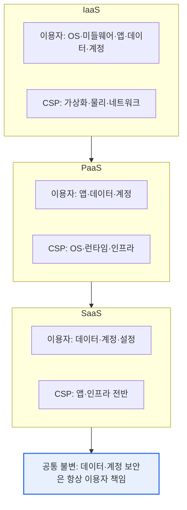
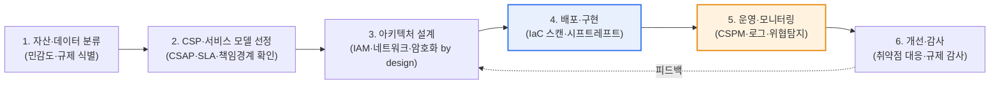

# 클라우드 서비스 도입 시 보안 고려 요소

## 1. 개요

### 가. 정의
> 클라우드 도입 시 보안 고려 요소란 기업이 클라우드 서비스를 채택·운영할 때 **데이터·접근·규제·운영 전반에서 검토·확보해야 할 보안 통제 항목의 집합**을 말한다. 온프레미스와 근본적으로 다른 클라우드 특유의 위험(책임 분담, 인터넷 노출, 다중 임차, 동적 확장)에 대응하기 위한 것이다.

클라우드 보안이 어려운 근본 이유는 '**통제권의 일부가 클라우드 사업자(CSP)로 넘어가는**' 책임공유모델(Shared Responsibility Model)에 있다. 온프레미스에서는 기업이 물리 서버부터 데이터까지 모든 계층을 직접 통제했지만, 클라우드에서는 물리 인프라·하이퍼바이저는 CSP가, 데이터·계정·접근·설정은 이용자가 책임진다. 문제는 이 책임 경계를 오해할 때 발생한다. "클라우드니까 CSP가 알아서 보안을 챙기겠지"라고 방심하면, 정작 이용자 책임인 접근 권한 관리나 저장소 설정을 소홀히 해 사고가 난다.

실제로 대부분의 클라우드 유출 사고는 CSP의 인프라 해킹이 아니라, 이용자 측의 **설정 오류(공개로 열린 스토리지 버킷)나 계정·키 탈취**에서 비롯된다. Gartner가 오래전부터 "2025년까지 클라우드 보안 사고의 99%는 고객 책임"이라고 경고해 온 것도 이 때문이다. 따라서 클라우드 보안의 출발점은 화려한 신기술이 아니라 "**내가 무엇을 책임지는가**"를 정확히 아는 것이며, 그 위에서 데이터·접근·설정을 체계적으로 통제하는 것이 요체다.

### 나. 필요성과 등장 배경
클라우드는 확장성·민첩성·비용(CapEx→OpEx 전환) 이점을 주지만, 인터넷에 상시 노출되고 다수 테넌트가 물리 자원을 공유하며, IaC(코드형 인프라)로 자원이 순식간에 대량 생성되는 특성상 온프레미스에 없던 **새로운 공격 표면(attack surface)** 을 만든다. 특히 개발·배포가 빨라진 만큼 보안 검토가 뒤처지는 '보안 부채'가 쌓이기 쉽다. 그래서 도입 전 단계부터 보안 요소를 체계적으로 검토하고 아키텍처에 내재화(security by design)해야, 클라우드의 이점을 안전하게 누릴 수 있다. 이는 단순 기술 도입이 아니라 거버넌스·프로세스·인력을 아우르는 전사적 과제다.

## 2. 책임공유모델 — 통제 경계의 이동

책임공유모델은 클라우드 보안의 뼈대다. 핵심은 서비스 모델(IaaS·PaaS·SaaS)에 따라 CSP와 이용자의 책임 경계가 이동한다는 점이며, 어느 모델에서든 **데이터와 계정(접근권한)의 보안은 언제나 이용자 몫**으로 남는다는 것이다. 아래 구조도는 이 경계 이동을 나타낸다.

IaaS에서는 이용자가 OS·미들웨어·런타임까지 직접 책임지므로 패치·하드닝 부담이 크다. 반대로 SaaS에서는 CSP가 앱까지 운영하므로 이용자는 데이터 분류·접근권한·공유설정에 집중하면 된다. 이 차이를 인지하지 못하면, 예컨대 IaaS 위에 올린 데이터베이스의 OS 패치를 CSP가 해줄 것으로 오해해 방치하는 사고가 생긴다. 따라서 도입하려는 서비스 모델별로 '내 책임 목록'을 문서화하는 것이 첫 단계다.

## 3. 주요 보안 고려 요소 — 데이터부터 공급망까지

클라우드 도입 시에는 데이터부터 운영까지 여러 요소를 계층적으로 검토해야 한다. 아래 표는 전체 요소를 조망하기 위한 것이며, 각 요소의 '왜'와 실무 함의는 표 뒤에서 산문으로 설명한다.

| 요소 | 핵심 고려 사항 |
|---|---|
| **데이터 보안** | 저장·전송 암호화, 키 관리(KMS/HSM), 데이터 위치·주권, 백업·파기 |
| **접근 통제(IAM)** | 최소권한, MFA, 역할 기반(RBAC), 키·비밀 관리, 권한 과다 점검(CIEM) |
| **설정 보안** | 잘못된 구성 방지, 지속 점검(CSPM), IaC 스캔 |
| **네트워크** | 망분리·보안그룹·방화벽, 제로트러스트, 프라이빗 연결 |
| **가시성·모니터링** | 로그·감사(CloudTrail 등), 위협 탐지, SIEM 연계 |
| **규제·인증** | CSAP·ISMS-P, 개인정보보호법·GDPR, 산업별 규제 |
| **연속성** | 가용성·다중 AZ/리전, DR, Exit(종료·전환) 전략 |
| **공급망** | 컨테이너·이미지 취약점, IaC·SBOM, 오픈소스 검증 |

**첫째, 데이터 보안**은 모든 통제의 최종 보호 대상이다. 저장 데이터(at-rest)와 전송 데이터(in-transit)를 모두 암호화하되, 진짜 관건은 **키 관리**다. CSP 관리형 키(SSE)는 편리하지만 규제·주권 요구가 강하면 고객 관리 키(BYOK/CMK)나 HSM을 써야 한다. 또한 데이터가 물리적으로 어느 국가에 저장·처리되는지(데이터 주권)를 확인해야 하며, 예컨대 국내 개인정보를 해외 리전에 두면 법적 문제가 생길 수 있다. 백업의 무결성과 안전한 파기(암호화 키 폐기를 통한 crypto-shredding 포함)까지 데이터 생애주기 전체를 설계해야 한다.

**둘째, 접근 통제(IAM)** 는 클라우드 사고의 최전선이다. 클라우드는 관리 콘솔·API가 인터넷에 열려 있어, 계정 하나가 탈취되면 전체 인프라가 노출된다. 그래서 **최소권한 원칙**, **모든 관리자 계정 MFA 강제**, **장기 액세스 키 지양(단기 토큰·역할 위임 사용)** 이 필수다. 나아가 시간이 지나며 쌓이는 과다 권한을 자동 탐지·회수하는 **CIEM(클라우드 인프라 권한 관리)** 이 최근 부각된다. 실제 다수의 유출 사고가 방치된 액세스 키나 과도하게 넓은 IAM 정책에서 비롯되었다.

**셋째, 설정 보안**은 클라우드 특유의 최대 위험원이다. 공개로 잘못 설정된 스토리지 버킷, 열린 보안그룹, 비활성화된 로깅 같은 **오구성(misconfiguration)** 이 실제 사고의 다수를 차지한다. 이를 사람이 일일이 점검하기는 불가능하므로, **CSPM(Cloud Security Posture Management)** 으로 설정을 지속 스캔하고, 나아가 배포 전 **IaC(Terraform 등) 코드 단계에서 오구성을 잡는 시프트-레프트** 방식이 정착되고 있다. "만들고 나서 고치는" 것이 아니라 "만들기 전에 막는" 전환이 핵심이다.

**넷째, 네트워크·가시성·규제·연속성·공급망**도 병행해야 한다. 네트워크는 보안그룹·프라이빗 연결로 노출을 줄이고 내부도 신뢰하지 않는 **제로트러스트**로 접근을 통제한다. 가시성 측면에서는 API 호출 로그·감사 기록을 남겨 사고 시 추적이 가능해야 하고, 이를 SIEM과 연계해 이상행위를 탐지한다. 규제 측면에서는 공공 클라우드라면 **CSAP(클라우드 보안인증)**, 민간이라도 **ISMS-P·개인정보보호법·GDPR** 등을 준수해야 하며, 이는 도입 전 CSP 선정 기준에 포함된다. 연속성 관점에서는 다중 가용영역(AZ)·리전과 DR 설계, 그리고 특정 CSP에 발이 묶이지 않도록 데이터·워크로드를 회수·이전할 수 있는 **Exit(종료·전환) 전략**을 미리 마련해야 한다. 마지막으로 컨테이너 이미지·오픈소스·IaC의 취약점을 **SBOM(소프트웨어 자재명세서)** 으로 투명화하는 **공급망 보안**이 최근 필수 요소로 떠올랐다.

### 가. 도입 단계별 보안 내재화 절차
위 요소들은 도입 프로세스의 각 단계에 배치되어야 실효를 갖는다. 보안을 사후 점검이 아니라 도입 생애주기에 내재화하는 흐름은 다음과 같다.

이 절차에서 가장 흔한 실패는 1~3단계(설계)를 건너뛰고 바로 배포로 넘어가는 것이다. 데이터 민감도 분류 없이 클라우드에 올리면 어디에 어떤 통제를 걸어야 할지 판단할 수 없고, 책임 경계를 확정하지 않으면 통제 공백이 생긴다. 따라서 보안은 배포 이후 덧붙이는 것이 아니라 자산 분류·CSP 선정 단계부터 설계에 반영되어야 하며, 운영 단계의 CSPM·모니터링 결과가 다시 설계로 피드백되는 순환 구조(PDCA)를 갖춰야 한다. 실제로 오구성 사고의 상당수는 배포 자동화(IaC)에는 투자하면서 그 코드에 대한 보안 검증(4단계)은 생략한 조직에서 발생한다.

## 4. 사례와 비교 — 온프레미스 대비 무엇이 달라지는가

온프레미스와 클라우드 보안의 차이는 '경계'의 성격에서 온다. 아래 비교는 단순 항목 나열이 아니라, 왜 접근 방식을 바꿔야 하는지를 보여준다.

| 구분 | 온프레미스 | 클라우드 |
|---|---|---|
| 통제 범위 | 전 계층 직접 통제 | 책임공유(계층별 분담) |
| 경계 모델 | 물리 경계·경계형 방화벽 | 경계 소멸→ 제로트러스트·ID 중심 |
| 주요 위험 | 물리 침입·내부망 | 오구성·계정 탈취·공개 노출 |
| 변화 속도 | 느림(수동 프로비저닝) | 빠름(IaC·자동 확장) |
| 보안 방식 | 사후 점검 중심 | 지속 점검·시프트-레프트 |

온프레미스에서는 방화벽으로 감싼 내부망을 '신뢰 구역'으로 두는 경계형 보안이 통했다. 그러나 클라우드는 자원이 인터넷에 노출되고 ID·API로 접근하므로 경계가 사실상 사라진다. 그래서 "위치가 아니라 ID를 신뢰의 기준으로 삼는" 제로트러스트로 패러다임이 이동한다.

구체 사례로, 2019년 대형 금융사에서 잘못 설정된 클라우드 방화벽(WAF)과 과다 권한 IAM 역할이 결합해 1억 건 이상의 고객 정보가 유출된 사건은, 인프라 자체가 뚫린 것이 아니라 **이용자 측 오구성·권한 관리 실패**가 원인이었다. 이 사례는 앞서 강조한 "사고의 다수는 고객 책임"을 상징적으로 보여준다. 또 다른 사례로, 국내 공공기관이 민간 클라우드를 도입할 때는 CSAP 인증을 받은 CSP만 이용할 수 있어, 도입 초기부터 규제 준수가 CSP 선택을 좌우한다. 이처럼 클라우드 보안은 기술뿐 아니라 규제·거버넌스와 얽혀 있다.

## 5. 심화 — CNAPP·제로트러스트로의 통합과 최신 동향

초기 클라우드 보안은 CSPM(설정)·CWPP(워크로드)·CIEM(권한)·컨테이너 보안 등이 각각 별도 도구로 존재해, 경보가 파편화되고 우선순위 판단이 어려웠다. 최근 시장은 이들을 하나로 묶는 **CNAPP(Cloud-Native Application Protection Platform)** 로 수렴하고 있다. CNAPP는 코드(IaC)부터 런타임까지 애플리케이션 생애주기 전반의 위험을 통합 가시화하고, 여러 신호를 상호 연관(context)해 "실제로 악용 가능한 위험"을 우선순위화한다. 시장 조사기관들은 향후 수년 내 상당수 기업이 통합 CNAPP를 도입하지 않으면 클라우드 공격 표면에 대한 폭넓은 가시성을 확보하기 어려울 것으로 전망한다(정확한 수치·연도는 보고서마다 다르므로 일반화한다).

또 하나의 축은 **시프트-레프트(Shift-Left)** 와 **제로트러스트**의 결합이다. 시프트-레프트는 보안을 운영 단계가 아니라 개발 초기(코드·CI/CD)로 당겨, 오구성·취약 이미지가 운영에 유입되기 전에 차단한다. 제로트러스트는 내부·외부를 가리지 않고 모든 접근을 검증(never trust, always verify)해, 계정 탈취가 발생해도 횡적 이동(lateral movement)을 최소화한다. 두 접근은 각각 '유입 차단'과 '침해 확산 억제'를 담당하며, CNAPP가 이를 통합 운영하는 플랫폼 역할을 한다.

또한 규제 측면에서도 변화가 빠르다. 국내에서는 공공부문 민간 클라우드 이용을 넓히면서 CSAP를 '상·중·하' 등급으로 세분화해 시스템 중요도에 따라 차등 적용하려는 방향이 논의·정착되고 있고, 국제적으로는 공급망 투명성 요구가 강해지며 SBOM 제출이 조달 요건으로 확산되는 추세다(세부 등급 기준·시행 시점은 정책에 따라 달라질 수 있어 일반화한다). 이는 클라우드 보안이 기술 통제를 넘어 **규제 대응·조달 요건**과 직결됨을 의미하므로, 도입 조직은 기술팀뿐 아니라 컴플라이언스·법무와 협업해 지속적으로 규제 변화를 추적해야 한다.

기술사 관점의 답안 전략으로는, 클라우드 보안 요소를 단순 나열하는 데 그치지 말고 **① 책임공유모델(전제) → ② 데이터·IAM·설정 등 핵심 통제(본론) → ③ CNAPP·제로트러스트·시프트-레프트로의 통합(발전 방향)** 이라는 3단 흐름으로 구조화하는 것이 고득점에 유리하다. 특히 "사고의 다수가 오구성·계정 관리에서 비롯된다"는 실증적 근거를 제시하면 논지가 설득력을 얻는다.

## 6. 고려사항 및 시사점

1. **책임공유모델의 이해가 보안의 출발점**이다. 선택한 서비스 모델(IaaS/PaaS/SaaS)에서 자신이 책임지는 영역(항상 데이터·계정 포함)을 명확히 문서화하고, 그에 맞는 통제를 배치해야 한다. 경계 오해는 곧 통제 공백으로 이어진다.
2. **설정 오류·계정 관리가 최대 위험**이다. 공개된 스토리지, 과도한 권한, 유출된 액세스 키가 실제 사고의 다수를 차지하므로, CSPM(설정 점검)·IAM/CIEM(권한 관리)·MFA를 최우선으로 강화하고, 배포 전 IaC 단계에서 오구성을 차단해야 한다.
3. **규제·데이터 주권을 도입 초기부터 반영**한다. 공공은 CSAP, 민간은 ISMS-P·개인정보보호법·GDPR 등 적용 규제를 CSP 선정 기준에 포함하고, 데이터의 물리적 저장 위치와 국외 이전 요건을 사전에 검토해 법적 리스크를 제거한다.
4. **연속성과 Exit 전략으로 종속을 대비**한다. 다중 AZ·리전·DR로 가용성을 확보하고, 특정 CSP에 락인(lock-in)되지 않도록 데이터·워크로드 이전 가능성과 계약상 회수 조건을 미리 확보해 협상력과 회복력을 유지한다.
5. **CNAPP·제로트러스트로 통합 관리하는 방향으로 발전**한다. 파편화된 개별 도구 대신 워크로드·설정·권한·공급망을 통합 점검하는 CNAPP를 도입하고, 시프트-레프트로 유입을 막고 제로트러스트로 확산을 억제하는 다층 방어를 지향해야 한다.

## 참고자료
- CNAPP 개념(Wiz Academy): https://www.wiz.io/academy/cloud-security/what-is-a-cloud-native-application-protection-platform-cnapp
- 2025 CSPM 도구 개요(SentinelOne): https://www.sentinelone.com/cybersecurity-101/cloud-security/cspm-tools/
- 한국 클라우드 보안인증(CSAP) 제도 안내(KISA): https://isms.kisa.or.kr/main/csap/intro/

---

> **한 줄 요약**: 클라우드 도입 시 *책임공유모델을 전제로 데이터 암호화·키 관리, IAM/CIEM, 설정보안(CSPM), 네트워크·가시성, 규제(CSAP)·데이터 주권, 연속성·Exit, 공급망(SBOM)* 을 계층적으로 검토해야 하며, 사고의 다수가 오구성·계정 관리에서 비롯되므로 CSPM·IAM·시프트-레프트와 CNAPP·제로트러스트 통합으로 대응한다.
