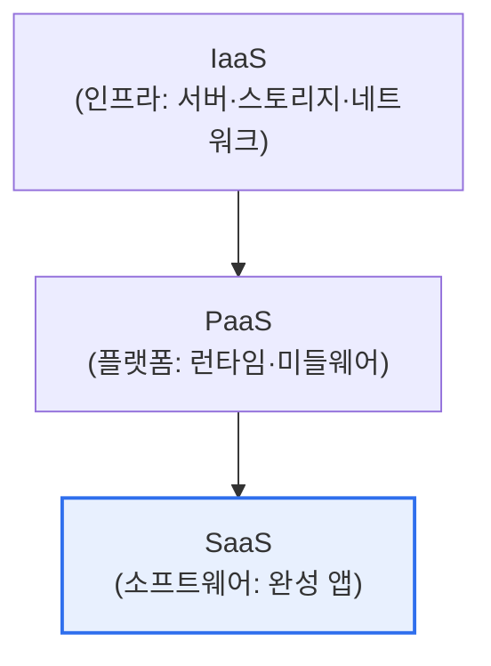

# 클라우드 컴퓨팅의 Service Model과 Deployment Model

## 1. 개요

### 가. 정의
> **서비스 모델(Service Model)** 은 클라우드가 제공하는 자원의 추상화 수준(IaaS·PaaS·SaaS)을, **배포 모델(Deployment Model)** 은 클라우드 인프라의 소유·운영 형태(퍼블릭·프라이빗·하이브리드·커뮤니티)를 구분한다. NIST 클라우드 정의의 두 축이다.

두 모델은 각각 "**무엇을 빌릴 것인가(서비스)**"와 "**어디에 둘 것인가(배포)**"를 답한다. 서비스 모델은 사용자가 관리할 범위와 책임을, 배포 모델은 보안·비용·통제권의 수준을 결정한다.

## 2. Service Model (IaaS·PaaS·SaaS)

| 모델 | 제공 범위 | 사용자 관리 | 예 |
|---|---|---|---|
| **IaaS** | 가상 인프라(서버·스토리지) | OS·미들웨어·앱 | EC2, GCE |
| **PaaS** | 개발·실행 플랫폼 | 앱·데이터 | App Engine, Heroku |
| **SaaS** | 완성된 애플리케이션 | 데이터·설정만 | Gmail, Salesforce |

> 위로 갈수록 사용자 관리 부담↓, 추상화·편의성↑ (책임공유모델의 경계 이동)

## 3. Deployment Model

| 모델 | 설명 | 특징 |
|---|---|---|
| **퍼블릭** | CSP가 다수에 공개 제공 | 저비용·확장성, 통제 제한 |
| **프라이빗** | 단일 조직 전용 | 보안·통제 강함, 비용↑ |
| **하이브리드** | 퍼블릭+프라이빗 결합 | 유연성, 민감데이터는 프라이빗 |
| **커뮤니티** | 공동 관심 조직 공유 | 규제·표준 공유(금융·공공) |

## 4. 시사점
- 워크로드 특성(민감도·확장성·비용)에 맞춰 **서비스×배포 모델 조합** 선택
- 멀티클라우드·하이브리드가 주류 — 벤더 종속(Lock-in) 완화
- 책임공유모델 이해가 보안의 출발점

---

> **한 줄 요약**: 서비스 모델(IaaS·PaaS·SaaS)은 자원의 추상화 수준과 관리 범위를, 배포 모델(퍼블릭·프라이빗·하이브리드·커뮤니티)은 소유·통제 형태를 규정하며, 워크로드 특성에 맞게 조합해 선택한다.
