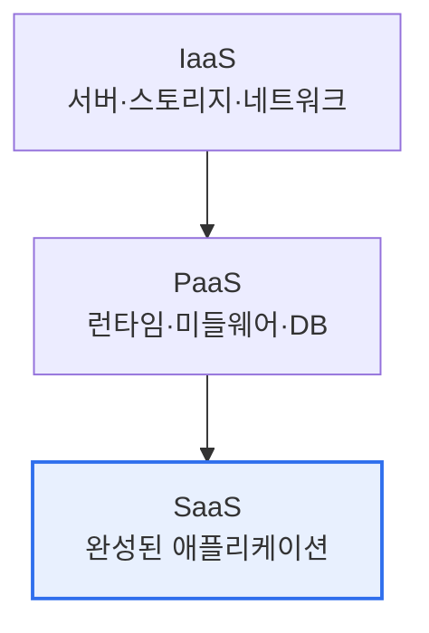

# 클라우드 컴퓨팅의 Service Model과 Deployment Model

## 1. 개요

### 가. 정의
> **서비스 모델(Service Model)** 은 클라우드가 자원을 어느 수준까지 추상화해 제공하는지(IaaS·PaaS·SaaS)를, **배포 모델(Deployment Model)** 은 클라우드 인프라를 누가 소유·운영하며 누구에게 제공하는지(퍼블릭·프라이빗·하이브리드·커뮤니티)를 구분한다. NIST 클라우드 정의를 이루는 두 축이다.

두 모델은 각각 다른 질문에 답한다. 서비스 모델은 "**무엇을 빌리고, 무엇을 내가 관리할 것인가**"를, 배포 모델은 "**그것을 어디에 두고, 통제권을 얼마나 가질 것인가**"를 결정한다. 이 둘을 이해하는 열쇠는 **책임공유모델(Shared Responsibility)** 이다. 클라우드는 사업자(CSP)와 이용자가 관리 책임을 나눠 갖는데, 서비스 모델에 따라 그 경계선이 움직인다. 즉 어떤 모델을 고르느냐가 곧 내가 얼마나 관리하고 얼마나 책임지는지를 정한다.

## 2. Service Model (IaaS·PaaS·SaaS)

세 모델은 '피자를 먹는 방법'에 비유하면 직관적이다. **IaaS** 는 밀가루·오븐(가상 서버·스토리지)을 빌려 직접 반죽부터 하는 것으로, 자유도가 가장 높지만 OS·미들웨어·앱을 모두 내가 관리한다. **PaaS** 는 반조리 도우(개발 플랫폼)를 받아 토핑(앱 코드)만 얹는 것으로, 개발자는 인프라를 신경 쓰지 않고 코드에 집중한다. **SaaS** 는 완성된 피자(Gmail·Salesforce)를 배달받는 것으로, 사용자는 데이터·설정만 관리하면 된다. 위로 갈수록 편의성·추상화가 높아지고 관리 부담과 자유도는 낮아진다.

| 모델 | 제공 범위 | 이용자 관리 영역 | 예시 |
|---|---|---|---|
| **IaaS** | 가상 인프라(서버·스토리지·네트워크) | OS·미들웨어·런타임·앱·데이터 | AWS EC2, GCE |
| **PaaS** | 개발·실행 플랫폼 | 앱·데이터 | App Engine, Heroku |
| **SaaS** | 완성 애플리케이션 | 데이터·설정만 | Gmail, Salesforce |

이 계층 이동이 곧 책임공유모델의 경계 이동이다. SaaS를 쓰면 편하지만 보안 통제 상당 부분을 CSP에 맡기게 되고, IaaS를 쓰면 통제권은 크지만 그만큼 보안 책임도 이용자가 진다.

## 3. Deployment Model

배포 모델은 보안·통제와 비용·확장성 사이의 트레이드오프에서 결정된다. **퍼블릭**은 자원을 다수가 공유해 저렴하고 무한 확장되지만 통제권이 제한적이고, **프라이빗**은 단일 조직 전용이라 보안·통제가 강하지만 비용이 높다. 현실에서는 이 둘을 조합한 **하이브리드**가 주류인데, 민감 데이터는 프라이빗에, 변동 큰 워크로드는 퍼블릭에 두는 식으로 각 장점을 취한다. **커뮤니티**는 금융·공공처럼 규제·요건을 공유하는 조직들이 공동으로 사용하는 형태다.

| 모델 | 소유·제공 형태 | 특징 |
|---|---|---|
| **퍼블릭** | CSP가 불특정 다수에 제공 | 저비용·무한 확장, 통제 제한 |
| **프라이빗** | 단일 조직 전용 | 보안·통제 강함, 비용 높음 |
| **하이브리드** | 퍼블릭+프라이빗 결합 | 유연성, 민감데이터 격리 |
| **커뮤니티** | 공동 관심 조직 공유 | 규제·표준 공유(금융·공공) |

## 4. 고려사항 및 시사점

1. **워크로드 특성에 맞는 서비스×배포 모델의 조합**이 핵심이다. 예컨대 민감정보를 다루는 코어 뱅킹은 프라이빗+IaaS로 통제권을 유지하고, 협업 도구는 퍼블릭+SaaS로 편의성을 취하는 식이다.
2. **멀티클라우드·하이브리드가 표준**이 되면서 특정 CSP에 종속되는 락인(Lock-in)을 완화하고 가용성을 높이는 전략이 중요해졌다.
3. **책임공유모델의 이해가 클라우드 보안의 출발점**이다. 대부분의 클라우드 사고(설정 오류·계정 탈취)는 CSP가 아니라 이용자 책임 영역에서 발생하므로, 선택한 모델에서 자신이 무엇을 책임지는지 명확히 인지해야 한다.

---

> **한 줄 요약**: 서비스 모델(IaaS·PaaS·SaaS)은 자원의 추상화 수준과 관리·책임 범위를, 배포 모델(퍼블릭·프라이빗·하이브리드·커뮤니티)은 소유·통제 형태를 규정하며, 책임공유모델을 이해하고 워크로드 특성에 맞게 조합·선택하는 것이 핵심이다.
