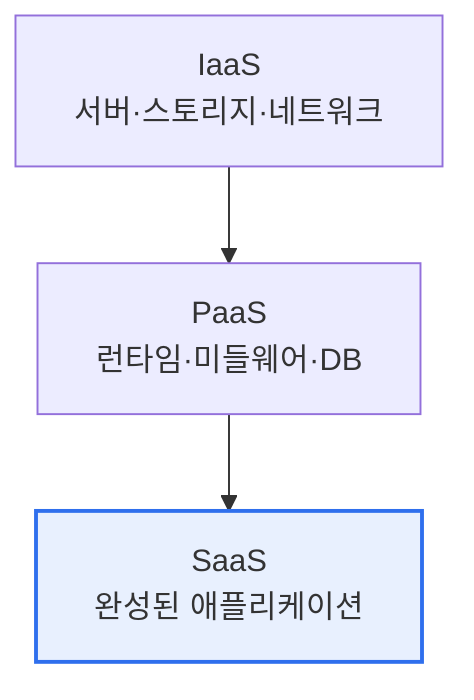
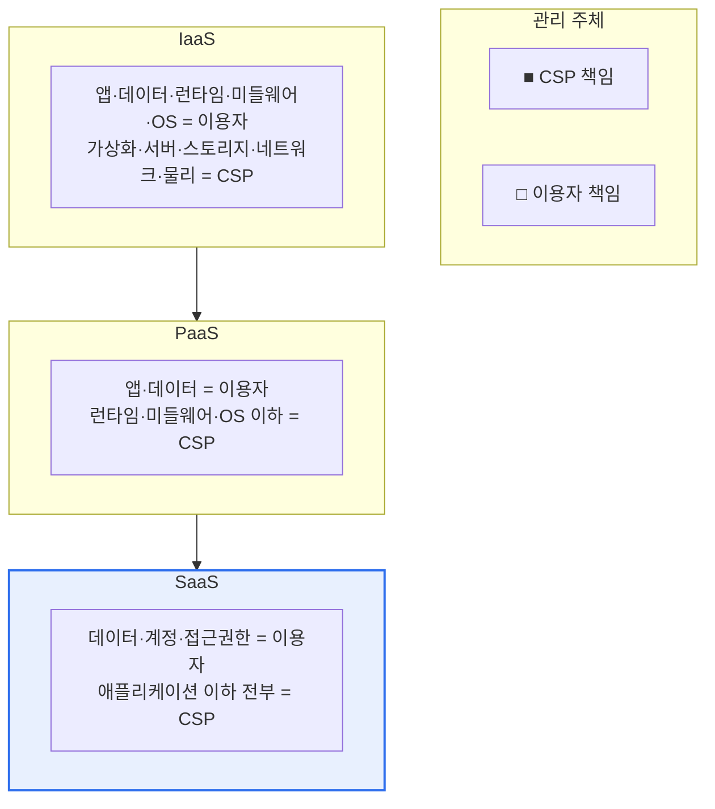

# 클라우드 컴퓨팅의 Service Model과 Deployment Model

## 1. 개요

### 가. 정의

> **서비스 모델(Service Model)** 은 클라우드가 컴퓨팅 자원을 어느 수준까지 추상화해 제공하는지(IaaS·PaaS·SaaS)를, **배포 모델(Deployment Model)** 은 클라우드 인프라를 누가 소유·운영하며 누구에게 제공하는지(퍼블릭·프라이빗·하이브리드·커뮤니티)를 구분하는 두 축이다. 미국 표준기술연구소의 **NIST SP 800-145** 클라우드 정의에서 5대 필수 특성과 함께 클라우드를 규정하는 뼈대를 이룬다.

두 모델은 서로 다른 질문에 답한다. 서비스 모델은 "**무엇을 빌리고, 무엇을 내가 관리할 것인가**"라는 추상화·책임의 문제를, 배포 모델은 "**그것을 어디에 두고, 통제권을 얼마나 가질 것인가**"라는 소유·통제의 문제를 결정한다. 따라서 실제 클라우드 도입은 이 두 축을 곱해 조합(예: 퍼블릭×SaaS, 프라이빗×IaaS)하는 의사결정이며, 어느 조합을 고르느냐가 비용·보안·민첩성의 균형을 좌우한다.

### 나. 등장 배경과 필요성

클라우드가 등장하기 전 기업은 서비스를 올리기 위해 서버를 직접 구매하고(자본지출·CAPEX), 수개월의 조달·설치를 감내하며, 최대 부하에 맞춰 자원을 과다 확보(Over-provisioning)해야 했다. 이 방식은 초기 비용이 크고, 수요 변동에 느리게 반응하며, 유휴 자원이 낭비되는 구조적 한계를 안고 있었다. 클라우드는 이를 **주문형(On-demand)·종량제(Pay-as-you-go)·탄력적 확장(Elasticity)** 모델로 전환해, 자본지출을 운영지출(OPEX)로 바꾸고 필요한 만큼만 즉시 빌려 쓰게 만들었다.

이때 "어느 수준까지 빌릴 것인가(서비스 모델)"와 "어디에 둘 것인가(배포 모델)"를 표준 언어로 정리할 필요가 생겼고, NIST가 이를 정의하면서 오늘날 통용되는 분류 체계가 확립되었다. 이 두 모델을 이해하는 핵심 열쇠는 **책임 공유 모델(Shared Responsibility Model)** 이다. 클라우드는 사업자(CSP)와 이용자가 관리·보안 책임을 나눠 갖는데, 어떤 서비스 모델을 고르느냐에 따라 그 책임 경계선이 이동한다. 즉 모델 선택은 곧 '내가 무엇을 관리하고 무엇에 책임지는가'를 정하는 행위다.

## 2. Service Model (IaaS·PaaS·SaaS)

```mermaid
flowchart TB
  I["IaaS<br/>서버·스토리지·네트워크"] --> P["PaaS<br/>런타임·미들웨어·DB"] --> S["SaaS<br/>완성된 애플리케이션"]
  style S fill:#e8f0fe,stroke:#2f6fed,stroke-width:2px
```

세 모델은 흔히 '피자를 먹는 방법'에 비유하면 직관적이다. 이 비유가 유효한 이유는, 세 모델의 본질적 차이가 '**어디까지 내가 하고 어디부터 남이 해주는가**'라는 관리 책임의 분할선에 있기 때문이다.

**가. IaaS(Infrastructure as a Service).** 밀가루·오븐(가상 서버·스토리지·네트워크)을 빌려 직접 반죽부터 하는 방식이다. 자유도가 가장 높지만 OS·미들웨어·런타임·애플리케이션을 모두 이용자가 설치·패치·운영한다. 가상머신을 직접 띄우고 OS를 설치하는 AWS EC2, Google Compute Engine이 대표적이다. 레거시 애플리케이션을 클라우드로 그대로 옮기는 '리프트 앤 시프트(Lift & Shift)' 마이그레이션에서 첫 진입점으로 많이 쓰인다.

**나. PaaS(Platform as a Service).** 반조리 도우(개발·실행 플랫폼)를 받아 토핑(앱 코드)만 얹는 방식이다. 개발자는 OS 패치·미들웨어 구성·용량 관리 같은 인프라 잡무에서 해방되어 오직 코드에 집중한다. Google App Engine, Heroku, AWS Elastic Beanstalk 등이 여기에 해당하며, 최근에는 컨테이너·서버리스(FaaS, 예: AWS Lambda)로 추상화가 더 진전되어 '이벤트가 발생할 때만 함수가 실행되고 그만큼만 과금'되는 형태로 진화했다.

**다. SaaS(Software as a Service).** 완성된 피자(Gmail·Salesforce)를 배달받는 방식이다. 사용자는 소프트웨어를 설치·운영하지 않고 웹 브라우저로 접속해 데이터·설정만 관리한다. 도입이 가장 빠르고 관리 부담이 최소이지만, 반대로 커스터마이징 자유도와 보안 통제권이 가장 제한된다. 오늘날 기업이 쓰는 협업·CRM·인사 도구 상당수가 SaaS다.

최근에는 이 세 계층 사이에 **FaaS(Function as a Service, 서버리스)** 와 **CaaS(Container as a Service)** 가 끼어들며 스펙트럼이 더 촘촘해졌다. FaaS는 PaaS를 극단까지 추상화해, 서버를 '항상 켜두는' 것이 아니라 요청·이벤트가 발생하는 순간에만 함수를 실행하고 실행 시간만큼만 과금한다. 유휴 시 비용이 0에 수렴하므로 간헐적·이벤트성 워크로드에 매우 경제적이지만, 실행 지연(Cold Start)과 벤더 종속이 커진다는 대가가 따른다. 이처럼 IaaS→SaaS의 축은 이산적 3단계가 아니라 '내가 관리하는 몫'이 점차 줄어드는 연속적 스펙트럼으로 이해하는 것이 실무에 가깝다.

정리하면 **위로 올라갈수록(IaaS→SaaS) 편의성·추상화·도입 속도가 높아지고, 관리 부담과 통제 자유도는 낮아진다.** 이 계층 이동이 곧 다음 절에서 볼 책임 공유 모델의 경계 이동이다.

| 모델 | 제공 범위 | 이용자 관리 영역 | 대표 예시 |
|---|---|---|---|
| **IaaS** | 가상 인프라(서버·스토리지·네트워크) | OS·미들웨어·런타임·앱·데이터 | AWS EC2, GCE, Azure VM |
| **PaaS** | 개발·실행 플랫폼(런타임·DB·미들웨어) | 앱·데이터 | App Engine, Heroku, Beanstalk |
| **SaaS** | 완성 애플리케이션 | 데이터·설정·사용자 계정만 | Gmail, Salesforce, M365 |

## 3. 책임 공유 모델 — 두 모델을 잇는 핵심

```mermaid
flowchart TB
  subgraph LEG["관리 주체"]
    direction LR
    C["■ CSP 책임"]
    U["□ 이용자 책임"]
  end
  subgraph IAAS["IaaS"]
    IA["앱·데이터·런타임·미들웨어·OS = 이용자<br/>가상화·서버·스토리지·네트워크·물리 = CSP"]
  end
  subgraph PAAS["PaaS"]
    PA["앱·데이터 = 이용자<br/>런타임·미들웨어·OS 이하 = CSP"]
  end
  subgraph SAAS["SaaS"]
    SA["데이터·계정·접근권한 = 이용자<br/>애플리케이션 이하 전부 = CSP"]
  end
  IAAS --> PAAS --> SAAS
  style SAAS fill:#e8f0fe,stroke:#2f6fed,stroke-width:2px
```

책임 공유 모델은 서비스 모델과 배포 모델을 잇는 다리다. 원칙은 "**클라우드 자체의 보안(Security *of* the Cloud)은 CSP가, 클라우드 안에서의 보안(Security *in* the Cloud)은 이용자가**"이다. 물리 시설·하드웨어·가상화 계층은 어느 모델에서나 CSP가 책임지지만, 그 위 계층의 책임 경계선은 서비스 모델에 따라 위아래로 움직인다.

IaaS에서는 OS 패치, 방화벽·보안그룹 설정, 미들웨어 취약점 관리까지 대부분이 이용자 몫이다. PaaS로 올라가면 OS·런타임 관리가 CSP로 넘어가 이용자는 애플리케이션 코드와 데이터 보안에 집중하면 된다. SaaS에서는 애플리케이션까지 CSP가 책임지므로 이용자에게는 **데이터·계정·접근 권한 관리**만 남는다. 그러나 바로 이 '남은 몫'이 사고의 핵심 원인이라는 점이 중요하다. 실제 클라우드 침해의 대다수는 CSP의 인프라가 뚫려서가 아니라, 이용자가 책임지는 영역 — 잘못된 S3 버킷 공개 설정, 과도한 IAM 권한, 계정 탈취 — 에서 발생한다. 어떤 모델을 쓰든 '내가 책임지는 경계'를 정확히 인지하지 못하면 보안 공백이 생긴다.

| 계층 | IaaS | PaaS | SaaS |
|---|---|---|---|
| 데이터·계정·접근권한 | 이용자 | 이용자 | 이용자 |
| 애플리케이션 | 이용자 | 이용자 | CSP |
| 런타임·미들웨어·OS | 이용자 | CSP | CSP |
| 가상화·서버·스토리지·네트워크·물리 | CSP | CSP | CSP |

## 4. Deployment Model (배포 모델)

배포 모델은 **보안·통제와 비용·확장성 사이의 트레이드오프**에서 결정된다. 이 트레이드오프를 이해하지 못하고 무조건 '퍼블릭이 싸다' 또는 '프라이빗이 안전하다'고 단정하면 실제 워크로드에 맞지 않는 선택을 하기 쉽다.

**가. 퍼블릭 클라우드.** CSP가 불특정 다수에게 자원을 공유 제공한다. 규모의 경제로 저렴하고 사실상 무한대로 확장되며 초기 투자 없이 즉시 시작할 수 있다. 다만 자원을 다른 테넌트와 공유(멀티테넌시)하므로 물리적 격리 수준의 통제나 특수 규제 대응에는 제약이 따른다. 변동성 큰 웹 서비스, 스타트업, 개발·테스트 환경에 적합하다.

**나. 프라이빗 클라우드.** 단일 조직 전용으로 구축·운영한다. 자원을 독점하므로 보안·통제·규제 준수가 강하고 성능 예측이 쉽지만, 인프라를 직접 갖추고 운영해야 하므로 비용이 높고 탄력성은 상대적으로 낮다. 금융 코어 시스템, 국방·의료처럼 데이터 주권·규제가 엄격한 영역에서 선택된다.

**다. 하이브리드 클라우드.** 퍼블릭과 프라이빗을 결합하고 이를 오케스트레이션으로 연동한다. 현실 기업 대다수가 채택하는 주류 형태로, 민감 데이터·핵심 시스템은 프라이빗에 두고 변동 큰 워크로드·대외 서비스는 퍼블릭에 두어 각각의 장점을 취한다. 평시에는 프라이빗으로 운영하다 트래픽 폭증 시 퍼블릭으로 넘기는 **클라우드 버스팅(Cloud Bursting)** 이 대표 활용 패턴이다.

**라. 커뮤니티 클라우드.** 금융·공공처럼 규제·보안 요건을 공유하는 여러 조직이 공동으로 구축·사용한다. 국내의 공공기관 전용 클라우드(예: 행정·공공용 존)나 금융권 공동 인프라가 이 범주에 가깝다. 공동 부담으로 비용을 낮추면서도 공통 규제를 함께 만족시킨다는 장점이 있다.

| 모델 | 소유·제공 형태 | 장점 | 한계 | 적합 사례 |
|---|---|---|---|---|
| **퍼블릭** | CSP가 불특정 다수에 제공 | 저비용·무한 확장·즉시성 | 통제·격리 제한 | 스타트업, 대외 웹서비스 |
| **프라이빗** | 단일 조직 전용 | 보안·통제·규제 준수 강함 | 고비용·낮은 탄력성 | 금융 코어, 국방·의료 |
| **하이브리드** | 퍼블릭+프라이빗 결합 | 유연성, 민감데이터 격리 | 연동·운영 복잡성 | 대기업 주류 |
| **커뮤니티** | 공동 관심 조직 공유 | 규제·표준·비용 공유 | 참여 조직 간 조율 필요 | 금융·공공 공동 인프라 |

세 배포 모델의 트레이드오프를 구체 수치로 감각화하면 이해가 쉽다. 예를 들어 e-커머스 기업이 평소 초당 수백 건의 주문을 처리하다 대규모 할인 행사 때 순간적으로 수십 배의 트래픽을 받는다고 하자. 프라이빗만 쓴다면 피크에 맞춰 서버를 미리 수십 대 확보해야 하고, 행사가 끝난 뒤 그 자원은 대부분 유휴로 남아 낭비된다. 퍼블릭만 쓴다면 결제·개인정보 같은 민감 데이터까지 공유 인프라에 올려야 하는 부담이 생긴다. 하이브리드는 이 딜레마를 푼다. 결제·회원정보 코어는 프라이빗에 두어 통제하고, 상품 조회·프로모션 웹 프런트는 퍼블릭에 두었다가 행사 때만 오토스케일링으로 확장(클라우드 버스팅)한 뒤 종료하면 자원을 회수한다. 결과적으로 '민감 데이터의 통제'와 '탄력적 비용 효율'을 동시에 얻는다.

이 트레이드오프가 실무에서 중요한 이유는, 배포 모델 선택이 단순한 기술 취향이 아니라 **총소유비용(TCO)·규제 준수·사업 민첩성**을 동시에 가르는 경영 의사결정이기 때문이다. 초기 구축비(CAPEX)를 감수하고 통제를 얻을 것인가, 운영비(OPEX)로 전환해 민첩성을 얻을 것인가의 선택은 조직의 재무 구조와 규제 환경에 따라 답이 달라진다.

## 5. 심화 — 멀티클라우드·클라우드 네이티브로의 진화와 국내 동향

배포 모델은 최근 '하이브리드'를 넘어 **멀티클라우드(Multi-cloud)** 로 확장되고 있다. 멀티클라우드는 두 개 이상의 퍼블릭 CSP(예: AWS+Azure+GCP)를 동시에 사용하는 전략으로, 특정 사업자 종속(Vendor Lock-in)을 완화하고, 각 CSP의 강점 서비스를 골라 쓰며, 리전 장애 시 가용성을 높이려는 목적에서 채택된다. 다만 이질적 플랫폼을 통합 관리해야 하므로 거버넌스·비용 관리(FinOps)·보안 정책 일관성이라는 새로운 난제가 생긴다.

서비스 모델 측면에서는 **컨테이너·쿠버네티스·서버리스**를 축으로 한 클라우드 네이티브(Cloud Native)가 IaaS와 PaaS의 경계를 흐리고 있다. 기업은 컨테이너를 통해 IaaS의 이식성과 PaaS의 생산성을 동시에 취하고, 온프레미스·퍼블릭 어디서나 동일하게 배포하는 하이브리드 운영을 실현한다. 여기에 최근에는 AI 워크로드가 급증하며 GPU 자원을 종량제로 제공하는 형태가 확산되고, 규제 대응을 위해 데이터를 특정 국가·리전 안에 묶어두는 **주권 클라우드(Sovereign Cloud)** 요구도 커지고 있다.

한편 배포 모델의 경계도 흐려지고 있다. AWS Outposts·Azure Stack·Google Anthos처럼 퍼블릭 CSP의 관리 체계를 고객 데이터센터 안으로 가져오는 **분산 클라우드(Distributed Cloud)** 가 등장하면서, '프라이빗의 통제 + 퍼블릭의 운영 편의'를 한 지점에서 취하는 형태가 확산됐다. 이는 배포 모델이 '어디에 두느냐'라는 이분법을 넘어 '어디서 관리하느냐'라는 축으로 다변화하고 있음을 보여준다.

국내에서는 공공 부문 클라우드 전환이 이 논의의 실전 무대다. 정부는 공공 시스템의 민간 클라우드 이용을 확대하면서, 보안 검증 체계인 **CSAP(클라우드 보안인증)** 를 상·중·하 등급제로 개편해 시스템 중요도에 따라 서로 다른 서비스·배포 모델을 적용하도록 유도하고 있다. 예컨대 낮은 등급 시스템은 논리적 분리를 허용해 퍼블릭·SaaS 활용의 문을 넓히고, 높은 등급은 물리적 분리를 요구해 사실상 전용(프라이빗·커뮤니티) 형태를 요구하는 식이다. 이는 '서비스×배포 모델의 조합을 규제 요건에 맞춰 선택'하는 원리가 실제 정책으로 구현된 사례다.

## 6. 고려사항 및 시사점 (기술사 관점)

1. **워크로드 특성에 맞는 서비스×배포 모델의 조합이 핵심이다.** 단일 정답은 없다. 민감정보를 다루는 코어 뱅킹은 프라이빗+IaaS로 통제권을 유지하고, 협업 도구는 퍼블릭+SaaS로 편의성을 취하며, 대외 웹서비스는 퍼블릭+PaaS로 민첩성을 얻는 식으로, 각 시스템의 규제·성능·변동성을 진단해 조합을 설계해야 한다.

2. **책임 공유 모델의 이해가 클라우드 보안의 출발점이다.** 대부분의 클라우드 사고(설정 오류·계정 탈취·과도 권한)는 CSP가 아니라 이용자 책임 영역에서 발생한다. 선택한 서비스 모델에서 '내가 어디까지 책임지는지'를 명확히 인지하고, 그 경계에 맞는 통제(IAM·암호화·설정 점검)를 갖추는 것이 보안의 기본이다.

3. **벤더 종속(Lock-in) 관리와 이식성 확보가 전략적 과제다.** 특정 CSP 고유 서비스에 깊이 의존할수록 전환 비용이 커진다. 컨테이너·표준 API·오픈소스 기반 설계, 멀티클라우드 아키텍처로 종속을 완화하고 협상력·가용성을 확보하는 전략이 필요하다.

4. **비용 최적화(FinOps)가 지속 운영의 관건이다.** 종량제는 방치하면 오히려 비용이 폭증한다. 유휴 자원 회수, 예약·스팟 인스턴스 활용, 오토스케일링, 사용량 가시화 같은 FinOps 실천으로 '탄력성의 이점'을 실제 비용 절감으로 연결해야 한다.

5. **규제·데이터 주권 준수가 배포 모델 선택을 좌우한다.** 개인정보보호법·CSAP·망분리 요건, 데이터 국외 이전 제한 등은 기술이 아니라 제도가 배포 모델을 결정하는 요인이다. 규제 요건을 먼저 진단하고, 이를 만족하는 범위 안에서 서비스 모델을 조합하는 순서로 접근하는 것이 안전하다.

## 참고자료

- NIST SP 800-145, *The NIST Definition of Cloud Computing* — https://csrc.nist.gov/pubs/sp/800/145/final
- KISA, *클라우드 보안인증(CSAP)* — https://isms.kisa.or.kr
- AWS, *Shared Responsibility Model* — https://aws.amazon.com/compliance/shared-responsibility-model/

---

> **한 줄 요약**: 서비스 모델(IaaS·PaaS·SaaS)은 자원의 추상화 수준과 관리·책임 범위를, 배포 모델(퍼블릭·프라이빗·하이브리드·커뮤니티)은 소유·통제 형태를 규정하며(NIST SP 800-145), 이 둘을 잇는 책임 공유 모델을 이해하고 워크로드 특성·규제 요건에 맞게 두 축을 조합·선택하는 것이 클라우드 도입과 보안의 핵심이다.
