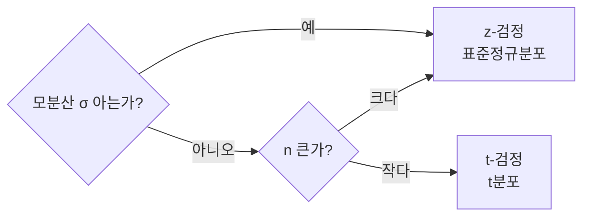

# 중심극한정리·t-검정·z-검정

## 1. 개요

### 가. 정의
> 표본에서 얻은 통계량으로 모집단의 특성을 추론하는 **통계적 가설검정**의 기반 이론. **중심극한정리(CLT)** 가 표본평균의 정규 근사를 보장하고, 그 위에서 **z-검정·t-검정**이 모평균에 대한 가설을 판정한다.

### 나. 등장 배경 및 필요성
현실에서 우리는 모집단 전체를 조사할 수 없어 일부 **표본**만 관측한다. 문제는 표본평균 x̄가 뽑을 때마다 달라지는 **확률변수**라는 점이며, 이 흔들림(표집오차)을 정량화하지 못하면 "표본에서 관측된 차이가 진짜 모집단의 차이인지, 우연인지"를 판단할 수 없다. 중심극한정리는 바로 이 표본평균의 흔들림이 **정규분포라는 알려진 형태**를 따른다는 것을 보장함으로써, 확률적으로 계산 가능한 추론의 문을 연다. z·t-검정은 그 정규 근사를 실제 가설 판정에 옮기는 도구다. 이 삼각 구조가 A/B 테스트, 품질관리, 임상시험, 모델 성능 비교 등 거의 모든 데이터 기반 의사결정의 밑바탕이 된다.

## 2. 중심극한정리(CLT)

### 가. 정의와 원리
> **모집단의 분포 형태와 무관하게, 표본 크기 n이 충분히 크면 표본평균 x̄의 분포가 정규분포에 근접**한다는 정리.

핵심은 "모집단이 정규분포가 아니어도" 성립한다는 데 있다. 예컨대 주사위 눈금은 1~6이 균등한 균일분포이지만, 주사위를 30번 던져 얻은 **평균**을 반복해서 구하면 그 평균값들의 분포는 종 모양의 정규분포에 수렴한다. 여러 독립 요인의 합·평균은 개별 분포의 치우침이 상쇄되면서 정규 형태로 모이기 때문이다. 이때 표본평균의 기댓값은 모평균 μ로 같고, 흩어짐(표준오차)은 **σ/√n** 으로 줄어든다. √n이 분모에 있으므로 표본을 4배 늘려야 오차가 절반으로 준다는 점이, 표본 크기 설계의 핵심 트레이드오프다.

| 항목 | 내용 | 의미 |
|---|---|---|
| **표본평균 분포** | 평균 μ, 표준오차 σ/√n | n이 클수록 오차 감소 |
| **의의** | 모분포 미상이어도 정규 기반 추론 가능 | 검정·구간추정의 토대 |
| **경험적 조건** | 통상 n ≥ 30 | 왜도가 크면 더 큰 n 필요 |

## 3. z-검정 vs t-검정

두 검정의 갈림길은 **모분산 σ²을 아느냐**이다. 현실에서 모평균 μ를 모르면서 모분산 σ²만 아는 경우는 드물기 때문에, 실무의 대부분은 표본표준편차 s로 σ를 추정하는 상황이다. 여기서 문제가 생긴다. s 자체가 표본마다 흔들리는 추정값이므로, 이 **불확실성이 이중으로 더해진다**. t분포는 정규분포보다 꼬리를 두껍게 만들어 이 추가 불확실성을 반영한 분포다. 표본이 작을수록(자유도가 작을수록) 꼬리가 더 두꺼워져 기각이 보수적으로 이뤄지고, n이 커지면 s가 σ에 가까워지면서 t분포는 정규분포로 수렴한다. 그래서 대표본에서는 t-검정과 z-검정 결과가 사실상 같아진다.

| 구분 | z-검정 | t-검정 |
|---|---|---|
| **사용 분포** | 표준정규(z) | t분포(자유도 n-1) |
| **모분산** | 알려짐(σ 사용) | 미지(표본표준편차 s 사용) |
| **표본 크기** | 대표본(n≥30) 전제 | 소표본(n<30)에도 적용 |
| **분포 특징** | 고정된 종 모양 | 꼬리가 두꺼움→n↑ 시 정규 수렴 |

**검정통계량**은 "관측된 차이를 표준오차로 나눈 값"으로, z = (x̄-μ₀)/(σ/√n), t = (x̄-μ₀)/(s/√n) 이다. 예를 들어 표본평균이 52, 귀무가설 평균 μ₀=50, s=8, n=64라면 t = (52-50)/(8/8) = 2.0이 되고, 자유도 63의 t분포에서 이 값의 양측 p-value가 유의수준(예 0.05)보다 작으면 "차이가 있다"고 판단한다.

## 4. t-검정의 유형

t-검정은 비교 구조에 따라 세 가지로 나뉜다. **일표본 t-검정**은 한 집단의 평균이 특정 기준값과 같은지 본다(예: 신제품 배터리 수명이 공표 스펙 10시간과 다른가). **독립표본 t-검정**은 서로 무관한 두 집단의 평균을 비교하며 A/B 테스트의 표준 도구다(예: A안·B안의 전환율 차이). **대응표본 t-검정**은 동일 대상을 처치 전후로 측정해 그 차이의 평균을 검정하는데, 개인차라는 잡음을 제거해 검정력이 높다(예: 같은 환자의 복약 전후 혈압).

| 유형 | 용도 | 예시 |
|---|---|---|
| **일표본 t** | 한 집단 평균 vs 기준값 | 스펙 대비 실측 |
| **독립표본 t** | 무관한 두 집단 평균 비교 | A/B 테스트 |
| **대응표본 t** | 동일 대상 전후 비교 | 처치 전후 효과 |

## 5. 고려사항 및 시사점
- **가정 검증이 선행**: t·z-검정은 관측치의 **정규성·독립성·(두 집단 비교 시) 등분산**을 전제한다. 위반 시 Welch's t나 Mann-Whitney U 같은 비모수 검정으로 대체해야 결과가 왜곡되지 않는다.
- **유의성과 효과크기 병행**: p-value는 "차이가 우연인가"만 말할 뿐 "차이가 실무적으로 큰가"는 말하지 못한다. n이 매우 크면 사소한 차이도 유의해지므로, Cohen's d 같은 효과크기와 신뢰구간을 함께 보고해야 한다.
- **실무 활용**: A/B 테스트의 전환율 비교, 제조 공정의 품질 이탈 감지, 두 ML 모델의 성능 유의차 검증 등에 직접 쓰이며, 표본 크기 설계(검정력 분석)와 함께 다뤄야 신뢰할 수 있다.

---

> **한 줄 요약**: CLT는 *n이 크면 모분포와 무관하게 표본평균이 정규분포(평균 μ, 표준오차 σ/√n)에 근접* 함을 보장하고, 모분산을 알면 **z-검정**, 모르면(소표본) **t-검정(t분포)** 으로 모평균 가설을 판정하되 정규성·독립성 가정과 효과크기를 함께 확인해야 한다.
