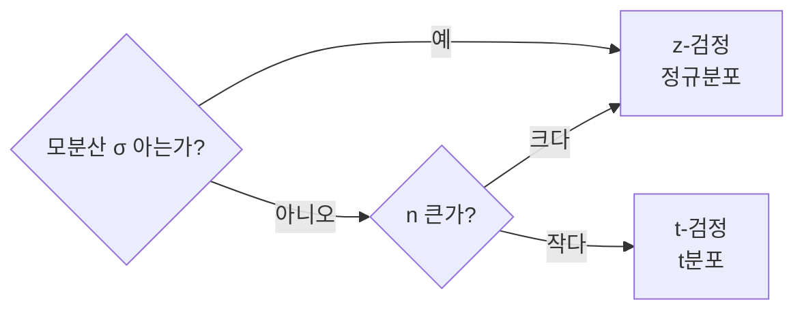

# 중심극한정리·t-검정·z-검정

## 1. 개요
> 표본 통계로 모집단을 추론하는 통계적 검정의 기반. **중심극한정리(CLT)** 가 정규 근사를 보장하고, 그 위에서 **z-검정·t-검정**이 가설을 검정한다.

## 2. 중심극한정리(CLT)

### 가. 정의
> 모집단 분포와 무관하게, **표본 크기 n이 충분히 크면 표본평균의 분포가 정규분포에 근접**한다는 정리.

| 항목 | 내용 |
|---|---|
| **표본평균 분포** | 평균 μ, 표준오차 σ/√n |
| **의의** | 모분포 미상이어도 **정규 기반 추론** 가능 |
| **조건** | 통상 n ≥ 30 |

## 3. z-검정 vs t-검정

| 구분 | z-검정 | t-검정 |
|---|---|---|
| **사용 분포** | 표준정규(z) | t분포(자유도 n-1) |
| **모분산** | 알려짐 | 미지(표본표준편차 s 사용) |
| **표본 크기** | 큼(n≥30) | 작음(n<30)에도 적용 |
| **특징** | — | 꼬리가 두꺼움(불확실성 반영), n↑ 시 정규 수렴 |

- **검정통계량**: z = (x̄-μ)/(σ/√n), t = (x̄-μ)/(s/√n)

## 4. t-검정의 유형

| 유형 | 용도 |
|---|---|
| **일표본 t** | 한 집단 평균 vs 기준값 |
| **독립표본 t** | 두 집단 평균 비교 |
| **대응표본 t** | 동일 대상 전후 비교 |

## 5. 고려사항 및 시사점
- **정규성·독립성·등분산** 가정 확인(위반 시 비모수 검정)
- 유의수준(α)·p-value로 귀무가설 기각 판단
- A/B 테스트·품질관리·모델 성능 비교 등에 활용

---

> **한 줄 요약**: CLT는 *n이 크면 표본평균이 정규분포에 근접* 함을 보장하고, 모분산을 알면 **z-검정**, 모르면(소표본) **t-검정(t분포)** 으로 평균에 대한 가설을 검정한다.
