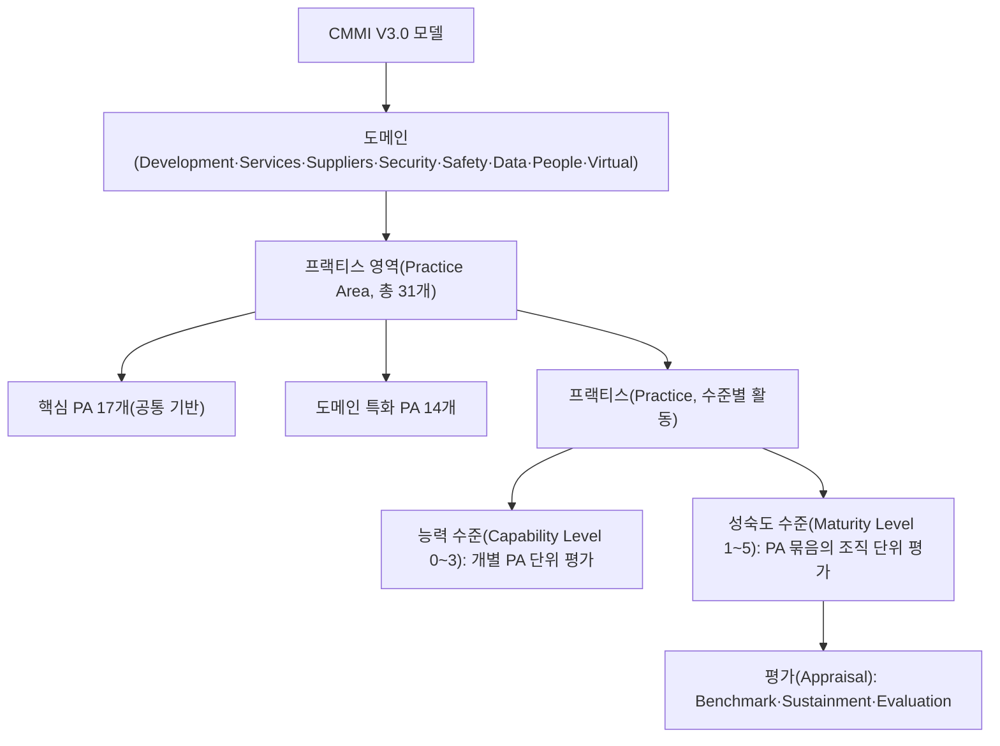
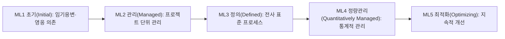

# CMMI(능력성숙도 통합모델, Capability Maturity Model Integration)

## 1. 개요

> **정의**: CMMI(Capability Maturity Model Integration)는 조직의 프로세스 능력과 성숙도를 단계적으로 진단·개선하기 위한 **성과 중심의 프로세스 개선 프레임워크**로서, 개발·서비스·공급망 등 도메인별 모범사례(Practice)를 성숙도 5단계와 능력 4단계 구조로 체계화한 모델이다.

CMMI가 등장한 배경에는 1980년대 미국 국방부(DoD)의 소프트웨어 조달 위기가 있다. 대형 무기체계 소프트웨어가 예산과 일정을 반복적으로 초과하고 품질이 담보되지 않자, DoD의 지원을 받아 카네기멜론 대학교 SEI(Software Engineering Institute)가 공급업체의 프로세스 역량을 객관적으로 평가할 방법을 연구하였고 그 결과가 1991년 SW-CMM이다. 이후 시스템공학(SE-CMM), 통합제품개발(IPD-CMM), 인력관리(P-CMM) 등 서로 다른 모델이 난립하면서 조직이 여러 모델을 중복 적용해야 하는 부담이 커졌고, 이를 하나로 통합(Integration)한 것이 2002년 CMMI 1.1이다.

이러한 통합의 흐름은 이후에도 이어져, CMMI는 개발(CMMI-DEV)·서비스(CMMI-SVC)·획득(CMMI-ACQ) 세 축의 별도 모델(V1.3)에서, V2.0을 거쳐 V3.0에서는 이를 하나의 도메인 체계로 재통합하는 방향으로 진화했다. 즉 CMMI의 역사 자체가 '분산된 모범사례를 하나의 일관된 프레임워크로 수렴시키는' 과정이었으며, 이는 조직이 여러 인증을 중복 관리하는 비효율을 줄이려는 실무적 요구에 대응한 결과다.

CMMI가 필요한 근본 이유는 **소프트웨어·시스템의 품질이 이를 만드는 프로세스의 품질에 종속된다**는 전제에 있다. 뛰어난 개인의 역량에 의존하는 조직은 핵심 인력이 이탈하면 성과가 급락하지만, 프로세스가 정착된 조직은 인력이 바뀌어도 예측 가능한 품질과 일정을 유지한다. 즉 CMMI는 성과를 '영웅(hero)'이 아니라 '조직의 자산화된 프로세스'로 담보하려는 접근이며, 발주자 입장에서는 사업 수행 역량을 사전에 검증하는 객관적 잣대가 된다. 실제로 국내외 공공 SI·방산·금융 사업의 입찰 자격이나 가점 요건으로 CMMI 등급이 요구되는 경우가 많아, 기술사 관점에서 조직 성숙도와 조달·품질경영을 연결하는 핵심 개념이다.

2016년 SEI로부터 CMMI Institute가 분리되고, 2023년 4월 현 소유기관인 **ISACA가 CMMI V3.0**을 발표하면서 모델은 '문서화된 프로세스 준수'에서 **비즈니스 성과(Performance) 개선**으로 무게중심을 옮겼다. V3.0은 기존 개발·서비스·공급망에 더해 보안(Security)·안전(Safety)·데이터(Data)·인력(People)·가상근무(Virtual) 도메인을 추가하여 총 8개 도메인 체계로 확장되었다.

CMMI의 핵심 특징을 정리하면 다음과 같다. 첫째, **성숙도 기반의 단계적 개선**을 지향하여 조직이 감당 가능한 속도로 역량을 축적하게 한다. 둘째, **방법론 중립적**이어서 폭포수·애자일·DevOps 어떤 개발 방식과도 결합할 수 있다. 셋째, **모범사례(Practice)의 집대성**으로서 수십 년간 축적된 산업 경험을 참조 가능한 형태로 제공한다. 넷째, **객관적 평가와 벤치마킹**을 통해 조직 간·시점 간 비교가 가능하다는 점이다. 이 네 가지 특징이 CMMI를 단순한 체크리스트가 아니라 조직 역량의 로드맵으로 만든다.

## 2. CMMI의 전체 구조와 표현 방식

CMMI는 '무엇을(What)'을 규정하되 '어떻게(How)'는 조직의 재량에 맡기는 참조모델이다. 최상위에는 도메인(Domain)이 있고, 각 도메인은 여러 **프랙티스 영역(Practice Area, PA)**으로 구성되며, PA는 성숙도/능력 수준에 따라 계층화된 프랙티스(Practice)를 담는다. 프랙티스는 조직이 반드시 수행해야 할 활동의 '의도(intent)'를 서술하며, 이를 어떤 방법론(Agile·Waterfall 등)으로 구현할지는 조직이 선택한다. 이 유연성 덕분에 CMMI는 특정 개발방법론에 종속되지 않고 애자일 팀에도 적용될 수 있다.

V3.0 기준으로 프랙티스 영역은 여러 도메인이 공통으로 사용하는 **핵심(core) PA**와 특정 도메인에서만 쓰이는 **도메인 특화 PA**로 구분된다. 핵심 PA에는 요구사항개발·형상관리·검증·확인·리스크관리·측정 등 도메인을 막론하고 공통적으로 요구되는 활동이 담기고, 도메인 특화 PA에는 보안·안전·데이터관리처럼 해당 영역에서만 의미를 갖는 활동이 담긴다. 이러한 모듈식 구성 덕분에 조직은 자신에게 필요한 도메인만 선택해 채택할 수 있어, 개발만 하는 조직과 서비스 운영까지 하는 조직이 각기 다른 PA 조합으로 CMMI를 적용하게 된다.

CMMI는 역사적으로 두 가지 **표현 방식(Representation)**을 제공해 왔다. 첫째는 **연속형(Continuous)**으로, 조직이 개선하고 싶은 개별 PA를 골라 그 능력 수준(Capability Level, CL 0~3)을 높이는 방식이다. 예컨대 형상관리가 취약한 조직이 '형상관리' PA만 집중적으로 끌어올릴 수 있어 개선의 자유도가 높다. 둘째는 **단계형(Staged)**으로, 미리 정의된 PA 묶음을 성숙도 수준(Maturity Level, ML 1~5) 단위로 순차 달성하는 방식이며, 조직 전체를 하나의 등급으로 표현할 수 있어 대외 커뮤니케이션에 유리하다. 실무에서 "우리 회사는 CMMI 레벨 3"이라고 말할 때의 그 등급이 단계형의 성숙도 수준이다.

능력 수준과 성숙도 수준의 차이가 생기는 이유는 **평가 대상의 범위**에 있다. 능력 수준은 하나의 PA가 얼마나 잘 수행·관리되는지를 보고, 성숙도 수준은 여러 PA가 조직 차원에서 함께 정착되어 조직 전반의 예측가능성이 어느 정도인지를 본다. 따라서 특정 PA만 CL3이라고 해서 조직이 ML3인 것은 아니며, ML은 해당 레벨이 요구하는 모든 PA가 충족되어야 부여된다.

이러한 이원 구조가 주는 실무적 함의는, 조직이 **개선 로드맵을 상황에 맞게 설계**할 수 있다는 점이다. 당장 대외 인증이 급한 조직은 단계형으로 ML 목표를 잡고 필요한 PA 묶음을 한꺼번에 정비하는 편이 효율적이지만, 특정 프로세스(예: 리스크관리, 형상관리)가 반복적으로 사고를 유발하는 조직은 연속형으로 그 PA의 능력 수준부터 끌어올리는 편이 투자 대비 효과가 크다. 즉 CMMI는 '하나의 정답'을 강요하지 않고, 조직의 통증 지점(pain point)과 사업 목표에 따라 개선 순서를 최적화하도록 설계된 모델이다.

| 구분 | 능력 수준(Capability Level) | 성숙도 수준(Maturity Level) |
|------|------|------|
| 평가 단위 | 개별 프랙티스 영역(PA) | PA 묶음(조직/프로젝트) |
| 수준 범위 | 0~3 | 1~5 |
| 표현 방식 | 연속형(Continuous) | 단계형(Staged) |
| 활용 | 약점 PA 선택적 개선 | 조직 등급 대외 표현 |
| 예시 | "요구사항관리 CL3 달성" | "전사 ML3 인증" |

## 3. 성숙도 5단계와 단계별 특징

성숙도 수준은 조직의 프로세스가 '예측 불가능한 혼돈'에서 '지속적으로 자기개선하는 상태'로 진화하는 사다리로 이해할 수 있다. 각 단계는 하위 단계를 전제로 하므로 건너뛸 수 없으며, 상위로 갈수록 프로세스의 정량화·최적화 정도가 높아진다.

**ML1 초기(Initial)** 단계의 조직은 정의된 프로세스가 사실상 없으며, 성공은 특정 개인의 역량과 헌신에 좌우된다. 일정과 예산을 자주 초과하고, 유사 프로젝트라도 결과의 편차가 크다. 문제는 성과가 재현되지 않는다는 점이다. 어떤 팀이 우연히 성공해도 그 방식이 조직 자산으로 축적되지 않아, 다음 프로젝트에서 같은 실수를 반복한다. 예를 들어 매번 다른 방식으로 형상관리를 하다 보니 릴리스 직전 소스 버전이 뒤섞여 배포 장애가 나는 상황이 전형적이다. ML1은 별도의 프랙티스 충족을 요구하지 않는 '기본 상태'이며, 개선의 출발점일 뿐 목표가 될 수 없다.

**ML2 관리(Managed)** 단계에서는 요구사항관리·프로젝트계획·프로젝트모니터링·형상관리·측정분석·공급자관리·품질보증 등 **프로젝트 단위의 기본 관리 프랙티스**가 정착된다. 핵심은 '규율(discipline)'이다. 계획을 세우고, 계획 대비 실적을 추적하며, 산출물의 형상을 통제한다. 다만 이 단계의 프로세스는 프로젝트별로 제각각일 수 있어, A팀과 B팀의 일하는 방식이 다르다. 예컨대 두 팀 모두 형상관리를 하지만 도구와 브랜치 전략이 달라 인력 재배치 시 학습비용이 발생한다.

ML2가 조직에 주는 즉각적 가치는 '가시성(visibility)'이다. 계획과 실적을 추적하기 시작하면 일정 지연이나 범위 증가가 조기에 드러나 관리자가 개입할 기회를 얻는다. ML1 조직에서는 마감 임박 시점에야 문제가 폭발하지만, ML2 조직에서는 진척 데이터를 통해 이상 징후를 사전에 포착한다. 다만 이 가시성이 프로젝트 경계에 갇혀 있다는 것이 한계이며, 이를 조직 차원으로 확장하는 것이 다음 단계인 ML3의 과제다.

**ML3 정의(Defined)** 단계는 조직 차원의 **표준 프로세스 자산(OSSP)**이 수립되고, 각 프로젝트는 이를 재단(tailoring)하여 사용한다. 프로젝트별 편차가 줄고, 조직 전체가 공통 언어와 산출물 양식을 공유하므로 인력 이동과 지식 재사용이 쉬워진다. 요구공학·기술설계·검증·확인·리스크관리·의사결정분석 등 **엔지니어링과 조직 차원 프랙티스**가 강화된다. 국내 대다수 공공 SI 사업에서 요구하는 실질적 기준선이 ML3인 이유는, 이 단계부터 조직이 예측 가능하고 이식 가능한 품질을 보장한다고 보기 때문이다.

ML2와 ML3의 결정적 차이는 프로세스의 '소유 주체'에 있다. ML2에서는 각 프로젝트가 자기 프로세스를 정의하지만, ML3에서는 조직이 표준을 소유하고 프로젝트는 이를 재단해 사용한다. 이 차이 때문에 ML3 조직은 프로젝트 종료 후 얻은 교훈(lessons learned)과 실측 데이터를 조직 표준에 되먹임할 수 있어, 개선이 개인이나 팀에 갇히지 않고 조직 자산으로 축적된다. 이것이 ML3을 '학습하는 조직'의 출발점으로 보는 이유다.

**ML4 정량관리(Quantitatively Managed)** 단계에서는 핵심 프로세스와 성과를 **통계적·정량적 기법(SPC 등)**으로 관리한다. 예를 들어 결함 밀도, 리뷰 효율, 생산성 같은 지표에 대해 관리한계(control limit)를 설정하고, 관리도(control chart)로 특이 변동을 조기에 탐지한다. 단순히 지표를 '수집'하는 ML2·3과 달리, 지표의 **변동 원인을 통계적으로 분석하여 예측 모델**을 세운다는 점이 결정적 차이다. 가령 "리뷰 시간을 20% 늘리면 필드 결함이 통계적으로 유의하게 감소한다"는 정량적 인과를 근거로 의사결정을 한다.

여기서 중요한 개념이 **공통원인(common cause)과 특수원인(special cause)의 구분**이다. ML4 조직은 프로세스에 내재한 자연스러운 변동(공통원인)과 비정상적 사건에 의한 변동(특수원인)을 통계적으로 분리하여, 전자는 프로세스 개선으로, 후자는 원인 제거로 대응한다. 이 구분이 없으면 정상적 변동에 과잉 반응하거나 진짜 문제를 놓치는 오류를 범하게 되므로, ML4는 데이터 리터러시가 조직에 내재화되어야 도달 가능한 단계다.

**ML5 최적화(Optimizing)** 단계에서는 정량적 이해를 바탕으로 **프로세스 자체를 지속적으로 혁신**한다. 근본원인분석(RCA)으로 결함의 원인을 제거하고, 신기술·신방법을 시범 적용한 뒤 효과가 검증되면 조직 표준에 반영한다. 이 단계의 조직은 문제가 터진 뒤 대응하는 것이 아니라, 데이터에 근거해 프로세스를 선제적으로 진화시킨다.

이처럼 성숙도 단계는 '통제(ML2) → 표준화(ML3) → 정량화(ML4) → 최적화(ML5)'라는 논리적 진화 경로를 따른다. 각 단계가 하위 단계를 전제하는 이유는 명확하다. 표준 프로세스(ML3) 없이 통계적 관리(ML4)를 시도하면 프로젝트마다 측정 기준이 달라 데이터를 비교할 수 없고, 정량적 기준선(ML4) 없이 최적화(ML5)를 시도하면 개선의 효과를 객관적으로 입증할 수 없다. 그래서 CMMI는 단계를 건너뛰는 것을 허용하지 않으며, 이 점이 임기응변식 개선과 구별되는 CMMI의 방법론적 엄밀성이다.

## 4. 평가(Appraisal) 방식과 등급 획득 절차

CMMI 등급은 자기 선언이 아니라 **공인 평가(Appraisal)**를 통해 부여된다. 과거 V1.3에서는 SCAMPI(A/B/C) 방식을 사용했고, V2.0 이후로는 목적에 따라 세 가지 평가 유형으로 재편되었다. 정식 등급 인증은 **벤치마크 평가(Benchmark Appraisal)**로 이루어지며, 이는 인증된 리드 심사원(Certified Lead Appraiser)이 수행하고 결과가 공개 등록된다. 획득한 등급은 일반적으로 유효기간이 있어(V3.0 벤치마크 평가는 약 3년), 유지를 위해 **유지평가(Sustainment Appraisal)**를 받거나 재평가를 수행해야 한다. 조직 내부의 준비상태 점검이나 부분 진단에는 **평가(Evaluation Appraisal)**를 활용한다.

| 평가 유형 | 목적 | 결과 |
|------|------|------|
| Benchmark | 공식 등급(ML/CL) 인증 | 등록·공표, 유효기간 부여 |
| Sustainment | 기존 등급 유지·갱신 | 등급 연장 |
| Evaluation | 내부 진단·준비상태 확인 | 개선점 도출(비공식) |

실제 등급 획득 절차는 통상 **① 착수·범위설정 → ② 갭(Gap) 분석 → ③ 프로세스 정의·정착(파일럿·전개) → ④ 사전평가(예비진단) → ⑤ 공식 벤치마크 평가 → ⑥ 등급 등록·유지**의 흐름을 따른다. 가장 자원이 많이 드는 구간은 ③으로, 프로세스를 문서로만 만드는 것이 아니라 실제 프로젝트에 적용해 **증적(objective evidence)**을 축적해야 하기 때문이다. 심사원은 문서·인터뷰·데이터를 삼각검증하므로, 형식적 문서만으로는 등급을 받을 수 없다.

**구체 사례(가상 시나리오로 본 개선 효과)**: 직원 200명 규모의 공공 SI 기업이 ML1 수준에서 3년에 걸쳐 ML3을 목표로 개선을 추진했다고 하자. 도입 이전 이 조직은 프로젝트 납기준수율이 60% 수준이었고, 인도(delivery) 이후 발견되는 필드 결함이 KLOC당 다수 발생하며 재작업(rework) 비용이 총 개발비의 30%에 달했다. ML2 정착 단계에서 요구사항 변경관리와 형상관리가 자리 잡자 릴리스 혼선이 줄었고, ML3에서 조직 표준 프로세스와 동료검토(peer review)가 정착되자 결함이 상류(요구·설계) 단계에서 조기 제거되기 시작했다. 이처럼 상류 결함 제거가 하류 재작업 비용을 크게 줄인다는 것은 소프트웨어 공학의 잘 알려진 원리(결함은 늦게 발견될수록 수정비용이 기하급수적으로 증가)로, CMMI 개선의 경제적 근거를 이룬다. 다만 실제 수치는 조직·사업 특성에 따라 편차가 크므로, 답안에서는 절대치보다 **개선의 인과 메커니즘**(프로세스 규율 → 상류 결함 제거 → 재작업 감소 → 예측가능성 향상)을 강조하는 것이 바람직하다.

## 5. 유사 모델과의 비교 — ISO/IEC 15504(SPICE), ISO 9001

CMMI와 자주 비교되는 것이 **ISO/IEC 15504(SPICE)**이며, 현재는 ISO/IEC 330xx 계열로 발전했다. 두 모델 모두 프로세스 능력을 수준으로 평가한다는 점은 같지만, 차이가 생기는 근본 원인은 '설계 철학'에 있다. CMMI는 미국 방산 조달에서 출발해 **모범사례의 집대성과 등급 인증(벤치마킹)**에 강점이 있는 반면, SPICE는 국제표준으로서 **프로세스 참조모델과 측정 프레임워크의 분리, 프로세스별 능력수준 평가**에 초점을 둔다. 실무적으로는 자동차 분야의 Automotive SPICE처럼 특정 산업에서 SPICE 계열이 사실상 표준으로 요구되는 경우가 있어, 조직은 발주처 요구에 따라 모델을 선택하거나 병행한다.

**ISO 9001(품질경영시스템)**과의 관계도 중요하다. ISO 9001은 조직 전반의 품질경영을 다루는 반면 CMMI는 소프트웨어·시스템 개발·서비스 프로세스에 특화되어 있어, 둘은 대체재가 아니라 보완재로 함께 운영되는 경우가 많다. 예를 들어 전사 품질방침은 ISO 9001로, 개발 프로세스의 성숙도는 CMMI로 관리하는 이원 체계가 흔하다.

또한 CMMI와 SPICE의 능력수준 척도가 다른 점도 실무에서 혼동을 유발한다. CMMI의 능력수준은 0~3인 반면, SPICE(ISO/IEC 33020)는 프로세스별 능력수준을 0~5로 세분한다. 이 차이는 두 모델이 '능력'을 바라보는 관점의 차이에서 비롯된다. CMMI는 능력수준을 성숙도 사다리로 오르기 위한 디딤돌로 보아 상대적으로 단순하게 두는 반면, SPICE는 개별 프로세스 각각의 예측성·최적화 정도까지 정밀하게 측정하려 한다. 따라서 자동차·항공처럼 프로세스별 정밀 진단이 요구되는 산업에서는 SPICE 계열이, 조직 전체의 성숙도를 하나의 등급으로 커뮤니케이션해야 하는 조달 환경에서는 CMMI가 선호되는 경향이 있다.

| 구분 | CMMI | ISO/IEC 15504(SPICE) | ISO 9001 |
|------|------|------|------|
| 성격 | 성숙도/능력 참조모델 | 프로세스 능력 평가 국제표준 | 품질경영 국제표준 |
| 평가 단위 | ML(1~5)/CL(0~3) | 프로세스별 능력수준(0~5) | 적합/부적합 |
| 강점 | 등급 벤치마킹·모범사례 | 프로세스별 상세 평가 | 전사 품질경영 |
| 적용 예 | 방산·공공 SI 입찰 | Automotive SPICE 등 산업 특화 | 전 산업 범용 |

## 6. 심화 — 애자일·DevOps 시대의 CMMI와 성과 중심 전환

한때 CMMI는 '무거운 문서주의'라는 비판을 받으며 애자일과 대립하는 것으로 오해되었다. 그러나 CMMI는 방법론이 아니라 '무엇을 달성해야 하는가'를 규정하는 참조모델이므로, 애자일 실천법으로도 충분히 그 의도를 충족할 수 있다. 예컨대 스크럼의 백로그·번다운차트는 프로젝트 계획·모니터링 프랙티스의 증적이 되고, CI/CD 파이프라인의 자동화된 빌드·테스트 로그는 형상관리·검증 프랙티스의 강력한 객관적 증거가 된다. V3.0이 명시적으로 성과(Performance)와 유연성을 강조한 것은 이러한 현대적 개발 환경을 포용하려는 방향 전환이다.

실제로 애자일과 CMMI는 상호 보완적이다. 애자일은 '어떻게 빠르게 가치를 전달할 것인가'라는 실행 전술을 제공하지만 조직 차원의 일관성·예측성 보장에는 상대적으로 약하고, CMMI는 조직 성숙도의 뼈대를 제공하지만 구체적 실행법은 규정하지 않는다. 따라서 애자일로 실행하고 CMMI로 조직 역량을 진단·개선하는 결합이 현실적으로 가장 강력하다. "애자일이라 CMMI가 필요 없다"는 주장은 두 개념의 층위를 혼동한 오해에 가깝다.

더 나아가 CMMI의 자동화된 증적 수집은 AI·데이터 기반 개발 환경에서 새로운 가능성을 연다. 형상관리 이력, 이슈 트래커, 파이프라인 로그, 코드 리뷰 기록이 이미 디지털로 남기 때문에, 과거 심사 준비에 소요되던 방대한 수작업 문서화 부담이 줄어들고 오히려 실시간 데이터로 프로세스 준수 여부를 상시 모니터링할 수 있다. 이는 CMMI 상위 단계가 요구하는 정량관리와 자연스럽게 맞물리며, 프로세스 개선을 '주기적 심사 이벤트'에서 '상시적 운영 활동'으로 전환시키는 촉매가 된다.

V3.0의 또 다른 의미 있는 변화는 도메인 확장이다. 데이터관리(Data)·인력관리(People)·가상근무(Virtual) 도메인이 추가되면서, 원격·분산 팀 운영과 데이터 자산 관리 같은 최신 이슈를 성숙도 관점에서 다룰 수 있게 되었다. 이는 클라우드·데이터 중심·하이브리드 근무로 재편된 IT 조직의 현실을 반영한 것으로, 기술사 답안에서는 "CMMI가 코드 품질을 넘어 조직의 데이터·인력·협업 성숙도까지 아우르는 방향으로 진화하고 있다"는 관점으로 서술하면 최신 동향을 효과적으로 드러낼 수 있다. 다만 세부 도메인 구성이나 프랙티스 개수는 모델 개정에 따라 달라질 수 있으므로, 답안에서는 구체 수치보다 **성과 중심·유연성·확장이라는 방향성**을 강조하는 것이 안전하다.

## 7. 고려사항 및 시사점 (기술사 관점)

**첫째, 등급 획득이 목적이 되는 '인증 함정'을 경계해야 한다.** 입찰 가점이나 마케팅을 위해 등급만 취득하고 실제 프로세스는 형식화되는 경우, 유지비용만 남고 성과 개선은 없다. CMMI 도입의 성공 여부는 등급 숫자가 아니라 결함률·납기준수율·재작업 비용 같은 **비즈니스 지표의 실질적 개선**으로 판단해야 한다. V3.0의 성과 중심 전환도 이 문제의식과 맞닿아 있다. 특히 등급 취득 직후 프로세스가 방치되어 다음 평가 직전에야 벼락치기로 증적을 복원하는 관행은, CMMI를 비용 요인으로 전락시키는 대표적 실패 패턴이므로 상시 운영 체계로 전환해야 한다.

**둘째, 조직 규모·성격에 맞는 재단(tailoring)이 필수다.** 소규모 조직이 대기업식 무거운 프로세스를 그대로 적용하면 관료주의만 심화된다. 트레이드오프 관점에서, 통제 강화로 얻는 예측가능성과 그로 인한 민첩성·비용 부담을 저울질하여 필요한 프랙티스를 선별 적용해야 한다. 스타트업이나 소규모 팀이라면 연속형 접근으로 통증이 큰 소수 PA부터 개선하는 편이, 무리하게 전사 ML 등급을 추구하는 것보다 현실적이고 효과적이다.

**셋째, 상위 성숙도(ML4·5)는 정량적 데이터 기반이 전제되므로 측정 체계(Measurement)에 대한 선행 투자가 필요하다.** 신뢰할 수 있는 지표와 데이터 파이프라인 없이 통계적 관리로 도약할 수 없다. 이 점에서 CMMI 상위 단계는 데이터 거버넌스·옵저버빌리티·DevOps 지표 체계와 자연스럽게 연계된다.

**넷째, 지속적 개선을 위한 경영진 의지와 문화가 핵심 성공요인(CSF)이다.** 프로세스 개선은 단기 성과가 아니라 수년에 걸친 조직 변화이므로, 경영진의 스폰서십과 개선 조직(EPG/SEPG), 인센티브 설계가 없으면 정착되지 않는다. 향후 CMMI는 애자일·DevSecOps·AI 기반 개발 자동화와 결합하여, 증적 수집과 성과 측정을 자동화하는 방향으로 발전할 전망이다.

**다섯째, 연계 기술·제도와의 통합 운영 관점이 필요하다.** CMMI 상위 단계의 정량관리는 DevOps의 DORA 지표(배포 빈도·변경 실패율·MTTR 등), 옵저버빌리티 데이터, 데이터 거버넌스 체계와 결합될 때 실효성을 갖는다. 또한 국내에서는 CMMI 등급이 공공·방산 사업의 입찰 자격이나 기술평가 가점으로 활용되므로, 조직은 조달 전략과 프로세스 개선 로드맵을 정렬하여 투자 효과를 극대화해야 한다. 결국 CMMI는 독립된 인증이 아니라 조직의 품질경영·데이터·자동화 체계 전반과 맞물려 운영될 때 지속가능한 성과 개선을 담보한다.

종합하면, CMMI는 조직의 프로세스 역량을 진단하는 '거울'인 동시에 개선의 '지도'다. 기술사 답안에서는 성숙도 5단계의 진화 논리와 능력·성숙도 수준의 구분을 정확히 서술하되, 단순 암기식 나열을 넘어 **왜 단계를 건너뛸 수 없는가, 왜 문서가 아니라 성과가 중요한가, 애자일·DevOps·데이터 거버넌스와 어떻게 연계되는가**를 인과적으로 풀어내는 것이 고득점의 관건이다. 관련 주제로는 소프트웨어 품질비용, ISO/IEC 15504(SPICE), IT 거버넌스, 데이터옵스·데브옵스 등이 있어 함께 연계 학습하면 답안의 깊이를 더할 수 있다.

## 참고자료

- ISACA, "ISACA Updates CMMI Model with Three New Domains" (2023): https://www.isaca.org/about-us/newsroom/press-releases/2023/isaca-updates-cmmi-model-with-three-new-domains-that-help-organizations-improve-quality
- ISACA Now Blog, "2023 CMMI Updates Take Performance Improvements to the Next Level": https://www.isaca.org/resources/news-and-trends/isaca-now-blog/2023/cmmi-updates-take-performance-improvements-to-the-next-level
- Wikipedia, "Capability Maturity Model Integration": https://en.wikipedia.org/wiki/Capability_Maturity_Model_Integration

---

> **한 줄 요약**: CMMI는 조직의 프로세스 능력을 성숙도 5단계·능력 4단계로 진단·개선하는 성과 중심 프레임워크로, 품질을 개인이 아닌 조직 자산화된 프로세스로 담보하며 V3.0(2023, ISACA)에서 보안·데이터·인력·가상근무 도메인까지 확장되었다.
