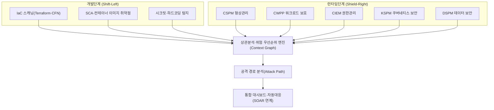
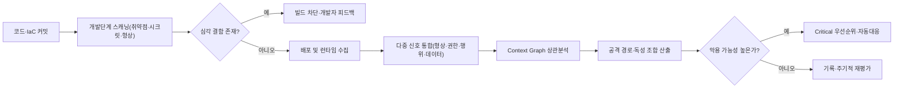

# CNAPP(클라우드 네이티브 애플리케이션 보호 플랫폼)

## 1. 개요

> **정의**: CNAPP(Cloud-Native Application Protection Platform)는 코드 작성부터 빌드·배포·런타임에 이르는 클라우드 네이티브 애플리케이션의 전(全) 수명주기에 걸쳐, 형상(구성) 점검·워크로드 보호·권한 관리·취약점 점검 등 분산되어 있던 보안 기능을 하나의 플랫폼으로 통합해 위험을 상관분석(correlation)하고 우선순위를 매겨 대응하는 클라우드 보안 통합 플랫폼이다.

CNAPP는 2021년 가트너(Gartner)가 제시한 개념으로, 이후 클라우드 보안 시장을 재편하는 통합 카테고리로 빠르게 자리 잡았다. 그 등장 배경을 이해하려면 클라우드 보안 도구가 걸어온 파편화의 역사를 먼저 짚어야 한다. 초기 클라우드 보안은 잘못된 설정(misconfiguration)을 찾아내는 CSPM, 컨테이너·VM 런타임을 지키는 CWPP, 과도한 권한을 다스리는 CIEM처럼 문제 영역별로 독립 제품이 난립했다. 기업은 자연히 여러 벤더의 점(點) 솔루션(point solution)을 각각 도입했고, 그 결과 콘솔이 대여섯 개로 늘어나면서 경보(alert)가 도구마다 따로 쏟아지는 '경보 피로(alert fatigue)'와, 어느 위험이 실제로 심각한지 판단할 수 없는 '맥락의 단절'이라는 두 가지 고질병이 생겼다.

문제의 핵심은 **위험은 연결되어 있는데 도구는 분리되어 있다**는 데 있다. 예컨대 "인터넷에 노출된 컨테이너"라는 사실 하나만으로는 심각도를 알 수 없다. 그러나 그 컨테이너가 ① 원격코드실행(RCE) 취약점을 가진 라이브러리를 포함하고, ② 관리자(admin) 권한의 IAM 역할이 부여되어 있으며, ③ 고객 개인정보가 담긴 스토리지에 접근 가능하다면, 세 사실이 하나의 공격 경로(attack path)로 이어지는 순간 이는 즉시 조치해야 할 치명적 위험이 된다. 개별 도구는 이 셋을 각각 별개의 중간 등급 경보로만 보고하지만, CNAPP는 이들을 하나의 그래프로 엮어 "실제로 악용 가능한(exploitable) 단 하나의 치명적 경로"로 압축해 제시한다. 즉 CNAPP의 본질적 가치는 새로운 탐지 기능이 아니라 **통합과 상관분석을 통한 위험의 문맥화(contextualization)**에 있다.

또한 클라우드 네이티브 환경 자체의 특성이 통합을 강제했다. 컨테이너의 평균 수명이 수 분에서 수 시간에 불과할 만큼 인프라가 휘발적(ephemeral)이고, IaC(Infrastructure as Code)로 인프라가 코드처럼 순식간에 생성·소멸하며, MSA로 인해 공격 표면이 수백 개의 서비스로 흩어진다. 이런 환경에서 배포 후(사후)에만 점검하는 방식으로는 속도를 따라갈 수 없으므로, 개발 파이프라인 왼쪽 끝(코드·IaC)부터 보안을 심는 **Shift-Left**와 런타임을 실시간으로 지키는 **Shield-Right**를 하나의 플랫폼에서 동시에 수행할 필요가 커졌고, 이것이 CNAPP 통합의 근본 동인이 되었다.

## 2. CNAPP 전체 구조와 통합 아키텍처

CNAPP는 개별 보안 도메인을 계층으로 쌓아 올린 뒤, 그 위에 위험을 하나로 엮는 상관분석 계층을 얹는 구조를 취한다. 아래 개념도는 CNAPP가 어떤 하위 기능을 통합하고, 그것을 어떻게 단일 위험 뷰로 수렴시키는지를 나타낸다.

이 구조에서 가장 중요한 요소는 가운데의 **상관분석 엔진**이다. 하위 도구들이 수집한 형상 오류·취약점·권한·데이터 민감도 정보를 하나의 그래프 데이터 모델로 정규화하고, 자산 간 관계(네트워크 도달성, 권한 상속, 데이터 접근)를 간선으로 연결한다. 그 결과 개별 경보는 노드가 되고, 실제 공격자가 밟아 나갈 수 있는 경로가 시각화된다. 이 그래프가 있어야 비로소 "노출+취약점+권한+데이터"가 결합된 소수의 '독성 조합(toxic combination)'을 식별해 대응 자원을 그곳에 집중할 수 있다.

### 가. CSPM — 클라우드 형상(구성) 관리

CSPM(Cloud Security Posture Management)은 클라우드 계정·리소스의 **설정 오류와 컴플라이언스 위반**을 지속적으로 점검하는 기능이다. 클라우드 사고의 상당수가 코드 결함이 아니라 "공개(public)로 열린 스토리지 버킷", "0.0.0.0/0으로 개방된 보안 그룹", "암호화되지 않은 볼륨" 같은 단순 설정 실수에서 비롯된다는 점에서 CSPM은 CNAPP의 가장 기본적인 토대가 된다.

CSPM은 클라우드 사업자의 API를 통해 리소스 인벤토리를 수집한 뒤, CIS Benchmark·ISO 27017·개인정보보호법 등 정책 규칙에 대조해 위반을 찾아낸다. 예를 들어 오브젝트 스토리지의 공개 접근 차단 여부, 접근 로그 활성화 여부, IAM 루트 계정의 MFA 설정 여부를 자동 검사한다. 나아가 성숙한 CSPM은 단순 탐지에 그치지 않고, 발견된 오류를 IaC 템플릿 수정 제안이나 자동 교정(auto-remediation) 워크플로로 연결해 '탐지→조치'의 간극을 줄인다.

CSPM의 실무적 함의는 **가시성(visibility)의 확보**에 있다. 멀티클라우드 환경에서는 자산이 어디에 얼마나 있는지조차 파악하기 어려운데, CSPM이 제공하는 통합 자산 인벤토리는 이후 모든 보안 활동의 출발점이 된다. 다만 CSPM만으로는 "설정은 틀렸지만 실제로 악용 가능한가"라는 질문에 답하지 못하므로, 다른 계층과의 결합이 필수적이다.

### 나. CWPP — 클라우드 워크로드 보호

CWPP(Cloud Workload Protection Platform)는 VM·컨테이너·서버리스 함수 등 **실행 중인 워크로드 내부**를 보호한다. CSPM이 인프라의 '겉모습(설정)'을 본다면, CWPP는 워크로드의 '속(런타임 행위)'을 지킨다고 비유할 수 있다.

CWPP의 활동은 크게 두 시점으로 나뉜다. 첫째, 빌드 시점에는 컨테이너 이미지 내부의 OS 패키지·오픈소스 라이브러리 취약점(CVE)과 악성코드, 하드코딩된 시크릿을 스캔한다. 둘째, 런타임 시점에는 워크로드에 경량 에이전트나 eBPF 기반 센서를 심어 비정상 프로세스 실행, 예기치 않은 아웃바운드 연결, 파일 무결성 변조, 권한 상승 시도 등을 실시간 탐지·차단한다. 예컨대 웹서버 컨테이너가 갑자기 셸(shell)을 띄우고 암호화폐 채굴 프로세스를 실행하면, 이는 정상 행위 기준선(baseline)에서 벗어난 것으로 판단해 즉시 격리한다.

CWPP가 중요한 이유는 **공급망 취약점의 대량 유입** 때문이다. 현대 애플리케이션은 코드의 대부분을 오픈소스 의존성에 기대므로, 하나의 인기 라이브러리 취약점(예: Log4Shell 유형)이 순식간에 수많은 워크로드로 번진다. CWPP는 이미지 단계에서 이를 걸러내고, 미처 못 막은 것은 런타임에서 방어하는 이중 안전망 역할을 한다.

### 다. CIEM — 클라우드 인프라 권한 관리

CIEM(Cloud Infrastructure Entitlement Management)은 **과도하게 부여된 권한(over-privileged access)**을 식별하고 최소권한(least privilege)으로 조정하는 기능이다. 클라우드 침해 사고의 상당수가 탈취된 자격증명(credential)과 그에 딸린 광범위한 권한을 통해 확산된다는 점에서, CIEM은 '공격의 확산 반경'을 줄이는 핵심 통제다.

클라우드에서는 사람 계정뿐 아니라 서비스·역할·함수 같은 비인간(machine) 아이덴티티가 폭증하고, 이들에게 편의상 넓은 권한이 붙는 '권한 팽창(privilege creep)'이 만연하다. CIEM은 실제 사용 로그를 분석해 "부여됐지만 한 번도 쓰지 않은 권한"을 찾아내고, 그만큼을 회수하도록 권고한다. 예를 들어 어떤 배포 자동화 역할에 스토리지 전체 삭제 권한이 붙어 있으나 실사용은 특정 버킷 읽기뿐이라면, CIEM은 잉여 권한을 정량적으로 드러내 최소권한 정책 수립을 지원한다.

CIEM의 실무적 함의는 **공격 경로 그래프의 핵심 간선을 제공**한다는 데 있다. 상관분석 엔진이 "노출된 워크로드→과도한 권한→민감 데이터"라는 경로를 그리려면 권한 관계 데이터가 반드시 필요하며, 이 데이터가 없으면 위험의 문맥화가 불완전해진다.

### 라. KSPM·DSPM 및 개발단계 통합

KSPM(Kubernetes Security Posture Management)은 CSPM의 개념을 쿠버네티스 영역으로 특화한 것으로, 과도한 RBAC 권한, 특권(privileged) 컨테이너, 미설정 네트워크 정책, 안전하지 않은 Pod 보안 표준 등을 점검한다. 컨테이너 오케스트레이션이 사실상 표준이 되면서 KSPM은 CNAPP의 필수 구성으로 자리 잡았다.

KSPM의 필요성은 쿠버네티스가 가진 '기본값이 곧 위험'이라는 특성에서 나온다. 예컨대 네임스페이스 간 통신을 막는 네트워크 정책이 기본으로 존재하지 않아, 한 Pod가 침해되면 클러스터 전체로 횡적 이동(lateral movement)이 가능해진다. KSPM은 이런 위험한 기본 설정과 과도한 ServiceAccount 권한, 서명되지 않은 이미지 허용 등을 지속적으로 점검해 쿠버네티스 고유의 공격 표면을 좁힌다.

DSPM(Data Security Posture Management)은 클라우드 곳곳에 흩어진 데이터의 위치·민감도·접근 권한을 파악해 "어떤 데이터가, 어디에, 누구에게 노출되어 있는가"에 답한다. DSPM이 결합되면 공격 경로의 종착점(데이터)에 가중치를 부여할 수 있어, 위험 우선순위가 훨씬 정교해진다. 예를 들어 동일하게 인터넷에 노출된 두 워크로드라도, 하나는 임시 로그만 접근 가능하고 다른 하나는 주민등록번호가 담긴 테이블에 도달할 수 있다면 DSPM은 후자를 압도적으로 높은 위험으로 끌어올린다. 아울러 CNAPP는 이 모든 런타임 통제를 **개발단계(IaC 스캐닝·SCA·시크릿 탐지)**와 연결해, 잘못된 설정이 배포되기 전에 파이프라인에서 차단하는 Shift-Left를 완성한다.

## 3. 위험 우선순위화 프로세스와 공격 경로 분석

CNAPP의 운영은 개별 경보를 쏟아내는 것이 아니라, 수집된 신호를 상관분석해 소수의 실행 가능한 위험으로 압축하는 파이프라인으로 이해해야 한다. 아래는 코드부터 대응까지의 처리 흐름을 나타낸 프로세스 상세도이다.

이 프로세스에서 주목할 지점은 **위험 우선순위의 산정 기준**이다. 전통적 취약점 관리는 CVSS 점수만으로 심각도를 매겨, 이론상 위험하지만 실제로는 도달 불가능한(unreachable) 취약점에까지 자원을 낭비하게 만들었다. 반면 CNAPP는 CVSS에 더해 **① 인터넷 노출 여부, ② 실제 악용 코드 존재 여부(예: 알려진 악용 취약점 목록 대조), ③ 워크로드에 부여된 권한, ④ 접근 가능한 데이터의 민감도**를 곱하듯 결합해 실효 위험을 계산한다. 그 결과 수천 건의 경보 중 실제로 조치가 시급한 것은 흔히 1~5% 남짓으로 좁혀지며, 보안팀은 이 소수에 집중해 대응 효율을 극적으로 끌어올릴 수 있다.

공격 경로 분석(Attack Path Analysis)은 이 상관분석의 정점이다. 예를 들어 어느 금융권 클라우드에서 "외부에 열린 로드밸런서 → 취약한 웹 컨테이너 → admin 권한 IAM 역할 → 고객 계좌정보 데이터베이스"로 이어지는 경로가 단 하나 존재한다면, CNAPP는 이를 붉은 선으로 그려 보여 준다. 이때 방어자는 경로 위의 어느 한 지점(예: 과도한 IAM 권한 회수)만 끊어도 전체 경로가 무력화된다는 사실을 직관적으로 알 수 있어, 최소 비용으로 최대 방어 효과를 얻는 '초크 포인트(choke point)' 전략을 취할 수 있다.

## 4. 구성요소 비교 및 통합 전(前)/후(後) 사례

CNAPP를 구성하는 하위 기능들은 보호 대상과 시점이 서로 달라 상호 보완적이다. 아래 표는 각 구성요소의 초점을 비교하되, 표만으로는 드러나지 않는 '차이가 생기는 이유'는 이어지는 문단에서 서술한다.

| 구성요소 | 보호 대상 | 핵심 질문 | 주 활동 시점 |
|---|---|---|---|
| CSPM | 클라우드 설정·형상 | "설정이 올바른가" | 런타임(지속 점검) |
| CWPP | 워크로드 내부 | "실행 중 위협이 있는가" | 빌드+런타임 |
| CIEM | 아이덴티티·권한 | "권한이 과도한가" | 런타임(지속 점검) |
| KSPM | 쿠버네티스 클러스터 | "K8s 설정이 안전한가" | 런타임 |
| DSPM | 데이터 | "민감 데이터가 노출됐나" | 런타임 |
| IaC 스캐닝 | 코드형 인프라 | "배포 전 결함이 있나" | 개발(Shift-Left) |

이들이 별개 제품일 때와 통합됐을 때의 차이는 단순한 관리 편의를 넘어선다. 통합 전(前)에는 CSPM이 "공개 버킷" 경보를, CWPP가 "취약 컨테이너" 경보를, CIEM이 "과도 권한" 경보를 서로 다른 콘솔에 따로 띄우므로, 세 경보가 사실은 하나의 공격 경로라는 사실을 사람이 수작업으로 이어 붙여야 했다. 대규모 환경에서 이는 사실상 불가능에 가깝고, 그 결과 진짜 위험이 수천 건의 소음에 묻혔다. 통합 후(後)에는 동일한 세 신호가 하나의 그래프로 합쳐져 "치명적 경로 1건"으로 승격되므로, 대응 대상이 명확해지고 평균 탐지·대응 시간(MTTD·MTTR)이 크게 단축된다.

구체적 사례로, 전자상거래 기업이 다섯 개의 점 솔루션을 운영하며 월 수만 건의 경보에 시달리던 상황을 가정해 보자. CNAPP 도입 후에는 상관분석을 통해 실제 조치가 필요한 위험이 수십 건 수준으로 압축되고, IaC 스캐닝이 파이프라인에 이식되면서 잘못된 설정의 상당 부분이 배포 이전에 걸러졌다. 이는 '탐지량의 증가'가 아니라 '조치 정확도의 증가'가 CNAPP의 진짜 성과임을 보여 준다. 다만 이러한 수치는 환경·성숙도에 따라 편차가 크므로 절대값보다 개선의 방향성으로 이해하는 것이 타당하다.

한 가지 더 유의할 점은 CNAPP가 SIEM·SOAR·XDR을 대체하지 않는다는 사실이다. SIEM이 조직 전체의 로그를 장기 보관·분석하고 XDR이 엔드포인트·네트워크 전반의 탐지·대응에 집중한다면, CNAPP는 '클라우드 네이티브 환경의 형상·워크로드·권한·데이터 문맥'이라는 고유한 시야를 제공한다. 실무에서는 CNAPP가 정제한 고위험 이벤트와 공격 경로 정보를 SIEM/SOAR로 전달해 전사 관제(SOC) 대응 워크플로에 통합하는 방식이 정석이며, 이 상호보완 구조를 이해하는 것이 CNAPP를 올바르게 자리매김하는 핵심이다.

## 5. 심화 — 최신 동향과 실무 적용 전략

CNAPP 시장은 몇 가지 뚜렷한 방향으로 진화하고 있다. 첫째, **에이전트리스(agentless)와 에이전트 방식의 병행**이다. 초기에는 워크로드마다 에이전트를 설치해야 해 도입 부담이 컸으나, 최근에는 스냅샷 기반 스캐닝으로 에이전트 없이 광범위한 가시성을 확보하고, 실시간 차단이 필요한 핵심 워크로드에만 에이전트를 얹는 하이브리드 모델이 정착되고 있다. 이는 커버리지(넓이)와 심층 방어(깊이)의 트레이드오프를 실무적으로 해소하려는 시도다.

둘째, **ASPM(Application Security Posture Management)과 코드-투-클라우드(Code-to-Cloud) 연결**이다. 런타임에서 발견한 취약점을 그것을 만들어 낸 소스코드 커밋·개발자·파이프라인까지 역추적해, 문제를 근원에서 고치도록 피드백을 닫는 흐름이 강화되고 있다. 이는 CNAPP가 단순 운영보안 도구를 넘어 개발·보안·운영을 잇는 DevSecOps의 중추로 확장되고 있음을 뜻한다.

셋째, **생성형 AI의 결합**이다. 자연어로 "인터넷에 노출되고 admin 권한을 가진 워크로드를 보여 줘"라고 질의하면 그래프를 검색해 응답하고, 발견된 위험의 조치 방법을 IaC 패치 형태로 자동 제안하는 기능이 확산되고 있다. 다만 AI가 제안한 자동 교정을 검증 없이 프로덕션에 적용하면 서비스 장애를 유발할 수 있어, 사람의 승인 단계를 두는 것이 실무의 상식이다.

국내 관점에서는 공공·금융 부문의 클라우드 전환(CSAP 등급 요구, 망분리 완화 흐름)과 맞물려 CNAPP 수요가 커지고 있으며, 개인정보보호법상 안전성 확보조치·접근통제 요건을 클라우드에서 자동으로 증빙하는 컴플라이언스 리포팅 용도로도 활용된다. 예상 출제 방향으로는 ① CNAPP와 SIEM/SOAR/XDR의 관계(대체가 아니라 상호보완), ② CSPM·CWPP·CIEM의 구분과 통합 필요성, ③ Shift-Left와 공격 경로 분석의 원리를 논하는 서술형이 유력하다. 답안 구성 시에는 "파편화 문제 제기 → 통합·상관분석이라는 해법 → 구성요소별 역할 → 공격 경로로 수렴 → 도입 전략과 한계"의 논리 전개가 설득력을 갖는다.

## 6. 고려사항 및 시사점

기술사 관점에서 CNAPP 도입은 제품 선택이 아니라 보안 운영 모델의 재설계로 접근해야 한다. 첫째, **적용 전략 측면에서는 단계적 성숙도 로드맵**이 필요하다. 처음부터 모든 기능을 켜면 경보 폭주로 오히려 운영이 마비되므로, 가시성 확보(CSPM)→위험 문맥화(CIEM·공격 경로)→개발 파이프라인 통합(Shift-Left)→자동대응의 순서로 점진 확대하고, 각 단계에서 오탐(false positive) 튜닝을 병행해야 한다.

둘째, **트레이드오프 측면에서는 커버리지와 심층성, 그리고 통합과 최적화의 긴장**을 관리해야 한다. 에이전트리스는 넓지만 실시간 차단이 약하고, 에이전트는 강력하지만 성능·운영 부담이 크다. 또한 단일 벤더 CNAPP는 상관분석이 매끄럽지만 특정 영역의 기능 깊이는 전문 점 솔루션에 못 미칠 수 있어, 조직의 위험 프로파일에 따라 통합의 이점과 개별 최적화의 이점을 저울질해야 한다. 벤더 종속(lock-in)과 멀티클라우드 지원 범위도 반드시 검토 대상이다.

셋째, **거버넌스와 조직 측면에서는 책임 공유 모델(shared responsibility)의 명확화**가 전제되어야 한다. CNAPP가 아무리 우수해도 클라우드 사업자와 사용자의 책임 경계가 모호하면 사각지대가 생긴다. 나아가 CNAPP가 만들어 내는 위험 우선순위를 실제 조치로 옮기려면 개발·보안·운영 팀의 협업 체계(예: 위험 소유자 지정, SLA 기반 조치 기한)가 함께 설계되어야 한다.

넷째, **전망과 연계 기술 측면에서 CNAPP는 제로 트러스트·DevSecOps·플랫폼 엔지니어링과 수렴**한다. 최소권한(CIEM)은 제로 트러스트의 아이덴티티 통제와, Shift-Left는 DevSecOps의 파이프라인 보안과, 셀프서비스형 보안 가드레일은 플랫폼 엔지니어링의 내부 개발자 플랫폼(IDP)과 자연스럽게 이어진다. 따라서 CNAPP는 독립된 섬이 아니라 클라우드 보안 아키텍처 전반을 관통하는 통합 축으로 자리매김할 것이며, SIEM·SOAR·XDR과는 경쟁이 아니라 클라우드 컨텍스트를 공급하는 상호보완 관계로 발전하리라 전망된다.

## 참고자료

- Gartner Glossary, "Cloud-Native Application Protection Platforms (CNAPP)": https://www.gartner.com/en/information-technology/glossary/cloud-native-application-protection-platforms-cnapp
- Cloud Security Alliance(CSA): https://cloudsecurityalliance.org/
- NIST, "Application Container Security Guide (SP 800-190)": https://csrc.nist.gov/pubs/sp/800/190/final

---

> **한 줄 요약**: CNAPP는 CSPM·CWPP·CIEM·KSPM·DSPM 등 파편화된 클라우드 보안 기능을 통합하고 위험을 상관분석해, 코드부터 런타임까지 실제 악용 가능한 공격 경로 중심으로 우선순위를 매겨 대응하는 클라우드 네이티브 통합 보안 플랫폼이다.
