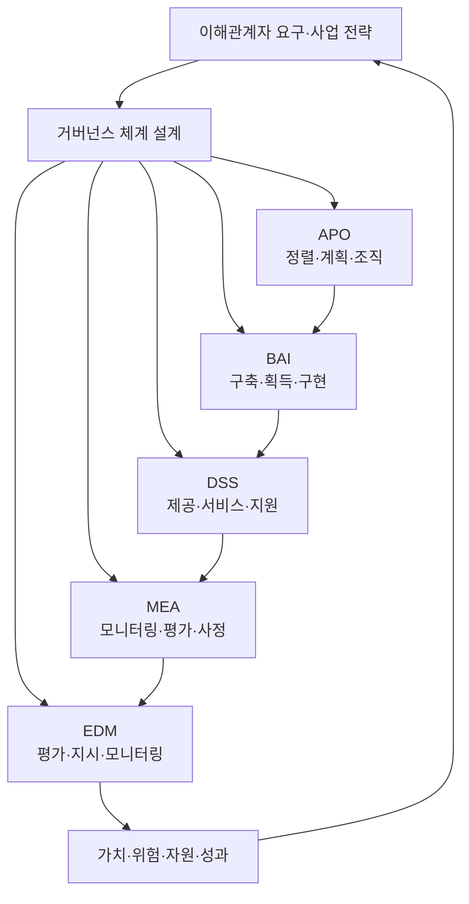
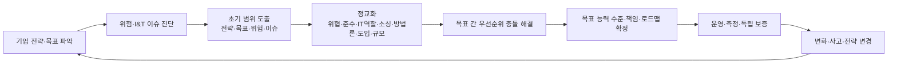

# COBIT 2019 기반 정보기술 거버넌스 설계와 구현

## 1. 개요

> **정의**: COBIT 2019는 기업의 정보와 기술(I&T)이 이해관계자 가치를 창출하도록 거버넌스 체계와 관리 체계를 설계·운영·평가하는 ISACA의 프레임워크이다.

기업에서 정보기술은 단순히 시스템을 운영하는 지원 기능을 넘어 상품, 업무 프로세스, 고객 경험, 규제 준수와 직결되는 사업 역량이 되었다. 그러나 기술 부서가 빠르게 서비스를 제공하는 것만으로는 투자 효과가 보장되지 않는다. 어떤 기술 투자를 우선할지, 위험을 어느 수준까지 수용할지, 장애와 개인정보 침해의 책임을 누가 질지, 외부 사업자를 어떻게 통제할지를 경영 의사결정으로 연결해야 한다.

COBIT 2019는 이 문제를 특정 제품이나 단일 통제목록으로 해결하려 하지 않는다. 기업의 전략, 목표, 위험, 규제 환경, 기술 도입 방식과 규모를 먼저 파악한 뒤, 40개의 거버넌스·관리 목표와 구성요소를 기업 상황에 맞게 우선순위화한다. 따라서 작은 조직이 모든 목표를 같은 수준으로 적용하는 방식보다, 중요한 위험과 가치 흐름에 집중하는 방식에 적합하다.

거버넌스와 관리는 책임의 방향이 다르다. 거버넌스는 이해관계자의 요구를 평가하고, 방향을 정하며, 성과와 준수 상태를 모니터링하는 이사회·최고경영진의 활동이다. 관리는 정해진 방향에 따라 계획하고, 구축하고, 운영하고, 개선하는 경영진과 실무자의 활동이다. 두 영역을 혼동하면 이사회가 운영 티켓을 직접 처리하거나 실무자가 투자 우선순위를 독자적으로 결정하는 문제가 생긴다.

기술사 관점에서 COBIT 2019의 핵심은 프레임워크를 도입했다는 선언이 아니라 의사결정과 통제의 연결이다. 사업 목표를 I&T 목표로 변환하고, 목표를 프로세스와 책임으로 연결하고, 통제 수행을 측정 가능한 증거로 남겨야 한다. 또한 감사 대응을 위한 문서와 실제 서비스 품질을 위한 운영 절차가 같은 체계 안에서 작동해야 한다.

이 글은 COBIT 2019의 원칙과 핵심 모델, 설계 요인, 목표 체계, 구현 절차, 다른 표준과의 관계 및 실무 적용 시 고려사항을 논술형 답안 수준으로 정리한다.

## 2. COBIT 2019 거버넌스 체계의 기본 구조

### 가. 거버넌스와 관리의 분리

거버넌스는 “무엇을 왜 할 것인가”를 책임진다. 이사회나 최고경영진은 투자 포트폴리오, 위험 수용 수준, 규제 준수 방향, 자원 배분을 평가하고 결정한다. 경영진은 그 결정이 조직의 전략과 일관되도록 방향을 제시하며, 계획 대비 성과와 위험을 계속 감시한다.

관리는 “결정된 방향을 어떻게 실행할 것인가”를 책임진다. 아키텍처를 설계하고, 프로젝트를 수행하고, 서비스를 운영하고, 공급업체와 계약하고, 사고를 처리하는 활동이 여기에 속한다. 관리자는 거버넌스 기관이 제시한 성과·위험·준수 기준을 일상 업무의 계획과 통제로 구체화해야 한다.

이 구분은 조직도를 단순히 두 개로 나누는 작업이 아니다. 예를 들어 클라우드 전환을 추진할 때 이사회는 전환의 전략적 가치와 위험 수용 범위를 결정하고, 경영진은 목표 아키텍처·예산·로드맵을 만든다. 운영팀은 실제 마이그레이션과 모니터링을 수행하지만, 사업 위험을 허용할지 여부를 운영팀이 임의로 바꾸어서는 안 된다.

거버넌스와 관리 사이에는 피드백이 있어야 한다. 관리 결과에서 비용 초과, 장애 증가, 규제 위반이 발견되면 관리자는 원인과 대안을 보고하고, 거버넌스 기관은 목표와 자원·위험 한도를 재조정한다. 일방향 보고만 존재하면 목표가 현실과 분리되므로, 지표와 의사결정 회의가 순환 구조를 가져야 한다.

### 나. COBIT 핵심 모델과 다섯 도메인

COBIT 2019의 핵심 모델은 하나의 일반적인 참조 모델을 제공하되, 모든 기업에 동일한 통제를 강제하지 않는다. 모델의 목적은 공통 언어와 추적 가능한 구조를 제공하는 것이다. 기업은 이 구조를 시작점으로 삼아 중요한 목표를 선택하고, 필요한 목표에는 목표 능력 수준과 통제 증거를 정의한다.

EDM(Evaluate, Direct and Monitor)은 거버넌스 목표가 모인 도메인이다. 이해관계자의 요구를 평가하고 전략적 대안을 지시하며, 성과와 준수 상태를 모니터링한다. EDM의 산출물은 운영 작업 목록이 아니라 투자 방향, 위험 수용, 자원 활용, 이해관계자 투명성에 관한 경영진의 결정이다.

APO(Align, Plan and Organize)는 정보와 기술을 조직의 전략·구조·인력·공급망에 정렬하는 관리 도메인이다. 전략, 엔터프라이즈 아키텍처, 혁신, 포트폴리오, 예산, 위험, 보안, 데이터와 인력 계획이 연결된다. 계획을 세우는 것만으로 끝내지 않고, 실제 자원과 책임을 배치해 실행 가능하게 만드는 것이 관건이다.

BAI(Build, Acquire and Implement)는 솔루션을 획득·개발하고 변화시켜 업무에 정착시키는 도메인이다. 프로그램과 프로젝트, 요구사항, 변화, 자산, 구성, 지식 관리 등을 다룬다. BAI의 통제가 약하면 계획과 운영 사이에 품질·보안·추적성의 공백이 발생한다.

DSS(Deliver, Service and Support)는 서비스의 일상 운영을 책임진다. 운영, 서비스 요청과 사고, 문제, 연속성, 보안 서비스, 업무 프로세스 통제가 포함된다. 운영 지표는 단순 가동률이 아니라 복구 시간, 재발률, 사용자 영향, 보안 탐지·대응의 품질과 연계해야 한다.

MEA(Monitor, Evaluate and Assess)는 내부 통제, 외부 요구사항, 성과와 적합성을 점검하는 도메인이다. 자기평가와 독립적 보증을 구분하고, 발견사항의 조치가 실제로 종료되었는지 확인한다. 감사 보고서 작성만으로는 목적을 달성할 수 없으며, 개선 조치가 다시 거버넌스 의사결정에 반영되어야 한다.

| 도메인 | 역할 | 대표적인 질문 |
|---|---|---|
| EDM | 거버넌스 | 투자·위험·성과의 방향을 누가 결정하는가? |
| APO | 정렬·계획 | 전략과 I&T 자원·아키텍처를 어떻게 연결하는가? |
| BAI | 구축·변화 | 솔루션을 어떤 기준으로 만들고 업무에 정착시키는가? |
| DSS | 운영·지원 | 서비스와 사고를 어떤 수준으로 제공하고 복구하는가? |
| MEA | 평가·보증 | 성과와 준수의 증거를 어떻게 평가하고 개선하는가? |

표의 도메인은 순차적인 부서 구분이 아니다. 예를 들어 개인정보 보호 요구사항은 APO의 위험·보안 계획에서 시작하여 BAI의 설계·변경 통제로 이어지고, DSS의 접근·사고 대응으로 운영되며, MEA의 준수 평가로 검증된다. 도메인별 담당자를 정하더라도 목표 간 입력·출력과 책임의 인계점을 함께 설계해야 한다.

## 3. COBIT 2019의 원칙과 구성요소

### 가. 거버넌스 체계의 원칙

COBIT 2019는 이해관계자의 요구를 충족하기 위한 체계적이고 동적인 거버넌스, 거버넌스와 관리의 분리, 기업의 모든 조직 기능을 포함하는 엔드투엔드 관점, 하나의 통합 프레임워크, 총체적 관점, 요구에 맞는 맞춤형 설계를 강조한다. 이 원칙들은 체크리스트라기보다 설계 시 빠뜨리지 말아야 할 관점이다.

총체적 관점은 프로세스만 잘 만들면 통제가 작동한다는 생각을 경계한다. 프로세스의 책임자가 없거나, 위원회가 결정을 내리지 않거나, 필요한 데이터가 없거나, 구성원의 행동이 보상체계와 충돌하면 문서화된 프로세스는 실제 성과로 이어지지 않는다. 기술사는 절차뿐 아니라 조직 구조, 정보 흐름, 문화와 역량까지 함께 분석해야 한다.

엔드투엔드 관점은 I&T 거버넌스를 IT 부서의 내부 품질 활동으로 한정하지 않는다. 사업부가 SaaS를 직접 구매하고, 협력사가 데이터를 처리하고, 고객 채널이 API를 호출하는 환경에서는 I&T 위험이 조직 경계를 넘는다. 기업 거버넌스, 사업 프로세스, 외부 공급망까지 포함해야 의사결정의 책임과 위험의 실제 위치가 맞아진다.

맞춤형 설계 원칙은 “COBIT를 전부 도입한다”는 방식의 낭비를 줄인다. 금융기관의 규제와 사이버 위험은 제조업의 운영기술 위험과 다르고, 스타트업의 속도와 대기업의 분리통제도 다르다. 동일한 목표라도 요구되는 능력 수준, 증거의 빈도, 승인 계층과 자동화 수준은 달라질 수 있다.

### 나. 일곱 가지 거버넌스 체계 구성요소

거버넌스 체계는 원칙과 정책, 프로세스, 조직 구조, 정보, 서비스·인프라·애플리케이션, 사람·기술·역량, 문화·윤리·행동으로 구성된다. 일부 자료에서는 구성요소의 명칭을 다르게 번역하지만, 핵심은 프로세스만으로 거버넌스를 설명하지 않는다는 점이다.

원칙·정책·프레임워크는 의사결정의 경계를 만든다. 클라우드 사용 정책, 데이터 분류 정책, 변경관리 기준, 외부 위탁 기준처럼 구성원이 판단할 수 있는 규칙으로 내려와야 한다. 정책이 선언에 머물면 예외와 승인 기준이 없어 현장의 임의 해석이 늘어난다.

프로세스는 목표를 달성하기 위한 반복 가능한 활동과 입력·출력·통제를 정의한다. 프로세스 성숙도는 문서의 분량이 아니라 실제 업무가 재현되고, 예외가 기록되고, 결과가 측정되는지로 판단한다. 자동화된 승인 흐름과 티켓의 증적은 프로세스 실행을 가시화하는 수단이다.

조직 구조는 의사결정 권한과 책임의 배치다. 이사회, 위험위원회, 데이터위원회, 아키텍처위원회, CISO, CIO, 사업부 제품책임자의 권한이 중복되거나 공백이면 통제 속도가 느려진다. RACI를 만들 때는 책임자와 승인자를 구분하고, 최종 위험 수용권자를 명확히 해야 한다.

정보는 거버넌스가 작동하는 연료다. 포트폴리오 현황, 위험 등록부, 자산·구성 정보, SLA, 사고 지표, 감사 결과가 서로 다른 정의를 사용하면 경영진 보고의 신뢰성이 떨어진다. 데이터 소유자와 품질 기준, 갱신 주기, 보존 기간을 정하고 지표의 계산식을 표준화해야 한다.

서비스·인프라·애플리케이션은 실제 가치를 제공하는 기술 자원이다. 가용성만 보지 말고 복구성, 보안성, 확장성, 상호운용성, 비용 효율성을 서비스 수준으로 정의한다. 서비스 카탈로그와 구성관리 데이터가 연결되면 장애의 영향 범위와 변경 위험을 신속히 판단할 수 있다.

사람·기술·역량은 계획된 통제를 수행할 수 있는 능력이다. 예를 들어 클라우드 보안 정책이 있어도 IAM 설계자, 로그 분석자, 사고 대응자의 역량이 부족하면 통제는 형식적이다. 교육 수료율보다 실제 역할 수행과 훈련 결과, 교대·대체 가능성을 확인하는 것이 중요하다.

문화·윤리·행동은 통제 우회와 보고 지연을 좌우한다. 장애를 숨기는 문화에서는 가동률 지표가 좋아 보여도 잠재 위험이 누적된다. 실수를 보고해도 학습과 개선으로 이어지는 환경, 보안·개인정보를 납기와 함께 평가하는 보상체계가 필요하다.

### 다. 목표와 관리 실천의 계층

각 거버넌스·관리 목표는 목적, 관련 지표, 수행 관행, 책임과 입력·출력의 관계로 구체화된다. 목표는 “보안을 강화한다”처럼 추상적으로 끝나지 않고, 보안 서비스가 승인된 위험 수준과 정책에 맞게 제공되고 모니터링되는 상태를 설명해야 한다.

수행 관행은 목표를 달성하기 위해 수행할 세부 활동이다. 예를 들어 변경관리 목표에서는 변경 요청의 분류, 영향 분석, 승인, 테스트, 배포, 사후검토와 긴급 변경의 예외 절차가 연결되어야 한다. 활동의 증거로 승인 기록, 테스트 결과, 배포 로그, 사후검토를 남기면 감사와 운영 개선을 동시에 지원할 수 있다.

목표의 지표는 활동량과 결과를 구분해야 한다. 교육 횟수나 검토 건수만 늘어도 사고가 줄지 않을 수 있다. 따라서 통제 수행률과 함께 재발 사고율, 승인 없는 변경 비율, 취약점의 평균 조치 기간, 서비스 영향시간처럼 결과 지표를 둔다.

## 4. 설계 요인과 맞춤형 거버넌스 설계

### 가. 설계 요인의 의미

COBIT 2019의 설계 요인은 기업의 거버넌스 체계를 획일적으로 적용하지 않고 우선순위와 목표 능력 수준을 조정하기 위한 입력값이다. 전략과 목표, 위험 프로파일, I&T 관련 이슈를 바탕으로 초기 범위를 정하고, 위협 환경·준수 요구·IT의 역할·소싱 모델·구현 방식·기술 도입 전략·기업 규모를 고려해 범위를 정교화한다.

설계 요인은 단순 설문 점수가 아니다. 각 값에는 근거가 있어야 한다. 예를 들어 위협 환경을 높음으로 평가했다면 최근 공격, 노출 자산, 위협 인텔리전스, 산업별 공격 추세와 같은 증거를 연결한다. 외주 중심의 소싱 모델을 선택했다면 계약의 감사권, 하청 처리자, 서비스 수준과 종료·이관 계획을 함께 검토한다.

### 나. 설계 워크플로

첫 단계는 기업의 전략과 목표를 이해하는 것이다. 비용 효율, 성장, 고객 신뢰, 규제 준수, 회복탄력성 등 전략의 표현이 I&T에 어떤 결과를 요구하는지 분석한다. 이 단계에서 IT 부서의 현재 프로젝트 목록만 보면 이미 시작된 사업을 정당화하는 수준에 머물 수 있으므로, 사업 성과와 이해관계자의 기대에서 출발해야 한다.

두 번째 단계는 초기 범위를 정하는 것이다. 전략·기업 목표·위험 프로파일·현재 I&T 이슈를 통해 중요한 목표를 좁힌다. 예를 들어 디지털 금융 서비스가 핵심인 조직에서 인증 장애와 개인정보 침해가 주요 위험이라면 보안·연속성·사고·데이터 목표의 우선순위가 올라갈 수 있다.

세 번째 단계는 정교화다. 규제 산업인지, IT가 사업의 핵심인지, 대부분을 외부 클라우드에 의존하는지, 애자일·DevOps로 빠르게 배포하는지, 최신 기술을 선도적으로 도입하는지에 따라 동일한 목표의 통제 방식이 달라진다. 기업 규모가 작다면 역할을 겸임할 수 있지만, 상호검토와 독립성의 대체 통제를 명시해야 한다.

마지막 단계는 우선순위 충돌을 해결하는 것이다. 보안 승인을 강화하면 배포 속도가 늦어지고, 데이터 보존을 늘리면 분석 편의가 높아지는 동시에 개인정보 위험이 커질 수 있다. 충돌을 숨기지 말고 위험·비용·가치의 가정을 기록하며, 최종 위험 수용자와 검토 시점을 결정해야 한다.

### 다. 설계 요인 적용 시의 산출물

설계 워크숍의 결과는 단순한 점수표가 아니라 거버넌스 설계서가 되어야 한다. 최소한 기업 목표와 I&T 목표의 연결, 우선 목표 목록, 목표 능력 수준, 책임 조직, 핵심 통제, 증거, 예상 비용, 단계별 로드맵을 포함한다.

| 산출물 | 핵심 내용 | 검토 포인트 |
|---|---|---|
| 맥락 진단서 | 전략·규모·위험·규제·현재 이슈 | 사실과 의견이 구분되었는가? |
| 목표 우선순위 | 40개 목표 중 집중 대상과 이유 | 위험·가치 근거가 있는가? |
| 능력 수준 정의 | 목표별 현재 수준과 목표 수준 | 수준을 올릴 실현 계획이 있는가? |
| 책임 매트릭스 | 이사회·경영진·실무·공급자 역할 | 위험 수용권자가 명확한가? |
| 통제·증거 목록 | 활동·지표·승인·로그·보고서 | 증거가 자동으로 생성되는가? |
| 실행 로드맵 | 빠른 개선, 중기 구축, 지속 개선 | 의존성과 예산이 반영되었는가? |

현재 수준과 목표 수준을 구분하지 않으면 “성숙도 4를 달성한다”는 선언만 남는다. 목표 수준을 정할 때에는 법적 최소요건, 사업 영향, 위험 감소 효과, 필요한 역량, 자동화 가능성을 함께 검토한다. 위험이 높은 목표에 무조건 최고 수준을 부여하기보다, 수준을 높이는 비용과 잔여 위험을 경영진이 이해하도록 설명해야 한다.

## 5. 목표 능력 수준과 성과 측정

### 가. 능력 수준의 해석

COBIT 2019의 프로세스 능력은 활동이 수행되는 정도와 관리·측정·개선의 수준을 판단하는 관점이다. 낮은 수준에서는 업무가 개인 경험에 의존할 수 있지만, 수준이 높아질수록 표준화, 측정, 예측, 지속 개선이 강화된다. 숫자 자체보다 조직이 안정적으로 결과를 반복할 수 있는지를 봐야 한다.

능력 수준 평가는 문서 보유 여부만으로 결정해서는 안 된다. 정책, 실행 기록, 표본 테스트, 인터뷰, 지표 추세, 예외 처리와 개선 조치가 서로 일관되는지 확인한다. 정책은 있으나 승인 없는 변경이 반복된다면 문서 수준과 실행 수준이 다르므로 그 차이를 감사 결론과 개선계획에 반영한다.

현재 수준을 높이는 방법은 인력 증원만이 아니다. 표준 API와 자동화된 정책 검증, 배포 파이프라인의 승인 게이트, 중앙 로그, 서비스 카탈로그와 같이 반복 업무를 시스템에 내장하는 방법이 있다. 다만 자동화가 잘못된 정책을 빠르게 확산할 수 있으므로, 정책 변경의 검토와 롤백을 함께 설계해야 한다.

### 나. 지표의 계층화

성과관리는 경영진 지표와 관리 지표, 운영 지표를 계층으로 나누어야 한다. 경영진은 사업 가치, 위험 노출, 규제 준수, 핵심 서비스 회복력을 보고, 관리자는 프로젝트·서비스·공급자의 편차를 본다. 운영자는 사고 건별 대응 시간, 배포 실패, 취약점 조치와 같은 실행 지표를 사용한다.

예를 들어 “서비스 가용성 99.9%”라는 지표는 월간 전체 평균만으로는 부족하다. 중요한 거래 시간대의 가용성, 장애의 고객 영향, 복구 목표 달성 여부, 계획된 변경으로 인한 중단을 구분해야 한다. 같은 지표라도 정의와 분모가 다르면 부서 간 비교가 왜곡되므로 계산식을 중앙에서 관리한다.

위험 지표는 발생한 사건 수만 보지 않는다. 중요 자산 중 다중인증이 적용되지 않은 비율, 지원 종료 소프트웨어의 노출, 고위험 취약점의 평균 조치 기간, 복구훈련 성공률, 공급자 점검 미완료 비율처럼 선행 지표를 포함한다. 사고 후 지표와 예방 지표를 함께 보면 위험이 커지는 방향을 조기에 발견할 수 있다.

### 다. 독립 보증과 자기평가

관리자는 일상적으로 자기평가를 수행하고, 독립적인 내부감사나 제3자 보증은 자기평가의 편향과 통제 설계의 적정성을 검토한다. 두 활동은 경쟁 관계가 아니다. 자기평가가 정확하면 독립 보증의 범위를 위험 높은 영역에 집중할 수 있다.

보증 결과는 적합·부적합의 이분법에 그치지 않고 위험의 심각도, 업무 영향, 재발 가능성, 조치 책임자와 기한을 포함해야 한다. 조치가 완료되었다는 보고만으로 폐쇄하지 말고 재시험과 효과성 검증을 수행한다. 반복 지적은 개별 담당자의 실수보다 목표·조직·프로세스 설계의 문제일 수 있다.

## 6. 구현 절차와 운영 모델

### 가. 준비와 범위 설정

구현의 첫 단계는 프레임워크 교육이 아니라 문제와 목적을 정의하는 것이다. 비용 과다, 반복 장애, 규제 감사 지적, 프로젝트 실패, 공급자 의존과 같은 동인을 명확히 하고, 해결하지 않을 때의 사업 영향을 산정한다. 후원자는 CIO 한 명에 한정하지 않고 사업·위험·재무·보안 책임자가 참여해야 한다.

범위는 전사 전체 또는 핵심 서비스 하나로 정할 수 있다. 처음부터 전사 40개 목표를 다루면 현장 저항과 문서 부담이 커진다. 반대로 너무 좁으면 인접 시스템과 공급자의 위험을 놓칠 수 있으므로 서비스 가치사슬과 데이터 흐름을 기준으로 경계를 정의한다.

### 나. 현황 진단과 목표 모델

현황 진단에서는 기존의 ITIL, ISO/IEC 27001, ISO/IEC 38500, PMBOK, 내부통제, 개인정보보호 관리체계 같은 자산을 먼저 확인한다. COBIT를 별도의 중복 통제 체계로 만들기보다, 기존 활동을 COBIT 목표와 연결하는 방식이 효율적이다.

예를 들어 ITIL의 사고관리 절차는 DSS02와 연결할 수 있고, 정보보호 관리체계의 위험평가와 접근통제는 APO12·APO13 및 DSS05와 연결할 수 있다. 단순히 이름만 대응시키지 말고 목표의 의도, 책임, 수행 빈도, 증거와 공백을 비교해야 한다.

갭 분석은 문서 갭, 실행 갭, 성과 갭으로 나누면 유용하다. 문서 갭은 정책·절차·역할이 없는 상태이고, 실행 갭은 절차가 있으나 수행되지 않는 상태다. 성과 갭은 수행은 되지만 원하는 위험 감소나 서비스 성과가 나오지 않는 상태이며, 자동화·자원·목표값의 재설계가 필요할 수 있다.

### 다. 단계적 실행과 변화관리

빠른 개선 과제는 위험이 높고 효과를 측정하기 쉬운 영역에서 선정한다. 예를 들어 특권계정 검토, 중요 서비스의 복구훈련, 승인 없는 변경 차단, 외부 공급자 접근 만료, 핵심 데이터 소유자 지정과 같은 과제는 짧은 주기로 결과를 확인할 수 있다.

중기 과제는 서비스 카탈로그, 구성관리, 통합 위험 등록부, 성과 대시보드, 정책 자동화처럼 여러 조직을 연결하는 기반이다. 이 과제는 기술만 구축해서는 안 되고 데이터 정의, 책임, 예외 승인, 운영 비용을 함께 정해야 한다.

변화관리는 교육 자료를 배포하는 것으로 끝나지 않는다. 현업이 왜 승인과 기록을 해야 하는지 업무 영향으로 설명하고, 신규 프로세스가 기존보다 빠르거나 안전하다는 경험을 제공해야 한다. 평가와 보상에 품질·보안·복구 결과를 반영하지 않으면 납기만 중시하는 행동으로 회귀할 수 있다.

## 7. 사례: 금융사의 디지털 채널 거버넌스

한 금융사가 모바일 대출 채널을 확대하면서 클라우드와 외부 AI 서비스를 함께 도입한다고 가정한다. 사업 목표는 심사 처리시간 단축과 고객 편의 향상이지만, 개인정보 유출, 모델 편향, 서비스 장애, 제3자 재위탁, 규제 위반이 주요 위험이 된다.

먼저 거버넌스 기관은 자동화 수준과 사람 검토가 필요한 업무를 결정한다. AI가 서류 누락을 탐지하는 보조 기능과 신용 승인 여부를 최종 결정하는 기능은 허용 오류와 책임이 다르므로 같은 통제로 묶지 않는다. 모델과 데이터의 변경이 심사 결과에 영향을 주는 경우를 중대 변경으로 정의한다.

APO 단계에서는 데이터 분류, 위험 평가, 외부 공급자 조건, 모델 관리 원칙, 서비스 수준을 설계한다. BAI 단계에서는 요구사항에 개인정보 최소수집과 설명 가능성, 감사 로그를 포함하고, 모델과 API 변경에 대한 독립 검토를 둔다. DSS 단계에서는 장애·사고·민원·오탐을 운영하고, MEA 단계에서는 모델 성능과 규제 준수의 증거를 주기적으로 평가한다.

운영 지표는 평균 승인시간 하나로 정하지 않는다. 채널 가용성, 심사 보류율, 수동 검토 전환율, 하위집단별 오류 차이, 개인정보 접근 이상징후, 공급자 SLA 위반, 복구훈련 결과를 함께 본다. 속도는 좋아졌지만 특정 고객군의 오류가 커졌다면 거버넌스 목표를 달성한 것으로 볼 수 없다.

이 사례에서 중요한 것은 COBIT 목표를 많이 적용하는 것이 아니다. 사업의 핵심 가치와 위험을 정의하고, 그 위험을 줄이는 목표와 책임·증거를 연결하는 것이다. 같은 설계 방식은 공공 서비스, 제조 운영기술, 의료 데이터 플랫폼에도 적용할 수 있으나 설계 요인의 값과 목표 능력 수준은 달라져야 한다.

## 8. COBIT 2019와 관련 표준·프레임워크 비교

COBIT 2019는 거버넌스와 관리의 전체 구조를 제공하는 반면, 다른 표준은 특정 목적이나 영역에 더 깊은 지침을 제공한다. 따라서 하나를 선택해 나머지를 버리기보다, COBIT를 상위 정렬·평가 구조로 보고 기존 표준의 상세 통제를 목표에 배치하는 방식이 현실적이다.

| 구분 | COBIT 2019 | ISO/IEC 27001 | ITIL 4 | ISO/IEC 38500 |
|---|---|---|---|---|
| 주된 목적 | I&T 거버넌스·관리 체계 | 정보보호 관리시스템 | IT 서비스 관리 | 기업 IT 거버넌스 원칙 |
| 범위 | 가치·위험·자원·성과와 전 생명주기 | 정보보호 위험과 통제 | 서비스 가치 창출과 운영 | 이사회 수준의 평가·지시·모니터링 |
| 강점 | 설계 요인·목표·능력·보증의 통합 | 인증 가능한 ISMS 구조 | 서비스 운영 실천과 가치 흐름 | 최고 의사결정자의 책임 명확화 |
| 적용 방식 | 우선순위화 후 맞춤 적용 | 위험 기반 통제 선정 | 서비스 관리 실천 조합 | 원칙에 따른 경영진 의사결정 |

COBIT와 ISO/IEC 27001의 차이는 우열이 아니라 추상화 수준과 목적이다. COBIT는 보안 외에도 투자, 아키텍처, 포트폴리오, 프로젝트, 운영, 보증을 연결한다. ISO/IEC 27001은 정보보호 위험을 관리하고 관리시스템의 지속 개선을 증명하는 데 강하므로, COBIT의 보안·위험 목표에 상세 통제와 심사 증거를 제공할 수 있다.

COBIT와 ITIL 4도 경쟁하지 않는다. ITIL은 서비스가 가치를 공동 창출하도록 서비스 관리 실천을 구체화하고, COBIT는 그 서비스 관리가 기업 목표와 위험·준수 방향에 맞는지 거버넌스 관점에서 조정한다. ITIL의 사고관리 지표를 COBIT의 성과·위험 보고에 연결하면 운영 개선이 경영 의사결정으로 올라간다.

ISO/IEC 38500은 이사회가 IT를 평가·지시·모니터링해야 한다는 원칙을 강조한다. COBIT의 EDM 도메인과 자연스럽게 연계할 수 있지만, COBIT는 그 원칙을 관리 목표와 구성요소, 능력 및 증거 수준까지 확장한다. 기술사는 중복 위원회와 이중 보고를 만들지 않도록 책임과 회의체를 통합해야 한다.

## 9. 심화: 클라우드·AI 시대의 COBIT 적용

클라우드 환경에서는 자산이 조직의 데이터센터에 있지 않더라도 거버넌스 책임이 사라지지 않는다. 서비스형 소프트웨어의 구성과 로그, 데이터 처리 위치, 하청 구조, 종료 시 데이터 반환·삭제, 복구 책임을 계약과 운영 절차에 명시해야 한다. 공유책임 모델은 공급자와 고객의 책임 경계를 설명할 뿐, 고객의 위험 수용 결정을 공급자에게 위임하는 근거가 아니다.

AI 시스템에서는 데이터와 모델의 변경이 지속적으로 일어난다. 따라서 정적 승인 문서보다 데이터·모델 버전, 평가 실행, 프롬프트·정책 변경, 사람 검토, 사고와 롤백을 연결하는 운영 증거가 중요하다. 모델 카드, 데이터시트, 모델 레지스트리, 레드팀 결과를 APO·BAI·DSS·MEA의 목표와 연결하면 투명성과 운영 통제를 함께 높일 수 있다.

DevOps와 애자일 환경에서는 모든 변경을 느린 위원회 승인으로 막는 방식이 효과적이지 않다. 위험 기반으로 변경을 분류하고, 자동화된 테스트·정책 검증·배포 승인·관찰성·롤백을 파이프라인에 내장해야 한다. 고위험 변경에는 분리 승인과 사후검토를 두되, 저위험 반복 변경은 사전 승인된 표준 변경으로 처리할 수 있다.

지속가능성도 I&T 거버넌스의 설계 요인이 될 수 있다. 데이터센터 전력, 모델 추론 비용, 장비 수명, 폐기 데이터, 공급망의 환경·사회적 위험을 포트폴리오와 성과 지표에 반영한다. 비용 절감만으로 리소스를 줄이면 회복성과 보안이 악화될 수 있으므로, 탄소·비용·서비스 품질·위험의 균형을 목표로 관리한다.

## 10. 고려사항 및 시사점

### 가. 프레임워크 도입보다 의사결정의 실효성을 우선한다

COBIT 인증이나 문서 수가 목적이 되면 현장은 통제 피로를 느끼고, 경영진은 실제 위험을 보지 못한다. 핵심 서비스와 데이터 흐름을 먼저 선정하고, 어떤 의사결정을 개선하려는지 명확히 해야 한다. 프레임워크 항목은 의사결정과 위험을 설명하는 공통 언어로 사용한다.

### 나. 책임과 권한을 함께 설계한다

책임자를 지정하면서 예산·인력·중단 권한을 주지 않으면 통제 실패를 개인의 문제로 돌리게 된다. 위험 수용권자, 통제 운영자, 독립 검토자, 공급자 담당자를 구분하고, 사고나 규제 변화 때 의사결정 경로를 시험한다. RACI에는 책임뿐 아니라 최종 판단과 에스컬레이션 조건도 포함한다.

### 다. 증거를 업무 흐름에 내장한다

감사 직전에 증거를 모으는 방식은 누락과 조작 가능성을 높인다. 티켓, 코드 저장소, 배포 로그, 접근 검토, 서비스 모니터링, 교육·훈련 결과를 정상 업무 과정에서 자동 생성하고 보존한다. 자동 증거도 원천 데이터의 정확성과 접근권한, 보존 기간을 관리해야 신뢰할 수 있다.

### 라. 위험 기반 우선순위와 잔여 위험을 공개한다

모든 목표를 최고 수준으로 관리하려는 계획은 비용과 속도의 제약을 무시한다. 우선순위 결정의 근거, 목표 능력 수준, 예산, 예상 잔여 위험을 경영진이 이해할 수 있게 제시한다. 수용된 잔여 위험은 기간과 재평가 조건을 포함해야 하며, “낮음”이라는 표현만으로 영구 면제를 만들지 않는다.

### 마. 공급망과 조직 경계를 거버넌스에 포함한다

SaaS, 클라우드, 오픈소스, 외부 AI API, 하청 개발사는 기업의 I&T 성과와 위험에 직접 영향을 준다. 계약의 감사권만 확인하지 말고 데이터 위치·접근, 취약점 통지, 사고 보고, 하청 변경, 서비스 종료와 이관, 복구 시험을 검증한다. 공급자 통제 결과도 내부 위험 등록부와 성과 보고에 연결한다.

### 바. 지속적인 검토와 학습 구조를 만든다

전략, 규제, 위협, 기술 도입 방식이 변하면 설계 요인과 목표 우선순위도 변한다. 정기 검토 외에 중대 장애, 인수합병, 클라우드 전환, AI 모델 변경, 규제 개정과 같은 사건을 재설계 트리거로 정의한다. 거버넌스는 한 번 완료하는 프로젝트가 아니라 변화에 반응하는 운영 능력이다.

## 참고자료

- ISACA, “COBIT®| Control Objectives for Information Technologies®” — https://www.isaca.org/resources/cobit
- ISACA, “COBIT 2019 and COBIT 5 Comparison: Governance System Design” — https://www.isaca.org/resources/news-and-trends/industry-news/2020/cobit-2019-and-cobit-5-comparison
- ISACA, “New COBIT 2019 Resources Help Organizations Design and Implement Tailored Governance Systems” — https://www.isaca.org/about-us/newsroom/press-releases/2018/new-cobit-2019-resources-help-organizations-design-and-implement-tailored-governance-systems
- ISACA, “Designing Your Organization’s Custom COBIT” — https://www.isaca.org/resources/news-and-trends/industry-news/2019/designing-your-organizations-custom-cobit
- ISACA, “Defining Target Capability Levels in COBIT 2019” — https://www.isaca.org/resources/news-and-trends/industry-news/2019/defining-target-capability-levels-in-cobit-2019-a-proposal-for-refinement

---

> **한 줄 요약**: COBIT 2019는 기업 전략·위험·규제·기술 환경을 설계 요인으로 반영하여, I&T 거버넌스와 관리를 목표·책임·증거·성과로 연결하는 맞춤형 프레임워크다.
