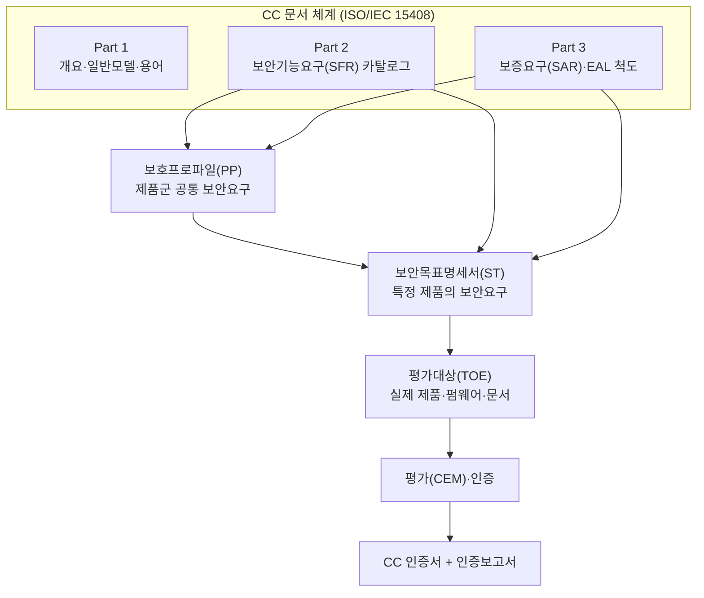
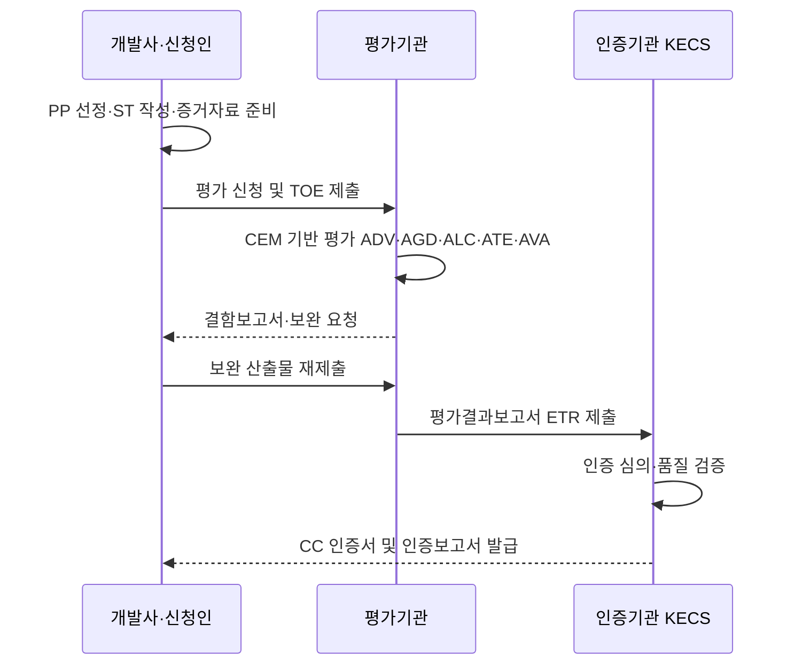

# 공통평가기준(CC, Common Criteria / ISO/IEC 15408)

## 1. 개요

### 가. 정의
> **공통평가기준(CC, Common Criteria for Information Technology Security Evaluation)** 은 정보보호 제품·시스템의 보안 기능과 그 기능이 올바르게 구현·운영된다는 **보증(Assurance)** 수준을 제3의 독립 기관이 표준화된 절차로 평가·인증하기 위한 국제표준으로, **ISO/IEC 15408**(평가기준)과 그 평가방법론인 **ISO/IEC 18045(CEM)** 로 구성된다.

CC는 "이 제품이 어떤 보안 기능을 제공하는가"(기능성)와 "그 기능이 얼마나 신뢰할 수 있게 만들어졌는가"(보증)를 분리해 다루는 것이 특징이다. 즉 방화벽이 패킷을 차단한다는 사실(기능)과, 그 차단 로직이 설계·구현·시험·취약점 분석을 거쳐 결함 없이 동작함이 증명되었다는 사실(보증)을 별개의 축으로 평가한다.

### 나. 등장 배경 및 필요성
CC 이전에는 국가·지역마다 서로 다른 보안 평가기준이 난립했다. 미국의 **TCSEC(오렌지북)**, 유럽의 **ITSEC**, 캐나다의 **CTCPEC** 가 각각 다른 등급 체계와 용어를 사용했기 때문에, 한 나라에서 인증받은 제품을 다른 나라에 수출하려면 매번 재평가를 받아야 했다. 이는 개발사에는 중복 비용을, 도입 기관에는 비교 불가능성을 안겼다. 보안 제품의 신뢰도를 객관적으로 비교할 공통 언어가 없었던 것이다.

CC는 이러한 파편화를 해소하기 위해 1990년대 여러 기준을 **조화(harmonization)** 시켜 만들어졌고, 1999년 ISO/IEC 15408로 국제표준화되었다. 핵심 동기는 "한 번 평가받으면 여러 나라에서 인정받는다(Evaluate once, recognize everywhere)"는 **상호인정(Mutual Recognition)** 이다. 이를 제도적으로 뒷받침하는 것이 **CCRA(CC Recognition Arrangement)** 이며, 회원국은 정해진 범위 내에서 서로의 인증서를 인정한다.

필요성은 세 가지로 정리된다. 첫째, **객관적 신뢰 근거**다. 공급자의 자기 주장이 아니라 독립 평가기관의 표준화된 검증 결과로 보안성을 판단할 수 있다. 둘째, **조달 요건 충족**이다. 국내 공공기관은 정보보호 제품 도입 시 원칙적으로 CC 인증(또는 그에 준하는 검증)을 요구하므로, CC 인증은 시장 진입의 관문으로 작동한다. 셋째, **비교 가능성**이다. 서로 다른 제품이라도 동일한 PP(보호프로파일)를 기준으로 평가되면 보안 요구 충족 여부를 동일 척도로 비교할 수 있다.

### 다. CC의 특징
CC의 첫 번째 특징은 **기능성과 보증의 분리**다. TCSEC이 등급마다 기능과 보증을 한데 묶어 경직됐던 것과 달리, CC는 무엇을 하는가(SFR)와 얼마나 믿을 수 있는가(SAR)를 독립 축으로 다뤄, 같은 기능이라도 위협 수준에 맞춰 보증 강도를 달리 선택할 수 있게 했다. 이 분리 덕분에 저위협 환경의 저비용 인증부터 고위협 환경의 고보증 인증까지 하나의 틀로 수용된다.

두 번째 특징은 **재사용 가능한 요구사항 카탈로그**다. SFR·SAR이 클래스–패밀리–컴포넌트로 표준화되어 있어, PP·ST 작성 시 이를 조합·정련하면 되므로 요구사항 정의의 표현력과 일관성이 동시에 확보된다. 세 번째는 **국제 상호인정**으로, CCRA를 통해 한 회원국의 인증을 다른 회원국이 정해진 범위에서 인정하므로 중복 평가 비용을 줄인다. 이 세 특징이 결합되어 CC는 정보보호 제품 신뢰성의 공통 언어로 자리 잡았다.

## 2. CC 구성체계와 핵심 개념

CC의 문서 체계와 평가 대상·요구사항의 관계를 전체 구조로 나타내면 다음과 같다.

CC를 이해하는 열쇠는 **평가대상과 요구사항을 명시적으로 문서화한다**는 점이다. 아래 핵심 개념들은 서로 맞물려 하나의 평가 논리를 구성한다.

**가. TOE(Target of Evaluation)** 는 평가의 대상이 되는 제품 또는 그 일부로, 소프트웨어·하드웨어·펌웨어와 관련 지침 문서를 포함한다. 중요한 것은 TOE의 **경계 설정**이다. 같은 제품이라도 어디까지를 평가 범위에 넣느냐에 따라 보안 주장과 평가 비용이 달라지므로, TOE 정의는 평가의 신뢰도와 직결된다. 경계 밖의 운영환경 가정(예: 물리적 보호, 신뢰된 관리자)은 별도로 명시된다. 예컨대 동일한 DBMS라도 접근통제 엔진만 TOE로 삼을 때와 관리 콘솔·감사 로그까지 포함할 때의 보안 주장과 평가 공수가 크게 달라지므로, TOE 경계는 개발사가 전략적으로 결정하는 핵심 설계 사항이다. 경계를 좁히면 평가는 쉬워지지만 도입 기관이 기대하는 보안 범위를 담지 못할 위험이 있고, 넓히면 신뢰 범위는 커지되 비용이 증가한다.

**나. SFR(Security Functional Requirements)** 은 TOE가 제공해야 할 보안 기능을 규정한 요구사항으로 CC Part 2에 클래스·패밀리 형태로 카탈로그화되어 있다. 예를 들어 식별·인증(FIA), 접근통제·정보흐름통제(FDP), 감사(FAU), 암호지원(FCS), 보안관리(FMT) 등의 클래스가 있으며, 개발사는 이 카탈로그에서 자사 제품에 필요한 항목을 선택·구체화한다. 표준 카탈로그를 재사용하므로 요구사항 정의의 일관성과 비교 가능성이 확보된다.

**다. SAR(Security Assurance Requirements)과 EAL** 은 "기능이 제대로 만들어졌는가"를 다룬다. Part 3의 보증 클래스에는 개발(ADV), 지침문서(AGD), 생명주기지원(ALC), 시험(ATE), 취약성평가(AVA) 등이 있으며, 이들을 일정 강도로 묶은 사전정의 패키지가 **EAL(Evaluation Assurance Level) 1~7** 이다. EAL이 높을수록 설계 표현의 형식성, 시험 범위, 취약점 분석 깊이가 증가한다. 보증은 "기능이 많다"가 아니라 "검증이 엄격하다"를 의미함에 유의해야 한다.

**라. PP와 ST** 는 요구사항을 담는 두 그릇이다. **PP(Protection Profile)** 는 특정 제품군(예: 방화벽, 스마트카드, DBMS)이 공통으로 만족해야 할 구현 독립적 보안요구의 집합으로, 도입 기관·정부가 "이런 제품은 최소 이 정도는 갖춰야 한다"고 규정하는 기준선이다. **ST(Security Target)** 는 특정 제품 하나가 실제로 무엇을 어떻게 만족하는지 밝히는 구현 지향 명세서로, 통상 하나 이상의 PP를 준수(claim)한다. PP가 '표준 시방서'라면 ST는 '해당 제품의 제안서'에 해당한다.

| 개념 | 의미 | 성격 |
|---|---|---|
| **TOE** | 평가 대상 제품·문서 | 평가 범위(경계) 정의 |
| **SFR** | 보안 기능 요구(Part 2) | 무엇을 하는가(기능) |
| **SAR / EAL** | 보증 요구(Part 3) | 얼마나 믿을 수 있나(보증) |
| **PP** | 제품군 공통 요구 | 구현 독립·기준선 |
| **ST** | 특정 제품 보안 명세 | 구현 지향·PP 준수 선언 |

이 개념들의 관계는 한 문장으로 요약된다. **정부·수요기관이 PP로 기준선을 정의하면, 개발사는 ST로 자사 TOE가 그 PP의 SFR을 어떤 방식으로 만족하는지 밝히고, 평가기관은 SAR/EAL에 따라 그 주장이 사실인지 검증한다.** 즉 PP는 요구의 원천, ST는 제품의 약속, EAL은 검증의 강도라는 삼각 구조가 CC의 뼈대다. 이 구조 덕분에 서로 다른 개발사의 제품이라도 같은 PP를 준거하면 동일 척도로 비교·조달할 수 있다.

## 3. 평가·인증 프로세스

CC 인증은 **개발사(신청인)–평가기관–인증기관**의 3자 구조로 진행된다. 국내에서는 인증기관 역할을 국가정보원 산하 **IT보안인증사무국(KECS)** 이 수행하고, 실제 평가는 지정된 평가기관이 CEM(ISO/IEC 18045) 방법론에 따라 수행한다.

프로세스는 **준비–평가–인증**의 흐름으로 이해할 수 있다. 준비 단계에서 개발사는 대상 PP를 선정하고 ST를 작성하며, 요구된 보증 등급에 맞는 설계·시험·형상관리 증거자료를 갖춘다. 이때 EAL이 높을수록 요구되는 문서의 형식성과 양이 급증하므로, 목표 등급을 사업 요구와 비용을 고려해 신중히 결정해야 한다.

평가 단계에서 평가기관은 CEM의 세부 활동(work unit)에 따라 산출물을 점검한다. 예컨대 ADV로 설계·구현 표현이 SFR을 충분히 정련하는지, ATE로 기능시험이 충분한 범위를 덮는지, AVA로 알려진·잠재적 취약점을 침투시험 관점에서 분석하는지를 확인한다. 결함이 발견되면 개발사에 보완을 요청하고, 이 **결함–보완의 반복**이 평가 기간을 좌우하는 핵심 요인이다.

인증 단계에서 평가기관은 평가결과보고서(ETR)를 인증기관에 제출하고, 인증기관은 평가의 적정성과 일관성을 독립적으로 심의한다. 심의를 통과하면 **CC 인증서**와 함께 평가 범위·전제·결과를 담은 **인증보고서**가 발급된다. 도입 기관은 이 인증보고서의 TOE 경계와 운영환경 가정을 반드시 확인해야 하는데, 인증은 "명시된 환경 가정 하에서" 유효하기 때문이다.

| 단계 | 주체 | 주요 활동 | 산출물 |
|---|---|---|---|
| **준비** | 개발사 | PP 선정, ST 작성, 증거 준비 | ST, 설계·시험 증거 |
| **평가** | 평가기관 | CEM 활동 수행, 결함 지적 | 결함보고서, 시험결과 |
| **인증** | 인증기관(KECS) | 평가 적정성 심의 | 인증서, 인증보고서 |

한편 요구사항 문서 자체도 평가 대상이 된다. PP는 **APE(Protection Profile Evaluation)**, ST는 **ASE(Security Target Evaluation)** 클래스로 그 완전성·일관성·근거(rationale)를 먼저 검증받는다. 이는 잘못 정의된 요구사항 위에서 제품을 평가하면 결과 전체가 무의미해지기 때문으로, "요구사항의 타당성 검증 → 제품의 요구 충족 검증"이라는 2단계 논리를 제도화한 것이다. 이 때문에 평가 초기에는 ST·PP 정합성 확보에 상당한 노력이 투입되며, 여기서의 부실이 이후 평가 지연의 흔한 원인이 된다.

## 4. EAL 등급 비교와 적용 사례

EAL 1~7은 보증의 강도를 점층적으로 높인 척도다. 낮은 등급은 문서 검토·기능 시험 위주이고, 높은 등급으로 갈수록 **준형식적·형식적(semiformal·formal)** 설계 표현과 깊은 취약점 분석을 요구한다. 여기서 유의할 점은, 실무에서 **국제 상호인정이 실효적으로 작동하는 범위는 대체로 EAL 2 수준(또는 협업 PP 기반)** 에 한정된다는 것이다. EAL 5~7의 고보증 평가는 비용·기간이 매우 크고 상호인정 범위 밖이어서, 스마트카드·국방 등 특수 고위험 영역에 제한적으로 쓰인다.

| 등급 | 보증 개념 | 대표 적용 맥락 |
|---|---|---|
| **EAL1** | 기능 시험 | 낮은 위협, 최소 보증 |
| **EAL2** | 구조적 시험 | 상용 제품·상호인정 실효 범위 |
| **EAL3** | 체계적 시험·점검 | 일반 상용 보안장비 |
| **EAL4** | 체계적 설계·시험·검토 | 상용 최고 등급(방화벽·DBMS 등) |
| **EAL5~7** | 준형식·형식 검증 | 스마트카드·국방 등 고위험 |

CC의 위상은 이전 평가기준과 비교할 때 더 뚜렷해진다. TCSEC(오렌지북)은 기밀성 중심의 군사적 관점에서 기능과 보증을 D~A1의 단일 축으로 묶어 유연성이 낮았고, 상업 제품의 다양한 보안 목표를 담기 어려웠다. ITSEC은 기능성(F)과 보증(E)을 분리한 진일보한 체계였으나 유럽 지역 표준에 머물러 국제 통용성이 제한적이었다. CC는 이 둘의 장점(기능·보증 분리)을 취하고 국제표준화·상호인정을 결합해, 상업·공공·국방을 아우르는 범용 기준으로 확장되었다. 차이가 발생한 근본 이유는 **평가 대상이 폐쇄적 정부 시스템에서 글로벌 상용 제품 시장으로 이동**했기 때문이며, 이 변화가 "비교 가능하고 상호인정되는 범용 기준"에 대한 요구를 낳았다.

| 기준 | 기능·보증 | 통용 범위 | 한계 |
|---|---|---|---|
| **TCSEC(오렌지북)** | 통합(D~A1) | 미국·군사 | 경직성, 기밀성 편중 |
| **ITSEC** | 분리(F/E) | 유럽 | 국제 통용성 부족 |
| **CC(ISO/IEC 15408)** | 분리(SFR/SAR) | 국제(CCRA) | 조건부 신뢰·비용 |

구체 사례로, 국내 공공에 납품되는 방화벽·침입방지시스템(IPS)·DBMS 접근통제 제품은 통상 해당 제품군 PP를 기준으로 **EAL 수준의 국내용 CC 인증**을 획득해 도입 요건을 충족한다. 반면 금융 IC카드·전자여권 칩 같은 제품은 물리·부채널 위협이 크므로 **EAL 5 이상의 고보증** 평가가 요구되는 경우가 많다. 이처럼 등급 선택은 제품이 놓이는 **위협 환경과 자산 가치**에 따라 달라지며, 무조건 높은 등급이 아니라 **위협에 상응하는 적정 보증**을 선택하는 것이 원칙이다.

등급 선택은 비용·기간과 직결되므로 경제성 관점도 중요하다. 일반적으로 EAL이 한 단계 오를 때마다 요구 산출물의 형식성과 시험·취약점 분석 범위가 확대되어 평가 기간과 비용이 뚜렷이 증가하며, 특히 준형식 설계 표현이 요구되는 EAL5 이상에서는 그 부담이 급격히 커진다. 따라서 상용 제품 대부분은 상호인정과 비용의 균형점에서 EAL2~4 구간을 선택하고, EAL5~7은 인명·국가안보와 직결되는 소수 고위험 제품에 국한하는 것이 실무 관행이다. 이는 "가능한 최고 등급"이 아니라 "위협과 자산에 상응하는 최소 충분 등급"을 고르는 것이 합리적임을 보여준다.

또한 CC는 절대적 안전을 보증하지 않는다는 점을 사례로 이해할 필요가 있다. 인증은 "정의된 TOE 경계와 운영환경 가정 하에서, 명시된 SFR을 EAL 수준으로 검증했다"는 조건부 신뢰다. 따라서 인증 이후 발견되는 신규 취약점, 잘못된 설정, 경계 밖 구성요소로 인한 사고는 인증의 범위를 벗어난다. 인증서만 보고 "안전하다"고 단정하는 것은 흔한 오해이며, 반드시 **인증보고서의 전제·범위**를 함께 검토해야 한다.

## 5. 심화 — 최신 동향과 표준 개정(CC:2022 / ISO/IEC 15408:2022)

CC는 오랫동안 **CC v3.1** 이 사실상의 기준으로 사용되었으나, 2022년 **CC:2022(Release 5)** 가 발표되고 이에 대응하는 **ISO/IEC 15408:2022** 및 **ISO/IEC 18045:2022** 개정판이 나오면서 체계가 확장되었다. 개정의 핵심은 기존의 파트 구성을 넘어 **평가방법·활동의 명세(Part 4)와 사전정의 패키지(Part 5)** 를 표준에 편입해, 요구사항 정의와 평가 수행의 재사용성·일관성을 높인 데 있다. 신규 인증 체계는 점진적으로 CC:2022 기반으로 전환되고 있어, 개발사·도입 기관은 준거 버전을 확인하고 마이그레이션을 준비해야 한다.

방법론 측면의 큰 흐름은 **cPP(collaborative Protection Profile)와 EAL 탈피** 다. CCRA는 2014년 개정 이후 상위 EAL의 전면적 상호인정을 축소하고, 국제 기술공동체(iTC)가 특정 제품군에 대해 합의한 **협업 보호프로파일(cPP)** 준수를 상호인정의 축으로 삼는 방향으로 이동했다. 이는 "일반적 보증 등급(EAL)"보다 "제품군별 실질 위협에 맞춘 정밀 요구(cPP)"가 실무 신뢰에 더 부합한다는 인식을 반영한다. 그 결과 최근 평가는 EAL 라벨 대신 특정 cPP 준수 여부로 표현되는 경우가 늘고 있다.

이러한 흐름은 "일반적 등급 라벨의 상호인정"에서 "제품군별 정밀 요구의 국제 공동 정의"로 신뢰의 근거가 이동함을 뜻한다. 다만 cPP가 아직 정비되지 않은 신흥 제품군은 여전히 개별 PP·ST 기반 평가에 의존하므로, EAL과 cPP는 당분간 병존할 전망이다.

국내 동향으로는, 모든 제품군에 PP가 존재하지 않는 현실을 보완하기 위해 도입된 **정보보호제품 신속확인제도**가 CC 인증을 보완한다. 평가용 PP가 없는 신기술·융합 제품이 CC 인증 대기 때문에 공공 시장 진입이 지연되는 문제를 완화하려는 취지다. 다만 신속확인은 CC의 완전한 대체가 아니라 **한시적·보완적 경로**이므로, 장기적으로는 해당 제품군의 PP 정비와 CC 편입이 바람직하다. 아울러 **양자내성암호(PQC) 전환**, 클라우드·컨테이너 형태 제품의 TOE 경계 정의, AI 탑재 제품의 평가 방법론 정립 등은 CC 체계가 앞으로 해결해야 할 과제로 부상하고 있다.

## 6. 고려사항 및 시사점

- **적정 보증 선택(위협 상응성)**: EAL·cPP 선택은 자산 가치와 위협 수준에 비례해야 한다. 과도한 고등급은 비용·기간을 불필요하게 키우고, 과소 등급은 실질 보증이 부족하다. 기술사는 조달 요건과 위협 모델을 함께 고려해 **최적 등급/PP**를 권고할 수 있어야 한다.
- **TOE 경계와 운영환경 가정의 검증**: 인증은 조건부 신뢰이므로, 도입 시 인증보고서의 TOE 범위·전제(신뢰된 관리자, 물리보호 등)가 실제 운영환경과 일치하는지 확인해야 한다. 경계 밖 구성요소·잘못된 설정은 인증으로 담보되지 않는다.
- **버전·상호인정 전략(CC:2022·CCRA)**: 국제 사업이라면 상호인정 범위(대체로 EAL2 또는 cPP 준수)와 준거 버전(CC:2022 전환)을 고려한 인증 전략이 필요하다. 국내용·국제용 인증의 목적과 활용처를 구분해 계획한다.
- **생명주기 연속성(ALC·유지보증)**: 인증은 특정 시점·형상에 대한 것이므로, 패치·기능 추가 시 보증이 훼손될 수 있다. 형상관리(ALC)와 인증 유지·재평가 절차를 연계해 **지속 가능한 보증**을 확보해야 한다.
- **연계 기술·제도와의 통합**: CC는 ISMS-P, 시큐어 코딩, SBOM·공급망 보안, 암호모듈 검증(KCMVP/FIPS)과 상호보완적이다. 제품 인증(CC)–운영 인증(ISMS-P)–암호 검증을 계층적으로 결합할 때 실질적 보증 체계가 완성된다.
- **평가 적체와 신기술 수용의 균형**: 평가용 PP 부재·평가 기간 장기화는 신기술 제품의 공공 진입을 지연시킨다. 신속확인제도 같은 보완 경로를 활용하되, 중장기적으로는 제품군 PP 정비와 클라우드·AI 제품에 맞는 TOE 경계·평가 방법론 정립을 병행해 **보증의 엄격성과 시장 적시성**을 함께 확보해야 한다.

## 참고자료
- Common Criteria Portal — https://www.commoncriteriaportal.org/
- ISO/IEC 15408-1:2022 — https://www.iso.org/standard/72891.html
- ISO/IEC 18045:2022(CEM) — https://www.iso.org/standard/72889.html
- IT보안인증사무국(KECS) — https://itscc.kr/
- CC Recognition Arrangement(CCRA) — https://www.commoncriteriaportal.org/ccra/

---

> **한 줄 요약**: 공통평가기준(CC, ISO/IEC 15408)은 *정보보호 제품의 보안 기능(SFR)과 보증 수준(SAR/EAL)을 제3자가 표준 절차로 평가·인증하는 국제표준* 으로, PP·ST·TOE 개념과 평가·인증 3자 프로세스를 축으로 하며, CCRA 상호인정·cPP 중심 전환과 CC:2022 개정으로 진화하고 있다.
