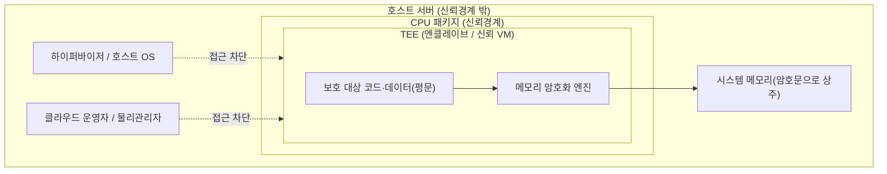
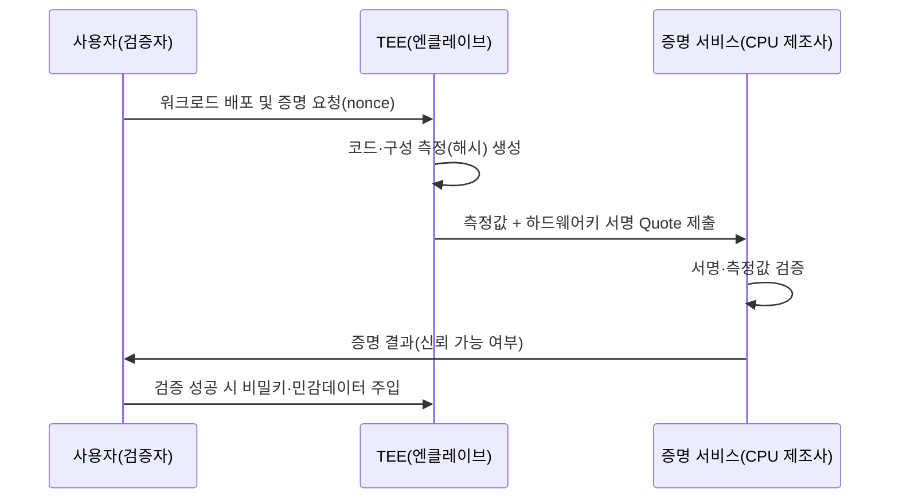

# 기밀 컴퓨팅(Confidential Computing)

## 1. 개요

> **기밀 컴퓨팅(Confidential Computing)**이란 CPU에 내장된 하드웨어 기반 **신뢰실행환경(TEE, Trusted Execution Environment)** 안에서 데이터와 코드를 처리함으로써, 연산이 이루어지는 순간(사용 중, in-use)에도 데이터의 기밀성과 무결성을 보호하는 컴퓨팅 방식이다. Confidential Computing Consortium(CCC, 리눅스 재단 산하)이 표준 용어와 아키텍처를 정의하고 있다.

데이터 보호는 전통적으로 **저장 중(at rest)**과 **전송 중(in transit)** 두 상태에 집중되어 왔다. 디스크 암호화(TDE, LUKS)와 전송 암호화(TLS)가 이 두 상태를 각각 담당한다. 그러나 데이터가 실제로 의미 있는 가치를 만드는 순간은 CPU와 메모리에서 **연산이 수행되는 시점**인데, 이때는 데이터가 평문으로 메모리에 존재해야 하므로 세 번째 상태인 **사용 중(in-use)** 데이터는 오랫동안 사각지대로 남아 있었다. 클라우드로 워크로드가 이전되면서 이 사각지대의 위험은 더욱 커졌다. 이용자는 하이퍼바이저·호스트 OS·클라우드 운영자·물리 서버 관리자 등 자신이 통제할 수 없는 다수의 특권 주체(privileged software)를 신뢰해야 하는데, 이들 중 하나라도 침해되거나 악의를 가지면 실행 중인 평문 데이터가 그대로 노출된다.

기밀 컴퓨팅은 이 문제를 **신뢰의 뿌리(Root of Trust)를 소프트웨어 스택에서 걷어내 CPU 하드웨어로 옮기는** 방식으로 해결한다. 즉 운영체제·하이퍼바이저·클라우드 관리자까지도 신뢰 대상에서 제외(신뢰경계 밖으로 배제)하고, 오직 CPU 제조사와 그 안의 격리 메커니즘만 신뢰하도록 신뢰 기반을 최소화한다. 이는 앞서 다룬 동형암호(연산 자체를 암호문 상태로 수행)나 다자간 계산(MPC)이 순수 소프트웨어·수학으로 in-use 보호를 달성하는 것과 대비되는, **하드웨어 격리 기반 접근**이라는 점에서 상호보완적 위치를 갖는다.

## 2. TEE 아키텍처와 위협 모델

기밀 컴퓨팅의 핵심 장치는 TEE이다. TEE는 CPU가 제공하는 격리된 실행 영역으로, 그 내부의 메모리는 CPU 밖으로 나갈 때 하드웨어 암호화 엔진을 거쳐 자동 암호화되고, 정당한 엔클레이브(enclave)나 신뢰 VM 이외의 어떤 주체도 그 내용을 평문으로 볼 수 없다. 아래 개념도는 일반 실행 경로와 TEE 보호 경로의 신뢰경계 차이를 보여준다.

TEE가 방어하는 위협 모델의 핵심은 **특권 소프트웨어와 물리적 접근자를 잠재적 공격자로 가정**한다는 점이다. 일반적인 접근제어 모델이 애플리케이션·사용자 수준의 위협을 다룬다면, 기밀 컴퓨팅은 그보다 상위 계층인 커널·하이퍼바이저·펌웨어, 나아가 서버를 물리적으로 만질 수 있는 데이터센터 관리자까지 신뢰경계 밖으로 밀어낸다. 콜드부트 공격으로 메모리 모듈을 탈취하거나, 악성 하이퍼바이저가 게스트 메모리를 덤프하더라도, 메모리에는 오직 암호문만 존재하므로 평문을 얻을 수 없다.

다만 TEE의 보호 범위에는 명확한 경계가 있다. TEE는 메모리 격리와 무결성은 강력하게 보장하지만, 캐시·분기예측·전력 소비 같은 물리적 부수효과를 관측하는 **부채널 공격(side-channel)**에는 본질적으로 취약할 수 있다. 실제로 인텔 SGX를 겨냥한 Foreshadow(L1TF), Plundervolt, SGAxe 등 일련의 마이크로아키텍처 공격이 보고되어 제조사가 마이크로코드 패치로 대응해 왔다. 따라서 기밀 컴퓨팅은 "만능 방패"가 아니라 **위협경계를 재정의하는 도구**로 이해하고, 부채널 완화·최신 패치 적용을 병행하는 것이 실무 원칙이다.

## 3. 원격 증명(Remote Attestation) 절차

기밀 컴퓨팅이 실제로 신뢰를 성립시키는 결정적 메커니즘은 **원격 증명(Remote Attestation)**이다. 사용자가 클라우드의 어떤 서버에 워크로드를 올렸을 때, "이 코드가 정말로 변조되지 않은 채 진짜 TEE 안에서 돌고 있는가"를 사용자가 원격에서 암호학적으로 검증할 수 있어야 비로소 민감 데이터를 투입할 수 있다. 원격 증명은 CPU가 엔클레이브의 코드·구성 상태를 측정(해시)하고 하드웨어 키로 서명한 증거(quote)를 발급하면, 검증자가 제조사의 증명 서비스를 통해 이를 검증하는 절차다.

이 절차의 핵심은 **신뢰가 먼저 검증된 뒤에야 비밀이 이동**한다는 점이다. 사용자는 자신이 실행하려는 코드의 기대 해시값을 미리 알고 있으므로, 증명 결과에 담긴 측정값이 기대값과 일치할 때에만 암호화 키나 원본 데이터를 엔클레이브로 전달한다. 만약 클라우드 관리자가 코드를 몰래 바꿔치기했거나 TEE가 아닌 일반 VM에서 실행 중이라면 측정값·서명이 달라져 검증이 실패하고, 비밀은 결코 노출되지 않는다. 이렇게 원격 증명은 접근제어에서 다루는 식별·인증을 "사람·계정"이 아니라 **"실행환경 자체"**로 확장한 개념이라 볼 수 있다.

## 4. TEE 구현 유형 비교

TEE는 보호 단위를 무엇으로 잡느냐에 따라 크게 **프로세스 격리형**과 **VM 격리형**으로 나뉜다. 프로세스 격리형은 애플리케이션 안에 작은 보호 영역(엔클레이브)을 두는 방식이고, VM 격리형은 게스트 VM 전체를 통째로 암호화·격리하는 방식이다. 전자는 신뢰 대상(TCB, Trusted Computing Base)을 극도로 작게 유지해 공격면이 좁지만 애플리케이션을 엔클레이브용으로 재설계해야 하고, 후자는 기존 워크로드를 거의 그대로 올릴 수 있어 클라우드 도입성이 높다는 실무적 차이가 있다. 이 차이가 곧 "재설계 부담 대 이식성"이라는 트레이드오프를 만든다.

| 구분 | 프로세스 격리형 | VM 격리형 |
|------|----------------|-----------|
| 대표 기술 | Intel SGX | AMD SEV-SNP, Intel TDX, Arm CCA |
| 보호 단위 | 애플리케이션 내 엔클레이브 | 게스트 VM 전체 |
| TCB 크기 | 매우 작음(애플리케이션 일부) | 큼(게스트 OS 포함) |
| 이식성 | 낮음(엔클레이브 SDK로 재작성) | 높음(기존 VM 거의 그대로) |
| 적합 사례 | 소규모 핵심 로직·키 보호 | 클라우드 워크로드 리프트&시프트 |

Arm 진영의 **TrustZone**은 모바일·임베디드에서 널리 쓰이는 또 다른 형태로, 하나의 프로세서를 보안 세계(Secure World)와 일반 세계(Normal World)로 이분해 지문·결제정보 같은 민감 처리를 보안 세계에 격리한다. 서버 클라우드에서는 재설계 부담이 적은 VM 격리형(SEV-SNP, TDX)이 최근 사실상 주류로 자리 잡고 있는데, 이는 기업이 코드 수정 없이 기밀성을 얻고자 하는 현실적 요구가 반영된 결과다. 예컨대 Azure Confidential VM, Google Cloud Confidential VM은 SEV-SNP 기반으로 게스트 메모리를 자동 암호화하며, 사용자는 부팅 시 원격 증명으로 환경을 검증한 뒤 워크로드를 신뢰할 수 있다.

## 5. 활용 사례와 유사 기술 비교

기밀 컴퓨팅의 대표적 실무 적용은 **다자간 데이터 협업**이다. 서로 원본을 공개하고 싶지 않은 복수 기관(예: 여러 금융사가 공동 이상거래 탐지 모델을 학습)이 각자의 데이터를 동일한 TEE에 암호화 상태로 투입하고, 검증된 엔클레이브 안에서만 결합·연산이 수행되도록 하면 원본 유출 없이 결과만 공유할 수 있다. 의료·바이오 분야의 민감 유전체 분석, 블록체인의 오프체인 기밀 스마트컨트랙트, 클라우드 상 개인정보 처리 위탁에서의 처리자 신뢰 최소화 등도 주요 적용처다.

특히 최근에는 **기밀 AI(Confidential AI)**가 부상하고 있다. 대규모 모델 추론 시 입력 프롬프트와 모델 가중치를 모두 TEE(GPU TEE 포함, 예: NVIDIA H100의 Confidential Computing 모드) 안에서 처리하면, 클라우드 사업자조차 사용자의 프롬프트나 기업의 독점 모델 파라미터를 열람할 수 없다. 이는 생성형 AI 도입 시 데이터 주권·영업비밀 우려를 완화하는 실질적 수단으로 주목받는다.

동일한 'in-use 보호' 목표를 가진 기술들과 비교하면 각 기법의 위치가 분명해진다. 아래 표는 앞서 다룬 동형암호·MPC와의 차이를 정리한 것이다. 핵심 차이는 **무엇을 신뢰하고 무엇을 성능 대가로 치르는가**에 있다.

| 기법 | 보호 원리 | 신뢰 대상 | 성능 | 특징 |
|------|-----------|-----------|------|------|
| 기밀 컴퓨팅(TEE) | 하드웨어 격리 | CPU 제조사 | 준평문급(수 %대 오버헤드) | 이식성 높음, 부채널 잔존 |
| 동형암호(HE) | 암호문 연산 | 수학(신뢰 하드웨어 불필요) | 매우 느림 | 하드웨어 신뢰 불요 |
| 다자간 계산(MPC) | 비밀 분산·프로토콜 | 참여자 정족수 가정 | 통신비용 큼 | 다자 협업에 적합 |

이처럼 세 기술은 대체재라기보다 **신뢰 모델과 성능 프로파일이 다른 보완재**다. 실무에서는 TEE로 실행환경을 격리하면서 그 안에서 MPC·HE를 병행해 하드웨어 신뢰까지 분산하는 하이브리드 설계도 연구되고 있다.

## 6. 고려사항 및 시사점

기술사 관점에서 기밀 컴퓨팅을 도입·전략화할 때는 다음을 고려해야 한다.

- **신뢰 기반의 이전과 잔여 위험 인식**: 기밀 컴퓨팅은 신뢰 대상을 클라우드 운영자에서 CPU 제조사로 옮길 뿐 신뢰 자체를 없애지는 않는다. 제조사 공급망·마이크로코드 취약점·부채널 위험이 잔존하므로, "무결점"이 아니라 위협경계 재설정 관점에서 도입 근거를 문서화해야 한다.
- **성능-보안 트레이드오프와 워크로드 선별**: VM 격리형은 통상 한 자릿수 % 수준의 오버헤드로 이식성이 높지만, 메모리 암호화·증명 절차에 따른 지연이 있다. 전 워크로드를 일괄 적용하기보다 개인정보·키·모델 등 고민감 자산에 우선 적용하는 단계적 전략이 합리적이다.
- **원격 증명 운영체계 확보**: 기밀 컴퓨팅의 가치는 증명 검증 체계가 실제로 운영될 때 발현된다. 증명 서비스 가용성, 측정 기준값(정책) 관리, 키 배포(KMS 연계) 자동화까지 포함한 운영 프로세스를 설계해야 형식적 도입에 그치지 않는다.
- **규제·컴플라이언스 연계**: 개인정보보호법상 안전성 확보조치, 클라우드 보안인증(CSAP), 처리위탁 시 수탁자 통제 최소화 요구에 대해 기밀 컴퓨팅은 강력한 기술적 보완 수단이 된다. 다만 국내 인증·감사 체계가 TEE 증명 결과를 어떻게 수용할지에 대한 제도 정비가 병행되어야 한다.
- **멀티클라우드 이식성과 표준화**: SGX·SEV·TDX·CCA 등 벤더별 증명 형식과 SDK가 상이해 종속(lock-in) 우려가 있다. CCC의 표준화 흐름과 벤더 중립 증명 프레임워크(예: 오픈 증명 규격)를 주시하며 이식 가능한 아키텍처로 설계하는 것이 장기 전략상 유리하다.

## 참고자료

- Confidential Computing Consortium, "A Technical Analysis of Confidential Computing" — https://confidentialcomputing.io/
- Intel, "Intel Trust Domain Extensions (TDX)" — https://www.intel.com/content/www/us/en/developer/tools/trust-domain-extensions/overview.html
- AMD, "AMD SEV-SNP" — https://www.amd.com/en/developer/sev.html

---

> **한 줄 요약**: 기밀 컴퓨팅은 CPU 하드웨어 기반 TEE와 원격 증명으로 데이터가 연산되는 '사용 중(in-use)' 상태까지 보호하여, 하이퍼바이저·클라우드 운영자마저 신뢰경계 밖으로 배제하는 하드웨어 격리형 데이터 보호 패러다임이다.
