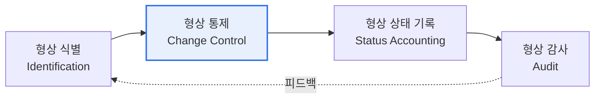

# 형상관리(Configuration Management)와 기준선(Baseline)

## 1. 개요

### 가. 정의
> 소프트웨어 개발·운영 과정에서 발생하는 **산출물(형상항목)의 변경을 체계적으로 식별·통제·추적**하여 무결성과 일관성을 유지하는 관리 활동. **기준선(Baseline)** 을 기준으로 변경을 관리한다.

### 나. 필요성
- 무분별한 변경으로 인한 **버전 혼란·품질 저하 방지**
- 변경 이력 추적을 통한 **감사·추적성(Traceability)** 확보
- 다수 개발자의 **동시 작업 충돌** 방지

## 2. 형상관리 프로세스

## 3. 형상관리 4대 활동

| 활동 | 설명 |
|---|---|
| **형상 식별** | 관리 대상(형상항목: 코드·문서·라이브러리)을 식별하고 명명·버전 부여 |
| **형상 통제** | 변경요청(CR) → 영향분석 → **CCB(형상통제위원회)** 승인 → 반영 |
| **형상 상태 기록** | 형상항목의 변경 이력·현재 상태를 기록·보고 |
| **형상 감사** | 기준선이 요구사항과 일치하는지 기능·물리적 감사(FCA/PCA) |

## 4. 기준선(Baseline) 유형

| 기준선 | 시점 | 내용 |
|---|---|---|
| **기능 기준선** Functional | 요구분석 완료 | 시스템 요구사항 명세(SRS) 확정 |
| **할당 기준선** Allocated | 설계 완료 | 요구사항을 각 구성요소에 할당한 설계 명세 |
| **제품 기준선** Product | 개발/시험 완료 | 최종 인도되는 제품 형상(코드·매뉴얼) 확정 |

> **기준선**: 공식적으로 검토·합의되어 **변경 시 반드시 통제 절차를 거쳐야 하는** 형상항목의 기준 버전.

## 5. 시사점
- 형상관리 도구(Git, SVN)와 **버전관리·이슈추적·CI/CD** 연계로 자동화
- 형상통제(CCB)를 통한 변경의 **가시성·책임성** 확보가 핵심
- SBOM·릴리스 관리와 연계해 공급망 무결성까지 확장

---

> **한 줄 요약**: 형상관리는 *식별→통제→상태기록→감사* 활동으로 산출물 변경을 관리하며, **기준선(기능·할당·제품)** 을 기준으로 무결성과 추적성을 보장한다.
