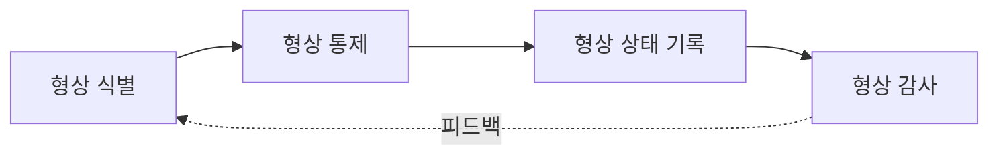

# 형상관리(Configuration Management)와 기준선(Baseline)

## 1. 개요

### 가. 정의
> 소프트웨어 개발·운영 과정에서 생성되는 **산출물(형상항목)의 변경을 식별·통제·기록·감사**하여 무결성과 일관성을 유지하는 관리 활동으로, 공식 합의된 **기준선(Baseline)** 을 기준으로 변경을 통제한다.

### 나. 등장 배경 및 필요성
소프트웨어는 코드·설계서·요구명세·매뉴얼 등 수많은 산출물이 여러 사람 손을 거쳐 끊임없이 바뀐다. 통제 없이 각자 수정하면 "**어떤 버전이 진짜인지**" 알 수 없는 버전 혼란이 생기고, 한 사람의 변경이 다른 사람의 작업을 덮어써 품질이 무너진다. 형상관리는 이 문제를 "**변경을 금지하는 것이 아니라, 통제된 절차로만 허용**"함으로써 푼다. 이를 통해 변경 이력을 추적(감사·추적성)하고, 다수 개발자의 동시 작업 충돌을 방지하며, 특정 시점의 상태로 언제든 복원할 수 있게 한다.

## 2. 형상관리 프로세스

형상관리는 "**무엇을 관리할지 정하고(식별)→변경을 통제하고(통제)→상태를 기록하고(상태기록)→기준과 일치하는지 검증(감사)**"하는 순환으로 이뤄진다. 감사 결과는 다시 식별에 반영되어 관리 대상과 기준을 갱신한다.

## 3. 형상관리 4대 활동

각 활동은 형상관리의 서로 다른 질문에 답한다. 식별은 "무엇을", 통제는 "어떻게 바꿀지", 상태기록은 "지금 어떤 상태인지", 감사는 "제대로 됐는지"를 다룬다. 이 중 **형상 통제**가 실질적 핵심으로, 변경요청(CR)이 오면 즉시 반영하는 것이 아니라 **영향분석 후 CCB(형상통제위원회)의 승인**을 거쳐야만 반영한다. 이 관문이 있기에 무분별한 변경이 걸러지고 변경의 책임 소재가 남는다.

| 활동 | 설명 |
|---|---|
| **형상 식별** | 형상항목(코드·문서·라이브러리)을 식별·명명·버전 부여 |
| **형상 통제** | CR → 영향분석 → **CCB 승인** → 반영 |
| **형상 상태 기록** | 변경 이력·현재 상태를 기록·보고 |
| **형상 감사** | 기준선이 요구와 일치하는지 기능(FCA)·물리(PCA) 감사 |

예컨대 운영 중 버그 수정 요청이 오면, 개발자가 임의로 패치하는 것이 아니라 CR을 등록하고, 이 변경이 다른 모듈에 미칠 영향을 분석한 뒤 CCB 승인을 받아 반영하고, 그 이력을 기록한다.

## 4. 기준선(Baseline) 유형

> **기준선**: 특정 시점에 공식 검토·합의되어 확정된 형상으로, 이후 변경 시 **반드시 통제 절차(CCB)를 거쳐야 하는** 기준 버전.

기준선을 개발 생명주기의 주요 시점마다 설정하는 이유는, 그때까지의 산출물을 "**얼려서(freeze)**" 안정된 기준으로 삼아 이후 작업이 흔들리지 않게 하기 위함이다. 개발이 진행될수록 요구→설계→제품 순으로 구체화되므로, 기준선도 그 단계에 맞춰 세 가지로 설정된다.

| 기준선 | 설정 시점 | 확정 내용 |
|---|---|---|
| **기능 기준선** | 요구분석 완료 | 시스템 요구사항 명세(SRS) |
| **할당 기준선** | 설계 완료 | 요구를 구성요소에 할당한 설계 명세 |
| **제품 기준선** | 개발·시험 완료 | 최종 인도 제품 형상(코드·매뉴얼) |

기능 기준선이 "무엇을 만들지"를, 할당 기준선이 "어떻게 나눠 설계할지"를, 제품 기준선이 "실제 만들어진 결과물"을 고정한다. 뒤 기준선은 앞 기준선을 기준으로 검증(추적)되므로, 요구부터 제품까지 일관성이 유지된다.

## 5. 관련 도구 · 기법

형상관리는 개념이지만 실제 운영은 도구로 자동화된다. 버전관리·이슈추적·CI/CD를 연계하면, 코드 변경이 이슈(변경요청)와 연결되고 자동 빌드·배포까지 추적되어 형상의 가시성이 극대화된다.

| 구분 | 예 |
|---|---|
| 버전관리 | Git, SVN |
| 이슈·변경관리 | Jira, Redmine |
| CI/CD·릴리스 | Jenkins, GitHub Actions |

## 6. 고려사항 및 시사점
- **자동화 연계**: 형상관리 도구를 버전관리·이슈추적·CI/CD와 통합해, 변경-빌드-배포 전 과정을 추적 가능하게 만드는 것이 현대적 방향이다.
- **가시성·책임성**: CCB를 통한 변경 통제의 본질은 "**누가·왜·무엇을 바꿨는가**"를 남겨 변경의 가시성과 책임성을 확보하는 데 있다.
- **공급망으로 확장**: 최근에는 오픈소스 의존성까지 관리해야 하므로, 구성요소 목록인 **SBOM(Software Bill of Materials)** 과 릴리스 관리로 형상관리가 **공급망 무결성**까지 확장되고 있다.

---

> **한 줄 요약**: 형상관리는 *식별→통제(CCB)→상태기록→감사* 활동으로 산출물 변경을 통제된 절차로만 허용하며, **기능·할당·제품 기준선**을 시점별로 고정해 무결성·추적성을 보장하고, 최근 SBOM·공급망 무결성으로 확장된다.
