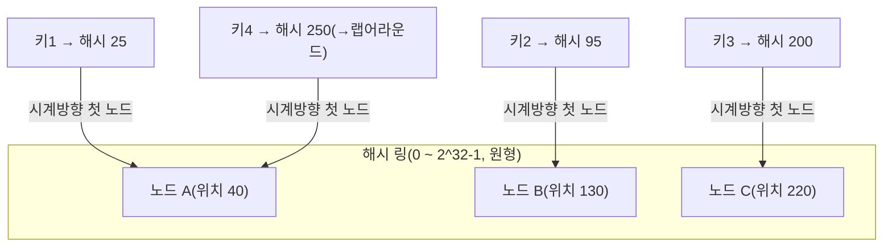
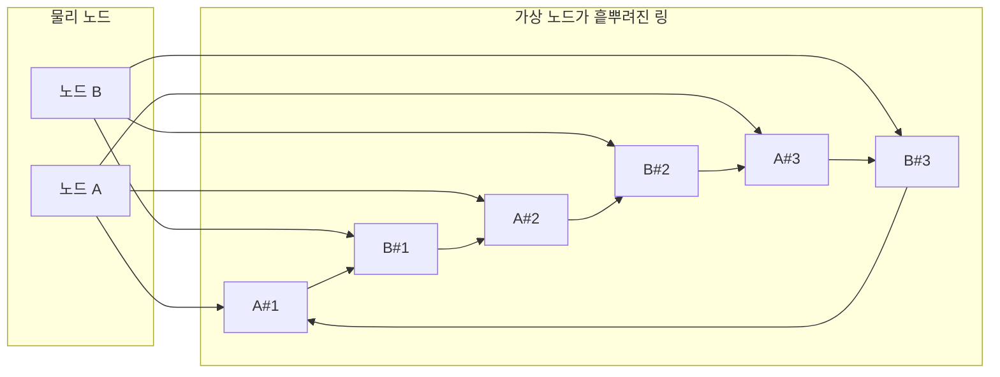

# 일관된 해싱(Consistent Hashing)

## 1. 개요

### 가. 정의

> **일관된 해싱(Consistent Hashing)**이란 키(Key)와 노드(서버)를 동일한 해시 공간의 **하나의 링(Ring)** 위에 배치하고, 키를 시계 방향으로 만나는 첫 번째 노드에 할당함으로써, 노드가 추가·삭제될 때 **재배치되는 키의 수를 평균 K/N 수준으로 최소화**하는 분산 데이터 분배 기법이다.

일관된 해싱은 1997년 MIT의 David Karger 등이 웹 캐시 부하 분산을 위해 제안한 알고리즘으로, 오늘날 Amazon DynamoDB·Apache Cassandra·Riak 같은 분산 데이터스토어, 그리고 memcached 클라이언트·CDN·로드밸런서의 백엔드 선택 로직에 이르기까지 광범위하게 쓰인다. "데이터를 어느 서버에 둘 것인가"라는 근본 질문에 대해, **서버 집합이 수시로 변하는 환경에서도 데이터 이동을 최소화**하는 답을 제공한다는 점이 핵심 가치다.

### 나. 등장 배경과 필요성

가장 단순한 분배 방식은 **모듈로 해싱(`hash(key) % N`)**이다. 노드가 N개일 때 키의 해시값을 N으로 나눈 나머지로 담당 노드를 정하면 분포는 균등하지만, 치명적 약점이 있다. 노드 수 N이 하나라도 바뀌면(장애로 빠지거나 증설로 늘어나면) 나눗셈의 분모가 바뀌어 **거의 모든 키의 담당 노드가 재계산**된다. 예컨대 N=4에서 N=5로 늘리면 이론적으로 약 80%의 키가 다른 노드로 이동한다. 분산 캐시라면 이 순간 캐시 적중률이 급락하며 원본 DB로 요청이 폭주하는 **캐시 스탬피드(cache stampede)**가 발생하고, 분산 DB라면 대규모 데이터 마이그레이션이 유발된다.

클라우드·마이크로서비스 환경에서 오토스케일링으로 노드가 상시 증감하고 장애가 일상적으로 발생한다는 점을 고려하면, "노드 변경 = 전면 재배치"는 감내할 수 없는 비용이다. 일관된 해싱은 **키를 노드 개수가 아니라 노드의 해시 위치에 종속**시킴으로써, 하나의 노드가 변해도 그 노드가 담당하던 구간의 키만 영향을 받도록 국소화한다. 즉 재배치 대상이 전체가 아니라 **평균적으로 K/N개(K는 키 수, N은 노드 수)**로 줄어드는 것이 이 기법의 결정적 이점이다.

## 2. 동작 원리 — 해시 링과 시계 방향 할당

일관된 해싱은 해시 함수의 출력 공간(예: 0 ~ 2^32-1)을 **끝이 처음과 맞닿은 원형 링**으로 상상한다. 각 노드는 자신의 식별자(IP·이름 등)를 해시해 링 위의 한 점에 놓이고, 각 키도 동일한 해시 함수로 링 위에 놓인다. 어떤 키의 담당 노드는 **키 위치에서 시계 방향으로 진행하다 처음 만나는 노드**로 결정된다. 이렇게 하면 각 노드는 "자신의 직전 노드부터 자신까지"의 원호 구간을 책임지게 된다.

위 그림에서 키4는 해시값 250으로 노드 C(220)를 지나쳤지만, 링의 끝(2^32-1)을 넘어 처음(0)으로 **랩어라운드(wrap-around)**하며 노드 A(40)를 만나 A가 담당한다. 이 원형 구조 덕분에 링의 어느 지점에 키가 있어도 반드시 담당 노드가 존재한다.

노드 **B가 장애로 이탈**하면 어떻게 될까. B가 책임지던 구간(노드 A 이후 ~ B까지)의 키들만 시계 방향 다음 노드인 C로 넘어가고, 나머지 A·C가 담당하던 키는 **전혀 영향을 받지 않는다.** 반대로 **노드 D를 새로 추가**하면 D의 위치 직전 구간의 키만 D로 이동하고 나머지는 그대로다. 이처럼 변경의 파급이 **인접한 한 구간으로 국소화**되는 것이 모듈로 해싱과의 본질적 차이다.

## 3. 데이터 편중 문제와 가상 노드(Virtual Node)

기본 방식에는 두 가지 약점이 있다. 첫째, 노드를 링에 무작위로 배치하면 구간 길이가 균등하지 않아 **특정 노드에 키가 편중**될 수 있다(부하 불균형). 둘째, 한 노드가 이탈하면 그 부하가 **온전히 시계 방향 다음 노드 한 곳에만 쏠려** 연쇄 장애(cascading failure)를 유발한다.

이를 해결하는 표준 기법이 **가상 노드(Virtual Node, vnode)**다. 물리 노드 하나를 링 위의 한 점이 아니라, 서로 다른 해시로 계산한 **수십~수백 개의 가상 지점**으로 흩어 배치한다. 예컨대 물리 노드 A를 `A#1, A#2, ..., A#150`처럼 150개의 가상 노드로 링 곳곳에 분산시키면, 각 물리 노드가 담당하는 원호가 링 전체에 잘게 퍼져 **부하 분산의 균등성**이 통계적으로 크게 개선된다. 실제로 가상 노드 수를 100~200개 수준으로 두면 노드 간 부하 편차가 수십 %에서 한 자릿수 %로 줄어든다.

가상 노드의 두 번째 효용은 **이질적 하드웨어(heterogeneous capacity)** 대응이다. 성능이 2배인 서버에는 가상 노드를 2배로 할당하면 그만큼 더 많은 원호를 맡아 **용량 가중치(weighting)**를 자연스럽게 반영할 수 있다. 또한 한 노드가 죽었을 때 그 부하가 여러 물리 노드로 **분산 흡수**되므로 연쇄 장애 위험도 낮아진다. 다만 가상 노드 정보를 유지·조회하는 라우팅 테이블이 커지고 관리 복잡도가 증가하는 트레이드오프가 존재한다.

## 4. 유사 기법과의 비교 — 왜 차이가 나는가

일관된 해싱을 모듈로 해싱, 그리고 최신 기법인 **점프 해싱(Jump Consistent Hash, Google, 2014)** 및 **랑데부 해싱(Rendezvous / HRW)**과 비교하면 각 기법이 최적화하는 지점이 다름을 알 수 있다.

| 기법 | 노드 변경 시 재배치량 | 부하 균등성 | 메모리·구현 | 가중치 지원 |
|------|--------------------|-----------|------------|-----------|
| 모듈로 해싱 | 거의 전체(~(N-1)/N) | 매우 우수 | 매우 단순 | 어려움 |
| 일관된 해싱(+vnode) | 평균 K/N | vnode로 우수 | 링/정렬맵 필요 | vnode 수로 지원 |
| 점프 해싱 | 최소(K/N) | 우수 | 메모리 O(1) | 미지원(순차 노드) |
| 랑데부 해싱 | 최소(K/N) | 우수 | 노드별 해시 O(N) | 가중치 지원 용이 |

모듈로 해싱이 부하 균등성만은 최고인데도 실무에서 기피되는 이유는, 앞서 본 대로 **노드 변경 시 재배치 비용**이 압도적으로 크기 때문이다. 부하 균등성이라는 정적 지표보다, 노드가 상시 변하는 동적 환경에서의 **변화 비용**이 실질적 병목이라는 점이 일관된 해싱이 승리하는 맥락이다. 점프 해싱은 링 자료구조 없이 O(1) 메모리로 최소 재배치를 달성하지만, 노드에 순차 번호를 부여하는 구조라 **임의 노드의 제거·가중치 부여가 어렵다**는 한계로 인해 "노드가 뒤에서만 늘고 주는" 샤드 환경에 적합하다. 랑데부 해싱은 각 키마다 모든 노드와의 해시를 계산해 최댓값 노드를 고르므로 **가중치·우선순위 제어가 유연**하지만 노드 수 N에 비례하는 계산 비용이 든다. 결국 "재배치 최소화 + 균등성 + 가중치"를 두루 요구하는 대규모 분산 스토어는 **가상 노드를 갖춘 일관된 해싱**을 표준으로 채택한다.

**실무 적용 사례**로 Amazon DynamoDB와 Apache Cassandra는 데이터를 링 위 토큰(vnode) 구간에 배치하고, 각 키를 담당 노드부터 시계 방향 **N개 노드에 복제(replication factor N)**한다. 이때 일관된 해싱은 "어느 노드들이 이 키의 복제본을 갖는가"를 결정하는 라우팅의 뼈대가 되며, 노드 증설 시에도 이동 데이터가 국소화되어 무중단 확장이 가능하다. Discord는 memcache 장애 시 캐시 재구성 폭풍을 막기 위해 랑데부 해싱을, Google Maglev 로드밸런서는 연결 유지를 위해 일관된 해싱 변형을 사용하는 등, **연결 지속성(connection affinity)** 확보에도 널리 활용된다.

## 5. 고려사항 및 시사점

기술사 관점에서 일관된 해싱을 설계·도입할 때는 다음을 종합적으로 검토해야 한다.

- **가상 노드 수의 트레이드오프 조정**: vnode를 늘리면 부하 균등성이 좋아지지만 라우팅 메타데이터와 멤버십 변경 시 갱신 비용이 커진다. 노드 규모·하드웨어 이질성·SLA를 고려해 물리 노드당 100~수백 개 수준에서 실측 기반으로 튜닝한다.
- **해시 함수 선택**: 링 상의 균등 분포를 위해 MD5·SHA-1보다는 충돌·편향이 적고 빠른 MurmurHash·xxHash 등 비암호학적 해시를 쓰되, 분포 품질을 사전 검증한다. 보안 목적이 아니라면 성능을 우선한다.
- **복제·정합성과의 연계**: 링 기반 복제는 CAP 이론상 가용성·분단내성을 얻는 대신 결과적 일관성(eventual consistency)을 감수하는 경우가 많다. 정족수(quorum) 읽기/쓰기(R+W>N), 힌티드 핸드오프(hinted handoff), 안티엔트로피(anti-entropy) 등과 함께 설계해야 실제 데이터 정합성이 확보된다.
- **핫키(hot key)와 편중 잔존 위험**: 특정 인기 키에 트래픽이 집중되면 vnode로도 해소되지 않는다. 키 접두사 샤딩, 캐시 계층 추가, 애플리케이션 레벨 부하 분산을 병행해야 한다.
- **멤버십 관리와 관측성**: 노드 증감을 클러스터 전체에 전파하는 가십(gossip) 프로토콜·합의 기반 멤버십과, 재배치 진행률·부하 편차를 상시 모니터링하는 옵저버빌리티 체계가 함께 갖춰져야 운영 안정성이 담보된다.
- **전망**: 데이터 지역성(data locality)과 지연 최소화를 위해 지리적 위치·랙(rack) 인식(topology-aware) 해싱이 확산되고 있으며, 서버리스·엣지 컴퓨팅 환경에서 상태 있는 워크로드를 분산할 때 일관된 해싱의 재배치 최소화 특성이 더욱 중요해지고 있다.

---

> **한 줄 요약**: 일관된 해싱은 키와 노드를 하나의 해시 링에 올려 시계 방향 첫 노드에 키를 할당함으로써 노드 증감 시 재배치를 평균 K/N으로 최소화하는 분배 기법이며, 가상 노드로 부하 균등성과 가중치를 확보해 대규모 분산 스토어·캐시·로드밸런서의 표준 라우팅 기반으로 쓰인다.
