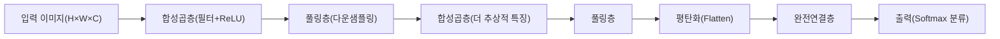
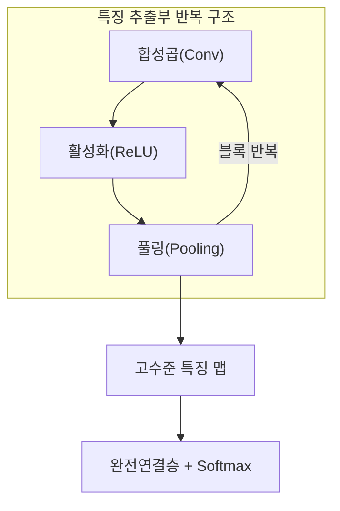

# 합성곱 신경망(CNN, Convolutional Neural Network)

## 1. 개요

### 가. 정의

> **합성곱(Convolution) 연산과 풀링(Pooling)을 반복해 이미지 등 격자형 데이터에서 국소 특징을 계층적으로 추출·학습**하는 신경망. 완전연결 신경망(FFNN)과 달리 **지역 수용영역(Local Receptive Field)·가중치 공유(Weight Sharing)** 를 통해 파라미터를 크게 줄이면서 공간적 패턴을 효과적으로 인식한다.

CNN의 핵심 통찰은 "**이미지의 의미는 픽셀의 절대 위치가 아니라 국소적 패턴의 조합에 있다**"는 관찰에서 출발한다. 고양이 사진에서 귀·눈·수염이라는 국소 패턴이 조합되어 '고양이'라는 개념을 이루며, 그 귀가 이미지의 왼쪽에 있든 오른쪽에 있든 여전히 귀다. CNN은 이 두 성질(국소성·평행이동 불변성)을 신경망 구조 자체에 반영한 것이다. 작은 필터(커널)를 이미지 전체에 미끄러뜨리며 같은 가중치로 지역 패턴을 검출하기 때문에, 위치가 달라져도 동일한 특징을 잡아낼 수 있다.

### 나. 등장 배경과 필요성

전통적인 완전연결 신경망을 이미지에 그대로 적용하면 두 가지 심각한 문제가 발생한다. 첫째는 **파라미터 폭증**이다. 예컨대 224×224×3(약 15만) 픽셀의 컬러 이미지를 1,000개 뉴런의 은닉층에 완전연결하면 첫 층에서만 약 1.5억 개의 가중치가 필요해, 학습이 사실상 불가능하고 과적합(Overfitting)에 취약하다. 둘째는 **공간 구조 파괴**다. 완전연결층은 2차원 이미지를 1차원 벡터로 펼쳐(flatten) 입력하므로, 인접 픽셀 간의 공간적 상관관계가 소실된다.

CNN은 이 문제를 지역 연결과 가중치 공유로 해결한다. 하나의 3×3 필터는 단 9개(+편향)의 파라미터만 가지며, 이 필터를 이미지 전역에 재사용한다. 그 결과 파라미터 수가 입력 크기와 무관하게 필터 크기·개수에만 의존하게 되어 수백만 배 이상 줄어든다. 이러한 효율성과 성능 덕분에 CNN은 2012년 AlexNet이 ImageNet 대회에서 오차율을 26%→16%로 대폭 낮추며 딥러닝 시대를 연 이래, 영상 인식·의료 영상·자율주행·얼굴 인식 등의 사실상 표준 아키텍처가 되었다.

| 구분 | 완전연결 신경망(FFNN) | 합성곱 신경망(CNN) |
|---|---|---|
| 연결 방식 | 전역 완전연결 | 지역 수용영역(국소 연결) |
| 파라미터 | 입력 크기에 비례해 폭증 | 필터 크기·개수에만 의존(공유) |
| 공간 구조 | flatten으로 소실 | 2D/3D 구조 보존 |
| 불변성 | 평행이동에 취약 | 평행이동 불변성 확보 |
| 적합 데이터 | 정형·저차원 | 이미지·음성 스펙트로그램 등 격자형 |

## 2. 전체 구조(Architecture)

CNN은 크게 **특징 추출부(Feature Extractor)** 와 **분류부(Classifier)** 로 나뉜다. 앞단의 합성곱층·풀링층 스택이 이미지에서 특징 맵(Feature Map)을 뽑아내고, 뒷단의 완전연결층이 그 특징을 바탕으로 최종 판단을 내린다. 이때 층이 깊어질수록 추출되는 특징의 추상도가 높아지는 **계층적 특징 학습(Hierarchical Feature Learning)** 이 나타난다. 초기 층은 에지·색상·질감 같은 저수준 특징을, 중간 층은 눈·바퀴·문 손잡이 같은 부분(part)을, 깊은 층은 얼굴·자동차 같은 객체 전체를 표현하는 식이다. 이는 사람이 시각 정보를 처리하는 방식과 유사하며, CNN이 강력한 이유의 핵심이다.

이 계층적 확장을 설명하는 개념이 **수용영역(Receptive Field)** 이다. 얕은 층의 뉴런은 입력 이미지의 좁은 영역만 보지만, 층이 깊어질수록 하나의 뉴런이 간접적으로 보는 입력 범위가 점점 넓어진다. 예컨대 3×3 합성곱을 두 번 쌓으면 두 번째 층의 한 뉴런은 원본의 5×5 영역을, 세 번 쌓으면 7×7을 반영한다. 풀링까지 결합되면 수용영역은 기하급수적으로 커져, 깊은 층의 뉴런이 이미지 전역의 맥락을 종합할 수 있게 된다. 이것이 얕은 층은 국소 특징을, 깊은 층은 전역적 객체를 인식하는 구조적 근거다.

### 가. 합성곱층(Convolution Layer)

합성곱층은 CNN의 심장이다. 필터(커널)라 불리는 작은 가중치 행렬을 입력 위에서 일정 간격(Stride)으로 이동시키며, 겹치는 영역과 원소별 곱의 합(내적)을 계산해 특징 맵의 한 값을 만든다. 예를 들어 세로 에지를 검출하는 필터는 밝기가 좌우로 급변하는 영역에서 큰 값을 출력하고, 균일한 영역에서는 0에 가까운 값을 낸다. 중요한 점은 이 필터의 가중치가 **사람이 설계하는 것이 아니라 역전파로 학습된다**는 것이다. 즉 어떤 필터가 유용한지(어떤 패턴을 잡아야 분류에 도움이 되는지)를 데이터가 스스로 결정한다.

하나의 합성곱층은 여러 개의 필터를 가지며, 각 필터가 서로 다른 패턴에 반응해 독립적인 특징 맵을 생성한다. 필터 개수가 곧 출력 채널 수가 된다. 예컨대 입력이 32×32×3이고 3×3 필터 64개를 적용하면 출력은 (패딩·스트라이드에 따라) 대략 32×32×64가 된다. 여기서 **가중치 공유**가 핵심으로, 하나의 필터는 이미지 어느 위치를 훑든 동일한 가중치를 쓰기 때문에 "이미지 왼쪽 위에서 학습한 에지 검출 능력을 오른쪽 아래에서도 그대로 재사용"한다. 이 재사용성이 파라미터를 극적으로 줄이고 평행이동 불변성을 부여하는 원천이다.

합성곱 연산에는 세 가지 하이퍼파라미터가 출력 크기를 좌우한다. **스트라이드(Stride)** 는 필터의 이동 간격으로, 클수록 출력이 작아지고 다운샘플링 효과가 난다. **패딩(Padding)** 은 입력 가장자리에 0을 덧대는 것으로, 'same' 패딩을 쓰면 출력 크기를 입력과 같게 유지하고 경계 정보 손실을 막는다. **커널 크기**는 수용영역의 넓이를 결정한다. 출력 한 변의 크기는 `(N - F + 2P)/S + 1` 공식으로 계산되며(N=입력, F=필터, P=패딩, S=스트라이드), 예를 들어 N=32, F=3, P=1, S=1이면 출력은 (32-3+2)/1+1 = 32로 크기가 보존된다.

이 파라미터 절감 효과는 수치로 보면 극적이다. 32×32×3 입력을 예로 들면, 완전연결층으로 64개 뉴런에 연결할 때 가중치는 (32×32×3)×64 ≈ 19.6만 개가 필요하다. 반면 3×3 필터 64개를 쓰는 합성곱층은 (3×3×3)×64 = 1,728개(+편향 64) 파라미터만으로 같은 64채널 특징 맵을 만든다. 약 100배 이상 적은 파라미터로 공간 구조까지 보존하는 것이다. 이 차이는 입력 해상도가 커질수록 더 벌어져, 고해상도 영상에서 CNN이 사실상 유일한 현실적 선택이 되는 이유가 된다.

또한 합성곱 직후에는 **비선형 활성화 함수(주로 ReLU)** 를 적용한다. ReLU(`max(0,x)`)는 음수를 0으로 만들어 비선형성을 주면서도, 기울기 소실(Vanishing Gradient) 문제를 완화하고 계산이 단순해 깊은 CNN 학습을 가능케 한 결정적 요소다. 합성곱만 쌓으면 여러 선형변환이 하나로 붕괴하므로, 활성화 함수가 있어야 진짜 심층 표현력이 살아난다.

### 나. 풀링층(Pooling Layer)

풀링층은 특징 맵의 공간 크기를 줄이는 **다운샘플링** 을 담당한다. 가장 널리 쓰이는 최대 풀링(Max Pooling)은 2×2 영역에서 최댓값만 취해 특징 맵을 가로·세로 각각 절반으로 축소한다. 풀링의 첫 번째 목적은 **계산량과 파라미터 축소**로, 뒤따르는 층의 부담을 줄이고 과적합을 억제한다. 두 번째 목적은 **위치 불변성 강화**다. 최댓값만 남기므로 특징이 몇 픽셀 이동해도 같은 풀링 결과가 나와, 작은 위치 변화에 강인해진다. 예를 들어 손글씨 '7'이 이미지에서 조금 치우쳐 쓰여도 동일하게 인식할 수 있는 것은 풀링의 기여가 크다.

최대 풀링과 평균 풀링(Average Pooling)은 목적이 조금 다르다. 최대 풀링은 "가장 강하게 반응한 특징"만 남기므로 에지·질감 같은 두드러진 패턴 검출에 유리한 반면, 평균 풀링은 영역 전체의 정보를 부드럽게 요약해 배경·전역 통계를 반영하는 데 적합하다. 실무에서는 중간 층에는 최대 풀링을, 마지막 요약에는 전역 평균 풀링을 쓰는 조합이 일반적이다.

풀링에는 학습 파라미터가 없다는 점이 합성곱층과의 결정적 차이다. 최댓값(또는 평균값)을 고르는 고정 연산이므로 학습 대상이 아니다. 다만 최근의 일부 아키텍처(예: ResNet의 후반부)는 풀링 대신 스트라이드를 키운 합성곱으로 다운샘플링을 대체하거나, 마지막에 **전역 평균 풀링(Global Average Pooling)** 으로 특징 맵 전체를 채널당 하나의 값으로 요약해 완전연결층의 거대 파라미터를 없애는 방식을 택하기도 한다. 이는 파라미터 절감과 과적합 억제에 효과적이어서 GoogLeNet 이후 보편화되었다.

### 다. 완전연결층과 출력(Classifier)

특징 추출부를 통과한 특징 맵은 평탄화(Flatten)되어 완전연결층으로 전달된다. 이 부분은 추출된 고수준 특징을 조합해 최종 결정을 내리는 역할을 한다.

다만 완전연결층은 CNN에서 파라미터가 가장 집중되는 지점이자 과적합의 주요 원인이기도 하다. 예컨대 7×7×512 특징 맵을 평탄화해 4,096 뉴런에 연결하면 그 한 층에서만 약 1억 개의 가중치가 생긴다. 이 때문에 앞서 언급한 전역 평균 풀링으로 완전연결층을 최소화하거나, 드롭아웃을 집중 적용하는 설계가 흔히 병행된다.

분류 문제에서는 마지막에 Softmax를 적용해 각 클래스에 대한 확률 분포를 출력하고, 교차 엔트로피(Cross-Entropy) 손실로 정답과의 오차를 측정한다. 이 오차가 역전파를 통해 완전연결층→풀링층(경로)→합성곱 필터까지 거슬러 흐르며, 모든 필터 가중치가 경사하강법으로 갱신된다. 결국 CNN 전체가 "분류를 잘하기 위한 특징을 스스로 찾도록" 종단간(End-to-End)으로 학습되는 셈이다.

## 3. 학습·정규화 기법과 대표 아키텍처

### 가. 과적합 방지와 안정적 학습 기법

CNN의 학습은 순전파로 예측을 내고, 손실함수로 오차를 측정한 뒤, 역전파로 기울기를 구해 옵티마이저가 가중치를 갱신하는 반복이다. 분류에는 Softmax와 짝을 이루는 **교차 엔트로피 손실**이, 회귀에는 MSE가 주로 쓰인다. 옵티마이저는 순수 경사하강법 대신 관성과 적응적 학습률을 결합한 **Adam** 계열이 널리 사용되어 수렴을 안정·가속한다. 여기에 학습률을 점진적으로 낮추는 **학습률 스케줄링(예: Cosine Decay·Warmup)** 을 결합하면, 초반에는 크게 탐색하고 후반에는 미세 조정해 더 좋은 최적점에 도달한다. 이처럼 손실·옵티마이저·학습률 설계는 같은 아키텍처라도 최종 성능을 좌우하는 실무적 핵심 변수다.

깊은 CNN을 안정적으로 학습시키려면 여러 보조 기법이 필요하다. **드롭아웃(Dropout)** 은 학습 중 일부 뉴런을 확률적으로 비활성화해 특정 뉴런에 대한 과의존을 막고 앙상블 효과를 낸다. **배치 정규화(Batch Normalization)** 는 각 층의 입력 분포를 정규화해 학습을 가속하고 기울기 흐름을 안정화하며, 결과적으로 더 큰 학습률과 더 깊은 망을 가능케 한 핵심 기법이다. **데이터 증강(Data Augmentation)** 은 회전·반전·자르기·색상 변형 등으로 학습 데이터를 인위적으로 늘려, 제한된 데이터로도 일반화 성능을 높인다. 예컨대 의료 영상처럼 라벨링 비용이 큰 분야에서 데이터 증강은 필수적이다.

또한 밑바닥부터 학습하는 대신 **전이학습(Transfer Learning)** 을 널리 활용한다. ImageNet(약 1,400만 장, 1,000개 클래스)으로 사전학습된 CNN의 특징 추출부를 가져와, 소량의 목표 데이터로 뒷단만 미세조정하면 적은 데이터·연산으로도 높은 성능을 얻는다. 이는 초기 층이 학습한 에지·질감 특징이 대부분의 영상 과업에 공통적으로 유용하기 때문이며, 실무에서 CNN을 도입하는 가장 현실적인 방법이다.

### 나. 대표 아키텍처의 발전과 그 이유

CNN 아키텍처의 역사는 "**어떻게 더 깊게 쌓으면서도 학습을 가능케 하는가**"의 여정으로 요약된다. 단순히 층을 늘리면 성능이 오를 것 같지만, 실제로는 기울기 소실과 성능 열화(Degradation)로 오히려 나빠지는 문제가 있었고, 각 세대의 아키텍처는 이를 극복하는 아이디어로 진화했다.

| 아키텍처(연도) | 핵심 기여 | 의의 |
|---|---|---|
| LeNet-5 (1998) | 합성곱+풀링 기본 구조 정립 | 우편번호 인식에 최초 실용화 |
| AlexNet (2012) | ReLU·Dropout·GPU 학습 | ImageNet 우승, 딥러닝 붐 촉발 |
| VGGNet (2014) | 3×3 소형 필터를 깊게 반복 | 단순·균일 구조로 표준화 |
| GoogLeNet (2014) | Inception 모듈·1×1 합성곱 | 연산 효율·전역평균풀링 |
| ResNet (2015) | 잔차연결(Skip Connection) | 152층 학습 가능, 인간 수준 정확도 |

특히 **ResNet의 잔차연결(Residual Connection)** 은 CNN 발전의 분수령이다. 입력을 몇 개 층 건너뛰어 출력에 그대로 더해주는(`H(x)=F(x)+x`) 지름길을 두어, 기울기가 소실 없이 깊은 층까지 흐르도록 했다. 이 덕분에 100층 이상의 초심층 망이 처음으로 안정적으로 학습되었고, 이후 사실상 모든 심층 아키텍처의 표준 구성요소가 되었다. **VGGNet**이 보여준 "큰 필터 하나보다 작은 3×3 필터를 여러 개 쌓는 것이 파라미터는 적으면서 표현력은 높다"는 통찰, **GoogLeNet**의 1×1 합성곱을 통한 채널 축소로 연산량을 줄인 아이디어도 현대 CNN 설계의 기본 원칙으로 자리 잡았다.

### 다. 파생 과업과 산업 적용 사례

CNN은 단순 분류를 넘어 다양한 컴퓨터 비전 과업의 백본(Backbone)으로 확장되었다. **객체 검출(Object Detection)** 은 "무엇이 어디에 있는가"를 함께 찾는 과업으로, R-CNN 계열과 실시간 처리에 강한 YOLO(You Only Look Once) 계열이 대표적이다. **의미 분할(Semantic Segmentation)** 은 픽셀 단위로 클래스를 분류하며, 인코더-디코더 구조의 U-Net이 의료 영상 분야에서 사실상 표준으로 쓰인다. 이처럼 앞단 CNN이 뽑은 특징 맵을 어떻게 해석·복원하느냐에 따라 과업이 갈린다.

산업 적용 사례를 구체적으로 보면 그 파급력이 분명하다. 첫째, **의료 영상 진단**에서 CNN은 흉부 X선의 폐렴, 안저 영상의 당뇨망막병증, 병리 조직 슬라이드의 암세포를 전문의에 필적하는 정확도(다수 연구에서 AUC 0.9 이상)로 판별해, 판독 보조·선별 검사에 활용된다. 둘째, **자율주행**에서는 카메라 영상에서 차선·보행자·신호를 실시간(수십 FPS)으로 검출해야 하므로 경량 CNN 기반 검출기가 핵심 역할을 한다. 셋째, **제조 품질검사**에서 CNN 기반 머신비전이 반도체 웨이퍼·디스플레이 패널의 미세 결함을 사람보다 빠르고 일관되게 잡아내 수율을 개선한다. 이들 사례의 공통점은 대량의 라벨 데이터와 GPU 연산, 그리고 오탐/미탐의 비용을 관리하는 운영 체계가 함께 갖춰져야 실효를 낸다는 점이다.

| 과업 | 대표 모델 | 산업 적용 예 |
|---|---|---|
| 이미지 분류 | ResNet·EfficientNet | 콘텐츠 필터링, 상품 분류 |
| 객체 검출 | YOLO·Faster R-CNN | 자율주행, CCTV 관제 |
| 의미/인스턴스 분할 | U-Net·Mask R-CNN | 의료 영상, 위성 영상 분석 |
| 얼굴 인식 | FaceNet 계열 | 출입 통제, 본인 인증 |

## 4. 심화: 최신 동향 — ViT의 부상과 CNN의 위치

2020년 전후 **비전 트랜스포머(ViT, Vision Transformer)** 가 등장하면서, 영상 인식의 주도권 일부가 CNN에서 어텐션 기반 모델로 이동하는 흐름이 나타났다. ViT는 이미지를 패치로 나눠 시퀀스로 취급하고 자기어텐션(Self-Attention)으로 전역 관계를 직접 모델링하는데, 충분히 큰 데이터(수억 장 규모)로 사전학습하면 CNN을 능가하는 성능을 보였다. 이는 CNN의 국소성·평행이동 불변성이라는 **귀납적 편향(Inductive Bias)** 이 오히려 대규모 데이터 환경에서는 제약이 될 수 있음을 시사한다.

이 대비를 데이터 규모의 관점에서 보면 이해가 쉽다. ViT는 자기어텐션으로 이미지 전역의 어떤 두 패치든 직접 관계를 맺을 수 있어 표현력의 상한이 높지만, 그만큼 "무엇이 이미지에서 중요한 구조인가"에 대한 사전 가정이 거의 없어 방대한 데이터로 그 구조를 처음부터 배워야 한다. 반대로 CNN은 국소성·평행이동 불변성이라는 가정을 구조에 내장했기에 적은 데이터로도 빠르게 좋은 특징을 학습한다. 즉 데이터가 희소할수록 CNN의 편향이 이득이 되고, 데이터가 넘칠수록 그 편향이 상한을 낮추는 제약으로 바뀐다.

그러나 CNN이 대체되었다고 보기는 어렵다. 첫째, CNN은 귀납적 편향 덕분에 **소·중 규모 데이터에서 여전히 데이터 효율이 우수**하며, 엣지·모바일 등 자원 제약 환경(MobileNet·EfficientNet 등 경량 CNN)에서 강점을 유지한다. 둘째, ConvNeXt(2022)처럼 트랜스포머의 설계 요소를 흡수한 현대적 CNN이 ViT에 필적하는 성능을 내면서, 두 계열이 서로 수렴·융합하는 추세다. 셋째, 실무에서는 CNN 백본과 어텐션을 결합한 하이브리드 구조가 검출·분할(예: 의료 영상, 자율주행 인식)에서 널리 쓰인다. 따라서 기술사 관점에서는 "CNN vs ViT"를 승패가 아니라 **데이터 규모·자원 제약·과업 특성에 따른 선택의 문제**로 이해하는 것이 정확하다.

한편 자원 제약 환경을 겨냥한 **경량 CNN**의 발전도 최신 동향의 한 축이다. MobileNet은 표준 합성곱을 채널별 공간 합성곱(Depthwise)과 채널 결합(Pointwise 1×1)으로 분해하는 **깊이별 분리 합성곱(Depthwise Separable Convolution)** 으로 연산량을 8~9배 줄였고, EfficientNet은 깊이·너비·해상도를 균형 있게 함께 키우는 **복합 스케일링(Compound Scaling)** 으로 적은 연산 대비 높은 정확도를 달성했다. 이런 흐름은 스마트폰·IoT·엣지 디바이스에서의 온디바이스 추론 수요를 반영하며, "더 크고 정확한 모델"과 "더 작고 빠른 모델"이라는 두 방향이 병행 발전하고 있음을 보여준다.

## 5. 고려사항 및 시사점(기술사 관점)

- **데이터·자원과 아키텍처 선택의 트레이드오프**: 학습 데이터가 제한적이거나 온디바이스 추론이 필요하면 전이학습 기반 CNN(특히 경량 모델)이 현실적이고, 초대규모 데이터·서버 환경이면 ViT나 하이브리드를 검토한다. 무조건 최신 모델이 아니라 제약 조건에 맞춘 선택이 핵심이다.

- **연산·전력 비용과 경량화 전략**: 고성능 CNN은 상당한 GPU 연산을 요구하므로, 실서비스에서는 **양자화(Quantization)·가지치기(Pruning)·지식 증류(Knowledge Distillation)** 로 모델을 경량화해 추론 지연·전력을 관리해야 한다. 특히 자율주행·모바일은 실시간성이 성능만큼 중요하다.

- **설명가능성과 신뢰성 확보**: CNN은 블랙박스 성격이 강해, 의료·금융 등 고위험 도메인에서는 **Grad-CAM 등 XAI 기법으로 판단 근거(주목 영역)를 시각화**해 검증·규제 대응을 병행해야 한다. 잘못된 특징(배경 편향 등)에 의존하지 않는지 점검하는 것이 안전성의 전제다.

- **데이터 품질·편향과 강건성**: 학습 데이터의 편향은 모델 편향으로 직결되며, 적대적 예제(Adversarial Example)나 도메인 변화(촬영 조건 차이)에 취약할 수 있다. 데이터 증강·적대적 학습·지속적 모니터링(MLOps)으로 강건성과 공정성을 관리해야 한다.

- **연계 기술과 파이프라인 관점**: CNN 단독이 아니라 데이터 라벨링(어노테이션)→학습→배포→모니터링의 **MLOps 전 주기**와, 검출(YOLO)·분할(U-Net)·생성 등 하위 과업 모델과의 조합으로 가치를 낸다. 기술사는 개별 모델이 아니라 이 전체 아키텍처를 설계·거버넌스하는 역량이 요구된다.

## 참고자료

- LeCun et al., "Gradient-Based Learning Applied to Document Recognition"(LeNet), 1998 — http://yann.lecun.com/exdb/lenet/
- Krizhevsky et al., "ImageNet Classification with Deep CNNs"(AlexNet), 2012 — https://papers.nips.cc/paper/4824-imagenet-classification-with-deep-convolutional-neural-networks
- He et al., "Deep Residual Learning for Image Recognition"(ResNet), 2015 — https://arxiv.org/abs/1512.03385
- Dosovitskiy et al., "An Image is Worth 16x16 Words"(ViT), 2020 — https://arxiv.org/abs/2010.11929
- Liu et al., "A ConvNet for the 2020s"(ConvNeXt), 2022 — https://arxiv.org/abs/2201.03545

---

> **한 줄 요약**: CNN은 합성곱·풀링으로 이미지의 국소 특징을 계층적으로 추출하며, 지역 수용영역·가중치 공유로 파라미터를 줄이고 평행이동 불변성을 확보하는 영상 인식의 표준 아키텍처로, 데이터 규모·자원 제약에 따라 ViT·하이브리드와 함께 선택적으로 활용된다.
