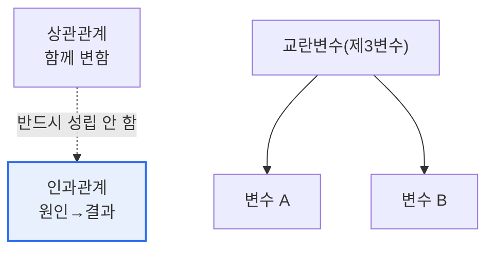

# 상관관계(Correlation)와 인과관계(Causation)

## 1. 개요

### 가. 정의
> **상관관계**는 두 변수가 **함께 변하는 경향**을 나타내는 통계적 관계이고, **인과관계**는 한 변수(원인)의 변화가 다른 변수(결과)의 변화를 **직접 일으키는** 관계다. 핵심 명제는 "**상관관계는 인과관계를 의미하지 않는다**"이다.

이 구분이 데이터 분석에서 가장 중요한 이유는 '**상관을 인과로 착각하면 잘못된 의사결정을 내리기 때문**'이다. 예를 들어 아이스크림 판매량과 익사 사고 건수는 강한 양의 상관을 보이지만, 아이스크림이 익사를 일으키는 것은 아니다. 둘 다 '여름(더위)'이라는 숨은 제3의 변수(교란변수)의 결과일 뿐이다. 이처럼 두 변수가 함께 움직인다고 해서 하나가 다른 하나의 원인이라고 결론지으면, 엉뚱한 대책을 세우게 된다. 빅데이터 시대에는 방대한 데이터에서 무수한 상관이 우연히 발견되므로, 이 함정이 더욱 위험하다. 상관은 '무엇이 함께 변하는가'를 알려줄 뿐이고, '무엇이 무엇을 일으키는가'라는 인과는 별도의 검증(실험·인과추론)이 필요하다.

### 나. 필요성
데이터 기반 의사결정이 확산되며, 상관을 인과로 오인한 잘못된 판단의 위험이 커졌다. 두 관계를 정확히 구분하고 인과를 검증하는 역량이 신뢰할 수 있는 분석의 기초다.

## 2. 비교

| 구분 | 상관관계 | 인과관계 |
|---|---|---|
| **의미** | 함께 변하는 경향 | 원인이 결과를 일으킴 |
| **방향성** | 없음(대칭) | 있음(원인→결과) |
| **측정** | 상관계수(−1~1) | 실험·인과추론 |
| **성립** | 인과 없이도 성립 | 상관을 대개 동반 |

상관은 방향이 없어 A와 B 중 무엇이 원인인지 알 수 없고, 우연이나 교란변수 때문에 나타날 수 있다. 인과가 성립하려면 시간적 선후(원인이 먼저), 상관, 그리고 다른 설명(교란변수)의 배제가 필요하다.

## 3. 상관이 인과가 아닌 경우

| 원인 | 내용 |
|---|---|
| **교란변수** | 제3의 변수가 둘 다에 영향(아이스크림-익사=더위) |
| **우연(허위 상관)** | 방대한 데이터에서 우연히 나타난 상관 |
| **역인과** | 원인·결과가 반대(방향 오인) |

## 4. 고려사항 및 시사점

1. **인과 검증에는 실험이 필요**하다. 인과를 확인하는 가장 확실한 방법은 무작위 대조 실험(RCT, A/B 테스트)으로, 다른 조건을 통제하고 원인 변수만 조작해 결과를 관찰한다.
2. **관찰 데이터의 인과추론 기법**을 활용한다. 실험이 불가능할 때는 성향점수매칭·이중차분·도구변수 등 인과추론 방법으로 교란변수를 통제해 인과를 추정한다.
3. **빅데이터 시대의 함정을 경계**한다. 데이터가 많을수록 우연한 상관이 무수히 나타나므로, 상관을 발견하면 '왜 그런가'라는 인과적 검증을 반드시 거쳐야 잘못된 의사결정을 피할 수 있다.

---

> **한 줄 요약**: 상관관계는 *두 변수가 함께 변하는 경향*, 인과관계는 *원인이 결과를 일으키는 관계* 로, "상관≠인과"이며 교란변수·우연·역인과로 상관이 나타날 수 있으므로 실험(RCT)·인과추론으로 인과를 검증해야 한다.
