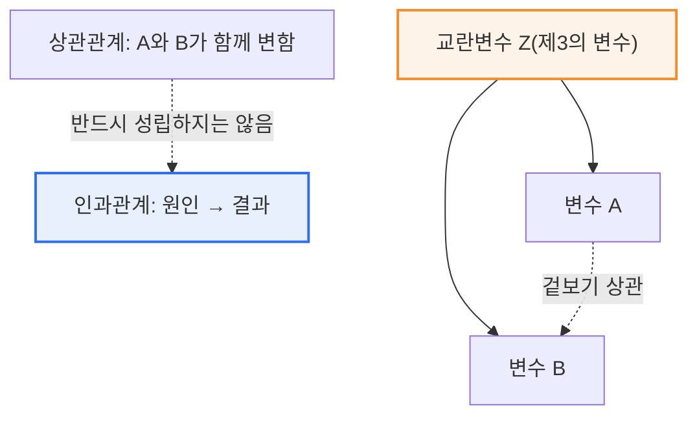
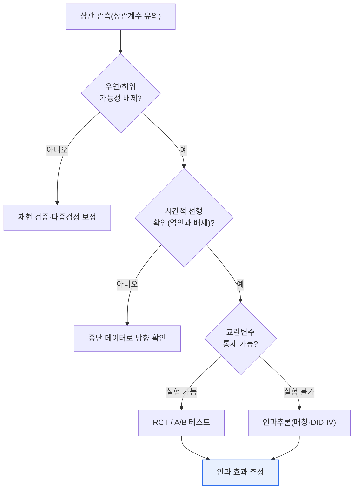

# 상관관계(Correlation)와 인과관계(Causation)

## 1. 개요

### 가. 정의
> **상관관계**는 두 변수가 **함께 변하는 경향**을 나타내는 통계적 관계이고, **인과관계**는 한 변수(원인)의 변화가 다른 변수(결과)의 변화를 **직접 일으키는** 방향성 있는 관계다. 데이터 분석의 가장 유명한 경구인 "**상관관계는 인과관계를 의미하지 않는다(Correlation does not imply causation)**"가 두 개념의 관계를 압축한다.

이 구분이 데이터 분석에서 근본적으로 중요한 이유는 '**상관을 인과로 착각하면 잘못된 원인을 지목하고, 그 결과 엉뚱한 대책에 자원을 쏟기 때문**'이다. 고전적 예로, 여름철 아이스크림 판매량과 익사 사고 건수는 강한 양의 상관을 보인다. 그러나 아이스크림 소비가 익사를 일으키는 것이 아니며, 아이스크림 판매를 금지한다고 익사가 줄지도 않는다. 두 현상은 모두 '여름의 더위'라는 숨은 제3의 변수(**교란변수, Confounder**)가 동시에 밀어 올린 결과일 뿐이다. 만약 이 상관을 인과로 오독한다면 '익사 예방을 위해 아이스크림을 규제하자'는 터무니없는 정책이 나올 수 있다.

두 변수가 함께 움직인다는 사실은 '무엇이 함께 변하는가'를 알려줄 뿐, '무엇이 무엇을 일으키는가'라는 인과의 방향과 존재는 별도의 검증(실험 또는 인과추론)을 요구한다. 특히 **빅데이터 시대에는 변수의 수가 폭발적으로 늘면서 순전히 우연에 의해 발생하는 허위 상관(spurious correlation)** 이 무수히 관측된다. 데이터가 많을수록 진실이 저절로 드러나는 것이 아니라, 오히려 우연한 패턴에 속을 위험이 커진다. 그래서 상관과 인과를 정확히 분별하는 역량은 데이터 리터러시의 출발점이자, 신뢰할 수 있는 의사결정의 전제 조건이 된다.

### 나. 등장 배경 및 필요성
데이터 기반 의사결정(Data-Driven Decision Making)이 기업·정부 전반으로 확산되면서, 분석 결과가 곧바로 정책·투자·제품 결정으로 이어지는 경우가 많아졌다. 이때 분석가가 상관을 인과로 성급히 해석하면, 조직 전체가 잘못된 방향으로 움직인다. 예컨대 '특정 마케팅 채널에 노출된 고객의 구매율이 높다'는 상관만 보고 그 채널에 예산을 몰았다가, 사실은 '원래 구매 의향이 높은 고객이 그 채널을 많이 본 것(역인과 또는 선택편향)'임이 드러나면 예산은 낭비된다. 또한 머신러닝 모델은 상관을 학습할 뿐 인과를 이해하지 못하므로, 상관에만 의존한 모델은 환경이 바뀌면 예측력이 급격히 떨어진다. 따라서 두 관계를 구분하고 인과를 검증하는 방법론적 훈련이 데이터 분석 전문성의 핵심 요소로 요구된다.

## 2. 두 관계의 구조와 비교

상관과 인과의 차이는 '방향성의 유무'와 '성립 조건'에서 갈린다. 아래 개념도는 상관이 인과로 곧장 이어지지 않는 구조를, 그 다음 개념도는 상관이 관측되는 여러 경로를 나타낸다.

```mermaid
flowchart TB
  C["상관관계: A와 B가 함께 변함"] -.->|"반드시 성립하지는 않음"| K["인과관계: 원인 → 결과"]
  Z["교란변수 Z(제3의 변수)"] --> A["변수 A"]
  Z --> B["변수 B"]
  A -.->|"겉보기 상관"| B
  style K fill:#e8f0fe,stroke:#2f6fed,stroke-width:2px
  style Z fill:#fef3e8,stroke:#ed8f2f,stroke-width:2px
```

이 개념도가 말하는 핵심은, A와 B 사이에 관측된 상관이 반드시 'A→B' 또는 'B→A'라는 직접 인과를 뜻하지 않는다는 것이다. 그림에서 교란변수 Z가 A와 B를 동시에 움직이면, A와 B는 서로 아무런 인과가 없어도 강하게 상관된 것처럼 보인다(겉보기 상관, 점선). 상관관계는 **방향이 없는 대칭적 관계**여서 A가 B의 원인인지, B가 A의 원인인지, 아니면 둘 다 Z의 결과인지를 그 자체로는 구별하지 못한다. 반면 인과관계는 원인에서 결과로 향하는 **비대칭적·방향성 있는 관계**다.

| 구분 | 상관관계 | 인과관계 |
|---|---|---|
| **의미** | 함께 변하는 경향 | 원인이 결과를 일으킴 |
| **방향성** | 없음(대칭) | 있음(원인 → 결과) |
| **측정·검증** | 상관계수(−1 ~ +1) | 실험(RCT)·인과추론 |
| **성립 관계** | 인과 없이도 성립 가능 | 대개 상관을 동반함 |
| **의사결정 함의** | "무엇이 함께 변하나" | "무엇을 바꾸면 결과가 변하나" |

표를 문장으로 풀면, 상관은 피어슨 상관계수처럼 −1에서 +1 사이의 값으로 '함께 변하는 강도'를 정량화할 수 있지만, 그 값이 크다고 인과의 증거가 되지는 않는다. 반대로 인과가 성립하면 대개 상관도 관측되지만(원인이 변하면 결과도 변하므로), 그 역은 성립하지 않는다. 이 비대칭성이 두 개념을 혼동하기 쉬우면서도 결정적으로 다르게 만드는 지점이다.

### 가. 인과 성립의 세 가지 조건
철학자 존 스튜어트 밀 이래로, 인과관계가 성립한다고 주장하려면 통상 세 가지 조건이 함께 충족되어야 한다고 본다. 첫째는 **공변(covariation)**, 즉 원인과 결과가 실제로 함께 변해야 한다(상관의 존재). 둘째는 **시간적 선행(temporal precedence)**, 즉 원인이 결과보다 시간적으로 먼저 발생해야 한다. 셋째이자 가장 까다로운 조건은 **다른 설명의 배제(non-spuriousness)**, 즉 관측된 관계가 교란변수 같은 제3의 요인으로 설명되지 않아야 한다는 것이다.

상관계수는 이 중 첫째 조건만 확인해 줄 뿐, 둘째·셋째 조건은 알려주지 못한다. 특히 셋째 조건(교란 배제)은 관찰만으로는 완전히 충족하기 어렵기 때문에, 아래에서 보듯 실험이나 정교한 인과추론 기법이 필요해진다. 인과 판단이 어려운 근본 원인이 바로 이 '배제의 어려움'에 있다.

### 나. 상관계수 해석의 주의점
상관을 정량화하는 대표 지표인 피어슨 상관계수는 두 변수의 '선형' 관계 강도만 포착한다는 한계가 있다. 두 변수가 U자형처럼 뚜렷한 비선형 관계를 가지면 실제로는 강하게 연관돼 있어도 피어슨 상관계수는 0에 가깝게 나올 수 있다. 반대로 소수의 극단적 이상치(outlier)가 존재하면 실제 경향과 무관하게 상관계수가 부풀려지거나 반전되기도 한다. 유명한 앤스컴의 4중주(Anscombe's quartet)는 상관계수·평균이 모두 동일하지만 산점도 모양은 전혀 다른 네 데이터셋을 보여, 숫자 하나만 믿지 말고 반드시 그래프로 분포를 확인해야 함을 일깨운다. 따라서 상관계수를 인과의 근거로 삼기 전에, 관계의 형태·이상치·표본 크기를 함께 검토하는 신중함이 필요하다.

## 3. 상관이 인과가 아닌 경우와 사례

상관이 관측되지만 직접 인과가 아닌 경우는 크게 세 유형으로 정리된다. 각 유형은 서로 다른 이유로 발생하며, 대응 방법도 다르다.

| 유형 | 원리 | 대표 사례 |
|---|---|---|
| **교란변수(공통원인)** | 제3변수 Z가 A·B 모두에 영향 | 아이스크림 판매↔익사(더위) |
| **우연(허위 상관)** | 다변량 데이터에서 우연히 발생 | 특정 국가 치즈 소비량↔이불 사망자 수 |
| **역인과(방향 오인)** | 인과 방향이 실제와 반대 | "병원 방문이 잦은 사람이 더 아프다" |

### 가. 교란변수(공통원인)에 의한 겉보기 상관
교란변수에 의한 겉보기 상관이 세 유형 중 가장 흔하고 실무적으로 위험하다. 앞서 든 아이스크림-익사 사례처럼, 하나의 공통원인(더위)이 두 결과를 동시에 밀어 올리면 두 결과 사이에 직접 인과가 전혀 없어도 강한 상관이 관측된다. 이때 두 변수 중 하나를 인위적으로 조절해도 다른 하나는 꿈쩍하지 않는다. 아이스크림 판매를 막아도 익사가 줄지 않는 이유가 바로 이것이다.

실무에서는 이런 공통원인 구조가 도처에 숨어 있다. '경제 규모가 큰 도시일수록 범죄 건수도, 병원 수도, 커피숍 수도 많다'는 상관은 인구·도시 규모라는 공통원인이 온갖 변수를 함께 부풀린 결과일 뿐, 커피숍이 범죄를 유발하는 것이 아니다. 마케팅에서 'TV 광고를 많이 한 달에 매출도 높더라'는 관측 역시, 성수기(명절·연말)라는 공통원인이 광고 예산과 매출을 동시에 끌어올린 것일 수 있다. 대책은 의심되는 교란변수를 사전에 식별해 층화·매칭·회귀 보정으로 통제하는 것이며, 통제 후에도 관계가 남는지를 확인해야 한다.

### 나. 우연에 의한 허위 상관
우연에 의한 허위 상관은 빅데이터 시대에 특히 심각해진 함정이다. 비교할 변수 쌍이 수천 개면, 그중 상당수는 아무런 인과적·구조적 연관이 없는데도 순전히 우연으로 높은 상관계수를 보인다. '연도별 1인당 치즈 소비량과 침대 시트에 엉켜 사망한 사람 수'가 수년간 함께 움직인 사례처럼, 통계적으로는 뚜렷한 상관이지만 상식적으로 인과가 성립할 수 없는 조합이 얼마든지 발견된다.

이 문제의 본질은 다중검정(multiple comparisons)에 있다. 관계를 많이 검정할수록 우연히 '유의미해 보이는' 결과가 나올 확률이 높아진다. 데이터를 특정 가설 없이 무작정 뒤져 유의한 상관만 골라내는 데이터 준설(data dredging)·p-해킹은 이런 우연을 진실로 포장한다. 방어책은 분석 전에 가설을 미리 정하고(사전 등록), 다중검정 보정(본페로니 등)을 적용하며, 발견된 상관을 독립적인 새 데이터에서 재현해 보는 것이다.

### 다. 역인과(방향 오인)
역인과는 원인과 결과의 방향을 반대로 지목하는 오류다. '병원에 자주 가는 사람이 더 아프다'는 상관을 보고 '병원 방문이 병을 악화시킨다'고 결론짓는 것이 전형이다. 실제로는 아프기 때문에 병원에 가는 것이므로 인과의 화살표가 정반대다. 마찬가지로 '금연 클리닉을 이용한 사람의 폐 질환 발병률이 높다'는 관측도, 이미 흡연 폐해를 겪은 사람이 클리닉을 찾은 것이므로 방향이 뒤집혀 있다.

역인과를 가려내는 핵심 단서는 앞서 본 인과 성립 조건 중 '시간적 선행'이다. 원인이 결과보다 먼저 발생했는지를 시계열·종단 데이터로 확인하면 방향을 판별하는 데 도움이 된다. 다만 두 변수가 서로 영향을 주고받는 순환 구조(피드백 루프)에서는 선후 판별조차 쉽지 않으므로, 이론적 메커니즘에 대한 이해가 함께 요구된다.

### 라. 산업 적용 사례 — 넷플릭스·이커머스의 A/B 테스트
상관과 인과의 구분이 실제 매출을 좌우하는 대표 영역이 디지털 서비스의 실험 문화다. 넷플릭스·아마존 같은 기업은 '어떤 썸네일이 클릭을 유발하는가', '추천 알고리즘 변경이 시청 시간을 늘리는가'를 단순 로그 상관으로 판단하지 않는다. 로그만 보면 '큰 썸네일을 본 사용자가 더 오래 시청했다'는 상관이 나올 수 있지만, 이는 원래 그 콘텐츠에 관심 있던 사용자가 큰 썸네일에 노출됐을 뿐인 선택편향일 수 있기 때문이다.

그래서 이들은 사용자를 무작위로 두 버전에 배정하는 A/B 테스트로 인과 효과만을 분리해 측정한다. 예를 들어 수백만 명을 무작위로 나눠 한쪽에만 새 UI를 노출하고 전환율·체류시간을 비교하면, 무작위 배정 덕분에 두 집단의 다른 특성이 평균적으로 상쇄되어 'UI 변경이 실제로 일으킨 차이'만 남는다. 이커머스에서도 결제 버튼 색상·배송 안내 문구 같은 사소한 변경을 수백 건씩 실험해 통계적으로 유의한 인과 효과가 확인된 것만 전면 적용한다. 이처럼 '상관을 인과로 오인하지 않기 위한 제도적 장치'로서 실험 플랫폼을 내재화한 것이 데이터 선도 기업의 공통점이다.

## 4. 심화: 인과추론 방법론과 최신 동향

상관을 넘어 인과를 규명하려는 노력은 최근 데이터 과학의 핵심 주제로 부상했으며, 방법론은 크게 실험적 접근과 관찰적 접근으로 나뉜다.

**실험적 접근의 표준은 무작위 대조 실험(RCT, Randomized Controlled Trial)** 이다. 대상을 처치군과 대조군에 무작위로 배정하면, 원인 변수를 제외한 나머지 조건이 두 집단에서 평균적으로 같아지므로 교란변수가 자동으로 통제된다. 웹·앱 서비스의 **A/B 테스트**가 바로 이 원리를 실무에 적용한 것으로, 사용자를 무작위로 두 버전에 노출시켜 특정 UI 변경이 전환율을 실제로 '일으키는지'를 인과적으로 측정한다. 무작위 배정이라는 장치 덕분에 A/B 테스트 결과는 단순 상관이 아니라 인과 효과의 추정치로 해석될 수 있다.

**관찰 데이터만 있고 실험이 불가능하거나 비윤리적일 때**(예: 흡연의 폐암 인과)는 인과추론(Causal Inference) 기법을 쓴다. 대표적으로 성향점수매칭(Propensity Score Matching)으로 처치군과 유사한 대조군을 짝지어 비교하고, 이중차분법(Difference-in-Differences)으로 정책 시행 전후·집단 간 변화를 대비시키며, 도구변수(Instrumental Variable)와 회귀 불연속(RDD) 등으로 교란을 우회한다. 최근에는 유디아 펄(Judea Pearl)의 **구조적 인과모형(SCM)과 do-계산법, 인과 다이어그램(DAG)** 이 이론적 토대로 널리 인용되며, 머신러닝과 결합한 **인과 머신러닝(Causal ML)** 이 개인화된 처치효과(HTE) 추정 등으로 활발히 연구되고 있다. 다만 관찰 데이터 기반 인과추론은 '측정되지 않은 교란변수가 없다'는 강한 가정에 의존하므로, 결과 해석 시 가정의 타당성을 함께 검토하고 단정을 피하는 신중함이 필요하다.

아래 개념도는 관측된 상관에서 출발해 인과 여부를 판정하는 실무적 의사결정 흐름을 정리한 것이다. 상관을 발견하면 곧바로 인과로 결론짓지 않고, 대안적 설명을 차례로 배제한 뒤 실험 가능 여부에 따라 검증 경로를 나눈다.

```mermaid
flowchart TD
  S["상관 관측(상관계수 유의)"] --> Q1{"우연/허위<br/>가능성 배제?"}
  Q1 -->|아니오| X1["재현 검증·다중검정 보정"]
  Q1 -->|예| Q2{"시간적 선행<br/>확인(역인과 배제)?"}
  Q2 -->|아니오| X2["종단 데이터로 방향 확인"]
  Q2 -->|예| Q3{"교란변수<br/>통제 가능?"}
  Q3 -->|실험 가능| R["RCT / A/B 테스트"]
  Q3 -->|실험 불가| I["인과추론(매칭·DID·IV)"]
  R --> C["인과 효과 추정"]
  I --> C
  style C fill:#e8f0fe,stroke:#2f6fed,stroke-width:2px
```

이 흐름의 핵심은 인과 판정이 '한 번의 통계 검정'이 아니라 '대안적 설명을 하나씩 소거해 가는 과정'이라는 데 있다. 우연을 배제하고, 방향을 확인하고, 교란을 통제하는 세 관문을 모두 통과한 뒤에야 비로소 인과를 조심스럽게 주장할 수 있다. 어느 한 관문이라도 건너뛰면, 앞서 본 아이스크림-익사식 오류에 빠질 위험이 남는다.

이러한 방법론은 도메인마다 다르게 적용된다. 의학·역학에서는 무작위 배정이 비윤리적인 경우가 많아 코호트·환자대조 연구와 브래드퍼드 힐(Bradford Hill)의 인과 판단 기준(연관의 강도·일관성·용량반응 등)을 병행해 인과를 종합 판단한다. 경제학·정책평가에서는 자연실험(natural experiment)과 이중차분·회귀 불연속이 널리 쓰이며, IT·마케팅에서는 A/B 테스트가 사실상 표준이다. 각 분야가 서로 다른 도구를 발전시킨 이유는 '실험 가능성'과 '윤리적 제약'이 분야마다 다르기 때문이며, 어느 경우든 목표는 동일하다 — 교란을 배제하고 원인의 순효과를 분리하는 것이다.

## 5. 고려사항 및 시사점

1. **인과 검증의 가장 확실한 방법은 실험(RCT·A/B 테스트)이다.** 무작위 배정이 교란변수를 통제해 주므로, 가능한 상황에서는 관찰 분석에 앞서 실험 설계를 우선 고려해야 한다. 실험이 인과의 '황금 표준(gold standard)'으로 불리는 이유가 여기에 있다.
2. **실험이 불가능하면 인과추론 기법으로 교란을 통제한다.** 성향점수매칭·이중차분·도구변수·구조적 인과모형(DAG) 등을 활용하되, 각 기법이 요구하는 식별 가정(교란 부재, 평행추세 등)이 성립하는지를 반드시 함께 검토한다.
3. **빅데이터 시대의 허위 상관 함정을 경계한다.** 변수가 많을수록 우연한 상관이 폭증하므로, 상관을 발견하면 곧바로 결론짓지 말고 '왜 그런가'라는 인과적 메커니즘과 재현 가능성을 검증해야 한다. 다중검정 보정, 사전 가설 등록 같은 절제 장치가 데이터 준설을 막는다.
4. **의사결정과 예측 모델 설계에 인과적 관점을 내재화한다.** '무엇을 바꾸면 결과가 달라지는가'라는 개입(intervention) 질문에 답해야 하는 정책·처방적 의사결정에서는 상관 기반 예측이 아니라 인과 효과 추정이 필요하다. 또한 상관에만 의존한 모델은 분포 변화에 취약하므로, 견고한 모델을 위해 인과적으로 안정적인 변수를 식별하는 것이 바람직하다.

## 참고자료
- Judea Pearl, "The Book of Why: The New Science of Cause and Effect"
- Tyler Vigen, "Spurious Correlations" (허위 상관 사례 모음)

---

> **한 줄 요약**: 상관관계는 *두 변수가 함께 변하는 대칭적 경향*, 인과관계는 *원인이 결과를 일으키는 방향성 있는 관계* 로서 "상관≠인과"이며, 교란변수·우연(허위 상관)·역인과 때문에 상관만으로는 인과를 단정할 수 없으므로 **무작위 실험(RCT·A/B 테스트)이나 인과추론 기법으로 인과를 별도 검증**해야 신뢰할 수 있는 의사결정이 가능하다.
