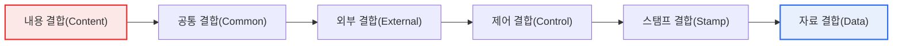
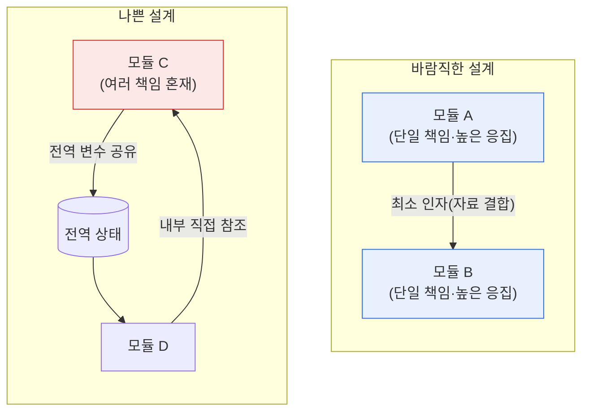

# 소프트웨어 결합도(Coupling)의 종류

## 1. 개요

### 가. 정의
> **결합도(Coupling)** 는 한 모듈이 다른 모듈에 **의존하는 정도**를 나타내는 척도로, 낮을수록 좋은 설계다. 반대 개념인 **응집도(Cohesion)** 는 한 모듈 내부 구성 요소들이 **하나의 목적을 향해 얼마나 밀접하게 관련**되어 있는지를 나타내며 높을수록 좋다. 좋은 모듈 설계의 대원칙은 '**낮은 결합도(Low Coupling)·높은 응집도(High Cohesion)**'로 요약된다.

결합도와 응집도는 1970년대 구조적 설계(Structured Design)를 정립한 래리 콘스탄틴(Larry Constantine)과 에드워드 요든(Edward Yourdon)이 제시한 개념으로, 반세기가 지난 지금까지도 절차형·객체지향·마이크로서비스에 이르는 모든 설계 논의의 근간이 되고 있다. 이 두 척도가 오래도록 살아남은 이유는, 소프트웨어의 본질적 난제인 '**변경(Change)**'을 정면으로 다루기 때문이다. 소프트웨어는 한 번 만들고 끝나는 것이 아니라 요구사항 변화에 맞춰 끊임없이 수정되며, 전체 개발 비용의 절반 이상이 유지보수 단계에서 발생한다는 것이 통설이다. 이때 시스템이 변경에 얼마나 잘 견디는가를 결정하는 두 축이 바로 결합도와 응집도다.

결합도가 소프트웨어 품질의 핵심 척도인 이유는 '**한 모듈의 변경이 다른 모듈로 번지는 파급 효과(Ripple Effect)**'를 직접 좌우하기 때문이다. 모듈들이 강하게 얽혀 있으면(높은 결합도) 한 곳을 고칠 때 연결된 여러 모듈이 함께 깨져, 수정 범위를 예측하기 어렵고 회귀 결함(Regression)이 빈발한다. 예를 들어 결제 모듈이 회원 모듈의 내부 변수 구조를 직접 들여다보고 있다면, 회원 모듈의 사소한 리팩터링만으로도 결제가 멈출 수 있다. 반대로 결합도가 낮으면 각 모듈이 독립적이어서 수정·교체·재사용·단위 시험이 쉽다. 결합도는 모듈이 '무엇을 통해' 연결되느냐에 따라 여러 단계로 나뉘며, 뒤로 갈수록 결합이 약해져 바람직하다.

### 나. 결합도 관리의 필요성
소프트웨어가 커지고 오래 유지될수록 변경이 잦아지는데, 결합도가 높으면 작은 변경도 연쇄 장애를 부른다. 결합도를 낮추는 설계는 유지보수성·재사용성·시험성·확장성을 확보하는 근본 원리이며, 이는 곧 개발 생산성과 시스템 수명으로 직결된다. 결합도를 낮추려는 노력은 단순한 이론적 미덕이 아니라, 변경 비용을 통제하고 장애 전파를 차단하려는 지극히 실용적인 공학 활동이다.

## 2. 결합도의 종류 (강한 결합 → 약한 결합)

결합도는 전통적으로 여섯 단계로 구분된다. 아래 그림은 가장 나쁜 내용 결합에서 가장 바람직한 자료 결합으로 갈수록 결합이 약해지는 스펙트럼을 나타낸다.

**내용 결합(Content Coupling)** 은 가장 강하고 나쁜 결합으로, 한 모듈이 다른 모듈의 **내부 코드나 데이터를 직접 참조·수정**하거나, 정상적인 진입점(인터페이스)을 거치지 않고 모듈 내부로 분기해 들어가는 경우다. 이는 모듈의 경계를 완전히 무너뜨려, 대상 모듈의 내부를 조금만 바꿔도 참조하던 모듈이 즉시 깨진다. 캡슐화를 정면으로 위반하므로 어떤 상황에서도 피해야 한다. 예컨대 A 모듈이 B 모듈의 지역 변수 주소를 직접 조작하는 코드가 전형적이다.

**공통 결합(Common Coupling)** 은 여러 모듈이 **전역 변수(Global Data)** 를 공유하며 상호작용하는 경우다. 전역 변수 하나의 구조를 바꾸면 그것을 쓰는 모든 모듈을 함께 손봐야 하고, 어느 모듈이 언제 값을 바꿨는지 추적하기 어려워 디버깅이 극도로 힘들어진다. 흔히 '전역 상태(Global State)의 함정'이라 부르는 문제로, 규모가 커질수록 부작용(Side Effect)의 원인이 된다.

**외부 결합(External Coupling)** 은 여러 모듈이 외부에서 정의된 **데이터 형식·통신 프로토콜·디바이스 인터페이스** 등을 공유할 때 발생한다. 예를 들어 여러 모듈이 특정 파일 포맷이나 외부 API 규격에 함께 묶여 있으면, 그 형식이 바뀔 때 관련 모듈이 동시에 영향을 받는다. 외부 규격에의 의존이라 불가피한 면도 있으나, 어댑터 계층으로 격리해 영향 범위를 좁히는 것이 바람직하다.

**제어 결합(Control Coupling)** 은 한 모듈이 다른 모듈에 **제어 신호(플래그·스위치)** 를 넘겨, 넘겨받은 모듈의 내부 동작 흐름을 좌우하는 경우다. 예를 들어 `process(data, mode)`에서 `mode` 값에 따라 호출된 함수가 완전히 다른 로직으로 분기한다면, 호출자는 피호출자의 내부 논리를 알고 있어야 하므로 결합이 강해진다. 이는 흔히 응집도가 낮은(논리적 응집) 모듈에서 함께 나타난다.

**스탬프 결합(Stamp Coupling)** 은 모듈 간에 **자료구조(레코드·객체) 전체를 전달하지만 실제로는 그중 일부 필드만 사용**하는 경우다. 필요 없는 필드까지 전달 인터페이스에 노출되므로, 자료구조가 바뀌면 그 필드를 쓰지 않는 모듈까지 영향을 받을 수 있다. 자료 결합보다는 강하지만 제어 결합보다는 약한, 비교적 양호한 단계다.

**자료 결합(Data Coupling)** 은 가장 바람직한 결합으로, 모듈 간에 **꼭 필요한 데이터(원시 파라미터)만** 인자로 주고받는 경우다. 인터페이스가 최소한으로 명확하여 서로의 내부를 알 필요가 없고, 한쪽을 바꿔도 다른 쪽에 미치는 영향이 인자 명세로 국한된다. 설계가 지향해야 할 목표 지점이다.

| 결합도 | 연결 매개 | 결합 강도 | 문제/특징 |
|---|---|---|---|
| **내용 결합** | 다른 모듈 내부를 직접 참조·수정 | 최악 | 캡슐화 파괴, 절대 회피 |
| **공통 결합** | 전역 변수 공유 | 강함 | 부작용·추적 곤란 |
| **외부 결합** | 외부 형식·프로토콜·디바이스 | 강함 | 규격 변경 시 동시 영향 |
| **제어 결합** | 제어 플래그로 상대 동작 좌우 | 중간 | 내부 논리 노출 |
| **스탬프 결합** | 자료구조 전체 전달(일부만 사용) | 약함 | 불필요 필드 노출 |
| **자료 결합** | 필요한 파라미터만 전달 | 최선(양호) | 인터페이스 최소·명확 |

## 3. 응집도와의 관계 및 상호작용

결합도는 응집도와 짝을 이루어 판단해야 한다. 좋은 설계는 모듈 내부는 하나의 책임으로 똘똘 뭉치고(높은 응집도), 모듈 간에는 최소한만 연결되는(낮은 결합도) 구조다. 흥미로운 점은 두 지표가 서로를 끌어당긴다는 것이다. 응집도가 높은 모듈은 '하나의 일'만 하므로 외부와 주고받을 것이 명확해져 자연히 결합도가 낮아지고, 반대로 응집도가 낮아 여러 일을 뒤섞어 하는 모듈은 여기저기와 얽혀 결합도가 높아진다.

응집도 역시 낮은 순서에서 높은 순서로 일곱 단계로 나뉘며, 가장 높은 것은 하나의 기능만 수행하는 **기능적 응집(Functional Cohesion)** 이다. 각 단계는 모듈 안의 요소들이 '어떤 이유로 묶여 있는가'에 따라 구분된다.

| 응집도 | 묶이는 이유 | 강도 |
|---|---|---|
| **우연적(Coincidental)** | 아무 관련 없이 우연히 모임 | 최악 |
| **논리적(Logical)** | 성격이 유사한 기능을 한데(플래그로 선택) | 낮음 |
| **시간적(Temporal)** | 같은 시점에 실행(초기화 등) | 낮음 |
| **절차적(Procedural)** | 실행 순서에 따라 묶임 | 중간 |
| **통신적(Communicational)** | 같은 데이터를 사용·생성 | 중간 |
| **순차적(Sequential)** | 한 요소의 출력이 다음 입력 | 높음 |
| **기능적(Functional)** | 단 하나의 목적을 위해 협력 | 최선 |

결합도 6단계와 응집도 7단계를 함께 보는 이유는, 어느 하나만 좋아서는 좋은 모듈이 되지 못하기 때문이다. 자료 결합만 챙기고 응집도를 방치하면 인터페이스는 깔끔해도 모듈 내부가 뒤엉킨 설계가 되고, 응집도만 챙기고 전역 변수를 남발하면 모듈은 단단해도 시스템 전체가 얽힌다. 흥미롭게도 '논리적 응집' 모듈은 플래그로 동작을 고르는 경우가 많아 곧잘 '제어 결합'을 동반하는데, 이는 낮은 응집도가 높은 결합도를 부르는 상관관계를 잘 보여 준다.

## 4. 사례와 실무적 함의

구체적으로, 온라인 쇼핑몰의 '주문 처리'와 '재고 관리'를 예로 들어 보자. **나쁜 설계**에서는 주문 모듈이 재고 모듈이 사용하는 전역 재고 변수를 직접 읽고 감소시킨다(공통·내용 결합). 이 경우 재고 관리 방식을 '실시간 차감'에서 '예약 후 확정'으로 바꾸면 주문 모듈의 코드도 함께 수정해야 하고, 동시성 문제까지 겹쳐 장애가 번진다. **좋은 설계**에서는 주문 모듈이 재고 모듈에 `reserveStock(상품ID, 수량)`이라는 명확한 인자만 전달(자료 결합)하고, 내부 처리 방식은 재고 모듈이 스스로 결정한다. 그러면 재고 로직이 어떻게 바뀌든 인터페이스만 유지되면 주문 모듈은 영향을 받지 않는다.

이 차이가 실무에서 중요한 이유는 '**변경 격리**'의 성패로 직결되기 때문이다. 결합도가 낮으면 변경·장애의 영향 범위가 모듈 경계 안에 갇혀, 회귀 시험 범위가 줄고 배포 위험이 낮아진다. 실제로 대규모 시스템을 마이크로서비스로 분해하는 동기 중 하나도, 서비스 간 결합을 API로 제한해 각 서비스를 독립적으로 배포·확장·장애 격리하려는 것이다. 반대로 결합도가 높은 모놀리식 코드에서는 한 팀의 수정이 다른 팀의 기능을 깨뜨려 배포가 병목이 되곤 한다.

두 번째 사례로, 여러 화면이 공통으로 참조하는 '**사용자 세션 정보**'를 전역 객체로 두고 각 모듈이 직접 읽고 쓰는 경우를 생각해 보자. 처음에는 편리해 보이지만(공통 결합), 로그인 방식을 세션 기반에서 토큰 기반으로 전환하는 순간 그 전역 객체를 만지던 수십 개 모듈을 모두 찾아 수정해야 한다. 어느 모듈이 언제 세션 값을 바꿨는지 추적하기 어려워, 간헐적으로 발생하는 인증 버그의 원인 규명에만 며칠이 걸리기도 한다. 이를 세션 조회·갱신 인터페이스를 가진 별도 모듈로 감싸 자료 결합으로 전환하면, 인증 방식 변경의 영향은 그 한 모듈 안에 갇힌다.

세 번째로, 결합도는 **테스트 용이성(Testability)** 과도 직결된다. 어떤 모듈이 다른 모듈의 내부 구현이나 전역 상태에 강하게 의존하면, 그 모듈 하나만 떼어 단위 시험하기가 어렵다. 시험을 위해 의존 대상 전체를 준비해야 하기 때문이다. 반대로 인터페이스를 통한 자료 결합으로 설계된 모듈은, 그 인터페이스를 흉내 내는 **모의 객체(Mock/Stub)** 로 손쉽게 대체해 독립적으로 시험할 수 있다. 즉 낮은 결합도는 자동화 시험과 지속적 통합(CI)의 전제 조건이기도 하다.

결국 결합도는 코드 한 줄의 문제가 아니라, 개발 조직의 작업 방식과 배포 리듬까지 규정하는 구조적 특성이다. 강한 결합은 '함께 바뀌어야 하는 것들'을 늘려 변경 단위를 비대하게 만들고, 약한 결합은 변경을 국소화해 여러 사람이 병렬로 안전하게 일할 수 있게 한다.

## 5. 심화: 현대 아키텍처로의 확장과 최신 동향

결합도·응집도는 절차형 시대의 개념이지만, 그 원리는 현대 설계 사상에 그대로 계승·확장되었다. 객체지향의 **SOLID 원칙** 중 단일 책임 원칙(SRP)은 응집도를, 의존 역전 원칙(DIP)과 인터페이스 분리 원칙(ISP)은 결합도를 낮추기 위한 구체적 지침이다. **의존성 주입(Dependency Injection)** 은 구체 클래스가 아닌 추상(인터페이스)에 의존하게 하여 결합을 느슨하게 만드는 대표 기법이다.

결합도를 정량화하려는 시도도 이어져 왔다. 대표적으로 객체지향 지표(CK Metrics)의 **CBO(Coupling Between Objects)** 는 한 클래스가 결합된 다른 클래스의 수를 세어 결합도를 측정하며, 이 값이 클수록 변경 영향과 결함 밀도가 높아지는 경향이 실증 연구로 보고된다. 이런 지표는 리팩터링 우선순위를 정하거나, 아키텍처가 시간이 지나며 얼마나 얽혀 가는지를 추적하는 근거로 활용된다.

마이크로서비스 아키텍처(MSA)에서는 결합도가 서비스 경계 설계의 제1원칙이 된다. 도메인 주도 설계(DDD)의 **바운디드 컨텍스트(Bounded Context)** 로 서비스 경계를 나누고, 서비스 간에는 잘 정의된 API·이벤트만으로 통신하게 하여 결합을 낮춘다. 특히 동기 호출 대신 메시지 큐·이벤트 기반의 **느슨한 결합(Loose Coupling)** 을 지향하는 이벤트 드리븐 아키텍처(EDA)는, 서비스가 서로의 존재나 가용성에 직접 의존하지 않게 하여 장애 전파를 차단한다. 다만 서비스를 지나치게 잘게 쪼개면 오히려 네트워크 호출이 얽히는 '분산 모놀리스(Distributed Monolith)'가 되어 결합도가 되레 높아질 수 있으므로, 결합도 관점의 경계 설계가 무엇보다 중요하다. 최근에는 이러한 아키텍처 결합을 정적 분석·의존성 그래프로 측정하고, 순환 의존이나 과도한 팬인/팬아웃을 자동 탐지하는 도구도 널리 활용된다.

## 6. 고려사항 및 시사점 (기술사 관점)

1. **자료 결합을 지향하고 강한 결합을 배제한다.** 모듈 간에는 꼭 필요한 데이터만 파라미터로 주고받아 인터페이스를 최소·명확하게 유지해야 한다. 전역 변수 공유(공통 결합)나 내부 직접 참조(내용 결합)는 설계 부채로 이어지므로 코드 리뷰·정적 분석 단계에서 걸러내야 한다.

2. **정보은닉·캡슐화·인터페이스 설계와 연결된다.** 모듈 내부 구현을 감추고 공개된 인터페이스로만 소통하게 하면 결합도가 자연스럽게 낮아진다. '무엇을 공개하고 무엇을 감출 것인가'를 결정하는 인터페이스 설계가 결합도 관리의 핵심 수단이다.

3. **결합도·응집도는 함께 관리해야 하는 트레이드오프의 균형점이다.** 어느 하나만 최적화해서는 좋은 모듈이 되지 못한다. 높은 응집도는 낮은 결합도를 유도하므로, 단일 책임을 지키는 모듈 분해가 두 지표를 동시에 개선하는 가장 효과적인 전략이다.

4. **아키텍처 수준으로 확장하여 적용한다.** MSA·계층형·이벤트 드리븐 아키텍처, 의존성 주입, DDD의 경계 설정은 모두 결합도를 낮추려는 원리의 확장이다. 낮은 결합도는 독립 배포·확장·장애 격리·병렬 개발을 가능케 하는 아키텍처적 기반이 된다.

5. **과도한 분해의 역효과를 경계한다.** 결합을 낮추려다 모듈·서비스를 지나치게 잘게 나누면 상호 호출이 늘어 오히려 복잡도와 결합이 증가하는 분산 모놀리스가 될 수 있다. 결합도는 '무조건 낮추기'가 아니라 응집도·운영 복잡도와의 균형 속에서 최적점을 찾아야 하는 설계 판단이다.

## 참고자료
- Stevens, Myers, Constantine, "Structured Design", IBM Systems Journal, 1974 — https://ieeexplore.ieee.org/document/5388187
- Martin, R. C., "Clean Architecture / SOLID Principles" — https://blog.cleancoder.com/
- Wikipedia, "Coupling (computer programming)" — https://en.wikipedia.org/wiki/Coupling_(computer_programming)

---

> **한 줄 요약**: 결합도는 모듈 간 의존 정도로 *내용>공통>외부>제어>스탬프>자료* 순으로 약해지며(자료 결합이 최선), '낮은 결합도·높은 응집도' 설계 원리는 변경의 파급을 격리해 유지보수·재사용·시험을 쉽게 하고 SOLID·DI·MSA 등 현대 아키텍처로 그대로 확장된다.
