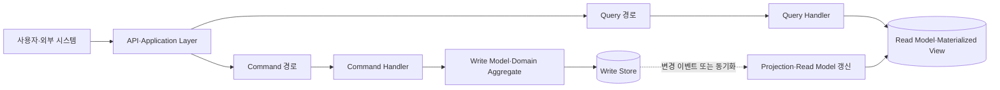
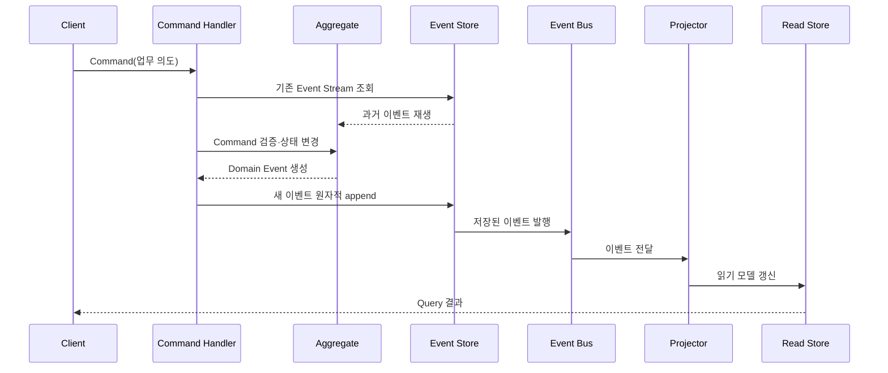

# CQRS와 이벤트 소싱(Command Query Responsibility Segregation·Event Sourcing)

## 1. 개요

### 가. 정의

> **CQRS(Command Query Responsibility Segregation)**는 하나의 데이터 모델에서 읽기(Query)와 쓰기(Command)의 책임을 분리하여, 각각의 목적에 맞는 모델·처리 흐름·성능 전략을 적용하는 아키텍처 패턴이다.
>
> **이벤트 소싱(Event Sourcing)**은 현재 상태만 갱신하여 저장하지 않고, 상태를 변화시킨 도메인 이벤트를 시간 순서대로 추가 기록하여 필요할 때 이벤트 재생으로 상태를 재구성하는 영속화 패턴이다.

CQRS와 이벤트 소싱은 자주 함께 사용되지만 같은 개념은 아니다.
CQRS의 핵심은 읽기 모델과 쓰기 모델의 책임 분리이며, 일반적인 관계형 데이터베이스를 양쪽에 사용해도 CQRS가 될 수 있다.
이벤트 소싱의 핵심은 데이터 변경의 사실을 append-only 이벤트로 보존하는 것이며, 읽기와 쓰기를 반드시 별도 모델로 나눠야 하는 것은 아니다.
둘을 결합하면 쓰기 측은 도메인 규칙을 검증하고 이벤트를 기록하며, 읽기 측은 이벤트를 프로젝션하여 조회에 최적화된 뷰를 만든다.

전통적인 CRUD 시스템은 한 테이블의 현재 행을 읽고 수정하는 방식에 익숙하다.
이 방식은 업무가 단순하고 즉시 일관성이 중요할 때 효율적이지만, 읽기와 쓰기의 부하 특성이 크게 다르거나 변경 이력 자체가 중요한 경우에는 모델이 복잡해진다.
예를 들어 주문 상태만 `배송완료`로 덮어쓰면 누가 언제 어떤 규칙으로 상태를 바꿨는지, 그 이전에 어떤 결제와 재고 사건이 있었는지 복원하기 어렵다.
CQRS와 이벤트 소싱은 이러한 문제를 데이터 저장 방식과 업무 모델의 관점에서 다시 설계하는 선택지다.

### 나. 등장 배경과 필요성

첫째, 읽기와 쓰기의 최적화 목표가 서로 다르다.
쓰기는 불변식과 동시성 제어를 지켜야 하므로 정규화된 도메인 모델과 짧은 트랜잭션이 유리할 수 있다.
반면 읽기는 화면·보고서·검색별로 필요한 데이터가 다르고 조인 비용을 줄이기 위해 비정규화된 조회 모델이 유리할 수 있다.
하나의 모델에 두 요구를 모두 얹으면 쓰기 규칙을 훼손하지 않으면서 모든 조회 화면을 빠르게 만들기 어렵다.

둘째, 서비스의 규모와 기능이 커질수록 상태 변경의 의미를 보존할 필요가 생긴다.
금융 거래, 재고 이동, 포인트 적립, 권한 변경처럼 “현재 값”만으로는 감사·분쟁·정산을 설명하기 어려운 영역에서는 변경의 사실과 순서가 중요한 자산이 된다.
이벤트 소싱은 사건을 원본으로 남겨 과거 시점의 상태나 판단 근거를 다시 계산할 수 있게 한다.
다만 모든 테이블을 이벤트로 바꾸는 것이 목적은 아니며, 변경 이력의 업무 가치와 운영 비용을 함께 평가해야 한다.

셋째, 마이크로서비스·이벤트 기반 아키텍처에서는 서비스 내부의 상태 변경을 다른 서비스와 느슨하게 연결할 필요가 있다.
주문 서비스가 주문 생성 사실을 발행하면 재고·결제·알림 서비스가 각자의 모델을 만들 수 있다.
그러나 비동기 전달은 즉시 일관성 대신 지연 일관성을 만들므로, 사용자가 보는 화면과 최종 상태의 차이를 어떻게 설명하고 보정할지까지 설계해야 한다.

## 2. CQRS의 개념과 구조

### 가. 논리 구조

Command는 시스템의 상태를 바꾸려는 의도를 표현한다.
`상품수량변경`처럼 저장소의 필드를 직접 지시하기보다 `주문확정`, `결제승인`, `예약취소`처럼 업무 행위를 나타내는 명령으로 설계하면 도메인 규칙을 한 곳에서 검증하기 쉽다.
명령은 성공·실패를 반환할 수 있지만, 명령 처리 중 어떤 사건이 발생했는지는 이벤트로 별도 기록할 수 있다.

Query는 상태를 변경하지 않고 조회에 필요한 표현을 반환한다.
조회 모델은 화면이나 리포트가 요구하는 형태로 미리 조합된 DTO를 보유할 수 있으며, 이 모델에 인덱스·검색엔진·캐시를 적용해도 쓰기 모델의 무결성 규칙과 직접 충돌하지 않는다.
다만 Query가 데이터를 변경하지 않는다는 규칙은 기술적으로만 지키는 것이 아니라, 조회 시점에 암묵적인 카운터 증가나 마지막 접근시간 갱신을 넣지 않는 설계 원칙까지 포함한다.

CQRS는 분리의 수준에 따라 여러 형태로 구현된다.
가장 약한 형태는 하나의 데이터베이스 안에서 명령용 서비스와 조회용 서비스를 논리적으로 나누는 것이다.
중간 형태는 동일한 원천 데이터를 두 모델로 매핑하는 방식이고, 강한 형태는 쓰기 저장소와 읽기 저장소를 물리적으로 분리하고 이벤트나 변경 데이터 캡처로 연결하는 방식이다.
분리 수준이 높아질수록 독립 확장성과 조회 최적화는 좋아지지만 배포·모니터링·데이터 일관성의 부담이 커진다.

### 나. 구성요소별 역할

| 구성요소 | 책임 | 설계 초점 |
|---|---|---|
| Command | 상태 변경 의도 전달 | 업무 용어, 유효성, 멱등성 |
| Command Handler | 명령 조정과 트랜잭션 경계 설정 | 권한, 중복 처리, 오류 반환 |
| Write Model | 불변식과 도메인 규칙 집행 | Aggregate, 동시성, 정합성 |
| Query | 필요한 정보를 요청 | 조회 계약, 필터, 페이지네이션 |
| Read Model | 조회에 최적화된 상태 제공 | 비정규화, 인덱스, 검색성능 |
| Projector | 원천 변경을 읽기 모델에 반영 | 순서, 재처리, 중복 방지 |
| Event Store 또는 Write Store | 변경의 영속화 | 원자성, 보존, 버전, 백업 |

Command Handler는 단순한 컨트롤러가 아니다.
인증된 호출자의 권한을 확인하고, Aggregate를 로드하고, 명령이 현재 버전에서 유효한지 판단하고, 성공한 변경을 하나의 트랜잭션 경계 안에서 저장해야 한다.
외부 결제나 문자 발송처럼 트랜잭션 밖에 있는 작업을 핸들러 안에서 직접 수행하면 저장 성공과 외부 호출 성공의 순서가 어긋날 수 있으므로 후술하는 Outbox나 프로세스 매니저가 필요하다.

Read Model은 원본의 복사본이 아니라 특정 질문에 답하기 위한 투영 결과다.
주문 목록 화면은 고객별 주문 요약과 최근 상태만 필요할 수 있고, 정산 화면은 결제·환불·세금 정보를 넓게 필요로 할 수 있다.
두 화면이 서로 다른 읽기 모델을 가져도 되며, 읽기 모델은 재생성할 수 있는 파생 데이터라는 전제를 명확히 하면 스키마를 업무 변화에 맞춰 바꾸기 쉽다.

### 다. CQRS 적용 효과와 한계

읽기와 쓰기를 분리하면 조회 트래픽이 급증할 때 읽기 모델만 수평 확장할 수 있다.
검색·집계 중심 화면을 Elasticsearch나 컬럼형 저장소에 맞춰 만들고, 명령 측은 트랜잭션에 강한 저장소를 사용할 수도 있다.
또한 쓰기 모델은 도메인 규칙을 표현하는 데 집중하고 조회 모델은 사용자 경험을 표현하는 데 집중하므로 각 코드의 의도가 명확해진다.

그러나 분리 자체가 성능을 보장하지는 않는다.
프로젝션 지연, 메시지 브로커의 병목, 조회 모델의 인덱스 설계, 네트워크 왕복이 전체 응답시간을 늘릴 수 있다.
읽기와 쓰기 저장소를 모두 운영하면 백업·장애복구·스키마 변경·접근권한을 두 체계에 적용해야 한다.
따라서 현재 시스템의 병목이 모델 결합 때문인지 단순한 인덱스·쿼리·캐시 문제인지 먼저 측정해야 한다.

## 3. 이벤트 소싱의 동작 원리

### 가. 이벤트 중심 상태 관리

이벤트 소싱에서는 `현재 잔액 = 100,000원`이라는 결과만 저장하는 대신 `입금 150,000원`, `출금 50,000원`처럼 상태를 바꾼 사실의 흐름을 저장한다.
이벤트는 이미 발생한 사실이므로 일반적으로 과거형 이름을 사용하고, 저장 후 내용을 수정하지 않는 불변 객체로 취급한다.
동일 Aggregate의 이벤트는 순서를 갖고, Aggregate를 다시 만들 때 그 순서대로 적용한다.

이벤트 저장소는 단순 메시지 큐와 다르다.
큐는 소비된 메시지를 삭제하거나 전달 보장 범위가 다를 수 있지만, 이벤트 저장소는 업무 원본으로서 장기 보존·재생·버전 관리·조회가 필요하다.
반대로 이벤트 저장소를 모든 통합 메시지의 무기한 보관소로 만들면 개인정보와 비용 문제가 커지므로 업무 이벤트, 통합 이벤트, 기술 로그의 보존 목적을 분리해야 한다.

### 나. Aggregate와 이벤트 스트림

Aggregate는 한 번의 명령에 대해 일관성 규칙을 함께 검증해야 하는 도메인 객체 묶음이다.
주문 Aggregate 안에서 주문 상태와 주문 항목의 관계를 원자적으로 검증할 수 있지만, 주문·재고·결제 전체를 하나의 거대한 Aggregate로 묶으면 동시성 병목과 서비스 결합이 커진다.
Aggregate 경계는 데이터베이스 테이블 경계가 아니라 업무 불변식과 트랜잭션 경계로 판단한다.

각 Aggregate는 식별자별 이벤트 스트림을 가질 수 있다.
새 명령이 들어오면 해당 스트림을 읽어 현재 상태를 만들고, 현재 버전과 명령이 기대하는 버전을 비교해 낙관적 동시성 제어를 적용한다.
두 사용자가 같은 좌석을 예약하려면 첫 번째 append가 버전을 올리고 두 번째 append를 거부해야 중복 예약을 막을 수 있다.
재시도 시 같은 명령 ID를 확인하면 네트워크 타임아웃으로 인한 중복 처리도 줄일 수 있다.

### 다. 이벤트 설계 요소

| 요소 | 의미 | 예시 |
|---|---|---|
| Event ID | 이벤트의 전역 식별자 | UUID |
| Aggregate ID | 이벤트가 속한 업무 객체 | order-2026-0818-001 |
| Stream Version | Aggregate 내부 순번 | 17 |
| Event Type | 발생한 업무 사실의 종류 | OrderConfirmed |
| Occurred At | 업무상 발생 시각 | 표준 시간대 포함 시각 |
| Payload | 사실을 재생할 데이터 | 금액, 통화, 상품 식별자 |
| Metadata | 추적·보안·상관관계 정보 | correlation ID, actor |

이벤트 Payload는 “현재 값을 저장한 스냅샷”이 아니라 재생에 필요한 사실을 담아야 한다.
예를 들어 주문 금액을 현재 상품 가격으로 다시 계산하면 가격 변경 이후 과거 주문의 결과가 달라질 수 있으므로, 주문 시점의 단가·세금·할인 정책 버전을 이벤트에 남겨야 한다.
반대로 주민등록번호 같은 민감정보를 모든 이벤트에 복제하면 삭제와 보존정책을 지키기 어려우므로, 토큰화·참조 분리·암호화·필드 최소화를 적용한다.

### 라. 재생과 스냅샷

이벤트 수가 많아지면 매번 처음부터 전체 스트림을 재생하는 비용이 커진다.
스냅샷은 특정 버전까지 재생한 Aggregate 상태를 저장하고, 이후 이벤트만 적용하여 로딩 시간을 줄이는 최적화다.
스냅샷은 원본 진실이 아니라 파생된 캐시이므로 손상되거나 오래된 경우 이벤트로 다시 만들 수 있어야 한다.
스냅샷 생성 시점과 적용한 이벤트 버전을 함께 저장하고, 스냅샷이 현재 스트림보다 앞서지 않는지 검증한다.

이벤트 재생은 새로운 읽기 모델을 만드는 데도 사용된다.
기존 이벤트를 순서대로 Projector에 입력하여 검색용 인덱스나 감사용 화면을 다시 만들 수 있다.
이때 현재 운영 중인 Projector와 재생용 Projector의 코드 버전이 다르면 결과가 달라질 수 있으므로, 프로젝션 버전과 이벤트 스키마 버전을 기록해야 한다.
재생은 운영 트래픽과 저장소 부하를 증가시킬 수 있으므로 별도 소비자 그룹, 속도 제한, 체크포인트, 실패 이벤트 보관소를 설계한다.

## 4. CQRS와 이벤트 소싱 결합 운영

### 가. 전체 처리 흐름

클라이언트가 `주문확정` 명령을 보내면 API 계층은 형식 검증과 인증을 수행한다.
Command Handler는 명령의 중복 여부와 권한을 확인한 뒤 주문 Aggregate의 이벤트 스트림을 읽는다.
Aggregate는 현재 상태에서 재고 예약 여부, 결제 상태, 주문 만료 여부를 검증하고, 조건이 맞으면 `OrderConfirmed` 이벤트를 만든다.
이벤트 저장소는 기대 버전을 확인하여 이벤트를 원자적으로 append하고, 성공한 이벤트만 후속 프로젝션에 전달한다.

Projector는 이벤트를 받아 주문 목록, 고객 화면, 정산 뷰 등 하나 이상의 Read Model을 갱신한다.
각 Read Model은 같은 이벤트를 서로 다른 방식으로 해석할 수 있기 때문에 화면별 요구사항을 쓰기 모델에 억지로 반영하지 않아도 된다.
조회는 Read Model에서 처리하고, 명령 직후 조회 모델이 아직 갱신되지 않았을 때는 처리 중 상태·버전·재조회 안내를 사용자에게 제공한다.

### 나. 일관성과 장애 처리

CQRS와 이벤트 소싱 결합 구조의 대표적인 특성은 쓰기 원본과 읽기 투영 사이의 최종 일관성이다.
이벤트 append가 성공한 순간 업무 원본은 바뀌었지만, 네트워크나 Projector 지연 때문에 화면에는 이전 상태가 잠시 남을 수 있다.
이 지연을 숨기면 사용자는 결제가 실패했다고 오해하거나 동일한 명령을 반복할 수 있으므로, 요청 ID와 처리 상태를 조회하는 별도 상태 모델을 제공하는 것이 안전하다.

Projector는 최소 한 번 전달을 전제로 멱등적으로 구현하는 편이 일반적이다.
이벤트 ID와 Aggregate 버전을 저장하여 이미 처리한 이벤트를 건너뛰고, 부분 갱신 도중 실패하면 같은 이벤트를 재처리해도 최종 결과가 같도록 만든다.
순서가 중요한 스트림에서는 Aggregate ID별 순서를 보장하고, 순서가 뒤바뀐 이벤트는 보류 큐로 보내거나 현재 버전 확인 후 재시도한다.

외부 시스템과의 연동에서는 Outbox 패턴이 유용하다.
업무 데이터와 발행할 메시지를 같은 로컬 트랜잭션에 기록한 뒤 별도 발행기가 메시지 브로커로 전달하면, 데이터는 저장됐지만 이벤트가 발행되지 않는 이중 쓰기 문제를 줄일 수 있다.
다만 이벤트 저장소 자체가 발행 기능과 원자적으로 결합되어 있다면 별도 Outbox가 중복될 수 있으므로 저장소의 전달 보장과 운영 특성을 먼저 확인한다.

실패 이벤트는 원인을 추적할 수 있도록 보관한다.
무조건 재시도하면 잘못된 데이터나 유효하지 않은 이벤트가 처리 큐를 막을 수 있으므로, 재시도 횟수·백오프·격리 큐·운영자 재처리 절차를 구분한다.
재처리할 때는 원본 이벤트를 수정하지 않고 새 보정 이벤트를 발행하는 방식으로 감사 가능성을 유지한다.

### 다. 이벤트 버전과 스키마 진화

이벤트는 장기간 보존되므로 오늘의 클래스 구조를 내일도 그대로 읽을 수 있다는 가정을 해서는 안 된다.
필드를 추가할 때는 기존 소비자가 무시할 수 있게 선택 필드로 추가하고, 필드 의미를 바꿀 때는 새 이벤트 유형이나 명시적인 버전으로 구분한다.
기존 이벤트를 모두 일괄 수정하면 과거 사실의 불변성과 감사 추적을 훼손할 수 있다.

이벤트 업캐스팅은 과거 이벤트를 읽는 시점에 현재 형식으로 변환하는 방법이고, 마이그레이션은 새 이벤트 형식이나 새 스트림으로 변환하여 저장하는 방법이다.
업캐스팅은 원본 보존이 쉽지만 변환 코드가 누적되고, 마이그레이션은 소비를 단순화할 수 있지만 대규모 재처리와 검증이 필요하다.
호환성 규칙은 Producer와 Consumer의 배포 순서, 필수 필드, enum 추가, 삭제 정책을 포함해야 한다.

## 5. 전통적 CRUD·CQRS·이벤트 소싱 비교

### 가. 패턴별 차이

| 구분 | 전통적 CRUD | CQRS | 이벤트 소싱 | CQRS와 이벤트 소싱 결합 |
|---|---|---|---|---|
| 원천 데이터 | 현재 상태 행 | 구현에 따라 현재 상태 | 불변 이벤트 스트림 | 이벤트 스트림과 투영 |
| 읽기·쓰기 모델 | 대체로 동일 | 분리 | 반드시 분리하지 않음 | 명확히 분리 |
| 이력 복원 | 별도 감사 로그 필요 | 별도 설계 | 자연스럽게 가능 | 이벤트 재생으로 가능 |
| 일관성 | 강한 일관성이 쉬움 | 동기·비동기 선택 | 재생·투영 방식에 따라 다름 | 쓰기 강함, 읽기 최종 일관성 가능 |
| 복잡도 | 낮음~중간 | 중간~높음 | 높음 | 가장 높을 수 있음 |
| 적합 상황 | 단순 업무·즉시 조회 | 읽기/쓰기 특성이 상이한 업무 | 변경 사실과 재생이 핵심인 업무 | 고부하·감사·복수 뷰 업무 |

표에서 보듯 CQRS가 이벤트 소싱을 포함하는 상위 개념은 아니다.
CQRS는 모델과 책임의 분리이고 이벤트 소싱은 영속화 방식의 선택이므로, 둘을 독립적인 축으로 판단해야 한다.
예를 들어 현재 상태를 쓰기 DB에 저장하고 조회 DB에 복제하는 시스템은 CQRS이지만 이벤트 소싱은 아닐 수 있다.
반대로 이벤트 스트림을 재생하여 하나의 현재 상태 객체를 만드는 시스템은 이벤트 소싱이지만 읽기·쓰기 모델을 분리하지 않을 수 있다.

### 나. 동기 처리와 비동기 처리

동기 CQRS는 명령 처리 후 동일 요청 안에서 읽기 모델까지 갱신해 사용자에게 최신 결과를 즉시 반환하는 방식이다.
구현이 단순하고 사용자 경험이 예측 가능하지만, 읽기 모델이 여러 개이거나 외부 시스템이 포함되면 명령 처리 시간이 길어진다.
또한 읽기 모델 갱신 실패를 명령 실패로 볼지, 나중에 보정할지 정책을 정해야 한다.

비동기 CQRS는 이벤트를 저장한 뒤 Projector가 별도로 읽기 모델을 갱신한다.
쓰기 응답을 빠르게 하고 소비자를 독립 확장할 수 있지만, 이벤트 지연·중복·순서·재처리와 사용자에게 보이는 상태 차이를 관리해야 한다.
대부분의 업무에서 모든 경로를 비동기로 만드는 것보다, 강한 즉시 일관성이 필요한 명령과 지연을 허용할 수 있는 부가 프로젝션을 분리하는 것이 현실적이다.

### 다. 적용 판단 기준

| 판단 질문 | 적용을 검토할 신호 | 도입을 늦출 신호 |
|---|---|---|
| 읽기와 쓰기의 부하가 다른가 | 조회가 쓰기보다 훨씬 많거나 패턴이 다양함 | 부하와 모델이 단순함 |
| 변경 이력이 업무 자산인가 | 감사·분쟁·시점 조회가 중요함 | 현재 상태만 필요함 |
| 도메인 규칙이 복잡한가 | Aggregate 불변식과 명령 의도가 뚜렷함 | 단순 등록·조회 위주 |
| 최종 일관성을 수용할 수 있는가 | 처리 중 상태와 재시도가 허용됨 | 결제·재고처럼 즉시 정합성이 핵심 |
| 운영 역량이 준비됐는가 | 메시징·관측성·재처리 체계가 있음 | 백업·모니터링 인력이 부족함 |

이 기준은 기술 유행보다 업무 위험을 우선하게 한다.
예를 들어 읽기 화면이 많더라도 단순한 인덱스와 캐시로 해결할 수 있다면 CQRS를 도입할 필요가 없다.
반대로 고객 분쟁에서 과거의 의사결정과 변경 주체를 재현해야 한다면 이벤트 소싱의 추가 비용이 감사 가치로 상쇄될 수 있다.

## 6. 적용 사례

### 가. 좌석 예약과 주문 처리 사례

콘서트 좌석 예약 시스템에서 `좌석선택`과 `예약확정`은 다른 명령으로 모델링한다.
예약확정 Command Handler는 좌석 Aggregate의 현재 버전과 예약 만료 시각을 확인하고, 다른 사용자가 먼저 예약했으면 명령을 거부한다.
성공하면 `SeatHeld`와 `ReservationConfirmed` 같은 이벤트를 순서대로 기록하고, 좌석 조회 모델은 해당 좌석을 `예약됨`으로 투영한다.

좌석 현황 화면은 매우 많은 사용자가 조회하므로 읽기 모델을 캐시나 검색 저장소에 둘 수 있다.
그러나 최종 구매 가능 여부는 캐시의 화면 값만 믿지 않고 명령 측의 Aggregate와 버전 검증으로 결정해야 한다.
화면이 잠시 `가능`으로 보이더라도 확정 시점에 실패할 수 있다는 정책을 사용자에게 명확히 알리고, 실패 시 대체 좌석을 안내하면 최종 일관성의 불편을 줄일 수 있다.

### 나. 금융 거래와 감사 사례

금융 지갑 서비스는 입금·출금·이체·수수료부과를 이벤트로 남길 수 있다.
현재 잔액 Read Model은 이벤트를 순서대로 반영한 결과이며, 일별 잔액·거래명세·리스크 집계는 각각 다른 Projector가 만들 수 있다.
감사 담당자는 특정 시각까지 이벤트를 재생하여 잔액을 재현하고, 거래의 주체·승인 흐름·상관 ID를 추적할 수 있다.

금융 거래에는 중복 처리가 치명적이므로 명령 ID와 외부 거래 ID를 멱등 키로 관리한다.
이벤트를 저장했다고 외부 은행 API 호출이 성공한 것은 아니므로, 외부 연동은 상태 머신과 재시도 정책으로 분리한다.
보정이 필요할 때 기존 출금 이벤트의 금액을 바꾸지 않고 `WithdrawalReversed`처럼 반대 효과를 갖는 새 사실을 기록해야 원장과 감사 추적이 일치한다.

### 다. 물류와 분석 뷰 사례

물류 시스템에서는 `상품입고`, `피킹완료`, `상차완료`, `배송출발`, `배송완료` 이벤트가 배송 Aggregate의 흐름을 구성할 수 있다.
운영 화면은 현재 배송 상태와 예상 도착시간을 빠르게 보여주고, 분석 화면은 지역·운송사·지연 원인별로 이벤트를 집계한다.
하나의 정규화된 주문 테이블로 모든 화면을 처리하는 대신, 업무별 읽기 모델을 만들면 조회 요구가 서로 영향을 덜 준다.

이때 이벤트의 순서와 중복을 잘못 처리하면 배송 상태가 과거 단계로 되돌아갈 수 있다.
Projector는 Aggregate ID별 마지막 처리 버전과 허용된 상태 전이를 검증하고, 늦게 도착한 이벤트는 보류하거나 보정 절차로 보낸다.
배송 완료 후 주소 변경처럼 시간 순서가 업무 의미를 바꾸는 경우에는 이벤트 발생 시각과 수신 시각을 모두 저장하여 판단 근거를 분리한다.

## 7. 도입 절차와 테스트 전략

### 가. 단계별 도입

1. **업무 후보 선정**: 변경 이력·복수 조회·도메인 규칙이 실제 가치가 있는 한정된 Aggregate부터 선택한다.
2. **현재 흐름 조사**: 명령, 상태 변경, 외부 연동, 감사 요구, 조회 SLA와 장애 처리 방식을 목록화한다.
3. **이벤트 언어 정의**: 업무에서 이미 사용하는 과거형 사실을 바탕으로 Event Type과 Payload를 합의한다.
4. **쓰기 모델 구축**: Aggregate 경계, 불변식, 동시성 버전, 명령 멱등성을 먼저 구현한다.
5. **원자적 저장 보장**: 이벤트 append와 버전 검증의 트랜잭션 경계를 확인한다.
6. **한 개의 읽기 모델부터 투영**: 운영에 꼭 필요한 화면 하나를 선정하고 지연·중복·재처리를 검증한다.
7. **관측성과 운영 자동화**: 이벤트 지연, 소비자 lag, 실패 큐, 재처리 건수, 스키마 오류를 대시보드화한다.
8. **점진적 확장**: 안정화된 이벤트를 다른 읽기 모델·외부 서비스로 확장하고, 각 소비자의 계약을 버전 관리한다.

파일럿은 결제 전체처럼 실패 비용이 큰 영역보다, 이력 가치가 있으면서 보정 가능한 업무에서 시작하는 편이 안전하다.
다만 파일럿이 실제 운영 특성의 축소판이어야 하므로, 메시지 지연·중복·재시작·스키마 변경까지 일부러 시험해야 한다.
기존 CRUD를 한 번에 폐기하기보다 이벤트와 기존 상태를 병행 기록하고, 읽기 모델을 비교 검증한 뒤 트래픽을 단계적으로 전환하는 방법이 현실적이다.

### 나. 테스트 항목

| 테스트 영역 | 검증 내용 |
|---|---|
| 도메인 테스트 | 명령별 불변식, 허용 상태 전이, 생성 이벤트 |
| 재생 테스트 | 동일 이벤트 스트림이 동일 Aggregate 상태를 만드는지 |
| 동시성 테스트 | 기대 버전 충돌과 중복 명령 처리 |
| 프로젝션 테스트 | 이벤트 순서·중복·재시작 후 최종 결과 |
| 계약 테스트 | 이벤트 스키마와 Consumer 호환성 |
| 장애 테스트 | 브로커 지연, 저장소 장애, 실패 큐 재처리 |
| 성능 테스트 | append 처리량, 재생 시간, 조회 지연, lag |
| 보안 테스트 | 이벤트 접근권한, 민감정보 마스킹, 감사 로그 |

재생 테스트는 단순히 코드 커버리지를 높이는 것보다 중요하다.
과거 이벤트를 새 버전의 도메인 코드로 재생했을 때 결과가 달라지면, 스키마 버전·업캐스팅·도메인 규칙 변경에 대한 정책이 필요하다는 신호다.
프로젝션 테스트는 같은 이벤트를 두 번 전달해도 결과가 한 번 처리한 것과 같아야 하며, 중간에 실패하고 재시작해도 최종 상태가 수렴하는지 확인해야 한다.

## 8. 심화: 이벤트 기반 아키텍처와의 연계

CQRS와 이벤트 소싱은 이벤트 기반 아키텍처와 잘 결합되지만, 이벤트를 발행한다고 모두 이벤트 소싱이 되는 것은 아니다.
통합 이벤트는 다른 시스템에 알림을 주기 위한 계약이고, 도메인 이벤트는 Aggregate 내부에서 업무 사실을 표현하며, 이벤트 소싱 이벤트는 원천 상태를 재생하기 위한 영속 기록이다.
세 이벤트를 같은 이름과 Payload로 무조건 공유하면 내부 모델 변경이 외부 계약 변경으로 전파될 수 있다.
내부 도메인 이벤트에서 외부 통합 이벤트를 별도로 매핑하는 경계를 두면 결합도를 낮출 수 있다.

Microsoft Azure Architecture Center는 CQRS를 읽기·쓰기 작업을 별도 모델로 분리하는 패턴으로 설명하고, 이벤트 소싱과 결합할 경우 이벤트 저장소를 쓰기 원천으로 하고 이벤트에서 읽기 모델을 만든다고 설명한다([Microsoft CQRS Pattern](https://learn.microsoft.com/en-us/azure/architecture/patterns/cqrs), [Microsoft Event Sourcing Pattern](https://learn.microsoft.com/en-us/azure/architecture/patterns/event-sourcing)).
Martin Fowler도 CQRS 자체는 읽기와 쓰기 모델의 분리이며 이벤트 소싱과 필연적으로 동일하지 않다고 구분한다([Martin Fowler CQRS](https://martinfowler.com/bliki/CQRS.html), [Martin Fowler Event Sourcing](https://martinfowler.com/eaaDev/EventSourcing.html)).
이 구분은 기술사 답안에서 두 패턴을 단순히 한 묶음으로 암기하지 않고, 적용 목적과 비용을 나누어 설명하는 근거가 된다.

실무적으로는 이벤트 스트림을 조직의 장기 원장으로 사용할수록 데이터 거버넌스가 중요해진다.
이벤트의 소유자, 보존기간, 접근권한, 암호화 키, 개인정보 포함 여부, 삭제·마스킹의 법적 절차를 데이터 분류체계와 연결해야 한다.
이벤트가 불변이라는 원칙은 개인정보를 영원히 보존해야 한다는 뜻이 아니므로, 식별자 분리·암호화 키 폐기·보존기간 만료 시 파생 모델 삭제와 같은 정책을 설계해야 한다.

## 9. 고려사항 및 시사점

### 가. 업무 적합성 우선

CQRS와 이벤트 소싱은 복잡성을 없애는 기술이 아니라 복잡성을 명시적인 모델과 운영 절차로 이동시키는 기술이다.
읽기와 쓰기가 단순한 업무에 도입하면 저장소·메시지·프로젝션 운영비만 늘고 팀의 이해 부담이 커질 수 있다.
이력·재현·복수 뷰·독립 확장이 실제 사업 가치로 연결되는지 정량·정성 기준을 함께 세워야 한다.

### 나. 일관성 경계의 명확화

쓰기 원천의 강한 일관성과 읽기 모델의 최종 일관성을 업무별로 구분해야 한다.
결제 승인, 재고 차감, 좌석 확보는 명령 측의 원자성과 동시성 제어가 우선이고, 검색·통계·알림은 지연과 재처리를 수용할 수 있다.
모든 데이터를 하나의 전역 트랜잭션으로 묶으려 하기보다 Aggregate와 보상·보정 프로세스로 경계를 설계한다.

### 다. 운영 가능성 확보

이벤트 지연, 소비자 lag, 실패 큐, 스키마 오류, 재생 소요시간을 서비스 수준 지표로 관리해야 한다.
모니터링이 없으면 읽기 모델이 오래된 상태인지, 이벤트가 유실됐는지, Projector가 반복 실패하는지 알기 어렵다.
재처리 권한과 승인, 체크포인트 백업, 장애 시 읽기 모델 재생 절차를 운영 매뉴얼과 자동화 도구에 반영한다.

### 라. 데이터 보호와 감사

이벤트는 오래 보존되기 때문에 일반 로그보다 높은 보호 수준이 필요할 수 있다.
민감정보를 이벤트 Payload에 직접 넣지 않고 최소 수집·토큰화·필드 암호화·접근권한 분리를 적용한다.
감사 목적의 추적성과 개인정보 삭제·보존 의무가 충돌할 수 있으므로, 원장·식별정보·파생 조회 모델의 보존 정책을 분리하여 법무·개인정보 담당자와 합의한다.

### 마. 진화 가능한 계약

이벤트는 생산자와 여러 소비자를 연결하므로 한 팀의 리팩토링이 전체 배포를 강제하지 않도록 스키마 호환 규칙을 둔다.
필드 추가·삭제·의미 변경, 이벤트 명명, 버전 업, 폐기 시점을 계약 테스트와 레지스트리로 관리한다.
새 소비자에게 필요한 정보가 기존 이벤트에 없을 때 기존 이벤트의 의미를 바꾸기보다 새 이벤트나 별도 통합 이벤트를 정의하는 편이 안전하다.

### 바. 기술사 관점의 시사점

기술사는 “분리하면 확장된다”는 단편적 장점보다, 분리로 인해 생기는 지연 일관성·중복·재처리·데이터 거버넌스 비용까지 답안에 포함해야 한다.
아키텍처 의사결정 기록에는 업무 목표, 품질속성, 대안 비교, 적용 범위, 전환 전략, 실패 시 복구 방안을 남겨야 한다.
향후 이벤트 기반 시스템과 데이터 플랫폼이 연계될수록 원천 이벤트의 품질·계약·보안이 분석과 운영의 공통 기반이 되므로, 애플리케이션 설계와 데이터 거버넌스를 함께 보는 관점이 필요하다.

## 참고자료

- Microsoft, “CQRS Pattern”: https://learn.microsoft.com/en-us/azure/architecture/patterns/cqrs
- Microsoft, “Event Sourcing Pattern”: https://learn.microsoft.com/en-us/azure/architecture/patterns/event-sourcing
- Martin Fowler, “CQRS”: https://martinfowler.com/bliki/CQRS.html
- Martin Fowler, “Event Sourcing”: https://martinfowler.com/eaaDev/EventSourcing.html

---

> **한 줄 요약**: CQRS는 읽기·쓰기의 책임을 분리하고, 이벤트 소싱은 상태 변화의 사실을 원천으로 보존하므로, 둘을 결합할 때는 확장성과 재현성뿐 아니라 최종 일관성·운영 복잡도·데이터 보호까지 함께 설계해야 한다.
